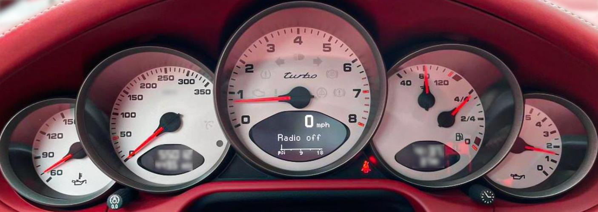

# 前言

在旧金山生机勃勃的街道上，创新如同 US Route 101 上川流不息的自动驾驶车辆一样稀松平常，我们置身于一个精彩纷呈的人工智能世界之中。AI 的飞速发展正在方方面面重新定义我们的日常生活。过去 20 年间，我们先后见证了推荐引擎（2000 年代）、AI 助手（2010 年代）和完全自动驾驶汽车（2020 年代）。而 2030 年代将更加激动人心——AI 正以极快的速度演进，并对社会产生巨大影响。

我个人踏入这个瞬息万变的 AI 系统性能工程（AI systems performance engineering）领域，源于一种好奇心：我想弄清楚，那些驱动着复杂系统与高影响力应用场景的顶尖硬件、高度优化的软件与精巧算法之间，究竟是如何达成微妙平衡与协同设计（codesign）的。正是这份领悟，促使我一头扎进“全栈”AI 性能工程的天地。我想理解处理器、内存架构、网络互连、操作系统、软件框架等诸多组件是如何彼此协调、和谐运转的。这些交互的复杂性既是挑战，也是机遇——它们点燃了我深入钻研、探索这一独特技术组合的渴望。

这本书是我多年来作为一名亲力亲为的 ML 与 AI 性能工程师不断探索的结晶。我为工程师、研究人员、从业者以及爱好者而写，他们渴望在各个层面理解 AI 系统性能的底层原理。读者也许正在构建 AI 应用、优化神经网络的训练策略，或是设计和管理可扩展的推理服务器；也可能只是单纯着迷于现代 AI 系统的运作机理。总而言之，本书提供的洞见能够跨越多个学科，在理论与实践之间架起桥梁。

本书的读者大概率已经对神经网络有基础性的理解，并对 Python 和 ML 有初步的了解。不过，即便不具备这些基础，一位充满好奇心的读者也能够跟上这条贯穿硬件、软件与算法、植根于第一性原理的多维协同设计性能主线。我保证，**这本书里对每一类读者都有值得一读之处**——我也敢担保，每位读者都能在这些篇章中学到一些新东西。

在各个章节中，我们会考察硬件架构的演进，深入软件优化的细微之处，并透过真实世界的案例研究，揭示构建高性能且高性价比的 AI 系统的模式与最佳实践。每一节都以前一节为基础层层递进，涵盖从基础概念到高级应用的方方面面。

## 本书排版约定

本书使用以下排版约定：

*斜体（Italic）*
: 表示新术语、URL、电子邮件地址、文件名和文件扩展名。

`等宽字体（Constant width）`
: 用于程序清单，以及在段落中指代程序元素，例如变量名或函数名、数据库、数据类型、环境变量、语句和关键字。

**`等宽粗体（Constant width bold）`**
: 表示应由用户逐字输入的命令或其他文本。

*`等宽斜体（Constant width italic）`*
: 表示应替换为用户提供的值、或由上下文决定的值的文本。

> 该图标表示提示或建议。

> 该图标表示一般性说明。

## 使用代码示例

补充材料（代码示例、练习等）可从 https://github.com/cfregly/ai-performance-engineering 下载。

如果你在使用代码示例时遇到技术问题或困难，请发送电子邮件至 support@oreilly.com。

本书旨在帮助你完成工作。一般而言，本书随附的示例代码，你都可以在自己的程序和文档中使用。除非你要复制代码中相当大的一部分，否则无需联系我们获取许可。例如，编写一个使用本书若干代码片段的程序无需许可；而销售或分发 O'Reilly 图书中的示例则需要许可。通过引用本书并援引示例代码来回答问题无需许可；但将本书中大量示例代码收录进你产品的文档中则需要许可。

我们欢迎但通常不强制要求署名。署名通常包括书名、作者、出版商和 ISBN。例如：“*AI Systems Performance Engineering*（《AI 系统性能工程》），作者 Chris Fregly（O'Reilly 出版）。版权所有 2026 Flux Capacitor, LLC，979-8-341-62778-9。”

如果你认为自己对代码示例的使用超出了合理使用范围或上述许可范围，欢迎通过 permissions@oreilly.com 与我们联系。

## O'Reilly 在线学习平台

40 多年来，O'Reilly Media 一直致力于提供技术和商业培训、知识与洞见，助力企业取得成功。

我们拥有一个由专家和创新者组成的独特网络，他们通过图书、文章以及我们的在线学习平台分享各自的知识与专长。O'Reilly 的在线学习平台让你能够按需访问现场培训课程、深入的学习路径、交互式编程环境，以及来自 O'Reilly 和 200 多家其他出版商的海量文本与视频资源。欲了解更多信息，请访问 https://oreilly.com。

## 如何联系我们

有关本书的意见和问题，请与出版商联系：

- O'Reilly Media, Inc.
- 141 Stony Circle, Suite 195
- Santa Rosa, CA 95401
- 800-889-8969（美国或加拿大境内）
- 707-827-7019（国际或本地）
- 707-829-0104（传真）
- support@oreilly.com
- https://oreilly.com/about/contact.html

我们为本书设有一个网页，上面列出了勘误表和其他补充信息。你可以通过 https://oreil.ly/AI-SysPerfEng 访问该页面。

如需了解我们图书和课程的最新消息与资讯，请访问 https://oreilly.com。

在 LinkedIn 上关注我们：https://linkedin.com/company/oreilly-media。

在 YouTube 上观看我们的内容：https://youtube.com/oreillymedia。

## 致谢

虽然本书由我独立撰写，但这项工作建立在众多毕生投身于这些主题的从业者与学者的成果之上。我对那些以研究和创新为本书所涵盖主题铺平道路的杰出人士深怀感激。他们的贡献塑造了本书的内容与深度。我要感谢通读全书的审校者（Adrian Cockcroft、Antje Barth、Arpitha Moorthy、Chaim Rand、Fabrizio Milo、Simon Zamarin、Suneeta Mall 和 Todd Bezenek），以及许多兼职审校者，是他们极大地提升了本书的整体质量。你们既挑战了我，也挑战了我对这些复杂主题的理解。你们的真知灼见融入了本书的每一页。

我要特别感谢来自 Meta 的 Mark Saroufim。他和他一手打造的成功社区 GPU Mode 让我意识到，确实需要这类深入的技术内容——涵盖横跨 PyTorch、CUDA 与 GPU 的软硬件协同设计。我深知，为这类高级主题维护并壮大一个大型社区需要付出多少心血。

还要感谢我亲爱的家人（Ann Marie、Meredith、Tommy 和 Conor），是你们始终如一的支持，让我得以彻夜写作、伏案到清晨。过去一年里，探望你们时我未必总是“全身心在场”，对此我深表歉意——那会儿我正躲在地下室里做研究、写代码、码字呢！

说来或许有点古怪，我还想感谢我的爱车——“小红帽”（Little Red Whiting Hood，图 P-1）。你是一套精密调校的硬件与软件所构成的复杂而多学科的系统。自 15 年多前我开启这段旧金山之旅起，你就一直陪伴着我。每次驾驶你，你都会提醒我当初为何要成为一名工程师。若以 GPU 世代来类比，你相当于 NVIDIA Ampere A100——一款由多学科工程师用当时最高性能的部件打造的不朽经典。尽管你最初是为风冷（Luftkühlung）而设计的，但你也明白，要榨取最高性能就必须上水冷（Wasserkühlung）。你的缔造者一代又一代地固执而不懈地挑战着你的物理工程极限。你的涡轮就像 Tensor Core（张量核心），一旦被逼得太狠，就会既闹脾气又发烫。我永远不会舍弃你。

正如经典 Phish 乐队歌曲《Contact》中的歌词所唱：

> 十一月的某个清晨我醒来
> 忽然意识到我爱你
> 不是因为你车前的头灯
> 你的排气管，或你头顶的天窗
> 而是当狂风想将你推搡时
> 你紧贴路面的那份执着
> 我绝不会独自驱车离去
> 归来时却不带上你

谢谢你鼓励我拥抱机械同理心（mechanical sympathy），小红！

*图 P-1. 一辆高性能、富有机械同理心的保时捷 911 Turbo 的仪表盘，它的名字叫“小红帽”（Little Red Whiting Hood）（白色车身，红色内饰）*

当我们继续拓展人工智能与超级计算的前沿时，本书中的知识旨在启迪、教育并赋能每一位读者。穿行于 AI 系统性能工程（AI Systems Performance Engineering）的重重复杂性之中，这不仅是一场技术探索——它更提醒着我们：人类的智慧、理解自身所处环境的必要，以及通过技术与创新持续精进的渴望。这个世界上，真正懂得如何协同设计硬件、软件与算法以实现极致性能和效率的人寥寥无几。**读完本书，你将成为其中一员！**

Chris Fregly

美国加利福尼亚州，旧金山
