# Chapter 12. Dynamic Scheduling, CUDA Graphs, and Device-Initiated Kernel Orchestration

# 第 12 章 动态调度、CUDA Graphs 与设备端发起的核函数编排

So far, we have unlocked compute and memory throughput at the individual kernel level. Now it’s time to orchestrate these kernels so the GPU never goes idle.

到目前为止，我们已经在单个核函数层面释放了计算与访存吞吐。现在，是时候对这些核函数进行编排，让 GPU 永不空闲。

In this chapter, we move from scheduling on the host to scheduling on the device itself. We’ll explore dynamic work queues driven by fast L2-cache atomics, collapse repeated kernel launches, and use CUDA Graphs for batching fixed pipelines and minimizing CPU handshakes.

在本章中，我们将从在主机上调度转向在设备本身上调度。我们会探索由快速的 L2 缓存原子操作驱动的动态工作队列，折叠掉重复的核函数启动，并用 CUDA Graphs 来批处理固定的流水线、把 CPU 握手降到最少。

Then we’ll push orchestration even further, with device-side graph launches and dynamic parallelism. These let the GPU decide what to run next without needing to call back to the CPU.

接着，我们会用设备侧的图启动与动态并行（dynamic parallelism，DP），把编排推得更远。它们让 GPU 自己决定接下来运行什么，而无需回调 CPU。

Finally, we’ll dive into a multi-GPU environment by overlapping peer-to-peer copies, NCCL collectives, CUDA-aware MPI, and NVSHMEM one-sided puts/gets. This way, clusters of GPUs behave like one giant, shared-memory coprocessor. For instance, NVIDIA’s DGX GB200 NVL72 system connects 36 Grace CPUs and 72 Blackwell GPUs into a single NVLink domain with unified addressing and up to 30 TB of combined CPU and GPU unified memory within that domain. It enables remote HBM access across the NVLink fabric inside the 72-GPU domain. Larger NVLink network topologies can extend beyond a single rack.

最后，我们会进入多 GPU 环境，重叠点对点拷贝、NCCL 集合操作、CUDA-aware MPI 与 NVSHMEM 的单边 put/get 操作。这样一来，成群的 GPU 就表现得像一个巨大的、共享内存的协处理器。例如，NVIDIA 的 DGX GB200 NVL72 系统把 36 颗 Grace CPU 和 72 颗 Blackwell GPU 连接进单一 NVLink 域，具备统一寻址，且该域内 CPU 与 GPU 合计的统一内存最高可达 30 TB。它可以在这个 72-GPU 域内，通过 NVLink fabric 实现跨设备的远程 HBM 访问。更大的 NVLink 网络拓扑可以延伸到单个机架之外。

Along the way, we’ll tie each technique back to roofline analysis, helping you choose the right tool—streams, graphs, atomics, or dynamic kernels—to increase your kernel’s operational intensity. This will help improve your workload’s overall performance.

在这一过程中，我们会把每种技术都与 roofline 分析联系起来，帮助你选对工具——streams、graphs、原子操作或动态核函数——来提高核函数的运算强度（operational intensity）。这将有助于提升整个工作负载的总体性能。

By the end of this chapter, you will have an understanding of dynamic, device-side, and graph-based kernel orchestration techniques that keep every SM fed across multi-GPU clusters.

读完本章，你将理解动态的、设备侧的以及基于图的核函数编排技术，它们能在多 GPU 集群中让每一个 SM 都保持满负荷。

## Dynamic Scheduling with Atomic Work Queues

## 用原子工作队列做动态调度

Uneven work assignments between threads can leave some SMs idle while others are still busy. This wastes compute resources and reduces overall throughput.

线程之间工作分配不均，会让一些 SM 空闲，而另一些仍在忙碌。这浪费了计算资源，也降低了整体吞吐。

Imbalance often occurs when different threads or blocks process variable amounts of work due to input-dependent loops or conditional workloads. Some blocks complete quickly, leaving their SMs idle, while other SMs continue with longer-running blocks. On modern GPUs with hundreds of SMs, idle periods can leave many SMs idle if work is not evenly distributed. This can significantly hurt performance.

当不同线程或线程块由于依赖输入的循环或条件工作负载而处理数量不等的工作时，往往会出现不均衡。有些线程块很快完成，让它们的 SM 空闲下来，而另一些 SM 则继续执行运行更久的线程块。在拥有数百个 SM 的现代 GPU 上，如果工作分配不均，空闲时段可能让许多 SM 闲置。这会显著损害性能。

By the time the longest-running work finishes, a portion of the GPU has been idle. This reduces the achieved occupancy since many cycles ran with no active warps. Remember that you can use Nsight Systems to profile and show these idle gaps clearly on the GPU timeline.

等到运行时间最长的那部分工作完成时，GPU 的一部分已经空闲了一段时间。这降低了实际达成的占用率（occupancy），因为许多周期在没有活跃 warp 的情况下运行。记住，你可以用 Nsight Systems 做剖析，把这些空闲间隙（idle gap）清晰地展示在 GPU 时间线上。

You can also compare active SM cycles to total elapsed SM cycles to gauge underutilization. Nsight Compute provides this as a single metric, which represents the fraction of time that at least one warp was active. A low active-to-elapsed ratio indicates that many cycles ran with no active warps. In other words, the GPU was often idle.

你还可以把活跃 SM 周期与总的已流逝 SM 周期做对比，以衡量利用不足的程度。Nsight Compute 把它作为单一指标提供，代表至少有一个 warp 处于活跃状态的时间占比。较低的活跃-流逝比表明许多周期在没有活跃 warp 的情况下运行。换句话说，GPU 经常处于空闲。

In addition to Nsight Systems, you can use Nsight Compute to inspect achieved occupancy (the average fraction of active warps per SM relative to the hardware maximum) or the SM Active cycles percentage (the fraction of time at least one warp was active) to quantify this underutilization.

除了 Nsight Systems，你还可以用 Nsight Compute 来检查实际达成的占用率（每个 SM 平均活跃 warp 占硬件上限的比例）或 SM Active 周期百分比（至少有一个 warp 活跃的时间占比），以量化这种利用不足。

> To correlate timeline gaps with specific code sections, insert NVTX range markers around significant GPU work.

> 若要把时间线上的间隙与具体的代码段关联起来，可在关键的 GPU 工作周围插入 NVTX range 标记。

Next, we’ll discuss how to implement atomic queues to allocate work dynamically inside a kernel. These are important to balance arbitrary workloads across all SMs to avoid idle threads. Before we do that, we need to introduce atomic counters.

接下来，我们将讨论如何实现原子队列，以便在核函数内部动态分配工作。它们对于在所有 SM 间均衡任意工作负载、避免线程空闲非常重要。在此之前，我们需要先引入原子计数器（atomic counter）。

### Atomic Counters

### 原子计数器

Atomic counters are the foundation for atomic queues, which allow dynamic work allocation.

原子计数器是原子队列的基础，而原子队列可以实现动态工作分配。

On modern GPUs, global atomics are serviced and serialized in the on-device L2 cache. This reduces latency versus DRAM round trips when the target line is resident. Atomic counters still incur latency and serialize under contention. But uncontended atomicAdd operations happen extremely quickly by remaining on-chip. An example of two threads incrementing an atomic is shown in Figure 12-1.

在现代 GPU 上，全局原子操作在设备端的 L2 缓存中被服务并串行化。当目标缓存行常驻时，这比往返 DRAM 的延迟更低。原子计数器仍会带来延迟，并在争用（contention）下串行化。但无争用的 atomicAdd 操作由于保持在片上，因而极其快速。图 12-1 展示了两个线程对一个原子变量做递增的示例。

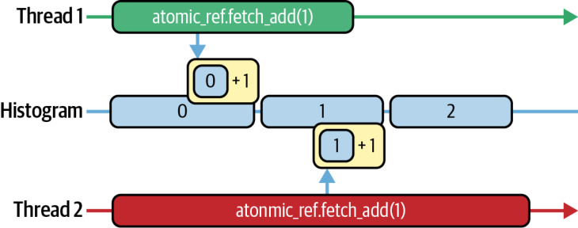


However, atomicAdd does not come for free. It still has latency and, under contention, can serialize threads waiting on the same memory address. As such, the L2 needs to serialize the updates as well. This creates a hotspot, which needs to be optimized. Nsight Compute can help you quantify the cost.

然而，atomicAdd 并非没有代价。它仍然有延迟，并且在争用下，会串行化那些等待同一内存地址的线程。因此，L2 也需要把这些更新串行化。这会制造一个热点，需要加以优化。Nsight Compute 可以帮你量化其成本。

In the Memory Workload Analysis section of Nsight Compute, you’ll find atomic_transactions and atomic_transactions_per_request. The atomic transactions counter represents the total number of L2-cache atomic transactions, including any replays caused by contention. The atomic transactions per request metric, or contention ratio, represents the average number of L2 transactions generated by each atomicAdd instruction.

在 Nsight Compute 的 Memory Workload Analysis 部分，你会看到 atomic_transactions 和 atomic_transactions_per_request。原子事务计数器代表 L2 缓存原子事务的总数，包括由争用引起的任何重放。原子事务每请求数（atomic transactions per request）这个指标，或称争用率，代表每条 atomicAdd 指令平均产生的 L2 事务数。

When every atomicAdd fires exactly one L2 transaction, your atomic_transac tions_per_request hovers around 1.0, which means it’s paying the bare minimum. If this ratio climbs above 1.0, it signals that the threads are stalling and retrying atomic updates instead of doing useful work. Each retry indicates contention.

当每条 atomicAdd 恰好触发一次 L2 事务时，你的 atomic_transactions_per_request 会徘徊在 1.0 附近，这意味着它只付出了最低限度的代价。如果这个比率攀升到 1.0 以上，就说明线程在停顿并重试原子更新，而不是在做有用的工作。每一次重试都表明存在争用。

The optimization here is to amortize your atomics by grabbing work in batches. So instead of each thread, or warp, performing an atomicAdd, you batch a group of tasks per atomic. Here is the before and after with a batch size of 32:

这里的优化是通过批量抓取工作来摊薄原子操作的成本。因此，与其让每个线程或每个 warp 各自执行一次 atomicAdd，不如让每次原子操作批量领取一组任务。下面是批大小为 32 时的优化前后对比：

```
// Before batching
int idx = atomicAdd(&queue_head, 1);
if (idx < N) process(data[idx]);
// After batching
const int batchSize = 32;
int start = atomicAdd(&queue_head, batchSize);
for (int i = start; i < start + batchSize && i < N; ++i) {
    process(data[i]);
}
```

```
// Before batching
int idx = atomicAdd(&queue_head, 1);
if (idx < N) process(data[idx]);
// After batching
const int batchSize = 32;
int start = atomicAdd(&queue_head, batchSize);
for (int i = start; i < start + batchSize && i < N; ++i) {
    process(data[i]);
}
```

Now a single atomic update awards a warp (or thread block) a whole slice of work—32 items in this example—before touching the counter again. You still pay one L2 transaction per batch, but you do 32× as much useful work in between.

现在，单次原子更新就把一整片工作——本例中是 32 个工作项——授予一个 warp（或线程块），之后才会再次触及计数器。你仍然每批付出一次 L2 事务，但在这两次之间做了 32 倍的有用工作。

In practice, only one thread per warp performs this atomicAdd to fetch the next batch start index. The thread then broadcasts it to the rest of the warp (e.g., using __shfl_sync). The entire warp then processes those 32 items in parallel. This produces one atomic operation per warp instead of per thread, drastically reducing contention.

在实践中，每个 warp 中只有一个线程执行这次 atomicAdd 来获取下一批的起始索引。该线程随后把它广播给 warp 中的其余线程（例如用 __shfl_sync）。整个 warp 接着并行处理这 32 个工作项。这样每个 warp 只产生一次原子操作，而不是每个线程一次，从而大幅降低争用。

In Nsight Compute you’ll see atomic_transactions plummet and your transactions-per-request collapse back toward 1.0. This proves that you’ve traded costly contention for sustained computation.

在 Nsight Compute 中，你会看到 atomic_transactions 骤降，你的事务每请求数回落到 1.0 附近。这证明你已经用持续的计算换掉了昂贵的争用。

With modern GPUs in which L2-cache atomics are exceptionally fast, even a modest batch size of 8 or 16 can eliminate most contention due to the high L2 bandwidth. That said, always verify that you haven’t simply shifted the bottleneck elsewhere.

在现代 GPU 上，L2 缓存原子操作异常快速，得益于很高的 L2 带宽，即便是 8 或 16 这样不大的批大小，也能消除大部分争用。话虽如此，务必要验证你没有只是把瓶颈转移到了别处。

To verify that this optimization hasn’t negatively affected other performance metrics, use Nsight Compute’s Warp Stall Reasons and Register Pressure reports to make sure your fused loop isn’t now limited by register spills or shared-memory bank conflicts.

为验证这项优化没有对其他性能指标产生负面影响，请使用 Nsight Compute 的 Warp Stall Reasons 和 Register Pressure 报告，确认你融合后的循环现在不会受制于寄存器溢出或共享内存 bank 冲突。

> If atomics are still hot after these optimizations, consider alternative designs like per-block counters or hierarchical reduction of work distribution.

> 如果在这些优化之后原子操作依然很热，可以考虑其他设计，例如按块计数器（per-block counter）或对工作分配做分层归约。

In short, by batching work per atomic operation, you keep the GPU’s many warps busy doing real computation. This is in contrast to queuing up at a single counter that can’t keep up.

简而言之，通过按原子操作批量领取工作，你能让 GPU 的众多 warp 忙于真正的计算。这与在单个跟不上节奏的计数器前排队形成鲜明对比。

### Atomic Queues

### 原子队列

Let’s now use a global atomic counter to coordinate a dynamic work queue. The goal is to use the atomic counter and atomicAdd to balance arbitrary workloads across all SMs so that no thread, or warp, sits idle. An example of this dynamic work queue is shown in Figure 12-2.

现在，让我们用一个全局原子计数器来协调一个动态工作队列。目标是用原子计数器和 atomicAdd 在所有 SM 间均衡任意工作负载，让任何线程或 warp 都不会闲置。图 12-2 展示了这种动态工作队列的一个示例。

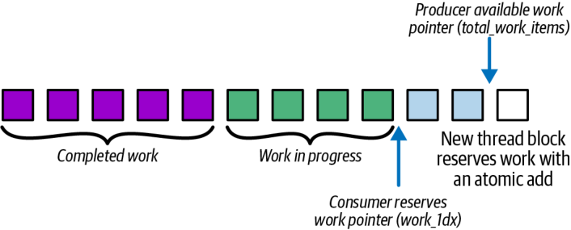


In the next code example (computeKernel), each thread computes a different number of iterations based on idx % 256. Threads with a small value for idx % 256 do very little work, while threads with a large value for idx % 256 will do a lot of work. As a result of this imbalance, threads finish at different times, and some SMs go idle waiting for the longest threads to complete. Here is the code that uses a static, uneven workload per thread:

在接下来的代码示例（computeKernel）中，每个线程根据 idx % 256 计算不同数量的迭代。idx % 256 值较小的线程做的工作很少，而 idx % 256 值较大的线程会做大量工作。由于这种不均衡，线程在不同时间完成，一些 SM 会空闲下来，等待运行时间最长的线程完成。下面是使用每线程静态、不均衡工作负载的代码：

```
// uneven_static.cu
#include <cuda_runtime.h>
#include <cmath>
__global__ void computeKernel(const float* input, float* output, int N) {
    int idx = blockIdx.x * blockDim.x + threadIdx.x;
    if (idx < N) {
        // Each thread does a variable amount of work based on idx
        int work = idx % 256;
        float result = 0.0f;
        for (int i = 0; i < work; ++i) {
            result += sinf(input[idx]) * cosf(input[idx]);
        }
        output[idx] = result;
    }
}
int main() {
    const int N = 1<<20;
    float* h_in = nullptr;
    float* h_out = nullptr;
    cudaMallocHost(&h_in, N * sizeof(float));
    cudaMallocHost(&h_out, N * sizeof(float));
    for (int i = 0; i < N; ++i) h_in[i] = float(i) / N;
    float *d_in, *d_out;
    cudaMalloc(&d_in, N * sizeof(float));
    cudaMalloc(&d_out, N * sizeof(float));
    cudaMemcpy(d_in, h_in, N * sizeof(float), cudaMemcpyHostToDevice);
    dim3 block(256), grid((N + 255) / 256);
    computeKernel<<<grid, block>>>(d_in, d_out, N);
    cudaDeviceSynchronize();
    cudaMemcpy(h_out, d_out, N * sizeof(float), cudaMemcpyDeviceToHost);
    cudaFree(d_in);
    cudaFree(d_out);
    cudaFreeHost(h_in);
    cudaFreeHost(h_out);
    return 0;
}
```

```
// uneven_static.cu
#include <cuda_runtime.h>
#include <cmath>
__global__ void computeKernel(const float* input, float* output, int N) {
    int idx = blockIdx.x * blockDim.x + threadIdx.x;
    if (idx < N) {
        // Each thread does a variable amount of work based on idx
        int work = idx % 256;
        float result = 0.0f;
        for (int i = 0; i < work; ++i) {
            result += sinf(input[idx]) * cosf(input[idx]);
        }
        output[idx] = result;
    }
}
int main() {
    const int N = 1<<20;
    float* h_in = nullptr;
    float* h_out = nullptr;
    cudaMallocHost(&h_in, N * sizeof(float));
    cudaMallocHost(&h_out, N * sizeof(float));
    for (int i = 0; i < N; ++i) h_in[i] = float(i) / N;
    float *d_in, *d_out;
    cudaMalloc(&d_in, N * sizeof(float));
    cudaMalloc(&d_out, N * sizeof(float));
    cudaMemcpy(d_in, h_in, N * sizeof(float), cudaMemcpyHostToDevice);
    dim3 block(256), grid((N + 255) / 256);
    computeKernel<<<grid, block>>>(d_in, d_out, N);
    cudaDeviceSynchronize();
    cudaMemcpy(h_out, d_out, N * sizeof(float), cudaMemcpyDeviceToHost);
    cudaFree(d_in);
    cudaFree(d_out);
    cudaFreeHost(h_in);
    cudaFreeHost(h_out);
    return 0;
}
```

> There isn’t a high-level PyTorch API for dynamic GPU-side work distribution, so we would need to implement it with a custom CUDA kernel. We leave that out for brevity.

> PyTorch 并没有用于设备侧动态工作分配的高层 API，因此我们需要用一个自定义 CUDA 核函数来实现它。为简洁起见，此处从略。

In the optimized dynamic task dispatch version shown next, a single global counter (in device memory) is used as a warp-level work queue. We turn the counter into a persistent warp-level work queue using batched atomics. This way, the warps that finish early immediately fetch another batch instead of idling:

在接下来展示的优化后动态任务派发版本中，一个单独的全局计数器（位于设备内存中）被用作 warp 级的工作队列。我们用批量原子操作把这个计数器变成一个持久的 warp 级工作队列。这样，提前完成的 warp 会立刻抓取下一批工作，而不是空转：

```
// uneven_dynamic.cu
#include <cuda_runtime.h>
__device__ unsigned int globalIndex = 0;
// Warp-batched dynamic queue: 1 atomic per active warp
__global__ void computeKernelDynamicBatch(const float* input,
                                          float* output,
                                          int N) {
  // lane id in [0,31]
  int lane = threadIdx.x & (warpSize - 1);
  while (true) {
    // Elect an active leader each iteration (handles divergence safely)
    unsigned mask = __activemask();
    int leader = __ffs(mask) - 1;
    // Warp leader atomically grabs a contiguous batch for the whole warp
    unsigned int base = 0;
    if (lane == leader) {
      base = atomicAdd(&globalIndex, warpSize);
    }
    // Broadcast starting index to all active lanes in the warp
    base = __shfl_sync(mask, base, leader);
    unsigned int idx = base + lane;
    if (idx >= (unsigned)N) break;  // dynamic termination
    // Hoist invariants out of the variable trip-count loop
    // Note: You can also use __sincosf on Blackwell
    float s = sinf(input[idx]);
    float c = cosf(input[idx]);
    int   work = idx % 256;
    float result = 0.0f;
    #pragma unroll 1
    for (int i = 0; i < work; ++i) {
      result += s * c;
    }
    output[idx] = result;
    // loop continues until counter >= N
  }
}
int main() {
    const int N = 1 << 20;
    float *d_in, *d_out;
    cudaMalloc(&d_in,  N * sizeof(float));
    cudaMalloc(&d_out, N * sizeof(float));
    // Host buffers (pinned) for a realistic data path
    float *h_in = nullptr, *h_out = nullptr;
    cudaMallocHost(&h_in,  N * sizeof(float));
    cudaMallocHost(&h_out, N * sizeof(float));
    for (int i = 0; i < N; ++i) {
        h_in[i] = static_cast<float>(i % 1000);
    }
    // Copy inputs to device
    cudaMemcpy(d_in, h_in, N * sizeof(float),
        cudaMemcpyHostToDevice);
    // Reset global counter
    unsigned int zero = 0;
    // If you call this kernel repeatedly (e.g., in a loop),
    // reset 'globalIndex' to 0 before each launch.
    cudaMemcpyToSymbol(globalIndex, &zero,
        sizeof(unsigned int));
    // Launch with 256 threads per block
    dim3 block(256), grid((N + 255) / 256);
    cudaStream_t stream;
    cudaStreamCreateWithFlags(&stream, cudaStreamNonBlocking);
    computeKernelDynamicBatch<<<grid, block, 0, stream>>>(d_in, d_out, N);
    cudaStreamSynchronize(stream);
    cudaStreamDestroy(stream);
    cudaDeviceSynchronize();
    // Copy results back and clean up
    cudaMemcpy(h_out, d_out, N * sizeof(float),
               cudaMemcpyDeviceToHost);
    cudaFree(d_in);
    cudaFree(d_out);
    cudaFreeHost(h_in);
    cudaFreeHost(h_out);
    return 0;
}
```

```
// uneven_dynamic.cu
#include <cuda_runtime.h>
__device__ unsigned int globalIndex = 0;
// Warp-batched dynamic queue: 1 atomic per active warp
__global__ void computeKernelDynamicBatch(const float* input,
                                          float* output,
                                          int N) {
  // lane id in [0,31]
  int lane = threadIdx.x & (warpSize - 1);
  while (true) {
    // Elect an active leader each iteration (handles divergence safely)
    unsigned mask = __activemask();
    int leader = __ffs(mask) - 1;
    // Warp leader atomically grabs a contiguous batch for the whole warp
    unsigned int base = 0;
    if (lane == leader) {
      base = atomicAdd(&globalIndex, warpSize);
    }
    // Broadcast starting index to all active lanes in the warp
    base = __shfl_sync(mask, base, leader);
    unsigned int idx = base + lane;
    if (idx >= (unsigned)N) break;  // dynamic termination
    // Hoist invariants out of the variable trip-count loop
    // Note: You can also use __sincosf on Blackwell
    float s = sinf(input[idx]);
    float c = cosf(input[idx]);
    int   work = idx % 256;
    float result = 0.0f;
    #pragma unroll 1
    for (int i = 0; i < work; ++i) {
      result += s * c;
    }
    output[idx] = result;
    // loop continues until counter >= N
  }
}
int main() {
    const int N = 1 << 20;
    float *d_in, *d_out;
    cudaMalloc(&d_in,  N * sizeof(float));
    cudaMalloc(&d_out, N * sizeof(float));
    // Host buffers (pinned) for a realistic data path
    float *h_in = nullptr, *h_out = nullptr;
    cudaMallocHost(&h_in,  N * sizeof(float));
    cudaMallocHost(&h_out, N * sizeof(float));
    for (int i = 0; i < N; ++i) {
        h_in[i] = static_cast<float>(i % 1000);
    }
    // Copy inputs to device
    cudaMemcpy(d_in, h_in, N * sizeof(float),
        cudaMemcpyHostToDevice);
    // Reset global counter
    unsigned int zero = 0;
    // If you call this kernel repeatedly (e.g., in a loop),
    // reset 'globalIndex' to 0 before each launch.
    cudaMemcpyToSymbol(globalIndex, &zero,
        sizeof(unsigned int));
    // Launch with 256 threads per block
    dim3 block(256), grid((N + 255) / 256);
    cudaStream_t stream;
    cudaStreamCreateWithFlags(&stream, cudaStreamNonBlocking);
    computeKernelDynamicBatch<<<grid, block, 0, stream>>>(d_in, d_out, N);
    cudaStreamSynchronize(stream);
    cudaStreamDestroy(stream);
    cudaDeviceSynchronize();
    // Copy results back and clean up
    cudaMemcpy(h_out, d_out, N * sizeof(float),
               cudaMemcpyDeviceToHost);
    cudaFree(d_in);
    cudaFree(d_out);
    cudaFreeHost(h_in);
    cudaFreeHost(h_out);
    return 0;
}
```

Each warp atomically claims the next batch of tasks of size warpSize (32 threads) from the global queue and processes them in a loop. This makes sure that no SM ever goes idle. This code performs dynamic work distribution implemented with a single global atomic work queue.

每个 warp 从全局队列中原子地领取下一批大小为 warpSize（32 个线程）的任务，并在循环中处理它们。这确保了任何 SM 都不会空闲。这段代码实现了用单个全局原子工作队列完成的动态工作分配。

Here, each warp repeatedly pulls the next batch base index from that global counter. The first thread (if (lane==0)) of each warp, called the warp leader, performs an atomic add to get the starting index of this contiguous block using base=atomicAdd(&globalIndex, warpSize). It then broadcasts this base to the rest of its warp using __shfl_sync(__activemask(), base, 0), as described earlier in the chapter.

在这里，每个 warp 反复从那个全局计数器中拉取下一批的 base 索引。每个 warp 的第一个线程（if (lane==0)），称为 warp leader，执行一次原子加，用 base=atomicAdd(&globalIndex, warpSize) 获取这一连续块的起始索引。随后它用 __shfl_sync(__activemask(), base, 0) 把这个 base 广播给 warp 中的其余线程，正如本章前面所述。

In other words, instead of each thread being tied to a fixed element index, every warp now grabs a contiguous block of tasks from a shared counter. It then computes using idx = base + lane.

换句话说，不再是每个线程被绑定到一个固定的元素索引，现在每个 warp 都从一个共享计数器中抓取一个连续的任务块。然后它用 idx = base + lane 进行计算。

All threads in that warp execute the same sin/cos loop for their dynamically fetched indices. As such, work is no longer preassigned per thread. Instead, work is pulled and balanced at runtime using the global atomic queue.

该 warp 中的所有线程都为其动态获取的索引执行相同的 sin/cos 循环。因此，工作不再是按线程预先分配的。相反，工作是在运行时通过全局原子队列拉取并均衡的。

Remember that the if (idx >= N) bounds check will cause the warp to exit when there’s no more work to do. This prevents out-of-bounds memory accesses. Otherwise, each thread in the warp executes the exact same sin/cos loop as in the static version.

记住，if (idx >= N) 的边界检查会在没有更多工作时让 warp 退出。这防止了越界内存访问。除此之外，warp 中的每个线程都会执行与静态版本中完全相同的 sin/cos 循环。

In a simple microbenchmark with N = 1 << 20 and work = idx % 256, the statically assigned kernel took about 200 ms, whereas the dynamic-queue version ran in roughly 100 ms. This 2× speedup is a result of eliminating SM idle time and reducing atomic contention. Nsight Compute defines active SM cycles as the fraction of elapsed cycles with at least one active warp.

在一个简单的微基准测试中，N = 1 << 20 且 work = idx % 256，静态分配的核函数耗时约 200 ms，而动态队列版本大约在 100 ms 内运行完成。这 2× 的加速是消除 SM 空闲时间并减少原子争用的结果。Nsight Compute 把活跃 SM 周期定义为至少有一个活跃 warp 的已流逝周期占比。

The speedup will vary depending on the work imbalance, but dynamic work distribution is an optimization worth exploring any time your profiling shows warp-idle stalls, low achieved occupancy, or visible timeline gaps from uneven per-task runtimes. In these scenarios, especially with moderate imbalance, you can often get a 10%–20% speedup.

加速幅度会随工作不均衡程度而变化，但只要你的剖析显示出 warp 空闲停顿、实际占用率偏低，或时间线上因每任务运行时长不均而出现可见的间隙，动态工作分配就是一项值得探索的优化。在这些场景中，尤其是在中等不均衡的情况下，你通常能获得 10%–20% 的加速。

> In extreme-imbalance cases, you can get this 2× speedup simply by replacing static indexing with an atomic-driven work queue. For mild imbalance, the overhead of the atomic and shuffle may offset gains.

> 在极端不均衡的情况下，你只需把静态索引替换为原子驱动的工作队列，就能获得这 2× 的加速。对于轻度不均衡，原子操作和 shuffle 的开销可能会抵消收益。

In short, dynamic work distribution ensures near-uniform SM utilization since every warp keeps fetching and processing new tasks until the counter exceeds N. This is in contrast to many warps finishing long before the slowest ones and leaving hardware resources unused.

简而言之，动态工作分配确保了近乎均匀的 SM 利用率，因为每个 warp 都持续抓取并处理新任务，直到计数器超过 N。这与许多 warp 远早于最慢的那些 warp 完成、从而让硬件资源闲置的情形形成对比。

## CUDA Graphs

## CUDA Graphs

When your pipeline consists of multiple kernels, copies, stream-event records, and callbacks, launching them one by one on the host every iteration still incurs CPU overhead. CUDA Graphs let you capture that entire workflow once and replay it repeatedly with essentially zero CPU overhead. Figure 12-3 compares kernel launches without (top) and with (bottom) CUDA Graphs.

当你的流水线由多个核函数、拷贝、stream-event 记录和回调组成时，每次迭代都在主机上逐个启动它们，仍然会带来 CPU 开销。CUDA Graphs 让你把整套工作流一次性捕获下来，并以基本为零的 CPU 开销反复重放。图 12-3 对比了不使用（上）与使用（下）CUDA Graphs 时的核函数启动。

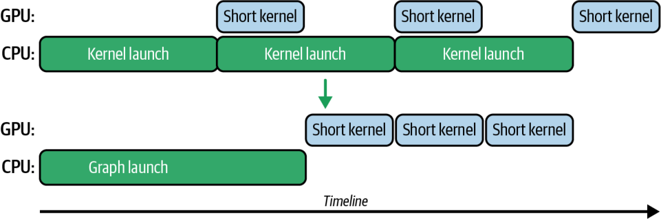


Why use CUDA Graphs? First, they cut down launch overhead. Multiple small kernels or copies can be launched with essentially one CPU call. Second, they enable better scheduling on the GPU. The work is submitted as a batch, so the CUDA driver can potentially reduce some internal latency between operations.

为什么要用 CUDA Graphs？首先，它们削减了启动开销。多个小核函数或拷贝基本上可以用一次 CPU 调用启动。其次，它们让 GPU 上的调度更好。工作作为一批提交，因此 CUDA 驱动有可能减少操作之间的一些内部延迟。

Also, with CUDA Graphs, dependencies are known upfront, so there’s less need for the CPU to synchronize in between. In the context of memory transfers, a CUDA Graph ensures that asynchronous copies and kernel executions are linked as dependencies correctly without any manual synchronization. It doesn’t inherently overlap copies and kernels more so than normal streams would, but a CUDA Graph streamlines their execution.

此外，使用 CUDA Graphs 时，依赖关系是预先已知的，因此 CPU 在其间同步的需求更少。在内存传输的场景中，CUDA Graph 确保异步拷贝与核函数执行被正确地关联为依赖，而无需任何手动同步。它并不会比普通 streams 天然地更多地重叠拷贝与核函数，但 CUDA Graph 会让它们的执行更顺畅。

### PyTorch, Inference Engines, and CUDA Graphs

### PyTorch、推理引擎与 CUDA Graphs

AI frameworks like PyTorch leverage CUDA Graphs under the hood for static portions of deep learning models. Specifically, PyTorch supports a torch.cuda.Graph context for capturing a sequence of operations. In addition, PyTorch continues to optimize its internals to use CUDA Graphs for predictable portions of code.

像 PyTorch 这样的 AI 框架会在底层利用 CUDA Graphs 来处理深度学习模型中的静态部分。具体来说，PyTorch 支持一个 torch.cuda.Graph 上下文，用于捕获一段操作序列。此外，PyTorch 持续优化其内部实现，把 CUDA Graphs 用于代码中可预测的部分。

High-performance inference engines like vLLM and NVIDIA’s TensorRT-LLM can also leverage CUDA Graphs by capturing a model’s execution into a set of predefined graphs for different sequence-length ranges and input-batch sizes. When graph capture is enabled, these systems often bucket or pad inputs to match supported graph batch sizes so that captured graphs can be replayed with fixed shapes. This can significantly reduce latency for large-scale, production inference workloads.

像 vLLM 和 NVIDIA 的 TensorRT-LLM 这样的高性能推理引擎，也可以通过把模型的执行捕获为一组针对不同序列长度范围和输入批大小的预定义图，来利用 CUDA Graphs。当启用图捕获（graph capture）时，这些系统常常会对输入进行分桶或填充，以匹配所支持的图批大小，从而让捕获的图能以固定形状重放。这可以显著降低大规模生产推理工作负载的延迟。

For example, you would capture one CUDA Graph per batch size during startup or model-load time. Then, at runtime, you would launch the precaptured graph that matches the incoming request’s batch size.

例如，你会在启动或模型加载时为每个批大小各捕获一个 CUDA Graph。然后，在运行时，你会启动与传入请求批大小相匹配的那个预捕获图。

> PyTorch compiler mode='reduce-overhead' may wrap eligible segments in CUDA Graphs to reduce launch overhead, subject to capture requirements such as static tensor addresses and CUDA-only regions. It does not guarantee graphing of all code paths. And it may increase memory use due to pooled buffers. Always profile to confirm benefits on your model.

> PyTorch 编译器的 mode='reduce-overhead' 可能会把符合条件的代码段包进 CUDA Graphs 以减少启动开销，但需满足捕获要求，例如静态张量地址和仅限 CUDA 的区域。它并不保证对所有代码路径都进行图化。而且它可能因池化缓冲区而增加内存占用。请始终通过剖析来确认在你的模型上确有收益。

### Memory Pools for CUDA Graphs

### CUDA Graphs 的内存池

One important consideration is memory management with CUDA Graphs. Memory operations inside a CUDA Graph obey the same rules as in CUDA streams. If you allocate GPU memory inside the capture, that allocation becomes part of the graph execution.

一个重要的考量是使用 CUDA Graphs 时的内存管理。CUDA Graph 内部的内存操作遵循与 CUDA streams 中相同的规则。如果你在捕获内部分配 GPU 内存，那次分配就会成为图执行的一部分。

You generally want to avoid allocating GPU memory inside your graph and preallocating memory outside of the graph. Many frameworks, such as PyTorch, use static memory pools with CUDA Graphs, as shown in Figure 12-4. The use of static memory pools keeps memory allocations from becoming part of the captured graph sequence.

你通常应当避免在图内部分配 GPU 内存，而是在图之外预先分配内存。许多框架（如 PyTorch）在使用 CUDA Graphs 时采用静态内存池（static memory pool），如图 12-4 所示。使用静态内存池可以避免内存分配成为捕获到的图序列的一部分。

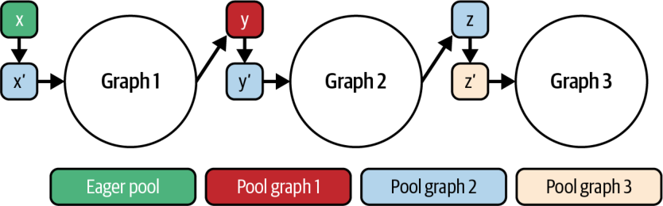


While CUDA Graphs won’t make an individual memory copy or kernel execution faster, they can automatically overlap independent data transfers and computations within the graph—similar to CUDA streams. This eliminates the per-iteration CPU scheduling and is made possible since the dependency graph is known upfront.

虽然 CUDA Graphs 不会让单次内存拷贝或核函数执行变得更快，但它们可以在图内部自动重叠相互独立的数据传输与计算——类似于 CUDA streams。这消除了每次迭代的 CPU 调度，并且由于依赖图预先已知，这才得以实现。

### Capturing a CUDA Graph with a CUDA Stream

### 用 CUDA Stream 捕获 CUDA Graph

To capture a graph, you call cudaStreamBeginCapture() on a stream, enqueue all your memory transfers (cudaMemcpyAsync()), kernel launches, events (cudaEventRecord()), and callbacks (cudaLaunchHostFunc()), then call cudaStreamEndCapture() to create a CUDA Graph definition (cudaGraph_t).

要捕获一个图，你需要在一个 stream 上调用 cudaStreamBeginCapture()，把你所有的内存传输（cudaMemcpyAsync()）、核函数启动、事件（cudaEventRecord()）和回调（cudaLaunchHostFunc()）入队，然后调用 cudaStreamEndCapture() 来创建一个 CUDA Graph 定义（cudaGraph_t）。

The CUDA driver can then launch the CUDA Graph with cudaGraphLaunch() every iteration. Because the CUDA driver knows the entire dependency graph in advance, it replays the prebuilt stream sequence directly on the GPU. This incurs minimal launch overhead.

之后，CUDA 驱动就可以在每次迭代用 cudaGraphLaunch() 启动这个 CUDA Graph。因为 CUDA 驱动预先知道整个依赖图，它会直接在 GPU 上重放预先构建好的 stream 序列。这带来的启动开销极小。

> cudaGraphExecUpdate, discussed in the next section, allows limited changes to a captured graph for scenarios where sizes, dimensions, or pointers change between iterations. This is useful if the size of the inputs varies since you can just update the graph’s node parameters instead of recapturing a whole new graph for each new input size.

> cudaGraphExecUpdate 将在下一节讨论，它允许对已捕获的图做有限的改动，以应对迭代之间尺寸、维度或指针发生变化的场景。当输入尺寸变化时这很有用，因为你可以直接更新图的节点参数，而不必为每个新的输入尺寸重新捕获一整张新图。

Even if only some of your pipeline is repetitive, CUDA Graphs can capture that portion. For example, if you always perform a Host → Device copy, followed by two kernels, followed by a Device → Host copy, you can capture just that subgraph and replay it with a single function call.

即便你的流水线只有一部分是重复的，CUDA Graphs 也能捕获那一部分。例如，如果你总是执行一次 Host → Device 拷贝，接着两个核函数，再接着一次 Device → Host 拷贝，你就可以只捕获那一段子图，并用一次函数调用来重放它。

To replay the CUDA Graph, you supply the stream handles, and the GPU executes the sequence of operations without additional CPU instructions. This ties directly to inter-kernel concurrency because CUDA Graphs let you maintain complex overlapping behavior by mixing asynchronous copies, fine-grained event barriers, and kernels—while removing the CPU as a bottleneck entirely.

要重放这个 CUDA Graph，你提供 stream 句柄，GPU 便会在没有额外 CPU 指令的情况下执行这一系列操作。这与核间并发直接相关，因为 CUDA Graphs 让你能够通过混合异步拷贝、细粒度事件屏障和核函数来维持复杂的重叠行为——同时彻底移除 CPU 这个瓶颈。

Typically, you do a replay dry run to ensure correctness. You would instantiate the graph by creating a cudaGraphExec_t executable graph and then launch it with a single graph-replay invocation. When you launch the captured graph, the runtime will execute all the operations in the correct order on the GPU.

通常，你会做一次重放的试运行以确保正确性。你会通过创建一个 cudaGraphExec_t 可执行图来实例化该图，然后用一次图重放调用来启动它。当你启动这个已捕获的图时，运行时会在 GPU 上按正确顺序执行所有操作。

To show the usage of CUDA Graphs, consider a simple sequence of kernels. Here we show a code snippet for capturing and launching a CUDA Graph in both C++ and PyTorch:

为展示 CUDA Graphs 的用法，考虑一个简单的核函数序列。这里我们展示一段用 C++ 和 PyTorch 捕获并启动 CUDA Graph 的代码片段：

```
cudaStream_t stream;
cudaStreamCreateWithFlags(&stream, cudaStreamNonBlocking);
cudaGraph_t graph;
cudaGraphExec_t instance;
cudaStreamBeginCapture(stream, cudaStreamCaptureModeGlobal);
// Enqueue operations on 'stream' as usual
kernelA<<<grid, block, 0, stream>>>(d_X);
kernelB<<<grid, block, 0, stream>>>(d_Y);
kernelC<<<grid, block, 0, stream>>>(d_Z);
cudaStreamEndCapture(stream, &graph);
cudaGraphInstantiate(&instance, graph, nullptr, nullptr, 0);
// Now 'instance' can be launched in a loop
for (int iter = 0; iter < 100; ++iter) {
    cudaGraphLaunch(instance, stream);
    // No per-kernel sync needed; graph ensures dependencies
}
cudaStreamSynchronize(stream);
// (Destroy graph and instance when done)
cudaGraphExecDestroy(instance);
cudaGraphDestroy(graph);
```

```
cudaStream_t stream;
cudaStreamCreateWithFlags(&stream, cudaStreamNonBlocking);
cudaGraph_t graph;
cudaGraphExec_t instance;
cudaStreamBeginCapture(stream, cudaStreamCaptureModeGlobal);
// Enqueue operations on 'stream' as usual
kernelA<<<grid, block, 0, stream>>>(d_X);
kernelB<<<grid, block, 0, stream>>>(d_Y);
kernelC<<<grid, block, 0, stream>>>(d_Z);
cudaStreamEndCapture(stream, &graph);
cudaGraphInstantiate(&instance, graph, nullptr, nullptr, 0);
// Now 'instance' can be launched in a loop
for (int iter = 0; iter < 100; ++iter) {
    cudaGraphLaunch(instance, stream);
    // No per-kernel sync needed; graph ensures dependencies
}
cudaStreamSynchronize(stream);
// (Destroy graph and instance when done)
cudaGraphExecDestroy(instance);
cudaGraphDestroy(graph);
```

In this pseudocode, we begin capturing on a CUDA stream, launch three kernels (A, B, and C) in sequence on that stream, and end capture to obtain a graph. Then we instantiate the graph.

在这段伪代码中，我们在一个 CUDA stream 上开始捕获，在该 stream 上依次启动三个核函数（A、B 和 C），然后结束捕获以获得一个图。接着我们实例化这个图。

Now we can replay the entire sequence A → B → C by calling cudaGraph Launch (instance, stream) as many times as we want. We only pay for the cost of a single launch per iteration instead of three separate launches. And the GPU executes kernels A, B, and C in the same sequence they were recorded, or back-to-back in this case. We will synchronize after the loop to ensure that all iterations are complete.

现在，我们可以通过调用 cudaGraphLaunch(instance, stream) 任意多次来重放整个序列 A → B → C。我们每次迭代只付出一次启动的成本，而不是三次单独的启动。而且 GPU 会按照记录时的相同顺序执行核函数 A、B 和 C，在本例中即背靠背地执行。我们会在循环之后进行同步，以确保所有迭代都已完成。

As mentioned earlier, high-level AI frameworks like PyTorch support CUDA Graphs. PyTorch provides Python developers with near-native CUDA performance without requiring deep knowledge of CUDA C++. Here, we show PyTorch’s torch.cuda.Graph context manager to capture and replay operations:

如前所述，像 PyTorch 这样的高层 AI 框架支持 CUDA Graphs。PyTorch 为 Python 开发者提供了接近原生的 CUDA 性能，而无需深入了解 CUDA C++。这里，我们展示 PyTorch 的 torch.cuda.Graph 上下文管理器，用于捕获并重放操作：

```
import torch, time
X = torch.randn(1<<20, device='cuda')
# Define operations for reference
def opA(x): return x * 1.1
def opB(x): return x + 2.0
def opC(x): return x.sqrt()
# Persistent buffers for pointer stability
static_x = torch.empty_like(X)
static_y = torch.empty_like(X)
static_z = torch.empty_like(X)
static_w = torch.empty_like(X)
# Warm up once to initialize CUDA kernels and caches
_ = opC(opB(opA(X)))
torch.cuda.synchronize()
# Seed the static input before capture
static_x.copy_(X)
# Capture the graph
g = torch.cuda.CUDAGraph()
stream = torch.cuda.Stream()
torch.cuda.synchronize()
with torch.cuda.graph(g, stream=stream):
    # Record A then B then C using out parameters to avoid allocations
    torch.mul(static_x, 1.1, out=static_y)
    torch.add(static_y, 2.0, out=static_z)
    torch.sqrt(static_z, out=static_w)
# Replay the captured graph 100 times
for i in range(100):
    # If inputs change, copy new values into static_x before replay
    # static_x.copy_(new_X)
    g.replay()
```

```
import torch, time
X = torch.randn(1<<20, device='cuda')
# Define operations for reference
def opA(x): return x * 1.1
def opB(x): return x + 2.0
def opC(x): return x.sqrt()
# Persistent buffers for pointer stability
static_x = torch.empty_like(X)
static_y = torch.empty_like(X)
static_z = torch.empty_like(X)
static_w = torch.empty_like(X)
# Warm up once to initialize CUDA kernels and caches
_ = opC(opB(opA(X)))
torch.cuda.synchronize()
# Seed the static input before capture
static_x.copy_(X)
# Capture the graph
g = torch.cuda.CUDAGraph()
stream = torch.cuda.Stream()
torch.cuda.synchronize()
with torch.cuda.graph(g, stream=stream):
    # Record A then B then C using out parameters to avoid allocations
    torch.mul(static_x, 1.1, out=static_y)
    torch.add(static_y, 2.0, out=static_z)
    torch.sqrt(static_z, out=static_w)
# Replay the captured graph 100 times
for i in range(100):
    # If inputs change, copy new values into static_x before replay
    # static_x.copy_(new_X)
    g.replay()
```

In production you should allocate persistent input and output buffers so captured kernels see fixed memory addresses. For example, create static_y = torch.empty_like(X) before capture, and then inside the graph write static_y.copy_(opA(X)). This avoids allocations during capture and satisfies the stability rules of CUDA Graph pointers. PyTorch CUDA Graphs requires that replay uses the same memory addresses for captured tensors.

在生产环境中，你应当分配持久的输入和输出缓冲区，让捕获到的核函数看到固定的内存地址。例如，在捕获之前创建 static_y = torch.empty_like(X)，然后在图内部写 static_y.copy_(opA(X))。这样可以避免在捕获期间进行分配，并满足 CUDA Graph 指针的稳定性规则。PyTorch CUDA Graphs 要求重放使用与捕获张量相同的内存地址。

In this PyTorch example, we define operations opA, opB, and opC. In practice, these could be neural network layers or any GPU operation. We run one warm-up pass opC(opB(opA(X))) to ensure that all kernels, memory allocations, and library contexts (e.g., cuBLAS/cuDNN) are initialized upfront. This is needed because a CUDA Graphs capture won’t record these lazy setup steps.

在这个 PyTorch 示例中，我们定义了操作 opA、opB 和 opC。在实践中，它们可以是神经网络层或任何 GPU 操作。我们运行一次预热（warm up）遍历 opC(opB(opA(X)))，以确保所有核函数、内存分配和库上下文（例如 cuBLAS/cuDNN）都预先初始化好。这是必要的，因为 CUDA Graphs 捕获不会记录这些惰性初始化步骤。

> Skipping the warm-up pass may cause your graph capture to fail or introduce unexpected stalls when lazy initializations occur.

> 跳过预热遍历可能导致你的图捕获失败，或在惰性初始化发生时引入意料之外的停顿。

We first warm up the GPU by running the sequence once to initialize all kernels and libraries. Then we capture the forward (A), transform (B), and backward (C) operations into a single torch.cuda.CUDAGraph by enclosing them in the with torch.cuda.graph(g, stream=stream): Python context manager block on a fresh CUDA stream. After capture, calling g.replay() 100 times launches the entire A → B → C pipeline with one host call per iteration. The results are summarized in Table 12-1.

我们首先通过运行一次序列来预热 GPU，以初始化所有核函数和库。然后，我们通过在一个全新的 CUDA stream 上，用 with torch.cuda.graph(g, stream=stream): 这个 Python 上下文管理器代码块把前向（A）、变换（B）和后向（C）操作包起来，将它们捕获进单个 torch.cuda.CUDAGraph。捕获之后，调用 g.replay() 100 次，就能以每次迭代一次主机调用来启动整个 A → B → C 流水线。结果汇总于表 12-1。

Table 12-1. Impact of CUDA Graphs on iteration overheads

表 12-1. CUDA Graphs 对每次迭代开销的影响

| Metric | Before CUDA Graphs | After CUDA Graphs |
| --- | --- | --- |
| CPU launch calls per 100 iterations | 300 separate kernel launches | 100 graph replays (1 per iteration) |
| Host synchronization calls | 300 cudaDeviceSynchronize calls | 0 |
| Average GPU idle between kernels | ~3 µs gaps per iteration | 0 µs (continuous back-to-back execution) |
| End-to-end iteration latency | ~1.00 ms | ~0.75 ms (25% faster) |

| 指标 | 使用 CUDA Graphs 之前 | 使用 CUDA Graphs 之后 |
| --- | --- | --- |
| 每 100 次迭代的 CPU 启动调用 | 300 次独立的核函数启动 | 100 次图重放（每次迭代 1 次） |
| 主机同步调用 | 300 次 cudaDeviceSynchronize 调用 | 0 |
| 核函数之间的平均 GPU 空闲 | 每次迭代 ~3 µs 间隙 | 0 µs（连续背靠背执行） |
| 端到端每次迭代延迟 | ~1.00 ms | ~0.75 ms（快 25%） |

> Note: The numeric values in all metrics tables are illustrative to explain the concepts. For actual benchmark results on different GPU architectures, see the GitHub repository.

> 注：所有指标表格中的数值均为示意性质，用于解释概念。有关不同 GPU 架构上的实际基准测试结果，请参见 GitHub 仓库。

Here we see that CUDA Graphs eliminate per-iteration CPU scheduling and host-device handshakes. This is because the GPU work for each iteration is batched into a single g.replay() call instead of three separate kernel launches. As a result, iterations execute 25% faster since the CPU simply issues lightweight replay commands and stays fully asynchronous to the GPU.

这里我们看到，CUDA Graphs 消除了每次迭代的 CPU 调度和主机-设备握手。这是因为每次迭代的 GPU 工作被批量合并进单个 g.replay() 调用，而不是三次单独的核函数启动。结果，迭代执行快了 25%，因为 CPU 只是发出轻量级的重放命令，并对 GPU 保持完全异步。

There are some common pitfalls when using CUDA Graphs, and it’s important to handle them appropriately. For example, if your workload size changes, a captured graph might not be valid. This would require a recapture or a call to cudaGraphExecUpdate, which we cover in the next section.

使用 CUDA Graphs 时有一些常见的陷阱，妥善处理它们很重要。例如，如果你的工作负载尺寸发生变化，一个已捕获的图可能就不再有效。这将需要重新捕获，或调用 cudaGraphExecUpdate，我们会在下一节介绍。

Certain CUDA API calls—like allocating memory and host-device synchronization primitives—should generally not be included in a graph capture. While modern versions of CUDA Graphs support limited memory management operations inside a captured graph, it’s recommended to perform all memory allocations before the capture. You must also ensure that the data used in the graph remains at the same memory addresses.

某些 CUDA API 调用——如分配内存和主机-设备同步原语——通常不应包含在图捕获中。虽然现代版本的 CUDA Graphs 支持在已捕获的图内部进行有限的内存管理操作，但仍建议在捕获之前完成所有内存分配。你还必须确保图中使用的数据保持在相同的内存地址。

> The requirement for memory to remain at the same memory address during graph execution is a primary reason why frameworks like PyTorch use static memory pools with CUDA Graphs. For example, PyTorch provides the torch.cuda.graph_pool_handle() API to create a dedicated memory pool for pointer-stable CUDA graph capture. Using a separate allocator pool ensures that tensor addresses remain fixed across captures and replays. This satisfies the pointer stability requirement. Between iterations, update inputs by copying into static tensors. Don’t reallocate the tensors on every iteration.

> 内存必须在图执行期间保持在相同内存地址，这一要求正是 PyTorch 这类框架在使用 CUDA Graphs 时采用静态内存池的一个主要原因。例如，PyTorch 提供了 torch.cuda.graph_pool_handle() API，用于创建一个专用内存池以进行指针稳定（pointer-stable）的 CUDA 图捕获。使用一个单独的分配器池可确保张量地址在多次捕获与重放之间保持固定。这满足了指针稳定性的要求。在迭代之间，通过把数据拷贝进静态张量来更新输入。不要在每次迭代都重新分配张量。

You should also avoid including any host-side callbacks or unsupported operations inside a CUDA Graphs capture. This includes things like print(), random number generator (RNG) calls, nested captures, and new memory allocations. This is because the graph must record a pure, deterministic sequence of GPU work.

你还应当避免在 CUDA Graphs 捕获内部包含任何主机侧回调或不受支持的操作。这包括诸如 print()、随机数生成器（RNG）调用、嵌套捕获和新的内存分配之类的操作。这是因为图必须记录一段纯粹的、确定性的 GPU 工作序列。

In addition, all tensors used in the capture must already be allocated at fixed addresses with fixed shapes. Resizing or calling cudaMalloc during capture will break the graph.

此外，捕获中使用的所有张量都必须已经以固定形状分配在固定地址上。在捕获期间调整尺寸或调用 cudaMalloc 会破坏这个图。

### Dynamic Graph Update

### 动态图更新

Once you’ve recorded a CUDA Graph, you don’t need to throw it away just because some launch parameters change. Instead of recapturing, you call the graph-update API to update grid/block dimensions, pointer addresses, or kernel parameters directly in the existing graph. The graph-update API includes cudaGraphExecUpdate and the lower-level cudaGraphExecKernelNodeSetParams.

一旦你记录了一个 CUDA Graph，就不必仅仅因为某些启动参数发生变化而把它丢弃。与其重新捕获，不如调用图更新 API，直接在现有图中更新 grid/block 维度、指针地址或核函数参数。图更新 API 包括 cudaGraphExecUpdate 以及更底层的 cudaGraphExecKernelNodeSetParams。

cudaGraphExecUpdate lets you swap a kernel node with a new one of the same shape. For example, you can swap in a different fused kernel implementation—as long as it’s the same shape. The CUDA runtime will validate your tweaks and let you replay the modified graph immediately. This avoids the cost of a full capture.

cudaGraphExecUpdate 让你能用一个相同形状的新核函数节点替换掉某个核函数节点。例如，你可以换入一个不同的融合核函数实现——只要它形状相同即可。CUDA 运行时会校验你的改动，并让你立即重放修改后的图。这避免了一次完整捕获的成本。

> As of this writing, you cannot add or remove nodes arbitrarily. The runtime will return an error if an update violates what the existing graph can handle. In this case, you must capture a new graph.

> 截至本文撰写时，你还不能任意添加或删除节点。如果某次更新违反了现有图所能处理的范围，运行时会返回一个错误。在这种情况下，你必须捕获一张新图。

For example, consider our three-kernel A → B → C graph from earlier, using your maximum batch size. During each inference loop, you simply update Kernel B’s launch dimensions to match the current batch, then replay the same graph. This reduces overhead for semistatic workloads in which the overall pipeline is fixed but a few parameters may vary.

例如，考虑我们前面那个使用最大批大小的三核函数图 A → B → C。在每次推理循环中，你只需更新核函数 B 的启动维度以匹配当前批，然后重放同一个图。这为半静态工作负载降低了开销——在这类负载中，整体流水线是固定的，但少数几个参数可能会变化。

In practice, a typical workflow is three steps. First, capture a template graph using the maximum expected sizes (e.g., the largest batch). For example, you might capture your graph with a maximum batch size of 128. Later, if a request comes in with batch 64, you call cudaGraphExecUpdate to adjust the launch parameters to 64—and perhaps update the memory pointers to a smaller buffer.

在实践中，一个典型的工作流分三步。首先，用预期的最大尺寸（例如最大的批）捕获一个模板图。举例来说，你可能用最大批大小 128 来捕获你的图。之后，如果来了一个批大小为 64 的请求，你就调用 cudaGraphExecUpdate 把启动参数调整为 64——或许还会把内存指针更新为一个更小的缓冲区。

Using cudaGraphExecUpdate keeps you from having to rebuild the graph when kernel parameters, grid/block dimensions, or memory addresses change. And it takes only a few microseconds, so you preserve the fast sub-100 µs launch overhead of a CUDA Graph replay. In addition, you maintain the flexibility of adjusting key parameters at runtime. Note that incompatible changes will return an error status and require recapture.

使用 cudaGraphExecUpdate 可以让你在核函数参数、grid/block 维度或内存地址发生变化时，无需重建图。而且它只需几微秒，因此你保住了 CUDA Graph 重放那种低于 100 µs 的快速启动开销。此外，你还保有在运行时调整关键参数的灵活性。请注意，不兼容的改动会返回一个错误状态并需要重新捕获。

If you do need to change the graph’s structure to specify a different number of kernels, for instance, you can fall back to a recapture-then-update workflow. In this case, you wrap one iteration of your code with cudaStreamBeginCapture and cudaStreamEndCapture to build the new graph. Then use the lighter-weight cudaGraphExecUpdate for minor tweaks on subsequent runs.

如果你确实需要改变图的结构——比如指定不同数量的核函数——你可以退回到“重新捕获再更新”的工作流。在这种情况下，你用 cudaStreamBeginCapture 和 cudaStreamEndCapture 把代码的一次迭代包起来，以构建新图。然后在后续运行中用更轻量的 cudaGraphExecUpdate 做小幅调整。

In effect, dynamic graph updates let you create “parameterized” or conditional execution paths entirely on the GPU. Whenever you have a high-frequency loop of GPU work but only a few changing parameters, like batch size, you can capture once, update quickly, and enjoy both minimal CPU overhead and the adaptability that your use case requires.

实际上，动态图更新让你能够完全在 GPU 上创建“参数化”或有条件的执行路径。每当你有一个高频的 GPU 工作循环、但只有少数几个变化的参数（如批大小）时，你都可以捕获一次、快速更新，并同时享有最小的 CPU 开销以及你的使用场景所需的适应性。

### Device-Initiated CUDA Graph Launch

### 设备端发起的 CUDA Graph 启动

Now that you understand how to launch and adapt a captured pipeline from the CPU with low overhead, the next step is to remove the CPU from the launch decision entirely. With device-initiated CUDA Graph launches, a running GPU kernel can trigger a prerecorded graph directly on the device and avoid the host entirely.

既然你已经理解了如何以低开销从 CPU 启动并适配一个已捕获的流水线，下一步就是把 CPU 从启动决策中彻底移除。借助设备端发起的（device-initiated）CUDA Graph 启动，一个正在运行的 GPU 核函数可以直接在设备上触发一张预先记录好的图，从而完全绕开主机。

To enable device-side launch, first capture the graph as usual on the host. Then instantiate it with cudaGraphInstantiate and pass cudaGraphInstantiateFlag DeviceLaunch. After instantiation, upload the executable with cudaGraphUpload on a host stream before any device-side launch.

要启用设备侧启动，先照常在主机上捕获图。然后用 cudaGraphInstantiate 实例化它，并传入 cudaGraphInstantiateFlagDeviceLaunch。实例化之后，在任何设备侧启动之前，先在一个主机 stream 上用 cudaGraphUpload 上传这个可执行图。

You then upload the graph to GPU memory using cudaGraphUpload. This must be done before the GPU can launch the graph. (Attempting a device launch without uploading the graph will cause an error.)

接着，你用 cudaGraphUpload 把图上传到 GPU 内存。这必须在 GPU 能够启动该图之前完成。（在未上传图的情况下尝试设备端启动会导致错误。）

In practice, this embeds a “graph launch” node, or calls the device-side graph API, inside your persistent or dynamic kernel. When the time comes, the GPU will kick off the entire graph on a stream that it owns, as shown in Figure 12-5.

实践中，这会在你的持久化核函数或动态核函数内部嵌入一个“图启动”节点，或调用设备侧图 API。时机到来时，GPU 会在它自己拥有的流上启动整张图，如图 12-5 所示。

Device-initiated graph launches keep data-driven workflows completely on the GPU. Your kernel is responsible for computing the decision conditions, not the CPU. As such, it can spawn the next graph directly, eliminate CPU round trips, and further reduce latency.

设备端发起的图启动让数据驱动的工作流完全保留在 GPU 上。计算判定条件的责任落在你的核函数上，而不是 CPU。因此，它可以直接派生下一张图，消除 CPU 往返，并进一步降低延迟。

Because the graph is already resident on the GPU and no CPU-GPU handshake is needed, device-initiated launches remove host scheduling from the critical path and can reduce end-to-end latency in host-bound loops. In practice, device-initiated CUDA graph launches have shown roughly 2× lower launch latency compared to equivalent host-side graph launches. And the overhead stays flat even as the graph grows in size or complexity.

由于图已经驻留在 GPU 上、无需 CPU-GPU 握手，设备端发起的启动将主机调度从关键路径上移除，可在主机受限的循环中降低端到端延迟。实践中，设备端发起的 CUDA graph 启动相较等价的主机侧图启动，启动延迟大约低 2×。而且即便图的规模或复杂度增长，其开销依然保持平坦。

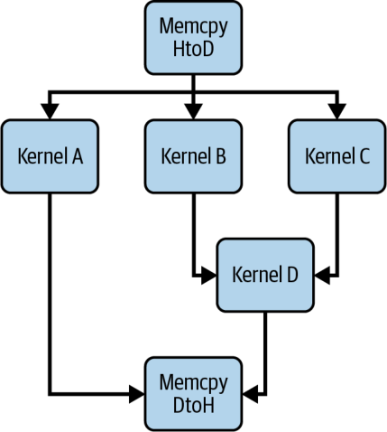


Device-launch graph latency is not impacted by how many nodes or parallel branches are in the graph. This is in contrast to host-launch graph latency, which would increase with a larger graph due to CPU scheduling overhead.

设备端启动的图延迟不受图中节点数量或并行分支数量的影响。这与主机端启动的图延迟形成对比——后者会因 CPU 调度开销而随图变大而增加。

In addition, device launches scale well with graph width. As more parallel nodes are added, host-side launching would suffer from additional synchronization costs, but the device launch latency remains nearly flat.

此外，设备端启动在图宽度上扩展良好。随着并行节点增多，主机侧启动会承受额外的同步开销，但设备端启动延迟几乎保持平坦。

Debugging device-launched graphs can be tricky, but tools like Nsight Systems will show the child graphs on the GPU timeline as separate streams of work. It’s recommended to use NVTX markers in the parent kernel before and after cudaGraphLaunch calls to mark where device launches occur. This can help verify that the graphs run as expected in relation to the parent thread.

调试设备端启动的图可能有些棘手，但像 Nsight Systems 这样的工具会在 GPU 时间线上将子图显示为独立的工作流。建议在父核函数中于 cudaGraphLaunch 调用前后使用 NVTX 标记，以标注设备端启动发生的位置。这有助于验证图相对于父线程是否如预期般运行。

Inside your device code, you launch the graph with the simple API, cudaGraphLaunch(graphExec, stream). The runtime uses special, reserved cudaStream_t values to distinguish between the following supported launch modes: “fire-and-forget” (cudaStreamGraphFireAndForget), “tail” (cudaStreamGraphTailLaunch), and “sibling” (cudaStreamGraphFireAndForgetAsSibling). These modes will automatically enforce the correct ordering in the CUDA stream without any host intervention.

在你的设备端代码中，你用简单的 API cudaGraphLaunch(graphExec, stream) 来启动图。运行时使用特殊的、保留的 cudaStream_t 值来区分下列受支持的启动模式：“发射即忘”（cudaStreamGraphFireAndForget）、“尾部”（cudaStreamGraphTailLaunch）和“同级”（cudaStreamGraphFireAndForgetAsSibling）。这些模式会在 CUDA 流中自动强制执行正确的顺序，无需任何主机干预。

In a fire-and-forget launch, the child graph begins executing immediately and concurrently with the launching parent kernel. The parent kernel doesn’t wait for the child to finish—much like launching an independent thread of work. Fire-and-forget launches are useful for spawning asynchronous tasks from within a kernel.

在发射即忘（fire-and-forget）启动中，子图立即开始执行，并与发起它的父核函数并发运行。父核函数不会等待子图结束——这很像启动一个独立的工作线程。发射即忘启动适用于在核函数内部派生异步任务。

> A graph can have up to 120 total fire-and-forget graphs during the course of its execution.

> 一张图在其执行过程中最多可以有 120 个发射即忘图。

By contrast, a device-initiated graph tail launch defers execution of the graph until the launching kernel reaches a synchronization point or completes. This effectively queues the graph to run after the current kernel as a continuation, as shown in Figure 12-6.

相比之下，设备端发起的图尾部启动（tail launch）会将图的执行推迟到发起它的核函数到达同步点或执行完成之后。这实际上把图排入队列，作为当前核函数的延续在其之后运行，如图 12-6 所示。

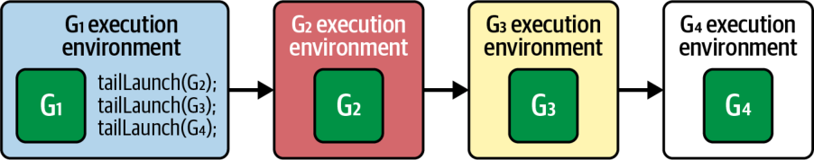


Tail launches are especially powerful when implementing GPU-resident work schedulers. A persistent “scheduler” kernel can tail-launch a graph, then relaunch itself once that graph finishes. This technique effectively creates a loop on the GPU without requiring host re-invocation. To relaunch itself, the kernel calls cudaGetCurrentGraphExec() to get a handle to its own executing graph. It then launches the graph using cudaGraphLaunch(..., cudaStreamGraphTailLaunch) to enqueue itself again.

在实现 GPU 驻留的工作调度器时，尾部启动尤其强大。一个持久化的“调度器”核函数可以尾部启动一张图，然后在该图完成后重新启动自身。这一技术实际上在 GPU 上创建了一个循环，无需主机重新调用。为了重新启动自身，核函数调用 cudaGetCurrentGraphExec() 获取指向它自身正在执行的图的句柄。随后它使用 cudaGraphLaunch(..., cudaStreamGraphTailLaunch) 启动该图，把自己再次入队。

Additionally, tail graphs can perform additional tail launches. In this case, the new tail launches will execute before the previous graph’s tail launch, as shown in Figure 12-7.

此外，尾部图可以执行额外的尾部启动。在这种情况下，新的尾部启动会先于前一张图的尾部启动执行，如图 12-7 所示。

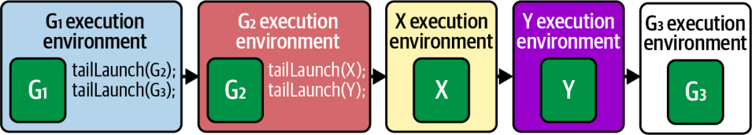


> You can have up to 255 pending tail launches enqueued in a CUDA Graph. However, when it comes to a self-tail-launch (e.g., a graph enqueues itself for relaunch), you can have only one pending self-tail-launch at a time.

> 你在一张 CUDA Graph 中最多可以有 255 个待处理的尾部启动排队。然而，就自尾部启动（例如一张图把自身入队以重新启动）而言，同一时刻只能有一个待处理的自尾部启动。

A sibling launch is a variation of fire-and-forget in which the launched graph executes as a peer to the parent graph—instead of as a child. Additionally, the sibling runs in the parent’s stream environment. This means it runs immediately and independently but without delaying any tail launches of the parent graph, as shown in Figure 12-8.

同级启动（sibling launch）是发射即忘的一种变体，其中被启动的图作为父图的对等体（peer）执行——而不是作为子图。此外，同级图运行在父图的流环境中。这意味着它立即且独立地运行，但不会延迟父图的任何尾部启动，如图 12-8 所示。

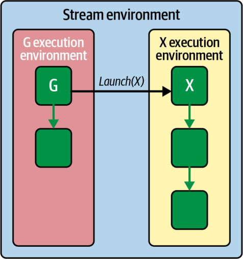


For this mode, you can use cudaGraphLaunch(graphExec, cudaStreamGraphFireAndForgetAsSibling) to launch in “sibling mode.” This submits the graph as a sibling of the current graph’s execution environment.

对于这一模式，你可以使用 cudaGraphLaunch(graphExec, cudaStreamGraphFireAndForgetAsSibling) 以“同级模式”启动。这会将图作为当前图执行环境的同级提交。

When using device-initiated CUDA Graphs, you need to carefully manage dependencies. For instance, if the launched kernel must consume results from the graph, a tail launch is appropriate because the parent kernel will pause until the graph’s work is done. In contrast, if the launched graph is more of a side task, the fire-and-forget mode allows the parent kernel to proceed without waiting.

在使用设备端发起的 CUDA Graphs 时，你需要谨慎管理依赖关系。例如，如果被启动的核函数必须消费来自该图的结果，那么尾部启动是合适的，因为父核函数会暂停，直到图的工作完成。相反，如果被启动的图更像是一个附带任务，那么发射即忘模式允许父核函数无需等待即可继续。

In practice, device-initiated CUDA Graphs open up new patterns. For example, imagine a GPU compression pipeline where a kernel must choose between different compression algorithms based on data content. Rather than ending the kernel and telling the CPU to launch the chosen compression kernel, the GPU kernel can directly launch a prerecorded graph corresponding to, say, “LZ compression” or “Huffman compression.”

实践中，设备端发起的 CUDA Graphs 开启了新的模式。例如，设想一个 GPU 压缩流水线，其中一个核函数必须根据数据内容在不同的压缩算法之间做出选择。GPU 核函数无需结束并告诉 CPU 去启动所选的压缩核函数，而是可以直接启动一张预先录制的图，对应于比如“LZ 压缩”或“Huffman 压缩”。

In this compression example, the GPU never idles waiting for the CPU to decide. Let’s take a look at another useful pattern that combines atomic queues/counters and device-initiated, tail-launched CUDA Graphs for LLM inference scheduling inside of a persistent kernel.

在这个压缩示例中，GPU 从不空闲等待 CPU 做决定。让我们再看一个有用的模式，它把原子队列/计数器与设备端发起的、尾部启动的 CUDA Graphs 结合起来，用于持久化核函数内部的 LLM 推理调度。

### Atomic Queues and Device-Initiated CUDA Graphs for In-Kernel Persistent Scheduling

### 用原子队列与设备端发起的 CUDA Graphs 实现核内持久化调度

We can combine our atomic-counter work queue from earlier with device-initiated graph tail launches. Consider an LLM inference loop use case, which uses a CUDA Graph to perform a decode by capturing a graph that includes the transformer-block’s forward pass (attention + feed-forward).

我们可以把前文的原子计数器工作队列与设备端发起的图尾部启动结合起来。考虑一个 LLM 推理循环的用例，它使用一张 CUDA Graph 来执行解码——通过捕获一张包含 transformer 块前向传递（注意力 + 前馈）的图。

A lightweight, persistent scheduler kernel can use atomicAdd(&queueHead,1) to claim the next work item. It then tail-launches the precaptured decode CUDA Graph to compute the output and immediately loops back for the next item in the queue.

一个轻量、持久化的调度器核函数可以使用 atomicAdd(&queueHead,1) 来认领下一个工作项。随后它尾部启动预先捕获的解码 CUDA Graph 以计算输出，并立即循环回去处理队列中的下一项。

When each CUDA Graph completes, the in-kernel scheduler loop grabs the next index using atomicAdd(&queueHead,1) and tail-launches another decode graph. This effectively creates a fully GPU-resident scheduler that both decides and executes tasks without touching the CPU.

每当一张 CUDA Graph 完成时，核内调度器循环使用 atomicAdd(&queueHead,1) 抓取下一个索引，并尾部启动另一张解码图。这实际上创建了一个完全 GPU 驻留的调度器，既做决策又执行任务，全程不触及 CPU。

By chaining these tail launches, each token is processed start-to-finish on the device with virtually zero CPU overhead. And since the CPU never reenters the critical path, SMs remain fully utilized, per-token latency drops, and you can adapt to different sequence lengths and batch sizes on the fly. To do this, you simply update graph parameters or switch between prerecorded graphs.

通过链接这些尾部启动，每个 token 都在设备上从头到尾处理，CPU 开销几乎为零。而且由于 CPU 从不重新进入关键路径，SM 保持完全利用，每 token 延迟下降，你还可以即时适配不同的序列长度和批大小。为此，你只需更新图参数或在预先录制的图之间切换。

### Conditional Graph Nodes

### 条件图节点

In a traditional CUDA Graph, every node and its dependencies are fixed at capture time, forcing any decision-making logic back to the host. Conditional graph nodes break this rigidity by deferring branch decisions to the GPU itself—based on a small “condition handle” associated with the node.

在传统的 CUDA Graph 中，每个节点及其依赖在捕获时就已固定，从而迫使任何决策逻辑退回主机端。条件图节点（conditional graph node）打破了这种僵硬——它将分支决策推迟给 GPU 自身，依据的是与节点关联的一个小小的“条件句柄”。

As the graph executes, the GPU evaluates that handle and selectively runs one of its body subgraphs (or loops through it) without ever returning control to the CPU. Specifically, conditional graph nodes let you embed the control flow (IF, IF/ELSE, WHILE, SWITCH) directly into CUDA Graphs to run on the GPU device. Conditional graph nodes eliminate host round trips and can provide significant performance gains on modern GPUs.

随着图的执行，GPU 会评估该句柄，并选择性地运行其某个主体子图（body subgraph）之一（或循环遍历它），全程从不将控制权交还给 CPU。具体来说，条件图节点让你把控制流（IF、IF/ELSE、WHILE、SWITCH）直接嵌入 CUDA Graphs，在 GPU 设备上运行。条件图节点消除了主机往返，并可在现代 GPU 上带来显著的性能提升。

In essence, conditional graph nodes let you control graph execution based on values computed in device kernels—all without involving the CPU. This capability allows complex branching workflows to be implemented as a single, repeatable graph launch. CUDA Graphs support multiple types of conditional nodes, as shown in Figure 12-9:

本质上，条件图节点让你基于设备核函数中计算出的值来控制图的执行——全程不涉及 CPU。这一能力使复杂的分支工作流可以实现为单次、可重复的图启动。CUDA Graphs 支持多种类型的条件节点，如图 12-9 所示：

*IF* Executes its single-body graph exactly once when the condition is nonzero.

*IF* 当条件非零时，恰好执行其单主体图一次。

*IF/ELSE* By specifying two body graphs, one is chosen when the condition is true, the other when false.

*IF/ELSE* 通过指定两个主体图，当条件为真时选择其一，为假时选择另一。

*WHILE* Repeatedly executes its body graph as long as the condition remains nonzero, checking again after each iteration.

*WHILE* 只要条件保持非零，就反复执行其主体图，并在每次迭代后再次检查。

*SWITCH* Holds *N* body graphs and executes the ith one when the condition equals *i*; if the condition ≥ *N*, it skips execution altogether.

*SWITCH* 持有 *N* 个主体图，当条件等于 *i* 时执行第 i 个；若条件 ≥ *N*，则完全跳过执行。

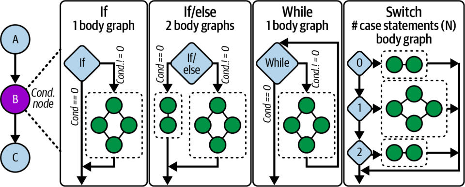


Next is an example showing how to create and populate an IF conditional node. Note the use of cudaGraphSetConditional to write the flag that controls the IF node. In this case, the condition checks if the sum is greater than a given threshold. This way, if the data meets the given criteria (flag = 1u), it runs the next subgraph. Otherwise, if the condition is not met, the conditional node does not run the subgraph:

接下来是一个示例，展示如何创建并填充一个 IF 条件节点。注意 cudaGraphSetConditional 的使用，它写入控制 IF 节点的标志。在本例中，条件检查的是求和是否大于给定阈值。这样，如果数据满足给定条件（flag = 1u），就运行下一个子图。否则，如果条件不满足，条件节点不运行该子图：

```
#include <cuda_runtime.h>
#include <cstdio>
// Device kernel that computes and sets the condition handle
__global__ void setHandle(cudaGraphConditionalHandle handle,
                          int *data, size_t N) {
    // Example threshold
    constexpr int threshold   = 123456;
    // Test whether the sum of data exceeds a threshold
    //     using a custom reduce_sum() function
    //     (recommended to implement this with
    //     CUB's DeviceReduce::Sum routine.)
    unsigned int flag =
        (reduce_sum(data, N) > threshold) ? 1u : 0u;
    cudaGraphSetConditional(handle, flag);
}
// A simple body kernel that runs only if flag != 0
__global__ void bodyKernel() {
    printf("Conditional body executed on GPU!\n");
}
int main() {
    cudaStream_t stream;
    cudaStreamCreateWithFlags(&stream,
        cudaStreamNonBlocking);
    // 1) Create the graph
    cudaGraph_t graph;
    cudaGraphCreate(&graph, 0);
    // 2) Create a condition handle associated with graph
    cudaGraphConditionalHandle condHandle;
    cudaGraphConditionalHandleCreate(&condHandle, graph);
    // 3) Add the upstream kernel node to set the handle
    cudaGraphNode_t setNode;
    cudaKernelNodeParams setParams = {};
    setParams.func          = (void*)setHandle;
    setParams.gridDim       = dim3(1);
    setParams.blockDim      = dim3(32);
    // 4) Allocate input data
    constexpr size_t N              = 1 << 20;
    int*             d_data         = nullptr;
    cudaMalloc(&d_data, N * sizeof(int));

    void* setArgs[] = { &condHandle, &d_data, &N };
    setParams.kernelParams  = setArgs;
    cudaGraphAddKernelNode(&setNode, graph, nullptr, 0,
        &setParams);
    // 5) Add the IF conditional node
    cudaGraphNode_t condNode;
    cudaConditionalNodeParams ifParams = {};
    ifParams.handle = condHandle;
    ifParams.type   = cudaGraphCondTypeIf;
    // One-node body graph, in this case
    ifParams.size   = 1;
    cudaGraphAddConditionalNode(&condNode,
                                graph,
                                &setNode,
                                1,
                                &ifParams);
    // 6) Populate the body graph: one kernel that prints a message
    cudaGraph_t bodyGraph = ifParams.phGraphOut[0];
    cudaGraphNode_t bodyNode;
    cudaKernelNodeParams bodyParams = {};
    bodyParams.func         = (void*)bodyKernel;
    bodyParams.gridDim      = dim3(1);
    bodyParams.blockDim     = dim3(32);
    cudaGraphAddKernelNode(&bodyNode, bodyGraph, nullptr,
        0, &bodyParams);
    // 7) Instantiate, upload, and launch the graph on the device
    cudaGraphExec_t graphExec;
    cudaGraphInstantiate(&graphExec, graph, nullptr, nullptr,
    cudaGraphInstantiateFlagDeviceLaunch);
    cudaGraphUpload(graphExec, stream);
    cudaGraphLaunch(graphExec, stream);
    // 8) Wait for completion and clean up
    cudaStreamSynchronize(stream);
    cudaGraphExecDestroy(graphExec);
    cudaGraphDestroy(graph);
    cudaStreamDestroy(stream);
    cudaFree(d_data);
    return 0;
}
```

```
#include <cuda_runtime.h>
#include <cstdio>
// Device kernel that computes and sets the condition handle
__global__ void setHandle(cudaGraphConditionalHandle handle,
                          int *data, size_t N) {
    // Example threshold
    constexpr int threshold   = 123456;
    // Test whether the sum of data exceeds a threshold
    //     using a custom reduce_sum() function
    //     (recommended to implement this with
    //     CUB's DeviceReduce::Sum routine.)
    unsigned int flag =
        (reduce_sum(data, N) > threshold) ? 1u : 0u;
    cudaGraphSetConditional(handle, flag);
}
// A simple body kernel that runs only if flag != 0
__global__ void bodyKernel() {
    printf("Conditional body executed on GPU!\n");
}
int main() {
    cudaStream_t stream;
    cudaStreamCreateWithFlags(&stream,
        cudaStreamNonBlocking);
    // 1) Create the graph
    cudaGraph_t graph;
    cudaGraphCreate(&graph, 0);
    // 2) Create a condition handle associated with graph
    cudaGraphConditionalHandle condHandle;
    cudaGraphConditionalHandleCreate(&condHandle, graph);
    // 3) Add the upstream kernel node to set the handle
    cudaGraphNode_t setNode;
    cudaKernelNodeParams setParams = {};
    setParams.func          = (void*)setHandle;
    setParams.gridDim       = dim3(1);
    setParams.blockDim      = dim3(32);
    // 4) Allocate input data
    constexpr size_t N              = 1 << 20;
    int*             d_data         = nullptr;
    cudaMalloc(&d_data, N * sizeof(int));

    void* setArgs[] = { &condHandle, &d_data, &N };
    setParams.kernelParams  = setArgs;
    cudaGraphAddKernelNode(&setNode, graph, nullptr, 0,
        &setParams);
    // 5) Add the IF conditional node
    cudaGraphNode_t condNode;
    cudaConditionalNodeParams ifParams = {};
    ifParams.handle = condHandle;
    ifParams.type   = cudaGraphCondTypeIf;
    // One-node body graph, in this case
    ifParams.size   = 1;
    cudaGraphAddConditionalNode(&condNode,
                                graph,
                                &setNode,
                                1,
                                &ifParams);
    // 6) Populate the body graph: one kernel that prints a message
    cudaGraph_t bodyGraph = ifParams.phGraphOut[0];
    cudaGraphNode_t bodyNode;
    cudaKernelNodeParams bodyParams = {};
    bodyParams.func         = (void*)bodyKernel;
    bodyParams.gridDim      = dim3(1);
    bodyParams.blockDim     = dim3(32);
    cudaGraphAddKernelNode(&bodyNode, bodyGraph, nullptr,
        0, &bodyParams);
    // 7) Instantiate, upload, and launch the graph on the device
    cudaGraphExec_t graphExec;
    cudaGraphInstantiate(&graphExec, graph, nullptr, nullptr,
    cudaGraphInstantiateFlagDeviceLaunch);
    cudaGraphUpload(graphExec, stream);
    cudaGraphLaunch(graphExec, stream);
    // 8) Wait for completion and clean up
    cudaStreamSynchronize(stream);
    cudaGraphExecDestroy(graphExec);
    cudaGraphDestroy(graph);
    cudaStreamDestroy(stream);
    cudaFree(d_data);
    return 0;
}
```

Here, we create a new CUDA Graph with cudaGraphCreate, which will hold all subsequent nodes. We then create a condition handle using cudaGraphConditionalHandleCreate. (This associates a small integer value to the graph that can be set on the device.)

这里，我们用 cudaGraphCreate 创建一张新的 CUDA Graph，用来容纳后续所有节点。随后我们用 cudaGraphConditionalHandleCreate 创建一个条件句柄。（这会将一个小整数值关联到图上，该值可在设备端设置。）

An upstream kernel, setHandle, is then added. This kernel runs on one thread to avoid race conditions. It then calls cudaGraphSetConditional to write the flag that controls the IF node.

接着添加一个上游核函数 setHandle。这个核函数在单个线程上运行，以避免竞争条件。它随后调用 cudaGraphSetConditional 来写入控制 IF 节点的标志。

The IF conditional node is added with cudaGraphAddConditionalNode—specifying cudaGraphCondTypeIf and size=1. This defines how many conditional branches or iterations we plan to support.

用 cudaGraphAddConditionalNode 添加 IF 条件节点——指定 cudaGraphCondTypeIf 和 size=1。这定义了我们计划支持多少个条件分支或迭代。

Here, we allocate one empty subgraph (body) to be executed if the conditional flag returns nonzero. The body graph is retrieved from ifParams.phGraphOut[0] and populates it by adding bodyKernel, which simply prints a message when executed.

这里，我们分配一个空的子图（主体），当条件标志返回非零时执行它。主体图从 ifParams.phGraphOut[0] 取得，并通过添加 bodyKernel 来填充，后者在执行时只是打印一条消息。

After graph construction, call cudaGraphInstantiate to produce an executable graph object. To launch a graph from device code, you must instantiate it with the cudaGraphInstantiateFlagDeviceLaunch flag and upload it with cudaGraphUpload before any device-side launch.

图构建完成后，调用 cudaGraphInstantiate 生成一个可执行图对象。要从设备端代码启动图，你必须用 cudaGraphInstantiateFlagDeviceLaunch 标志实例化它，并在任何设备侧启动之前用 cudaGraphUpload 上传它。

Launching with cudaGraphLaunch on a CUDA stream triggers execution of the upstream set-handle kernel, the conditional check, and then, if the flag was set, the body kernel. And all of this happens directly on the GPU, as shown in Figure 12-10.

在 CUDA 流上用 cudaGraphLaunch 启动会触发上游 set-handle 核函数、条件检查的执行，然后，如果标志已置位，触发主体核函数。而这一切都直接发生在 GPU 上，如图 12-10 所示。

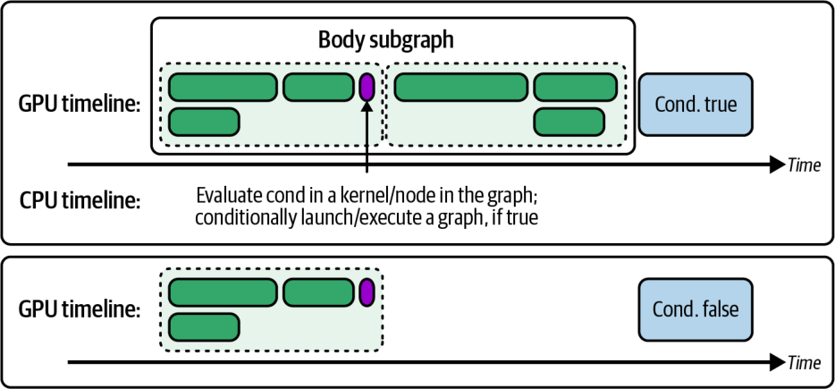


We then synchronize the stream with cudaStreamSynchronize to wait for completion. Finally, we clean up by destroying the instantiated graph, the graph itself, and the stream.

随后我们用 cudaStreamSynchronize 同步流以等待完成。最后，我们通过销毁已实例化的图、图本身以及流来做清理。

To minimize race conditions, it’s important to always set the condition in a single thread (e.g., if (threadIdx.x == 0)). And make sure that the preceding kernels flush memory to make the value visible before the conditional node executes.

为了尽量减少竞争条件，务必始终在单个线程中设置条件（例如 if (threadIdx.x == 0)）。并确保前置核函数刷新内存，使该值在条件节点执行前可见。

Conditional nodes can be nested as well. For instance, a WHILE node’s body can contain an IF node, as shown in Figure 12-11. This allows multilevel decision logic without requiring CPU hops.

条件节点也可以嵌套。例如，一个 WHILE 节点的主体可以包含一个 IF 节点，如图 12-11 所示。这允许多层级决策逻辑而无需 CPU 跳转。

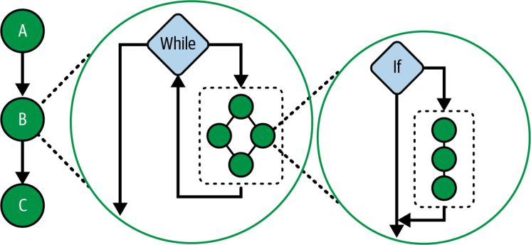


In short, you should use conditional graph nodes to keep decisions on the GPU, reduce CPU overhead, and express complex control flow directly in your CUDA Graph. Because graph creation costs can be amortized over many iterations, representing dynamic workflows entirely on-device can produce significant performance improvements.

简而言之，你应当使用条件图节点将决策保留在 GPU 上、减少 CPU 开销，并直接在你的 CUDA Graph 中表达复杂的控制流。由于图的创建成本可以在多次迭代中摊薄，完全在设备端表示动态工作流可以带来显著的性能改善。

> As of this writing, PyTorch’s CUDA Graphs API does not provide a way to create conditional CUDA graph nodes directly with the Python. Support for conditional graph execution in frameworks and tools is evolving. As of this writing, this feature requires custom C++ integrations if you need to implement if/while/switch nodes with PyTorch.

> 在本书撰写时，PyTorch 的 CUDA Graphs API 尚未提供直接用 Python 创建条件 CUDA graph 节点的方式。框架与工具中对条件图执行的支持仍在演进。在本书撰写时，如果你需要用 PyTorch 实现 if/while/switch 节点，此特性需要自定义的 C++ 集成。

## Dynamic Parallelism

## 动态并行

Previously, we saw how the device-initiated CUDA Graph launches capture and replay fixed sequences of operations with minimal CPU involvement. But that model expects that your entire execution flow is known ahead of time, which isn’t always possible. Many workloads change shape at runtime based on input data, intermediate results, or problem complexity. That’s where Dynamic parallelism (DP) comes in.

此前，我们看到了设备端发起的 CUDA Graph 启动如何以最小的 CPU 参与来捕获并重放固定的操作序列。但那个模型预期你的整个执行流程是提前已知的，而这并不总是可能。许多工作负载会在运行时根据输入数据、中间结果或问题复杂度改变形态。这正是动态并行的用武之地。

DP gives your GPU kernels the power to spawn new work for themselves instead of waiting on the CPU. Whereas CUDA Graphs require you to know your entire pipeline in advance, DP lets a running “parent” kernel examine its own outputs and decide on the fly how many “child” kernels to launch next. This is a game-changer for truly irregular problems—hierarchical reductions, adaptive mesh refinement, and graph traversals—where the number of subsequent tasks becomes clear only as you process your data.

DP 赋予你的 GPU 核函数为自身派生新工作的能力，而不必等待 CPU。CUDA Graphs 要求你提前知道整条流水线，而 DP 则让一个正在运行的“父”核函数检查它自己的输出，并即时决定接下来启动多少个“子”核函数。对于真正不规则的问题——层次化归约、自适应网格细化和图遍历——这是一个颠覆性的能力，因为后续任务的数量只有在你处理数据时才逐渐明朗。

Imagine an inference pipeline that occasionally needs a special “plugin” model evaluation for certain inputs. In a CPU-driven flow, you’d run Kernel A, copy its results back to the host, decide whether to launch Kernel B, and then issue that launch—leaving the GPU idle during the round trip. With DP, Kernel A inspects its outputs and, if the condition holds, launches Kernel B directly on the device. The entire decision-and-dispatch happens inside one GPU-resident workload, collapsing the idle gap and keeping SMs busy.

设想一个推理流水线，它偶尔需要对某些输入进行一次特殊的“插件”模型评估。在 CPU 驱动的流程中，你会运行核函数 A，把它的结果拷回主机，决定是否启动核函数 B，然后发出该启动——在往返期间让 GPU 空闲。有了 DP，核函数 A 检查它的输出，如果条件成立，就直接在设备上启动核函数 B。整个决策与派发都发生在一个 GPU 驻留的工作负载内部，消除了空闲间隙并让 SM 保持忙碌。

In the context of an LLM, most tokens follow the standard transformer path, but some require an auxiliary attention block. A DP-enabled transformer kernel can detect those special tokens at runtime and tail-launch the extra attention kernel only for those positions—no host intervention, no wasted cycles. NVIDIA’s libraries already exploit DP for similar patterns in adaptive algorithms: new subtasks emerge dynamically as data flows through the computation.

在 LLM 的语境中，大多数 token 遵循标准的 transformer 路径，但有些需要一个辅助的注意力块。一个支持 DP 的 transformer 核函数可以在运行时检测出这些特殊 token，并仅对这些位置尾部启动额外的注意力核函数——无需主机干预，不浪费周期。NVIDIA 的库已经在自适应算法中为类似模式利用了 DP：随着数据在计算中流动，新的子任务动态涌现。

You’ll know DP is right for you when your profiler timeline shows a back-to-back pattern like Kernel A → GPU idle gap → Kernel B. Here, the idle time corresponds to the CPU preparing the next launch. Replacing that gap with a device-side launch keeps every SM occupied and slashes the latency between dependent stages.

当你的性能剖析器时间线显示出像核函数 A → GPU 空闲间隙 → 核函数 B 这样的背靠背模式时，你就会知道 DP 适合你。这里，空闲时间对应的是 CPU 准备下一次启动。用设备侧启动替换那个间隙可以让每个 SM 保持占用，并大幅削减相依阶段之间的延迟。

Of course, the performance benefits of DP don’t come for free. Each child launch uses GPU scheduling resources and requires additional stack space. To avoid “stack overflow” errors, you may need to bump the runtime stack size with cudaDeviceSetLimit(cudaLimitStackSize, newSize). CUDA will warn you if you hit its default limit.

当然，DP 的性能收益并非免费。每一次子启动都要使用 GPU 调度资源，并需要额外的栈空间。为避免“栈溢出”错误，你可能需要用 cudaDeviceSetLimit(cudaLimitStackSize, newSize) 提高运行时栈大小。如果你触及其默认限制，CUDA 会向你发出警告。

On a related note, CUDA has a maximum limit on how many child-kernel launches can be pending. By default, CUDA allows 2,048 outstanding device launches at one time. However, this is configurable.

与此相关，CUDA 对可以有多少个子核函数启动处于待处理状态设有上限。默认情况下，CUDA 允许同一时刻有 2,048 个未完成的设备端启动。然而，这是可配置的。

If a parent kernel needs to spawn more than 2,048 child kernels because it’s using a large loop to launch thousands of tiny kernels, you can raise this limit using the API cudaDeviceSetLimit(cudaLimitDevRuntimePendingLaunchCount, newLimit). Otherwise, exceeding the default 2,048 limit will cause a runtime error. In practice, the default value is usually enough for most uses. But it’s an important consideration for extreme cases.

如果一个父核函数因为使用一个大循环来启动数千个微小核函数而需要派生超过 2,048 个子核函数，你可以使用 API cudaDeviceSetLimit(cudaLimitDevRuntimePendingLaunchCount, newLimit) 提高这个限制。否则，超过默认的 2,048 限制会导致运行时错误。实践中，默认值对大多数用途通常已经足够。但对于极端情况，这是一个重要的考量。

> When spawning many child kernels on the GPU, be sure to monitor device memory usage since each pending child-kernel launch reserves resources and may exceed the hard limits of your GPU hardware.

> 在 GPU 上派生许多子核函数时，务必监控设备内存使用，因为每个待处理的子核函数启动都会保留资源，可能超过你的 GPU 硬件的硬性限制。

Because DP adds some instruction-level overhead, it’s best reserved for cases where static orchestration like persistent kernels, streams, or CUDA Graphs would otherwise leave the GPU idling while the CPU decides the next step. In other words, when your workload is truly a fixed sequence of operations, you’re often better off capturing it as a CUDA Graph and replaying it device-side.

由于 DP 会增加一些指令级开销，它最好保留给这样的情形：静态编排（如持久化核函数、流或 CUDA Graphs）本会在 CPU 决定下一步时让 GPU 空闲。换句话说，当你的工作负载确实是一个固定的操作序列时，你通常更适合把它捕获为一张 CUDA Graph 并在设备侧重放。

When your work emerges dynamically from the data itself, DP lets you keep both scheduling and execution entirely on the GPU. This will deliver better scaling and lower end-to-end latency for nested, data-dependent, or unpredictable parallelism.

当你的工作从数据自身动态涌现时，DP 让你把调度与执行完全保留在 GPU 上。对于嵌套的、数据相关的或不可预测的并行，这会带来更好的扩展性和更低的端到端延迟。

> Because DP incurs per-launch overhead and consumes pending-launch slots, use DP when new parallelism emerges from the data at runtime and can’t be expressed as a pre-recorded CUDA Graph. In contrast, favor device-launched CUDA Graphs when the control flow is expression-level and repeated since CUDA Graphs amortize the costs.

> 由于 DP 会带来每次启动的开销并消耗待处理启动槽位，当新的并行在运行时从数据中涌现、且无法表达为预先录制的 CUDA Graph 时，才使用 DP。相反，当控制流处于表达式级别且重复出现时，优先选择设备端启动的 CUDA Graphs，因为 CUDA Graphs 会摊薄这些成本。

Let’s compare two implementations of a simple parent-child workflow. The host-driven version shown next launches a parent kernel, waits for it to finish, then issues two child kernels from the CPU. This leaves the GPU idle during those decision gaps:

让我们比较一个简单的父子工作流的两种实现。接下来展示的主机驱动版本启动一个父核函数，等待它完成，然后从 CPU 发出两个子核函数。这在那些决策间隙期间让 GPU 空闲：

```
// dp_host_launched.cu
#include <cuda_runtime.h>
__global__ void childKernel(float* data, int N) {
    int idx = blockIdx.x * blockDim.x + threadIdx.x;
    if (idx < N) {
        data[idx] = data[idx] * data[idx];
    }
}
__global__ void parentKernel(float* data, int N) {
    // Parent does setup work. Here, CPU decides on child launches.
    if (threadIdx.x == 0 && blockIdx.x == 0) {
        // maybe mark regions or compute flags here
    }
}
int main() {
    const int N = 1 << 20;
    float* d_data;
    cudaMalloc(&d_data, N * sizeof(float));
    // ... initialize d_data ...
    // 1) Launch parent and wait
    cudaStream_t s; cudaStreamCreateWithFlags(&s, cudaStreamNonBlocking);
    parentKernel<<<1,1,0,s>>>(d_data, N);
    cudaStreamSynchronize(s);
    // 2) CPU splits work in half and launches children
    int half = N / 2;
    childKernel<<<(half+255)/256,256>>>(d_data,     half);
    childKernel<<<(half+255)/256,256>>>(d_data+half, half);
    cudaStreamSynchronize(s);
    cudaStreamDestroy(s);
    cudaFree(d_data);
    return 0;
}
```

```
// dp_host_launched.cu
#include <cuda_runtime.h>
__global__ void childKernel(float* data, int N) {
    int idx = blockIdx.x * blockDim.x + threadIdx.x;
    if (idx < N) {
        data[idx] = data[idx] * data[idx];
    }
}
__global__ void parentKernel(float* data, int N) {
    // Parent does setup work. Here, CPU decides on child launches.
    if (threadIdx.x == 0 && blockIdx.x == 0) {
        // maybe mark regions or compute flags here
    }
}
int main() {
    const int N = 1 << 20;
    float* d_data;
    cudaMalloc(&d_data, N * sizeof(float));
    // ... initialize d_data ...
    // 1) Launch parent and wait
    cudaStream_t s; cudaStreamCreateWithFlags(&s, cudaStreamNonBlocking);
    parentKernel<<<1,1,0,s>>>(d_data, N);
    cudaStreamSynchronize(s);
    // 2) CPU splits work in half and launches children
    int half = N / 2;
    childKernel<<<(half+255)/256,256>>>(d_data,     half);
    childKernel<<<(half+255)/256,256>>>(d_data+half, half);
    cudaStreamSynchronize(s);
    cudaStreamDestroy(s);
    cudaFree(d_data);
    return 0;
}
```

In the host-driven version, the GPU runs parentKernel and then idles while the CPU prepares and launches each childKernel in turn. Note the explicit cudaDeviceSynchronize() calls after the parent and between children. These calls lead to idle gaps that should be eliminated, as shown in Figure 12-12.

在主机驱动版本中，GPU 运行 parentKernel，然后在 CPU 依次准备并启动每个 childKernel 时空闲。注意父核函数之后以及两个子核函数之间显式的 cudaDeviceSynchronize() 调用。这些调用导致了应被消除的空闲间隙，如图 12-12 所示。

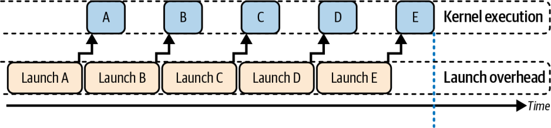


In contrast, the device-launched DP version lets the parent-kernel spawn its children on the device. This approach requires no host synchronization between the parent and child kernel launches. This way, the parent’s child-kernel launches implicitly queue the children and synchronize only at the end, as shown in the code here:

相比之下，设备端启动的 DP 版本让父核函数在设备上派生它的子核函数。这种方式在父核函数与子核函数启动之间不需要任何主机同步。这样，父核函数的子核函数启动会隐式地将子核函数入队，并仅在最后同步，如下面的代码所示：

```
// dp_device_launched.cu
// Dynamic parallelism requires relocatable device code enabled with -rdc=true.
#include <cuda_runtime.h>
__global__ void childKernel(float* data, int n) {
    int idx = blockIdx.x * blockDim.x + threadIdx.x;
    if (idx < n) {
        data[idx] = data[idx] * data[idx];
    }
}
__global__ void parentKernel(float* data, int n) {
    // Launch children from a single thread to avoid duplicate launches.
    if (blockIdx.x == 0 && threadIdx.x == 0) {
        const int threadsPerBlock = 256;
        const int firstHalfCount  = n / 2;
        const int secondHalfCount = n - firstHalfCount;
        const int blocksFirst  = (firstHalfCount  + threadsPerBlock - 1)
                                  / threadsPerBlock;
        const int blocksSecond = (secondHalfCount + threadsPerBlock - 1)
                                  / threadsPerBlock;
        // Device launched child kernels.
        // No device side cudaDeviceSynchronize is needed.
        childKernel<<<blocksFirst,  threadsPerBlock>>>(data,
                                                       firstHalfCount);
        childKernel<<<blocksSecond, threadsPerBlock>>>(data + firstHalfCount,
                                                       secondHalfCount);
        // Parent kernel will not finish until both children finish.
    }
}
int main() {
    const int N = 1024 * 1024;    // 1M elements, avoids bit shifting for clarity
    float* d_data = nullptr;
    cudaMalloc(&d_data, N * sizeof(float));
    // Initialize to zero as a concrete, valid initialization.
    cudaMemset(d_data, 0, N * sizeof(float));
    // Launch parent on the default stream.
    parentKernel<<<1, 1>>>(d_data, N);
    // Wait for completion without cudaDeviceSynchronize. Sync stream instead.
    cudaStreamSynchronize(0);
    cudaFree(d_data);
    return 0;
}
```

```
// dp_device_launched.cu
// Dynamic parallelism requires relocatable device code enabled with -rdc=true.
#include <cuda_runtime.h>
__global__ void childKernel(float* data, int n) {
    int idx = blockIdx.x * blockDim.x + threadIdx.x;
    if (idx < n) {
        data[idx] = data[idx] * data[idx];
    }
}
__global__ void parentKernel(float* data, int n) {
    // Launch children from a single thread to avoid duplicate launches.
    if (blockIdx.x == 0 && threadIdx.x == 0) {
        const int threadsPerBlock = 256;
        const int firstHalfCount  = n / 2;
        const int secondHalfCount = n - firstHalfCount;
        const int blocksFirst  = (firstHalfCount  + threadsPerBlock - 1)
                                  / threadsPerBlock;
        const int blocksSecond = (secondHalfCount + threadsPerBlock - 1)
                                  / threadsPerBlock;
        // Device launched child kernels.
        // No device side cudaDeviceSynchronize is needed.
        childKernel<<<blocksFirst,  threadsPerBlock>>>(data,
                                                       firstHalfCount);
        childKernel<<<blocksSecond, threadsPerBlock>>>(data + firstHalfCount,
                                                       secondHalfCount);
        // Parent kernel will not finish until both children finish.
    }
}
int main() {
    const int N = 1024 * 1024;    // 1M elements, avoids bit shifting for clarity
    float* d_data = nullptr;
    cudaMalloc(&d_data, N * sizeof(float));
    // Initialize to zero as a concrete, valid initialization.
    cudaMemset(d_data, 0, N * sizeof(float));
    // Launch parent on the default stream.
    parentKernel<<<1, 1>>>(d_data, N);
    // Wait for completion without cudaDeviceSynchronize. Sync stream instead.
    cudaStreamSynchronize(0);
    cudaFree(d_data);
    return 0;
}
```

Here, the parentKernel issues both child launches directly on the GPU. The host submits only one kernel and then waits once. When the parent kernel completes, the device runtime makes sure that all launched child kernels are complete before moving on.

这里，parentKernel 直接在 GPU 上发出两个子核函数启动。主机只提交一个核函数，然后等待一次。当父核函数完成时，设备运行时会确保所有已启动的子核函数都完成后再继续。

> Note that this dynamic parallelism version avoids any use of cudaDeviceSynchronize(). It relies on the implicit rule that a parent kernel does not complete until all its device-launched children complete, and the host simply waits on the stream.

> 注：这个动态并行版本避免了任何对 cudaDeviceSynchronize() 的使用。它依赖于一条隐式规则：父核函数在其所有设备端启动的子核函数完成之前不会完成，而主机只需在流上等待。

With the device-side DP approach, there are no idle gaps for CPU decision making. As such, it collapses the latency between dependent stages and keeps SMs busy end to end. This increases GPU utilization at the slight cost of a small amount of per-launch overhead incurred on the device, as you see in Figure 12-13’s timeline.

采用设备侧 DP 方式，就没有用于 CPU 决策的空闲间隙。因此，它消除了相依阶段之间的延迟，并让 SM 端到端保持忙碌。这提升了 GPU 利用率，代价只是设备端产生的少量每次启动开销，如图 12-13 的时间线所示。

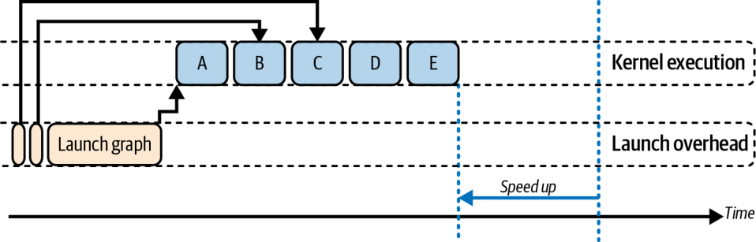


In our simple two-child example, the host-driven version issues three separate launches (1 parent + 2 children). In this case, the GPU idles while the CPU decides when to launch each child kernel.

在我们这个简单的双子核函数示例中，主机驱动版本发出三次独立的启动（1 个父 + 2 个子）。在这种情况下，GPU 在 CPU 决定何时启动每个子核函数时空闲。

This is in contrast to the device-driven DP version that performs just one host-side launch for the parent kernel. The parent kernel then spawns both children on the GPU without further host intervention. Table 12-2 compares performance for the host-driven and device-driven DP child launches.

这与设备驱动的 DP 版本形成对比——后者只为父核函数执行一次主机侧启动。父核函数随后在 GPU 上派生两个子核函数，无需进一步的主机干预。表 12-2 比较了主机驱动与设备驱动 DP 子核函数启动的性能。

Table 12-2. Host-driven versus GPU-driven nested child-kernel-launches performance comparison (2 children)

表 12-2. 主机驱动与 GPU 驱动的嵌套子核函数启动性能对比（2 个子核函数）

| Metric | Before (host launch) | After (device launch) |
| --- | --- | --- |
| Total host launches | 3 | 1 |
| Average launch overhead per call | ~20 µs | ~25 µs |
| GPU idle cycles (during sequence) | ~40% | ~5% |
| Overall execution time | 1.00 ms | 0.75 ms |

| 指标 | 之前（主机启动） | 之后（设备启动） |
| --- | --- | --- |
| 主机启动总数 | 3 | 1 |
| 每次调用的平均启动开销 | ~20 µs | ~25 µs |
| GPU 空闲周期（序列期间） | ~40% | ~5% |
| 整体执行时间 | 1.00 ms | 0.75 ms |

Here, we see that by moving the child dispatch into the GPU, DP eliminates roughly 35% of the idle time and reduces total runtime by about 25%. The slight rise in perlaunch cost (20 µs → 25 µs) reflects the GPU’s on-device scheduling overhead. However, this overhead is negligible compared to the savings from removing multiple CPU-GPU handshakes.

这里，我们看到通过把子核函数派发移入 GPU，DP 消除了大约 35% 的空闲时间，并将总运行时长减少约 25%。每次启动成本的轻微上升（20 µs → 25 µs）反映了 GPU 的设备端调度开销。然而，与移除多次 CPU-GPU 握手所带来的节省相比，这一开销可以忽略不计。

An additional benefit of GPU-driven launches is improved data locality since intermediate results never have to be copied back to the CPU between stages. In our example, the data computed by the parent kernel is immediately usable by the child kernels without leaving GPU memory. This avoids extra memory transfers and preserves cache data. No CPU intervention also means fewer chances for cache eviction or DRAM refetch of data that would have been reused on the GPU.

GPU 驱动启动的另一个好处是改善了数据局部性，因为中间结果在各阶段之间从不必拷回 CPU。在我们的示例中，父核函数计算出的数据可以立即被子核函数使用，而无需离开 GPU 内存。这避免了额外的内存传输并保留了缓存数据。没有 CPU 干预也意味着更少机会发生缓存逐出或对本可在 GPU 上重用的数据进行 DRAM 重取。

In short, DP transforms a stop-start host-driven workflow into a seamless GPU-resident pipeline, sustaining high SM utilization and minimizing host-GPU coordination. And remember that dynamic parallelism, like other advanced techniques, should be tested for impact.

简而言之，DP 把一个走走停停、主机驱动的工作流转变为一条无缝的、GPU 驻留的流水线，维持高 SM 利用率并最小化主机-GPU 协调。并且请记住，动态并行和其他高级技术一样，应当针对影响进行测试。

While DP eliminates CPU interaction, a device-initiated kernel launch still has roughly the same order of overhead as a host launch. As such, not all algorithms will see gains. In fact, some algorithms may even run slower with DP—especially if the work from the launched kernel is too small to amortize the overhead. In other words, device-side launch overhead might negate DP’s benefits for some small kernels.

尽管 DP 消除了 CPU 交互，但设备端发起的核函数启动的开销量级仍与主机启动大致相同。因此，并非所有算法都会看到收益。事实上，某些算法用 DP 甚至可能运行得更慢——尤其是当被启动核函数的工作量太小、不足以摊薄开销时。换句话说，对于某些小核函数，设备侧启动开销可能抵消 DP 的收益。

> Always profile the before and after making a change. Tools like Nsight Compute can profile child kernels launched using DP to help quantify their cost and make sure the benefits of a GPU-resident pipeline truly outweigh the extra overhead and improve throughput.

> 在做出更改之前和之后务必进行性能剖析。像 Nsight Compute 这样的工具可以剖析用 DP 启动的子核函数，以帮助量化它们的成本，并确保 GPU 驻留流水线的收益真正超过额外开销并提升吞吐量。

Having covered single-GPU orchestration, we next turn to multi-GPU and multinode scenarios, where interconnect bandwidths and collective operations extend our roofline considerations to the cluster level.

介绍完单 GPU 编排之后，我们接下来转向多 GPU 与多节点场景，在那里互连带宽与集合操作将我们的 roofline 考量扩展到集群层面。

## Orchestrate Across Multiple GPUs and Cluster Nodes (NVSHMEM)

## 跨多个 GPU 与集群节点编排（NVSHMEM）

When you scale from one GPU to many, the core goal remains the same: keep every device busy by hiding data movement behind useful work. Once the host has dispatched a task to each GPU, whether through separate CPU threads, asynchronous launches, or a multi-GPU graph, the GPUs take over. While one stream on each device drives computation, a second stream can shuttle data peer-to-peer over NVLink or PCIe without ever involving host memory.

当你从单个 GPU 扩展到多个时，核心目标依然不变：通过把数据移动隐藏在有用工作之后来让每个设备保持忙碌。一旦主机把任务分派给每个 GPU——无论是通过独立的 CPU 线程、异步启动，还是多 GPU 图——GPU 就会接管。当每个设备上的一个流驱动计算时，第二个流可以在 NVLink 或 PCIe 上进行点对点数据穿梭，完全无需涉及主机内存。

This means that, at scale, you must overlap peer-to-peer transfers with computation. It’s important to note that even with NVLink, the bandwidth and latency are not equal to on-device HBM. This communication must therefore be hidden with overlap.

这意味着，在大规模下，你必须把点对点传输与计算重叠。需要注意的是，即便有 NVLink，其带宽和延迟也不等同于设备上的 HBM。因此这种通信必须通过重叠来隐藏。

In practice, as the cluster size grows, overlapping work with data transfer is absolutely essential to scaling the environment linearly. For straightforward hand-offs, you can use GPUDirect Peer Access to move large blocks of memory in the background, as shown here:

实践中，随着集群规模增长，把工作与数据传输重叠对于让环境线性扩展绝对是必不可少的。对于简单直接的交接，你可以使用 GPUDirect Peer Access 在后台移动大块内存，如下所示：

```
cudaMemcpyPeerAsync(dest_ptr, dest_gpu, src_ptr, src_gpu, size, comm_stream);
```

```
cudaMemcpyPeerAsync(dest_ptr, dest_gpu, src_ptr, src_gpu, size, comm_stream);
```

When you need collective communication such as gradient all-reduces in PyTorch Distributed Data Parallel (DDP), you launch NCCL’s nonblocking routines on a separate stream using NCCL’s asynchronous collective calls. NCCL then arranges your tensors into rings or trees that saturate every NVLink and NVSwitch path—all while your compute kernels continue running on their own streams.

当你需要集合通信（例如 PyTorch 分布式数据并行（DDP）中的梯度 all-reduce）时，你可以使用 NCCL 的异步集合调用，在一个独立的流上启动 NCCL 的非阻塞例程。NCCL 随后会把你的张量编排成环或树，以饱和每一条 NVLink 与 NVSwitch 路径——同时你的计算核函数继续在它们自己的流上运行。

If your MPI library is CUDA-aware and recognizes GPU device pointers, it will automatically use GPUDirect RDMA to send data over InfiniBand using calls like the one here:

如果你的 MPI 库是 CUDA-aware 的并能识别 GPU 设备指针，它会自动使用 GPUDirect RDMA，通过类似下面这样的调用在 InfiniBand 上发送数据：

```
MPI_Send(device_buf, count, MPI_FLOAT, peer_rank, ...);
```

```
MPI_Send(device_buf, count, MPI_FLOAT, peer_rank, ...);
```

This CUDA-awareness in MPI (and NCCL) means GPU data moves directly across the network using GPUDirect RDMA over InfiniBand without staging through host memory. (Note that within a node, peer copies run over NVLink or PCIe using GPUDirect Peer-to-Peer.)

MPI（以及 NCCL）中的这种 CUDA-awareness 意味着 GPU 数据通过 InfiniBand 上的 GPUDirect RDMA 直接跨网络移动，而无需经由主机内存中转。（注意，在一个节点内部，对等拷贝通过使用 GPUDirect Peer-to-Peer 的 NVLink 或 PCIe 进行。）

Using these primitives and avoiding the CPU helps decrease data transfer latency and achieve near-wire-speed for GPU-to-GPU transfers. As a result, internode data transfer and communication can properly overlap with GPU computations.

使用这些原语并避开 CPU 有助于降低数据传输延迟，并为 GPU 间传输达到近乎线速。因此，节点间的数据传输与通信可以正确地与 GPU 计算重叠。

### Fine-Grained GPU-to-GPU Memory Sharing with NVSHMEM

### 用 NVSHMEM 做细粒度 GPU 间内存共享

For workloads needing ultratight, event-driven coordination, such as dynamic task queues and fine-grained event notifications, NVIDIA’s NVIDIA SHMEM (NVSHMEM) library is an excellent option. It treats each GPU as a processing element (PE) in a partitioned global address space (PGAS).

对于需要超紧密、事件驱动协调的工作负载（例如动态任务队列和细粒度事件通知），NVIDIA 的 NVIDIA SHMEM（NVSHMEM）库是一个绝佳选择。它把每个 GPU 视为分区全局地址空间（PGAS）中的一个处理单元（PE）。

With PGAS, a GPU can directly write into another GPU’s memory from device code, bypassing the CPU. Latency depends on the interconnect, with NVLink generally lower than PCIe or network transports. Here is the classic send-and-signal pattern using NVSHMEM:

有了 PGAS，一个 GPU 可以从设备端代码直接写入另一个 GPU 的内存，绕过 CPU。延迟取决于互连，NVLink 通常低于 PCIe 或网络传输。下面是使用 NVSHMEM 的经典“发送并信号”模式：

```
#include <cstdio>
#include <cuda_runtime.h>
#include <nvshmem.h>
#include <nvshmemx.h>
// Device symbols for the symmetric buffers
__device__ int   *remote_flag;
__device__ float *remote_data;
//-----------------------------------------------------------------------------
// GPU 0: send data then signal GPU 1
//-----------------------------------------------------------------------------
__global__ void sender_kernel(float *local_data, int dest_pe) {
    int idx = blockIdx.x * blockDim.x + threadIdx.x;
    float value = local_data[idx];
    // 1) Put the payload into remote_data[1] on dest_pe
    nvshmem_float_p(remote_data + 1, value, dest_pe);
    // 2) Wait for the RMA to complete before setting the flag
    nvshmem_quiet();
    // 3) Signal completion by setting remote_flag[0] = 1 on dest_pe
    nvshmem_int_p(remote_flag + 0, 1, dest_pe);
}
//-----------------------------------------------------------------------------
// GPU 1: wait for flag then consume payload
//-----------------------------------------------------------------------------
__global__ void receiver_kernel(float *recv_buffer) {
    // 1) Spin until remote_flag[0] == 1
    nvshmem_int_wait_until(remote_flag + 0,
        NVSHMEM_CMP_EQ, 1);
    // 2) Once flag is set, the payload at remote_data[1] is valid
    float val = remote_data[1];
    recv_buffer[0] = val * 2.0f;
}
//-----------------------------------------------------------------------------
// Host-side setup and teardown
//-----------------------------------------------------------------------------
int main(int argc, char **argv) {
    // 1) Initialize the NVSHMEM runtime
    nvshmem_init();
    // 2) Determine this PE’s rank and bind to the matching GPU
    int mype = nvshmem_my_pe();
    cudaSetDevice(mype);
    // 3) Allocate symmetric buffers on each PE
    //    - Two ints for the flag
    //    - Two floats for the data payload
    int   *flag_buf = (int*)   nvshmem_malloc(2 * sizeof(int));
    float *data_buf = (float*) nvshmem_malloc(2 * sizeof(float));
    // 4) Zero out flags on PE 0 and synchronize
    nvshmem_barrier_all();
    if (mype == 0) {
        int zeros[2] = {0, 0};
        cudaMemcpy(flag_buf, zeros, 2 * sizeof(int),
                   cudaMemcpyHostToDevice);
    }
    nvshmem_barrier_all();
    // 5) Register the device pointers for use in kernels
    cudaMemcpyToSymbol(remote_flag, &flag_buf, sizeof(int*));
    cudaMemcpyToSymbol(remote_data, &data_buf, sizeof(float*));
    // 6) Launch either the sender or receiver kernel
    dim3 grid(1), block(128);
    if (mype == 0) {
        // Example input buffer for the sender
        float *local_data;
        cudaMalloc(&local_data, 128 * sizeof(float));
        // ... initialize local_data as needed ...
        sender_kernel<<<grid, block>>>(local_data, 1);
        cudaFree(local_data);
    } else {
        float *recv_buffer;
        cudaMalloc(&recv_buffer, sizeof(float));
        receiver_kernel<<<grid, block>>>(recv_buffer);
        cudaFree(recv_buffer);
    }
    // 7) Wait for all GPU work to finish
    cudaDeviceSynchronize();
    // 8) Clean up NVSHMEM resources
    nvshmem_free(flag_buf);
    nvshmem_free(data_buf);
    nvshmem_finalize();
    return 0;
}
```

```
#include <cstdio>
#include <cuda_runtime.h>
#include <nvshmem.h>
#include <nvshmemx.h>
// Device symbols for the symmetric buffers
__device__ int   *remote_flag;
__device__ float *remote_data;
//-----------------------------------------------------------------------------
// GPU 0: send data then signal GPU 1
//-----------------------------------------------------------------------------
__global__ void sender_kernel(float *local_data, int dest_pe) {
    int idx = blockIdx.x * blockDim.x + threadIdx.x;
    float value = local_data[idx];
    // 1) Put the payload into remote_data[1] on dest_pe
    nvshmem_float_p(remote_data + 1, value, dest_pe);
    // 2) Wait for the RMA to complete before setting the flag
    nvshmem_quiet();
    // 3) Signal completion by setting remote_flag[0] = 1 on dest_pe
    nvshmem_int_p(remote_flag + 0, 1, dest_pe);
}
//-----------------------------------------------------------------------------
// GPU 1: wait for flag then consume payload
//-----------------------------------------------------------------------------
__global__ void receiver_kernel(float *recv_buffer) {
    // 1) Spin until remote_flag[0] == 1
    nvshmem_int_wait_until(remote_flag + 0,
        NVSHMEM_CMP_EQ, 1);
    // 2) Once flag is set, the payload at remote_data[1] is valid
    float val = remote_data[1];
    recv_buffer[0] = val * 2.0f;
}
//-----------------------------------------------------------------------------
// Host-side setup and teardown
//-----------------------------------------------------------------------------
int main(int argc, char **argv) {
    // 1) Initialize the NVSHMEM runtime
    nvshmem_init();
    // 2) Determine this PE’s rank and bind to the matching GPU
    int mype = nvshmem_my_pe();
    cudaSetDevice(mype);
    // 3) Allocate symmetric buffers on each PE
    //    - Two ints for the flag
    //    - Two floats for the data payload
    int   *flag_buf = (int*)   nvshmem_malloc(2 * sizeof(int));
    float *data_buf = (float*) nvshmem_malloc(2 * sizeof(float));
    // 4) Zero out flags on PE 0 and synchronize
    nvshmem_barrier_all();
    if (mype == 0) {
        int zeros[2] = {0, 0};
        cudaMemcpy(flag_buf, zeros, 2 * sizeof(int),
                   cudaMemcpyHostToDevice);
    }
    nvshmem_barrier_all();
    // 5) Register the device pointers for use in kernels
    cudaMemcpyToSymbol(remote_flag, &flag_buf, sizeof(int*));
    cudaMemcpyToSymbol(remote_data, &data_buf, sizeof(float*));
    // 6) Launch either the sender or receiver kernel
    dim3 grid(1), block(128);
    if (mype == 0) {
        // Example input buffer for the sender
        float *local_data;
        cudaMalloc(&local_data, 128 * sizeof(float));
        // ... initialize local_data as needed ...
        sender_kernel<<<grid, block>>>(local_data, 1);
        cudaFree(local_data);
    } else {
        float *recv_buffer;
        cudaMalloc(&recv_buffer, sizeof(float));
        receiver_kernel<<<grid, block>>>(recv_buffer);
        cudaFree(recv_buffer);
    }
    // 7) Wait for all GPU work to finish
    cudaDeviceSynchronize();
    // 8) Clean up NVSHMEM resources
    nvshmem_free(flag_buf);
    nvshmem_free(data_buf);
    nvshmem_finalize();
    return 0;
}
```

Here, the one-sided remote memory operations happen entirely on-device. GPU/PE 0 writes its result straight into GPU/PE 1’s memory and flips a flag there. Specifically, GPU/PE 0 issues a nvshmem_float_p to write payload data directly into GPU/PE 1’s memory, calls nvshmem_quiet() to ensure completion, then uses nvshmem_int_p to flip a flag.

这里，单边远程内存操作完全发生在设备上。GPU/PE 0 把它的结果直接写入 GPU/PE 1 的内存，并在那里翻转一个标志。具体来说，GPU/PE 0 发出一个 nvshmem_float_p 将载荷数据直接写入 GPU/PE 1 的内存，调用 nvshmem_quiet() 以确保完成，然后使用 nvshmem_int_p 翻转一个标志。

Meanwhile, GPU/PE 1’s kernel spins on nvshmem_int_wait_until() and, as soon as the flag is set, reads the payload. This requires no CPU intervention or extra copies—just hardware-accelerated, GPU-to-GPU transfers over NVLink.

与此同时，GPU/PE 1 的核函数在 nvshmem_int_wait_until() 上自旋，一旦标志被置位便读取有效载荷。这不需要 CPU 介入，也不需要额外的拷贝——只是通过 NVLink 进行硬件加速的 GPU 间传输。

Since NVSHMEM communication uses GPU-initiated, one-sided operations over NVLink or PCIe, it eliminates host staging. As such, NVSHMEM communication can achieve near-peak wire speed. This is because NVSHMEM one-sided operations bypass the CPU as well as the software overhead of kernel launches. Essentially, NVSHMEM turns formerly multistep communications into a single hardware transaction.

由于 NVSHMEM 通信使用的是通过 NVLink 或 PCIe 的 GPU 发起、单边（one-sided）操作，它消除了主机端暂存（host staging）。因此，NVSHMEM 通信能够达到接近峰值的线速。这是因为 NVSHMEM 的单边操作既绕过了 CPU，也绕过了核函数启动的软件开销。本质上，NVSHMEM 把过去多步骤的通信变成了单次硬件事务。

Of course, with great power comes great responsibility. Because NVSHMEM is essentially GPU-level shared-memory programming, you must carefully manage synchronization and avoid races. Additionally, overusing global barriers can also stall all GPUs on the slowest peer.

当然，能力越大，责任越大。因为 NVSHMEM 本质上就是 GPU 级别的共享内存编程，你必须小心地管理同步、避免竞态。此外，过度使用全局屏障也会让所有 GPU 被最慢的对端拖住。

In practice, avoid over-synchronizing. Use NVSHMEM’s fine-grained signals or point-to-point synchronization when possible. This is in contrast to always calling nvshmem_barrier_all().

实践中，避免过度同步。尽可能使用 NVSHMEM 的细粒度（fine-grained）信号或点对点同步，而不是总是调用 nvshmem_barrier_all()。

Modern implementations of NVSHMEM provide efficiency improvements for these synchronization routines. However, they are still a synchronization point that can become a bottleneck if misused. NVSHMEM provides fine-grained primitives such as nvshmem_wait_until for waiting on device variables and signal operations like nvshmem_signal_fetch, nvshmem_signal_wait_until, or the nvshmemx_signal_op variants for point-to-point synchronization when only a subset of devices needs to coordinate. The low-level details showing NVSHMEM sharing data and synchronizing with signals between a sender and a receiver GPU are shown in Figure 12-14.

NVSHMEM 的现代实现为这些同步例程带来了效率提升。然而，它们仍然是同步点，一旦误用就可能成为瓶颈。NVSHMEM 提供了细粒度原语，例如用于等待设备变量的 nvshmem_wait_until，以及诸如 nvshmem_signal_fetch、nvshmem_signal_wait_until 这样的信号操作，或用于仅需一部分设备协调时进行点对点同步的 nvshmemx_signal_op 变体。发送方与接收方 GPU 之间 NVSHMEM 共享数据并用信号进行同步的底层细节，如图 12-14 所示。

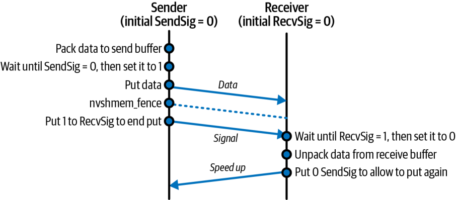


NVSHMEM shines when workloads are irregular or data-dependent, such as graph algorithms, dynamic load balancing, and discrete-event simulations. In these cases, static graphs and collectives are not sufficient.

当工作负载不规则或依赖数据时，例如图算法、动态负载均衡和离散事件仿真，NVSHMEM 便大放异彩。在这些场景中，静态图与集合（collective）并不够用。

Kernels that use NVSHMEM can be captured inside CUDA Graphs like any other kernel. The NVSHMEM device operations occur inside those kernels and are not separate graph nodes. However, NVSHMEM’s true strength is in letting kernels adapt and coordinate on the fly, without a fixed communication script used by a graph.

使用 NVSHMEM 的核函数可以像任何其他核函数一样被捕获进 CUDA Graphs。NVSHMEM 的设备端操作发生在这些核函数内部，并不是独立的图节点。然而，NVSHMEM 真正的强项在于让核函数即时地自适应与协调，而无需图所使用的固定通信脚本。

In short, NVSHMEM transforms a cluster of GPUs into a shared-memory domain, enabling device-only kernel launches, data transfers, and synchronization at latencies and throughputs that far outpace any CPU-mediated approach.

简而言之，NVSHMEM 把一组 GPU 变成一个共享内存域，从而实现纯设备端的核函数启动、数据传输与同步，其延迟和吞吐远超任何以 CPU 为中介的方式。

Imagine a two-stage transformer inference pipeline (attention + multilayer perceptron) that does the following: GPU 0 computes attention, then NVSHMEM puts its activations to GPU 1 and signals. GPU 1, running a persistent kernel, sees the flag and begins the MLP stage.

设想一条两阶段的 Transformer 推理流水线（注意力 + 多层感知机），其流程如下：GPU 0 计算注意力，然后 NVSHMEM 将其激活值 put 到 GPU 1 并发出信号。运行着持久化核函数（persistent kernel）的 GPU 1 看到该标志后，开始 MLP 阶段。

Because GPU 0 immediately moves on to batch 2 while GPU 1 is still on batch 1, after a few iterations both devices are working in perfect tandem. Each handoff is hidden behind active compute warps. This drives near-100% utilization without incurring host stalls.

因为 GPU 0 会立即转去处理 batch 2，而 GPU 1 仍在处理 batch 1，经过几次迭代之后，两台设备便完美地协同工作。每一次交接都被隐藏在活跃的计算 warp 之后。这带来接近 100% 的利用率，而不会引入主机端停顿。

When you need flexible load balancing, NVSHMEM’s atomic operations let each PE grab work dynamically. A PE is an OS process that is part of a parallel NVSHMEM application.

当你需要灵活的负载均衡时，NVSHMEM 的原子操作让每个 PE 都能动态地抢占工作。PE 是一个操作系统进程，是并行 NVSHMEM 应用的组成部分。

The code here shows each GPU pulling the next index from a global counter, processing the chunk, then looping. This enables true work-stealing entirely on the device—without host coordination:

这里的代码展示了每个 GPU 从一个全局计数器拉取下一个索引、处理该分块、然后循环。这在设备上完全实现了真正的工作窃取（work stealing）——无需主机协调：

```
__global__ void work_steal_kernel(/*...*/, int *queue_head, Task *tasks) {
    while (true) {
        // Atomically claim the next task index
        int idx = nvshmem_int_atomic_inc(queue_head);
        if (idx >= N_tasks) break;
        // Process tasks[idx]...
    }
}
```

```
__global__ void work_steal_kernel(/*...*/, int *queue_head, Task *tasks) {
    while (true) {
        // Atomically claim the next task index
        int idx = nvshmem_int_atomic_inc(queue_head);
        if (idx >= N_tasks) break;
        // Process tasks[idx]...
    }
}
```

For scenarios that require the lowest possible jitter, such as a tight multi-GPU collective or synchronous model-parallel step, you can launch one cooperative kernel using NVSHMEM and spanning all GPUs by using nvshmemx_collective_launch() to start the sender and received kernels on GPU 0 and GPU 1 simultaneously. This allows the to coordinate using NVSHMEM without any host intervention. Then, you can use NVSHMEM’s device-side barriers, as shown here:

对于需要尽可能低抖动的场景，例如一次紧凑的多 GPU 集合操作或一次同步的模型并行步骤，你可以启动一个使用 NVSHMEM 并横跨所有 GPU 的协作核函数，方法是用 nvshmemx_collective_launch() 在 GPU 0 和 GPU 1 上同时启动发送方与接收方核函数。这使得它们无需任何主机介入即可使用 NVSHMEM 进行协调。然后，你可以使用 NVSHMEM 的设备端屏障，如下所示：

```
__global__ void synchronized_step_kernel(/*...*/) {
    nvshmem_barrier_all();
    // All GPUs proceed in lockstep here
    // ...
}
```

```
__global__ void synchronized_step_kernel(/*...*/) {
    nvshmem_barrier_all();
    // All GPUs proceed in lockstep here
    // ...
}
```

Here, every PE enters nvshmem_barrier_all() together and then continues simultaneously. This guarantees perfectly aligned execution across the cluster.

这里，每个 PE 一起进入 nvshmem_barrier_all()，然后同时继续。这保证了整个集群完美对齐的执行。

> All kernels that use NVSHMEM’s device-level synchronization or collectives must be launched with nvshmemx_collective_launch(). This ensures that the kernel runs concurrently on all PEs (GPUs) in the job.

> 所有使用 NVSHMEM 设备级同步或集合操作的核函数都必须用 nvshmemx_collective_launch() 启动。这确保该核函数在作业中的所有 PE（GPU）上并发运行。

### Capturing Multi-GPU Collectives with NCCL and CUDA Graphs

### 用 NCCL 与 CUDA Graphs 捕获多 GPU 集合操作

When you need bulk collective operations such as broadcasts, reductions, and all-to-all transfers, NVIDIA’s NCCL library is the go-to on multi-GPU systems. Traditionally, each GPU launches an ncclAllReduce or similar collective from the host. It then waits (synchronizes) before proceeding to the next compute phase. This sequential host orchestration adds overhead and idle time between the forward and backward passes.

当你需要批量的集合操作，如广播、归约和 all-to-all 传输时，NVIDIA 的 NCCL 库是多 GPU 系统上的首选。传统做法是，每个 GPU 从主机端启动一个 ncclAllReduce 或类似的集合操作。然后它会等待（同步），才继续进入下一个计算阶段。这种顺序化的主机编排在前向传递和反向传递之间增加了开销与空闲时间。

However, NCCL calls can also be recorded into CUDA Graphs just like kernels. This lets you “bake in” your forward kernels, the all-reduce, and your backward kernels into a single graph that you replay each iteration:

不过，NCCL 调用也可以像核函数一样被录制进 CUDA Graphs。这让你能把前向核函数、all-reduce 和反向核函数“烘焙”进单个图中，并在每次迭代重放它：

```
cudaStreamBeginCapture(captureStream,
    cudaStreamCaptureModeGlobal);
forwardKernel<<<...>>>(...);
ncclAllReduce(sendBuf, recvBuf, count, ncclFloat,
    ncclSum, comm, captureStream);
backwardKernel<<<...>>>(...);
cudaStreamEndCapture(captureStream, &graph);
// Instantiate and upload before launching
cudaGraphExec_t graphExec;
cudaGraphInstantiate(&graphExec, graph, ...);
cudaGraphUpload(graphExec, captureStream);
// Each training step:
cudaGraphLaunch(graphExec, captureStream);
```

```
cudaStreamBeginCapture(captureStream,
    cudaStreamCaptureModeGlobal);
forwardKernel<<<...>>>(...);
ncclAllReduce(sendBuf, recvBuf, count, ncclFloat,
    ncclSum, comm, captureStream);
backwardKernel<<<...>>>(...);
cudaStreamEndCapture(captureStream, &graph);
// Instantiate and upload before launching
cudaGraphExec_t graphExec;
cudaGraphInstantiate(&graphExec, graph, ...);
cudaGraphUpload(graphExec, captureStream);
// Each training step:
cudaGraphLaunch(graphExec, captureStream);
```

Notice the use of the same capture stream for all operations—including NCCL. Using a graph, NCCL calls become graph nodes just like kernels. Because each process is replaying an identical graph, NCCL’s internal logic finds peers and executes the all-reduce without additional host coordination. This graph-captured all-reduce is especially powerful on large clusters, as it eliminates per-iteration launch jitter and keeps all GPUs busy overlapping compute and network operations.

注意所有操作——包括 NCCL——都使用同一个捕获流。借助图，NCCL 调用会像核函数一样成为图节点。因为每个进程都在重放一个完全相同的图，NCCL 的内部逻辑会找到对端并执行 all-reduce，而无需额外的主机协调。这种图捕获的 all-reduce 在大型集群上尤其强大，因为它消除了每次迭代的启动抖动，并让所有 GPU 忙于重叠计算与网络操作。

Because each GPU launches the same graph, including its collective node, NCCL internally rendezvous across ranks without extra host intervention. The host’s per-iteration work drops to a single cudaGraphLaunch, which reduces CPU overhead and launch jitter.

因为每个 GPU 都启动同一个图（包括其集合节点），NCCL 在内部跨各 rank 进行会合，而无需额外的主机介入。主机每次迭代的工作量降到单次 cudaGraphLaunch，从而减少 CPU 开销与启动抖动。

On top of reduced CPU load, capturing your all-reduce inside a graph allows true overlap of communication and computation across multiple GPUs and compute nodes. Suppose you split gradient computation into two passes, layers 1 through *L*/2 and layers (*L*/2 + 1) through *L,* and map them to separate streams, as shown here:

在减轻 CPU 负载之外，把 all-reduce 捕获进图还能实现跨多个 GPU 和计算节点的通信与计算的真正重叠。假设你把梯度计算拆成两遍，第 1 层到第 *L*/2 层，以及第 (*L*/2 + 1) 层到第 *L* 层，并把它们映射到不同的流，如下所示：

```
// Pseudocode in capture:
computeGradientsLayer1<<<...>>>(..., streamA);
ncclAllReduce(..., comm, streamB);       // in streamB, overlaps with streamA
computeGradientsLayer2<<<...>>>(..., streamA);
ncclAllReduce(..., comm, streamB);
```

```
// Pseudocode in capture:
computeGradientsLayer1<<<...>>>(..., streamA);
ncclAllReduce(..., comm, streamB);       // in streamB, overlaps with streamA
computeGradientsLayer2<<<...>>>(..., streamA);
ncclAllReduce(..., comm, streamB);
```

Since these nodes are captured with their unique stream assignments and dependencies, the CUDA driver can overlap NCCL’s network transfers on streamB with independent work on streamA. This bucketed-all-reduce pattern consistently hides communication latency behind computation, improving multi-GPU scaling.

由于这些节点是带着各自独有的流分配与依赖关系被捕获的，CUDA 驱动可以把 streamB 上 NCCL 的网络传输与 streamA 上的独立工作重叠起来。这种分桶式 all-reduce（bucketed-all-reduce）模式能稳定地把通信延迟隐藏在计算之后，改善多 GPU 扩展性。

> NCCL collectives are graph capture–compatible when all ranks capture and replay the same sequence with the same communicator. However, all ranks must capture and replay the same NCCL sequence with the same communicator. Mismatched communicators across graph replays will risk deadlock (at best, relatively easy to debug) or incorrect results (at worst, silent failure, and difficult to debug). Also, it’s recommended to capture preliminary warmup collectives, run them ahead of time to initialize communicators, and reuse the instantiated graph to achieve minimal steady-state latency.

> 当所有 rank 都用相同的通信子（communicator）捕获并重放相同的序列时，NCCL 集合操作与图捕获是兼容的。然而，所有 rank 必须用相同的通信子捕获并重放相同的 NCCL 序列。跨图重放使用不匹配的通信子会有死锁风险（这还算好，相对容易调试）或产生错误结果（最糟的情况，静默失败，且难以调试）。此外，建议捕获初步的预热集合操作，提前运行它们以初始化通信子，并复用已实例化的图，以达到最小的稳态延迟。

In practice, this bucketed all-reduce approach is standard in large-model training. By overlapping chunks of gradient reduction with computation of the next layers, you hide nearly all network time. An example of a bucketed all-reduce with DDP running in separate processes (process 1 and process 2) is shown in Figure 12-15.

实践中，这种分桶式 all-reduce 做法在大模型训练中是标准做法。通过把一块块的梯度归约与后续层的计算重叠，你几乎隐藏了所有网络时间。图 12-15 展示了一个在独立进程（进程 1 和进程 2）中运行的、带 DDP 的分桶式 all-reduce 示例。

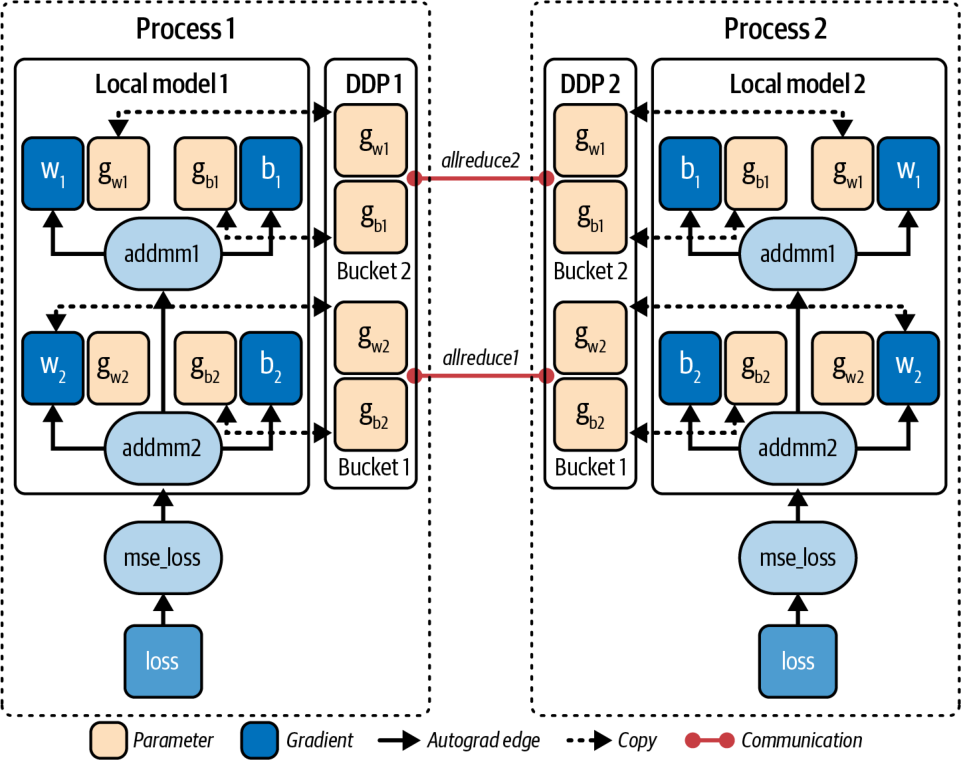


Modern libraries like PyTorch DDP implement variants of this approach automatically. But capturing a CUDA Graph can further reduce CPU overhead and provide more deterministic performance.

像 PyTorch DDP 这样的现代库会自动实现这种方法的变体。但捕获一个 CUDA Graph 可以进一步减少 CPU 开销，并提供更确定的性能。

Keep in mind a few considerations for using CUDA Graphs in multi-GPU environments. First, all participating GPUs must record and replay collectives in the identical sequence to avoid deadlock—much like MPI’s collective rules in which all ranks must enter the collective in the same order.

在多 GPU 环境中使用 CUDA Graphs 时要记住几点考虑。首先，所有参与的 GPU 都必须以完全相同的顺序录制并重放集合操作，以避免死锁——这很像 MPI 的集合规则，其中所有 rank 必须以相同的顺序进入集合操作。

Next, while CUDA Graphs pin and reuse GPU buffers, make sure allocations for your gradients and communication buffers are done before capture. Also, as discussed earlier, if you need to modify parameters in your graph, such as batch size, you can use cudaGraphExecUpdate to patch those parameters without a full recapture.

其次，虽然 CUDA Graphs 会固定并复用 GPU 缓冲区，但要确保梯度和通信缓冲区的分配在捕获之前完成。此外，如前所述，如果你需要修改图中的参数，例如 batch size，你可以用 cudaGraphExecUpdate 来打补丁式地修改这些参数，而无需完整重新捕获。

In practice, capturing NCCL plus compute in a graph can cut per-step CPU time and speed up large-model training across many GPUs. At a massive scale, with hundreds of thousands of GPUs, these savings compound—creating tighter synchronization and higher utilization across the whole cluster.

实践中，把 NCCL 加计算一起捕获进图，可以削减每步的 CPU 时间，并加速横跨众多 GPU 的大模型训练。在数十万 GPU 的超大规模下，这些节省会叠加累积——在整个集群上带来更紧密的同步与更高的利用率。

> NCCL and CUDA Graphs give us an efficient way to schedule collective communication alongside computation. However, not all multi-GPU communication is collective—sometimes we need more fine-grained or asynchronous sharing of data between GPUs. This is exactly where NVSHMEM, described earlier, can help.

> NCCL 与 CUDA Graphs 为我们提供了一种把集合通信与计算一并调度的高效方式。然而，并非所有多 GPU 通信都是集合式的——有时我们需要在 GPU 之间进行更细粒度或异步的数据共享。而这正是前面介绍的 NVSHMEM 能派上用场的地方。

### Pattern for N-GPU Scaling

### N-GPU 扩展模式

Whether you’re using simple peer copies, NCCL rings, or NVSHMEM one-sided atomics, the pattern of scaling to many GPUs is always the same. The system should dispatch kernels once, pipeline and overlap your data transfers with compute, and scale linearly—especially with the host CPU off the critical path.

无论你使用简单的对等拷贝、NCCL 环，还是 NVSHMEM 的单边原子操作，扩展到多 GPU 的模式始终相同。系统应当一次性分派核函数、把数据传输与计算做流水线化与重叠，并线性扩展——尤其是要让主机 CPU 离开关键路径。

For example, 4 GPUs should ideally behave like a single GPU that is 4× faster—assuming you can keep all the GPUs fed with data in parallel (see Figure 12-16) and the host out of the loop. If you can do this, you should achieve near-linear speedups by properly overlapping communication computation. Without overlap, scaling will plateau once the communication time equals the computation time.

例如，4 个 GPU 在理想情况下应当表现得像一个快 4× 的单 GPU——前提是你能让所有 GPU 并行地持续有数据可用（见图 12-16），并让主机置身事外。如果你能做到这一点，通过恰当地重叠通信与计算，你应当获得接近线性的加速。若没有重叠，一旦通信时间等于计算时间，扩展就会趋于平台期。

As you increase GPUs, you need to use more aggressive pipelining of data transfers and computations—and use less CPU-side orchestration and synchronization. As such, you should offload more orchestration to the devices using asynchronous copies, NCCL collectives in graphs, and NVSHMEM’s PGAS primitives. This shifts even more responsibility to software.

随着 GPU 数量增加，你需要对数据传输与计算采用更激进的流水线化——并减少 CPU 端的编排与同步。因此，你应当用异步拷贝、图中的 NCCL 集合操作以及 NVSHMEM 的 PGAS 原语，把更多编排卸载到设备上。这把更多责任转移到了软件。

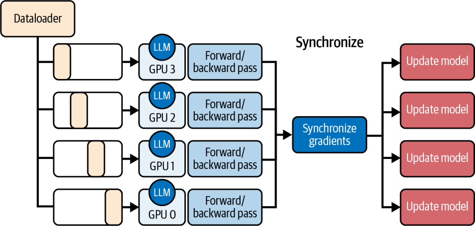


Applying these techniques, you can eliminate the CPU bottleneck, saturate the fast interconnects, max out the compute FLOPS, and build truly low-latency multi-GPU pipelines. Next, let’s revisit roofline models in the context of dynamic and device-side scheduling and orchestration.

运用这些技术，你可以消除 CPU 瓶颈、把高速互连打满、把计算 FLOPS 榨干，构建真正低延迟的多 GPU 流水线。接下来，让我们在动态与设备端调度和编排的语境下重新审视 Roofline 模型。

## Roofline-Guided Scheduling and Orchestration Decisions

## Roofline 引导的调度与编排决策

Over the last couple of chapters, we have collected a solid set of orchestration techniques, including CUDA streams, kernel fusion, persistent kernels, CUDA Graphs, dynamic parallelism, and more. The roofline model helps decide which tool will likely give the biggest win for your situation.

在过去的几章里，我们收集了一套扎实的编排技术，包括 CUDA streams、核函数融合、持久化核函数、CUDA Graphs、动态并行等等。Roofline 模型能帮助判断哪种工具最可能为你的情形带来最大收益。

At its heart, roofline boils down to operational arithmetic intensity, or the ratio of FLOPS performed to bytes moved. It consists of two hardware “ceilings”: memory roof (sloped) showing the peak throughput if you’re limited by bandwidth, and compute roof (flat) marking the peak arithmetic rate when you’re ALU-bound, as shown in Figure 12-17.

Roofline 的核心可归结为运算的算术强度（arithmetic intensity），即执行的 FLOPS 与移动的字节数之比。它由两个硬件“天花板”构成：内存屋顶（memory roof，斜线）表示在受带宽限制时的峰值吞吐，计算屋顶（compute roof，平线）标出在受 ALU 限制时的峰值算术速率，如图 12-17 所示。

If your kernel lies near the memory roof (e.g., low FLOPS/byte) and is therefore memory bound, the best optimizations are those that hide or overlap memory transfers with computation. That means you should use asynchronous copies with CUDA streams—or even run multiple memory-bound kernels concurrently. This way, you can better saturate different parts of the memory system.

如果你的核函数靠近内存屋顶（例如低 FLOPS/byte），因而是访存受限（memory bound）的，那么最佳优化就是那些把内存传输与计算隐藏或重叠起来的手段。这意味着你应当用 CUDA streams 做异步拷贝——甚至并发运行多个访存受限的核函数。这样，你可以更好地打满内存系统的不同部分。

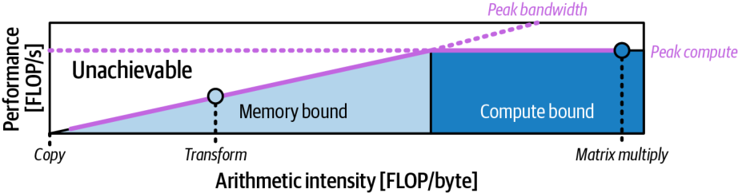


> Kernel fusion helps only modestly for memory-bound workloads. It can shave off a number of intermediate global-memory round trips. But the real gains come from masking latency and packing more loads/stores in flight.

> 核函数融合对访存受限的工作负载只有适度帮助。它能省去若干次中间的全局内存往返。但真正的收益来自于掩盖延迟，以及让更多的加载/存储在途并发。

In contrast, a high-intensity kernel sitting under the compute roof needs to keep its ALUs busy. Here kernel fusion shines by combining separate add+scale (our fused example from earlier) into one pass to increase FLOPS per byte, shift the point rightwards on the roofline plot, and push the kernel toward a higher percentage of peak FLOP/s.

相反，一个位于计算屋顶之下的高强度核函数需要让它的 ALU 保持忙碌。这里核函数融合便大放异彩，它把分开的 add+scale（前面我们的融合示例）合并成一遍，以提高每字节的 FLOPS、把点在 Roofline 图上向右移动，并把核函数推向更高比例的峰值 FLOP/s。

Likewise, persistent kernels, thread block clusters, and device-initiated CUDA Graphs don’t change your intensity number, but they reduce idle gaps caused by repeated launches. This pushes your kernel’s performance closer to the flat compute ceiling.

同样地，持久化核函数、线程块簇（thread block cluster）以及设备端发起的 CUDA Graphs 并不改变你的强度数值，但它们减少了反复启动所造成的空闲间隙（idle gap）。这把你核函数的性能推向那条平坦的计算天花板。

Many real workloads fall in between. They are neither strongly memory bound nor compute bound. In those cases, concurrency is your friend. By launching several modest-intensity kernels in parallel, whether using streams, concurrent graphs, or multiple persistent kernels, you are combining them such that the aggregate throughput point sits higher on both axes. This better utilizes the device’s resources.

许多真实工作负载落在两者之间。它们既不是强访存受限，也不是强计算受限。在这些情况下，并发是你的好帮手。通过并行启动若干中等强度的核函数——无论是用流、并发的图，还是多个持久化核函数——你把它们组合起来，使得聚合吞吐点在两个坐标轴上都处于更高位置。这更好地利用了设备的资源。

Thorough roofline analysis requires disciplined measurement. Use Nsight Compute to count FLOPS and bytes transferred, plot your kernel’s point, and see how far it lies below each roofline.

彻底的 Roofline 分析需要严谨的测量。用 Nsight Compute 统计 FLOPS 与传输的字节数，把你核函数的点画出来，看看它离每条 Roofline 有多远。

If the workload is memory bound, reach for streams, overlap, and maybe reduce precision (FP16, FP8, FP4) to reduce the denominator in the arithmetic intensity equation (e.g., the number of bytes transferred.)

如果工作负载是访存受限的，就动用流、重叠，也许还可以降低精度（FP16、FP8、FP4），以减小算术强度方程中的分母（例如传输的字节数）。

And if your kernel is compute bound but not hitting peak FLOPS due to launch overhead or idle periods, focus on reducing launch overhead. As we’ve learned, you can do this by fusing operations into one kernel, using persistent kernels, capturing CUDA Graphs, or performing device-side launches. This will keep the ALUs fed.

而如果你的核函数是计算受限，却因为启动开销或空闲期而未触及峰值 FLOPS，就把重点放在减少启动开销上。正如我们所学，你可以通过把操作融合进单个核函数、使用持久化核函数、捕获 CUDA Graphs，或执行设备端启动来做到这一点。这会让 ALU 一直有活干。

If your kernel sits well under both roofs and is neither fully memory nor compute bound, then try to increase concurrency. Run multiple kernels and streams in parallel. This will better utilize all of your system resources.

如果你的核函数远低于两条屋顶，既非完全访存受限也非完全计算受限，那就尝试提高并发。并行运行多个核函数与流。这会更好地利用你所有的系统资源。

With this quantitative guidance, you can pick the right orchestration strategy for your kernel rather than trying every trick all at once. Just remember to validate that each optimization moves you closer to the hardware’s true potential. Always measure after applying an optimization.

有了这套定量的指导，你就能为你的核函数挑选正确的编排策略，而不是把所有招数一股脑全试一遍。只要记住验证每次优化都让你更接近硬件的真实潜力。在应用优化之后，务必测量。

The roofline model guides expectations, but real performance measurements, including compute throughput, achieved occupancy, memory throughput, etc., will tell the full story. A roofline analysis combined with iterative and continuous profiling will verify that your chosen optimization strategies are actually effective.

Roofline 模型引导预期，但真实的性能测量——包括计算吞吐、实测占用率、内存吞吐等——才会道出完整的故事。把 Roofline 分析与迭代式、持续性的性能剖析相结合，将验证你所选的优化策略是否真的有效。

## Key Takeaways

## 关键要点

Achieving peak GPU performance hinges on weaving together computation and data movement with minimal overhead. Efficient orchestration streamlines complex workloads across CPU and GPU, ensuring neither side stalls the other. Here are some key takeaways from this chapter:

达到峰值 GPU 性能，关键在于以最小的开销把计算与数据移动交织在一起。高效的编排让复杂工作负载在 CPU 与 GPU 之间流畅运转，确保任何一方都不拖住另一方。以下是本章的一些关键要点：

*Dynamic scheduling with L2-cache atomic queues* L2-cache atomics on modern GPUs are exceptionally fast. Use fast L2-cache atomics with batched increments to balance irregular workloads on-GPU. This batched-work allocation reduces contention and keeps warps busy by eliminating warp idle gaps. It can significantly boost throughput up to ~2× in extreme imbalance cases but typically between 10% and 30%. Even a modest batch size of 8 or 16 can eliminate most contention due to the high L2 bandwidth.

*用 L2 缓存原子队列做动态调度* 现代 GPU 上的 L2 缓存原子操作异常快。用快速的 L2 缓存原子操作配合批量自增，在 GPU 上平衡不规则工作负载。这种批量式的工作分配减少了争用（contention），并通过消除 warp 空闲间隙让 warp 保持忙碌。在极端不均衡的情况下它能显著提升吞吐，最高可达 ~2×，但通常在 10% 到 30% 之间。由于 L2 带宽很高，即便是 8 或 16 这样不大的 batch size 也能消除大部分争用。

*CUDA Graphs for fixed pipelines* Record a sequence of GPU operations once and then replay it with a single host call each iteration. This reduces per-iteration CPU scheduling overhead, often a 20%–30% latency reduction (more at a larger scale). Make sure you’re achieving maximum overlap of dependent operations on the GPU.

*用 CUDA Graphs 处理固定流水线* 把一系列 GPU 操作录制一次，然后每次迭代用单次主机调用重放它。这减少了每次迭代的 CPU 调度开销，通常能降低 20%–30% 的延迟（规模越大，降幅越大）。要确保你在 GPU 上实现了相互依赖操作的最大重叠。

*Low-overhead launch with CUDA Graphs* Capture a sequence of asynchronous copies, kernel launches, event records, and allocations in a CUDA Graph (cudaStreamBeginCapture/cudaStreamEndCapture). Replaying the graph with cudaGraphLaunch eliminates per-call CPU enqueue overhead while preserving all interstream dependencies, further reducing runtime bottlenecks.

*用 CUDA Graphs 做低开销启动* 把一系列异步拷贝、核函数启动、事件记录和分配捕获进一个 CUDA Graph（cudaStreamBeginCapture/cudaStreamEndCapture）。用 cudaGraphLaunch 重放该图，可在保留所有流间依赖的同时消除每次调用的 CPU 入队开销，进一步减少运行时瓶颈。

*Device-side orchestration* Launch work from the GPU itself by tail-launching a prerecorded CUDA Graph or using dynamic parallelism to spawn child kernels. This eliminates CPU scheduling gaps entirely and allows the GPU to remain busy end to end with no host intervention.

*设备端编排* 通过尾部启动（tail-launch）一个预先录制的 CUDA Graph，或使用动态并行来派生子核函数，从 GPU 自身启动工作。这彻底消除了 CPU 调度间隙，并让 GPU 端到端保持忙碌，无需任何主机介入。

*Multi-GPU overlap* Always overlap communication with computation. Use separate streams to pipeline GPU peer-to-peer transfers (cudaMemcpyPeerAsync), NCCL collectives, CUDA-aware MPI (RDMA), or NVSHMEM one-sided operations. This hides communication latency behind useful work and can approach linear scaling across many GPUs under favorable compute-to-communication ratios and adequate overlap—and even across cluster nodes—when overlap is sufficient.

*多 GPU 重叠* 始终把通信与计算重叠。用不同的流把 GPU 对等传输（cudaMemcpyPeerAsync）、NCCL 集合操作、CUDA-aware MPI（RDMA）或 NVSHMEM 单边操作做成流水线。这把通信延迟隐藏在有用的工作之后，并且在有利的计算与通信比以及充分重叠的条件下——甚至跨集群节点——当重叠足够时，可以逼近多 GPU 的线性扩展。

*Roofline-guided choices* Let the roofline chart drive your strategy. If your kernel is memory bound, focus on overlap and reducing data movement with asynchronous memcopies and mixed precision like FP8/FP4. If it’s compute bound but underachieving due to overhead, use launch-reduction techniques like kernel fusion, persistent kernels, and CUDA Graphs to approach the compute ceiling. For kernels in-between, increase concurrency by running multiple operations in parallel to utilize all hardware units. Always verify with profiling that the chosen optimization moves the needle.

*Roofline 引导的抉择* 让 Roofline 图来驱动你的策略。如果你的核函数是访存受限，就把重点放在重叠以及用异步内存拷贝和 FP8/FP4 之类的混合精度来减少数据移动上。如果它是计算受限却因开销而表现不足，就使用核函数融合、持久化核函数和 CUDA Graphs 之类的启动削减技术去逼近计算天花板。对于介于两者之间的核函数，通过并行运行多个操作来提高并发，以利用所有硬件单元。始终用性能剖析来验证所选优化确实产生了效果。

By weaving these techniques together—dynamic dispatch, cooperative kernels, graph capture/replay, and GPU-native memory sharing—you create pipelines that saturate every part of the GPU cluster for ultrascale AI workloads.

通过把这些技术交织在一起——动态分派、协作核函数、图捕获/重放以及 GPU 原生的内存共享——你打造出的流水线能为超大规模 AI 工作负载打满 GPU 集群的每一个部分。

## Conclusion

## 结论

In this chapter, we moved beyond single-kernel optimizations and explored end-to-end orchestration techniques. We covered how to launch work entirely on the device with dynamic parallelism, capture complex workflows in CUDA Graphs, and coordinate many GPUs using NCCL and NVSHMEM. Each technique shares the same goal: keep every engine fueled with work, hide latency, and collapse host–device gaps so that your hardware runs flat-out.

在本章中，我们超越了单核函数优化，探索了端到端的编排技术。我们讲解了如何用动态并行完全在设备上启动工作、如何把复杂的工作流捕获进 CUDA Graphs，以及如何用 NCCL 和 NVSHMEM 协调众多 GPU。每种技术都共享同一个目标：让每台引擎都有活可干、隐藏延迟、并压平主机-设备之间的间隙，从而让你的硬件全速运转。

NVIDIA’s modern GPU platforms blur the line between CPU and GPU more than ever. The Grace Blackwell and Vera Rubin Superchips, for example, connect the CPU with multiple GPUs using coherent NVLink with enormous bandwidth.

NVIDIA 的现代 GPU 平台比以往任何时候都更加模糊了 CPU 与 GPU 之间的界线。例如，Grace Blackwell 和 Vera Rubin Superchip 用带有巨大带宽的一致性 NVLink 把 CPU 与多个 GPU 连接起来。

But even as hardware reduces CPU-GPU barriers, the responsibility still falls on software to fully exploit this high-performance hardware. The approaches in this chapter, whether with CUDA in C++ or higher-level library APIs, are how we take advantage of these advancements.

但即便硬件在降低 CPU-GPU 之间的壁垒，充分发挥这种高性能硬件的责任仍然落在软件身上。本章中的方法，无论是用 C++ 中的 CUDA 还是更高层的库 API，都是我们利用这些进步的途径。

In the next chapter, we’ll see how PyTorch integrates many of these ideas, including streams, graphs, asynchronous operations, and optimized kernels, so you can achieve this performance in just a few lines of Python. Let’s dive into the PyTorch ecosystem and understand why it’s so popular for implementing high-performance AI workloads.

在下一章，我们将看到 PyTorch 如何整合这些理念中的许多——包括流、图、异步操作和优化过的核函数——让你只用几行 Python 就能获得这种性能。让我们深入 PyTorch 生态系统，理解它为何在实现高性能 AI 工作负载方面如此受欢迎。
