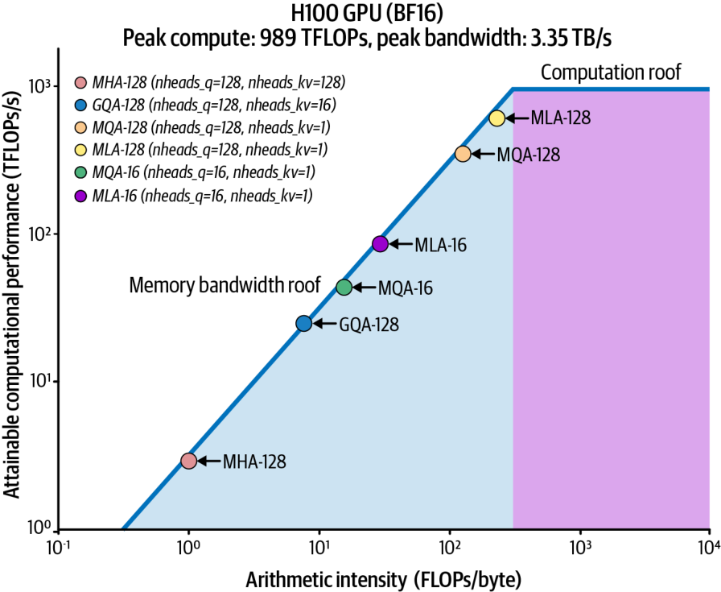
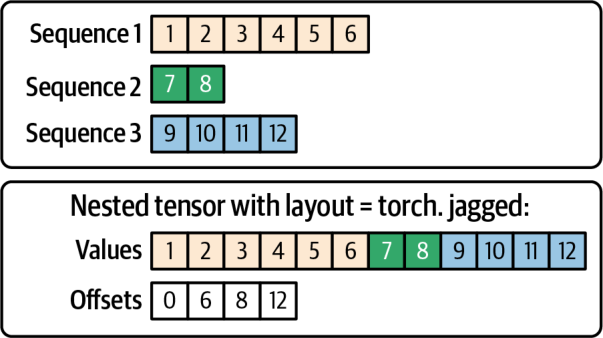
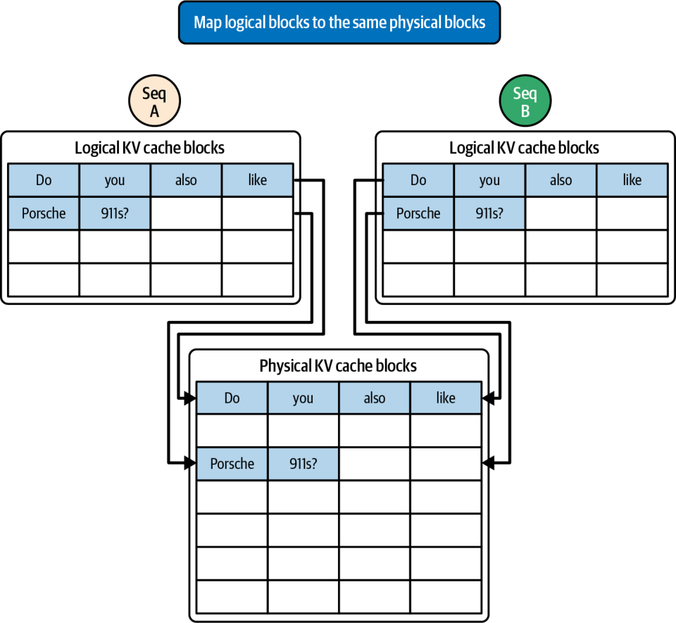
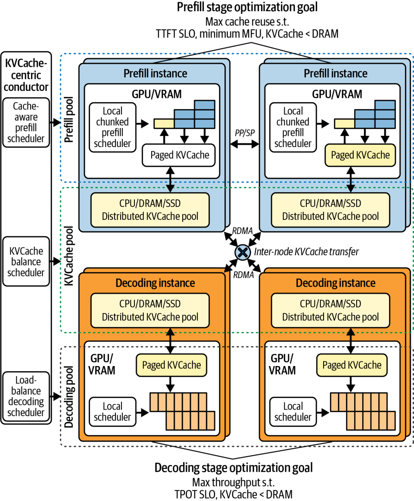
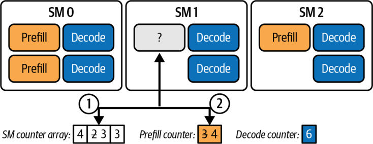
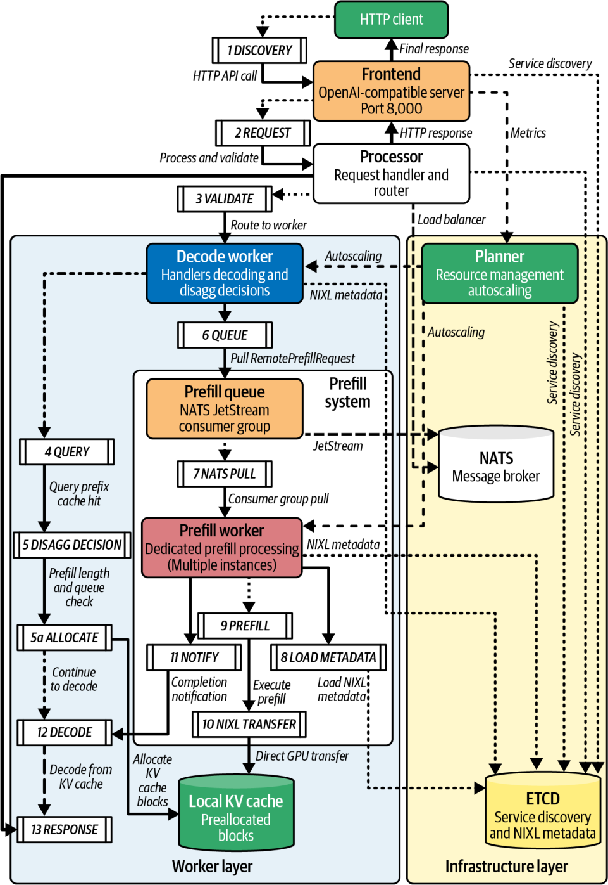
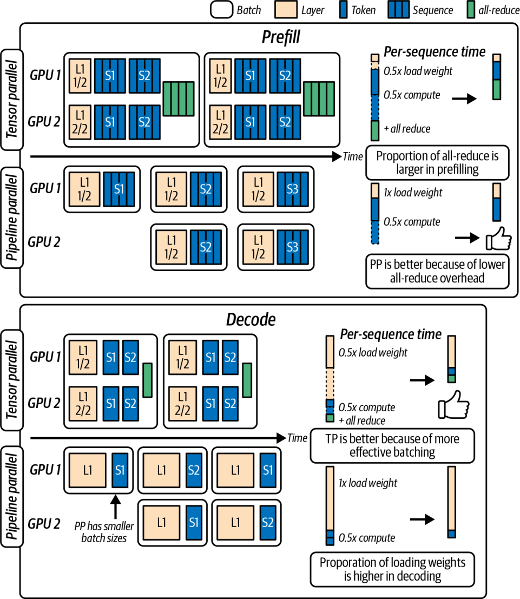
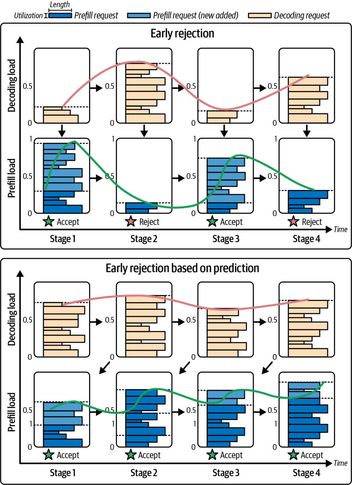
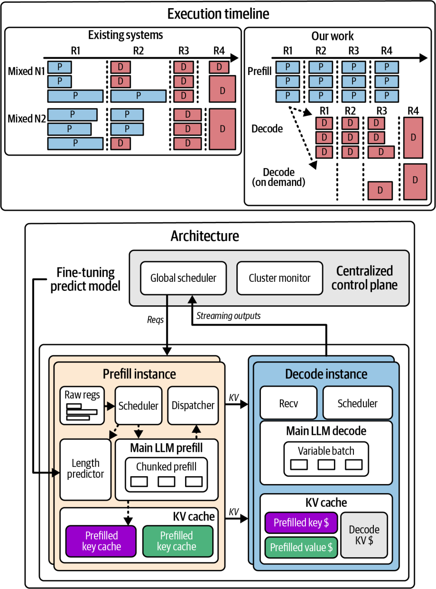
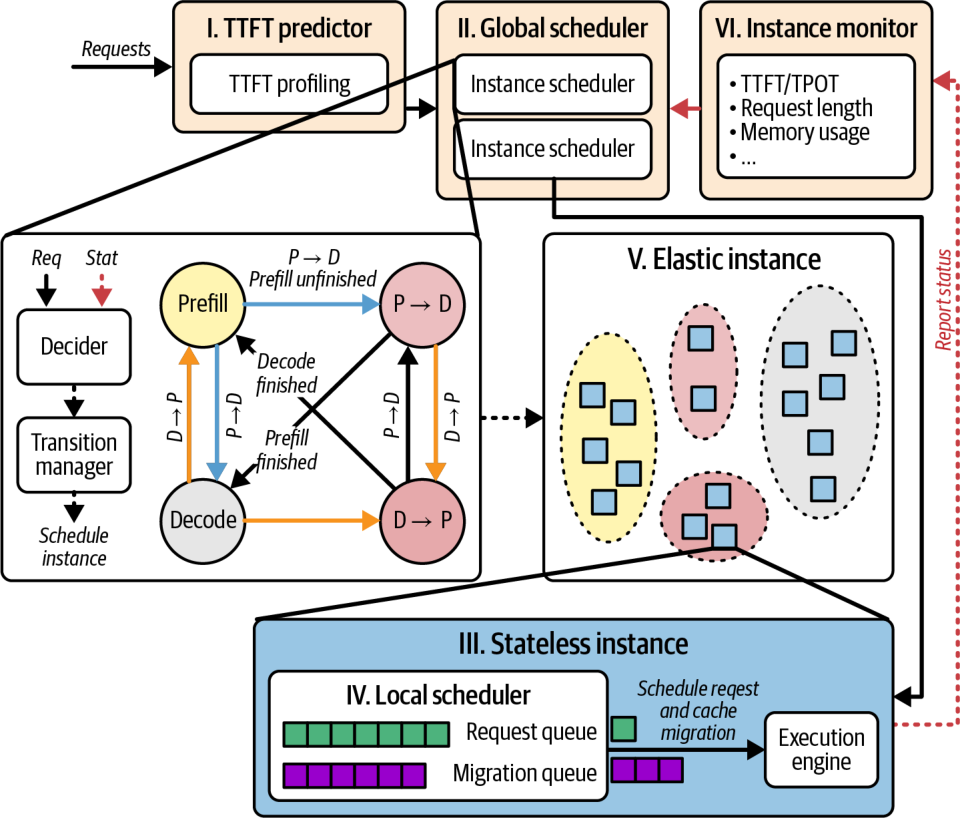

# Chapter 18. Advanced Prefill-Decode and KV Cache Tuning

# 第 18 章 高级 Prefill-Decode 与 KV 缓存调优

This chapter builds upon Chapter 17 and dives deeper into advanced optimizations for the inference prefill and decode phases. We’ll build upon the high-level scaling strategies and cover low-level techniques, including single decode “mega kernels,” intelligent KV cache tuning and sharing across GPUs, fast GPU-to-GPU transfer of the prompt state, adaptive resource scheduling, and dynamic routing between prefill and decode workers.

本章在第 17 章的基础上，深入探讨推理 prefill 与 decode 阶段的高级优化。我们将在高层扩展策略之上，介绍一系列底层技术，包括单次 decode 的“超级核函数（mega kernel）”、跨 GPU 的智能 KV 缓存调优与共享、提示词状态的快速 GPU 到 GPU 传输、自适应资源调度，以及 prefill 与 decode worker 之间的动态路由。

We will also highlight hardware and software innovations, which provide new levels of performance and efficiency. By applying these techniques, you can significantly reduce decode latency, improve throughput per GPU, and meet strict latency SLOs at scale.

我们还会重点介绍那些带来全新性能与效率水平的软硬件创新。运用这些技术，你可以大幅降低 decode 延迟、提升单 GPU 吞吐量，并在大规模场景下满足严格的延迟 SLO。

## Optimized Decode Kernels

## 优化的 Decode 核函数

Until now, we have been focused on high-level system and cluster optimization strategies. Another set of techniques to consider when increasing ultrascale inference is low-level kernel and memory management tuning—especially for the decode phase.

到目前为止，我们一直聚焦于高层的系统与集群优化策略。当推动超大规模推理时，另一类值得考虑的技术是底层核函数与内存管理调优——尤其是针对 decode 阶段。

The decode phase is distributed and often memory bound. This has motivated researchers and practitioners to make the decode phase as fast as possible—and tuned for specific hardware. Two notable innovations in this space are FlashMLA (DeepSeek), ThunderMLA (Stanford), and FlexDecoding (PyTorch). These specifically target the transformer’s multihead attention efficiency during decode in variable-sequence scenarios common in LLM workloads. Let’s cover each of these next.

decode 阶段是分布式的，且往往访存受限（memory bound）。这促使研究者与从业者尽可能地加快 decode 阶段——并针对特定硬件进行调优。该领域中有三项值得关注的创新：FlashMLA（DeepSeek）、ThunderMLA（Stanford）以及 FlexDecoding（PyTorch）。它们专门针对 transformer 在 decode 期间的多头注意力效率，应对 LLM 负载中常见的变长序列场景。下面我们逐一介绍。

### FlashMLA (DeepSeek)

### FlashMLA（DeepSeek）

Flash Multi-Latent Attention, or FlashMLA, is an optimized decoding kernel introduced by DeepSeek. It specifically focuses on the single-token decode step, which is essentially the forward pass of a transformer layer used to generate the next token. FlashMLA makes decode faster by fusing operations and better using the GPU memory hierarchy.

Flash Multi-Latent Attention，即 FlashMLA，是 DeepSeek 推出的一种优化的 decode 核函数。它专门聚焦于单 token 的 decode 步骤——本质上就是用于生成下一个 token 的 transformer 层前向传播。FlashMLA 通过融合运算并更好地利用 GPU 内存层次结构，使 decode 更快。

FlashMLA (decode) is to inference what FlashAttention (prefill) is to training. It reduces memory access overhead and latency. With FlashMLA, you can achieve large latency reductions for the decode phase compared to standard kernels.

FlashMLA（decode）之于推理，正如 FlashAttention（prefill）之于训练。它降低了内存访问开销与延迟。使用 FlashMLA，与标准核函数相比，你可以在 decode 阶段实现大幅的延迟下降。

FlashMLA increases arithmetic intensity by fusing multiple attention operations into one. This way, it can process multiple heads and multiple time steps in one fused kernel launch. This increases GPU utilization during the decode by keeping the math units busy despite small batch sizes. Figure 18-1 shows the improvement in arithmetic intensity for MLA compared to other attention implementations like grouped-query attention (GQA) and multiquery attention (MQA) on a Hopper H100 GPU. (Note: Blackwell shifts both rooflines upward with higher TFLOPs and HBM bandwidth.)

FlashMLA 通过把多个注意力运算融合成一个，从而提升算术强度（arithmetic intensity）。这样，它就能在一次融合核函数启动中处理多个头和多个时间步。即便批量很小，也能让数学计算单元保持繁忙，从而提高 decode 期间的 GPU 利用率。图 18-1 展示了在 Hopper H100 GPU 上，MLA（多头潜在注意力，Multi-head Latent Attention）相较于其他注意力实现（如分组查询注意力（grouped-query attention，GQA）和多查询注意力（multi-query attention，MQA））在算术强度上的提升。（注：Blackwell 凭借更高的 TFLOPs 与 HBM 带宽，将两条 roofline 都向上抬升。）




The introduction of FlashMLA was significant because it showed that the decode phase’s bottlenecks, memory bandwidth, and kernel-launch overhead can be reduced—even on suboptimal GPU hardware. It reduced the number of separate GPU kernel launches and optimized memory access patterns—squeezing as much performance out of constrained hardware as possible for decoding tasks.

FlashMLA 的推出意义重大，因为它表明——即便在并非最优的 GPU 硬件上——decode 阶段的瓶颈、内存带宽以及核函数启动开销也可以被降低。它减少了独立 GPU 核函数启动的数量，并优化了内存访问模式——为 decode 任务尽可能压榨受限硬件的每一分性能。

DeepSeek’s open sourced FlashMLA implementation is available and seeing adoption. SGLang and vLLM both provide first-class support for DeepSeek models. As such, you should evaluate FlashMLA to increase per-token decode throughput without changing higher-level architecture.

DeepSeek 开源的 FlashMLA 实现已经可用，并逐渐被采纳。SGLang 和 vLLM 都为 DeepSeek 模型提供了一流的支持。因此，你应当评估 FlashMLA，以在不改变更高层架构的前提下提升单 token 的 decode 吞吐量。

Since DeepSeek’s open sourced FlashMLA is integrated into modern inference serving systems, you should explore it as a way to increase the throughput of each decode worker—or reduce latency per token—without any higher-level architectural change.

由于 DeepSeek 开源的 FlashMLA 已集成到现代推理服务系统中，你应把它作为一种手段来探索——在不做任何更高层架构改动的前提下，提升每个 decode worker 的吞吐量，或降低每 token 的延迟。

### ThunderMLA (Stanford)

### ThunderMLA（Stanford）

Building on FlashMLA, researchers at Stanford introduced ThunderMLA, a completely fused attention decode “megakernel” that focuses on decoding and scheduling (rather than fusing the full feed-forward block.) This “megakernel” reduces launch overhead and tail effects by combining multiple kernel launches into one—as well as consolidating intermediate memory writes. ThunderMLA reports 20–35% faster decode throughput compared to FlashMLA across different workloads

在 FlashMLA 的基础上，Stanford 的研究者推出了 ThunderMLA，这是一个完全融合的注意力 decode “超级核函数”，聚焦于 decode 与调度（而非融合整个前馈块）。这个“超级核函数”通过把多次核函数启动合并为一次——并整合中间内存写入——来降低启动开销与尾部效应。ThunderMLA 报告称，在不同负载下，其 decode 吞吐量比 FlashMLA 快 20–35%

The key idea of ThunderMLA is that when decoding sequences of different lengths, using fine-grained scheduling and fused operations can avoid the tail effect in which some sequences finish earlier while others leave the GPU partially idle. ThunderMLA keeps the GPU busy even if some decode streams complete earlier. It does this by dynamically packing and processing the remaining streams using its fused approach.

ThunderMLA 的核心思想是：当 decode 不同长度的序列时，采用细粒度调度与融合运算，可以避免这样一种尾部效应——某些序列较早完成，而其他序列让 GPU 部分空闲。即便某些 decode 流较早完成，ThunderMLA 也能让 GPU 保持繁忙。它通过用融合方式动态打包并处理剩余的流来实现这一点。

These benefits are amplified on modern GPUs with larger L2 caches and faster attention primitives. Notably, modern NVIDIA GPUs also provide Transformer Engine support for FP8 and FP4 (and FP6, although we focus mostly on FP8/FP4 formats in this text since FP6 is not widely used in existing AI frameworks and tools). Combined with higher memory bandwidth, the Tensor Cores let kernels like ThunderMLA operate much closer to hardware limits. On modern GPUs, ThunderMLA achieves even lower latency per token due to these architectural advances.

在拥有更大 L2 缓存和更快注意力原语（attention primitive）的现代 GPU 上，这些收益会被进一步放大。值得注意的是，现代 NVIDIA GPU 还提供 Transformer Engine 对 FP8 和 FP4 的支持（以及 FP6，不过本书主要聚焦 FP8/FP4 格式，因为 FP6 在现有 AI 框架与工具中尚未广泛使用）。结合更高的内存带宽，Tensor Core 让像 ThunderMLA 这样的核函数能够运行得远远更接近硬件极限。在现代 GPU 上，得益于这些架构进步，ThunderMLA 实现了更低的每 token 延迟。

### FlexDecoding (PyTorch)

### FlexDecoding（PyTorch）

In Chapter 14, we discussed PyTorch’s FlexAttention, which lets you JIT-compile fused kernels for arbitrary sparsity patterns in attention, including local windows, block-sparse patterns, etc.—all without writing custom CUDA. Under the hood, TorchInductor + OpenAI’s Triton generate a fused kernel that computes only the allowed query-key pairs for that pattern. Triton automatically applies performance optimization techniques like warp specialization and asynchronous copies when beneficial on the given hardware. However, you can also tune triton.Config to further customize by configuring num_consumer_groups for example.

在第 14 章中，我们讨论了 PyTorch 的 FlexAttention，它让你能够为任意注意力稀疏模式（包括局部窗口、块稀疏模式等）即时编译（JIT）融合核函数——而无需编写自定义 CUDA。在底层，TorchInductor + OpenAI 的 Triton 会生成一个融合核函数，只计算该模式下允许的 query-key 对。当在给定硬件上有利时，Triton 会自动应用 warp specialization 和异步拷贝等性能优化技术。不过，你也可以调优 triton.Config，例如通过配置 num_consumer_groups 来进一步定制。

FlexDecoding is the decoding backend of torch.nn.attention.flex_attention. FlexDecoding also lets you manage KV in place and supports masks and biases just like FlexAttention. Specifically, FlexDecoding compiles a specialized kernel for the decode phase (Q_len=1) attending over a growing KV cache.

FlexDecoding 是 torch.nn.attention.flex_attention 的 decode 后端。FlexDecoding 同样让你能够就地管理 KV，并像 FlexAttention 一样支持掩码与偏置。具体来说，FlexDecoding 为 decode 阶段（Q_len=1）编译一个专用核函数，在不断增长的 KV 缓存上进行注意力计算。

At runtime, the FlexDecoding implementation picks the specialized decode kernel and reuses it across multiple decode steps. This helps to minimize overhead when shapes and dtypes remain compatible—greatly speeding up long-sequence LLM inference.

在运行时，FlexDecoding 实现会选择这个专用的 decode 核函数，并在多个 decode 步骤间复用它。当形状与 dtype 保持兼容时，这有助于最小化开销——从而大幅加速长序列 LLM 推理。

> Prefer torch.compile(mode="max-autotune") for stable, latency-critical decode once recompilations are under control. Keep the capture boundary narrow (per-layer or attention block) to reduce graph invalidations from ragged batching. Prefer Transformer Engine FP8 (MXFP8) for prefill and decode. Consider FP4 (NVFP4) when accuracy permits and performance increases. As of this writing, FP4 support is still maturing and can underperform 8-bit and 16-bit formats in the near-term. Continue to set torch.set_float32_matmul_precision("high") to enable TF32 fallback on remaining FP32 ops. FlexAttention’s decode backend supports common performance enhancements including grouped-query attention (GQA) and PagedAttention.

> 一旦重编译处于可控状态，对于稳定、延迟敏感的 decode，优先使用 torch.compile(mode="max-autotune")。保持捕获边界较窄（按层或按注意力块），以减少不规则批处理带来的图失效。prefill 与 decode 都优先使用 Transformer Engine FP8（MXFP8）。当精度允许且性能有提升时，可考虑 FP4（NVFP4）。截至本文撰写时，FP4 支持仍在成熟中，短期内可能不及 8 位和 16 位格式。继续设置 torch.set_float32_matmul_precision("high")，以便在剩余的 FP32 运算上启用 TF32 回退。FlexAttention 的 decode 后端支持常见的性能增强，包括分组查询注意力（GQA）和 PagedAttention。

A key feature of FlexAttention and FlexDecoding includes support for nested jagged-layout tensors (NJT). These allow ragged batching of variable-length sequences (common in LLM workloads) during decoding. A jagged tensor representation of various sequences is shown in Figure 18-2.

FlexAttention 与 FlexDecoding 的一个关键特性是支持嵌套锯齿布局张量（nested jagged-layout tensors，NJT）。这些张量允许在 decode 期间对变长序列进行不规则批处理（在 LLM 负载中很常见）。图 18-2 展示了多条序列的锯齿张量表示。




Additionally, FlexDecoding supports bias terms and integrates with PagedAttention by using a block mask conversion interface that maps logical blocks to the physical cache layout. This scatters logical KV blocks into the physical cache layout—without creating extra copies, as shown in Figure 18-3.

此外，FlexDecoding 支持偏置项，并通过一个块掩码转换接口与 PagedAttention 集成，该接口将逻辑块映射到物理缓存布局。如图 18-3 所示，这会把逻辑 KV 块散布（scatter）到物理缓存布局中——且不产生额外拷贝。

FlexDecoding leverages captured tensors to vary certain mask or bias values during each iteration—without requiring a recompile. And it integrates with PagedAttention. To use a global KV cache such as vLLM LMCache, map the cache’s page table to FlexAttention’s BlockMask. This will translate logical KV pages into physical memory addresses on the fly.

FlexDecoding 利用被捕获的张量，在每次迭代中改变某些掩码或偏置值——而无需重编译。并且它与 PagedAttention 集成。要使用像 vLLM LMCache 这样的全局 KV 缓存，可将缓存的页表映射到 FlexAttention 的 BlockMask。这会即时地把逻辑 KV 页转换为物理内存地址。

With FlexDecoding, developers have full Python-level flexibility for custom attention sparsity patterns. This is particularly useful for MoE model inference. FlexDecoding allows you to achieve near-optimal performance without requiring you to write any custom CUDA kernels. Essentially, it allows arbitrary attention patterns to be optimized similarly to dense attention patterns. This becomes even more valuable as new inference techniques emerge.

借助 FlexDecoding，开发者对自定义注意力稀疏模式拥有完整的 Python 层级灵活性。这对 MoE 模型推理尤其有用。FlexDecoding 让你无需编写任何自定义 CUDA 核函数即可实现接近最优的性能。本质上，它让任意注意力模式都能像稠密注意力模式一样得到优化。随着新推理技术不断涌现，这一点会变得愈发有价值。




Many of these capabilities, such as fused attention for decoding and support for PyTorch’s nested jagged tensors (NJT) batching, are available in the core PyTorch library. This makes custom fusion less necessary for typical patterns.

其中许多能力——例如用于 decode 的融合注意力，以及对 PyTorch 嵌套锯齿张量（NJT）批处理的支持——都已在核心 PyTorch 库中提供。这使得对于典型模式而言，自定义融合变得不那么必要。

> Prefer the NJT layout when batching ragged sequences common in LLM workloads.

> 在对 LLM 负载中常见的不规则序列进行批处理时，优先使用 NJT 布局。

These kernel-level advancements are highly technical and leverage the full power of the GPU, network, and memory. These software optimizations can significantly improve decode performance—even on the same hardware. When designing an ultrascale system, you should incorporate these optimized kernels, if possible. Be sure to verify overlap and kernel efficiency using Nsight Systems with hardware-based CUDA traces. Additionally, use Nsight Compute for specific memory and link metrics.

这些核函数层级的进步高度技术化，充分发挥了 GPU、网络与内存的全部能力。这些软件优化可以显著提升 decode 性能——即便在同一硬件上也是如此。在设计超大规模系统时，如有可能，你应当纳入这些优化核函数。务必使用 Nsight Systems 配合基于硬件的 CUDA 追踪来验证重叠与核函数效率。此外，使用 Nsight Compute 查看特定的内存与链路指标。

> Enabling some of these advanced kernels might require installing a custom library or enabling a specialized CUDA kernel—especially for newer techniques. However, these techniques are typically supported by PyTorch and the popular inference engines soon after they are released. Even if you do need to install custom resources, the effort is worthwhile since it will directly translate to lower latency and fewer GPUs in the decode worker pool.

> 启用其中某些高级核函数，可能需要安装自定义库或启用专用的 CUDA 核函数——对于较新的技术尤其如此。不过，这些技术通常在发布后不久就会得到 PyTorch 和主流推理引擎的支持。即便你确实需要安装自定义资源，这份付出也是值得的，因为它会直接转化为更低的延迟和更少的 decode worker 池 GPU 数量。

## Tuning KV Cache Utilization and Management

## 调优 KV 缓存利用与管理

Disaggregation requires that you treat the KV cache as a first-class shared resource across the cluster. Since KV caches can now live longer and move between nodes, high-performance inference systems have improved how the KV cache is stored and shared.

分离（disaggregation）要求你把 KV 缓存视为跨集群的一等共享资源。由于 KV 缓存现在可以存活更久并在节点间移动，高性能推理系统改进了 KV 缓存的存储与共享方式。

In particular, distributed KV cache pools and prefix reuse across requests become powerful techniques. Additionally, it’s important to keep an eye on the memory bandwidth improvements with newer GPU and HBM generations. Let’s discuss each of these in the context of improving KV cache performance.

具体而言，分布式 KV 缓存池和跨请求的前缀复用成为强大的技术。此外，密切关注新一代 GPU 与 HBM 带来的内存带宽提升也很重要。下面我们围绕提升 KV 缓存性能，逐一讨论这些方面。

### Disaggregated KV Cache Pool

### 分离式 KV 缓存池

Instead of each GPU storing KV only for the requests it’s currently serving, a disaggregated KV cache pool decouples KV storage from individual GPUs. Instead, it spreads the data out across the entire cluster’s GPU memory.

与其让每个 GPU 只为其当前正在服务的请求存储 KV，分离式 KV 缓存池（disaggregated KV cache pool）将 KV 存储与单个 GPU 解耦。取而代之的是，它把数据分散到整个集群的 GPU 内存中。

The pool can also offload to CPU memory, including the unified CPU and GPU memory of the Grace Blackwell and Vera Rubin platforms. It can also offload to persistent storage like NVMe SSDs.

该池还可以卸载到 CPU 内存，包括 Grace Blackwell 和 Vera Rubin 平台上统一的 CPU 与 GPU 内存。它也可以卸载到 NVMe SSD 这样的持久化存储。

Using a disaggregated KV cache pool, when a prefill computes the KV tensors for a prompt—or when a decode extends the KV tensors—the KV blocks are stored in a distributed manner across many compute nodes. This is shown in Figure 18-4, adapted from work on disaggregated KV pools.

使用分离式 KV 缓存池，当一次 prefill 为某个提示词计算 KV 张量时——或当一次 decode 扩展 KV 张量时——KV 块会以分布式方式存储在众多计算节点上。如图 18-4 所示，该图改编自关于分离式 KV 池的工作。




Consider a very long 250,000-token context (e.g., a chat session with many turns) using a 70 billion-parameter transformer model with 80 layers and 32 heads in which each head is dimension 128. This generates a huge KV cache footprint per token.

设想一个非常长的 250,000 token 上下文（例如一个包含很多轮次的聊天会话），使用一个具有 80 层、32 头、每头维度为 128 的 700 亿参数 transformer 模型。这会为每个 token 产生巨大的 KV 缓存占用。

Each token generates a key and value vector of length equal to the model’s hidden dimension (num_heads × head_dim). Let’s assume this is 4,096 for our model. This results in 8,192 floats per layer. Summing across 80 layers, this creates 655,360 floats of KV data per token. Let’s assume 16-bit precision, or 2 bytes per float. This is roughly 1.31 MB needed per token. Scaling this to 250,000 tokens produces about 328 GB—just for the KV data!

每个 token 会生成一个键向量和一个值向量，其长度等于模型的隐藏维度（num_heads × head_dim）。我们假设本模型该值为 4,096。于是每层产生 8,192 个浮点数。跨 80 层求和，每个 token 会产生 655,360 个浮点数的 KV 数据。假设采用 16 位精度，即每个浮点数 2 字节。这样每个 token 大约需要 1.31 MB。扩展到 250,000 个 token，大约会产生 328 GB——而这仅仅是 KV 数据！

> These calculations are based on per-token KV sizes for large models. This shows why FP8 KV caches are widely adopted in engines such as vLLM to reduce footprint and increase batching opportunities.

> 这些计算基于大模型的每 token KV 大小。这说明了为何 FP8 KV 缓存在 vLLM 等引擎中被广泛采用，以减少占用并增加批处理机会。

Assuming we quantize the KV cache down to FP8 and use techniques like selective-layer caching, we can reduce this footprint down to maybe the 100–150 GB range for this 250,000-token prompt. A single GPU will likely not have capacity for all of the tokens’ KV along with everything else it needs to hold, such as model weights, etc.—especially as the multiturn conversation continues. As such, the system would need to truncate context—or cause expensive KV recomputation on earlier tokens.

假设我们把 KV 缓存量化到 FP8，并使用诸如选择性分层缓存之类的技术，对于这个 250,000 token 的提示词，我们大概能把占用降到 100–150 GB 的范围。单个 GPU 很可能没有容量同时容纳所有 token 的 KV 以及它需要保存的其他一切（如模型权重等）——尤其是随着多轮对话（multiturn conversation）持续进行。因此，系统将不得不截断上下文——或对较早的 token 触发代价高昂的 KV 重算。

With a disaggregated KV pool, however, older parts of the context’s KV can be evicted from the GPU and pushed out to the KV cache pool spread across the cluster—and in CPU DRAM or NVMe storage. The data is then fetched back into GPU memory when it’s needed.

然而，有了分离式 KV 池，上下文中较旧部分的 KV 可以从 GPU 逐出（eviction），推送到分散在集群中的 KV 缓存池——存放于 CPU DRAM 或 NVMe 存储中。之后当需要时，数据再被取回 GPU 内存。

A disaggregated KV cache pool implements a multitier memory hierarchy in which GPU device memory holds the active KV cache while the CPU host RAM (or NVMe storage) serves as the overflow backing store. Modern inference engines can choose to offload KV cache to CPU memory or NVMe. This effectively virtualizes GPU memory much like an OS’s virtual memory subsystem.

分离式 KV 缓存池实现了一个多层内存层次结构，其中 GPU 设备内存保存活跃的 KV 缓存，而 CPU 主机 RAM（或 NVMe 存储）充当溢出的后备存储。现代推理引擎可以选择把 KV 缓存卸载到 CPU 内存或 NVMe。这有效地虚拟化了 GPU 内存，很像操作系统的虚拟内存子系统。

This design allows for ultralong contexts by asynchronously paging KV blocks between GPU memory and the KV cache pool without stalling the compute pipelines—assuming good communication-computation overlap, as discussed throughout this book.

这种设计通过在 GPU 内存与 KV 缓存池之间异步分页 KV 块——且不停顿计算流水线——来支持超长上下文，前提是良好的通信-计算重叠，正如本书通篇所讨论的那样。

Additionally, by decoupling request state from individual GPUs, the system can use the global KV cache pool to dynamically shard KV data across multiple nodes in the cluster to adaptively balance the load. This simplifies scaling and improves fault isolation in large inference clusters.

此外，通过把请求状态与单个 GPU 解耦，系统可以利用全局 KV 缓存池，在集群的多个节点间动态分片 KV 数据，以自适应地均衡负载。这简化了扩展，并改善了大型推理集群中的故障隔离（fault isolation）。

And since any decode node can access the global KV pool, then any decode node can participate in decoding any request, if needed due to failover or load balancing. This adds flexibility for the scheduler since it can choose a decode node closest to where the relevant KV cache blocks are located.

而且，既然任何 decode 节点都能访问全局 KV 池，那么在因故障转移或负载均衡而需要时，任何 decode 节点都可以参与任何请求的 decode。这为调度器增加了灵活性，因为它可以选择离相关 KV 缓存块所在位置最近的 decode 节点。

If some KV blocks of a prefix are cached in DRAM on server A, it might be faster to schedule the decode on server A since it can quickly pull them into its GPU. This is in contrast to server B, which would have to fetch the KV blocks over the network.

如果某个前缀的一些 KV 块被缓存在服务器 A 的 DRAM 中，那么把 decode 调度到服务器 A 可能更快，因为它可以迅速把这些块拉入自己的 GPU。这与服务器 B 形成对比——后者不得不通过网络去获取这些 KV 块。

> This describes a classic distributed-systems best practice of choosing a compute node that is closest to the data being computed. This way, the system minimizes expensive data movement.

> 这描述的是分布式系统的一条经典最佳实践：选择离待计算数据最近的计算节点。这样，系统就能最小化代价高昂的数据移动。

An efficient KV cache scheduler can look at the distribution of KV blocks in the pool—in addition to the network topology—and assign prefill and decode tasks accordingly. As such, a prefill node can place KV data into a pool implemented as a distributed memory space accessible across the cluster.

一个高效的 KV 缓存调度器可以查看池中 KV 块的分布——再结合网络拓扑——据此分配 prefill 与 decode 任务。因此，一个 prefill 节点可以把 KV 数据放入一个实现为跨集群可访问的分布式内存空间的池中。

With the KV cache in a cluster-side shared-memory space, any decode node can retrieve the data. This avoids having to schedule for direct prefill-to-decode transfers every time.

当 KV 缓存位于集群侧的共享内存空间中时，任何 decode 节点都能取回数据。这就避免了每次都必须为 prefill 到 decode 的直接传输而调度。

This adds a bit of extra overhead due to an extra hop to retrieve KV data from the pool, but it allows more flexibility because all decode nodes have access to all KV-cached data. It also means that a decode node that didn’t directly receive data from a particular prefill can still access the KV data from the pool, if needed.

由于要多一跳从池中取回 KV 数据，这会增加一点额外开销，但它带来了更多灵活性，因为所有 decode 节点都能访问所有已缓存的 KV 数据。这也意味着，一个并未直接从某个特定 prefill 接收数据的 decode 节点，在需要时仍可从池中访问该 KV 数据。

If a decode node crashes—or a request needs to move mid-generation for whatever reason—the KV data isn’t lost. The data lives in the pool, and another node can pick it up and continue where it left off using the saved KV. This improves fault tolerance.

如果某个 decode 节点崩溃——或某个请求由于任何原因需要在生成过程中迁移——KV 数据不会丢失。数据存放在池中，另一个节点可以接手，并使用保存的 KV 从中断处继续。这提升了容错（fault tolerance）能力。

A global KV cache pool also provides cache persistence across requests. This way, if two requests share some prefix, the KV for that prefix can be computed once and reused across the cluster—even if the requests end up on different decode servers.

全局 KV 缓存池还提供跨请求的缓存持久化。这样，如果两个请求共享某个前缀，那么该前缀的 KV 可以只计算一次，并在整个集群中复用——即便这些请求最终落在不同的 decode 服务器上。

In short, a disaggregated KV cache pool trades memory (or colder storage) for compute. By storing a larger KV cache, the system can avoid recomputing KV data in many scenarios. This approach leverages the fact that reusing data—even from DRAM or SSD—is often cheaper than repeatedly recomputing large attention matrix multiplications with quadratic time complexity, O(N2).

简而言之，分离式 KV 缓存池以内存（或更冷的存储）换取计算。通过存储更大的 KV 缓存，系统在许多场景下可以避免重算 KV 数据。这种方法利用了这样一个事实：复用数据——即便来自 DRAM 或 SSD——通常比反复重算具有平方时间复杂度 O(N2) 的大型注意力矩阵乘法更便宜。

### KV Cache Reuse and Prefix Sharing

### KV 缓存复用与前缀共享

As mentioned, it’s beneficial to reuse cached KV data across requests for prompts that share a common prefix. This scenario arises fairly often in the form of multiturn conversations, shared system prompts, and attached documents.

如前所述，对于共享同一公共前缀的提示词，跨请求复用已缓存的 KV 数据是有益的。这种场景相当常见，表现为多轮对话、共享系统提示以及附带文档。

Instead of recomputing the transformer attention outputs for that prefix for every request, the system can store the KV outputs for the prefix and reuse them directly.

系统无需为每个请求都重算该前缀的 transformer 注意力输出，而是可以存储该前缀的 KV 输出并直接复用。

Essentially, this skips the prefill computation for that portion of the input, which saves a lot of time and GPU cycles.

本质上，这跳过了输入中那一部分的 prefill 计算，从而节省了大量时间与 GPU 周期。

A proper KV-cache-centric scheduler takes into account prefix cache hits by looking at the “prefix cache hit length,” or how many tokens of this prompt are already present in the cache pool, when assigning work. In practice, if a new request comes and its first *N* tokens match some cached prefix in the KV pool, the system can decide to reuse that KV data.

一个恰当的以 KV 缓存为中心的调度器在分配工作时，会通过查看“前缀缓存命中长度（prefix cache hit length）”——也就是该提示词中已有多少 token 存在于缓存池中——来考虑前缀缓存命中。实践中，如果一个新请求到来，且其前 *N* 个 token 与 KV 池中某个已缓存的前缀匹配，系统就可以决定复用那部分 KV 数据。

vLLM implements automatic prefix caching using a global hash table of KV “pages” using its PagedAttention mechanism. Here, each unique 16-token block of context has a hash. If a new request needs a prefix that matches a stored block (by hash), it can directly copy those KV tensors instead of recomputing.

vLLM 利用其 PagedAttention 机制，使用一个 KV“页（page）”的全局哈希表来实现自动前缀缓存（prefix caching）。这里，每个唯一的 16 token 上下文块都有一个哈希值。如果一个新请求需要的前缀与某个已存储的块（按哈希）匹配，它就可以直接拷贝那些 KV 张量，而不必重算。

If the same context appears again, the system serves it from memory. In essence, it treats the KV of a context as reusable data that can be looked up by content using hashing. Implementations typically maintain a global “prompt tree” to manage these cached contexts and evict them when necessary. This optimizes for the most frequently reused prefixes.

如果同一个上下文再次出现，系统就从内存中提供它。本质上，它把一个上下文的 KV 视为可复用的数据，可以通过哈希按内容查找。实现通常会维护一棵全局“提示树（prompt tree）”来管理这些已缓存的上下文，并在必要时将其逐出。这会针对最频繁复用的前缀进行优化。

A key to effective KV reuse is identifying identical or overlapping prefixes. Usually, systems focus on exact matches for simplicity such that if the first *N* tokens match exactly, they reuse that chunk. Combining partial-prefix overlaps is more complex since you need to somehow merge caches, which isn’t always straightforward. So typical caching uses exact prefix caching.

有效 KV 复用的关键在于识别相同或重叠的前缀。为简单起见，系统通常聚焦于精确匹配——即如果前 *N* 个 token 完全匹配，就复用那一块。合并部分前缀重叠更为复杂，因为你需要以某种方式合并缓存，而这并不总是直截了当。所以典型的缓存采用精确前缀缓存。

There is a trade-off, however. Storing many users’ KV caches indefinitely can consume a lot of memory. A system must implement eviction policies like LRU for KV blocks to drop caches that are unlikely to be reused. This frees space for new ones. The scheduler might also decide which caches to keep based on likelihood of reuse. The idea is to maximize cache hits within memory constraints.

不过，这里存在一个权衡。无限期地存储许多用户的 KV 缓存会消耗大量内存。系统必须为 KV 块实现诸如 LRU 之类的逐出策略，以丢弃不太可能被复用的缓存。这为新缓存腾出空间。调度器也可能基于复用可能性来决定保留哪些缓存。其思路是在内存约束下最大化缓存命中。

If a certain prefill node already holds a portion of the KV needed in its local GPU memory or local DRAM cache, it might be beneficial to route the request to that node to minimize data transfer. This is an example of data-aware scheduling in which it sends the compute to where the data is, rather than always pulling data to wherever compute is available.

如果某个 prefill 节点已在其本地 GPU 内存或本地 DRAM 缓存中持有所需 KV 的一部分，那么把请求路由到该节点以最小化数据传输可能是有益的。这是数据感知调度的一个例子——它把计算送到数据所在之处，而不是总把数据拉到有计算可用之处。

This is analogous to locality-aware scheduling in distributed systems. In our earlier routing discussion, we touched on this. If possible, you should route a request to the server that generated its prefix. This maximizes the likelihood of a cache hit.

这类似于分布式系统中的局部性感知调度。在前面关于路由的讨论中，我们曾提及这一点。如有可能，你应把请求路由到生成其前缀的那台服务器。这最大化了缓存命中的可能性。

In the broader context of disaggregation, prefix caching is supported by having a unified view of KV across many requests and possibly storing it in a shareable place like the global pool. This is in contrast to a siloed per-request or per-node approach.

在分离的更广泛语境中，前缀缓存的支持依赖于对跨众多请求的 KV 拥有统一视图，并可能将其存储在像全局池这样的可共享位置。这与孤立的按请求或按节点的方式形成对比。

This also helps reduce the overhead of recomputation that disaggregation might otherwise incur if the same prompt goes to different nodes at different times. With a global KV store or coordinated caching, even if a user’s requests hit different decode servers, they can benefit from each other’s cached work.

这也有助于降低分离本可能带来的重算开销——若同一个提示词在不同时间被送到不同节点时。有了全局 KV 存储或协调式缓存，即便一个用户的请求命中了不同的 decode 服务器，它们也能受益于彼此已缓存的工作成果。

### Optimized KV Cache Memory Layout

### 优化的 KV 缓存内存布局

Another area of low-level innovation is optimizing the KV cache memory layouts. The KV cache, which stores keys and values for all past tokens in each sequence, can become huge for many concurrent decode streams since each stream uses memory roughly proportional to num_layers × 2 × sequence_length × d_head.

另一个底层创新领域是优化 KV 缓存内存布局。KV 缓存存储每条序列中所有过往 token 的键与值，对于许多并发的 decode 流而言，它可能变得非常庞大，因为每条流所用内存大致正比于 num_layers × 2 × sequence_length × d_head。

Techniques like tiered caching are useful since not all KV pairs need to be kept in GPU memory at all times. Older parts of the KV cache can be swapped to CPU—or even compressed.

诸如分层缓存之类的技术很有用，因为并非所有 KV 对都需要始终保留在 GPU 内存中。KV 缓存中较旧的部分可以换出到 CPU——甚至被压缩。

Since we emphasize keeping decode latency low, most designs keep the active KV cache in GPU memory for quick access. In this case, you can tune how the memory is laid out and accessed.

由于我们强调保持 decode 延迟低，大多数设计会把活跃的 KV 缓存保留在 GPU 内存中以便快速访问。在这种情况下，你可以调优内存的布局与访问方式。

DeepSeek’s FlashMLA pages KV cache and allocates the cache in fixed-size blocks (pages) so that contiguous memory accesses can happen for active sequences. This reduces cache misses and DRAM traffic.

DeepSeek 的 FlashMLA 对 KV 缓存分页，并以固定大小的块（页）分配缓存，使活跃序列能够进行连续内存访问。这减少了缓存未命中与 DRAM 流量。

Additionally, some systems implement prefix compression if a prompt’s prefix will no longer be attended to because the context window has moved, for instance. In this case, the KV cache manager might drop or compress these KV entries. This is more relevant in long conversations because the context window slides. But it can save memory and bandwidth for extremely long sequences.

此外，一些系统实现前缀压缩——例如当某个提示词的前缀因上下文窗口已移动而不再被关注时。在这种情况下，KV 缓存管理器可能丢弃或压缩这些 KV 条目。这在长对话中更为相关，因为上下文窗口会滑动。但对于极长的序列，它可以节省内存与带宽。

> This eviction/compression technique is safe when the model uses a sliding-window or other restricted-attention pattern. However, it should not be applied to layers that retain full attention over the full content window (or retrieval hooks) without careful evaluation.

> 当模型使用滑动窗口或其他受限注意力模式时，这种逐出/压缩技术是安全的。然而，对于那些在整个内容窗口上保留完整注意力的层（或检索钩子），未经仔细评估不应对其应用该技术。

Another technique called *POD-Attention* similarly reorganizes attention computation to reduce HBM traffic. Specifically, it uses SM-aware thread-block (or cooperative thread array [CTA]) scheduling. This implements *runtime operation binding* to dynamically assign each CTA running on an SM to either perform a prefill or decode task. This is shown in Figure 18-5.

另一项称为 *POD-Attention* 的技术同样重组注意力计算以减少 HBM 流量。具体而言，它采用 SM 感知的线程块（或协作线程阵列 [cooperative thread array，CTA]）调度。这实现了*运行时操作绑定*，动态地把在某个 SM 上运行的每个 CTA 分配去执行 prefill 或 decode 任务。如图 18-5 所示。




So rather than statically launching separate kernels for each phase, a single kernel launches enough CTAs to cover both workloads. At runtime, each CTA inspects which SM it’s on and uses per-SM counters to decide which operation (prefill or decode) should be run based on what else is running on that SM.

于是，与其为每个阶段静态地启动独立核函数，不如由单个核函数启动足够数量的 CTA 来覆盖两种负载。在运行时，每个 CTA 检查自己位于哪个 SM 上，并使用每 SM 的计数器，根据该 SM 上还有什么在运行，来决定应当执行哪种操作（prefill 或 decode）。

The SM-aware scheduling logic tries to match prefill with decode operations at runtime. This avoids isolated bursts of memory traffic and smooths out resource demands.

这套 SM 感知的调度逻辑试图在运行时把 prefill 与 decode 操作匹配起来。这避免了孤立的内存流量突发，并平滑了资源需求。

Specifically, POD-Attention colocates prefill and decode work on the same SM so the fused kernel can improve locality and reduce redundant HBM transactions. This minimizes memory movement, maximizes bandwidth utilization, and balances compute-bound and memory-bound workloads on each SM. POD-Attention can improve attention performance by up to about 29% by colocating prefill and decode work on the same SMs with proper SM-aware CTA scheduling to unlock full overlap.

具体而言，POD-Attention 把 prefill 与 decode 工作共置在同一个 SM 上，使融合核函数能够改善局部性并减少冗余的 HBM 事务。这最小化了内存移动、最大化了带宽利用率，并在每个 SM 上平衡了计算受限与访存受限的负载。通过把 prefill 与 decode 工作共置在同一批 SM 上，并配以恰当的 SM 感知 CTA 调度以释放完全重叠，POD-Attention 可以将注意力性能提升多达约 29%。

POD-Attention’s dynamic binding decouples the hardware’s CTA-SM assignment from the software’s CTA-role assignment—either prefill or decode. This type of innovation shows a growing focus on hardware and software codesign to minimize memory movement and get the most out of your system’s performance.

POD-Attention 的动态绑定把硬件的 CTA-SM 分配与软件的 CTA 角色分配（prefill 或 decode）解耦。这类创新表明，人们越来越关注软硬件协同设计，以最小化内存移动并最大限度地发挥系统性能。

### GPU and CPU-GPU Superchip Improvements

### GPU 与 CPU-GPU 超级芯片改进

You should also consider memory bandwidth improvements in new hardware. Higher memory bandwidth and larger L2 caches directly benefit the performance of the memory-bound decode phase.

你还应考虑新硬件中的内存带宽提升。更高的内存带宽和更大的 L2 缓存，直接惠及访存受限的 decode 阶段的性能。

NVIDIA’s Grace Blackwell GB200 NVL72 system, a rack-scale platform with 36 Grace CPUs and 72 Blackwell GPUs, allows a single logical decode unit with tens of terabytes of memory for KV cache. This hardware, with its ~30 TB of unified memory, is ideal to keep very large contexts in memory. These contexts can be on the order of millions of tokens.

NVIDIA 的 Grace Blackwell GB200 NVL72 系统是一个机架级平台，配有 36 个 Grace CPU 和 72 个 Blackwell GPU，它让单个逻辑 decode 单元拥有数十 TB 的内存用于 KV 缓存。这套硬件拥有约 30 TB 的统一内存，非常适合把超大上下文保留在内存中。这些上下文的规模可以达到数百万 token。

With such a platform, the unified memory footprint is large. However, for latency-critical decode, you still want the active keys and values to live in GPU HBM. As such, you should use Grace CPU memory (LPDDR5X, not HBM) as a lower-tier cache or for very old tokens. Prefill and key-value offloading remain important when contexts exceed available HBM—even on a system like the NVL72.

有了这样的平台，统一内存占用会很大。然而，对于延迟敏感的 decode，你仍然希望活跃的键与值驻留在 GPU HBM 中。因此，你应把 Grace CPU 内存（LPDDR5X，而非 HBM）用作较低层级的缓存或用于存放非常旧的 token。当上下文超出可用 HBM 时——即便是在像 NVL72 这样的系统上——prefill 与键值卸载仍然重要。

In short, disaggregation at a macro level should be paired with microlevel optimizations to fully achieve maximum inference performance. Advanced decode kernels like FlashMLA/ThunderMLA, efficient memory layouts (paged caches, etc.), and the latest GPU architectures will produce efficient and scalable decode.

简而言之，宏观层面的分离应当与微观层面的优化相配合，才能充分实现最高的推理性能。像 FlashMLA/ThunderMLA 这样的高级 decode 核函数、高效的内存布局（分页缓存等），以及最新的 GPU 架构，将带来高效且可扩展的 decode。

## Fast KV Cache Transfer Between Prefill and Decode

## Prefill 与 Decode 之间的快速 KV 缓存传输

A key requirement of disaggregated inference is quickly and efficiently transferring the KV cache from the prefill worker to a decode worker. If this transfer isn’t fast, any time saved by parallelizing prefill and decode could be lost waiting on data movement.

分离式推理的一个关键要求是快速高效地把 KV 缓存从 prefill worker 传输到 decode worker。如果这一传输不够快，那么并行化 prefill 与 decode 所节省的任何时间，都可能因等待数据移动而损失掉。

In this section, we discuss the techniques used to minimize transfer overhead. We then describe how systems implement the handoff, using high-speed interconnects and avoiding extra KV copies.

在本节中，我们讨论用于最小化传输开销的技术。随后我们描述系统如何利用高速互连并避免额外的 KV 拷贝来实现这一交接。

### KV Cache Size

### KV 缓存大小

Prefill output consists primarily of the KV cache for all prompt tokens. This can be a lot of data. Consider a model with *L* layers, each with *h* attention heads of dimension *d*, and a prompt of *N* tokens. The KV cache size is roughly 2 × L × N × (h × d), where the factor, 2, is for both keys and values.

prefill 的输出主要由所有提示词 token 的 KV 缓存构成。这可能是大量数据。设想一个具有 *L* 层的模型，每层有 *h* 个维度为 *d* 的注意力头，以及一个含 *N* 个 token 的提示词。KV 缓存大小大致为 2 × L × N × (h × d)，其中因子 2 对应键和值两者。

The actual size depends on precision (FP16 versus INT8, etc.) and model specifics, but it’s large. For instance, a 40-layer model with 16 heads of size 64 and a 1,000-token prompt produces on the order of 40,000 KV vectors. This could be hundreds of MB of data. If the number of tokens is 5,000, it’s 5× larger.

实际大小取决于精度（FP16 对比 INT8 等）与模型细节，但它很大。例如，一个 40 层、16 个大小为 64 的头、提示词为 1,000 token 的模型，会产生约 40,000 个 KV 向量。这可能是数百 MB 的数据。如果 token 数为 5,000，则大 5×。

Transferring this amount of data over a network can introduce significant latency if done naively. For instance, a naive approach might be to copy the KV to CPU memory on the prefill worker, then send it over TCP—or even write it to disk for the decode process to load. This could be extremely slow, on the order of hundreds of milliseconds for large prompts. The goal is to reduce the transfer time down to only a few milliseconds. This allows prefill and decode to truly overlap in parallel.

若以朴素方式在网络上传输这么大量的数据，可能引入显著延迟。例如，一种朴素做法可能是把 KV 拷贝到 prefill worker 的 CPU 内存，然后通过 TCP 发送——甚至写入磁盘供 decode 进程加载。对于大型提示词，这可能极其缓慢，达到数百毫秒量级。目标是把传输时间降到仅几毫秒。这让 prefill 与 decode 真正并行重叠。

> Achieving low-latency KV data transfer times typically requires collating small PagedAttention blocks into larger buffers and moving them with GPUDirect RDMA-based paths rather than CPU sockets.

> 要实现低延迟的 KV 数据传输时间，通常需要把小的 PagedAttention 块归并（collation）成更大的缓冲区，并用基于 GPUDirect RDMA 的通路而非 CPU 套接字来移动它们。

### Zero-Copy GPU-to-GPU Transfer

### 零拷贝 GPU 到 GPU 传输

Modern disaggregated systems use zero-copy GPU-to-GPU transfer techniques. In practice, this involves using remote direct memory access (RDMA) over high-speed fabrics. For example, you can use InfiniBand for transfer between racks/nodes—or use NVLink/NVSwitch for direct GPU memory writes within a single node (multi-GPU) platform. These methods send data directly between GPUs without copying through CPU memory.

现代分离式系统采用零拷贝 GPU 到 GPU 传输（zero-copy GPU-to-GPU transfer）技术。实践中，这涉及在高速网络架构上使用远程直接内存访问（remote direct memory access，RDMA）。例如，你可以用 InfiniBand 在机架/节点之间传输——或在单节点（多 GPU）平台内用 NVLink/NVSwitch 进行直接 GPU 内存写入。这些方法在 GPU 之间直接发送数据，而无需通过 CPU 内存拷贝。

NVIDIA’s high-performance GPU-to-GPU transfer library for inference is called *NVIDIA Inference Xfer Library* (NIXL). NIXL provides a plugin architecture (e.g., NVLink, UCX fabrics, GPUDirect Storage) for zero-copy GPU↔GPU and GPU↔storage data movement.

NVIDIA 用于推理的高性能 GPU 到 GPU 传输库称为 *NVIDIA Inference Xfer Library*（NIXL）。NIXL 提供一种插件式架构（如 NVLink、UCX 网络架构、GPUDirect Storage），用于零拷贝的 GPU↔GPU 与 GPU↔存储数据移动。

NIXL streamlines RDMA-style transfers, allowing one GPU to write directly into another GPU’s memory over the available high-speed fabric—for example, InfiniBand or NVLink-based connections. In other words, the prefill GPU can directly inject the KV tensors into the decode worker GPU’s memory.

NIXL 简化了 RDMA 风格的传输，允许一个 GPU 在可用的高速网络架构（例如基于 InfiniBand 或 NVLink 的连接）上直接写入另一个 GPU 的内存。换句话说，prefill GPU 可以直接把 KV 张量注入 decode worker GPU 的内存。

RDMA-based protocols bypass the CPU and make full use of the GPU interconnect bandwidth. Systems like NVIDIA Dynamo and the open source vLLM plus LMCache integration rely on NIXL. Specifically, they use NIXL to write KV tensors directly into remote GPU memory over NVLink or RDMA. Modern GPU interconnects provide very high bandwidth, and a 1 GB transfer can complete in a few to tens of milliseconds depending on link type and contention.

基于 RDMA 的协议绕过 CPU，充分利用 GPU 互连带宽。像 NVIDIA Dynamo 以及开源的 vLLM 加 LMCache 集成这样的系统都依赖 NIXL。具体来说，它们使用 NIXL 通过 NVLink 或 RDMA 把 KV 张量直接写入远端 GPU 内存。现代 GPU 互连提供非常高的带宽，1 GB 的传输可以在几毫秒到数十毫秒内完成，具体取决于链路类型与竞争情况。

In practice, implementations achieve low transfer times by overlapping data transfer with computation. For instance, with RDMA, a decode GPU can continue generating tokens for other sequences while a prefill worker is writing KV data into its memory buffer asynchronously. The prefill can push the data (RDMA write push model), or the decode can pull it (RDMA read), depending on design. Either way, no CPU involvement is needed in the data path.

实践中，实现通过让数据传输与计算重叠来获得低传输时间。例如，借助 RDMA，一个 decode GPU 可以继续为其他序列生成 token，与此同时一个 prefill worker 正异步地把 KV 数据写入它的内存缓冲区。prefill 可以推送数据（RDMA 写推送模型），或者 decode 可以拉取数据（RDMA 读），取决于设计。无论哪种方式，数据通路中都不需要 CPU 参与。

Common strategies for fast KV transfer include prefill-side push, decode-side pull, shared-memory (CUDA IPC) buffer, connector/queue abstraction, and nonblocking overlap. Let’s discuss each of these:

快速 KV 传输的常见策略包括：prefill 侧推送、decode 侧拉取、共享内存（CUDA IPC）缓冲区、连接器/队列抽象，以及非阻塞重叠。下面逐一讨论：

*Prefill-side push* The prefill worker, upon finishing the prompt, initiates an RDMA write of the KV data directly into a reserved buffer on the decode worker’s GPU. This can be done nonblockingly; the prefill can start the transfer and then move on to other work while the DMA occurs in the background.

*prefill 侧推送* prefill worker 在完成提示词后，发起一次 RDMA 写，把 KV 数据直接写入 decode worker GPU 上一块预留的缓冲区。这可以非阻塞地完成；prefill 可以启动传输，然后在 DMA 于后台进行的同时转去处理其他工作。

*Decode-side pull* Alternatively, the decode worker can RDMA-read directly from the prefill GPU’s memory when it’s ready to begin decoding. Either push or pull achieves the same end result (no CPU copies). Some implementations might prefer push to offload coordination to the sender; others prefer pull for the receiver to control timing.

*decode 侧拉取* 或者，decode worker 在准备开始 decode 时，可以直接从 prefill GPU 的内存进行 RDMA 读。推送或拉取都能达到相同的最终结果（无 CPU 拷贝）。一些实现可能偏好推送，以把协调工作卸给发送方；另一些则偏好拉取，让接收方控制时机。

*Shared-memory (IPC) buffer* If prefill and decode happen to be on the same machine (different GPUs in one server), they might use CUDA interprocess communication to share a memory handle or even a PCIe bar, effectively copying using NVLink or NVSwitch on the same host. This is a local variant of zero-copy transfer without going over the network.

*共享内存（IPC）缓冲区* 如果 prefill 与 decode 恰好在同一台机器上（同一服务器中的不同 GPU），它们可能使用 CUDA 进程间通信来共享一个内存句柄，甚至一个 PCIe bar，实际上就是在同一主机上用 NVLink 或 NVSwitch 进行拷贝。这是零拷贝传输的本地变体，无需经过网络。

*Connector/queue abstraction* vLLM’s implementation abstracts the transfer mechanism behind a logical interface (a Pipe or LookupBuffer). The prefill process places the KV into this buffer or signals its availability, and the decode side retrieves it. Under the hood, this can use RDMA or even a high-performance pub-sub message (NATS in Dynamo’s case for control signals). The key is to decouple the logical handoff from the transport so different transports (RDMA, shared memory, etc.) can be plugged in.

*连接器/队列抽象* vLLM 的实现把传输机制抽象在一个逻辑接口（一个 Pipe 或 LookupBuffer）之后。prefill 进程把 KV 放入这个缓冲区或发出其可用信号，decode 侧则取回它。在底层，这可以使用 RDMA，甚至一条高性能的发布-订阅消息（在 Dynamo 的情形中用 NATS 传递控制信号）。关键在于把逻辑交接与传输解耦，以便可以插入不同的传输方式（RDMA、共享内存等）。

*Nonblocking overlap* As mentioned, optimized systems overlap KV transfer with ongoing decode computations. For example, Dynamo’s decode worker continues generating tokens on other requests while a prefill worker is writing KV data into its GPU memory for a new request. This hides much of the transfer latency. As such, you can overlap a ~5 ms KV transfer with decode computation and add virtually zero net latency to the request’s first generated token.

*非阻塞重叠* 如前所述，优化过的系统会把 KV 传输与正在进行的 decode 计算重叠。例如，Dynamo 的 decode worker 继续为其他请求生成 token，与此同时一个 prefill worker 正为一个新请求把 KV 数据写入它的 GPU 内存。这隐藏了大部分传输延迟。因此，你可以把一次约 5 ms 的 KV 传输与 decode 计算重叠，从而给请求首个生成 token 增加的净延迟几乎为零。

With these methods, KV transfers can take on the order of a few milliseconds. This is much less than the hundreds of milliseconds required to actually compute that KV on the prefill worker. As such, the pipeline of prefill → transfer → decode achieves good parallelism since the decode can start almost immediately after prefill completes—without a long stall.

借助这些方法，KV 传输可以缩短到几毫秒量级。这远小于在 prefill worker 上实际计算出该 KV 所需的数百毫秒。因此，prefill → 传输 → decode 这条流水线获得了良好的并行度，因为 decode 几乎可以在 prefill 完成后立即开始——不会有长时间的停顿。

Be careful to avoid fragmentation and overhead when sending KV cache data. For instance, vLLM’s PagedAttention stores the KV cache in fixed-size token blocks, commonly 16 tokens per block. The KV blocks are relatively small (although the bytes per block scale with the number of heads, head dimension, number of layers, and dtype.) Naively sending thousands of small KV pages over RDMA would incur excessive overhead since each transfer has fixed latency and protocol overhead. This would lead to poor bandwidth utilization.

在发送 KV 缓存数据时，务必注意避免碎片化与开销。例如，vLLM 的 PagedAttention 以固定大小的 token 块存储 KV 缓存，通常每块 16 tokens。这些 KV 块相对较小（尽管每块的字节数会随着头数、头维度、层数和 dtype 的增加而变大）。若不加处理地通过 RDMA 发送数千个小 KV 页，将带来过高的开销，因为每次传输都有固定的延迟与协议开销。这会导致带宽利用率低下。

> Modern LLM engines support multiple page sizes, such as 8, 16, 32, 64, or 128 tokens per block. Larger page sizes can reduce transfer overhead when moving KV over RDMA because sustained link throughput improves with larger collated buffers and fewer work queue elements (WQEs). When possible, collate ≥ 128-token pages per RDMA write. Make sure to overlap the transfer on a dedicated CUDA stream. Prefer nonblocking streams and use event fences. Always profile with tools like Nsight Systems to confirm overlap. LMCache reports ~20 ms → ~8 ms for a 7.5k-token KV after collation on RDMA.

> 现代 LLM 引擎支持多种页大小，例如每块 8、16、32、64 或 128 tokens。较大的页大小可以在通过 RDMA 搬运 KV 时降低传输开销，因为更大的归并缓冲区和更少的工作队列元素（work queue elements，WQEs）会提升持续链路吞吐量。在可能的情况下，为每次 RDMA 写入归并 ≥ 128-token 的页。务必将传输重叠到一条专用的 CUDA 流上。优先使用非阻塞流并使用事件栅栏（event fences）。始终用 Nsight Systems 等工具进行性能分析以确认重叠效果。LMCache 报告称，一个 7.5k-token 的 KV 在 RDMA 上经过归并后从 ~20 ms → ~8 ms。

The LMCache extension addresses this inefficiency by collating KV pages into large contiguous buffers before transfer. Essentially, it gathers the small chunks into one big chunk in GPU memory, then sends that large buffer in one transfer.

LMCache 扩展通过在传输前将 KV 页归并为大的连续缓冲区来解决这种低效问题。本质上，它把小块聚集到 GPU 内存中的一个大块里，然后用一次传输发送那个大缓冲区。

For instance, if sending a 7,500-token KV cache as 470 small transfers takes 20 ms, collating them into larger blocks (e.g., 128-token pages) reduces transfer time down to 8 ms. This simple batching optimization keeps the network pipe full and reduces per-packet overhead.

例如，如果将一个 7,500-token 的 KV 缓存作为 470 次小传输发送需要 20 ms，那么把它们归并成更大的块（例如 128-token 的页）可将传输时间降到 8 ms。这个简单的批处理优化让网络管道保持充盈，并降低了每包开销。

Let’s show how a system is configured for fast GPU-to-GPU KV transfer. Here is an example config for LMCache’s prefill-decode mode using a NIXL transfer channel:

下面展示如何为快速的 GPU 到 GPU KV 传输配置一个系统。这是 LMCache 的 prefill-decode 模式使用 NIXL 传输通道的一个示例配置：

```
# Prefill server config (lmcache-prefiller-config.yaml)
enable_pd: true
transfer_channel: "nixl"
pd_role: "sender"              # this instance sends KV data
pd_proxy_host: "decode-host"   # PD proxy / decode coordinator
pd_proxy_port: 7500            # control-plane port on the proxy/decoder
# size the buffer to the KV you plan to transfer
# FP8/FP4 KV should shrink it significantly
pd_buffer_size: 1073741824     # 1 GiB transfer buffer size
pd_buffer_device: "cuda"       # buffer stays in GPU memory
```

```
# Prefill server config (lmcache-prefiller-config.yaml)
enable_pd: true
transfer_channel: "nixl"
pd_role: "sender"              # this instance sends KV data
pd_proxy_host: "decode-host"   # PD proxy / decode coordinator
pd_proxy_port: 7500            # control-plane port on the proxy/decoder
# size the buffer to the KV you plan to transfer
# FP8/FP4 KV should shrink it significantly
pd_buffer_size: 1073741824     # 1 GiB transfer buffer size
pd_buffer_device: "cuda"       # buffer stays in GPU memory
```

Here, the prefill server is configured as the RDMA sender. It targets the decode host’s port 7500 with a 1 GB GPU buffer allocated for KV transfers. The decode server is configured as the receiver on that port with a matching 1 GB GPU buffer, as shown here:

这里，prefill 服务器被配置为 RDMA 发送方。它以 decode 主机的 7500 端口为目标，并为 KV 传输分配了一个 1 GB 的 GPU 缓冲区。decode 服务器则被配置为该端口上的接收方，并配有一个匹配的 1 GB GPU 缓冲区，如下所示：

```
# Decode server config (lmcache-decoder-config.yaml)
enable_pd: true
transfer_channel: "nixl"
pd_role: "receiver"            # this instance receives KV
pd_peer_host: "0.0.0.0"        # bind address for NIXL peer
pd_peer_init_port: 7300        # NIXL handshake/control port
pd_peer_alloc_port: 7400       # NIXL allocation/data port
pd_buffer_size: 1073741824     # 1 GiB (match sender unless you plan to shard)
pd_buffer_device: "cuda"       # keep buffer in GPU memory
nixl_backends: [UCX]           # UCX backend is sufficient for disagg
```

```
# Decode server config (lmcache-decoder-config.yaml)
enable_pd: true
transfer_channel: "nixl"
pd_role: "receiver"            # this instance receives KV
pd_peer_host: "0.0.0.0"        # bind address for NIXL peer
pd_peer_init_port: 7300        # NIXL handshake/control port
pd_peer_alloc_port: 7400       # NIXL allocation/data port
pd_buffer_size: 1073741824     # 1 GiB (match sender unless you plan to shard)
pd_buffer_device: "cuda"       # keep buffer in GPU memory
nixl_backends: [UCX]           # UCX backend is sufficient for disagg
```

This configuration allows the prefill to write the KV cache directly into the decode GPU’s memory—up to 1 GB per transfer—with no CPU intervention. Both sides keep the transfer buffer in GPU memory for zero-copy operation.

这一配置使得 prefill 能够将 KV 缓存直接写入 decode GPU 的内存——每次传输最多 1 GB——且无需 CPU 介入。两端都将传输缓冲区保留在 GPU 内存中，以实现零拷贝操作。

When sizing the transfer buffer, start at pd_buffer_size = 1 GB. This is roughly a FP16 KV cache estimated at ~4–8k tokens for a model with 70-billion parameters, 80 layers, 32 heads, and 128-dimension heads. Use 2 GB if prompts exceed ~7.5k tokens. You can scale with the dtype and head count: bytes ≈ 2 × L × N × (H × Dh) × bytes_per_val. Make sure to collate pages before transferring. This will avoid small-IO inefficiency.

在为传输缓冲区确定大小时，从 pd_buffer_size = 1 GB 开始。对于一个具有 700 亿参数、80 层、32 头、128 维头的模型，这大致相当于一个估计为 ~4–8k tokens 的 FP16 KV 缓存。如果提示词超过 ~7.5k tokens，则使用 2 GB。你可以随 dtype 和头数进行缩放：bytes ≈ 2 × L × N × (H × Dh) × bytes_per_val。务必在传输前归并页。这将避免小 IO 的低效。

> If you quantize the KV cache to FP8 or FP4, the required transfer buffer for a fixed token count decreases since the number of bytes per token decreases accordingly. As such, you can either transfer more tokens per buffer or reduce the buffer size accordingly. A 1-2 GiB buffer works for many deployments, but size it from the KV formula above and round up to a 256 MB boundary. If using FP8 or FP4 KV, you can shrink the buffer proportionally. Always validate against the largest collated page group you’ll transfer. Prefer GPUDirect RDMA with collation to ≥ 128-token pages for best link utilization.

> 如果你把 KV 缓存量化为 FP8 或 FP4，那么在固定 token 数下所需的传输缓冲区会减小，因为每个 token 的字节数相应减少。因此，你既可以每个缓冲区传输更多 token，也可以相应地减小缓冲区大小。1–2 GiB 的缓冲区适用于许多部署，但应根据上面的 KV 公式来确定大小，并向上取整到 256 MB 边界。如果使用 FP8 或 FP4 KV，你可以按比例缩小缓冲区。始终针对你将要传输的最大归并页组进行验证。为获得最佳链路利用率，优先使用 GPUDirect RDMA 并归并到 ≥ 128-token 的页。

In practice, one might launch the decode server with the CLI using the following shell script. This will reduce eager fragmentation and encourage rendezvous on larger buffers:

在实践中，可以用下面的 shell 脚本通过 CLI 启动 decode 服务器。这将减少急切模式（eager）碎片化，并促使在更大的缓冲区上进行会合（rendezvous）：

```
# Example decode worker
# (select device by index or UUID)
UCX_RNDV_THRESH=16384
UCX_MAX_EAGER_RAILS=1
UCX_TLS=cuda_ipc,rc,rdmacm,cuda_copy,cuda_ipc,tcp \
CUDA_VISIBLE_DEVICES=1 \
LMCACHE_CONFIG_FILE=lmcache-decoder-config.yaml \
python run_vllm_decoder.py --port 8200
```

```
# Example decode worker
# (select device by index or UUID)
UCX_RNDV_THRESH=16384
UCX_MAX_EAGER_RAILS=1
UCX_TLS=cuda_ipc,rc,rdmacm,cuda_copy,cuda_ipc,tcp \
CUDA_VISIBLE_DEVICES=1 \
LMCACHE_CONFIG_FILE=lmcache-decoder-config.yaml \
python run_vllm_decoder.py --port 8200
```

You would similarly start the prefill server on another GPU with its config file. These settings ensure the system uses InfiniBand RDMA across nodes or NVLink peer-to-peer within a node rather than standard TCP sockets for KV transfer.

你会用类似的方式在另一块 GPU 上以其配置文件启动 prefill 服务器。这些设置确保系统在进行 KV 传输时，跨节点使用 InfiniBand RDMA、节点内使用 NVLink 点对点，而不是标准的 TCP 套接字。

> For single-node, multi-GPU runs, you should enable CUDA IPC. When running across nodes, prefer RDMA. A typical UCX config for LMCache/vLLM workers is to set UCX_TLS=rc,rdmacm,cuda_copy,cuda_ipc,tcp and ensure RoCE/IB lossless settings (ECN/PFC) are applied on the fabric. For internode RDMA, consider UCX_RNDV_THRESH=16384 so that large KV buffers use rendezvous and small KV buffers use eager. Always validate with ucx_info -f.

> 对于单节点、多 GPU 的运行，你应启用 CUDA IPC。跨节点运行时，优先使用 RDMA。LMCache/vLLM worker 的一个典型 UCX 配置是设置 UCX_TLS=rc,rdmacm,cuda_copy,cuda_ipc,tcp，并确保在网络结构上应用 RoCE/IB 无损设置（ECN/PFC）。对于节点间 RDMA，可考虑设置 UCX_RNDV_THRESH=16384，以便大的 KV 缓冲区使用会合、小的 KV 缓冲区使用急切模式。始终用 ucx_info -f 进行验证。

With RDMA and proper buffering in place, the handoff latency can be in the single-digit to tens of milliseconds depending on the interconnect and page size. For example, with a 7,500-token context, LMCache measured about 20 milliseconds with many small transfers and about 8 milliseconds after collating into larger blocks. Specifically, it’s recommended to collate 16-token pages into ≥ 128-token slabs before RDMA. This will help reduce per-packet overhead.

在 RDMA 和适当的缓冲到位后，交接延迟可以在个位数到数十毫秒之间，具体取决于互连和页大小。例如，对于一个 7,500-token 的上下文，LMCache 测得使用大量小传输时约为 20 毫秒，归并成更大的块后约为 8 毫秒。具体而言，建议在 RDMA 前将 16-token 的页归并成 ≥ 128-token 的大块（slabs）。这将有助于降低每包开销。

In short, disaggregated systems should use fast interconnects and smart data collation to make the prefill → decode transition seamless and fast. Minimizing handoff time is critical because if the handoff is slow, it negates the benefit of parallelizing the phases in the first place.

简而言之，分离式系统应使用快速互连与智能数据归并，让 prefill → decode 的过渡无缝而快速。最小化交接时间至关重要，因为如果交接很慢，就会抵消一开始将各阶段并行化所带来的收益。

> Use a deterministic hash for KV-chunk routing in multiprocess runs by setting export PYTHONHASHSEED=0.

> 在多进程运行中，通过设置 export PYTHONHASHSEED=0 来为 KV 块路由使用确定性哈希。

## Connector and Data Path Design

## 连接器与数据通路设计

Building on the zero-copy optimization, let’s see how the prefill and decode nodes coordinate the transfer end to end—beyond just moving the bits. The prefill and decode workers often communicate using a scheduler or router. In practice, this scheduler is often implemented as a centralized component, as used in NVIDIA Dynamo, or a decentralized coordination approach, as used by SGLang.

在零拷贝优化的基础上，让我们看看 prefill 与 decode 节点如何端到端地协调传输——而不仅仅是搬运比特。prefill 与 decode worker 通常使用调度器或路由器进行通信。在实践中，这个调度器常被实现为一个集中式组件（如 NVIDIA Dynamo 所采用），或一种去中心化的协调方式（如 SGLang 所采用）。

For instance, NVIDIA Dynamo implements a global scheduling queue in which the decode workers push new prompt tasks into a queue that prefill workers consume. In this design, a decode node enqueues a request for prompt processing, as shown in the “Put RemovePrefillRequest” (step 6) in Figure 18-6.

例如，NVIDIA Dynamo 实现了一个全局调度队列，decode worker 将新的提示词任务推入队列，由 prefill worker 消费。在这种设计中，一个 decode 节点将一个请求入队以进行提示词处理，如图 18-6 中的“Put RemovePrefillRequest”（步骤 6）所示。




A prefill node picks up this request and, when done, knows exactly which decode node to send the results to since the request carries an origin or reply-to ID for the decode node. The KV is then transferred directly to that decode worker’s GPU using NIXL RDMA.

一个 prefill 节点接手这个请求，完成后能准确知道应把结果发送给哪个 decode 节点，因为该请求携带了 decode 节点的来源或回复目标 ID。随后，KV 便使用 NIXL RDMA 直接传输到那个 decode worker 的 GPU。

In the vLLM + LMCache implementation, a more decentralized approach is used. The decode and prefill processes establish a direct channel using a pipe or buffer for each request’s KV. Under the hood, this might use a one-to-one TCP or RDMA connection negotiated at request start. Rather than a global queue, each request sets up its own transfer channel. Both approaches have pros and cons. The global queue is simpler for load balancing and failure handling. Direct channels can minimize queuing.

在 vLLM + LMCache 实现中，采用了一种更去中心化的方式。decode 与 prefill 进程为每个请求的 KV 使用一个管道或缓冲区建立一条直接通道。在底层，这可能使用在请求开始时协商的一对一 TCP 或 RDMA 连接。它不使用全局队列，而是每个请求各自建立自己的传输通道。两种方式各有利弊。全局队列在负载均衡和故障处理方面更简单。直接通道则可以最小化排队。

When deciding which pattern to use, consider your workload and infrastructure constraints. If you need robust multitenant load balancing and easy failover, and you’re comfortable with a small queuing delay, the global-queue model is usually the better fit. Conversely, if you have stringent tail-latency requirements, a relatively stable set of decode-prefill pairs, and high-speed interconnects, the per-request direct-channel approach can minimize hop count and jitter.

在决定采用哪种模式时，要考虑你的工作负载与基础设施约束。如果你需要健壮的多租户负载均衡与便捷的故障转移，并且能够接受少量排队延迟，那么全局队列模型通常更合适。反之，如果你有严格的尾延迟要求、一组相对稳定的 decode-prefill 配对以及高速互连，那么按请求建立直接通道的方式可以最小化跳数与抖动。

> In practice, benchmark both designs under your anticipated request mix. Vary the prompt lengths, concurrency levels, and failure scenarios to see which offers the best latency-throughput trade-off for your SLOs.

> 在实践中，应针对你预期的请求组合对两种设计进行基准测试。改变提示词长度、并发级别和故障场景，看看哪种设计能为你的 SLO 提供最佳的延迟-吞吐量权衡。

The key design goal is to make the pipeline nonblocking and high-throughput such that while one request is being decoded, another prompt can start prefilling—meanwhile, another’s KV can be in transit. As such, no stage sits idle if there is work to do in another stage. This is the exact reason that disaggregation improves overall throughput at scale—all stages are kept busy in parallel.

关键的设计目标是让流水线既非阻塞又高吞吐，从而在一个请求正在被 decode 时，另一个提示词可以开始 prefill——与此同时，还有一个请求的 KV 可以在传输途中。这样一来，只要另一个阶段还有工作要做，就没有任何阶段处于空闲。这正是分离在大规模下提升整体吞吐量的原因——所有阶段都被并行地保持忙碌。

> Often, the first generated token’s logits from the prefill are often not explicitly transferred because the decode worker can simply recompute the first token’s probabilities from the KV directly. Some systems do transfer the first token’s output to shave off a few hundred microseconds of extra compute in the decode worker. But other systems keep it simple and just transfer the KV and let the decode worker recompute that final layer.

> 通常，prefill 生成的第一个 token 的 logits 往往不会被显式传输，因为 decode worker 可以直接从 KV 重新计算第一个 token 的概率。有些系统确实会传输第一个 token 的输出，以在 decode worker 中省下几百微秒的额外计算。但另一些系统则保持简单，只传输 KV，让 decode worker 重新计算最后一层。

It’s important to make sure that this pipeline is robust to failures. If a decode node fails mid-generation, a global KV cache pool, discussed earlier, can allow another node to pick up where it left off using the saved KV. Similarly, if a prefill node fails mid-prompt, that prompt can be retried elsewhere. The connector design should handle these failures gracefully so that one node’s failure doesn’t error out the whole request.

确保这条流水线对故障具有健壮性很重要。如果一个 decode 节点在生成过程中失败，前面讨论过的全局 KV 缓存池可以让另一个节点使用已保存的 KV 从中断处接手。类似地，如果一个 prefill 节点在处理提示词的中途失败，该提示词可以在别处重试。连接器设计应优雅地处理这些故障，从而使一个节点的失败不会让整个请求报错。

> Heartbeat checks and timeouts are commonly used by these routers so that if a prefill-to-decode transfer stalls, the request can be reassigned or safely aborted.

> 这些路由器通常使用心跳检查与超时，这样如果一次 prefill 到 decode 的传输停滞，请求就可以被重新分配或安全中止。

## Heterogeneous Hardware and Parallelism Strategies for Prefill and Decode

## 面向 Prefill 与 Decode 的异构硬件与并行策略

One powerful advantage of disaggregation is the freedom to choose different hardware—and even a different model-parallel configuration—that best suits the needs of the prefill and decode clusters separately. In a unified, monolithic deployment, you typically have only one hardware type and configuration for both phases. With disaggregation, you can mix and match hardware and strategies per phase, as described next.

分离的一个强大优势是：可以自由地为 prefill 和 decode 集群分别选择最适合各自需求的不同硬件——甚至不同的模型并行配置。在统一的单体式部署中，你通常只能为两个阶段使用一种硬件类型和配置。有了分离，你可以按阶段混搭硬件与策略，如下文所述。

### Compute-Optimized Versus Memory-Optimized Hardware

### 计算优化型 vs 内存优化型硬件

The prefill phase benefits from GPUs with high compute throughput, lots of TFLOPS, specialized Tensor Cores, and high clock rates. It also benefits from substantial memory bandwidth, but it doesn’t necessarily require massive HBM capacity beyond what the prompt’s KV cache requires.

prefill 阶段受益于具有高计算吞吐量、大量 TFLOPS、专用 Tensor Core 和高时钟频率的 GPU。它也受益于可观的内存带宽，但除提示词的 KV 缓存所需之外，它并不一定需要庞大的 HBM 容量。

The decode phase, on the other hand, benefits from both large memory capacity and memory bandwidth since it handles many tokens’ worth of KV. It doesn’t need extreme compute power, but the more the better.

另一方面，decode 阶段既受益于大的内存容量也受益于内存带宽，因为它要处理相当于许多 token 的 KV。它不需要极强的计算能力，但越强越好。

This opens up the possibility of using different generations of GPUs for each phase. For example, one design can use the latest high-compute GPUs for the prefill cluster but stick with older-generation or cost-efficient GPUs with sufficient memory bandwidth for the decode cluster.

这就带来了为每个阶段使用不同代 GPU 的可能性。例如，一种设计可以为 prefill 集群使用最新的高算力 GPU，而为 decode 集群沿用具有足够内存带宽的旧一代或高性价比 GPU。

This way, we avoid wasting the newest GPUs (e.g., the latest Tensor Cores) on a task like decode that doesn’t use their full potential. The prefill tasks tend to draw more power by maxing out the GPU math units, whereas the decode tasks use far less power on the same GPU.

这样，我们就避免了把最新的 GPU（例如最新的 Tensor Core）浪费在像 decode 这样并不能充分发挥其潜力的任务上。prefill 任务往往因把 GPU 的数学单元拉满而消耗更多功率，而 decode 任务在同一块 GPU 上消耗的功率则少得多。

Splitting the phases among heterogeneous hardware can improve throughput per cost and throughput per watt. In the Splitwise study, using phase-specific hardware led to one configuration achieving 1.4× higher throughput at 20% lower cost over a homogeneous baseline.

在异构硬件之间拆分各阶段可以提升每成本吞吐量和每瓦吞吐量。在 Splitwise 研究中，使用阶段专用硬件让一种配置相较于同构基线实现了 1.4× 的更高吞吐量，同时成本降低 20%。

In another configuration aimed at max performance under a fixed cost/power budget, they achieved 2.35× more throughput for the same cost and power. Specifically, this study used 4× H100 (high-compute) for prefill and 4× A100 (high-memory) for decode. This mixed configuration achieved ~2.35× the RPS of an 8-GPU homogeneous system (either all H100s or all A100s) at the same cost/power.

在另一种旨在固定成本/功耗预算下实现最高性能的配置中，他们在相同成本与功耗下实现了 2.35× 的更多吞吐量。具体来说，该研究为 prefill 使用 4× H100（高算力），为 decode 使用 4× A100（高内存）。这种混合配置在相同成本/功耗下达到了一个 8-GPU 同构系统（全 H100 或全 A100）约 2.35× 的 RPS。

Alternatively, they found that, to match the baseline throughput, the heterogeneous system could actually use fewer GPUs overall (e.g., five or six instead of eight) by offloading decode to cheaper GPUs. This highlights the cost-savings opportunity and shows the value of using each type of GPU where it’s most effective. Specifically, you can perform compute-bound work on the highest-compute-per-dollar GPUs (e.g., Blackwell or Rubin generation) and assign memory-bound work to more cost-efficient older-generation GPUs with suitable memory bandwidth (e.g., Hopper or Ampere).

或者，他们发现，为了达到与基线相同的吞吐量，异构系统实际上可以总体使用更少的 GPU（例如用五块或六块代替八块），方法是把 decode 卸载到更便宜的 GPU 上。这凸显了节省成本的机会，并展示了在每种 GPU 最有效之处使用它的价值。具体而言，你可以在每美元算力最高的 GPU（例如 Blackwell 或 Rubin 代）上执行计算受限的工作，并把访存受限的工作分配给带宽合适、更具性价比的旧一代 GPU（例如 Hopper 或 Ampere）。

The Splitwise evaluation accounted for the overhead of state transfer between heterogeneous GPUs. This test transferred KV data over an NVSwitch fabric and incurred minimal overhead—even between different generations of GPUs. This indicates that high-bandwidth interconnects like NVSwitch and NVLink can enable prefill/decode disaggregation with negligible impact on performance—even in mixed-GPU setups.

Splitwise 评估考虑了异构 GPU 之间状态传输的开销。该测试通过 NVSwitch 结构传输 KV 数据，即使在不同代的 GPU 之间也仅产生极小的开销。这表明像 NVSwitch 和 NVLink 这样的高带宽互连能够以对性能几乎可忽略的影响实现 prefill/decode 分离——即便在混合 GPU 的配置中也是如此。

Another system is HexGen-2, which is a distributed inference framework that treats the allocation of disaggregated inference on heterogeneous GPUs as an optimization problem. Its scheduler optimizes resource allocation, per-phase parallelism strategy, and communication efficiency together.

另一个系统是 HexGen-2，这是一个分布式推理框架，它把异构 GPU 上分离式推理的分配当作一个优化问题来处理。它的调度器会一并优化资源分配、每阶段的并行策略与通信效率。

In experiments on models like Llama 2 70B, HexGen-2 shows up to a 2× improvement in serving throughput (~1.3× on average) as compared to state-of-the-art systems at the same price point. Additionally, it achieves similar throughput to a high-end baseline while using approximately 30% less cost. These improvements came from mixing GPU types and optimizing the work split. This is basically an automated way to do what Splitwise did conceptually.

在像 Llama 2 70B 这样的模型上的实验中，HexGen-2 相较于同价位的最先进系统，在服务吞吐量上展现出最高 2× 的提升（平均约 1.3×）。此外，它在使用约 30% 更少成本的情况下达到了与高端基线相近的吞吐量。这些改进来自于混合 GPU 类型并优化工作拆分。这基本上是一种自动化的方式，去做 Splitwise 在概念上所做的事。

These results confirm that disaggregation is not just about speed. It’s also about efficiency and doing more with less. When deploying inference in a cloud environment, this can lead to significant cost savings on the order of millions of dollars in GPU time for a large inference service supporting millions or billions of end users.

这些结果证实，分离不仅仅关乎速度。它也关乎效率和以更少资源做更多事。当在云环境中部署推理时，这可以为一个支撑数百万或数十亿终端用户的大型推理服务在 GPU 时间上带来数以百万美元计的显著成本节省。

For instance, you can fulfill the same traffic with 6 GPUs (prefill + decode mix) instead of 8 top-tier GPUs; you can save roughly 25% on hardware costs for that service. As such, disaggregation lets you serve more users on the same hardware. This is critical since GPU supply is often limited—especially for the latest GPUs.

例如，你可以用 6 块 GPU（prefill + decode 混合）而非 8 块顶级 GPU 来承载相同的流量；你就能为该服务节省大约 25% 的硬件成本。因此，分离让你在相同硬件上服务更多用户。这很关键，因为 GPU 供应往往有限——尤其是最新的 GPU。

Energy efficiency is also important given power constraints in certain parts of the world, including the United States. Splitwise demonstrated better power efficiency by running decode tasks on lower-power GPUs—at a slight decrease in speed.

考虑到世界某些地区（包括美国）的功率约束，能效同样重要。Splitwise 通过在低功率 GPU 上运行 decode 任务——以略微降低的速度——展示了更好的能效。

By assigning prefill and decode tasks onto different hardware types, you can choose where and how to run each phase to increase performance and reduce cost. Disaggregation allows this flexibility since phases are independent.

通过把 prefill 与 decode 任务分派到不同的硬件类型上，你可以选择在何处、以何种方式运行每个阶段，从而提升性能并降低成本。分离提供了这种灵活性，因为各阶段是相互独立的。

In short, the evaluations from Splitwise, HexGen-2, and related heterogeneous deployment studies show that disaggregation can be leveraged for cost optimization in addition to pure speed. By matching hardware to workload, you can significantly reduce the cost per query and, at the same time, increase performance within a fixed budget.

简而言之，来自 Splitwise、HexGen-2 及相关异构部署研究的评估表明，分离除了纯粹的速度之外，还可用于成本优化。通过将硬件与工作负载相匹配，你可以显著降低每次查询的成本，同时在固定预算内提升性能。

For large-scale services, this is critical to keep them economically viable. The trade-offs include a bit more system complexity because you have to manage multiple GPU types. And you will be limited in cluster-configuration flexibility and dynamic reallocation of GPUs across prefill and decode tasks since the GPUs are not matched in capabilities. But, in many cases, using different hardware for each phase may be worth the efficiency gains.

对于大规模服务而言，这对于维持其经济可行性至关重要。其权衡包括略微增加的系统复杂度，因为你必须管理多种 GPU 类型。而且由于 GPU 在能力上并不匹配，你在集群配置的灵活性以及在 prefill 与 decode 任务之间动态重新分配 GPU 方面会受到限制。但在许多情况下，为每个阶段使用不同硬件所带来的效率收益可能是值得的。

Another form of heterogeneity and per-phase specialization is choosing different model parallelism (e.g., tensor parallel, pipeline parallel, etc.) across GPUs for each phase. This is relevant for very large models sharded across GPUs due to memory constraints.

异构与按阶段专用化的另一种形式，是为每个阶段在 GPU 之间选择不同的模型并行方式（例如张量并行、流水线并行等）。这对于因内存约束而在多块 GPU 上分片的超大模型很有意义。

In a traditional setup, you might run the model with a fixed parallelism strategy and split the model across multiple GPUs using tensor parallelism or pipeline parallelism for both the prefill and decode phases. But the optimal parallelism strategy for prefill may not be the same for decode.

在传统配置中，你可能以固定的并行策略运行模型，并为 prefill 和 decode 两个阶段都使用张量并行或流水线并行将模型拆分到多块 GPU 上。但对 prefill 最优的并行策略未必对 decode 同样最优。

For instance, the prefill phase is a big forward pass through _N_ prompt tokens, and it benefits from a high degree of parallelization. You can use tensor parallelism (TP) across many GPUs to perform the computations faster and reduce TTFT.

例如，prefill 阶段是对 *N* 个提示词 token 的一次大规模前向传播，它受益于高度的并行化。你可以跨许多 GPU 使用张量并行（tensor parallelism，TP）来更快地完成计算并降低 TTFT。

The overhead of synchronizing the GPUs is amortized over the large number of tokens that can be processed at once. This reduces the wall-clock time of this stage, which is critical for TTFT.

同步各 GPU 的开销被摊薄到可以一次性处理的大量 token 上。这缩短了该阶段的墙钟时间，而这对 TTFT 至关重要。

You might even use pipeline parallelism (PP) to further speed up prefill and increase throughput. This would split the model layers across GPUs and stream the prompt through multiple pipeline stages.

你甚至可以使用流水线并行（pipeline parallelism，PP）来进一步加速 prefill 并提升吞吐量。这会把模型层拆分到多块 GPU 上，并让提示词流经多个流水线阶段。

The decode phase, on the other hand, is sequential and latency-sensitive per step. Using too many GPUs for one decode can actually hurt time-per-output-token (TPOT) latency, also called _inter-token latency_ (ITL). This is because each token step would require additional multi-GPU communication overhead. As such, the potential for speedup is limited since there’s only one token’s worth of compute to split at a time (or a few tokens, if using speculative decoding).

另一方面，decode 阶段是顺序的，且每一步对延迟敏感。为单次 decode 使用过多 GPU 实际上会损害每输出 token 时间（time-per-output-token，TPOT）延迟，也称为 *token 间延迟*（inter-token latency，ITL）。这是因为每个 token 步都需要额外的多 GPU 通信开销。因此，加速的潜力有限，因为每次只有相当于一个 token 的计算可供拆分（若使用推测解码则为几个 token）。

Disaggregation makes it possible to mix these approaches and use TP for one phase and PP for another—or use different degrees of each technique. For instance, you can run prefill with TP=8 to span 8 GPUs and minimize prompt latency. You can then run decode with TP=1, or a single GPU, to maximize per-token throughput and minimize step latency. In this way, each phase’s throughput and latency can be tuned separately, as shown in Figure 18-7.

分离使得混合这些方法成为可能：为一个阶段使用 TP、为另一个阶段使用 PP——或对每种技术使用不同的程度。例如，你可以用 TP=8 运行 prefill 以横跨 8 块 GPU 并最小化提示词延迟。然后你可以用 TP=1（即单块 GPU）运行 decode，以最大化每 token 吞吐量并最小化每步延迟。通过这种方式，每个阶段的吞吐量与延迟都可以分别调优，如图 18-7 所示。




Here, tensor parallelism’s additional all-reduce communication overhead is more prominent during the prefill stage since a large number of tokens are being processed in parallel. As such, we choose pipeline parallelism because it’s more efficient for our prefill workload.

在这里，张量并行额外的 all-reduce 通信开销在 prefill 阶段更为突出，因为有大量 token 正在被并行处理。因此，我们选择流水线并行，因为它对我们的 prefill 工作负载更高效。

> Both tensor parallelism and pipeline parallelism can be effective for prefill. The upcoming example uses pipeline parallelism for prefill. However, a large tensor parallel degree can reduce TTFT on certain clusters. The best choice depends on network bandwidth, collective latency, and model shape.

> 张量并行和流水线并行对 prefill 都可能有效。接下来的示例为 prefill 使用流水线并行。然而，较大的张量并行度在某些集群上可以降低 TTFT。最佳选择取决于网络带宽、集合通信延迟和模型形状。

For the decode phase, however, pipeline parallelism can lead to more, albeit smaller, forward passes as the tokens are passed between GPUs. This requires a lot of data movement in and out of the GPUs for just a single token generation. As such, we choose tensor parallelism because it’s better suited for our decoding workload.

然而，对于 decode 阶段，流水线并行会导致更多但更小的前向传播，因为 token 在 GPU 之间传递。这需要为仅仅生成单个 token 而在 GPU 内外进行大量数据搬运。因此，我们选择张量并行，因为它更适合我们的 decode 工作负载。

This introduces a complication, however. Since our model’s parallelization scheme differs between the prefill and decode, the format of the KV cache must differ as well. For instance, if the prefill phase uses TP = 1 (since it’s using PP) with four GPUs, each of the four GPUs has a full-size KV tensor.

不过，这引入了一个复杂问题。由于我们模型的并行化方案在 prefill 和 decode 之间不同，KV 缓存的格式也必须不同。例如，如果 prefill 阶段使用 TP = 1（因为它用的是 PP）搭配四块 GPU，那么这四块 GPU 中的每一块都持有一个全尺寸的 KV 张量。

And let’s say the decode phase uses TP = 4. In this case, each GPU expects only 1/4 of the KV tensors since the data should be split up along the model’s hidden size. To handle this, systems like NVIDIA Dynamo can perform KV transposes, or conversions, during the transfer. Essentially, it converts and rearranges the KV cache from [TP_p parts] into the format needed by [TP_d parts], where TP_p is prefill’s parallel degree and TP_d is decode’s parallel degree.

再假设 decode 阶段使用 TP = 4。在这种情况下，每块 GPU 只期望 1/4 的 KV 张量，因为数据应沿模型的隐藏维度拆分。为处理这种情况，像 NVIDIA Dynamo 这样的系统可以在传输期间执行 KV 转置（transpose）或转换。本质上，它把 KV 缓存从 [TP_p parts] 转换并重新排列为 [TP_d parts] 所需的格式，其中 TP_p 是 prefill 的并行度、TP_d 是 decode 的并行度。

Dynamo includes a high-performance kernel to do this transpose on the fly after reading from NIXL—and before writing into the decode worker’s memory. This way, the receiving decode gets the KV cache data in the layout that it expects.

Dynamo 包含一个高性能核函数，用于在从 NIXL 读取之后——写入 decode worker 的内存之前——即时完成这个转置。这样，接收端的 decode 就得到了它所期望布局的 KV 缓存数据。

The overhead of this transpose can be small compared to the network transfer, however—especially given NVLink throughput, which can handle these data reorganizations quickly. In this case, it’s easily justified by the compute savings of using different parallelism strategies optimized for each phase.

不过，这个转置的开销相较于网络传输可以很小——尤其是考虑到 NVLink 的吞吐量能够快速处理这些数据重组。在这种情况下，它很容易被为每个阶段选用不同优化并行策略所节省的计算所证明是值得的。

Let’s explore an example of phase-specific parallelism. Consider a large model where we can apply various parallelism schemes: tensor (TP), pipeline (PP), data (DP), sequence (SP, splitting sequences across GPUs), etc. We might choose separate parallelism configurations. Table 18-1 shows an example parallelism configuration for the prefill phase.

让我们探讨一个按阶段并行的示例。设想一个大模型，我们可以对其应用各种并行方案：张量（TP）、流水线（PP）、数据（DP）、序列（SP，即跨 GPU 拆分序列）等。我们可以选择彼此独立的并行配置。表 18-1 展示了 prefill 阶段的一个示例并行配置。

Table 18-1. Prefill parallelism example

表 18-1. Prefill 并行示例

| Parallelism strategy | Symbol | Value    | Description                                                                                                         |
| -------------------- | ------ | -------- | ------------------------------------------------------------------------------------------------------------------- |
| Tensor parallelism   | TP_p   | 2        | Split the model's weight tensors across 2 GPUs to halve prefill latency with manageable communication overhead.     |
| Pipeline parallelism | PP_p   | 2        | Divide the model layers into two pipeline stages, streaming microbatches through each stage for deep models.        |
| Sequence parallelism | SP_p   | 1        | Do not split the input sequence across GPUs (no sequence sharding) unless processing extremely large contexts.      |
| Context parallelism  | CP     | 1        | Keep the entire context on a single GPU (no context-level partitioning) when it fits in memory after optimizations. |
| Data parallelism     | DP_p   | 1 (or 2) | Use one model replica per GPU (or two for doubled throughput on batched prompts by weight replication).             |

| 并行策略 | 符号 | 取值 | 说明 |
| --- | --- | --- | --- |
| 张量并行 | TP_p | 2 | 将模型的权重张量拆分到 2 块 GPU 上，以在可控的通信开销下将 prefill 延迟减半。 |
| 流水线并行 | PP_p | 2 | 将模型层划分为两个流水线阶段，为深层模型让微批（microbatch）流经每个阶段。 |
| 序列并行 | SP_p | 1 | 不跨 GPU 拆分输入序列（不做序列分片），除非处理极大的上下文。 |
| 上下文并行 | CP | 1 | 在优化后能装入内存时，将整个上下文保留在单块 GPU 上（不做上下文级划分）。 |
| 数据并行 | DP_p | 1 (or 2) | 每块 GPU 使用一个模型副本（或用两个副本，通过权重复制在批处理提示词上使吞吐量翻倍）。 |

These numbers minimize inter-GPU overhead while still using multiple GPUs to speed up big prompts. Next, let’s look at an example parallelism strategy for decode, as shown in Table 18-2.

这些数值在仍然使用多块 GPU 加速大提示词的同时，最小化了 GPU 间开销。接下来，让我们看看 decode 的一个示例并行策略，如表 18-2 所示。

Table 18-2. Decode parallelism strategy example

表 18-2. Decode 并行策略示例

| Parallelism strategy | Symbol | Value                              | Description                                                                                                                                                                             |
| -------------------- | ------ | ---------------------------------- | --------------------------------------------------------------------------------------------------------------------------------------------------------------------------------------- |
| Tensor parallelism   | TP_d   | 1 (default) ... N (number of GPUs) | Default to TP_d = 1 for simplicity and minimal sync overhead. TP_d = N number of GPUs can improve efficiency for tiny GEMMs on small batches or when a single GPU can't hold the model. |
| Pipeline parallelism | PP_d   | 1                                  | Pipeline parallelism adds bubbles for single-token decoding, so PP_d = 1 avoids idle stages.                                                                                            |
| Sequence parallelism | SP_d   | 1                                  | Splitting the output sequence across GPUs is uncommon. SP_d = 1 keeps each decode stream local unless handling extremely long outputs.                                                  |
| Data parallelism     | DP_d   | 1                                  | One model replica per GPU per decode stream. Use separate replicas to handle parallel requests rather than replicating for a single stream.                                             |

| 并行策略 | 符号 | 取值 | 说明 |
| --- | --- | --- | --- |
| 张量并行 | TP_d | 1 (default) ... N (number of GPUs) | 默认使用 TP_d = 1 以求简单并将同步开销降到最低。当在小批次上处理微小 GEMM，或单块 GPU 无法容纳模型时，TP_d = N（GPU 数量）可以提升效率。 |
| 流水线并行 | PP_d | 1 | 对于单 token decode，流水线并行会增加气泡，因此 PP_d = 1 可避免空闲阶段。 |
| 序列并行 | SP_d | 1 | 跨 GPU 拆分输出序列并不常见。SP_d = 1 让每条 decode 流保持本地，除非要处理极长的输出。 |
| 数据并行 | DP_d | 1 | 每条 decode 流在每块 GPU 上使用一个模型副本。用彼此独立的副本来处理并行请求，而不是为单条流做复制。 |

> If the model cannot fit on a single Blackwell B200, for instance, prefer TP_d = 2 or 4 for decode instead of using PP. This will help avoid pipeline bubbles.

> 例如，如果模型无法装入单块 Blackwell B200，对于 decode 应优先使用 TP_d = 2 或 4，而不是使用 PP。这将有助于避免流水线气泡。

Ideally, each decode stream runs on a single GPU and avoids cross-GPU overhead. This is possible only if the model fits into GPU memory. In this case, TP*d = 1, which means it’s not using any tensor parallelism during decode. If the model can’t fit into memory, you can increase the degree of tensor parallelism (e.g., TP_d = \_N*, where _N_ is the number of GPUs).

理想情况下，每条 decode 流运行在单块 GPU 上，并避免跨 GPU 开销。只有当模型能装入 GPU 内存时才有可能做到这一点。在这种情况下，TP_d = 1，意味着 decode 期间不使用任何张量并行。如果模型无法装入内存，你可以提高张量并行度（例如 TP_d = *N*，其中 *N* 是 GPU 数量）。

Increasing tensor parallelism is also useful if the system is issuing tiny GEMMs to process small batches. This is because distributing small matrix multiplications across devices can hide communication latency behind computation and potentially produce higher overall throughput.

如果系统正在发出微小的 GEMM 来处理小批次，提高张量并行也很有用。这是因为把小矩阵乘法分布到多个设备上可以将通信延迟隐藏在计算之后，并有可能产生更高的整体吞吐量。

These are illustrative values, but the main point is that disaggregation allows you to configure resources separately on the prompt side to reach a TTFT target. At the same time, you can independently adjust resources on the decode side to hit throughput and latency targets for streaming tokens back to the end user.

这些只是示意性的取值，但要点在于：分离允许你在提示词一侧单独配置资源以达到某个 TTFT 目标。与此同时，你可以独立地调整 decode 一侧的资源，以在向终端用户流式返回 token 时达到吞吐量和延迟目标。

This way, the two parallelism strategies do not interfere with each other. In a unified system, if you tried to do this, you’d have to pick one compromise strategy that works suboptimally for both phases.

这样，两种并行策略就不会相互干扰。在统一系统中，如果你试图这样做，就不得不选一个对两个阶段都不理想的折中策略。

Some inference engines let you use different precision between prefill and decode. For example, you could perform prefill in a lower precision, such as FP8, INT8, or FP4, to speed it up. At the same time, you could decode in a higher precision if needed for better generation accuracy.

一些推理引擎允许你在 prefill 和 decode 之间使用不同的精度。例如，你可以以较低精度（如 FP8、INT8 或 FP4）执行 prefill 以加速它。与此同时，如果为了更好的生成准确度而有需要，你可以以较高精度进行 decode。

Generally, you have both run in the same precision so that the KV cache computed in the prefill phase is usable in the decode phase. However, you can apply a conversion similar to the parallelism conversion described in the previous section. You would choose to quantize the KV and compress from FP16 to INT8/FP8/FP4 before sending. You would then convert it back on the receiving end, if needed.

一般来说，你会让两者以相同精度运行，以便 prefill 阶段计算出的 KV 缓存在 decode 阶段可用。然而，你可以应用一种类似于上一节所述并行转换的转换。你会选择在发送前量化 KV 并将其从 FP16 压缩到 INT8/FP8/FP4。然后如有需要，在接收端再将其转换回来。

For instance, you can choose to send the lower precision over the network to speed up the transfer. Or you could choose to perform the conversion on the sender or receiver based on available FLOPS, etc.

例如，你可以选择通过网络发送较低精度以加速传输。或者，你可以根据可用的 FLOPS 等，选择在发送端或接收端执行转换。

These are advanced ideas. But they highlight that nearly every aspect—hardware type, number of GPUs, and precision—can be independently tuned for each phase in a disaggregated setup.

这些都是高级思路。但它们凸显出：在分离式配置中，几乎每个方面——硬件类型、GPU 数量和精度——都可以为每个阶段独立调优。

## Hybrid Prefill with GPU-CPU Collaboration

## GPU-CPU 协同的混合 Prefill

So far, we have assumed that both the prefill and decode phases run on GPUs—and possibly different types of GPUs. However, at extreme scales—or with extremely large models and prompts—it’s worth evaluating if CPUs can offload pressure from GPUs.

到目前为止，我们一直假设 prefill 和 decode 两个阶段都运行在 GPU 上——而且可能是不同类型的 GPU。然而，在极端规模下——或面对极大的模型与提示词时——值得评估 CPU 是否能为 GPU 分担压力。

Modern CPUs are far slower than GPUs for neural network computations, but they come with other advantages like ample RAM, no contention for GPU memory bandwidth, and flexibility to handle tasks that GPUs might not handle as well, like extremely long sequences and nontransformer operations like tokenization, padding, etc.

现代 CPU 在神经网络计算上远比 GPU 慢，但它们带来了其他优势，例如充裕的 RAM、不争用 GPU 内存带宽，以及灵活处理 GPU 可能不太擅长的任务的能力，比如极长的序列以及分词、填充等非 transformer 操作。

With a hybrid prefill strategy, part of the prefill computation is done on CPUs. One scenario is CPU offloading for superlong prompts. Consider a prompt with tens of thousands of tokens from a large document attachment. Even a powerful GPU might struggle to process such a large prompt due to memory constraints.

采用混合 prefill 策略时，一部分 prefill 计算在 CPU 上完成。一种场景是为超长提示词进行 CPU 卸载。设想一个来自大型文档附件、包含数万个 token 的提示词。即便是强大的 GPU，也可能因内存约束而难以处理如此大的提示词。

In the case of extremely long prompts, the system could choose to perform the initial layers of the model on a CPU worker with lots of RAM to hold the long sequence. It would then stream intermediate results to a GPU later—or even perform the entire prefill on the CPU if latency isn’t an issue. The decode GPU would then receive the huge KV cache from the CPU worker.

在极长提示词的情况下，系统可以选择在一个拥有大量 RAM 的 CPU worker 上执行模型的初始若干层，以容纳这条长序列。随后它会把中间结果流式传输到 GPU——或者，如果延迟不成问题，甚至在 CPU 上执行整个 prefill。之后 decode GPU 便从该 CPU worker 接收巨大的 KV 缓存。

> While not common in interactive inference, some batch or offline pipelines, like long-running “Deep Research” jobs, can use CPU preprocessing for very long texts.

> 虽然在交互式推理中并不常见，但一些批处理或离线流水线，比如长时间运行的“Deep Research”作业，可以对非常长的文本使用 CPU 预处理。

A practical use of CPU offloading is processing background or low-priority prefill tasks. For instance, an LLM service might allow very large prompt submissions for offline processing of noninteractive requests. These could be assigned to CPU-only workers that eventually feed into a decode GPU for fast token generation. The latency would be high since CPUs are slower, but since it’s an offline job, this might be acceptable. And this configuration frees up GPU resources for more interactive workloads.

CPU 卸载的一个实际用途是处理后台或低优先级的 prefill 任务。例如，一个 LLM 服务可能允许提交非常大的提示词，用于对非交互式请求进行离线处理。这些可以被分配给仅使用 CPU 的 worker，它们最终馈入一块 decode GPU 以进行快速 token 生成。由于 CPU 较慢，延迟会很高，但因为这是离线作业，这或许是可以接受的。而且这种配置能为更具交互性的工作负载释放出 GPU 资源。

Hybrid prefill is more common on CPU-GPU superchips like Grace Blackwell, in which the chip-to-chip interconnect is super fast. And it leverages the fact that CPU memory is massive compared to GPU memory.

混合 prefill 在像 Grace Blackwell 这样的 CPU-GPU 超级芯片（superchip）上更为常见，其上的芯片到芯片互连极快。它还利用了 CPU 内存相较于 GPU 内存极为庞大这一事实。

Imagine storing a gigantic KV cache in CPU memory with fast access from the GPU. A hybrid prefill would use the CPU’s memory to buffer or preprocess input tokens while the GPU focuses on the heavy transformer layers.

设想在 CPU 内存中存储一个巨大的 KV 缓存，并从 GPU 快速访问。混合 prefill 会利用 CPU 的内存来缓冲或预处理输入 token，而 GPU 则专注于繁重的 transformer 层。

A Grace Blackwell Superchip could handle a massive context by letting the CPU manage memory and initial layers and the GPU handle dense attention on chunks of the sequence. The Grace CPU could also be used to spill KV cache data that doesn’t fit in HBM into CPU DDR memory. This effectively extends the context length that the GPU can support.

一枚 Grace Blackwell 超级芯片可以通过让 CPU 管理内存和初始层、让 GPU 处理序列各分块上的密集注意力，来应对庞大的上下文。Grace CPU 还可用于将装不进 HBM 的 KV 缓存数据溢出到 CPU DDR 内存中。这实际上扩展了 GPU 所能支持的上下文长度。

You can slice the transformer across devices by running the first _N_ layers on the GPU in which the bulk of the tokens are handled and the sequence is essentially compressed. You would then offload the next _M_ layers to the CPU, which has lots of memory, before finally bringing the remaining layers back onto the GPU to generate the final outputs.

你可以跨设备切分 transformer：在 GPU 上运行前 *N* 层，在其中处理大部分 token 并使序列基本被压缩。然后你会把接下来的 *M* 层卸载到拥有大量内存的 CPU 上，最后再把剩余的层拿回 GPU 以生成最终输出。

This layer-partitioning technique adds significant data movement and orchestration complexity—and should be justified only in rare cases, such as ultralong contexts or severe GPU memory limits. Regardless, it shows how you can push hardware boundaries in extreme inference scenarios.

这种分层技术增加了可观的数据搬运与编排复杂度——只应在极少数情况下才被证明是值得的，比如超长上下文或严重的 GPU 内存限制。无论如何，它展示了在极端推理场景中你可以如何突破硬件边界。

In our disaggregated architecture, involving CPUs would mean introducing a third kind of worker: the CPU prefill worker. The scheduling logic could then choose among three options: GPU prefill worker, CPU prefill worker, or local decode GPU prefill. The decision would depend on factors like prompt length or priority.

在我们的分离式架构中，引入 CPU 意味着引入第三类 worker：CPU prefill worker。调度逻辑于是可以在三个选项中做选择：GPU prefill worker、CPU prefill worker，或本地 decode GPU 的 prefill。这个决策会取决于提示词长度或优先级等因素。

For instance, the policy might be: if prompt_length > 5,000, route to a CPU prefill worker, knowing it will be slow but at least it won’t tie up GPUs and can use large memory. The decode stage would then wait longer for KV. Or possibly, in an extreme case, the decode could also be done on the CPU if truly offline.

例如，策略可能是：如果 prompt_length > 5,000，就路由到 CPU prefill worker，明知它会慢，但至少不会占用 GPU 且能使用大内存。decode 阶段随后会为 KV 等待更久。或者在极端情况下，如果确实是离线的，decode 也可以在 CPU 上完成。

Generally, CPU offload would increase TTFT, so it’s not used for normal latency-sensitive requests. It’s more of an extensibility and safety-net feature. If utilized, the system should monitor how often this path is taken, as frequent CPU offloads might indicate the need for more GPU capacity or model optimization instead.

一般来说，CPU 卸载会增加 TTFT，因此不用于普通的延迟敏感请求。它更像是一种可扩展性与安全网特性。若被采用，系统应监控这条路径被选用的频率，因为频繁的 CPU 卸载可能反而表明需要更多的 GPU 容量或模型优化。

CPU offload also allows the system to handle edge cases like super long inputs or bursts when GPUs are all busy. It does this by falling back to the slower CPU rather than failing entirely. However, remember that it’s best to fail fast if the processing is too slow and exceeds SLO requirements.

CPU 卸载还让系统能够处理诸如超长输入或在 GPU 全忙时的突发流量等边缘情况。它通过回退到较慢的 CPU 而非彻底失败来做到这一点。然而，请记住：如果处理过慢并超出 SLO 要求，最好还是快速失败。

From a cost perspective, using CPUs for some work can be more economical since CPU cores are cheaper than GPU hours. Some cloud providers might run a mix of GPU and CPU instances for LLM serving. The CPUs perform input preprocessing—or even small model inferences—before engaging the GPUs.

从成本角度看，用 CPU 承担部分工作可能更经济，因为 CPU 核心比 GPU 机时更便宜。某些云服务商在为 LLM 提供服务时可能会混合运行 GPU 与 CPU 实例。CPU 负责输入预处理——甚至运行小模型推理——之后再交给 GPU。

In short, while core disaggregation logic focuses on distributing work across GPUs, a robust ultrascale inference system can leverage CPUs in creative ways for certain parts of the workload. As hardware evolves and moves toward tightly coupled CPU-GPU superchip designs like Grace Blackwell, the line between using a GPU and CPU will blur.

简而言之，尽管核心的分离逻辑聚焦于在多块 GPU 之间分配工作，但一个健壮的超大规模推理系统可以创造性地利用 CPU 来承担部分工作负载。随着硬件的演进并朝着 Grace Blackwell 这类紧耦合的 CPU-GPU 超级芯片设计发展，使用 GPU 与 CPU 之间的界线将会变得模糊。

Efficient scheduling should consider all available compute resources. The guiding principle remains the same, however. Use GPUs for what they do best, including massive parallel compute on moderate sequence lengths. And use CPUs when GPUs might be inefficient, such as for extremely long sequences, memory-heavy tasks, or low-priority tasks.

高效的调度应当把所有可用的计算资源都纳入考量。不过，指导原则始终不变。让 GPU 去做它最擅长的事，包括在中等序列长度上进行大规模并行计算。而当 GPU 可能低效时——例如面对极长序列、内存密集型任务或低优先级任务——则动用 CPU。

## SLO-Aware Request Management and Fault Tolerance

## SLO 感知的请求管理与容错

To hit SLO targets at ultrascale, it’s not enough to scale and schedule efficiently. Sometimes you need to also reject or defer work that would violate SLOs under the current load. We touched on this with Mooncake’s early rejection.

要在超大规模下命中 SLO 目标，仅仅高效地扩缩容与调度还不够。有时你还需要拒绝或推迟那些在当前负载下会违反 SLO 的工作。我们在讨论 Mooncake 的早期拒绝（early rejection）时已经触及了这一点。

### Early Rejection (Admission Control)

### 早期拒绝（准入控制）

Early rejection, or admission control, was introduced in Chapter 17. In short, it means that if the system predicts that it cannot serve a request within the latency target, it will fail fast by returning an error or responding with “please try later.” This prediction can be based on current queue lengths, recent throughput, or even a lightweight ML model that forecasts response time.

早期拒绝，即准入控制（admission control），已在第 17 章介绍过。简而言之，它意味着：如果系统预测自己无法在延迟目标内完成某个请求，就会快速失败，返回一个错误或回复“请稍后再试”。这一预测可以基于当前队列长度、近期吞吐量，甚至一个用于预测响应时间的轻量级 ML 模型。

Early rejection is in contrast to queuing the request and then missing its SLO deadline. This preserves goodput by making sure requests served by the inference system will meet their guarantees.

早期拒绝与另一种做法相反：把请求排队，然后错过其 SLO 截止时间。它通过确保被推理系统受理的请求都能满足其保证，从而守住有效吞吐量（goodput）。

In Mooncake, the early rejection strategy evaluates incoming requests against the estimated load on both the prefill and decode clusters. For instance, consider a decode cluster that is currently handling a large number of long sequences.

在 Mooncake 中，早期拒绝策略会根据 prefill 集群与 decode 集群上估计的负载来评估到来的请求。举例来说，设想一个 decode 集群当前正在处理大量长序列。

When a new request arrives, and based on its expected output length, the system determines if decode utilization would surpass a safe threshold. Here, the system will immediately reject or defer that request and free up resources on the GPU node, as shown in Figure 18-8.

当一个新请求到达时，系统会根据其预期输出长度判断 decode 利用率是否会超过一个安全阈值。此时，系统会立即拒绝或推迟该请求，并释放 GPU 节点上的资源，如图 18-8 所示。

By doing so, you prevent a situation where the request sits in the queue and then takes so long that it surpasses its latency SLO and slows down all other requests by consuming scarce compute or memory bandwidth resources. This reinforces the fact that it’s better to return a quick “too busy” response than to silently accept and then fail the latency guarantee.

这样做可以避免这样一种情形：请求在队列中滞留，最终耗时过长以致超出其延迟 SLO，并因占用稀缺的计算或内存带宽资源而拖慢所有其他请求。这再次印证了一个事实：返回一个快速的“太忙了”响应，胜过默默受理却最终未能兑现延迟保证。

This is analogous to how web servers shed load under extreme overload to keep serving the remaining requests with acceptable latency—the dreaded HTTP 503 error. This is better than timing out all requests.

这类似于 Web 服务器在极端过载时卸载负载，以便用可接受的延迟继续服务其余请求——也就是那个令人头疼的 HTTP 503 错误。这好过让所有请求都超时。




In LLM serving, because request sizes and durations vary widely, having a clear admission control step helps maintain performance for accepted requests. A well-behaved admission control keeps the system in a regime where it can meet both TTFT and TPOT targets for the load that it has accepted.

在 LLM 服务中，由于请求的规模和时长差异极大，设置一个清晰的准入控制步骤有助于为已受理的请求维持性能。一个表现良好的准入控制会把系统保持在这样一个区间内：对于它已经受理的负载，能够同时满足 TTFT 与 TPOT 目标。

It effectively sets a limit on concurrent work. If doing more would break the SLO, it won’t attempt it. This must be combined with scaling policies. For instance, you can scale up rather than reject. However, since scale-up is typically not instantaneous—or you’re at max capacity—rejection is the safest and most performant option in the long run.

它实际上为并发工作量设定了上限。如果做得更多会打破 SLO，它就不会去尝试。这必须与扩缩容策略结合使用。举例来说，你可以选择扩容而非拒绝。然而，由于扩容通常并非瞬时完成——或者你已处于最大容量——从长远看，拒绝是最安全、性能最优的选择。

### Quality of Service

### 服务质量

Another aspect of SLO-aware management is quality of service (QoS) differentiation. Some requests might include priority levels. For instance, paying customers have higher priority than free-tier customers. Or interactive queries have higher priority than offline batch requests.

SLO 感知管理的另一个方面是服务质量（quality of service，QoS）区分。某些请求可能带有优先级。举例来说，付费客户比免费层客户拥有更高优先级。又或者，交互式查询比离线批处理请求拥有更高优先级。

A scheduler might prioritize certain requests to always meet SLO—even if others have to wait or be dropped. Disaggregation can aid this by dedicating some portion of prefill and decode workers to high-priority tasks. For instance, you can choose to reserve 10% of cluster capacity exclusively for premium-tier requests and 30% for standard tier.

调度器可能会优先处理某些请求，使其始终满足 SLO——即便其他请求不得不等待或被丢弃。分离可以助力这一点，方法是把一部分 prefill 与 decode worker 专门分配给高优先级任务。举例来说，你可以选择保留集群 10% 的容量专供高级层请求，并保留 30% 供标准层。

This tiered approach will guarantee headroom for the paying tiers (premium and standard). It makes sure these requests aren’t delayed by lower-priority (free-tier) requests. Here is an example QoS configuration for NVIDIA Dynamo that demonstrates this type of tiered scheduling:

这种分层方式将为付费层（高级层与标准层）保证余量。它确保这些请求不会被更低优先级（免费层）的请求拖延。以下是一个针对 NVIDIA Dynamo 的 QoS 配置示例，用以演示这类分层调度：

```
# configs/qos.yaml
scheduler:
  # Define QoS classes and their reserved capacity
  qos_classes:
    - name: premium
      reserved_fraction: 0.10   # reserve 10% of prefill/decode workers
      priority: 100
    - name: standard
      reserved_fraction: 0.30   # reserve 30% for standard tier
      priority: 50
    - name: free
      reserved_fraction: 0.60   # share remaining capacity (free tier)
      priority: 10
# Map incoming requests to QoS classes by label
request_router:
  routes:
    - match:
        header: "x-customer-tier: premium"
      qos: premium
    - match:
        header: "x-customer-tier: standard"
      qos: standard
    - match:
        header: "x-customer-tier: free"
      qos: free
    - match:
        # default fallback
      qos: free
```

```
# configs/qos.yaml
scheduler:
  # 定义 QoS 类别及其预留容量
  qos_classes:
    - name: premium
      reserved_fraction: 0.10   # 为高级层预留 10% 的 prefill/decode worker
      priority: 100
    - name: standard
      reserved_fraction: 0.30   # 为标准层预留 30%
      priority: 50
    - name: free
      reserved_fraction: 0.60   # 共享剩余容量（免费层）
      priority: 10
# 按标签把到来的请求映射到 QoS 类别
request_router:
  routes:
    - match:
        header: "x-customer-tier: premium"
      qos: premium
    - match:
        header: "x-customer-tier: standard"
      qos: standard
    - match:
        header: "x-customer-tier: free"
      qos: free
    - match:
        # 默认兜底
      qos: free
```

This tiered approach allows higher-priority requests to be admitted and served with low latency using reserved capacity. Lower-priority requests will be queued—or potentially rejected—if the system is busy processing higher-priority requests.

这种分层方式允许更高优先级的请求利用预留容量被受理并以低延迟得到服务。当系统正忙于处理更高优先级的请求时，较低优先级的请求将被排队——或可能被拒绝。

Latency monitoring and feedback loops are useful for this type of system to continuously monitor TTFT and TPOT p99 and p99.9. If the system sees these metrics approaching SLO limits, it can trigger actions such as scaling or rejecting new load, degrading the requests by limiting the maximum output length, or temporarily reducing the load.

延迟监控与反馈回路对这类系统很有用，它能持续监控 TTFT 与 TPOT 的 p99 和 p99.9。如果系统发现这些指标正在逼近 SLO 上限，它可以触发一系列动作，例如扩容或拒绝新负载、通过限制最大输出长度来对请求进行降级，或临时削减负载。

In a disaggregated system, you can observe the prefill queue and decode the queue separately. This helps pinpoint which side is the bottleneck. With this information, the system can adjust accordingly by stopping to accept new prompts if prefill is backed up or limiting long-output reasoning requests if decode is saturated.

在分离式系统中，你可以分别观测 prefill 队列和 decode 队列。这有助于精确定位是哪一侧成为瓶颈。有了这一信息，系统就能相应地调整：如果 prefill 出现积压就停止接受新提示词，如果 decode 已饱和就限制长输出的推理请求。

> You might have experienced “random” errors when using ChatGPT. This can be for a number of reasons, but one of those reasons could be these “circuit breakers” kicking in and shedding load for certain types of requests when the system is under heavy load.

> 你在使用 ChatGPT 时或许遇到过“随机”错误。这可能有多种原因，但其中之一可能就是这些“断路器”在系统重负载下启动，针对某些类型的请求卸载负载。

### Fault Tolerance

### 容错

Fault tolerance is another aspect of running a robust inference system. In a disaggregated system, if a decode node fails mid-generation, the KV cache pooling we discussed earlier can enable recovery on another node since the KV was saved in the pool. This way, another decode worker can pick up generating the remaining tokens—perhaps with a slight delay.

容错是运行一个健壮推理系统的另一个方面。在分离式系统中，如果一个 decode 节点在生成过程中失败，我们前面讨论过的 KV 缓存池化就能在另一个节点上实现恢复，因为 KV 已经保存在了池中。这样，另一个 decode worker 就能接手生成剩余的 token——或许会有轻微延迟。

If the KV was not saved, the system will have to recalculate the prefill on another node and then continue with the decode. This is why systems like vLLM periodically checkpoint or copy the KV cache to the pool—even if disaggregation isn’t strictly needed. This is done to protect against failures.

如果 KV 没有被保存，系统就不得不在另一个节点上重新计算 prefill，然后再继续 decode。这正是像 vLLM 这样的系统会周期性地对 KV 缓存做检查点或将其复制到池中的原因——即便并非严格需要分离。这样做是为了防范故障。

In addition to framework-level KV snapshots, a Linux process hosting a GPU worker can be suspended and snapshotted with cuda-checkpoint plus Checkpoint/Restore in Userspace (CRIU) as discussed in Chapter 5. This way, the checkpoint can be restored onto another node of the same GPU chip type to minimize work lost on preemption or failure.

除了框架层面的 KV 快照之外，托管 GPU worker 的 Linux 进程还可以借助 cuda-checkpoint 加上用户空间检查点/恢复（Checkpoint/Restore in Userspace，CRIU）被挂起并做快照，正如第 5 章所讨论的。这样，检查点就能被恢复到另一个相同 GPU 芯片类型的节点上，从而将抢占或故障造成的工作损失降到最低。

> It’s possible reduce cold-start latency for inference engines by using cuda-checkpoint to restore prewarmed GPU memory rather than recompiling graphs and reloading weights on every start.

> 通过使用 cuda-checkpoint 恢复预热好的 GPU 内存，而不是在每次启动时都重新编译计算图并重新加载权重，有可能降低推理引擎的冷启动延迟。

Checkpointing can hurt latency, but at least the request can complete. Prefill node failure is less impactful after it finishes computing and sending the KV data to either a decode worker or the KV cache pool since the KV data is off the failed node. But if the prefill worker fails during a prompt, the prompt task needs to be retried on another prefill node. The architecture should handle these types of failures gracefully so that one node’s failure doesn’t drop the entire request or cause large cascaded delays.

做检查点可能会损害延迟，但至少请求能够完成。prefill 节点在完成计算并把 KV 数据发送给某个 decode worker 或 KV 缓存池之后再失败，影响就较小，因为此时 KV 数据已经离开了失败的节点。但如果 prefill worker 在处理某个提示词期间失败，该提示词任务就需要在另一个 prefill 节点上重试。架构应当优雅地处理这类故障，使得一个节点的失败不会丢弃整个请求，也不会造成大范围的级联延迟。

In short, SLO-aware request management makes sure that even under extreme conditions, the system maintains performance guarantees for the load that it chooses to serve. It does this by intelligently deciding which requests to serve, which to shed, and which to delay. Early rejection is a concrete example that uses load prediction at admission time to prevent overload and maintain high throughput within the SLO constraints.

简而言之，SLO 感知的请求管理确保：即便在极端条件下，系统也能为它选择服务的负载维持性能保证。它通过智能地决定服务哪些请求、卸载哪些请求、延迟哪些请求来做到这一点。早期拒绝就是一个具体的例子，它在准入时利用负载预测来防止过载，并在 SLO 约束内维持高吞吐量。

SLO-aware request management and fault tolerance—combined with all the other strategies we’ve discussed so far (e.g., scaling, scheduling, and caching)—help maintain strict SLO goals in production.

SLO 感知的请求管理与容错——结合我们迄今讨论过的所有其他策略（例如扩缩容、调度与缓存）——共同帮助在生产环境中维持严格的 SLO 目标。

Disaggregation makes this possible because it provides clear control points. You can observe prefill and decode metrics separately and apply admission controls specifically where they’re needed. For instance, stop taking new prompts if the prefill cluster is backed up, or stop allowing long outputs if the decode cluster is at capacity.

分离使这一切成为可能，因为它提供了清晰的控制点。你可以分别观测 prefill 与 decode 指标，并专门在需要的地方施加准入控制。举例来说，如果 prefill 集群出现积压就停止接收新提示词，或者如果 decode 集群已达容量上限就停止允许长输出。

The result is a more predictable, stable, and adaptable inference service in which performance doesn’t degrade sharply when load exceeds capacity. Instead, it gracefully rejects excess load and rapidly rebalances to handle the changing conditions.

其结果是一个更可预测、更稳定、更具适应性的推理服务：当负载超过容量时，性能不会急剧劣化。相反，它会优雅地拒绝多余负载，并快速再平衡以应对变化的条件。

## Dynamic Scheduling and Load Balancing

## 动态调度与负载均衡

Upfront, you can determine how many resources to dedicate to prefill versus decode. But then you want to dynamically adjust those resource splits as the workload changes.

在一开始，你可以确定为 prefill 和 decode 各自投入多少资源。但随后，你会希望随着工作负载的变化动态调整这些资源划分。

With a purely static configuration, if the workload mix changes and you require a more prompt-heavy or generation-heavy split, the fixed ratio will become suboptimal. The optimal balance of prefill and decode capacity will shift over time. At one moment, many new requests arrive, and you want a heavy prefill split. Later on, you may have many long, ongoing reasoning generations, and you want a heavy decode split.

采用纯静态配置时，如果工作负载构成发生变化，你需要一个更偏提示词处理或更偏生成的划分，那么固定比例就会变得次优。prefill 与 decode 容量的最优平衡点会随时间推移而变化。某一时刻，大量新请求到来，你希望采用偏重 prefill 的划分。之后，你可能会有许多长时间、持续进行的推理生成，你又希望采用偏重 decode 的划分。

Adaptive scheduling and load-balancing mechanisms aim to continuously tune the system so that neither phase becomes a bottleneck. This keeps goodput high under changing conditions.

自适应调度（adaptive scheduling）与负载均衡（load balancing）机制旨在持续微调系统，使得任一阶段都不会成为瓶颈。这样就能在变化的条件下维持高有效吞吐量。

Modern inference engines like vLLM, SGLang, and NVIDIA Dynamo incorporate load monitoring and dynamic worker assignment into their platforms. In addition, many cloud inference platforms have custom autoscalers and routers that use similar principles.

像 vLLM、SGLang 和 NVIDIA Dynamo 这样的现代推理引擎在其平台中纳入了负载监控与动态 worker 分配。此外，许多云推理平台都拥有使用类似原理的自定义自动扩缩容器与路由器。

### Adaptive Resource Scheduling and Hotspot Prevention

### 自适应资源调度与热点预防

One issue with disaggregated setups is load imbalance between the prefill and decode clusters. If the ratio of prefill to decode workers is misconfigured for the current load mix, one side might saturate while the other side remains underutilized.

分离式部署的一个问题是 prefill 集群与 decode 集群之间的负载不均衡。如果 prefill 与 decode worker 的比例对于当前负载构成配置有误，一侧可能会饱和，而另一侧仍未被充分利用。

For instance, if there are not enough decode workers relative to prefill, then decode tasks will queue up. This increases TPOT even though prompts are being processed quickly. Conversely, if decode is overprovisioned but prefill is underprovisioned, new requests may wait to start. This leads to high TTFT while many decode GPUs sit idle.

举例来说，如果相对于 prefill，decode worker 不够多，那么 decode 任务就会排队积压。这会推高 TPOT，即便提示词正被快速处理。反过来，如果 decode 过度配置而 prefill 配置不足，新请求可能要等待才能开始。这会导致高 TTFT，与此同时许多 decode GPU 却处于空闲。

The ideal scenario is when both sides are working near capacity but are not overwhelmed. This way the system keeps both prefill and decode busy but neither has a growing queue.

理想情形是双侧都接近满负荷工作，但都没有被压垮。这样系统就能让 prefill 与 decode 都保持忙碌，且两者都不会出现不断增长的队列。

Static prefill-decode worker allocations are not sufficient in real-world conditions because workloads can vary greatly throughout the day. The mix of input lengths and output lengths can vary significantly from hour to hour in a long-running, large-scale inference system.

静态的 prefill-decode worker 分配在真实世界条件下并不够用，因为工作负载在一天之内可能变化极大。在一个长时间运行的大规模推理系统中，输入长度与输出长度的构成可能逐小时显著变化。

For instance, one hour might have a lot of long questions that produce short answers (e.g., summarization). These require more prefill resources and fewer decode resources. The next hour, you might get short questions that produce long answers (e.g., reasoning, web search). These require less prefill but much more decode.

举例来说，某一小时可能有大量产生简短答案的长问题（例如摘要）。这类工作需要更多 prefill 资源、更少 decode 资源。下一小时，你可能会遇到产生冗长答案的简短问题（例如推理、网络搜索）。这类工作需要更少 prefill、但需要多得多的 decode。

In other words, a static prefill-to-decode ratio that worked for one scenario may not be optimal for another. Thus, the optimal X_p versus Y_d configuration is workload-dependent and will shift over time.

换言之，对某一场景奏效的静态 prefill 对 decode 比例，对另一场景可能并不最优。因此，最优的 X_p 对 Y_d 配置取决于工作负载，并会随时间推移而变化。

To address this, advanced inference systems can use adaptive scheduling algorithms that can redistribute load or even repurpose instances on the fly. Let’s discuss a few of these approaches next.

为解决这一问题，先进的推理系统可以使用自适应调度算法，动态地重新分配负载，甚至即时重新调配实例的用途。接下来我们讨论其中几种方法。

The research prototype scheduler TetriInfer operates at two granularities. First, at the individual request level, it assigns incoming requests to specific prefill and decode instances based on current load. This is the normal routing that we expect. Second, it monitors resource utilization cluster-wide and predicts where bottlenecks might form. This proactively shifts work to prevent hotspots.

研究原型调度器 TetriInfer 在两个粒度上运作。首先，在单个请求层面，它根据当前负载把到来的请求分配给特定的 prefill 与 decode 实例。这就是我们所预期的常规路由。其次，它在集群范围内监控资源利用率，并预测瓶颈可能在何处形成。这会主动转移工作以防止热点（hotspot）。

For instance, the scheduler might see that one decode node is getting a bunch of very long sequences queued up. Before it becomes a problem, the scheduler routes some of those sequences to a different decode node that’s more available—even if it wouldn’t normally route to this decode node. This way, the load is balanced out. Figure 18-9 shows a comparison between existing systems and the TetriInfer work in terms of execution timeline and architecture.

举例来说，调度器可能会看到某个 decode 节点正积压了一批非常长的序列。在它成为问题之前，调度器会把其中一些序列路由到另一个更空闲的 decode 节点——即便按常规它不会路由到这个 decode 节点。这样，负载就被均衡开来。图 18-9 展示了现有系统与 TetriInfer 工作在执行时间线和架构方面的对比。

Here, you see that by predicting resource usage through queue lengths, GPU utilization trends, etc., TetriInfer’s two-level scheduler smooths out the load across the cluster and prevents any single node from being overloaded.

在这里你会看到，通过借助队列长度、GPU 利用率趋势等来预测资源使用，TetriInfer 的两级调度器（two-level scheduler）把负载在整个集群上抹平，防止任何单一节点被过载。

> The name TetriInfer hints at “packing” requests like Tetris pieces to fill GPU time without interference.

> TetriInfer 这个名字暗示着像俄罗斯方块的方块那样“打包”请求，以在互不干扰的情况下填满 GPU 时间。




Another technique for dynamic resource scheduling is Arrow (not to be confused with the popular Arrow data format). This is an adaptive instance scaling technique that leverages the fact that disaggregated systems often have a lagging response to workload changes. For instance, if the distribution of input versus output changes, the static number of prefill versus decode workers doesn’t immediately adjust. This causes a temporary loss of goodput since one side becomes a bottleneck.

另一种用于动态资源调度的技术是 Arrow（不要与流行的 Arrow 数据格式混淆）。这是一种自适应实例扩缩容技术，它利用了这样一个事实：分离式系统对工作负载变化往往响应滞后。举例来说，如果输入与输出的分布发生变化，prefill 与 decode worker 的静态数量并不会立即调整。这会导致有效吞吐量的暂时损失，因为一侧成为了瓶颈。

Arrow continuously analyzes the workload by measuring input token rate versus output token rate—and the backlog in each worker pool in the cluster. It then dynamically adjusts the allocation of workers, as shown in Figure 18-10.

Arrow 持续分析工作负载，方法是测量输入 token 速率对输出 token 速率——以及集群中每个 worker 池的积压量。随后，它动态地调整 worker 的分配，如图 18-10 所示。




In a cloud environment, this could mean spinning up additional decode instances when output load increases. You can also scale down decode in favor of more prefill instances if an input-heavy workload is detected.

在云环境中，这可能意味着当输出负载增加时启动额外的 decode 实例。如果检测到偏重输入的工作负载，你也可以缩减 decode 以换取更多 prefill 实例。

Arrow’s design includes both request scheduling to decide which node handles which requests (similar to other scheduling techniques) and instance scheduling to decide when to launch or shut down instances of either prefill or decode.

Arrow 的设计既包含请求调度（决定哪个节点处理哪些请求，类似于其他调度技术），也包含实例调度（决定何时启动或关闭 prefill 或 decode 的实例）。

Arrow treats the number of prefill and decode workers as a tunable parameter that can be adjusted and scaled in near-real-time. Arrow’s design brings an autoscaler logic inside the LLM inference scheduler.

Arrow 把 prefill 与 decode worker 的数量视作一个可调参数，能够近乎实时地调整和扩缩。Arrow 的设计把一套自动扩缩容器逻辑带入了 LLM 推理调度器内部。

For instance, if a high volume of input-heavy but output-light requests come into the system, prefill nodes could become the bottleneck. In this case, Arrow would detect growing prefill queue times or rising TTFT percentiles and decide to convert some decode workers into prefill workers—or launch extra prefill instances to handle the surge.

举例来说，如果大量偏重输入但输出较轻的请求进入系统，prefill 节点可能会成为瓶颈。在这种情况下，Arrow 会检测到不断增长的 prefill 队列时间或攀升的 TTFT 分位数，并决定把一些 decode worker 转换为 prefill worker——或启动额外的 prefill 实例来应对这波激增。

Conversely, if a wave of output-heavy requests with very long answers (e.g., reasoning chains) comes in, the decode cluster might start lagging, as indicated by TPOT rising and a long decode queue forming. In this case, Arrow could allocate more GPU workers to the decoding phase—perhaps by temporarily idling some prefill nodes if prompt arrivals have slowed. Otherwise, it could just add new decode nodes.

反过来，如果涌入一波输出繁重、答案非常长的请求（例如推理链），decode 集群可能会开始滞后，表现为 TPOT 上升以及形成长长的 decode 队列。在这种情况下，Arrow 可以把更多 GPU worker 分配给 decode 阶段——或许是在提示词到达速度已经放缓时，临时闲置一些 prefill 节点。否则，它也可以直接新增 decode 节点。

In a static, on-premises cluster with a fixed number of GPUs, dynamic scaling will involve task reallocation by instructing a few GPUs that were assigned to prefill to switch roles and join the decode pool for a bit of time. This is feasible if each compute node is configured to run as both a prefill worker and a decode worker.

在一个 GPU 数量固定的静态本地集群中，动态扩缩会涉及任务重新分配，方法是指示少数原本分配给 prefill 的 GPU 切换角色，加入 decode 池一小段时间。如果每个计算节点都被配置为既能作为 prefill worker 又能作为 decode worker 运行，这就是可行的。

There may be overhead to switching roles since the model may need to load different model partitions for different parallelism strategies or quantization choices, etc. Some designs keep all model weights loaded on every GPU and just feed them different tasks depending on the need. This effectively treats the cluster as a flexible pool where, at any given moment, some fraction of workers are doing prefill and others are doing decode.

切换角色可能会有开销，因为模型或许需要为不同的并行策略或量化选择等加载不同的模型分区。有些设计会把所有模型权重都常驻加载在每块 GPU 上，只是根据需要给它们喂送不同的任务。这实际上把集群当作一个灵活的资源池：在任一时刻，一部分 worker 在做 prefill，另一部分在做 decode。

This starts to resemble a unified cluster with time-sharing but at a coarse granularity in which one node dedicates some time to performing prefill tasks, then switches to performing decode tasks.

这开始类似于一个带分时的统一集群，但粒度较粗：一个节点先拿出一些时间执行 prefill 任务，然后切换到执行 decode 任务。

In cloud deployments, dynamic scaling can also mean interfacing with an autoscaler like the Kubernetes Horizontal Pod and Cluster Autoscalers to add or remove pods and nodes for each role. For instance, Arrow could trigger new prefill pods to start if the load is consistently high there. This leads to a fully elastic, disaggregated prefill and decode inference cluster that grows or shrinks each side as needed.

在云部署中，动态扩缩还可以意味着与像 Kubernetes 水平 Pod 自动扩缩容器（Horizontal Pod）和集群自动扩缩容器（Cluster Autoscaler）这样的自动扩缩容器对接，为每种角色增删 pod 和节点。举例来说，如果 prefill 侧的负载持续偏高，Arrow 可以触发新的 prefill pod 启动。这就带来一个完全弹性的、分离式的 prefill 与 decode 推理集群，可根据需要对每一侧进行扩容或缩容。

In practice, scaling up new GPU pods can take tens of seconds or more. As such, the system may need to shed load while waiting for capacity. This is how Mooncake handles this situation, as we discuss next.

在实践中，扩容出新的 GPU pod 可能需要数十秒甚至更久。因此，系统在等待容量到位期间可能需要卸载负载。这正是 Mooncake 处理这种情形的方式，我们接下来会讨论。

Apart from Arrow, the Mooncake system also highlights adaptive strategies. Mooncake introduced a prediction-based admission control called *early rejection*, which is somewhat complementary—managing demand versus managing supply.

除了 Arrow 之外，Mooncake 系统也凸显了自适应策略。Mooncake 引入了一种基于预测的准入控制，称为 *早期拒绝*，它在某种意义上是互补的——一个管理需求，一个管理供给。

Specifically, if the system predicts it doesn’t have enough capacity to handle a new request within SLO, it will reject that request rather than accept the request and potentially violate the SLO. This is a form of dynamic *load shedding* rather than scaling, but it aims to prevent overload.

具体来说，如果系统预测自己没有足够的容量在 SLO 内处理一个新请求，它就会拒绝该请求，而不是接受它并可能违反 SLO。这是一种动态的 *负载卸载*（load shedding）形式而非扩缩容，但其目标是防止过载。

We already covered Mooncake’s early rejection approach in the previous section. The point here is that adaptation can happen on the supply side by adding more resources or reallocating them—as well as on the demand side by throttling or rejecting some requests.

我们在上一节已经介绍过 Mooncake 的早期拒绝方法。这里的要点在于：适应既可以发生在供给侧，通过增加更多资源或重新分配资源来实现——也可以发生在需求侧，通过限流或拒绝部分请求来实现。

The key benefit of dynamic scaling is maintaining high goodput across workload variations. By automatically tuning the prefill-to-decode ratio, the system avoids extended periods of mismatch in which GPUs on one side are idle while the other side is overloaded.

动态扩缩的关键收益在于跨越工作负载波动维持高有效吞吐量。通过自动微调 prefill 对 decode 的比例，系统避免了长时间的失配期——在那种时期里，一侧的 GPU 空闲，而另一侧却被过载。

Ideally, both types of nodes are utilized evenly. This improves latency by alleviating bottlenecks as soon as they form—and also raises efficiency since you’re not paying for a bunch of idle GPUs of one type while the other type is overloaded. Instead, resources are reallocated or tasks shifted to keep things balanced.

理想情况下，两类节点都被均匀利用。这能在瓶颈一旦形成时就予以缓解，从而改善延迟——同时也提高了效率，因为你不必一边为一堆空闲的某类 GPU 付费，一边让另一类 GPU 被过载。相反，资源被重新分配、任务被转移，以保持均衡。

In terms of outcomes, an adaptive system might be able to claim something like, “After applying adaptive scaling, the system maintained > 90% SLO compliance across traffic patterns that a static system could not, and it handled X% more requests during a spike by quickly shifting resources.”

就结果而言，一个自适应系统或许能够宣称类似这样的成绩：“在应用自适应扩缩后，系统在静态系统无法应对的各种流量模式下维持了 > 90% 的 SLO 合规率，并且在一次流量激增期间通过快速转移资源多处理了 X% 的请求。”

Specifically, Arrow’s results mention an up to 5.6× higher request serving rate versus a nonadaptive system in a scenario with an extremely shifting workload. Typical improvements were lower but still significant. The exact improvement depends on how dramatic the workload changes are.

具体而言，Arrow 的结果提到，在一个工作负载剧烈变化的场景中，其请求服务速率相较于非自适应系统最高可达 5.6× 提升。典型的改进幅度较低但依然显著。确切的改进取决于工作负载变化有多剧烈。

All of this shows that disaggregation removes the phase interference issue. And dynamic disaggregation removes the next constraint of phase imbalance caused by a fixed allocation. To implement such adaptivity, the scheduler needs to monitor metrics continuously, including the prefill queue length, decode queue length, and the TTFT/TPOT percentiles. These metrics are often fed into control dashboards using Prometheus and custom controllers in a K8s deployment. Algorithms can then automate the decision making.

所有这些都表明，分离消除了阶段间干扰的问题。而动态分离进一步消除了由固定分配所引起的阶段失衡这一约束。要实现这样的自适应性，调度器需要持续监控指标，包括 prefill 队列长度、decode 队列长度以及 TTFT/TPOT 分位数。这些指标常常在 K8s 部署中通过 Prometheus 和自定义控制器被送入控制仪表盘。随后，算法便可自动化决策过程。

Sophisticated inference systems use predictive models like ARIMA and other forecasting techniques to foresee surges and predict traffic shifts using time-of-day patterns. If a spike of long outputs is predicted at 9 p.m. due to historically known usage patterns, the scheduler could preemptively allocate more decode capacity just in time. The overall goal is to maintain a high fraction of requests served within SLO—and without manual intervention and reconfiguration.

成熟的推理系统会使用像 ARIMA 这样的预测模型以及其他预测技术，利用一天中的时段模式来预见激增并预测流量变化。如果根据历史上已知的使用模式预测晚上 9 点会出现一波长输出，调度器就可以恰到好处地预先分配更多 decode 容量。总体目标是在无需人工干预和重新配置的情况下，维持高比例的请求在 SLO 内完成服务。

Building on the idea of predictive scheduling, dynamic resource scaling is specifically about changing the distribution of resources between prefill and decode in response to load. For example, Arrow’s adaptive instance scheduling adjusts the number of prefill versus decode workers continuously. Here are some ways to balance the load in an inference system:

在预测式调度这一理念的基础上，动态资源扩缩具体关注的是根据负载改变 prefill 与 decode 之间的资源分布。举例来说，Arrow 的自适应实例调度会持续调整 prefill 对 decode worker 的数量。以下是在推理系统中均衡负载的一些方法：

*Elastic instances* In Kubernetes or similar, you can define an autoscale policy for each deployment. For example, you can specify that you want to maintain average prefill GPU utilization at 70%. If GPU utilization goes higher, the system will add a pod or node to the prefill worker pool. If it goes lower and decode utilization remains high, the system can move one pod from prefill to decode. This could be rule-based or algorithmic, such as solving for the most optimal configuration at each interval to choose new *X* and *Y* counts.

*弹性实例* 在 Kubernetes 或类似平台中，你可以为每个部署定义一条自动扩缩策略。举例来说，你可以指定希望把 prefill GPU 的平均利用率维持在 70%。如果 GPU 利用率升得更高，系统就会向 prefill worker 池增加一个 pod 或节点。如果它降得更低而 decode 利用率仍然很高，系统就能把一个 pod 从 prefill 移到 decode。这可以是基于规则的，也可以是算法化的，例如在每个时间间隔求解最优配置来选择新的 *X* 和 *Y* 数量。

*Instance “flip” mechanism* The TetriInfer paper describes an “instance flip” in which some nodes can flip roles if needed. This requires that the model be loaded, sharded, and quantized properly to handle both roles.

*实例“翻转”机制* TetriInfer 论文描述了一种“实例翻转”，其中一些节点可以在需要时翻转角色。这要求模型被恰当地加载、分片和量化，以便同时胜任两种角色。

*Statelessness for elasticity* Arrow leverages stateless instances. As such, no long-lived session state is stored on the worker. This way, they can be reassigned freely. The KV cache of active requests complicates flipping a decode node to prefill if it’s mid-token-generation, so you often have to wait until the decode finishes its task before switching roles.

*为弹性而无状态* Arrow 利用无状态实例。因此，worker 上不存储任何长期存活的会话状态。这样，它们就能被自由地重新分配。活跃请求的 KV 缓存使得在 decode 节点处于 token 生成中途时把它翻转为 prefill 变得复杂，因此你往往不得不等到 decode 完成其任务后再切换角色。

*Stability and oscillation* Rapidly switching roles can lead to oscillation and thrashing. As such, it’s common to enforce some minimum amount of time required for a role to avoid flipping too frequently.

*稳定性与振荡* 快速切换角色会导致振荡与抖动。因此，通常会强制规定一个角色所需的最短持续时间，以避免翻转过于频繁。

Apart from load balancing, another aspect to consider is multitenancy or mixed workloads. If the cluster serves different models or tasks, you can even repurpose GPUs between them based on demand—and beyond a single model’s scope.

除了负载均衡之外，另一个需要考虑的方面是多租户或混合工作负载。如果集群服务于不同的模型或任务，你甚至可以根据需求在它们之间重新调配 GPU 的用途——超越单一模型的范围。

Disaggregation’s modular configuration allows using idle decode GPUs to run another smaller model’s inference tasks. This is an extension that is not yet mainstream as of this writing, but it’s conceptually possible as inference engines evolve and become more flexible in their designs.

分离的模块化配置允许利用空闲的 decode GPU 来运行另一个较小模型的推理任务。这是一种在本文撰写时尚未成为主流的扩展，但随着推理引擎不断演进、其设计变得更灵活，这在概念上是可行的。

The bottom line is that an ultrascale inference system requires a feedback loop to continually match resource allocation to the current workload. TetriInfer, Arrow, Mooncake, and others show significant improvements when using such a feedback loop and adapting to load changes. This highlights that while disaggregation removes interference, adaptive disaggregation removes imbalance. Both are needed for the best performance under dynamic conditions.

归根结底，一个超大规模推理系统需要一个反馈回路（feedback loop）来持续地把资源分配与当前工作负载相匹配。TetriInfer、Arrow、Mooncake 及其他系统表明，在使用这样一个反馈回路并适应负载变化时，会带来显著的改进。这凸显了一点：分离消除了干扰，而自适应分离消除了失衡。要在动态条件下获得最佳性能，两者缺一不可。

## Key Takeaways

## 要点回顾

This chapter covered various techniques, such as unified megakernels, efficient memory allocations, fast data transfers, prefill/decode disaggregation, KV cache pools, dynamic scaling, and continuous SLO awareness. Here are some key takeaways:

本章涵盖了多种技术，例如统一超级核函数、高效的内存分配、快速的数据传输、prefill/decode 分离、KV 缓存池、动态扩缩以及持续的 SLO 感知。以下是一些要点：

*Accelerate the decode phase* The decode phase can be greatly accelerated using fused attention kernels including FlashMLA, ThunderMLA, and FlexDecoding. These kernels can improve single-token throughput and GPU utilization.

*加速 decode 阶段* 利用包括 FlashMLA、ThunderMLA 和 FlexDecoding 在内的融合注意力核函数，decode 阶段可以被大幅加速。这些核函数能够提升单 token 吞吐量和 GPU 利用率。

*Treat the KV cache as a first-class citizen* Share the KV cache across GPUs using disaggregation. Reuse prefixes to avoid redundant computation. These are enabled by global cache pools and hashing.

*把 KV 缓存当作一等公民* 借助分离在多块 GPU 之间共享 KV 缓存。复用前缀以避免冗余计算。这些都由全局缓存池和哈希来支撑。

*Strive for near-zero overhead between prefill and decode workers* Leverage high-speed GPU-to-GPU transfers with GPUDirect RDMA and NIXL. Overlap compute/transfer to achieve near-zero overhead between prefill and decode workers.

*在 prefill 与 decode worker 之间力争接近零的开销* 借助 GPUDirect RDMA 和 NIXL 发挥高速 GPU 到 GPU 传输的作用。让计算/传输重叠，以在 prefill 与 decode worker 之间实现接近零的开销。

*Embrace specialized hardware and parallelism for each phase* Disaggregating prefill and decode allows specialized hardware and parallelism per phase. For example, use high-compute GPUs or multi-GPU nodes for prefill. And use memory-rich GPUs or single GPUs for decode. The goal is to reduce cost and increase throughput.

*为每个阶段拥抱专用硬件与并行* 分离 prefill 和 decode 允许为每个阶段采用专用的硬件与并行。举例来说，为 prefill 使用高算力 GPU 或多 GPU 节点。而为 decode 使用内存充裕的 GPU 或单块 GPU。目标是降低成本并提升吞吐量。

*Use adaptive and dynamic algorithms to optimize the system* Adaptive scheduling and SLO-aware control (e.g., early rejection and dynamic scaling) are necessary to maintain latency guarantees under varying load—and to fully utilize all GPUs without overload.

*使用自适应与动态算法来优化系统* 自适应调度与 SLO 感知的控制（例如早期拒绝和动态扩缩）是在变化负载下维持延迟保证的必要手段——也是在不过载的前提下充分利用所有 GPU 的必要手段。

## Conclusion

## 结语

Ultrascale LLM inference requires a holistic approach, including both high-level adaptive resource management and low-level kernel and memory optimizations. By combining the techniques presented in this chapter, a highly optimized inference deployment can achieve maximum throughput on modern hardware while meeting strict latency guarantees.

超大规模 LLM 推理需要一种整体性的方法，既包含高层的自适应资源管理，也包含底层的核函数与内存优化。通过组合本章所呈现的各项技术，一个高度优化的推理部署能够在现代硬件上实现最大吞吐量，同时满足严格的延迟保证。

As hardware continues to evolve and GPUs (e.g., increased memory and specialized inference cores) and software frameworks become more sophisticated (e.g., dynamic routing and flexible role assignments), these optimizations will compound and become even more powerful. This will allow inference engines to efficiently handle even larger models, longer contexts, and more users.

随着硬件持续演进、GPU 不断发展（例如更大的内存和专用的推理核心），以及软件框架变得更加成熟（例如动态路由和灵活的角色分配），这些优化将会叠加复合，变得愈发强大。这将使推理引擎能够高效地处理更大的模型、更长的上下文以及更多的用户。
