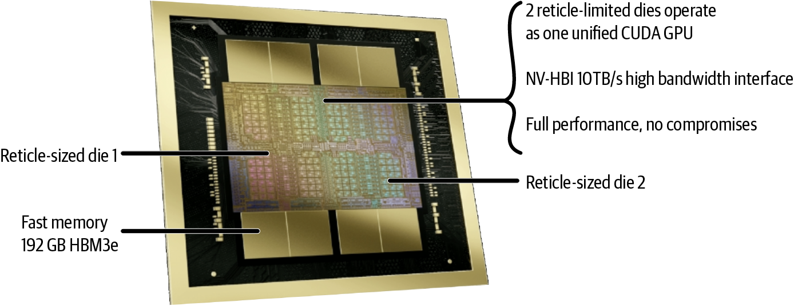
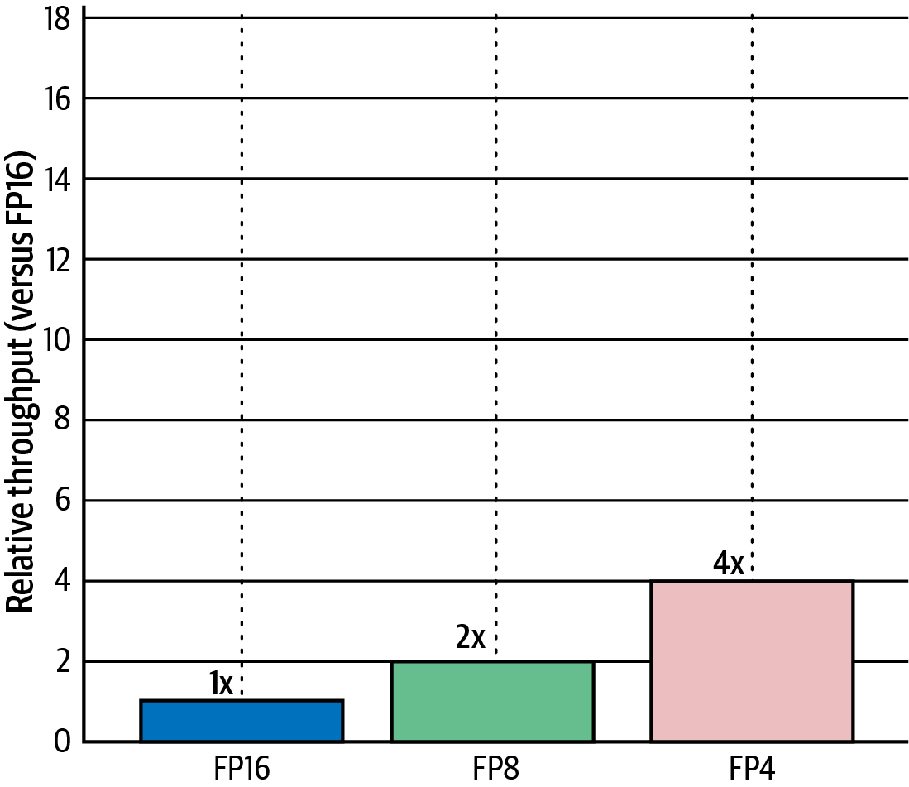
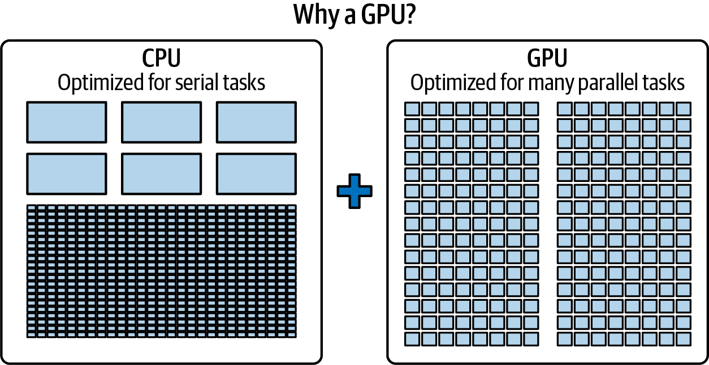
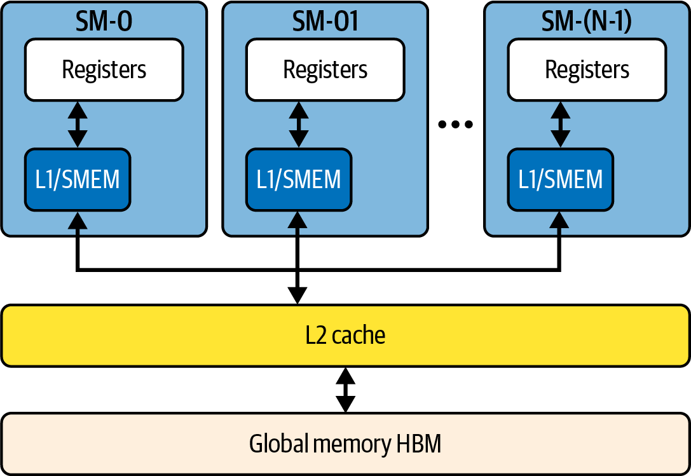
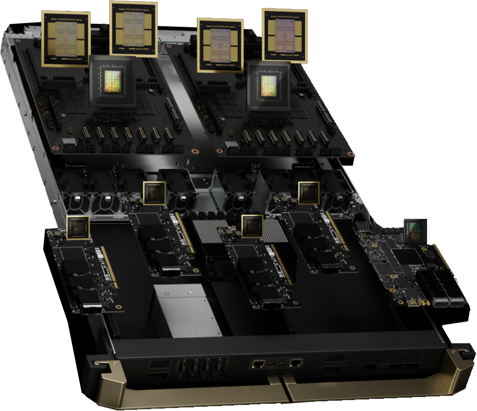
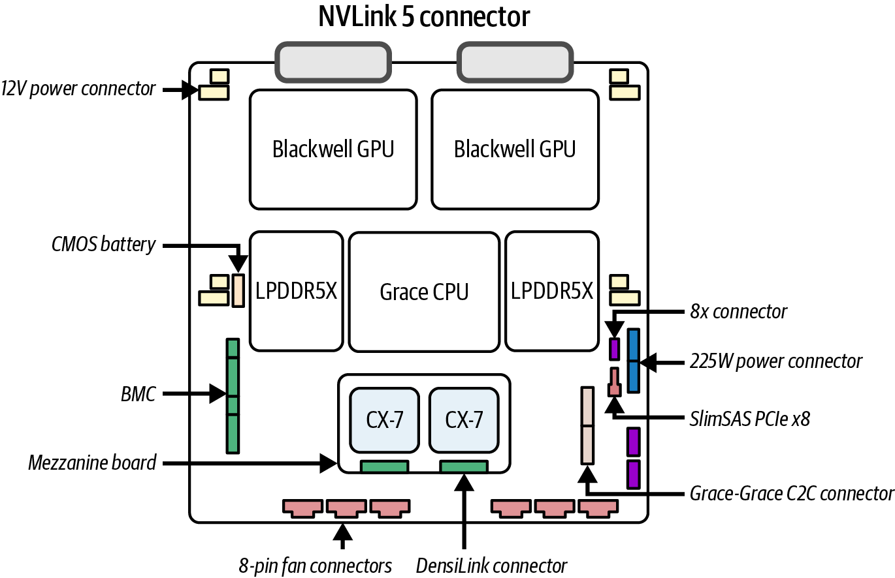
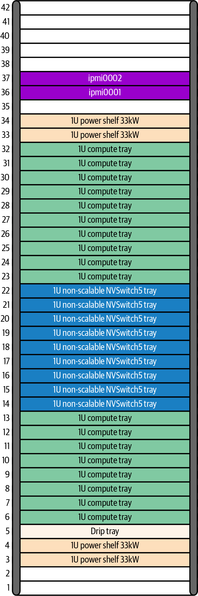
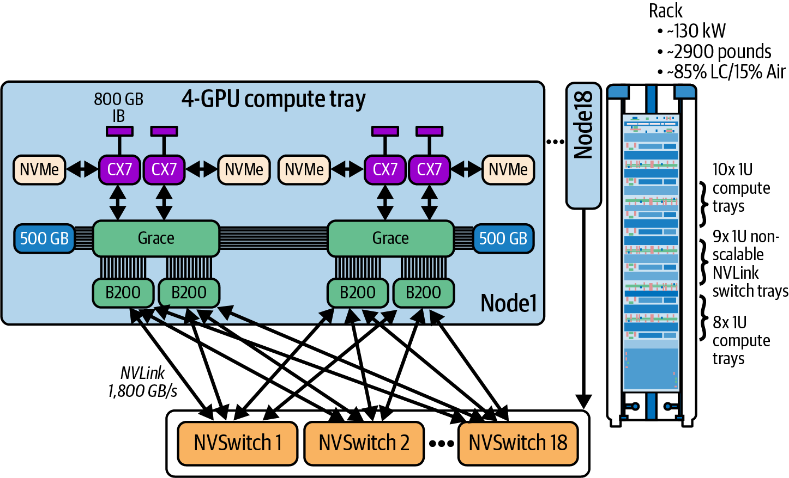
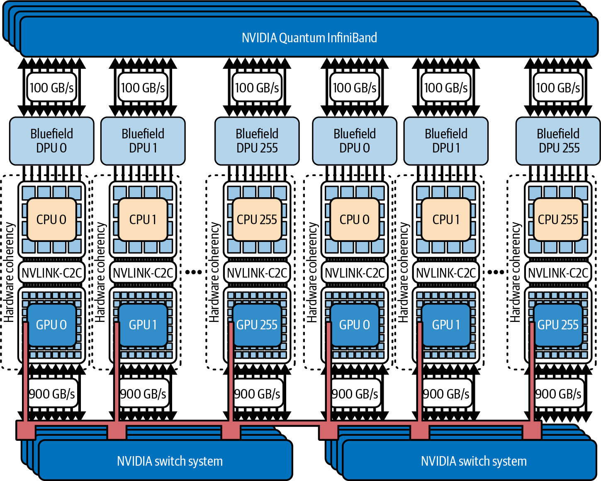

# Chapter 2. AI System Hardware Overview

# 第 2 章 AI 系统硬件概览

Imagine condensing a supercomputer’s worth of AI hardware into a single rack. NVIDIA’s latest architecture does exactly that. In this chapter, we dive into how NVIDIA fused CPUs and GPUs into powerful superchips and then wired dozens of them together with ultrafast interconnects to create an AI supercomputer-in-a-box. We’ll explore the fundamental hardware building blocks—the Grace CPU and Blackwell GPU—and see how their tight integration and enormous memory pool make life easier for AI engineers.

设想一下，把相当于一整台超级计算机的 AI 硬件浓缩进一个机架（rack）之中。NVIDIA 最新的架构做到的正是这件事。本章将深入剖析 NVIDIA 如何把 CPU 与 GPU 融合成强大的超级芯片（superchip），再用超高速互连把几十颗这样的芯片连成一体，从而打造出一台盒装 AI 超级计算机（AI supercomputer-in-a-box）。我们会先探讨最基础的硬件构件——Grace CPU 与 Blackwell GPU——看看它们的紧密集成与巨大的内存池如何让 AI 工程师的工作变得更轻松。

Then we’ll expand outward to the networking fabric that links 72 of these GPUs as if they were one machine. Along the way, we’ll highlight the leaps in compute performance, memory capacity, and efficiency that give this system its superpowers. By the end, you’ll appreciate how this cutting-edge hardware enables training and serving multi-trillion-parameter models that previously seemed impossible.

接着我们把视野向外扩展，看看那张把 72 块 GPU 连接起来、使其宛如一台机器的网络结构（fabric）。一路上，我们会重点介绍这套系统在算力、内存容量和能效上的飞跃，正是它们赋予了系统超能力。读到本章结尾，你会体会到这套前沿硬件是如何让训练和部署此前看似不可能实现的数万亿参数模型成为现实的。

## The CPU and GPU Superchip

## CPU 与 GPU 超级芯片

NVIDIA’s approach to scaling AI starts at the level of a single, combined CPU + GPU superchip module. Beginning with the Hopper generation, NVIDIA started packaging an ARM-based CPU together with one or more GPUs in the same unit, tightly linking them with a high-speed interface. The result is a single module that behaves like a unified computing engine.

NVIDIA 扩展 AI 算力的思路，始于把单颗 CPU 与 GPU 合二为一的超级芯片模块。从 Hopper 一代开始，NVIDIA 就把一颗基于 ARM 的 CPU 与一块或多块 GPU 封装在同一单元内，并用高速接口将它们紧密连接。其结果是一个像统一计算引擎那样运作的单一模块。

The first implementation of the superchip was Grace Hopper (GH200), which pairs one Grace CPU with one Hopper GPU. Next came the Grace Blackwell (GB200) Superchip, which pairs one Grace CPU with two Blackwell GPUs in the same package. The Grace CPU sits in the center of the module, surrounded by two Blackwell GPU dies, as shown in Figure 2-1.

超级芯片的首个实现是 Grace Hopper（GH200），它把一颗 Grace CPU 与一块 Hopper GPU 配成一对。接下来是 Grace Blackwell（GB200）Superchip，它在同一封装内把一颗 Grace CPU 与两块 Blackwell GPU 配成一组。如图 2-1 所示，Grace CPU 位于模块中央，两侧环绕着两颗 Blackwell GPU 裸片（die）。

*Figure 2-1. NVIDIA Grace Blackwell Superchip module containing one Grace CPU (center) and two Blackwell B200 GPUs (top left and right) on a single module with a shared unified memory space and connected by a custom high-speed link called NVLink-C2C (chip-to-chip)*

*图 2-1. NVIDIA Grace Blackwell 超级芯片模块，在单个模块上包含一颗 Grace CPU（中央）和两块 Blackwell B200 GPU（左上和右上），共享统一内存空间，并通过一条名为 NVLink-C2C（chip-to-chip，片间）的定制高速链路相连*

In a traditional system, the CPU and GPU have separate memory pools and communicate over a relatively slow bus (like PCIe), which means data has to be copied back and forth. NVIDIA’s superchip eliminates that barrier by connecting the CPU and GPUs with a custom high-speed link called NVLink-C2C (chip-to-chip).

在传统系统中，CPU 与 GPU 各自拥有独立的内存池，并通过相对缓慢的总线（如 PCIe）通信，这意味着数据必须在两者之间来回拷贝。NVIDIA 的超级芯片用一条名为 NVLink-C2C（chip-to-chip，片间）的定制高速链路把 CPU 与 GPU 连在一起，从而消除了这一屏障。

NVLink-C2C provides up to ~900 GB/s between the Grace CPU and the Blackwell GPUs in GB200 Superchips. By comparison, PCIe Gen5 x16 (Blackwell B200) is about 64 GB/s per direction, and PCIe Gen6 x16 (Blackwell Ultra B300) is about 128 GB/s per direction. NVLink-C2C’s interconnect speed is an order of magnitude faster than typical PCIe. And, importantly, it is cache-coherent.

在 GB200 Superchip 中，NVLink-C2C 在 Grace CPU 与 Blackwell GPU 之间提供高达 ~900 GB/s 的带宽。相比之下，PCIe Gen5 x16（Blackwell B200）单方向约为 64 GB/s，PCIe Gen6 x16（Blackwell Ultra B300）单方向约为 128 GB/s。NVLink-C2C 的互连速度比典型的 PCIe 快一个数量级。而且，更重要的是，它是缓存一致（cache-coherent）的。

Cache coherency means the CPU and GPU share a coherent, unified memory architecture. As such, they always see the same values. In practice, the Grace CPU and Blackwell GPUs on a superchip can all access one another’s memory directly as if it were one huge memory pool. The GPU can read or write data stored in the CPU’s memory, and vice versa, without needing explicit copies. This unified memory architecture is often called Unified CPU-GPU Memory or Extended GPU Memory (EGM) by NVIDIA, and it effectively blurs the line between CPU memory and GPU memory.

缓存一致性（cache coherency）意味着 CPU 与 GPU 共享一个一致的、统一的内存架构。因此，它们始终看到相同的数值。在实践中，超级芯片上的 Grace CPU 与各 Blackwell GPU 都能直接访问彼此的内存，就好像它们同属一个巨大的内存池。GPU 可以读写存放在 CPU 内存中的数据，反之亦然，而无需显式拷贝。NVIDIA 通常把这种统一内存（unified memory）架构称为统一 CPU-GPU 内存（Unified CPU-GPU Memory）或扩展 GPU 内存（Extended GPU Memory，EGM），它实际上模糊了 CPU 内存与 GPU 内存之间的界线。

Each Grace Blackwell Superchip carries a tremendous amount of memory. The Grace CPU comes with hundreds of gigabytes of LPDDR5X DRAM attached, and each Blackwell GPU has its own high-speed, high-bandwidth memory (HBM) stacks.

每颗 Grace Blackwell Superchip 都携带着海量内存。Grace CPU 挂载了数百 GB 的 LPDDR5X DRAM，而每块 Blackwell GPU 都拥有自己的高速、高带宽内存（high-bandwidth memory，HBM）堆栈。

In the GB200 Superchip, the Grace CPU provides up to ~480 GB of LPDDR5X at up to ~500 GB/s, and the two Blackwell GPUs together contribute up to ~384 GB of HBM3e memory (192 total GB per GPU). In total, a GB200 Superchip exposes roughly ~900 GB of memory of coherent, unified memory accessible by the GPUs and CPUs in a unified address space.

在 GB200 Superchip 中，Grace CPU 提供高达 ~480 GB 的 LPDDR5X，速率高达 ~500 GB/s，两块 Blackwell GPU 合计贡献高达 ~384 GB 的 HBM3e 内存（每块 GPU 共 192 GB）。总体而言，一颗 GB200 Superchip 对外暴露大约 ~900 GB 一致的统一内存，供 GPU 和 CPU 在统一地址空间中访问。

To put it simply, each superchip has nearly a terabyte of fast, unified memory at its disposal. This is a game changer for giant AI models. In older systems, a single GPU might be limited to < 100 GB of memory, which meant models larger than that had to be partitioned or offloaded to slower storage. Here, a GPU can seamlessly utilize the CPU’s memory as an extension.

简而言之，每颗超级芯片都拥有近 1 TB 的快速统一内存可供调用。这对于庞大的 AI 模型而言是一次颠覆性变革。在较老的系统中，单块 GPU 的内存可能被限制在 < 100 GB，这意味着比它更大的模型必须被切分或卸载到更慢的存储上。而在这里，GPU 可以无缝地把 CPU 的内存当作扩展来使用。

If a neural network layer or a large embedding table doesn’t fit in the GPU’s local HBM, it can reside in the CPU’s memory, and the GPU will still be able to work with it across NVLink-C2C. From a programmer’s perspective, the unified virtual address space and coherence simplify correctness. However, for performance, one should explicitly manage placement and memory movement using techniques such as asynchronous prefetch and staged pipelines. Accessing LPDDR5X using NVLink-C2C has higher latency and roughly an order-of-magnitude lower bandwidth than accessing HBM directly.

如果某个神经网络层或一张大型嵌入表放不进 GPU 本地的 HBM，它可以驻留在 CPU 的内存中，GPU 依然能够跨 NVLink-C2C 对其进行处理。从程序员的角度看，统一虚拟地址空间与一致性简化了正确性的保证。不过，为了性能，应当使用异步预取（prefetch）和分级流水线等技术，显式地管理数据的放置与移动。通过 NVLink-C2C 访问 LPDDR5X，其延迟高于直接访问 HBM，带宽也大约低一个数量级。

GPU memory is still much faster and closer to the GPU cores than CPU memory—you can think of the CPU memory as a large but somewhat slower extension. Accessing data in LPDDR5X isn’t as quick as HBM on the GPU. It’s on the order of 10× lower bandwidth and higher latency. A smart runtime will keep the most frequently used data in HBM and use the CPU’s LPDDR5X for overflow or less speed-critical data. The key point is that overflow no longer requires going out to NVMe SSD or across a network.

GPU 内存仍然比 CPU 内存快得多、也离 GPU 核心更近——你可以把 CPU 内存看作一块容量很大但速度略慢的扩展。访问 LPDDR5X 中的数据不像访问 GPU 上的 HBM 那样快，带宽大约低一个数量级（10×），延迟也更高。聪明的运行时会把最常用的数据保留在 HBM 中，而把 CPU 的 LPDDR5X 用于溢出数据或对速度不那么敏感的数据。关键在于，溢出不再需要走到 NVMe SSD 或跨越网络。

The GPU can fetch from CPU RAM at perhaps 900 GB/s (450 GB/s per direction), which, while slower than HBM, is much faster than fetching from NVMe SSD storage. This flexibility is critical, as it means a model that is, say, 500 GB in size (too large for a single GPU’s HBM) can still be placed entirely within one superchip module with access to a combined 192 (180 usable) GB in HBM and ~500 GB of CPU memory. This model can run without partitioning the model across multiple GPUs. The GPU would just transparently pull the extra data from CPU memory when needed.

GPU 从 CPU RAM 取数据的速度或许可达 900 GB/s（每方向 450 GB/s），虽然比 HBM 慢，但远快于从 NVMe SSD 存储读取。这种灵活性至关重要，因为这意味着一个体量比如说 500 GB 的模型（对单块 GPU 的 HBM 而言太大了）依然可以被完整放入一个超级芯片模块之内，可访问合计 192（可用 180）GB 的 HBM 和 ~500 GB 的 CPU 内存。这样的模型无需在多块 GPU 之间切分即可运行。GPU 只会在需要时透明地从 CPU 内存中拉取额外的数据。

In essence, memory size ceases to be a hard limit for fitting ultralarge models, as long as the total model fits within the combined CPU + GPU memory of the superchip. Many researchers have faced the dreaded “out of memory” errors when models don’t fit on a GPU—this architecture is designed to push that boundary out significantly.

本质上，只要整个模型能装进超级芯片上 CPU + GPU 合计的内存，内存容量就不再是承载超大模型的硬性限制。许多研究者都曾在模型放不进 GPU 时遭遇过令人头疼的“内存不足（out of memory，OOM）”错误——这套架构正是为大幅拓宽这一边界而设计的。

### NVIDIA Grace CPU

### NVIDIA Grace CPU

The Grace CPU itself is no sloth. It’s an ARM Neoverse V2 CPU custom-designed by NVIDIA for bandwidth and efficiency. Its job in the superchip is to handle general-purpose tasks, preprocess and feed data to the GPUs, and manage the mountain of memory attached to it. It runs at a modest clock speed but makes up for it with huge memory bandwidth—up to ~500 GB/s to its LPDDR5X memory—and lots of cache, including over 100 MB of L3 cache.

Grace CPU 本身也绝非等闲之辈。它是一颗由 NVIDIA 面向带宽与能效定制设计的 ARM Neoverse V2 CPU。它在超级芯片中的职责是处理通用任务、预处理数据并把数据喂给 GPU，以及管理挂载在其上的海量内存。它的时钟频率并不高，但凭借巨大的内存带宽——对其 LPDDR5X 内存高达 ~500 GB/s——以及大量缓存（包括超过 100 MB 的 L3 缓存）来加以弥补。

The philosophy is that the CPU should never become a bottleneck when shoveling data to the GPUs. It can stream data from storage or perform on-the-fly data transformations like tokenization or data augmentation—feeding the GPUs through NVLink-C2C very efficiently. If part of your workload is better on the CPU, the Grace cores can tackle that and make the results immediately accessible by the GPUs.

其设计理念是：在向 GPU 铲送数据时，CPU 绝不应成为瓶颈。它可以从存储中流式读取数据，或者即时执行诸如分词、数据增强之类的数据变换——通过 NVLink-C2C 极其高效地喂给 GPU。如果你工作负载中的某一部分更适合放在 CPU 上，Grace 核心可以承担这部分工作，并让结果立即可被 GPU 访问。

This is a harmonious coupling in which the CPU extends the GPU’s capabilities in areas where GPUs are weaker, like random memory accesses or control-heavy code. And the GPUs accelerate the number-crunching where CPUs can’t keep up.

这是一种和谐的耦合：在 GPU 相对薄弱的领域（如随机内存访问或控制流繁重的代码），CPU 扩展了 GPU 的能力；而在 CPU 力不从心的数值运算上，GPU 则负责加速。

The low-latency link between the CPU and GPUs means they can trade tasks without the usual overhead. For example, launching a GPU kernel from the CPU can happen much faster than on a traditional system, since the command doesn’t have to traverse a slow PCIe bus. The CPU and GPU are essentially on the same board. This is similar to calling a fast local function versus a slower remote function. Next, let’s talk about the Blackwell GPU, the brute-force engine of the superchip.

CPU 与 GPU 之间的低延迟链路意味着它们可以在没有常见开销的情况下交换任务。举例来说，从 CPU 启动一个 GPU 内核（kernel）可以比在传统系统上快得多，因为命令不必穿越缓慢的 PCIe 总线。CPU 和 GPU 本质上位于同一块板上。这就好比调用一个快速的本地函数，而不是较慢的远程函数。接下来，我们来谈谈 Blackwell GPU——超级芯片中那台蛮力十足的引擎。

### NVIDIA Blackwell “Dual-Die” GPU

### NVIDIA Blackwell“双裸片”GPU

Blackwell is NVIDIA’s codename for this GPU generation, and it represents a significant leap over the previous Hopper (H100) GPUs in both compute horsepower and memory. The Blackwell B200 and B300 “Ultra” GPU are not single chips. Instead, they use a multichip module (MCM) design with two GPU dies placed in a single module. As such, Blackwell is called a dual-die GPU (see Figure 2-2).

Blackwell 是 NVIDIA 为这一代 GPU 取的代号，无论在算力还是内存上，它都相较上一代 Hopper（H100）GPU 实现了显著飞跃。Blackwell B200 与 B300 “Ultra” GPU 并不是单颗芯片。相反，它们采用多芯片模块（multichip module，MCM）设计，在单个模块内放置两块 GPU 裸片。因此，Blackwell 被称为双裸片 GPU（dual-die，见图 2-2）。

> While this section dives into the details of the dual-die architecture, the rest of the book will refer to Blackwell’s two combined GPU dies collectively as just the “Blackwell GPU.”

> 尽管本节深入探讨双裸片架构的细节，但本书其余部分会把 Blackwell 合并后的两块 GPU 裸片统称为“Blackwell GPU”。

This chiplet approach splits what would normally be one enormous GPU into smaller GPU dies—linking them together with a superfast, on-package die-to-die interconnect. Why do this? Because a single monolithic die is limited by manufacturing because there’s a limit to how large you can make a chip on silicon. By combining two physical GPU dies into a single module, NVIDIA can double the total transistor budget for the module.

这种芯粒（chiplet）方式，把本应是一整块巨大 GPU 的东西拆分成较小的 GPU 裸片——再用一条超高速的封装内裸片间互连（die-to-die interconnect）把它们连接起来。为什么要这么做？因为单块整体式裸片受制于制造工艺，在硅片上能做出的芯片尺寸是有上限的。通过把两块物理 GPU 裸片合并进单个模块，NVIDIA 可以把该模块的晶体管总预算翻倍。

*Figure 2-2. Blackwell dual-die multichip module (MCM) design*

*图 2-2. Blackwell 双裸片多芯片模块（MCM）设计*

For the Blackwell B200 MCM, each GPU die has about 104 billion transistors and 96 GB HBM3e memory. The combined GPU module has around 208 billion transistors and 192 (180 usable) GB total memory per B200 GPU. By comparison, the Hopper H100 GPU had ~80 billion transistors and 80 GB HBM3 (versus Blackwell’s HBM3e) memory. As such, Blackwell’s B200 more than doubles transistor count and ~2.4× increases memory size.

对于 Blackwell B200 MCM，每块 GPU 裸片拥有约 1040 亿个晶体管和 96 GB HBM3e 内存。合并后的 GPU 模块每块 B200 GPU 大约有 2080 亿个晶体管，共 192（可用 180）GB 内存。相比之下，Hopper H100 GPU 拥有约 800 亿个晶体管和 80 GB HBM3（对比 Blackwell 的 HBM3e）内存。因此，Blackwell 的 B200 在晶体管数量上翻了一倍多，内存容量提升约 ~2.4×。

Blackwell’s two GPU dies communicate using a specialized, high-speed 10 TB/s die-to-die interconnect called NV-HBI (High-Bandwidth Interface). This lets the two GPU dies in the module function as a single unified GPU. The software layer running on top of it sees only a single GPU.

Blackwell 的两块 GPU 裸片使用一条专用的高速 10 TB/s 裸片间互连来通信，该互连名为 NV-HBI（High-Bandwidth Interface，高带宽接口）。这使得模块内的两块 GPU 裸片能作为单一的统一 GPU 运作。运行其上的软件层只会看到一块 GPU。

From the system’s perspective, a Blackwell GPU is one single module, or device, with a large pool of memory (192 [180 usable] GB HBM3e) and a ton of execution units, but under the hood it’s two chips working in tandem. NVIDIA’s software and scheduling ensure that work is balanced across the two GPU dies and memory accesses are coherent. This allows developers to largely ignore this complexity, as they appear as one GPU, as NVIDIA intended.

从系统的视角看，一块 Blackwell GPU 就是一个单一的模块（或设备），拥有一个大内存池（192〔可用 180〕GB HBM3e）和大量执行单元，但在底层它其实是两块芯片协同工作。NVIDIA 的软件与调度机制会确保工作在两块 GPU 裸片之间均衡分配，且内存访问保持一致。这让开发者可以在很大程度上忽略这种复杂性，因为如 NVIDIA 所期望的那样，它们表现得就像一块 GPU。

Each Blackwell B200 GPU module has 192 (180 usable) GB of HBM3e memory combined across the two GPU dies (96 GB each) and divided into 8-Hi stacks. An 8-Hi HBM3e stack is built by vertically stacking eight DRAM dies—each 3 GB—for a total of 24 GB per stack.

每块 Blackwell B200 GPU 模块拥有 192（可用 180）GB HBM3e 内存，跨两块 GPU 裸片合计（每块 96 GB），并划分为 8 层堆栈（8-Hi）。一个 8-Hi HBM3e 堆栈由八块 DRAM 裸片垂直堆叠而成——每块 3 GB——每个堆栈合计 24 GB。

The B200 GPU uses eight of these stacks (four per die) to provide 192 (180 usable) GB (192 GB = 8 stacks × 24 GB per stack) of on-package memory. This increases the per-GPU stack count and capacity compared to the previous generation Hopper GPUs—and gives more headroom for model parameters, activations, gradients, and input data.

B200 GPU 使用八个这样的堆栈（每块裸片四个）来提供 192（可用 180）GB（192 GB = 8 个堆栈 × 每堆栈 24 GB）的封装内内存。与上一代 Hopper GPU 相比，这提高了每块 GPU 的堆栈数量与容量——为模型参数、激活值、梯度和输入数据留出了更多余量。

> Only 180 GB of the 192 GB HBM3e memory is usable per B200 due to error correcting code (ECC), system firmware usage, manufacturing limitations, and other issues that prevent the chip from exposing the full 192 GB. As such, we’ll reference 180 GB instead of the full 192 GB for the Blackwell B200 available memory.

> 由于纠错码（ECC）、系统固件占用、制造限制及其他阻碍芯片对外暴露完整 192 GB 的因素，每块 B200 的 192 GB HBM3e 内存中只有 180 GB 可用。因此，谈到 Blackwell B200 的可用内存时，我们会引用 180 GB 而非完整的 192 GB。

The memory is also faster, as Blackwell’s B200 HBM3e has an aggregate bandwidth up to roughly 8 TB/s per GPU. For comparison, the Hopper uses the previous generation HBM3, which delivers ~3.35 TB/s per GPU. As such, Blackwell’s memory bandwidth throughput is roughly 2.4× higher than Hopper’s.

内存速度也更快，因为 Blackwell 的 B200 HBM3e 每块 GPU 的聚合带宽高达约 8 TB/s。作为对比，Hopper 使用上一代的 HBM3，每块 GPU 提供 ~3.35 TB/s。因此，Blackwell 的内存带宽吞吐大约比 Hopper 高 2.4×。

Feeding data at 8 terabytes per second, the Blackwell GPU cores are kept busy crunching on huge matrices without frequently stalling to wait for data. NVIDIA also beefed up on-chip caching, as Blackwell has a total of 126 MB of L2 cache (63 MB per die). This cache is a small but ultrafast memory on the GPU that holds recently used data.

以每秒 8 TB 的速率喂送数据，Blackwell GPU 核心得以持续忙于处理巨型矩阵，而不必频繁停顿等待数据。NVIDIA 还强化了片上缓存，Blackwell 拥有共计 126 MB 的 L2 缓存（每块裸片 63 MB）。这块缓存是 GPU 上一块虽小但极快的内存，用于存放最近使用过的数据。

By increasing the L2 cache size by more than 2.5× compared to Hopper’s 50 MB L2 cache, Blackwell can keep more of the neural network weights or intermediate results on chip, avoiding extra trips out to HBM. This again helps ensure the GPU’s compute units are seldom starved for data.

通过把 L2 缓存容量相较 Hopper 的 50 MB L2 缓存提高到 2.5× 以上，Blackwell 可以把更多神经网络权重或中间结果保留在片上，从而避免额外往返 HBM。这再次有助于确保 GPU 的计算单元很少因缺数据而挨饿。

Next, let’s show how the Blackwell GPU is paired with a dedicated set of reduced-precision Tensor Cores—as well as transformer-optimized hardware and software APIs from NVIDIA called the Transformer Engine. Frameworks, like PyTorch and inference engines like vLLM, support these optimizations by using libraries like CUDA, CUTLASS, and OpenAI’s Triton, which we talk about in later chapters.

接下来，我们展示 Blackwell GPU 是如何与一组专用的降精度 Tensor Core，以及 NVIDIA 提供的、面向 Transformer 优化的硬件和软件 API（称为 Transformer 引擎）配对的。诸如 PyTorch 这样的框架和 vLLM 这样的推理引擎，通过使用 CUDA、CUTLASS 和 OpenAI 的 Triton 等库来支持这些优化，我们会在后续章节中讨论它们。

> Remember that the rest of this book refers to Blackwell’s dual-die GPU as just the “Blackwell GPU.”

> 请记住，本书其余部分把 Blackwell 的双裸片 GPU 直接称为“Blackwell GPU”。

### NVIDIA GPU Tensor Cores and Transformer Engine

### NVIDIA GPU Tensor Core 与 Transformer 引擎

Speaking of compute units, Blackwell introduces enhancements specifically aimed at AI workloads. Central to this is NVIDIA’s Tensor Core technology and the Transformer Engine (TE). Tensor Cores are specialized units within each streaming multiprocessor (SM) of the GPU that can perform matrix multiplication operations at very high speed.

说到计算单元，Blackwell 引入了专门针对 AI 工作负载的增强。其核心是 NVIDIA 的 Tensor Core（张量核心）技术和 Transformer 引擎（Transformer Engine，TE）。Tensor Core 是位于 GPU 每个流式多处理器（streaming multiprocessor，SM）内部的专用单元，能够以极高的速度执行矩阵乘法运算。

Tensor Cores were present in prior generations, but Blackwell’s Tensor Cores support even more numerical formats, including extremely low-precision ones like 8-bit and 4-bit floating point. The idea behind lower precision is simple. By using fewer bits to represent numbers, you can perform more operations at the same time—not to mention your memory goes further since fewer bits are used to represent the same numbers. This assumes that your algorithm can tolerate a little loss in numerical precision. These days, a lot of AI algorithms are designed with low-precision numerical formats in mind.

Tensor Core 在此前几代中就已存在，但 Blackwell 的 Tensor Core 支持更多的数值格式，包括 8 位和 4 位浮点这类极低精度的格式。低精度背后的思想很简单：用更少的比特来表示数字，你就能在同一时间执行更多运算——更不用说由于用更少的比特表示相同的数字，你的内存也更“耐用”了。这一切的前提是你的算法能够容忍数值精度上的少许损失。如今，大量 AI 算法在设计之初就已考虑到低精度数值格式。

NVIDIA pioneered the TE to automatically adjust and use mixed precision in deep learning where critical layers use higher precision (FP16 or BF16) and less critical layers use FP8. TE automatically optimizes the balance of precision with the goal of maintaining the model’s accuracy at the lower precision.

NVIDIA 首创了 TE，用以在深度学习中自动调整并使用混合精度（mixed precision）：关键层使用更高精度（FP16 或 BF16），不那么关键的层使用 FP8。TE 会自动优化精度上的平衡，目标是在更低精度下保持模型的准确率。

In the Hopper generation, the TE first introduced FP8 support, which doubled the throughput versus FP16. Blackwell takes it one step further by introducing NVIDIA FP4 (NVFP4), a 4-bit floating-point format that uses half the number of bits of FP8. FP4 is so small that it can potentially double the compute throughput of FP8. Figure 2-3 shows the relative speedup of FP8 and FP4 compared to FP16.

在 Hopper 一代，TE 首次引入了 FP8 支持，其吞吐量比 FP16 翻了一倍。Blackwell 更进一步，引入了 NVIDIA FP4（NVFP4）——一种 4 位浮点格式，所用比特数是 FP8 的一半。FP4 如此之小，以至于有潜力将 FP8 的计算吞吐再翻一番。图 2-3 展示了 FP8 与 FP4 相对于 FP16 的加速比。

An entire NVL72 rack (72 GPUs) has a theoretical Tensor Core throughput over 1.4 exaFLOPS (that’s 1.4 × 10^18) in 4-bit precision. This is a mind-boggling number that puts this single rack in the realm of the world’s fastest supercomputers—albeit at low FP4 precision. Even if real-world workloads don’t always hit that peak, the capability is there, which is astonishing.

整个 NVL72 机架（72 块 GPU）在 4 位精度下的理论 Tensor Core 吞吐量超过 1.4 exaFLOPS（即 1.4 × 10^18）。这是一个令人瞠目的数字，足以让这一个机架跻身世界最快超级计算机之列——尽管是在 FP4 低精度下。即便真实世界的工作负载并不总能触及这一峰值，但这份能力实实在在地存在，着实令人惊叹。

Modern GPUs use a TE that adds NVFP4 support together with improved scaling and calibration. In practice, you adopt TE by using its kernels and modules in frameworks such as PyTorch. This way, FP8 and NVFP4 are applied when they preserve accuracy. This is not a fully automatic per-layer decision in all frameworks.

现代 GPU 使用的 TE 增加了对 NVFP4 的支持，并改进了缩放与校准。在实践中，你通过在 PyTorch 等框架中使用 TE 的内核和模块来采用它。这样，FP8 和 NVFP4 便会在能够保持准确率时被应用。这在所有框架中并不都是完全自动的逐层决策。

*Figure 2-3. Relative speedup of FP8 and FP4 compared to FP16*

*图 2-3. FP8 与 FP4 相对于 FP16 的加速比*

Advanced techniques include dynamically changing the precision for each layer of a neural network during training and inference. The goal is to use the lowest precision that will still preserve model accuracy for each of those layers. For example, the TE might keep the first layers of a neural net in FP16 since early layers can be sensitive to noise. But, based on heuristics, it could decide to use FP8 or FP4 for later layers that are more tolerant—or for giant embedding matrices where high precision isn’t as critical.

更高级的技术包括：在训练和推理期间，为神经网络的每一层动态改变其精度。目标是为每一层使用仍能保持模型准确率的最低精度。举例来说，TE 可能会把神经网络的最初几层保持在 FP16，因为早期层可能对噪声较为敏感。但根据启发式规则，它可以决定对更耐受的后续层——或者对高精度并不那么关键的巨型嵌入矩阵——使用 FP8 或 FP4。

All of this can happen under the hood in NVIDIA libraries and AI frameworks like PyTorch. As a user, you just enable mixed precision, and the result is a huge speedup that essentially comes “for free.” We’ll discuss mixed precision in Chapter 9, but just know that many LLMs today use mixed precision for this reason. These reduced precisions improve training speed compared to FP16 and FP32—and reduce accuracy loss. Blackwell was built to make FP8 and FP4 accessible and efficient.

所有这些都可以在 NVIDIA 的库和 PyTorch 这类 AI 框架的底层悄然发生。作为用户，你只需启用混合精度，得到的结果便是一个几乎“免费”的巨大加速。我们会在第 9 章讨论混合精度，但你只需知道，如今许多大语言模型（large language model，LLM）正是出于这个原因而使用混合精度。相较 FP16 和 FP32，这些降精度提升了训练速度——并减少了准确率损失。Blackwell 的设计初衷正是让 FP8 和 FP4 既易于使用又高效。

These reduced-precision formats reduce memory usage as well. Using FP4 halves the memory needed per parameter compared to FP8 (and FP8 halves FP16 memory usage), meaning you can pack an even larger model into the GPU’s memory.

这些降精度格式同样降低了内存占用。相较 FP8，使用 FP4 把每个参数所需的内存减半（而 FP8 又把 FP16 的内存占用减半），这意味着你可以把更大的模型塞进 GPU 的内存里。

NVIDIA has effectively bet on AI’s future being in lower precision arithmetic and has given Blackwell the ability to excel at it. This is especially critical for inference serving of massive models, where throughput (tokens per second) and latency are paramount.

NVIDIA 实际上已经押注 AI 的未来在于更低精度的算术，并赋予了 Blackwell 在这方面出类拔萃的能力。这对于超大模型的推理服务尤为关键，因为在那里，吞吐量（每秒 token 数）与延迟至关重要。

To illustrate the generational leap forward from Hopper to Blackwell, NVIDIA reported an H100-based system could generate only about 3.4 tokens per second per GPU for a large 1.8-trillion-parameter MoE model—with over 5 seconds of latency for the first token. This is too slow for interactive use.

为了说明从 Hopper 到 Blackwell 的代际飞跃，NVIDIA 报告称：对于一个庞大的 1.8 万亿参数 MoE（mixture of experts，混合专家）模型，基于 H100 的系统每块 GPU 只能生成约 3.4 个 token/秒——而且首个 token 的延迟超过 5 秒。这对于交互式使用而言太慢了。

The Blackwell-based system (NVL72) ran the same model with around 150 tokens per second per GPU and a low first-token latency of ~50 milliseconds. That is roughly 30× the real-time throughput improvement over the Hopper generation. The NVL72 allowed this massive model to serve real-time responses—opening it up to many more low-latency use cases.

基于 Blackwell 的系统（NVL72）运行同一模型，每块 GPU 约达 150 个 token/秒，首 token 延迟低至 ~50 毫秒。这大约是相较 Hopper 一代约 30× 的实时吞吐量提升。NVL72 让这个庞大的模型能够提供实时响应——从而为更多低延迟的应用场景打开了大门。

This speedup came from raw FLOPS, the combination of faster GPUs, lower precision (FP4) usage, and the NVLink interconnect keeping the GPUs fed with data. It underscores how a holistic design that spans across both compute and communication can translate into real-world performance gains.

这一加速源自原始 FLOPS，是更快的 GPU、更低精度（FP4）的使用，以及 NVLink 互连持续为 GPU 供给数据这几方面的结合。它彰显了一种横跨计算与通信的整体设计，如何能够转化为真实世界的性能收益。

In essence, Blackwell GPUs are more powerful, smarter, and better fed with data than their predecessors. They chew through math faster, thanks to Tensor Cores, TE, and low precision. Additionally, the system architecture ensures that data is made available quickly thanks to huge memory bandwidth, large caches, and NVLink.

本质上，Blackwell GPU 比它们的前辈更强大、更聪明，也被数据喂得更饱。得益于 Tensor Core、TE 和低精度，它们处理数学运算的速度更快。此外，凭借巨大的内存带宽、大容量缓存和 NVLink，系统架构确保了数据能被迅速就位。

Before moving on, let’s quickly discuss the hierarchy inside the GPU, as this is useful to understand performance tuning later.

在继续之前，我们先快速讨论一下 GPU 内部的层级结构，因为这对后续理解性能调优很有帮助。

### Streaming Multiprocessor, Threads, and Warps

### 流式多处理器、线程与线程束

Each Blackwell GPU, like its predecessors, consists of many streaming multiprocessors (SMs). Think of these like the “cores” of the GPU, as shown in Figure 2-4.

与前几代一样，每块 Blackwell GPU 都由许多流式多处理器（SM）组成。如图 2-4 所示，可以把它们想象成 GPU 的“核心”。

*Figure 2-4. Comparing CPU cores to GPU cores (source: https://oreil.ly/003EH, https://oreil.ly/Z25Tf)*

*图 2-4. 对比 CPU 核心与 GPU 核心（source: https://oreil.ly/003EH, https://oreil.ly/Z25Tf）*

Each SM contains a bunch of arithmetic units (for FP32, INT32, etc.), Tensor Cores for matrix math, load/store units for memory operations, and some special function units for things like transcendental math. The GPU also has its own small pool of superfast memory, including registers, shared memory, and L1 cache.

每个 SM 都包含一批算术单元（用于 FP32、INT32 等）、用于矩阵运算的 Tensor Core、用于内存操作的加载/存储单元，以及一些用于超越函数运算等任务的特殊功能单元。GPU 还拥有自己的一小块超快内存，包括寄存器、共享内存和 L1 缓存。

An SM executes threads in fixed-size groups known as warps, with each warp containing exactly 32 threads that execute the exact same instructions in lockstep. This is called the single instruction, multiple threads (SIMT) execution model.

SM 以固定大小的分组执行线程，这些分组称为线程束（warp），每个线程束恰好包含 32 个线程，它们步调一致地执行完全相同的指令。这被称为单指令多线程（single instruction, multiple threads，SIMT）执行模型。

SMs execute many active warps in parallel to help cover the latency of a thread waiting on data accessed from global memory. Consider an SM having dozens of warps (hundreds of threads) in flight concurrently. If one warp is waiting on a memory fetch, another warp can run. This is called latency hiding. We will revisit latency hiding throughout the book. This is a very important performance-optimization tool to have in your tuning toolbox.

SM 并行执行许多活跃的线程束，以帮助掩盖某个线程等待从全局内存访问数据时的延迟。设想一个 SM 同时有几十个线程束（数百个线程）在运行。如果一个线程束正在等待内存读取，另一个线程束便可以运行。这被称为延迟隐藏（latency hiding）。我们会在全书中反复回到延迟隐藏这一话题。这是你的调优工具箱中一件非常重要的性能优化利器。

A high-end GPU like Blackwell will have hundreds of SMs. Each SM is capable of running thousands of threads concurrently. This is how we get tens of thousands of active threads onto a single GPU. All those SMs share a 126 MB L2 cache, as we mentioned earlier, and share the memory controllers that connect to the HBM. The memory hierarchy contains registers (per thread) → shared memory (per thread block, on each SM) → L1 cache (per SM) → L2 cache (shared across all SMs on the GPU) → HBM memory (off chip), as shown in Figure 2-5.

像 Blackwell 这样的高端 GPU 会拥有数百个 SM。每个 SM 都能并发运行数千个线程。这就是我们如何在单块 GPU 上获得数万个活跃线程的原因。正如前面提到的，所有这些 SM 共享一块 126 MB 的 L2 缓存，并共享连接到 HBM 的内存控制器。如图 2-5 所示，内存层级依次为：寄存器（每线程）→ 共享内存（每线程块，位于各 SM 上）→ L1 缓存（每 SM）→ L2 缓存（在 GPU 上所有 SM 之间共享）→ HBM 内存（片外）。

*Figure 2-5. GPU memory hierarchy*

*图 2-5. GPU 内存层级*

For best performance, data needs to stay as high in that hierarchy as possible. If every operation went out to HBM even at 8 TB/s, the GPU would stall too often due to the increased latency of accessing off-chip memory. By keeping reusable data in SM local memory or L2 cache, the GPU can achieve enormous throughput. The Blackwell architecture’s doubling of cache and bandwidth is aimed exactly at keeping the GPU beast fed and happy.

为了获得最佳性能，数据需要尽可能保留在该层级的高处。如果每个操作即便以 8 TB/s 的速率也都要走到 HBM，那么由于访问片外内存的延迟增加，GPU 会过于频繁地停顿。通过把可复用的数据保留在 SM 本地内存或 L2 缓存中，GPU 就能达成惊人的吞吐量。Blackwell 架构把缓存和带宽翻倍，其目标正是让这头 GPU 巨兽吃得饱、跑得欢。

As performance engineers, we’ll see many examples where a kernel’s performance is bound by compute as well as memory traffic and throughput. NVIDIA clearly designed Blackwell so that, for many AI workloads, the balance between FLOPS and memory bandwidth is well-matched.

作为性能工程师，我们会看到许多例子：一个内核的性能既受制于计算，也受制于内存流量与吞吐量。NVIDIA 显然是这样设计 Blackwell 的——对许多 AI 工作负载而言，FLOPS 与内存带宽之间的平衡都恰到好处。

Blackwell’s design balances compute and memory so that for many AI kernels the GPUs can keep computing with minimal stalls. In practice, well-optimized dense math operations can reuse data from on-chip memory to approach peak FLOPS without being severely memory bound.

Blackwell 的设计平衡了计算与内存，使得对许多 AI 内核而言，GPU 能够以最少的停顿持续计算。在实践中，经过良好优化的稠密数学运算可以复用片上内存中的数据，从而在不严重受内存限制的情况下逼近峰值 FLOPS。

All of this means that, given well-optimized code, the GPUs will often be busy computing rather than waiting on data. Note that certain operations like huge reductions or random memory accesses can still be memory bound, but the updated GPU, memory, and interconnect hardware make this a bit less of an issue.

所有这些意味着：只要代码经过良好优化，GPU 往往会忙于计算，而不是等待数据。需要注意的是，某些操作（如巨大的归约或随机内存访问）仍可能受内存限制，但更新换代后的 GPU、内存和互连硬件让这个问题不再那么突出。

## Ultrascale Networking Treating Many GPUs as One

## 超大规模网络：把众多 GPU 视为一体

Packing two GPUs and a CPU into a superchip gives us an incredibly powerful node. The next challenge is connecting many of these superchips together to scale out to even larger model training.

把两块 GPU 和一颗 CPU 塞进一颗超级芯片，为我们带来了一个极其强大的节点。下一个挑战是把许多这样的超级芯片连接起来，以横向扩展到规模更大的模型训练。

NVIDIA provides a large rack configuration using GB200/GB300 Superchips called the NVL72 system. NVL72 stands for a system with 72 Blackwell GPUs—and 36 Grace CPUs—all interconnected with NVLink. This is essentially an AI supercomputer in a single rack.

NVIDIA 提供了一种使用 GB200/GB300 Superchip 的大型机架配置，称为 NVL72 系统。NVL72 指的是一套拥有 72 块 Blackwell GPU——以及 36 颗 Grace CPU——并全部通过 NVLink 互连的系统。这本质上就是装进单个机架里的一台 AI 超级计算机。

The GB200/GB300 NVL72 is built as 18 compute nodes in which each node contains two GB200/GB300 Superchips for a total of four Blackwell GPUs + two Grace CPUs per compute node, as shown in Figure 2-6.

如图 2-6 所示，GB200/GB300 NVL72 由 18 个计算节点构成，每个节点包含两颗 GB200/GB300 Superchip，因此每个计算节点共有四块 Blackwell GPU + 两颗 Grace CPU。

*Figure 2-6. A 1U compute tray within the GB200/GB300 NVL72 rack with two Grace Blackwell Superchips (source: developer.nvidia.com)*

*图 2-6. GB200/GB300 NVL72 机架内的一个 1U 计算托盘（compute tray），含两颗 Grace Blackwell 超级芯片（source: developer.nvidia.com）*

Here, each superchip module has one Grace CPU and two Blackwell GPUs (each B200 is a dual-die MCM). The NVL72 has 18 of these trays linked together. By connecting the 18 compute nodes together, the GB200/GB300 NVL72 links 72 Blackwell GPUs (18 nodes × 4 GPUs) and 36 Grace CPUs (18 nodes × 2 CPUs) together to form a powerful, unified CPU-GPU cluster.

在这里，每颗超级芯片模块都有一颗 Grace CPU 和两块 Blackwell GPU（每块 B200 都是一个双裸片 MCM）。NVL72 把 18 个这样的托盘连在一起。通过把这 18 个计算节点连接起来，GB200/GB300 NVL72 将 72 块 Blackwell GPU（18 个节点 × 4 块 GPU）和 36 颗 Grace CPU（18 个节点 × 2 颗 CPU）连成一体，构成一个强大的、统一的 CPU-GPU 集群。

The interesting thing about the NVL72 is that every GPU can talk to any other GPU through the NVLink Switch fabric at very high speed within a single NVLink domain. NVIDIA achieved this using a combination of NVLink 5 connections on the GPUs and a dedicated switch silicon called NVSwitch.

NVL72 有趣的一点在于：在单个 NVLink 域内，每块 GPU 都能通过 NVLink Switch 网络结构以极高速度与任意另一块 GPU 通信。NVIDIA 通过在 GPU 上采用 NVLink 5 连接与一款名为 NVSwitch 的专用交换芯片相结合，实现了这一点。

### NVLink and NVSwitch

### NVLink 与 NVSwitch

Each Blackwell GPU exposes 18 NVLink 5 ports. Aggregate bidirectional NVLink bandwidth is 1.8 TB/s per GPU (18 NVLink links × 100 GB/s bidirectional) with the NVL72 wiring all ports to the NVLink Switch System. Each NVLink switch tray delivers 144 NVLink ports at 100 GB/s. Across the nine trays, each GPU’s 18 NVLink 5 links are wired one per NVSwitch chip so the 72 GPUs are fully connected at full bisection bandwidth. The aggregate bidirectional NVLink 5 bandwidth is 1.8 TB/s per GPU (18 NVLink links × 100 GB/s bidirectional).

每块 Blackwell GPU 对外暴露 18 个 NVLink 5 端口。每块 GPU 的聚合双向 NVLink 带宽为 1.8 TB/s（18 条 NVLink 链路 × 100 GB/s 双向），NVL72 把所有端口都接入 NVLink Switch System。每个 NVLink 交换托盘提供 144 个 NVLink 端口，速率为 100 GB/s。在这九个托盘上，每块 GPU 的 18 条 NVLink 5 链路各接到一颗 NVSwitch 芯片，因此 72 块 GPU 以完整的对分带宽（bisection bandwidth）实现全互连。每块 GPU 的聚合双向 NVLink 5 带宽为 1.8 TB/s（18 条 NVLink 链路 × 100 GB/s 双向）。

This is double the per-GPU NVLink bandwidth of the previous generation used by Hopper GPUs. The Hopper H100 uses 18 NVLink 4 ports but runs at half the speed of NVLink 5. Inter-GPU latency over NVLink is in the single-digit microsecond range.

这是 Hopper GPU 所用上一代每块 GPU NVLink 带宽的两倍。Hopper H100 使用 18 个 NVLink 4 端口，但其速率只有 NVLink 5 的一半。跨 NVLink 的 GPU 间延迟处于个位数微秒级别。

The GPUs are cabled in a network through NVSwitch chips. NVSwitch is essentially a switching chip similar to a network switch, but it’s built specifically for NVLink. This means any GPU can reach any other GPU through one switch stage in the NVLink Switch System at full bisection bandwidth. This one-stage property holds true within a single NVL72 rack because each GPU uses its 18 NVLink links to connect to the 18 NVSwitch chips, enabling a path through a single switch. Figure 2-7 shows an NVLink Switch tray used in NVL72.

这些 GPU 通过 NVSwitch 芯片连成一张网络。NVSwitch 本质上是一块类似于网络交换机的交换芯片，但它专为 NVLink 而打造。这意味着任意 GPU 都能以完整的对分带宽，在 NVLink Switch System 中经过一级交换到达任意另一块 GPU。这种“单级”特性在单个 NVL72 机架内成立，因为每块 GPU 都用其 18 条 NVLink 链路连接到 18 颗 NVSwitch 芯片，从而实现经由单个交换机的路径。图 2-7 展示了 NVL72 中使用的一个 NVLink Switch 托盘。

*Figure 2-7. One NVLink Switch tray inside the NVL72 (source: https://oreil.ly/h7seG)*

*图 2-7. NVL72 内部的一个 NVLink Switch 托盘（source: https://oreil.ly/h7seG）*

Each switch tray contains two NVSwitch chips and multiple high-speed ports. The NVL72 rack comprises 9 such switch trays and 18 compute trays, as shown in Figure 2-8.

每个交换托盘包含两颗 NVSwitch 芯片和多个高速端口。如图 2-8 所示，NVL72 机架由 9 个这样的交换托盘和 18 个计算托盘组成。

*Figure 2-8. NVSwitch System of nine trays inside an NVL72 rack (source: https://oreil.ly/h7seG)*

*图 2-8. NVL72 机架内由九个托盘构成的 NVSwitch System（source: https://oreil.ly/h7seG）*

Since each of the 9 switch trays contains two NVSwitch chips, the total is 18 NVSwitch chips in the NVL72 system. The network is arranged as a full crossbar such that every GPU is connected to every NVSwitch, and every NVSwitch is connected to every GPU. This provides a high-bandwidth path between any pair of GPUs.

由于这 9 个交换托盘每个都包含两颗 NVSwitch 芯片，NVL72 系统中共有 18 颗 NVSwitch 芯片。这张网络被组织成一个全交叉开关（full crossbar），使得每块 GPU 都连接到每一颗 NVSwitch，且每一颗 NVSwitch 都连接到每一块 GPU。这在任意一对 GPU 之间提供了一条高带宽路径。

Each switch tray exposes 144 NVLink ports to fully connect the 18 NVLink links on each GPU. Concretely, each GPU uses its 18 NVLink links to connect to the 18 NVSwitch chips (one link to each switch). This means any GPU can reach any other GPU in one hop (GPU → NVSwitch → GPU), with enormous bandwidth along the way. Figure 2-9 shows the full NVL72 architecture with 72 fully connected GPUs (36 GB200 superchips) and 18 NVSwitches.

每个交换托盘对外暴露 144 个 NVLink 端口，以完整连接每块 GPU 上的 18 条 NVLink 链路。具体而言，每块 GPU 用其 18 条 NVLink 链路连接到 18 颗 NVSwitch 芯片（每颗交换芯片一条链路）。这意味着任意 GPU 都能一跳（GPU → NVSwitch → GPU）到达任意另一块 GPU，而且沿途拥有巨大的带宽。图 2-9 展示了完整的 NVL72 架构，含 72 块全互连的 GPU（36 颗 GB200 超级芯片）和 18 颗 NVSwitch。

*Figure 2-9. Each GPU connects to each NVSwitch (one link for each switch)*

*图 2-9. 每块 GPU 都连接到每一颗 NVSwitch（每颗交换芯片一条链路）*

The aggregate bisection bandwidth across the entire 72-GPU network is about 130 TB/s within an NVL72 rack. For perspective, that is many times higher than even a top-end InfiniBand cluster of similar scale. The design exposes a fully connected, high-bandwidth fabric with a global address space across GPUs. This allows efficient collectives and one-sided operations while preserving explicit software control over synchronization and consistency.

在一个 NVL72 机架内，整张 72-GPU 网络的聚合对分带宽约为 130 TB/s。作为参照，这比同等规模下即便顶级的 InfiniBand 集群也要高出许多倍。这一设计对外呈现出一张全互连的高带宽网络结构，并在各 GPU 之间提供全局地址空间。这既支持高效的集合通信与单边操作，又保留了软件对同步与一致性的显式控制。

### Multi-GPU Programming

### 多 GPU 编程

From a programming model standpoint, one GPU can directly access another GPU’s memory over NVLink using peer-to-peer and partitioned global address space (PGAS) models such as NVIDIA SHMEM (NVSHMEM), NVIDIA’s GPU-accelerated OpenSHMEM implementation. There is a global address space, but GPU caches are not globally coherent across GPUs. Only the CPU–GPU path over NVLink-C2C is cache coherent. Software stacks such as NCCL and NVSHMEM provide the synchronization and ordering required for correct multi-GPU access. Combined, hardware cache coherency and software synchronization techniques allow the NVL72 to be seen as essentially one big GPU.

从编程模型的角度看，一块 GPU 可以借助点对点（peer-to-peer）以及分区全局地址空间（partitioned global address space，PGAS）模型，通过 NVLink 直接访问另一块 GPU 的内存，例如 NVIDIA SHMEM（NVSHMEM）——NVIDIA 的 GPU 加速版 OpenSHMEM 实现。这里存在一个全局地址空间，但 GPU 缓存在各 GPU 之间并非全局一致。只有跨 NVLink-C2C 的 CPU–GPU 路径才是缓存一致的。诸如 NCCL 和 NVSHMEM 之类的软件栈提供了正确进行多 GPU 访问所需的同步与排序。硬件缓存一致性与软件同步技术相结合，使得 NVL72 本质上可被视为一块巨大的 GPU。

Remote direct memory access (RDMA) is a network technology that enables direct, zero-copy memory transfers between hosts across InfiniBand and RDMA over Converged Ethernet (RoCE) transports. Optional remote atomic operations are defined by the InfiniBand Trade Association (IBTA) for InfiniBand and RoCE.

远程直接内存访问（remote direct memory access，RDMA）是一种网络技术，能够在跨 InfiniBand 以及 RDMA over Converged Ethernet（RoCE）传输的主机之间实现直接、零拷贝的内存传输。InfiniBand 与 RoCE 的可选远程原子操作由 InfiniBand Trade Association（IBTA）定义。

GPUDirect RDMA, NVIDIA’s implementation of the RDMA protocol, enables network interface controllers (NICs) to register GPU memory and perform RDMA directly to and from GPU memory using the nvidia-peermem driver. This allows GPUs to exchange data and execute atomic operations across nodes without involving the CPU. This allows NICs to perform direct DMA to and from GPU memory without staging through host RAM.

GPUDirect RDMA 是 NVIDIA 对 RDMA 协议的实现，它借助 nvidia-peermem 驱动，使网卡（network interface card，NIC）能够注册 GPU 内存，并直接对 GPU 内存进行 RDMA 读写。这让 GPU 无需牵涉 CPU 便能跨节点交换数据并执行原子操作。这也让 NIC 能够对 GPU 内存执行直接 DMA，而无需经由主机 RAM 中转。

Remote atomics and one-sided operations across nodes are provided by upper-layer libraries such as NVSHMEM, which implement these semantics over RDMA transports. Note that GPUDirect RDMA supplies the direct data path rather than the atomic APIs themselves. Distributed training and inference workloads need to synchronize and exchange information frequently across many GPUs.

跨节点的远程原子操作与单边操作由上层库（如 NVSHMEM）提供，它们在 RDMA 传输之上实现了这些语义。需要注意的是，GPUDirect RDMA 提供的是直接的数据通路，而非原子 API 本身。分布式训练与推理工作负载需要在许多 GPU 之间频繁地同步与交换信息。

Traditionally, the GPUs are in different compute nodes and racks. As such, synchronization can happen over relatively slow network links like InfiniBand and Ethernet. This is often the bottleneck when scaling across many GPUs to support large AI models.

传统上，这些 GPU 分处不同的计算节点和机架。因此，同步只能通过 InfiniBand、以太网等相对缓慢的网络链路进行。当横向扩展到许多 GPU 以支撑大型 AI 模型时，这往往成为瓶颈。

With an NVL72 system, those exchanges happen over NVLink and NVSwitch at a superfast pace. This means you can scale your training job or inference cluster up to 72 GPUs with minimal communication overhead. And since the GPUs spend far less time waiting for data from one another, overall throughput scales near-linearly up to 72 GPUs.

而在 NVL72 系统中，这些交换是通过 NVLink 和 NVSwitch 以超高速进行的。这意味着你可以在极小的通信开销下，把训练作业或推理集群扩展到 72 块 GPU。而且，由于 GPU 彼此等待数据的时间大幅减少，整体吞吐量在多达 72 块 GPU 的范围内几乎呈线性扩展。

In contrast, consider scaling the same job across a similarly sized 72-GPU H100 cluster of nine separate compute servers—each with eight Hopper H100 GPUs. This configuration requires InfiniBand, which will create network bottlenecks that greatly reduce the cluster’s scaling efficiency.

相比之下，设想把同样的任务扩展到一个规模相当的 72-GPU H100 集群上——它由九台独立的计算服务器组成，每台配备八块 Hopper H100 GPU。这种配置需要依赖 InfiniBand，而 InfiniBand 会带来网络瓶颈，大幅降低集群的扩展效率。

Let’s analyze and compare the NVL72 and 72-GPU H100 clusters using concrete numbers. Within a single NVL72 rack, GPU-to-GPU bandwidth is up to 1.8 TB/s per GPU (bidirectional aggregate), and latency is on the order of 1–2 microseconds for a small message on the order of kilobytes. Large messages take longer and are typically bandwidth-limited. Across a conventional InfiniBand network, bandwidth per GPU might be more like 20–80 GB/s—depending on how many NICs and their speed—and latency is likely 5–10 microseconds or more.

让我们用具体数字来分析并对比 NVL72 与 72-GPU H100 集群。在单个 NVL72 机架内部，GPU 之间的带宽高达每 GPU 1.8 TB/s（双向聚合），对于千字节量级的小消息，延迟约为 1–2 微秒。大消息耗时更长，且通常受带宽限制。而在传统的 InfiniBand 网络中，每 GPU 的带宽可能只有 20–80 GB/s（取决于网卡数量及其速率），延迟很可能达到 5–10 微秒甚至更多。

The NVL72 network offers substantially higher per-GPU bandwidth and lower latency than host-NIC fabrics. Specifically, NVLink 5 provides about 1.8 TB/s of aggregate bandwidth per GPU, whereas modern host NICs provide about 50–100 GB/s per port at 400–800 Gb/s line rates. All of this decreases collective-operation overhead down from tens of percent down to just a few percent.

相较于基于主机网卡的交换网络，NVL72 网络提供了高得多的单 GPU 带宽和更低的延迟。具体来说，NVLink 5 为每 GPU 提供约 1.8 TB/s 的聚合带宽，而现代主机网卡在 400–800 Gb/s 线速下每端口只有约 50–100 GB/s。所有这些都把集合通信操作的开销从数十个百分点降到了寥寥几个百分点。

In practical terms, collective overhead is substantially lower within an NVLink-connected NVL72 system versus a traditional node-to-node fabric, but the exact fraction of iteration time is workload-dependent. For example, NVIDIA reported that a 1.8-trillion-parameter MoE model improved from about 3.4 tokens per second per GPU with over 5 seconds time to first token on H100 to about 150 tokens per second per GPU with roughly 50 ms time to first token on GB200 NVL72. This speedup is largely due to eliminating inter-GPU communication bottlenecks inside the NVL72 rack in addition to Blackwell’s higher compute throughput.

从实践角度看，在 NVLink 互连的 NVL72 系统内部，集合通信开销比传统的节点间交换网络要低得多，但它占迭代时间的确切比例取决于具体工作负载。举例来说，NVIDIA 报告称，一个 1.8 万亿参数的 MoE 模型，在 H100 上大约是每 GPU 每秒 3.4 个 token、首 token 时间超过 5 秒，而在 GB200 NVL72 上则提升到大约每 GPU 每秒 150 个 token、首 token 时间约 50 ms。这种加速在很大程度上归功于消除了 NVL72 机架内部的 GPU 间通信瓶颈，同时也得益于 Blackwell 更高的计算吞吐量。

Within a single NVL72 rack, communication is so fast that communication bottlenecks become low priority as they are almost completely eliminated, whereas communication in traditional InfiniBand and Ethernet clusters is often the primary bottleneck and needs careful optimization and tuning at the software level.

在单个 NVL72 机架内部，通信速度极快，通信瓶颈几乎被完全消除，因而变成了低优先级问题；相比之下，传统 InfiniBand 和以太网集群中的通信往往是首要瓶颈，需要在软件层面精心优化和调优。

In short, you should design and implement software that exploits the NVL72 configuration by keeping as much of the workload’s communication inside the rack (“intra-rack”) as possible to take advantage of the high-speed NVLink and NVSwitch hardware. Use the slower InfiniBand- or Ethernet-based communication between racks (“inter-rack”) only when absolutely necessary to scale beyond the NVL72’s compute and memory resources.

简而言之，你应当这样设计和实现软件：尽可能把工作负载的通信保留在机架内部（“机架内”，intra-rack），以充分利用高速的 NVLink 和 NVSwitch 硬件。仅在确有必要、需要扩展到超出 NVL72 计算与内存资源的规模时，才使用机架之间（“机架间”，inter-rack）那种较慢的、基于 InfiniBand 或以太网的通信。

### In-Network Aggregations with NVIDIA SHARP

### 借助 NVIDIA SHARP 的网络内聚合

Another hardware-enabled optimization is NVIDIA Scalable Hierarchical Aggregation and Reduction Protocol (SHARP). For NVLink Switch System racks, in-network reductions use SHARP engines integrated into NVSwitch ASICs to offload reductions and other collectives in-network (see Figure 2-10).

另一项由硬件赋能的优化是 NVIDIA 可扩展分层聚合与归约协议（Scalable Hierarchical Aggregation and Reduction Protocol，SHARP）。对于 NVLink Switch System 机架，网络内归约利用集成在 NVSwitch ASIC 中的 SHARP 引擎，把归约及其他集合通信操作卸载到网络中完成（见图 2-10）。

*Figure 2-10. Offloading computations to the NVIDIA network hardware using SHARP reduction engines in NVSwitch*

*图 2-10. 利用 NVSwitch 中的 SHARP 归约引擎，把计算卸载到 NVIDIA 网络硬件上*

The NVSwitch fabric combines partial results without the data needing to funnel through the GPUs. By offloading collective computations from the GPUs to the switch hardware itself, SHARP allows the GPUs to focus on more complex computations, lowers collective latencies, reduces the overall volume of data traversing the network, and increases system efficiency.

NVSwitch 网络结构能够合并部分结果，而无需让数据回流经过 GPU。通过把集合通信计算从 GPU 卸载到交换机硬件本身，SHARP 让 GPU 得以专注于更复杂的计算，降低了集合通信延迟，减少了穿越网络的数据总量，并提升了系统整体效率。

SHARP’s increased efficiency means that during distributed training, the heavy lifting of aggregating gradients or synchronizing parameters is handled by the NVSwitch’s dedicated SHARP engines. The result is much more efficient scaling across both intra-rack and inter-rack configurations.

SHARP 带来的效率提升意味着：在分布式训练期间，聚合梯度或同步参数这类繁重工作由 NVSwitch 上专用的 SHARP 引擎来处理。其结果是，无论在机架内还是机架间配置下，扩展效率都大幅提升。

With SHARP, you’ll see near-linear performance improvements even as the number of GPUs grows. This in-network computing capability is especially critical for training ultralarge models, where every microsecond saved on collective operations can translate into substantial overall speedups.

有了 SHARP，即便 GPU 数量不断增长，你也能看到近乎线性的性能提升。这种网络内计算能力对于训练超大模型尤其关键——在集合通信操作上每节省一微秒，都可能转化为整体上的显著加速。

> SHARP is one of the most impactful innovations that NVIDIA received during their 2019–2020 acquisition of Mellanox. You should explore SHARP if you are not currently using it. SHARP can significantly reduce latency and traffic for collectives and often improves scaling efficiency for communication-bound training.

> SHARP 是 NVIDIA 在 2019–2020 年收购 Mellanox 时获得的最具影响力的创新之一。如果你目前尚未使用 SHARP，就应该去了解它。SHARP 能显著降低集合通信的延迟与流量，并且往往能提升通信受限型训练的扩展效率。

### Multirack and Storage Communication

### 多机架与存储通信

Next, let’s discuss how an NVL72 rack talks to another NVL72—or to an external storage system like a shared filesystem. As we have shown, inside the NVL72 rack, NVLink covers all GPU-to-GPU traffic. But outside the rack, it relies on more traditional networking hardware.

接下来，我们讨论一个 NVL72 机架如何与另一个 NVL72 通信——或者如何与共享文件系统这类外部存储系统通信。正如前面所示，在 NVL72 机架内部，NVLink 承载了所有 GPU 到 GPU 的流量。但在机架之外，它就要依赖更传统的网络硬件了。

Each compute node in NVL72 is equipped with high-speed Network Interface Cards and a Data Processing Unit (DPU). A DPU offloads, accelerates, and isolates networking, storage, security, and management tasks from the host CPU. By running these operations directly on the NIC, DPUs reduce CPU overhead and latency.

NVL72 中的每个计算节点都配备了高速网卡和一个数据处理单元（Data Processing Unit，DPU）。DPU 负责把网络、存储、安全和管理任务从主机 CPU 上卸载、加速并隔离出来。通过直接在网卡上运行这些操作，DPU 降低了 CPU 开销和延迟。

In the NVL72 design, the BlueField-3 DPU handles line-rate packet processing, RDMA, and NVMe over Fabrics (oF) operations. NVMe-oF is a protocol variant of NVMe that extends storage across network fabrics. As such, the DPU moves data directly between the network, storage, and GPU memory without CPU involvement. This maximizes overall system throughput and efficiency.

在 NVL72 设计中，BlueField-3 DPU 负责线速的数据包处理、RDMA 以及 NVMe over Fabrics（NVMe-oF）操作。NVMe-oF 是 NVMe 的一种协议变体，可将存储扩展到网络结构之上。因此，DPU 能够在网络、存储与 GPU 内存之间直接搬运数据，而无需 CPU 参与。这最大化了系统的整体吞吐量与效率。

GB200/GB300 NVL72 racks integrate with Quantum-X800 InfiniBand or Spectrum-X800 Ethernet fabrics. The compute trays commonly use four ConnectX-8 800 Gb/s NICs per node for high external bandwidth. BlueField-3 DPUs are used where in-network acceleration or offload is required for storage, security, and control-plane tasks.

GB200/GB300 NVL72 机架可与 Quantum-X800 InfiniBand 或 Spectrum-X800 以太网结构集成。计算托盘通常每个节点使用四块 ConnectX-8 800 Gb/s 网卡，以获得高对外带宽。在存储、安全和控制平面任务需要网络内加速或卸载时，则使用 BlueField-3 DPU。

With four 800 Gb/s NICs, it is 3.2 Tbit/s per compute node and about 57.6 Tbit/s per rack (57.6 Tbit/s = 3.2 Tbit/s per node × 18 nodes). While this throughput is eye-popping, remember that when you exit the rack, you still need an ultrafast network. This way, multirack scaling isn’t bottlenecked at the rack boundary. NVIDIA calls these multirack deployments AI factories. And they’ve made sure that the NVL72 can plug into a larger network fabric using these four NICs per node.

采用四块 800 Gb/s 网卡时，每个计算节点为 3.2 Tbit/s，每个机架约为 57.6 Tbit/s（57.6 Tbit/s = 每节点 3.2 Tbit/s × 18 个节点）。这个吞吐量固然令人惊叹，但要记住，一旦离开机架，你仍然需要一张超快的网络。只有这样，多机架扩展才不会在机架边界处形成瓶颈。NVIDIA 把这类多机架部署称为 AI 工厂。他们也确保 NVL72 能够借助每节点这四块网卡接入更大的网络结构。

The BlueField-3 DPU in each node helps offload networking tasks like RDMA, TCP/IP, and NVMe SSD storage access. This makes sure the Grace CPU isn’t bogged down managing network interrupts. The DPU essentially serves as a smart network controller, moving data directly between NICs and GPU memory using NVIDIA’s GPUDirect RDMA software. This does not require staging data through host memory or using any CPU cycles.

每个节点中的 BlueField-3 DPU 有助于卸载诸如 RDMA、TCP/IP 以及 NVMe SSD 存储访问之类的网络任务。这样可以确保 Grace CPU 不会被网络中断的管理拖累。DPU 本质上充当了一个智能网络控制器，利用 NVIDIA 的 GPUDirect RDMA 软件，在网卡与 GPU 内存之间直接搬运数据。这既不需要把数据在主机内存中中转，也不占用任何 CPU 周期。

BlueField DPUs avoid CPU involvement, which is especially useful when streaming large datasets from a storage server for large-scale training jobs. Specifically, the DPU can handle the transfer and deposit data directly into GPU memory—while the CPU focuses on other tasks like data preprocessing.

BlueField DPU 避免了 CPU 的介入，这在为大规模训练任务从存储服务器流式读取大型数据集时尤其有用。具体来说，DPU 可以处理数据传输并将数据直接写入 GPU 内存——与此同时，CPU 则可专注于数据预处理等其他任务。

In addition to providing performance-offload capabilities, the DPU supports secure multitenancy. It isolates network traffic for different jobs and users—acting as a smart firewall/switch on the node.

除了提供性能卸载能力之外，DPU 还支持安全的多租户。它为不同任务和用户隔离网络流量——在节点上充当智能防火墙/交换机的角色。

When scaling out to multiple NVL72 racks, NVIDIA uses Quantum-series InfiniBand switches. Multiple NVL72 racks can be interconnected using these InfiniBand switches to form a large cluster of NVL72 racks.

在向多个 NVL72 机架横向扩展时，NVIDIA 使用 Quantum 系列 InfiniBand 交换机。多个 NVL72 机架可以通过这些 InfiniBand 交换机互连，构成一个由 NVL72 机架组成的大型集群。

For example, an 8-rack NVL72 totaling 576 GPUs is connected as one NVLink 5 domain using the NVLink Switch System. InfiniBand or Ethernet is then used to connect that NVLink domain to other domains (e.g., other NVL72 racks) or to external storage (though the performance for cross-rack InfiniBand or Ethernet communication will be lower than the intra-rack NVLink/NVSwitch communication).

例如，一个由 8 个机架、共计 576 块 GPU 组成的 NVL72，通过 NVLink Switch System 被连接成一个 NVLink 5 域。随后再用 InfiniBand 或以太网把该 NVLink 域连接到其他域（例如其他 NVL72 机架）或外部存储（不过，跨机架的 InfiniBand 或以太网通信性能会低于机架内部的 NVLink/NVSwitch 通信）。

In short, InfiniBand and Ethernet NICs such as NVIDIA’s ConnectX and BlueField DPU are typically used alongside NVLink. These provide high-bandwidth connectivity between racks and also offload protocols using in-network computing on DPUs.

简而言之，InfiniBand 和以太网网卡（例如 NVIDIA 的 ConnectX 与 BlueField DPU）通常与 NVLink 搭配使用。它们在机架之间提供高带宽连接，同时利用 DPU 上的网络内计算来卸载协议处理。

### Preintegrated Rack Appliance

### 预集成机架一体机

Because NVL72 is such a complex system, NVIDIA delivers it as a preintegrated rack “appliance” in a single cabinet. It comes assembled with all 18 compute nodes, all 9 NVSwitch units, internal NVLink cabling, power distribution, and a cooling system. The idea is that an organization can order this as a unit that is ready to go when it arrives. One simply connects the rack to facility power, hooks up the water cooling interfaces, connects the InfiniBand cables to your network, and powers it on.

由于 NVL72 是如此复杂的系统，NVIDIA 将它作为一台预集成的机架“一体机”，装在单个机柜中交付。它出厂时已组装好全部 18 个计算节点、全部 9 个 NVSwitch 单元、内部 NVLink 布线、供电分配以及冷却系统。其理念是：一家机构可以把它作为一个整体订购，到货即用。用户只需把机架接入设施电源、连好水冷接口、把 InfiniBand 线缆接入你的网络，然后开机即可。

The system is essentially ready for use out of the box, requiring only minimal setup to begin running AI workloads. There is no need to individually cable 72 GPUs with NVLink, as NVIDIA has already done this inside the rack for you. Even the liquid cooling setup is self-contained, as we’ll discuss soon.

这套系统基本上开箱即用，只需极少的配置就能开始运行 AI 工作负载。你无需逐一为 72 块 GPU 布设 NVLink 线缆，因为 NVIDIA 已在机架内部替你完成了这项工作。就连液冷装置也是自成一体的，我们很快会讨论这一点。

This appliance approach accelerates deployment and ensures that the system is built correctly and validated by NVIDIA. The rack also includes its NVIDIA Base Command Manager cluster-management software—as well as the Simple Linux Utility for Resource Management (SLURM) and Kubernetes for cluster-job scheduling and orchestration.

这种一体机的做法加快了部署，并确保系统由 NVIDIA 正确搭建并完成验证。该机架还内置了 NVIDIA Base Command Manager 集群管理软件——以及用于集群作业调度与编排的 Simple Linux Utility for Resource Management（SLURM）和 Kubernetes。

In short, the NVL72 rack is designed to be dropped into your environment and ready to run production AI workloads right out of the box. It doesn’t need any manual installation or complex configuration.

简而言之，NVL72 机架的设计目标就是能够直接放入你的环境，开箱即可运行生产级 AI 工作负载。它不需要任何手动安装或复杂配置。

### Co-Packaged Optics: Future of Networking Hardware

### 共封装光学：网络硬件的未来

As networking data throughput rates climb to 800 Gbit/s, 1.6 Tbit/s, and beyond, NVIDIA has begun integrating silicon photonics and co-packaged optics (CPO) into its networking hardware. This includes the Quantum-X800 InfiniBand and Spectrum-X800 Ethernet platforms. These platforms ship with 800 Gb/s end-to-end connectivity and in-network computing features (e.g., SHARP). With CPO, the optical transmitters are integrated right next to the switch silicon. This drastically shortens electrical pathways, enabling even higher bandwidth links between racks, reducing power draw, and improving overall communication efficiency.

随着网络数据吞吐速率攀升到 800 Gbit/s、1.6 Tbit/s 乃至更高，NVIDIA 已开始把硅光子学和共封装光学（co-packaged optics，CPO）集成进其网络硬件之中。这包括 Quantum-X800 InfiniBand 和 Spectrum-X800 以太网平台。这些平台出厂即具备 800 Gb/s 的端到端连接能力以及网络内计算特性（例如 SHARP）。采用 CPO 时，光发射器被直接集成在交换芯片旁边。这大幅缩短了电气路径，从而使机架之间的链路带宽更高、功耗更低，并提升了整体通信效率。

In practical terms, technologies like CPO are paving the way to connect hundreds and thousands of racks (AI factories) into a single unified fabric in which inter-rack bandwidth is no longer the bottleneck. Such optical networking advancements are crucial to the high-performance, inter-rack bandwidth needed to ensure that the network can keep up with the GPUs at ultrascale.

从实践角度看，CPO 这类技术正在为把成百上千个机架（AI 工厂）连成一个统一网络结构铺平道路，在这样的结构中，机架间带宽不再是瓶颈。这类光网络的进步，对于确保网络在超大规模下能够跟上 GPU 步伐所需的高性能机架间带宽而言至关重要。

To summarize, inside an NVL72 rack, NVIDIA uses NVLink and NVSwitch to create a blazingly fast, all-to-all connected network between 72 GPUs. These interconnects are so fast and uniform that the GPUs effectively behave like one unit for many collective operations. Beyond the rack, high-speed NICs (e.g., InfiniBand or Ethernet) connect the rack to other racks or to storage, with DPUs to manage data movement efficiently.

总结一下：在 NVL72 机架内部，NVIDIA 使用 NVLink 和 NVSwitch 在 72 块 GPU 之间构建了一张极速的全互连网络。这些互连如此之快且均匀，以至于对许多集合通信操作而言，这些 GPU 实际上表现得如同一个整体。在机架之外，高速网卡（例如 InfiniBand 或以太网）把机架连接到其他机架或存储，并由 DPU 高效地管理数据搬运。

The NVL72 is an immensely powerful standalone system and a basic building block for larger AI supercomputers or AI factories. The concept of an AI factory, a large-scale AI data center composed of multiple such racks, is now becoming reality. NVIDIA partners with OEM and system vendors like HPE and Supermicro to supply the GB200 NVL72 systems. NVIDIA’s hardware and network roadmaps are squarely aimed at enabling the AI factory vision. In short, the NVL72 shows how far codesign can go as the GPU, networking, and physical-rack hardware are built hand in hand to scale to thousands and millions of GPUs as seamlessly and efficiently as possible.

NVL72 既是一套威力巨大的独立系统，也是构建更大型 AI 超级计算机或 AI 工厂的基本积木。AI 工厂这一概念——即由多个此类机架组成的大规模 AI 数据中心——如今正在成为现实。NVIDIA 与 HPE、Supermicro 等 OEM 及系统厂商合作，供应 GB200 NVL72 系统。NVIDIA 的硬件与网络路线图正是牢牢瞄准了实现 AI 工厂愿景。简而言之，NVL72 展示了协同设计能走多远：GPU、网络与物理机架硬件被携手打造，以尽可能无缝、高效的方式扩展到成千上万乃至数百万块 GPU。

## Compute Density and Power Requirements

## 计算密度与供电需求

The NVL72 rack is incredibly dense in terms of compute, which means it draws a very high amount of power for a single rack. A fully loaded NVL72 can consume up to ~130 kW of power under max load. This is more than 2× NVIDIA’s previous generation AI rack, which consumed around 50–60 kW. Packing 72 bleeding-edge GPUs—and all the supporting hardware—into one rack pushes the limits of what data center infrastructure can handle.

就计算而言，NVL72 机架的密度高得惊人，这意味着单个机架就要消耗极高的功率。满载的 NVL72 在最大负载下可消耗高达 ~130 kW 的功率。这是 NVIDIA 上一代 AI 机架（约 50–60 kW）的 2 倍多。把 72 块最尖端的 GPU——以及全部配套硬件——塞进一个机架，已经逼近了数据中心基础设施所能承受的极限。

To supply 130 kW to the NVL72 rack, you can’t just use a single standard power feed. Data centers will typically provision multiple high-capacity circuits to feed this kind of power. For instance, a data center can deploy two fully independent power feeds. In this case, each feed is sized to carry the entire rack load in case of a failure on one of the feeds.

要为 NVL72 机架供应 130 kW，你不能只用一路标准供电。数据中心通常会配置多路大容量电路来供给这类功率。举例来说，一个数据中心可以部署两路完全独立的供电。在这种情况下，每一路的容量都足以承载整个机架的负载，以防其中一路发生故障。

If one feed goes offline, the remaining circuit can support the full 130 kW draw to avoid a blown circuit. This kind of redundancy is important protection. Otherwise, the power interruption could halt your multimonth training job.

如果一路供电离线，另一路电路仍能支撑全部 130 kW 的功率需求，从而避免电路跳闸。这种冗余是重要的保护措施。否则，供电中断可能会让你耗时数月的训练任务戛然而止。

Within the rack, power is distributed to the power supplies of each 1U compute node. The power is converted from AC to DC for the local electronics. Each compute node in the NVL72 contains two Grace Blackwell Superchips, which together consume on the order of 6 kW. With 18 compute nodes, the total power consumed is ~110 kW. The NVSwitch trays, network switches, air cooling, and water cooling pumps account for ~20 kW for a total of 130 kW consumed by the entire NVL72 rack.

在机架内部，电力被分配到每个 1U 计算节点的电源上。电力从交流被转换为直流，供本地电子器件使用。NVL72 中的每个计算节点包含两块 Grace Blackwell Superchip，两者合计消耗约 6 kW。有 18 个计算节点，总功耗约为 ~110 kW。NVSwitch 托盘、网络交换机、风冷以及水冷泵约占 ~20 kW，加起来整个 NVL72 机架共消耗 130 kW。

The current used at a typical data center in voltages (e.g., 415 V 3-phase AC) is massive, so everything is engineered for high amperage. Operators have to carefully plan to host such a rack, which often requires dedicated power distribution units (PDUs) and careful monitoring. Power transients are also a consideration, as 72 GPUs, when ramping from idle to full power, could rapidly draw tens of kW of power in just milliseconds. A good design will include capacitors or sequencing to avoid large voltage drops.

典型数据中心所用电压（例如 415 V 三相交流）下流经的电流极为庞大，因此一切都是按高电流来设计的。运营方必须精心规划才能承载这样一个机架，这往往需要专用的配电单元（power distribution unit，PDU）和细致的监控。电力瞬变也是需要考虑的因素，因为当 72 块 GPU 从空闲拉升到满功率时，可能在短短几毫秒内急剧抽取数十 kW 的功率。良好的设计会加入电容或时序控制，以避免出现大幅电压跌落。

The system might stagger the GPU boost clocks by tiny intervals so they don’t all spike at exactly the same microsecond, smoothing out the surge. These are the kind of electrical engineering details that go into making a 130 kW rack manageable.

系统可能会让各 GPU 的加速时钟以极小的时间间隔错开，使它们不会在同一微秒同时冲高，从而平滑掉这股涌流。正是这类电气工程细节，才让一个 130 kW 的机架变得可管理。

It’s not far-fetched to call this NVL72 rack, at the cutting edge of high-density compute, a mini power substation. Eight of these racks combined for 576 GPUs would draw nearly 1 MW of power (8 racks × 130 kW per rack), which is the entire capacity of a small data center! The silver lining is that although 130 kW is a lot in one rack, you are also getting a lot of work done per watt.

把这个处于高密度计算最前沿的 NVL72 机架称作一座微型变电站，并不算夸张。八个这样的机架合起来构成 576 块 GPU，将抽取近 1 MW 的功率（8 个机架 × 每机架 130 kW），这相当于一个小型数据中心的全部容量！好在，尽管单机架 130 kW 功耗不小，但你在每瓦特上也完成了大量工作。

If one NVL72 replaces several racks of older equipment, the overall efficiency is better. But you definitely need the infrastructure to support that concentrated power draw. And any facility hosting the NVL72 racks must ensure they have adequate power capacity and cooling, as we will discuss next.

如果一个 NVL72 能取代好几机架的老旧设备，那么整体效率反而更好。但你确实需要相应的基础设施来支撑这种集中的功率需求。而且，任何承载 NVL72 机架的设施都必须确保具备足够的供电容量和冷却能力，我们接下来就会讨论这一点。

## Liquid Cooling Versus Air Cooling

## 液冷 vs 风冷

Cooling 130 kW in one rack is beyond the reach of traditional air cooling. Blowing air over 72 GPUs that each can dissipate ~1,200 watts would require hurricane-like airflow and would be extremely loud and inefficient—not to mention the hot air exhaust would be brutal. As such, liquid cooling is the only practical solution for the NVL72 rack running at this power density.

在一个机架中冷却 130 kW，已经超出了传统风冷的能力范围。要给 72 块各自可散发约 1,200 瓦热量的 GPU 吹风降温，需要飓风般的气流，不仅极其嘈杂、低效，更别提排出的热风会热得难以承受。因此，对于运行在如此功率密度下的 NVL72 机架来说，液冷是唯一切实可行的方案。

The NVL72 is a fully liquid-cooled system. Each Grace Blackwell Superchip module and each NVSwitch chip has a cold plate attached. A cold plate is a metal plate with internal tubing that sits directly on the component. A water-based coolant liquid flows through the tubing to carry away heat. All these cold plates are linked by hoses, manifolds, and pumps that circulate the coolant throughout the system.

NVL72 是一套全液冷系统。每个 Grace Blackwell Superchip 模块和每颗 NVSwitch 芯片都贴装了一块冷板。冷板是一块内部带有管路、直接压在元件上的金属板。基于水的冷却液流经管路，把热量带走。所有这些冷板通过软管、歧管和水泵相连，让冷却液在整个系统中循环。

Typically, the rack will have quick-disconnect couplings for each node so you can slide a server in or out without spilling the coolant. The rack then has supply and return connections to the external facility’s chilled water system. Often, there’s a heat exchanger called a Coolant Distribution Unit (CDU) either built into the rack or immediately next to it. The CDU transfers heat from the rack’s internal coolant loop to the data center’s water loop.

通常，机架会为每个节点配备快速插拔接头，这样你就可以在不漏出冷却液的情况下把服务器滑入或滑出。机架再通过进液和回液接口连接到外部设施的冷冻水系统。往往还会有一个称为冷却液分配单元（Coolant Distribution Unit，CDU）的热交换器，它要么内置于机架，要么紧挨机架布置。CDU 把机架内部冷却回路的热量传递到数据中心的水回路中。

The facility provides chilled water at 20–30°C. The water absorbs the heat through the heat exchanger. The warmed-up water is then pumped back into the chillers or cooling towers to be cooled again. In modern designs, they might even run warm water cooling, in which chilled water comes into the system at 30°C and leaves at 45°C. The water can then be cooled by evaporative cooling towers without active refrigeration, improving overall efficiency. The point is, water, or a liquid coolant, can carry far more heat per unit of flow than air, so liquid cooling is vastly more effective when running at high watts in small spaces.

设施提供 20–30°C 的冷冻水。水通过热交换器吸收热量。升温后的水再被泵回冷水机组或冷却塔重新冷却。在现代设计中，甚至可能采用温水冷却：冷却水以 30°C 进入系统、以 45°C 离开。这样，水就可以由蒸发式冷却塔来冷却，而无需主动制冷，从而提升整体效率。关键在于，就每单位流量所能携带的热量而言，水（或液态冷却剂）远多于空气，因此在小空间内以高功率运行时，液冷的效果要好得多。

By keeping the GPU and CPU temperatures much lower than they would be with air, liquid cooling reduces thermal GPU throttling. The GPUs can sustain their maximum clocks without hitting temperature limits. Also, running chips cooler improves reliability and even efficiency since power leakage is lower when running at lower temperatures.

通过让 GPU 和 CPU 的温度远低于风冷时的水平，液冷减少了 GPU 因过热而降频（throttling）的情况。GPU 得以在不触及温度上限的前提下维持其最高时钟频率。此外，让芯片运行得更凉还能提升可靠性乃至效率，因为在较低温度下运行时功率泄漏更小。

The NVL72 keeps GPU temps in the 50–70°C range under load, which is excellent for such power-hungry devices. The cold plates and coolant loops have been engineered very carefully to allow each GPU to dump 1,000 W and each CPU to dump 500 W into the system. In addition, the coolant flow rate has to be sufficient to remove that heat quickly. A rough estimate shows on the order of 150–200 liters per minute at a 10–12°C water temperature rise to dissipate about 130 kW.

在负载下，NVL72 把 GPU 温度维持在 50–70°C 区间，对于如此耗电的器件而言，这已相当出色。冷板和冷却回路经过了极为精心的设计，使每块 GPU 得以向系统排出 1,000 W、每颗 CPU 排出 500 W 的热量。此外，冷却液流量必须足以快速带走这些热量。粗略估算表明，在水温升高 10–12°C 的情况下，约需每分钟 150–200 升的流量，才能耗散约 130 kW 的热量。

The system undoubtedly has sensors and controls for coolant temperature, pressure, and leak detection. If a leak is detected from its drip or pressure-loss sensors, the system can shut down or isolate that section quickly. It’s recommended to use self-sealing connections—and perhaps a secondary containment tray—to minimize the risk of leaking fluids.

系统无疑配有用于监测冷却液温度、压力和泄漏的传感器与控制装置。如果滴漏或压力损失传感器检测到泄漏，系统能够迅速关停或隔离相应区段。建议使用自密封接头——或许再加一个二次容纳托盘——以尽量降低液体泄漏的风险。

This level of liquid cooling in racks was once exotic, but it is now the standard for these large-scale AI clusters. Companies like Meta, xAI, and Google are adopting liquid cooling for their AI clusters because air cooling simply cannot support the large amount of power drawn from these systems.

机架中这种程度的液冷曾经十分罕见，但如今已成为这类大规模 AI 集群的标准配置。Meta、xAI 和 Google 等公司都在为自己的 AI 集群采用液冷，因为风冷根本无法支撑这些系统所抽取的巨大功率。

So while an NVL72 requires more facility complexity, including liquid-cooling loops, many data centers are now built with liquid cooling in mind. The NVL72 rack, with its built-in internal liquid cooling, can be connected directly to the cooling loop.

因此，尽管 NVL72 需要更复杂的设施配套（包括液冷回路），但许多数据中心如今在建设时就已把液冷纳入考量。NVL72 机架凭借其内置的内部液冷，可以直接接入冷却回路。

One side effect of the internal liquid cooling is the weight of the rack. The NVL72 rack weighs on the order of 3,000 lbs (1.3–1.4 metric tons) when filled with hardware and coolant. This is extremely heavy for a rack, as it’s roughly the weight of a small car but concentrated on a few square feet of floor. Data centers with raised floors have to check that the floor can support this load, measured in pounds per square foot. Often, high-density racks are placed on reinforced slabs or supported by additional struts. Moving such a rack requires special equipment such as forklifts. This is all part of the deployment consideration, as you’re installing an AI supercomputer, which comes with its unique physical and logistical challenges.

内部液冷带来的一个副作用是机架的重量。当装满硬件和冷却液后，NVL72 机架的重量约为 3,000 磅（1.3–1.4 公吨）。对一个机架而言这极其沉重，大致相当于一辆小汽车的重量，却集中压在几平方英尺的地面上。采用架空地板的数据中心必须核查地板能否承受这一负荷（以每平方英尺磅数计）。高密度机架往往会被放置在加固的地台上，或由额外的支撑立柱托举。搬动这样一个机架需要叉车等专用设备。这些都属于部署时要考虑的事项，因为你安装的是一台 AI 超级计算机，它带来了独特的物理与后勤挑战。

NVIDIA also integrates management and safety features in the form of a rack management controller that oversees things like coolant pumps, valve positions, and power usage, and monitors every node’s status. Administrators can interface with it to do things like update firmware across all nodes, or to shut down the system safely.

NVIDIA 还以机架管理控制器的形式集成了管理与安全功能，它负责监管冷却液泵、阀门位置和用电情况，并监控每个节点的状态。管理员可以与它交互，完成诸如为所有节点更新固件、或安全关停系统之类的操作。

All these considerations illustrate that the NVL72 was codesigned with data center infrastructure in mind. NVIDIA worked on the compute architecture in tandem with system engineers who figured out power delivery and cooling, and in tandem with facility engineers who specified how to install and run these things. It’s not just about fast chips—it’s about delivering a balanced, usable system.

所有这些考量都表明，NVL72 在设计之初就把数据中心基础设施纳入了协同设计。NVIDIA 与系统工程师携手推进计算架构，由后者解决供电与冷却问题；又与设施工程师携手，由后者规定如何安装和运行这些设备。这不只是关乎高速芯片——更关乎交付一套均衡、可用的系统。

The payoff for this complexity is huge. By pushing the limits of power and cooling, an enormous, amount of compute is concentrated into a single rack and translates to a large amount of compute-per-watt. Yes, 130 kW is a lot of power, but per GPU or per trillion FLOP (TFLOP), it’s actually efficient compared to spreading the same GPUs across multiple racks with less efficient cooling.

这种复杂性的回报是巨大的。通过把供电与冷却推向极限，海量的算力被集中到单个机架之中，转化为极高的每瓦算力。没错，130 kW 是很大的功率，但就每块 GPU、或每万亿次浮点运算（TFLOP）而言，相比于把同样的 GPU 分散到多个冷却效率更低的机架上，它其实是更高效的。

## Performance Monitoring and Utilization in Practice

## 实践中的性能监控与利用率

When you have a machine this powerful, you want to make sure you’re getting the most out of it. Operating an NVL72 effectively requires careful monitoring of performance, utilization, and power. NVIDIA provides tools like Data Center GPU Manager (DCGM) that can track metrics on each GPU for things like GPU utilization percentage, memory usage, temperature, and NVLink throughput.

当你拥有一台如此强大的机器时，你会想确保把它的价值发挥到极致。要有效运营一台 NVL72，需要对性能、利用率和功耗进行细致监控。NVIDIA 提供了诸如 Data Center GPU Manager（DCGM）之类的工具，可以跟踪每块 GPU 的各项指标，如 GPU 利用率百分比、内存占用、温度以及 NVLink 吞吐量。

As a performance engineer, you’d keep an eye on these during training runs and inference workloads. Ideally, you want your GPUs to be near 100% utilized most of the time during a training job. If you see GPUs at 50% utilization, that means something is keeping them idle for half the time. Perhaps there is a data loading bottleneck or a synchronization issue.

作为性能工程师，你会在训练运行和推理工作负载期间留意这些指标。在理想情况下，你希望在训练任务的大部分时间里，GPU 的利用率都接近 100%。如果你看到 GPU 只有 50% 的利用率，就意味着有什么因素让它们有一半时间处于空闲。也许存在数据加载瓶颈，或者存在同步问题。

Similarly, you can monitor the NVLink usage. If your NVLink links are saturating frequently, communication is likely the culprit. The BlueField DPUs and NICs have their own statistics that are monitored to ensure that you’re not saturating your storage links when reading data. Modern systems like the NVL72 expose this telemetry.

同样，你可以监控 NVLink 的使用情况。如果你的 NVLink 链路频繁饱和，那罪魁祸首很可能是通信。BlueField DPU 和网卡也有各自的统计数据可供监控，以确保在读取数据时不会把存储链路打满。像 NVL72 这样的现代系统会暴露这类遥测数据。

Power monitoring is also crucial. At ~130 kW, even a small inefficiency or misconfiguration can waste a lot of power and money. The system likely lets you monitor power draw per node or per GPU. Administrators might cap the power or clocks of GPUs if full performance isn’t needed, to save energy.

功耗监控同样至关重要。在约 130 kW 的量级下，哪怕一点点低效或配置失误，都可能白白浪费大量电力和金钱。系统很可能允许你按节点或按 GPU 监控功率消耗。如果并不需要满负荷性能，管理员可以对 GPU 的功率或时钟设置上限，以节省能耗。

NVIDIA GPUs allow setting power limits. For instance, if you’re running a smaller job that doesn’t need every last drop of performance, you could dial down GPU clocks to improve efficiency—measured in performance per watt—and still meet your throughput requirement. This could save kilowatts of power in the process. Over weeks of training, this can translate to significant savings and cost efficiency.

NVIDIA GPU 允许设置功率上限。举例来说，如果你运行的是一个较小的任务、并不需要压榨出每一分性能，就可以调低 GPU 时钟频率，以提升效率（以每瓦性能衡量），同时仍然满足你的吞吐量要求。这个过程中可能节省数千瓦的功率。在数周的训练里，这可以转化为可观的节省与成本效益。

## Sharing and Scheduling

## 共享与调度

Another aspect is sharing and scheduling workloads on the NVL72. Rarely will every single job need all 72 GPUs. You might have multiple teams or multiple experiments running on subsets of GPUs. Using a cluster scheduler like SLURM or Kubernetes with NVIDIA’s plugins, you can carve out, say, 8 GPUs for one user, 16 GPUs for another user, and 48 GPUs for yet another user—all within the same rack.

另一个方面是在 NVL72 上共享和调度工作负载。很少会有某个任务需要用满全部 72 块 GPU。你可能有多个团队或多个实验分别运行在 GPU 的不同子集上。借助 SLURM 或 Kubernetes 这类集群调度器并配合 NVIDIA 的插件，你可以在同一机架内划分出——比如说——给某个用户 8 块 GPU、给另一个用户 16 块 GPU、再给第三个用户 48 块 GPU。

Furthermore, NVIDIA’s Multi-Instance GPU (MIG) feature lets you split a single physical GPU into smaller GPUs partitioned at the hardware level. For example, one Blackwell GPU with 180 GB of GPU memory could be split into smaller chunks to run many small inference jobs concurrently.

此外，NVIDIA 的多实例 GPU（Multi-Instance GPU，MIG）特性让你可以在硬件层面把单块物理 GPU 切分成多块更小的 GPU。举例来说，一块拥有 180 GB GPU 内存的 Blackwell GPU 可以被切分成更小的分块，以并发运行许多小型推理任务。

Each Blackwell GPU supports up to seven fully isolated MIG instances. This allows one physical GPU to be partitioned into up to seven smaller GPUs with dedicated memory and SMs. MIG sizes are fixed by product generation. We will dive into the details of MIG partitions in the next chapter.

每块 Blackwell GPU 最多支持七个完全隔离的 MIG 实例。这使得一块物理 GPU 可以被切分成最多七块更小的 GPU，每块拥有专属的内存和 SM。MIG 的尺寸由产品代际固定。我们将在下一章深入探讨 MIG 分区的细节。

In practice, with such a large GPU, MIG might be used for inference scenarios where you want to serve many models on one GPU. The presence of the BlueField DPU also enables secure multitenancy as the DPU can act as a firewall and virtual switch. This isolates network traffic for different jobs and users. This means an organization could safely let different departments or even external clients use partitions of the system without interfering with one another—similar to how cloud providers partition a big server for multiple customers with secure multitenant isolation.

在实践中，对于这样一块大型 GPU，MIG 可能会用于推理场景——你希望在一块 GPU 上服务许多个模型。BlueField DPU 的存在也支持安全的多租户，因为 DPU 可以充当防火墙和虚拟交换机。这为不同任务和用户隔离网络流量。这意味着一家机构可以安全地让不同部门、甚至外部客户使用系统的分区，而彼此互不干扰——类似于云服务商通过安全的多租户隔离，把一台大型服务器划分给多个客户使用。

From a cost perspective, a system like NVL72 is a multimillion dollar asset, and it could consume tens of thousands of dollars in electricity per month. So you really want to do as much useful work, or goodput, as possible. If it sits idle, that’s a lot of capital and operational cost wasted. This is why monitoring utilization over time is important. You might track GPU hours used versus available hours.

从成本角度看，像 NVL72 这样的系统是一项价值数百万美元的资产，每月电费可能高达数万美元。因此你真的希望尽可能多地完成有用的工作，也就是有效吞吐（goodput）。如果它闲置着，那就浪费了大量的资本与运营成本。这正是为什么长期监控利用率如此重要。你或许会跟踪已使用的 GPU 小时数与可用小时数之比。

If you find that the system is underutilized, you might want to consolidate workloads or offer it to additional teams for more projects. Some organizations implement a chargeback model where internal teams use their own budget to pay per GPU-hour of usage. This encourages efficient use and accounts for electricity and depreciation costs. Such transparency ensures that people value the resource.

如果你发现系统利用不足，可能就该合并工作负载，或把它开放给更多团队用于更多项目。有些机构会实行一种成本分摊（chargeback）模式，让内部团队用自己的预算按 GPU 小时付费使用。这既鼓励高效利用，也把电费与折旧成本核算了进去。这样的透明度能确保人们珍视这项资源。

## ROI of Upgrading Your Hardware

## 升级硬件的投资回报

One might ask if it’s worth investing in this bleeding-edge hardware. When analyzing the return on investment (ROI), the answer often comes down to performance per dollar. If NVL72 can do the work of, say, four older-generation racks, it might actually save money long-term, both in hardware and power. Earlier in the chapter, we discussed how one Blackwell GPU could replace 2–3 Hopper GPUs in terms of throughput. This means if you upgrade, you might need fewer total GPUs for the same work.

有人可能会问，投资这种最尖端的硬件是否值得。在分析投资回报（ROI）时，答案往往归结为每美元的性能。如果一个 NVL72 能完成比如说四个老一代机架的工作量，那么从长期看，它无论在硬件还是电力上都可能真正省钱。本章前面我们讨论过，就吞吐量而言，一块 Blackwell GPU 可以替代 2–3 块 Hopper GPU。这意味着如果你升级，完成同样的工作所需的 GPU 总数可能更少。

Let’s analyze a quick case study. Suppose you currently have 100 H100 GPUs handling your workload. You could potentially handle it with 50 Blackwell GPUs because each is more than twice as fast (or more, using FP8/FP4). So you’d buy 50 instead of 100 GPUs. And even if each Blackwell costs more than an H100, buying half as many could be cost-neutral or better. Power-wise, 100 H100s might draw 70 kW, whereas 50 Blackwells might draw 50 kW for the same work. This is a notable power savings.

我们来做一个简短的案例分析。假设你目前用 100 块 H100 GPU 来处理工作负载。你有可能用 50 块 Blackwell GPU 就搞定，因为每块 Blackwell 的速度都是 H100 的两倍多（若使用 FP8/FP4 则更高）。于是你只需买 50 块而不是 100 块 GPU。而且，即便每块 Blackwell 比一块 H100 更贵，只买一半数量也可能做到成本持平甚至更省。就功耗而言，100 块 H100 可能抽取 70 kW，而完成同样的工作，50 块 Blackwell 可能只抽取 50 kW。这是一笔可观的电力节省。

Over a year, that power difference saves tens of thousands of dollars. Additionally, fewer GPUs means fewer servers to maintain, which means less overhead in CPUs, RAM, and networking for those servers, providing even further savings. All told, an upgrade to new hardware can pay for itself in 1–2 years in some cases—especially if you have enough work to keep them busy 24 hours a day.

在一年之内，这样的功耗差异能省下数万美元。此外，GPU 更少意味着要维护的服务器更少，也就意味着这些服务器在 CPU、内存和网络方面的开销更低，从而带来进一步的节省。综合来看，在某些情况下，升级到新硬件可以在 1–2 年内收回成本——尤其是当你有足够的工作量让它们一天 24 小时连轴运转时。

The math obviously depends on exact prices and usage patterns, but the point is that the ROI for adopting the latest AI hardware can be very high for large-scale deployments. Besides the tangible ROI, there are soft benefits like using a single powerful system instead of many smaller ones that can simplify your system architecture. This simplification improves operational efficiency by lowering power consumption and reducing network complexity.

这笔账显然取决于确切的价格和使用模式，但要点在于：对于大规模部署而言，采用最新 AI 硬件的投资回报可以非常高。除了看得见的 ROI 之外，还有一些软性收益，比如用一套强大的系统取代许多套较小的系统，可以简化你的系统架构。这种简化通过降低功耗和减少网络复杂度，提升了运营效率。

For example, not having to split models across multiple older GPUs due to memory limits can simplify software and reduce engineering complexity. Also, having the latest hardware ensures you can take advantage of the newest software optimizations and keep up with competitors who also upgrade. Nobody wants to be left training and serving models at half the speed of rivals. Upgrading will improve your performance while simultaneously enabling larger models, faster iterations, and quicker responses.

举例来说，不再需要因内存受限而把模型拆分到多块老一代 GPU 上，就能简化软件、降低工程复杂度。此外，拥有最新硬件确保你能利用最新的软件优化，并跟上同样在升级的竞争对手。没有人愿意以对手一半的速度来训练和服务模型。升级既能提升你的性能，又能同时支撑更大的模型、更快的迭代和更迅捷的响应。

Running an NVL72 effectively is as much a software and management challenge as it is a hardware feat. The hardware gives you incredible potential, but it’s up to the engineers to harness the full power of the hardware by monitoring performance, keeping utilization high, and scheduling jobs smartly.

要高效运营一台 NVL72，既是硬件上的壮举，也同样是软件和管理上的挑战。硬件赋予你惊人的潜力，但要通过监控性能、保持高利用率以及智能地调度任务，来真正驾驭硬件的全部威力，则取决于工程师。

The good news is NVIDIA provides a rich software stack to monitor and improve performance, including drivers, profilers, container runtimes, and cluster orchestration tools. Throughout the rest of the book, we’ll see how to optimize software to fully utilize systems like the GB200/GB300 NVL72. For now, the takeaway is that when you’re given an AI system with exaFLOPS-scale performance in a box, you need equally advanced strategies to make every flop and every byte count.

好消息是，NVIDIA 提供了一整套丰富的软件栈来监控和提升性能，包括驱动、性能剖析器、容器运行时以及集群编排工具。在本书余下的部分，我们将看到如何优化软件，以充分利用像 GB200/GB300 NVL72 这样的系统。就目前而言，要点在于：当你拥有一台盒装的、性能达 exaFLOPS 量级的 AI 系统时，你需要同样先进的策略，才能让每一次浮点运算、每一个字节都物尽其用。

## A Glimpse into the Future: NVIDIA’s Roadmap

## 展望未来：NVIDIA 的路线图

At the time of writing, the Grace Blackwell NVL72 platform represents the state-of-the-art in AI hardware. But NVIDIA is already preparing the next leaps. It’s worth briefly looking at NVIDIA’s hardware roadmap for the coming few years, because it shows a clear pattern of scaling. NVIDIA intends to continue doubling down on performance, memory, and integration.

在撰写本书时，Grace Blackwell NVL72 平台代表着 AI 硬件的最先进水平。但 NVIDIA 已经在筹备下一轮飞跃。有必要简要看一看 NVIDIA 未来几年的硬件路线图，因为它展现出一种清晰的扩展规律。NVIDIA 打算在性能、内存和集成度上继续加码。

### Blackwell Ultra and Grace Blackwell Ultra

### Blackwell Ultra 与 Grace Blackwell Ultra

NVIDIA’s Blackwell Ultra (B300) and corresponding Grace Blackwell Ultra Superchip (GB300) are a drop-in upgrade to the NVL72 architecture. Each Blackwell Ultra B300 GPU has approximately 50% more memory capacity (288 GB) than the B200 (180 GB)—as well as 1.5× higher AI compute performance and larger on-die accelerators specifically designed for attention operations and reduced precision (e.g., NVFP4). This translates to the Blackwell B300 producing 45-50% higher inference throughput than the B200.

NVIDIA 的 Blackwell Ultra（B300）及与之对应的 Grace Blackwell Ultra Superchip（GB300）是对 NVL72 架构的直接替换式升级。每块 Blackwell Ultra B300 GPU 的内存容量比 B200（180 GB）大约多出 50%（288 GB）——同时 AI 计算性能提升 1.5×，并配有更大的片上加速器，专为注意力运算和降精度（例如 NVFP4）而设计。这使得 Blackwell B300 的推理吞吐量比 B200 高出 45–50%。

A 72-GPU rack of GB300s consists of 36 Grace Blackwell Ultra modules (2 GPUs + 1 CPU each), ~20.7 TB of HBM (72 × 288 GB), and ~18 TB of DDR (36 × 500 GB). Combined, this is ~38 TB of fast memory per GB300 NVL72 rack. And the intra-rack NVLink and NVSwitch networks in the GB300 NVL72 Ultra use the same NVLink 5 generation as the GB200 NVL72.

一个由 GB300 组成的 72-GPU 机架包含 36 个 Grace Blackwell Ultra 模块（每个模块 2 块 GPU + 1 块 CPU）、约 20.7 TB 的 HBM（72 × 288 GB）以及约 18 TB 的 DDR（36 × 500 GB）。合计起来，每个 GB300 NVL72 机架约有 ~38 TB 的高速内存。而 GB300 NVL72 Ultra 中的机架内 NVLink 和 NVSwitch 网络，使用的仍是与 GB200 NVL72 相同的 NVLink 5 代际。

In short, the GB300 is an evolutionary upgrade to the GB200, as it uses the same architecture. However, it has more of everything, including more SMs, higher memory, and faster clocks.

简而言之，GB300 是对 GB200 的一次演进式升级，因为它采用了相同的架构。不过，它在方方面面都“更多”，包括更多的 SM、更高的内存和更快的时钟。

### Vera Rubin Superchip (2026)

### Vera Rubin Superchip (2026)

Codenamed after the female astronomer whose work provided evidence of dark matter, the Vera Rubin Superchip (VR200) is the next major architecture step. Vera is the ARM-based CPU successor to the Grace CPU, and Rubin is the GPU architecture successor to Blackwell. NVIDIA continues the superchip concept by combining one Vera CPU with two Rubin GPUs in a single module (VR200) similar to the Grace Blackwell (GB200/GB300) configuration.

Vera Rubin Superchip（VR200）以那位工作为暗物质提供证据的女天文学家命名，是下一个重大架构步进。Vera 是基于 ARM 的 CPU，是 Grace CPU 的继任者；Rubin 则是 GPU 架构，是 Blackwell 的继任者。NVIDIA 延续了超级芯片的理念，在单个模块（VR200）中将一块 Vera CPU 与两块 Rubin GPU 组合起来，与 Grace Blackwell（GB200/GB300）的配置如出一辙。

The Vera CPU uses TSMC’s 3nm semiconductor process with more CPU cores and faster LPDDR6 memory running at approximately 1 TB/s. The Rubin GPU supports higher GPU high-bandwidth memory (HBM) running at approximately 13–14 TB/s.

Vera CPU 采用台积电（TSMC）的 3nm 半导体工艺，拥有更多的 CPU 核心，以及运行速率约 1 TB/s 的更快的 LPDDR6 内存。Rubin GPU 支持带宽更高的 GPU HBM，运行速率约 13–14 TB/s。

NVLink is also expected to move to its sixth generation, NVLink 6, which would double the CPU-to-GPU and GPU-to-GPU link bandwidth. There’s also speculation that the Vera Rubin could allow more nodes per rack—or more racks per NVLink domain—to scale beyond the 576 GPU limit of the eight-rack GB200/GB300 NVL72 cluster.

NVLink 预计也将迈入其第六代——NVLink 6，它将使 CPU 到 GPU 以及 GPU 到 GPU 的链路带宽翻倍。还有推测认为，Vera Rubin 可能允许每机架容纳更多节点——或每个 NVLink 域容纳更多机架——从而突破八机架 GB200/GB300 NVL72 集群 576 块 GPU 的上限。

The bottom line is that the Vera Rubin generation is yet another ~2× jump in most metrics, including more cores, more memory, more bandwidth, and more TFLOPS. Rubin GPUs increase SM counts to ~200 SMs per die. This could further add efficiency improvements. They could also integrate new features like second-generation FP4 or even experimental 2-bit precisions, though that’s just speculation at this point.

概括而言，Vera Rubin 这一代在多数指标上又实现了约 2× 的跃升，包括更多核心、更大内存、更高带宽和更强 TFLOPS。Rubin GPU 将每裸片的 SM 数量提升至约 200 个 SM，这可能带来进一步的效率提升。它们还可能集成一些新特性，例如第二代 FP4，甚至实验性的 2 比特精度——不过目前这仅是推测。

Another especially interesting possibility is that because Rubin’s 288 GB HBM RAM is still a bottleneck for large AI models, NVIDIA might incorporate some second-tier memory for GPUs directly in the GPU module. For instance, they may place some LPDDR memory directly on the base of the GPU module to act as an even larger, but slower, memory pool for the GPU—separate from Vera’s CPU DDR memory.

另一个尤为有趣的可能性是：由于 Rubin 的 288 GB HBM 内存对于大型 AI 模型仍是瓶颈，NVIDIA 或许会直接在 GPU 模块中为 GPU 引入某种第二层内存。例如，它们可能把一些 LPDDR 内存直接放在 GPU 模块的基板上，作为一个更大但更慢的内存池供 GPU 使用——独立于 Vera 的 CPU DDR 内存之外。

If this happens, a single GPU module could have ~550 GB (288 GB HBM + 256 GB LPDDR) of total cache-coherent, unified memory. This would further blur the line between CPU and GPU memory, as GPUs would have a multitier memory hierarchy of their own. Whether this happens with the Rubin GPU generation or not, it’s a direction to keep an eye on.

如果真的这样，单个 GPU 模块就可能拥有约 550 GB（288 GB HBM + 256 GB LPDDR）的缓存一致、统一内存总量。这将进一步模糊 CPU 与 GPU 内存之间的界线，因为 GPU 将拥有属于自己的多层内存层级。无论这是否会在 Rubin GPU 这一代实现，都是一个值得关注的方向。

Overall, the Vera Rubin and Vera Rubin Ultra racks deliver 5× the performance of a GB200/GB300 NVL72. They also run at 5× the power—nearly 600 kW per rack. The VR200/VR300 NVL system comes with a massive amount of total GPU HBM per rack across all of the Rubin GPUs (288 GB HBM per GPU) plus tens of TB of CPU memory. And NVLink 6 within the rack incurs less communication overhead than NVLink 5.

总体来看，Vera Rubin 与 Vera Rubin Ultra 机架的性能达到 GB200/GB300 NVL72 的 5×，功耗也是其 5×——每机架接近 600 kW。VR200/VR300 NVL 系统在机架内所有 Rubin GPU 上配备了海量的 GPU HBM 总容量（每 GPU 288 GB HBM），外加数十 TB 的 CPU 内存。而机架内的 NVLink 6 相比 NVLink 5 带来的通信开销更低。

### Rubin Ultra and Vera Rubin Ultra (2027)

### Rubin Ultra 与 Vera Rubin Ultra (2027)

Following the pattern, an “Ultra” version of Rubin (R300) and Vera Rubin arrives a year after the original release. One report suggests that NVIDIA might move to a four-die GPU module by then. This would combine two dual-die Rubin packages and put them together to yield a quad-die Rubin GPU. This R300 Rubin Ultra GPU module has four GPU dies on one package and 16 HBM stacks totaling 1 TB of HBM memory on a single R300 GPU module. The four dies together double the cores of the dual-die B300 module.

按照惯例，Rubin（R300）与 Vera Rubin 的“Ultra”版本会在原版发布一年后到来。有报道称，NVIDIA 届时可能转向四裸片 GPU 模块。这会把两个双裸片 Rubin 封装组合在一起，得到一颗四裸片的 Rubin GPU。这款 R300 Rubin Ultra GPU 模块在单个封装上拥有四颗 GPU 裸片，并配备 16 个 HBM 堆栈，单个 R300 GPU 模块的 HBM 内存合计达 1 TB。四颗裸片合在一起，使核心数量相比双裸片 B300 模块翻倍。

In particular, the Vera Rubin NVL144 system has 144 of those dies across the rack. This is 36 superchip modules of four dies each. There is also a Vera Rubin NVL576 configuration that will have 4× the GPU count with multidie packages in the complete system.

具体而言，Vera Rubin NVL144 系统在整个机架上拥有 144 颗这样的裸片，即 36 个超级芯片模块、每个 4 颗裸片。此外还有一种 Vera Rubin NVL576 配置，在整套系统中采用多裸片封装，GPU 数量达到前者的 4×。

By 2027, each rack could be pushing 3–4 exaFLOPS of compute performance and a combined 165 TB of GPU HBM RAM (288 GB HBM per Rubin GPU × 576 GPUs). While these numbers are still a bit speculative, the trajectory toward ultrascale AI systems with a massive number of exaFLOPS for compute and terabytes for GPU HBM RAM is clear.

到 2027 年，每机架的算力可能推进到 3–4 exaFLOPS，GPU HBM 内存合计达 165 TB（每 Rubin GPU 288 GB HBM × 576 GPU）。虽然这些数字仍有一定推测成分，但走向超大规模 AI 系统的趋势已很明确——算力以海量 exaFLOPS 计，GPU HBM 内存以 TB 计。

### Feynman GPU (2028) and Doubling Something Every Year

### Feynman GPU (2028) 与每年翻一番

NVIDIA has code-named the post-Rubin generation as Feynman, which is scheduled for a 2028 release. Details are scarce, but the Feynman GPU will likely move to an even finer 2 nm TSMC process node. It will likely use HBM5 and include even more DDR memory inside the module. And perhaps it will double the number of dies from four to eight.

NVIDIA 将 Rubin 之后的一代代号定为 Feynman，计划于 2028 年发布。细节尚少，但 Feynman GPU 很可能转向更精细的 2 nm TSMC 制程节点。它很可能采用 HBM5，并在模块内集成更多 DDR 内存。也许它还会把裸片数量从四颗翻倍到八颗。

By 2028, it’s expected that inference demands will surely dominate AI workloads—especially as reasoning continues to evolve in AI models. Reasoning requires hundreds or thousands of times more inference-time computation than previous, nonreasoning models. As such, chip designs will likely optimize for inference efficiency at scale, which might include more novel precisions, more on-chip memory, and on-package optical links to improve NVLink’s throughput even further.

预计到 2028 年，推理需求必将主导 AI 工作负载——尤其是随着 AI 模型中推理能力（reasoning）的持续演进。推理型模型所需的推理时计算量是以往非推理型模型的数百倍甚至数千倍。因此，芯片设计很可能会针对大规模推理效率进行优化，这可能包括更多新型精度、更多片上内存，以及封装内光学链路，以进一步提升 NVLink 的吞吐量。

NVIDIA seems to be doubling something every generation, every year if possible. One year they double memory, another year they double the number of dies, another year they double interconnect bandwidth, and so on. Over a few years, the compound effect of this doubling is huge. NVIDIA’s aggressive trajectory can be seen in how each generation doubles something significant. For instance, Blackwell introduced dual GPU dies (two dies per module instead of one), NVLink bidirectional bandwidth per link doubled from ~900 GB/s to ~1.8 TB/s, and per-GPU memory increases from 180 GB in Blackwell to ~288 GB in the Blackwell Ultra generation. Rubin and Feynman further increase compute, memory, and bandwidth.

NVIDIA 似乎每一代、乃至每一年（只要可能）都要把某项指标翻一番。某一年翻倍内存，另一年翻倍裸片数量，再一年翻倍互连带宽，如此循环。几年下来，这种翻倍的复合效应极为惊人。NVIDIA 激进的发展轨迹，正体现在每一代都会把某项关键指标翻一番上。例如，Blackwell 引入了双 GPU 裸片（每模块两颗裸片而非一颗），NVLink 每条链路的双向带宽从约 900 GB/s 翻倍到约 1.8 TB/s，每 GPU 内存也从 Blackwell 的 180 GB 增加到 Blackwell Ultra 一代的约 288 GB。Rubin 和 Feynman 则进一步提升算力、内存和带宽。

NVIDIA repeatedly talks about AI factories where the racks are the production lines for AI models. NVIDIA envisions offering a rack as a service through its partners so companies can rent a slice of a supercomputer rather than building everything themselves. This trend will likely continue as the cutting-edge hardware will be delivered as integrated pods that you can deploy. And each generation allows you to swap in new pods to double your capacity, increase your performance, and reduce your cost.

NVIDIA 反复谈及 AI 工厂——机架就是 AI 模型的生产线。NVIDIA 设想通过合作伙伴以“机架即服务”的方式提供算力，使企业能够租用一台超级计算机的一部分，而不必事事自建。这一趋势很可能会延续下去，因为前沿硬件将以可直接部署的集成化 pod 形式交付。而每一代都让你能够换入新的 pod，从而使容量翻倍、提升性能并降低成本。

For us as performance engineers, what matters is that the hardware will keep unlocking new levels of scale. Models that are infeasible today might become routine in a few years. It also means we’ll have to continually adapt our software to leverage things like new precision formats, larger memory pools, and improved interconnects. This is an exciting time as the advancement of frontier models is very much tied to these hardware innovations.

对我们性能工程师而言，重要的是硬件将不断解锁新的规模量级。今天不可行的模型，几年后可能成为家常便饭。这也意味着我们必须持续调整软件，以利用新的精度格式、更大的内存池和更强的互连等能力。这是一个激动人心的时代，因为前沿模型的进步与这些硬件创新密切相关。

## Key Takeaways

## 要点回顾

The following innovations collectively enable NVIDIA’s hardware to handle ultralarge AI models with unprecedented speed, efficiency, and scalability:

以下创新共同使 NVIDIA 的硬件能够以前所未有的速度、效率和可扩展性处理超大型 AI 模型：

- **Integrated superchip architecture.** NVIDIA fuses ARM-based CPUs (Grace) with GPUs (Hopper/Blackwell) into a single superchip, which creates a unified memory space. This design simplifies data management by eliminating the need for manual data transfers between CPU and GPU.

- **Unified memory architecture.** The unified memory architecture and coherent interconnect reduce the programming complexity. Developers can write code without worrying about explicit data movement, which accelerates development and helps them focus on improving AI algorithms.

- **Ultrafast interconnects.** Using NVLink (including NVLink-C2C and NVLink 5) and NVSwitch, the system achieves extremely high intra-rack bandwidth and low latency. This means GPUs can communicate nearly as if they were parts of one large processor, which is critical for scaling AI training and inference.

- **High-density, ultrascale system (NVL72).** The NVL72 rack integrates 72 GPUs in one compact system. This consolidated design supports massive models by combining high compute performance with an enormous unified memory pool, enabling tasks that would be impractical on traditional setups.

- **Advanced cooling and power management.** NVL72 relies on sophisticated liquid cooling and robust power distribution systems and operates at around 130 kW per rack (130 kW = 18 nodes × 6 kW per node + ~20 kW NVSwitch/cooling/overhead). This amount of cooling and power are essential for managing the high-density, high-performance components and ensuring reliable operation.

- **Significant performance and efficiency gains.** Compared to previous generations such as the Hopper H100, Blackwell GPUs offer roughly 2–2.5× improvements in compute and memory bandwidth. This leads to significant improvements in training and inference speeds—up to 30× faster inference in some cases that use Blackwell’s FP4 Tensor Cores and Transformer Engine—as well as potential cost savings through reduced GPU counts.

- **Modern software stack support.** NVIDIA’s software and frameworks continue to evolve to fully utilize their latest hardware and support the latest codesigned system optimizations. This includes unified memory management and native FP8/FP4 precision support. As such, engineers can utilize the system’s full performance with minimal code changes.

- **Future-proof roadmap.** NVIDIA’s development roadmap (including Blackwell Ultra, Vera Rubin, Vera Rubin Ultra, and Feynman) promises continual doubling of key parameters like compute throughput and memory bandwidth. This trajectory is designed to support ever-larger AI models and more complex workloads in the future.

- **集成式超级芯片架构。** NVIDIA 将基于 ARM 的 CPU（Grace）与 GPU（Hopper/Blackwell）融合成单颗超级芯片，从而创建出统一内存空间。这种设计免去了在 CPU 与 GPU 之间手动搬运数据的需要，简化了数据管理。

- **统一内存架构。** 统一内存架构与一致性互连降低了编程复杂度。开发者编写代码时无需操心显式的数据搬运，这加快了开发速度，也帮助他们专注于改进 AI 算法。

- **超高速互连。** 借助 NVLink（包括 NVLink-C2C 与 NVLink 5）和 NVSwitch，该系统实现了极高的机架内带宽和极低的延迟。这意味着 GPU 之间的通信几乎就像它们是同一颗大型处理器的组成部分，这对扩展 AI 训练与推理至关重要。

- **高密度、超大规模系统（NVL72）。** NVL72 机架在一套紧凑的系统中集成了 72 块 GPU。这种整合式设计通过将高算力与庞大的统一内存池相结合来支撑超大模型，使那些在传统配置上难以实现的任务成为可能。

- **先进的散热与供电管理。** NVL72 依赖精密的液冷和稳健的供电分配系统，每机架运行功率约为 130 kW（130 kW = 18 个节点 × 每节点 6 kW + 约 20 kW 的 NVSwitch/散热/额外开销）。如此规模的散热与供电，对于管理高密度、高性能组件并确保可靠运行至关重要。

- **显著的性能与效率提升。** 与 Hopper H100 等前几代相比，Blackwell GPU 在算力和内存带宽上带来大约 2–2.5× 的提升。这使训练和推理速度大幅提升——在某些使用 Blackwell 的 FP4 Tensor Core 与 Transformer 引擎的场景中，推理速度最高可达 30× 之快——同时还可能通过减少 GPU 数量来节省成本。

- **现代软件栈支持。** NVIDIA 的软件与框架持续演进，以充分利用其最新硬件并支持最新的协同设计系统优化。这包括统一内存管理和原生的 FP8/FP4 精度支持。因此，工程师只需极少的代码改动即可发挥系统的全部性能。

- **面向未来的路线图。** NVIDIA 的开发路线图（包括 Blackwell Ultra、Vera Rubin、Vera Rubin Ultra 和 Feynman）承诺持续将算力吞吐量和内存带宽等关键参数翻番。这一发展轨迹旨在支撑未来越来越大的 AI 模型和越来越复杂的工作负载。

## Conclusion

## 结论

The NVIDIA NVL72 system—with its Grace Blackwell Superchips, NVLink fabric, and advanced cooling—exemplifies the cutting-edge of AI hardware design. In this chapter, we’ve seen how every component is codesigned to serve the singular goal of accelerating AI workloads. The CPU and GPU are fused into one unit to eliminate data transfer bottlenecks and provide a gigantic, unified memory.

NVIDIA NVL72 系统——凭借其 Grace Blackwell 超级芯片、NVLink 网络结构和先进散热——树立了 AI 硬件设计的前沿标杆。在本章中，我们看到每一个组件都是围绕加速 AI 工作负载这一单一目标而协同设计的。CPU 与 GPU 被融合为一个整体，以消除数据传输瓶颈，并提供一个巨大的统一内存。

Dozens of GPUs are wired together with an ultrafast network so they behave like one colossal GPU with minimal communication delay. And the memory subsystem is expanded and accelerated to feed the voracious appetite of the GPU cores. Even the power delivery and thermal management are pushed to new heights to allow this density of computing.

数十块 GPU 通过超高速网络连接在一起，使它们表现得如同一块巨型 GPU，通信延迟被降到最低。内存子系统也经过扩容和加速，以喂饱 GPU 核心贪婪的胃口。就连供电和热管理也被推向新的高度，以支撑如此密集的计算。

The result is a single rack that delivers performance previously seen only in multirack supercomputers. NVIDIA took the entire computing stack—chips, boards, networking, cooling—and optimized it end to end to allow training and serving massive AI models at ultrascale.

其结果是：单个机架就能提供以往只有多机架超级计算机才具备的性能。NVIDIA 把整套计算栈——芯片、主板、网络、散热——端到端地进行了优化，使超大规模的 AI 模型训练与服务成为可能。

But such hardware innovations come with challenges, as you need specialized facilities, careful planning for power and cooling, and sophisticated software to utilize them fully. But the payoff is immense. Researchers can now experiment with models of unprecedented scale and complexity without waiting weeks or months for results. A model that might have taken a month to train on older infrastructure might train in a few days on NVL72. Inference tasks that were barely interactive (seconds per query) are now a real-time (milliseconds) reality. This opens the door for AI applications that were previously impractical, such as multi-trillion-parameter interactive AI assistants and agents.

但这样的硬件创新也伴随着挑战：你需要专门的设施、对供电与散热的周密规划，以及能够充分利用它们的复杂软件。不过回报是巨大的。研究者如今可以在无需等待数周或数月出结果的情况下，试验规模和复杂度前所未有的模型。在旧基础设施上可能需要一个月才能训练完的模型，在 NVL72 上或许几天就能训练完成。曾经勉强算得上交互（每次查询以秒计）的推理任务，如今已成为实时（以毫秒计）的现实。这为以往难以实现的 AI 应用打开了大门，例如数万亿参数的交互式 AI 助手和智能体。

NVIDIA’s rapid roadmap suggests that this is just the beginning. The Grace Blackwell architecture will evolve into Vera Rubin and Feynman and beyond. As NVIDIA’s CEO, Jensen Huang, describes, “AI is advancing at light speed, and companies are racing to build AI factories that can scale to meet the processing demands of reasoning AI and inference time scaling.”

NVIDIA 快速推进的路线图表明，这仅仅是个开始。Grace Blackwell 架构将演进为 Vera Rubin、Feynman 乃至更远。正如 NVIDIA 首席执行官黄仁勋（Jensen Huang）所言：“AI 正以光速前进，各家公司都在竞相构建能够扩展的 AI 工厂，以满足推理型 AI 与推理时扩展所带来的处理需求。”

The NVL72 and its successors are the core of the AI factory. It’s the heavy machinery that will churn through mountains of data to produce incredible AI capabilities. As performance engineers, we stand on the shoulders of this hardware innovation. It gives us a tremendous raw capability, as our role is to harness this innovation by developing software and algorithms that make the most of the hardware’s potential.

NVL72 及其后继者是 AI 工厂的核心。它是那台将碾过堆积如山的数据、产出惊人 AI 能力的重型机器。作为性能工程师，我们站在这些硬件创新的肩膀之上。它赋予我们极为强大的原始算力，而我们的职责，就是通过开发软件和算法来驾驭这一创新，把硬件的潜能发挥到极致。

In the next chapter, we will transition from hardware to software. We’ll explore how to optimize the operating systems, drivers, and libraries on systems like NVL72 to ensure that none of this awesome hardware goes underutilized. In later chapters, we’ll look at memory management and distributed training/inference algorithms that complement the software architecture.

在下一章中，我们将从硬件转向软件。我们会探讨如何在 NVL72 这类系统上优化操作系统、驱动和库，以确保这套强大的硬件不会有任何一处被闲置。在后续章节中，我们还将审视内存管理，以及与软件架构相辅相成的分布式训练/推理算法。

The theme for this book is codesign. Just as the hardware was codesigned for AI, our software and methods must be codesigned to leverage the hardware. With a clear understanding of the hardware fundamentals now, we’re equipped to dive into software strategies to improve AI system performance. The era of AI supercomputing is here, and it’s going to be a thrilling ride utilizing it to its fullest.

本书的主题是协同设计。正如硬件是为 AI 而协同设计的，我们的软件和方法也必须协同设计，以充分利用硬件。如今对硬件基础有了清晰的理解之后，我们已经准备好深入软件策略，去提升 AI 系统的性能。AI 超级计算的时代已经到来，把它发挥到极致将是一段激动人心的旅程。

Let’s dive in!

让我们开始吧！
