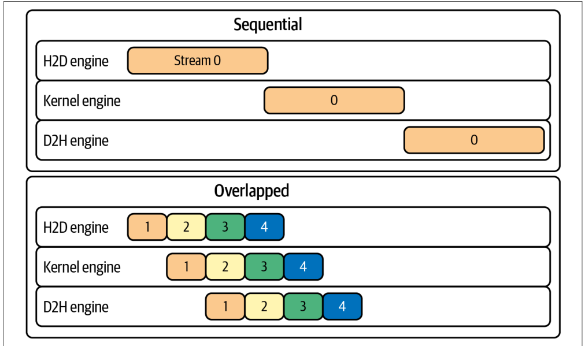
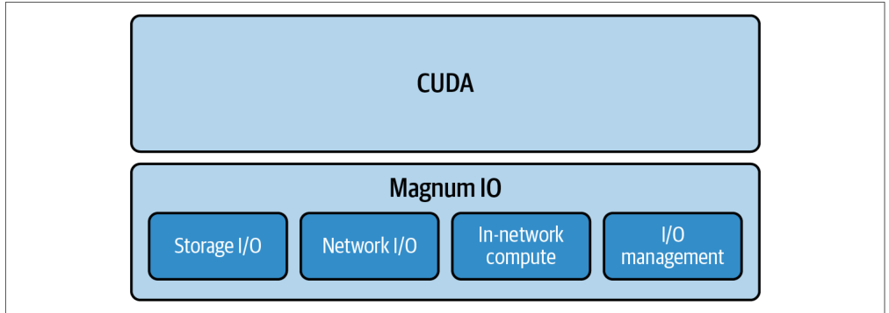
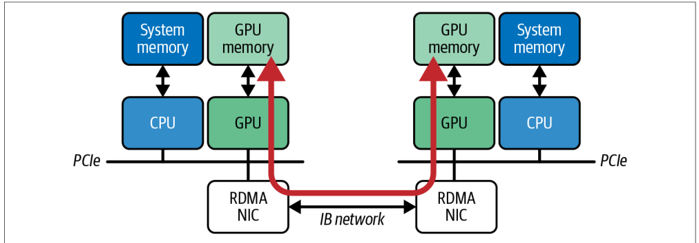
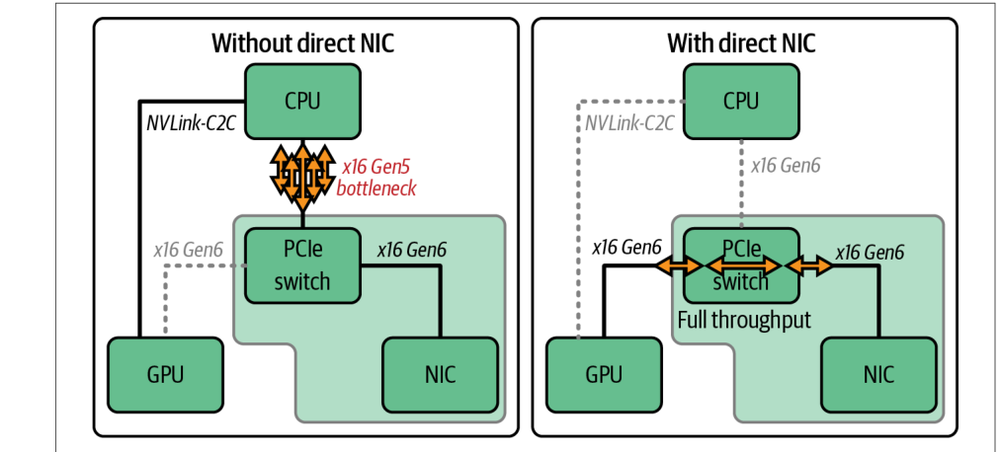
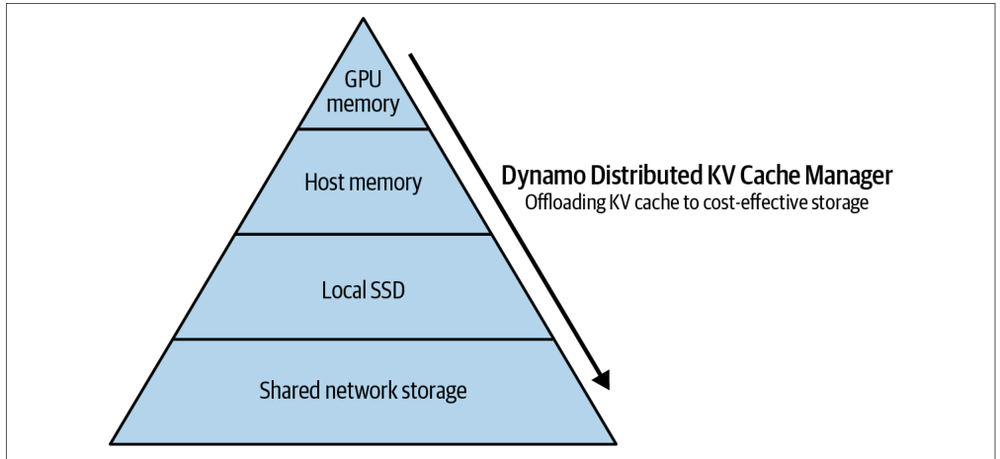
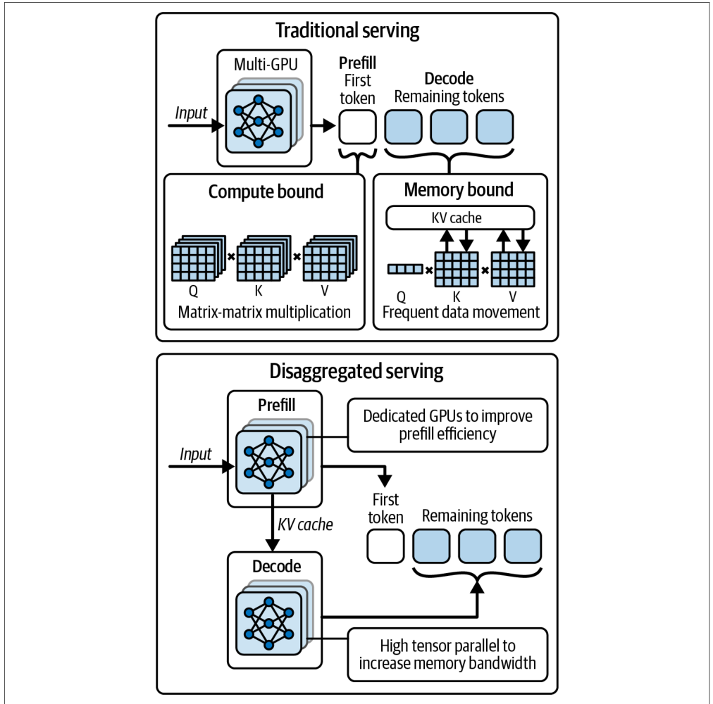
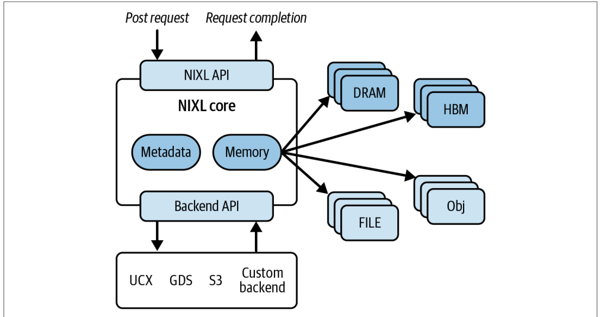
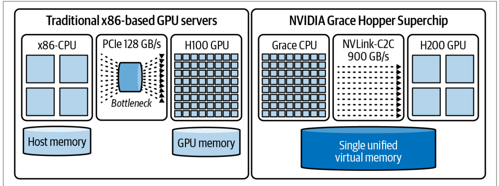
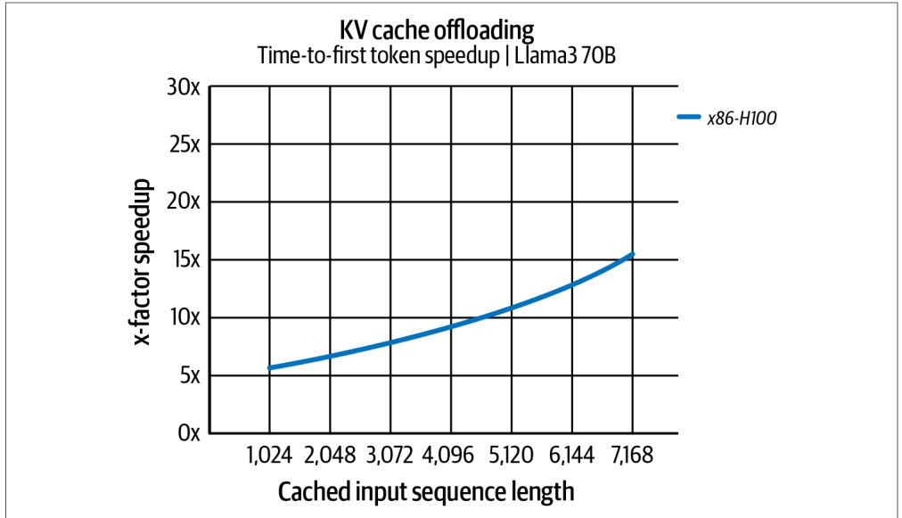
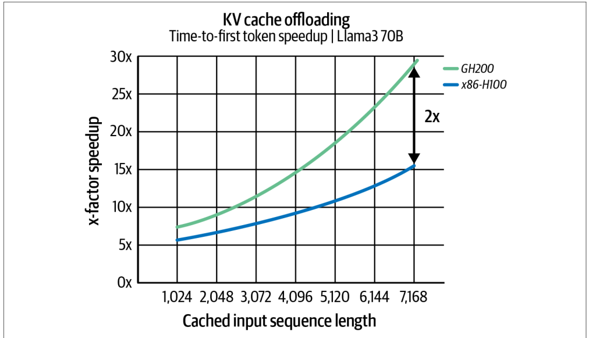

# Chapter 4. Tuning Distributed Networking Communication

# 第 4 章　分布式网络通信调优

In today’s AI landscape, the need for seamless and low-latency data movement between GPUs, storage, and network interfaces is a must. In this chapter, we cover NVIDIA Magnum IO (e.g., NCCL, GPUDirect RDMA, GDS) for training and NIXL for disaggregated inference. We’ll discuss these in the context of modern GPUs and clusters like the NVL72. You’ll learn how these libraries—and their underlying supported hardware—form the critical fabric needed for ultrascale AI systems.

在当今的 AI 版图中，GPU、存储与网络接口之间无缝、低延迟的数据搬运已成为刚需。本章将介绍用于训练的 NVIDIA Magnum IO（例如 NCCL、GPUDirect RDMA、GDS），以及用于分离式推理（disaggregated inference）的 NIXL（NVIDIA Inference Xfer Library）。我们将结合现代 GPU 与诸如 NVL72 这样的集群来讨论这些技术。你将了解到，这些库——以及其底层所支持的硬件——如何共同构成超大规模 AI 系统所需的关键“基础互连织物”（fabric）。

In large-scale systems, even the fastest GPUs can be hindered by inefficient communication and data transfer from memory and disk. We discuss strategies for speeding up data transfers, proper data sharding techniques, how to work directly with fast storage subsystems, and advanced patterns for overlapping communication and computation on GPUs. Overlapping communication and computation is a common pattern that we revisit frequently throughout our journey on AI systems performance engineering.

在大规模系统中，即便是最快的 GPU，也可能因通信低效以及来自内存和磁盘的数据传输不畅而受制。我们将讨论加速数据传输的策略、恰当的数据分片（sharding）技巧、如何直接与高速存储子系统协作，以及在 GPU 上重叠通信与计算的高级模式。通信与计算重叠是一种常见模式，在我们探索 AI 系统性能工程的旅程中会反复出现。

We explore the importance of overlapping communication and computation using components of NVIDIA’s IO acceleration platform called Magnum IO, which includes NCCL, GPUDirect RDMA, and GPUDirect Storage (GDS). We demonstrate how to use these libraries to lower communication latency, reduce CPU overhead, and maximize throughput across all layers of a multi-node, multi-GPU AI system.

我们将借助 NVIDIA IO 加速平台 Magnum IO 的各个组件来探讨通信与计算重叠的重要性，这些组件包括 NCCL、GPUDirect RDMA 与 GPUDirect Storage（GDS）。我们会演示如何利用这些库来降低通信延迟、减少 CPU 开销，并在多节点、多 GPU 的 AI 系统各个层面上最大化吞吐量。

High-level AI frameworks like PyTorch can use these low-level libraries to overlap computation with communication. Integrating these technologies into your AI system represents a holistic approach to accelerating communication and data pipelines for both training ultrascale models and scaling distributed inference servers to power applications with billions of users.

像 PyTorch 这样的高层 AI 框架可以利用这些底层库来实现计算与通信的重叠。将这些技术集成到你的 AI 系统中，代表着一种整体性的思路：既为训练超大规模模型加速通信与数据流水线，也为扩展分布式推理服务器以支撑面向数十亿用户的应用提供动力。

All of these optimizations ensure that every component is tuned for peak performance. Performance engineers need to carefully configure and tune the network and storage fabric to maintain a high level of GPU utilization and “goodput” (useful throughput).

所有这些优化确保了每个组件都被调优至峰值性能。性能工程师需要精心配置和调优网络与存储织物，以维持较高的 GPU 利用率与“有效吞吐”（goodput，即有用的吞吐量）。

## Overlapping Communication and Computation (Pipelining)

## 通信与计算重叠（流水线化）

Overlapping communication and computation, or pipelining, plays a key role in building efficient training and inference systems at scale. In these environments, it’s important to keep GPUs busy and spend less time waiting for data.

通信与计算重叠，即流水线化（pipelining），在大规模构建高效的训练与推理系统中扮演着关键角色。在这类环境里，让 GPU 保持忙碌、减少等待数据的时间至关重要。

The main idea is to ensure that data transfers occur concurrently with ongoing computations so that when one task finishes, the results needed for the next stage are already in progress or have been delivered. Modern frameworks such as PyTorch support asynchronous operations so that collective communication (e.g., all-reduce of gradients) can run alongside compute tasks. This reduces idle GPU time (see Figure 4-1)—and improves overall system throughput.

其核心思路是：让数据传输与正在进行的计算并发发生，从而当一项任务完成时，下一阶段所需的结果要么已在传输途中，要么已经送达。像 PyTorch 这样的现代框架支持异步操作，使得集合通信（collective communication，例如对梯度做 all-reduce）可以与计算任务并行运行。这减少了 GPU 的空闲时间（见图 4-1），并提升了整体系统吞吐量。




CUDA-based libraries exploit the power of multiple CUDA streams. While one stream executes compute-heavy matrix multiplications, another handles communication tasks such as aggregating gradients. As each layer of a neural network finishes its computation, the previous layer’s outputs are already on their way for aggregation or further processing. This overlapping ensures that the system produces results without unnecessary waiting periods and maintains a steady flow of data.

基于 CUDA 的库充分利用了多个 CUDA 流的能力。当一个流执行计算密集的矩阵乘法时，另一个流则处理诸如聚合梯度之类的通信任务。当神经网络的每一层完成其计算后，前一层的输出已在传输途中，等待聚合或进一步处理。这种重叠确保系统在产生结果时不必进行不必要的等待，并维持稳定的数据流动。

Increasing the amount of compute performed between communication events can further minimize the relative overhead of communication. When the system processes larger batches of data, it performs more computation before needing to stop and exchange information.

增大两次通信事件之间所执行的计算量，可以进一步降低通信的相对开销。当系统处理更大批量的数据时，它会在需要停下来交换信息之前执行更多计算。

In distributed training, for instance, this appears as gradient accumulation, where updates from several minibatches are combined into a single synchronization step. By reducing the frequency of communication events, the system lowers the overhead of each exchange and boosts overall throughput.

以分布式训练为例，这体现为梯度累积（gradient accumulation）：将来自若干个小批量（minibatch）的更新合并为单次同步步骤。通过降低通信事件的频率，系统减小了每次交换的开销，从而提升整体吞吐量。

Another technique that supports seamless overlap between computation and communication is compression. Compression reduces the volume of data that needs to be transferred. For example, if a model compresses its gradients before sending them, the network moves a smaller amount of data. This reduces transfer time and eases congestion.

另一种有助于计算与通信无缝重叠的技术是压缩（compression）。压缩减少了需要传输的数据量。例如，如果模型在发送梯度之前先对其进行压缩，网络所搬运的数据量就更小。这缩短了传输时间并缓解了拥塞。

The shorter transfer time means that the communication phase is less disruptive to the computation phase. Although compression does not directly cause overlap, it shortens the window during which data moves across the network and allows computational work to continue in parallel more effectively.

更短的传输时间意味着通信阶段对计算阶段的干扰更小。虽然压缩本身并不直接产生重叠，但它缩短了数据在网络中移动的时间窗口，从而让计算工作能够更有效地并行推进。

Modern deep learning frameworks also split large tensor communications into smaller buckets to facilitate overlap. Frameworks like PyTorch automatically divide large gradients or activation tensors into several buckets that are transmitted as soon as they become available. Rather than waiting for an entire layer’s gradients to be ready, for instance, portions of them can begin their all-reduce immediately.

现代深度学习框架还会将大张量通信拆分成更小的桶（bucket），以促成重叠。像 PyTorch 这样的框架会自动将大梯度或激活张量切分为若干个桶，一旦某个桶就绪便立即发送。举例来说，与其等待整层的梯度全部就绪，不如让其中一部分立即开始各自的 all-reduce。

By tuning bucket sizes and scheduling these transfers appropriately, one can achieve a higher degree of overlap and prevent communication delays from stalling the compute pipeline. Tools such as the PyTorch profiler and NVIDIA Nsight Systems offer insight into whether your computation and communication are overlapping, allowing engineers to adjust these parameters for maximal efficiency.

通过调节桶大小并恰当地调度这些传输，就能获得更高程度的重叠，避免通信延迟拖住计算流水线。诸如 PyTorch profiler 和 NVIDIA Nsight Systems 之类的工具能帮助你洞察计算与通信是否发生了重叠，使工程师得以调整这些参数以达到最高效率。

By combining larger batch sizes, gradient accumulation, asynchronous transfers, compression, and bucketing into one cohesive strategy, large, distributed AI models can overcome network limitations and reduce idle time. This design minimizes synchronization events while achieving high throughput and optimal GPU utilization.

将更大的批大小、梯度累积、异步传输、压缩与分桶（bucketing）整合成一套连贯的策略，大型分布式 AI 模型便能够克服网络限制并减少空闲时间。这种设计在实现高吞吐量与最优 GPU 利用率的同时，最小化了同步事件。

The outcome of these optimizations is a training system that reduces overall training and inference time and makes more efficient use of available hardware resources. Engineers are freed from reinventing low-level networking routines and can focus on innovating model architectures and tuning higher-level parameters, rather than coding intricate data transfer mechanisms.

这些优化的结果是：一个训练系统能够缩短整体训练与推理时间，并更高效地利用可用的硬件资源。工程师无须再重复造轮子去编写底层网络例程，而可以专注于创新模型架构、调优更高层的参数，而不必去编写繁复的数据传输机制。

### Asynchronous Execution with Streams

### 异步流执行

Achieving overlap fundamentally relies on asynchronous execution. GPUs support multiple streams, or queues of operations, that can execute concurrently or overlap if they target different resources. One stream can handle compute kernels such as matrix multiplies, while another stream handles communication such as data copies and all-reduce calls.

实现重叠从根本上依赖于异步执行。GPU 支持多个流（stream），也就是多个操作队列，只要它们面向不同的资源，就可以并发或重叠执行。一个流可以处理诸如矩阵乘法之类的计算内核，而另一个流则处理诸如数据拷贝和 all-reduce 调用之类的通信。

By assigning work to different streams and using nonblocking operations, communication can happen in the background. For example, an all-reduce operation can be launched to a separate stream without waiting for completion.

通过将工作分派到不同的流并使用非阻塞（nonblocking）操作，通信便可以在后台进行。例如，可以把一次 all-reduce 操作发起到一个单独的流上，而不必等待其完成。

Meanwhile, the default stream proceeds with further computations on independent data. This requires that communication libraries such as NCCL use nonblocking calls that return control immediately. By doing this, the programmer ensures proper synchronization when needed.

与此同时，默认流继续对相互独立的数据进行后续计算。这要求诸如 NCCL 之类的通信库使用能够立即返回控制权的非阻塞调用。这样，程序员便可在需要时确保正确的同步。

In practice, AI frameworks hide most of this complexity. PyTorch’s DistributedDataParallel automatically installs hooks on the backward pass so that each gradient bucket triggers an asynchronous NCCL all-reduce on a dedicated communication CUDA stream, while the default CUDA stream continues computing gradients for subsequent layers.

在实践中，AI 框架隐藏了其中大部分复杂性。PyTorch 的 DistributedDataParallel 会自动在反向传播上安装钩子（hook），使得每个梯度桶在一个专用的通信 CUDA 流上触发一次异步的 NCCL all-reduce，而默认 CUDA 流则继续为后续层计算梯度。

> We will dive deeper into CUDA streams in a later chapter, but just know that they are useful for overlapping communication and computation—and avoiding unnecessary synchronization points in your code.

> 我们将在后续章节中更深入地探讨 CUDA 流，这里只需知道：它们对于重叠通信与计算——以及避免代码中不必要的同步点——非常有用。

This interleaving of computation and communication with CUDA streams creates a steady wave, or cascading pipeline, of work that hides communication latency and keeps the GPU busy at all times. To maintain proper overlapping, avoid unnecessary synchronization points with torch.cuda.synchronize() or inadvertently triggering a full device sync by moving tensors to the CPU with torch.Tensor.item(). If you do need to measure the overall iteration time, place a single synchronization at the very end of the iteration to wait for all outstanding GPU work to finish without disrupting the ongoing pipeline.

这种通过 CUDA 流将计算与通信交错进行的方式，形成了一波接一波、层层递进的工作流水线，从而隐藏通信延迟并让 GPU 始终保持忙碌。为维持恰当的重叠，应避免因 torch.cuda.synchronize() 而产生不必要的同步点，也应避免因用 torch.Tensor.item() 将张量移动到 CPU 而无意中触发一次完整的设备同步。如果你确实需要测量整体迭代时间，可在迭代的最末尾放置单次同步，以等待所有未完成的 GPU 工作结束，而不会打断正在进行的流水线。

### Reducing Communication Frequency and Volume

### 降低通信频率与数据量

As noted, performing more work per communication step can increase overlap and efficiency. Gradient accumulation during model training is one such technique. Instead of all-reducing gradients for every single minibatch, you accumulate gradients over a few minibatches, sum them locally, and then do one all-reduce. This effectively trades off memory to store the unreduced gradients for fewer synchronization points.

如前所述，在每一次通信步骤中执行更多的工作，可以增加重叠并提升效率。模型训练期间的梯度累积就是这样一种技术。与其为每一个小批量都做梯度 all-reduce，不如在若干个小批量上累积梯度、在本地求和，然后只做一次 all-reduce。这实际上是用存储未归约梯度所需的内存，换取更少的同步点。

Consider accumulating four minibatches; you cut the all-reduce frequency by 4×. This allows more computations to happen in between synchronizations. The downside is that your effective batch size increases. This can affect model convergence and memory usage. You can often find a sweet spot that creates a good balance between communication frequency, memory usage, and convergence.

设想累积四个小批量，你就把 all-reduce 的频率削减为原来的 1/4（即降低 4×）。这让更多计算得以在两次同步之间进行。其代价是有效批大小（effective batch size）增大，这可能影响模型收敛（convergence）与内存占用。你通常能找到一个最佳平衡点，在通信频率、内存占用与收敛之间取得良好平衡。

Another approach to reduce communication volume is compressing or quantizing the data exchanged. Techniques like gradient compression can reduce the amount of data sent in each communication without significantly impacting model quality. Less data to send means faster transfers and more opportunity to hide those transfers behind computation. The extreme of this is sparsification. When using sparsity, you send only a fraction of the gradients. This typically requires algorithmic changes to preserve accuracy, however.

另一种降低通信数据量的方法是对所交换的数据进行压缩或量化（quantizing）。诸如梯度压缩之类的技术，可以在不显著影响模型质量的前提下减少每次通信中发送的数据量。要发送的数据越少，传输越快，也就有更多机会把这些传输隐藏在计算之下。这种做法的极端形式是稀疏化（sparsification）。使用稀疏性时，你只发送一小部分梯度。不过，这通常需要对算法进行改动才能保持精度。

Bucketing, as implemented in PyTorch’s Distributed Data Parallel (DDP) communication mechanism, also reduces per-call overhead by grouping many small tensors into larger messages. However, bucket sizing is a trade-off. Very large buckets maximize bandwidth utilization but delay the start of communication since you wait for more gradients to accumulate before kicking off the all-reduce. Very small buckets start transfers earlier but incur more overhead due to many small NCCL calls.

分桶——正如 PyTorch 的 Distributed Data Parallel（DDP）通信机制中所实现的那样——也能通过将许多小张量归并为更大的消息来降低单次调用的开销。然而，桶大小是一种权衡。非常大的桶能最大化带宽利用率，但会延迟通信的启动，因为你需要等待更多梯度累积起来才能发起 all-reduce。非常小的桶能更早开始传输，但会因大量小的 NCCL 调用而带来更多开销。

As of this writing, the default bucket size in PyTorch DDP is 25 MB. This is a balance that overlaps well in most cases. However, if you have a model with very large layers, you might increase this to reduce overhead. If you have a model with many small layers, you might actually benefit from smaller buckets to start communication sooner. Ultimately, achieving maximal overlap may require profiling different bucket sizes to see which yields the best iteration time.

在本书写作之时，PyTorch DDP 的默认桶大小为 25 MB。这是一个在多数情况下都能良好重叠的折中值。不过，如果你的模型含有非常大的层，或许可以增大该值以降低开销；如果你的模型含有许多小层，那么更小的桶反而可能带来好处，让通信更早开始。归根结底，要实现最大重叠，可能需要对不同的桶大小进行性能剖析，看哪一个能带来最佳的迭代时间。

### Achieving Maximal Overlap in Practice

### 在实践中实现最大重叠

To see the benefit of overlapping communication with computation, let’s run through an example that compares two scenarios in which one performs gradient communication synchronously after all computation with no overlap, and one where communication is overlapped with computation such as DDP. We’ll simulate a simple distributed training step with two GPUs to illustrate the difference.

为了直观感受重叠通信与计算的好处，我们来跑一个例子，对比两种场景：一种是在所有计算完成之后同步地执行梯度通信、没有任何重叠；另一种则是像 DDP 那样将通信与计算重叠。我们将用两块 GPU 模拟一个简单的分布式训练步骤来说明二者的差异。

Suppose we don’t use DDP’s built-in overlap and instead implement distributed training manually such that each process computes all gradients locally, then performs an all-reduce on those gradients at the end of the backward pass. This will mimic the unoptimized, nonoverlapping scenario since communication happens only after all computation is done. We can simulate this using PyTorch’s distributed primitives, disabling DDP’s hooks, and explicitly calling dist.all_reduce after loss.backward().

假设我们不使用 DDP 内置的重叠，而是手动实现分布式训练：每个进程在本地计算出全部梯度，然后在反向传播结束时对这些梯度执行一次 all-reduce。由于通信只在所有计算完成之后才发生，这将模拟出未经优化、无重叠的场景。我们可以借助 PyTorch 的分布式原语来模拟这一过程：禁用 DDP 的钩子，并在 loss.backward() 之后显式调用 dist.all_reduce。

In the code that follows, we launch two processes on gpu/rank 0 and gpu/rank 1 on a single node, in this case, with a simple model. We’ll run a forward and backward pass, then manually average gradients across the two processes:

在下面的代码中，我们在单个节点上于 gpu/rank 0 与 gpu/rank 1 启动两个进程，这里使用一个简单的模型。我们将执行一次前向和反向传播，然后在两个进程间手动对梯度求平均：

```
import torch
import torch.nn as nn
import torch.optim as optim
import torch.distributed as dist
import torch.multiprocessing as mp

# A simple model with multiple layers to produce multiple gradients
class MultiLayerNet(nn.Module):
    def __init__(self, size):
        super().__init__()
        self.fc1 = nn.Linear(size, size)
        self.fc2 = nn.Linear(size, size)
        self.fc3 = nn.Linear(size, 1)
    def forward(self, x):
        x = torch.relu(self.fc1(x))
        x = torch.relu(self.fc2(x))
        return self.fc3(x)

def train_no_overlap(rank, world_size):
    dist.init_process_group("nccl", init_method="env://",
                            world_size=world_size, rank=rank)
    torch.cuda.set_device(rank)

    # Each rank synthesizes its own data
    # (avoid sending big tensors via spawn)
    batch_size = 256
    data = torch.randn(batch_size, 1024, device=rank)
    target = torch.randn(batch_size, 1, device=rank)

    model = MultiLayerNet(data.size(1)).to(rank)
    optimizer = optim.SGD(model.parameters(), lr=0.01)

    # Forward + backward (manual, no overlap)
    output = model(data)
    loss = nn.functional.mse_loss(output, target)
    loss.backward()

    # Synchronous gradient all-reduce after backward
    for p in model.parameters():
        dist.all_reduce(p.grad, op=dist.ReduceOp.SUM)
        p.grad /= world_size

    optimizer.step()
    dist.destroy_process_group()

if __name__ == "__main__":
    import torch.multiprocessing as mp
    mp.set_start_method("spawn", force=True)
    world_size = min(2, torch.cuda.device_count() or 1)
    if world_size > 1:
        mp.spawn(train_no_overlap, args=(world_size,), nprocs=world_size,
                 join=True)
    else:
        train_no_overlap(0, 1)
```

```
import torch
import torch.nn as nn
import torch.optim as optim
import torch.distributed as dist
import torch.multiprocessing as mp

# 一个含多层的简单模型，用于产生多个梯度
class MultiLayerNet(nn.Module):
    def __init__(self, size):
        super().__init__()
        self.fc1 = nn.Linear(size, size)
        self.fc2 = nn.Linear(size, size)
        self.fc3 = nn.Linear(size, 1)
    def forward(self, x):
        x = torch.relu(self.fc1(x))
        x = torch.relu(self.fc2(x))
        return self.fc3(x)

def train_no_overlap(rank, world_size):
    dist.init_process_group("nccl", init_method="env://",
                            world_size=world_size, rank=rank)
    torch.cuda.set_device(rank)

    # 每个 rank 各自合成自己的数据
    # （避免通过 spawn 发送大张量）
    batch_size = 256
    data = torch.randn(batch_size, 1024, device=rank)
    target = torch.randn(batch_size, 1, device=rank)

    model = MultiLayerNet(data.size(1)).to(rank)
    optimizer = optim.SGD(model.parameters(), lr=0.01)

    # 前向 + 反向（手动，无重叠）
    output = model(data)
    loss = nn.functional.mse_loss(output, target)
    loss.backward()

    # 反向传播之后进行同步的梯度 all-reduce
    for p in model.parameters():
        dist.all_reduce(p.grad, op=dist.ReduceOp.SUM)
        p.grad /= world_size

    optimizer.step()
    dist.destroy_process_group()

if __name__ == "__main__":
    import torch.multiprocessing as mp
    mp.set_start_method("spawn", force=True)
    world_size = min(2, torch.cuda.device_count() or 1)
    if world_size > 1:
        mp.spawn(train_no_overlap, args=(world_size,), nprocs=world_size,
                 join=True)
    else:
        train_no_overlap(0, 1)
```

In this code, each process computes gradients for MultiLayerNet independently. After loss.backward(), we explicitly perform an all-reduce for each parameter’s gradient to average them. This is effectively what DDP does internally, but here we wait and do it after the entire backward pass has finished—rather than doing the all-reduce concurrently during the backward pass.

在这段代码中，每个进程独立地为 MultiLayerNet 计算梯度。在 loss.backward() 之后，我们显式地对每个参数的梯度执行一次 all-reduce 来求平均。这本质上就是 DDP 在内部所做的事情，但这里我们是在整个反向传播完成之后才等待并执行——而不是在反向传播过程中并发地进行 all-reduce。

If we were to time this iteration, the all-reduce operations would add directly to the iteration time since it’s not overlapping with any other steps. For example, say the forward and backward computations together take 10 ms and the gradient all-reduces take 12 ms. The total iteration time would be roughly 22 ms in this approach. In contrast, a fully overlapped implementation might achieve a total time closer to the max of these values, or 12 ms in our case. This is possible since the all-reduce communication can be almost completely hidden under the computation.

如果我们对这次迭代计时，all-reduce 操作会直接叠加到迭代时间上，因为它没有与任何其他步骤重叠。举例来说，假设前向和反向计算合计耗时 10 ms，而梯度 all-reduce 耗时 12 ms。那么在这种方式下，总迭代时间大约为 22 ms。相比之下，一个完全重叠的实现或许能把总时间做到接近这两个值中的最大者，在我们的例子中即 12 ms。这之所以可能，是因为 all-reduce 通信几乎可以被完全隐藏在计算之下。

In practice, if we profile this no-overlap case with a tool like Nsight Systems, we would see all the backward computation kernels for fc1, fc2, and fc3 execute first, and only after they complete do we see NCCL all-reduce kernels for each gradient. There is a clear separation in which compute happens first, then communication. During the communication phase, the GPUs would be idle aside from the NCCL work since no further computations are happening.

在实践中，如果我们用 Nsight Systems 之类的工具剖析这个无重叠的例子，会看到 fc1、fc2 和 fc3 的所有反向计算内核先行执行，只有在它们全部完成之后，我们才会看到针对每个梯度的 NCCL all-reduce 内核。这里存在一个明显的分界：先计算，后通信。在通信阶段，除了 NCCL 的工作之外 GPU 处于空闲状态，因为没有更多的计算在进行。

Now let’s use PyTorch’s DDP to perform the same operation with overlap. DDP will hook into the backward pass and overlap gradient reduction with backward computation. The code is similar, but we simply wrap the model with DistributedDataParallel and let it handle synchronization:

现在，让我们改用 PyTorch 的 DDP 以带重叠的方式执行相同的操作。DDP 会挂钩到反向传播中，将梯度归约与反向计算重叠。代码是类似的，只是我们简单地用 DistributedDataParallel 包裹模型，并让它来处理同步：

```
import torch
import torch.nn as nn
import torch.optim as optim
import torch.distributed as dist
import torch.multiprocessing as mp

class MultiLayerNet(nn.Module):
    def __init__(self, size):
        super().__init__()
        self.fc1 = nn.Linear(size, size)
        self.fc2 = nn.Linear(size, size)
        self.fc3 = nn.Linear(size, 1)
    def forward(self, x):
        x = torch.relu(self.fc1(x))
        x = torch.relu(self.fc2(x))
        return self.fc3(x)

def train_ddp(rank, world_size):
    rank = int(os.environ.get("LOCAL_RANK", rank))
    torch.cuda.set_device(rank)
    dist.init_process_group("nccl", init_method="env://",
                            world_size=world_size, rank=rank)
    torch.cuda.set_device(rank)

    model = MultiLayerNet(1024).to(rank)
    ddp_model = nn.parallel.DistributedDataParallel(model, device_ids=[rank])
    optimizer = optim.SGD(ddp_model.parameters(), lr=0.01)

    # Each rank makes its own data
    batch_size = 256
    data = torch.randn(batch_size, 1024, device=rank)
    target = torch.randn(batch_size, 1, device=rank)

    output = ddp_model(data)
    loss = nn.functional.mse_loss(output, target)
    loss.backward()  # DDP overlaps gradient all-reduce on background stream
    optimizer.step()
    dist.destroy_process_group()

def main():
    world_size = min(2, torch.cuda.device_count() or 1)
    mp.set_start_method("spawn", force=True)
    if world_size > 1:
        mp.spawn(train_ddp, args=(world_size,), nprocs=world_size, join=True)
    else:
        print("Only one GPU present; running DDP demo with world_size=1")
        train_ddp(0, 1)

if __name__ == "__main__":
    main()
```

```
import torch
import torch.nn as nn
import torch.optim as optim
import torch.distributed as dist
import torch.multiprocessing as mp

class MultiLayerNet(nn.Module):
    def __init__(self, size):
        super().__init__()
        self.fc1 = nn.Linear(size, size)
        self.fc2 = nn.Linear(size, size)
        self.fc3 = nn.Linear(size, 1)
    def forward(self, x):
        x = torch.relu(self.fc1(x))
        x = torch.relu(self.fc2(x))
        return self.fc3(x)

def train_ddp(rank, world_size):
    rank = int(os.environ.get("LOCAL_RANK", rank))
    torch.cuda.set_device(rank)
    dist.init_process_group("nccl", init_method="env://",
                            world_size=world_size, rank=rank)
    torch.cuda.set_device(rank)

    model = MultiLayerNet(1024).to(rank)
    ddp_model = nn.parallel.DistributedDataParallel(model, device_ids=[rank])
    optimizer = optim.SGD(ddp_model.parameters(), lr=0.01)

    # 每个 rank 生成自己的数据
    batch_size = 256
    data = torch.randn(batch_size, 1024, device=rank)
    target = torch.randn(batch_size, 1, device=rank)

    output = ddp_model(data)
    loss = nn.functional.mse_loss(output, target)
    loss.backward()  # DDP 在后台流上重叠梯度 all-reduce
    optimizer.step()
    dist.destroy_process_group()

def main():
    world_size = min(2, torch.cuda.device_count() or 1)
    mp.set_start_method("spawn", force=True)
    if world_size > 1:
        mp.spawn(train_ddp, args=(world_size,), nprocs=world_size, join=True)
    else:
        print("Only one GPU present; running DDP demo with world_size=1")
        train_ddp(0, 1)

if __name__ == "__main__":
    main()
```

With the DDP overlapping approach, the code is simpler since we rely on Distribu tedDataParallel to handle gradient synchronization rather than writing it ourselves. When loss.backward() is called, DDP’s internal reducer splits the gradients into buckets and launches NCCL all-reduce operations as soon as each bucket is ready on a separate CUDA stream. For instance, it might all-reduce the fc3.weight and fc3.bias gradients immediately after they are computed since those are from the last layer and are computed last in the backward pass, while the fc1 and fc2 gradients from earlier layers will have already been all-reduced by the time we reach the end of the backward pass.

采用 DDP 的重叠方式后，代码更为简洁，因为我们依靠 DistributedDataParallel 来处理梯度同步，而不必自己编写。当 loss.backward() 被调用时，DDP 内部的 reducer 会将梯度切分成桶，并在每个桶就绪时立即在一个单独的 CUDA 流上发起 NCCL all-reduce 操作。例如，它可能在 fc3.weight 和 fc3.bias 的梯度刚被计算出来时就立即对它们做 all-reduce，因为这些梯度来自最后一层、在反向传播中最先算出；而来自较早层的 fc1 和 fc2 梯度，则会在我们到达反向传播末尾时早已完成 all-reduce。

If the model is very small such that all gradients fit into one bucket, DDP might do only one all-reduce at the end, which wouldn’t overlap much. But with larger models and bigger batch sizes, there will be multiple buckets and significant overlap—showing even more impressive performance gains from this technique.

如果模型非常小、所有梯度都能装进一个桶，DDP 或许只会在末尾做一次 all-reduce，那样重叠就不多。但对于更大的模型和更大的批量，会存在多个桶以及显著的重叠——从而展现出这项技术更为可观的性能收益。

Profiling the DDP case would show NCCL all-reduce kernels interleaved with backward compute kernels. So instead of a clear two-phase split, we’d see a sawtooth pattern in the timeline with some compute happening, then some NCCL communication happening, then compute, and so on.

对 DDP 情形进行剖析，会看到 NCCL all-reduce 内核与反向计算内核相互交错。因此，我们看到的不再是清晰的两阶段划分，而是时间线上呈锯齿状的模式：先有一些计算，接着有一些 NCCL 通信，再是计算，如此往复。

Key signs of good overlap are that the total iteration time is lower than the sum of compute + comm times, and the GPU is rarely idle waiting for communication because the all-reduces happen during the compute, as shown in Table 4-1.

良好重叠的关键标志是：总迭代时间低于计算时间与通信时间之和，并且 GPU 很少因等待通信而空闲，因为 all-reduce 就发生在计算过程中，如表 4-1 所示。

_Table 4-1. The benefit of overlap_

_表 4-1. 重叠带来的收益_

| Metric                                          | No overlap (manual sync)                        | Overlap (DDP)                                        | Notes                                                        |
| ----------------------------------------------- | ----------------------------------------------- | ---------------------------------------------------- | ------------------------------------------------------------ |
| Total backward + comm time                      | 100% (baseline)                                 | ~70% of baseline                                     | e.g., 30% faster per iteration due to overlap (illustrative) |
| Comm start time                                 | After backward complete                         | During backward                                      | In DDP, comm begins midway through backward                  |
| GPU idle during comm phase                      | Yes—after backward, GPUs wait during all-reduce | Minimal—comm runs while other layers still computing | DDP hides most of the latency                                |
| SM (GPU) utilization                            | Lower (some cycles where SMs idle during comm)  | Higher (continuous activity)                         | Overlap keeps GPU busy more consistently                     |
| Overlap achieved (% of comm covered by compute) | 0% (serial execution)                           | ~50% (or more)                                       | Rough estimate: larger models or batches can overlap more    |

| 指标                                          | 无重叠（手动同步）                        | 重叠（DDP）                                        | 说明                                                        |
| ----------------------------------------------- | ----------------------------------------------- | ---------------------------------------------------- | ------------------------------------------------------------ |
| 反向传播 + 通信总时间                      | 100%（基线）                                 | 约为基线的 ~70%                                     | 例如，得益于重叠，每次迭代快约 30%（示意值） |
| 通信开始时间                                 | 反向传播完成之后                         | 反向传播期间                                      | 在 DDP 中，通信在反向传播中途即开始                  |
| 通信阶段 GPU 空闲                      | 是——反向传播后，GPU 在 all-reduce 期间等待 | 极少——通信在其他层仍在计算时进行 | DDP 隐藏了大部分延迟                                |
| SM（streaming multiprocessor，流式多处理器，即 GPU）利用率 | 较低（通信期间部分周期 SM 空闲）  | 较高（持续活动）                         | 重叠使 GPU 更持续地保持忙碌                     |
| 实现的重叠（通信被计算覆盖的百分比） | 0%（串行执行）                           | ~50%（或更多）                                       | 粗略估计：更大的模型或批量可实现更多重叠    |

> Note: The numeric values in all metrics tables are illustrative to explain the concepts. For actual benchmark results on different GPU architectures, see the GitHub repository.

> 注：所有指标表中的数值均为示意性质，用于说明概念。若需了解不同 GPU 架构上的实际基准测试结果，请参见 GitHub 仓库。

In this example, overlapping communication with computation yields roughly a 30% iteration time improvement in our example workload. In larger training jobs, the gains would be more substantial since larger models create more potential for communication bottlenecks. PyTorch DistributedDataParallel uses 25 MiB buckets by default. This way, it launches an all-reduce for each bucket as soon as it is ready. Tuning bucket_cap_mb can help increase overlap for your specific model topology, but larger buckets increase latency for the last bucket.

在本例中，将通信与计算重叠为我们的示例工作负载带来了约 30% 的迭代时间改善。在更大的训练作业中，收益会更加可观，因为更大的模型带来了更多潜在的通信瓶颈。PyTorch 的 DistributedDataParallel 默认使用 25 MiB 的桶。如此一来，它便会在每个桶就绪时立即为其发起一次 all-reduce。调节 bucket_cap_mb 有助于为你的特定模型拓扑增加重叠，但更大的桶会增加最后一个桶的延迟。

The takeaway is that a well-tuned DDP should overlap most of the gradient communication with computation. Often the only portion of communication that cannot be overlapped is the tail end, or the last gradient bucket, if it happens to finish after the last compute. Research efforts are ongoing to even overlap the optimizer step with communication or to use techniques like tensor partitioning to achieve further overlap, but PyTorch’s DDP’s default overlap strategy is often described as wait-free backpropagation (WFBP), which bucketizes gradients and launches reductions as soon as each bucket is ready.

要点在于：一个调优良好的 DDP 应当能把大部分梯度通信与计算重叠。通常唯一无法重叠的部分就是尾部，也就是最后一个梯度桶——如果它恰好在最后一次计算之后才完成的话。目前仍有研究工作在尝试将优化器步骤也与通信重叠，或使用张量切分之类的技术来实现进一步的重叠；而 PyTorch DDP 的默认重叠策略常被称为无等待反向传播（wait-free backpropagation，WFBP），它将梯度分桶，并在每个桶就绪时立即发起归约。

It’s worth noting that certain coding patterns can inadvertently eliminate overlap. For instance, if you perform any operation that forces a synchronization between backward and the next iteration, you will stall the computation until all communications are done.

值得注意的是，某些编码模式会无意中消除重叠。举例来说，如果你执行了任何在反向传播与下一次迭代之间强制同步的操作，就会导致计算停滞，直到所有通信完成。

> Avoid operations that inadvertently move tensors from the GPU to the CPU (e.g., calling .item() on a tensor) until you’re sure that all asynchronous GPU work is finished. Otherwise, you will force a synchronization, stall the computation, and slow down your training or inference workload. This typically happens when adding print() or log() statements for debugging. These can be disastrous for performance.

> 在你确定所有异步 GPU 工作都已结束之前，应避免那些无意中将张量从 GPU 移动到 CPU 的操作（例如对张量调用 .item()）。否则，你会强制一次同步、使计算停滞，并拖慢你的训练或推理工作负载。这种情况通常发生在为调试而添加 print() 或 log() 语句时。它们对性能可能是灾难性的。

You should move such operations to a separate stream if possible. Also, manual calls to torch.cuda.synchronize() should be minimized and used only for accurate benchmarking—or when required for correctness. Otherwise, they will serialize GPU work and negatively impact performance. DDP’s design and PyTorch’s operations are already asynchronous and handle dependencies correctly. Explicit synchronization is rarely needed in user code.

如有可能，你应把此类操作移到一个单独的流上。此外，手动调用 torch.cuda.synchronize() 应尽量减少，仅在需要精确基准测试时——或为了正确性而必需时——才使用。否则，它们会使 GPU 工作串行化，对性能造成负面影响。DDP 的设计以及 PyTorch 的各项操作本身已是异步的，并能正确处理依赖关系。在用户代码中很少需要显式同步。

In summary, overlapping computation and communication is one of the most effective techniques for distributed performance engineering. Properly utilized, it can significantly reduce training time by hiding communication latencies behind useful work.

总而言之，重叠计算与通信是分布式性能工程中最有效的技术之一。若能恰当运用，它可以通过把通信延迟隐藏在有用的工作之下，显著缩短训练时间。

In the following sections, we’ll explore the software and hardware infrastructure that makes this possible and how to ensure you’re getting the maximum overlap on modern systems. Next, we will overview NVIDIA’s Magnum IO stack, which includes technologies that make overlapping of compute and communication possible.

在接下来的几节中，我们将探讨使这一切成为可能的软件与硬件基础设施，以及如何确保在现代系统上获得最大的重叠。接下来，我们将概览 NVIDIA 的 Magnum IO 栈，其中包含了使计算与通信得以重叠的各项技术。

## NVIDIA Magnum IO Optimization Stack

## NVIDIA Magnum IO 优化栈

Magnum IO, NVIDIA’s overarching I/O acceleration platform, brings together a range of technologies to speed up data movement, access, and management across GPUs, CPUs, storage, and network interfaces. There are four key components of the Magnum IO architecture spanning storage, network, in-network computing, and I/O management, as shown in Figure 4-2.

Magnum IO 是 NVIDIA 全局性的 I/O 加速平台，它汇集了一系列技术，用于加速数据在 GPU、CPU、存储与网络接口之间的搬运、访问与管理。Magnum IO 架构有四个关键组成部分，分别涵盖存储、网络、在网计算与 I/O 管理，如图 4-2 所示。




Here is a description of the four components in Figure 4-2:

以下是对图 4-2 中四个组成部分的说明：

**Storage I/O**

**存储 I/O**

This is implemented by technologies such as NVIDIA GPUDirect Storage (GDS) and BlueField SNAP. These let GPUs access storage including NVMe SSDs directly without unnecessary copies through host CPU memory. We’ll dive deeper into GDS in Chapter 5.

这一部分由诸如 NVIDIA GPUDirect Storage（GDS）和 BlueField SNAP 之类的技术实现。它们让 GPU 能够直接访问包括 NVMe SSD 在内的存储，而无须经由主机 CPU 内存进行不必要的拷贝。我们将在第 5 章更深入地探讨 GDS。

**Network I/O**

**网络 I/O**

This includes technologies like GPUDirect RDMA, NCCL, NVSHMEM, UCX, and HPC-X (MPI/SHMEM software bundle) to enable direct, high-speed data transfers between GPUs across nodes, bypassing the CPU for internode communication.

这一部分包括 GPUDirect RDMA、NCCL、NVSHMEM、UCX 与 HPC-X（MPI/SHMEM 软件套件）等技术，用于在跨节点的 GPU 之间实现直接、高速的数据传输，并在节点间（internode）通信中绕过 CPU。

**In-network compute**

**在网计算**

SHARP performs in-network reductions inside Quantum-class InfiniBand switches. The reduction arithmetic happens in the switch silicon. BlueField DPUs offload networking and can host control services such as the Subnet Manager and the SHARP Aggregation Manager. When the NCCL RDMA SHARP plugin is enabled and the fabric has SHARP firmware and an active Aggregation Manager, eligible collectives can be offloaded to the IB switches, reducing host and GPU overhead. We will cover NVIDIA SHARP in more detail in a bit.

SHARP 在 Quantum 系列 InfiniBand 交换机内部执行在网归约。归约运算在交换机芯片中完成。BlueField DPU 卸载网络处理，并可承载诸如子网管理器（Subnet Manager）和 SHARP 聚合管理器（Aggregation Manager）之类的控制服务。当启用 NCCL RDMA SHARP 插件、且织物具备 SHARP 固件和一个活跃的聚合管理器时，符合条件的集合操作便可被卸载到 IB 交换机上，从而减少主机与 GPU 的开销。稍后我们会更详细地介绍 NVIDIA SHARP。

> Ethernet-based GPU clusters rely on technologies like RoCEv2 for RDMA but generally lack features like SHARP. This is one of the reasons that many ultrascale AI systems use InfiniBand or similar high-performance interconnects instead of Ethernet. SHARP provides a significant performance boost and should be utilized when available.

> 基于以太网的 GPU 集群依赖诸如 RoCEv2 之类的技术来实现 RDMA，但通常缺乏像 SHARP 这样的特性。这也是许多超大规模 AI 系统选用 InfiniBand 或类似高性能互连而非以太网的原因之一。SHARP 能带来显著的性能提升，在可用时应当加以利用。

**I/O management**

**I/O 管理**

Tools like NVIDIA NetQ and Unified Fabric Manager (UFM) fall in this category, providing real-time telemetry, diagnostics, and lifecycle management for the data center’s I/O fabric.

诸如 NVIDIA NetQ 和 Unified Fabric Manager（UFM）之类的工具归入此类，它们为数据中心的 I/O 织物提供实时遥测、诊断与生命周期管理。

These components work together through flexible APIs and SDKs that hide much of the low-level complexity. Magnum IO’s goal is to maximize end-to-end throughput for large-scale AI and data analytics workloads. Magnum IO continues to evolve alongside new hardware.

这些组件通过灵活的 API 和 SDK 协同工作，隐藏了大量底层复杂性。Magnum IO 的目标是为大规模 AI 与数据分析工作负载最大化端到端吞吐量。Magnum IO 也在随新硬件不断演进。

Magnum IO now integrates support for NVLink Switch network domains, which enables intra-rack GPU communication at fabric scale. It also leverages advancements in InfiniBand (Quantum-2 and Quantum-X800 families) and Ethernet (Spectrum-X) to further reduce communication overhead.

Magnum IO 现已集成对 NVLink Switch 网络域的支持，从而在织物规模上实现机架内的 GPU 通信。它还利用了 InfiniBand（Quantum-2 与 Quantum-X800 系列）和以太网（Spectrum-X）的进展，以进一步降低通信开销。

Throughout this chapter, we will dive into several of these components such as RDMA for network transfers, NCCL for collectives, NIXL for inference data movement, and GDS for efficient data loading. Additionally, we will see how to profile and tune each of them. Let’s dive right into it!

在本章中，我们将深入探讨其中的若干组件，例如用于网络传输的 RDMA、用于集合操作的 NCCL、用于推理数据搬运的 NIXL，以及用于高效数据加载的 GDS。此外，我们还会看到如何对它们各自进行剖析与调优。让我们直接开始吧！

## High-Speed, Low-Overhead Data Transfers with RDMA

## 使用 RDMA 实现高速、低开销的数据传输

RDMA is a technology optimized for low-latency, high-throughput data transfers. RDMA works by allowing direct memory-to-memory communication between devices without burdening the CPU with unnecessary data-copy operations. In a nutshell, RDMA bypasses much of the traditional kernel network stack and allows a NIC to directly read/write application memory. This avoids CPU involvement in each packet and reduces context switches and buffer copies. Prefer RDMA paths where available and verified. And always confirm (and continuously reconfirm) with logs and microbenchmarks that the RDMA data path is active.

RDMA 是一项为低延迟、高吞吐数据传输而优化的技术。RDMA 的工作方式是允许设备之间进行直接的内存到内存通信，而无须让 CPU 承担不必要的数据拷贝操作。简而言之，RDMA 绕过了传统内核网络栈的大部分环节，允许网卡（network interface card，NIC）直接读写应用程序内存。这避免了每个数据包都需要 CPU 参与，并减少了上下文切换与缓冲区拷贝。在可用且经过验证的地方，应优先选择 RDMA 路径。并且要始终通过日志和微基准测试来确认（并持续重新确认）RDMA 数据路径确实处于活跃状态。

In container environments like Docker and Kubernetes, ensure the container has direct access to the host’s InfiniBand devices (e.g., /dev/infiniband). Otherwise, NCCL may silently fall back to TCP sockets instead of GPUDirect RDMA—and without any obvious errors to highlight the degradation. This results in throughput dropping from tens of GB/s to only a few Gb/s, with no obvious error messages.

在诸如 Docker 和 Kubernetes 之类的容器环境中，要确保容器能够直接访问主机的 InfiniBand 设备（例如 /dev/infiniband）。否则，NCCL 可能会悄无声息地回退到 TCP 套接字，而不使用 GPUDirect RDMA——而且没有任何明显的错误来提示这种性能退化。其结果是吞吐量从数十 GB/s 骤降到仅有几 Gb/s，却没有任何明显的错误信息。

A related container pitfall arises when the container’s GID assignments don’t match the host, as in some “rdma-shared” Docker images. This prevents GPUDirect registration and uses CPU-driven RDMA copies instead of using true GPU-based RDMA.

一个相关的容器陷阱出现在容器的 GID 分配与主机不匹配时，例如某些 “rdma-shared” 的 Docker 镜像便是如此。这会导致无法进行 GPUDirect 注册，转而使用由 CPU 驱动的 RDMA 拷贝，而非真正基于 GPU 的 RDMA。

> Always verify that it is true GPUDirect RDMA. Confirm that the kernel module is loaded with lsmod | grep nvidia_peermem, and check dmesg for initialization. For an end-to-end check, run NCCL with NCCL_DEBUG=INFO to confirm NET/IB paths and use RDMA perftests with --use_cuda to validate GPU-to-GPU transfers. Verifying will help prevent stealthy performance degradations.

> 务必核实它确实是真正的 GPUDirect RDMA。用 lsmod | grep nvidia_peermem 确认内核模块已加载，并检查 dmesg 中的初始化信息。作为端到端的检查，可用 NCCL_DEBUG=INFO 运行 NCCL 以确认 NET/IB 路径，并使用带 --use_cuda 的 RDMA perftests 来验证 GPU 到 GPU 的传输。核实有助于防止隐蔽的性能退化。

The reduced throughput would show up in the profiler as an order-of-magnitude reduction in throughput. But you have to be aware of this possibility and continuously monitor your system for these types of subtle fallbacks.

在剖析器中，被削减的吞吐量会表现为吞吐量下降一个数量级。但你必须意识到这种可能性，并持续监控你的系统，以防这类微妙的回退。

NVIDIA’s RDMA implementation for GPUs is called GPUDirect RDMA. GPUDirect RDMA lets an RDMA-capable NIC such as InfiniBand and RDMA over Converged Ethernet (RoCE) perform direct memory access (DMA) to and from the GPU’s device memory across two servers—bypassing host CPU and system RAM entirely. A data transfer with RoCE is shown in Figure 4-3.

NVIDIA 面向 GPU 的 RDMA 实现称为 GPUDirect RDMA。GPUDirect RDMA 让具备 RDMA 能力的网卡——例如 InfiniBand 和 RDMA over Converged Ethernet（RoCE）——能够跨两台服务器对 GPU 的设备内存执行直接内存访问（direct memory access，DMA），完全绕过主机 CPU 和系统 RAM。图 4-3 展示了一次使用 RoCE 的数据传输。




By registering GPU buffers with the NIC, GPUDirect RDMA enables one-sided RDMA reads and writes between remote GPUs. This minimizes both latency and CPU overhead in multinode training.

通过把 GPU 缓冲区在网卡上注册，GPUDirect RDMA 使得远程 GPU 之间能够进行单边（one-sided）的 RDMA 读写。这在多节点训练中同时最小化了延迟与 CPU 开销。

RDMA is supported inherently by InfiniBand and also by some high-speed Ethernet networks through RoCE. With RoCE, you get RDMA-like zero-copy transfers over Ethernet, assuming the network gear supports RDMA and is properly configured for it. Using RDMA with RoCE usually requires a properly configured system with the necessary drivers, including NVIDIA OFED for InfiniBand/RoCE.

RDMA 天生受到 InfiniBand 的支持，也可通过 RoCE 在某些高速以太网网络上得到支持。使用 RoCE 时，只要网络设备支持 RDMA 并为此进行了恰当配置，你就能在以太网上获得类似 RDMA 的零拷贝传输。在 RoCE 上使用 RDMA 通常要求系统经过恰当配置并安装必要的驱动，包括用于 InfiniBand/RoCE 的 NVIDIA OFED。

The performance difference between using RDMA versus standard TCP/IP networking can be huge. For example, a modern InfiniBand link might provide latency on the order of a few microseconds for a small message, whereas standard TCP over Ethernet might incur 5–10× higher latency.

使用 RDMA 与使用标准 TCP/IP 网络之间的性能差异可能非常巨大。例如，现代 InfiniBand 链路对一条小消息的延迟可能只有几微秒，而以太网上的标准 TCP 可能会带来高出 5–10× 的延迟。

For large transfers that are network-bandwidth-bound, RDMA on InfiniBand can sustain very high throughput on the order of hundreds of Gbps. In contrast, a typical TCP/IP network might be limited by kernel overhead and NIC speed—often 100 Gbps or less unless using 200–400 Gbps Ethernet with RDMA capabilities. TCP/IP networks also incur more overhead.

对于受网络带宽限制的大传输，InfiniBand 上的 RDMA 能够维持数百 Gbps 量级的极高吞吐量。相比之下，典型的 TCP/IP 网络可能受制于内核开销与网卡速率——除非使用具备 RDMA 能力的 200–400 Gbps 以太网，否则往往只有 100 Gbps 或更低。TCP/IP 网络还会带来更多开销。

In distributed deep learning, large-message throughput tends to matter more than tiny message latency since gradients are large, for instance. Both high bandwidth and low latency keep the protocol efficient—and the GPUs busy.

在分布式深度学习中，大消息的吞吐量往往比极小消息的延迟更为重要，因为梯度本身就很大。高带宽与低延迟二者兼备，才能让协议保持高效——并让 GPU 保持忙碌。

If you only have Ethernet available, you should use the highest bandwidth and lowest-latency configuration possible. For instance, 200+ Gbps Ethernet with RDMA (RoCE) will perform much better for all-reduce traffic than a basic 10–25 Gbps TCP network. At a minimum, ensure you are using jumbo frames such as MTU 9000. Enabling this configuration for your cluster network, data transfers will send fewer large packets instead of many small ones. This reduces CPU overhead and improves efficiency similarly to how larger disk block sizes improve sequential disk throughput.

如果你只有以太网可用，就应当采用尽可能高带宽、低延迟的配置。例如，带 RDMA（RoCE）的 200+ Gbps 以太网，处理 all-reduce 流量的表现将远优于基础的 10–25 Gbps TCP 网络。至少，要确保你使用了巨型帧（jumbo frame），例如 MTU 9000。为你的集群网络启用这一配置后，数据传输将发送更少的大数据包，而非许多小数据包。这减少了 CPU 开销并提升了效率，其原理类似于更大的磁盘块大小如何提升顺序磁盘吞吐量。

Also, it’s important to tune the TCP stack for a similar reason. You should verify that Linux sysctl parameters like net.core.rmem_max/wmem_max and the autotuning ranges net.ipv4.tcp_rmem/tcp_wmem are set high enough to fully utilize a high-bandwidth link.

同样，出于类似原因，调优 TCP 栈也很重要。你应当核实诸如 net.core.rmem_max/wmem_max 之类的 Linux sysctl 参数，以及自动调节范围 net.ipv4.tcp_rmem/tcp_wmem，都设置得足够高，以充分利用高带宽链路。

And, of course, it’s important to use a modern TCP congestion control algorithm to improve throughput on high-latency links. On a well-engineered, dedicated cluster network with no external internet traffic, the default CUBIC congestion control typically performs adequately since it’s engineered to avoid congestion.

当然，使用现代的 TCP 拥塞控制算法来提升高延迟链路上的吞吐量也很重要。在一个精心设计、无外部互联网流量的专用集群网络上，默认的 CUBIC 拥塞控制通常表现尚可，因为它本就是为避免拥塞而设计的。

> For any high latency-bandwidth links, consider using a modern TCP congestion algorithm like Bottleneck Bandwidth and Round-trip propagation time (BBR) and adjust buffer sizes to ensure full utilization. Always validate that the default settings are not limiting throughput. Use tools like sysctl net.ipv4.tcp_congestion_control to inspect and tune the setting.

> 对于任何高延迟带宽积的链路，可考虑使用现代 TCP 拥塞算法，例如 Bottleneck Bandwidth and Round-trip propagation time（BBR），并调整缓冲区大小以确保充分利用。务必验证默认设置没有限制吞吐量。使用诸如 sysctl net.ipv4.tcp_congestion_control 之类的工具来查看和调节该设置。

In cloud or hybrid environments, be cautious of whether you truly have a controlled high-speed connection. For example, if you use AWS EC2 instances with Elastic Fabric Adapter (EFA), you get something similar to InfiniBand-level RDMA between instances deployed in the same “placement group.” But if you try to run a multinode training or inference job that spans both an on-premises data center and the cloud without direct connectivity, your traffic will likely traverse the public internet. This will introduce unpredictable latency and congestion.

在云或混合环境中，要留意你是否真正拥有一条受控的高速连接。例如，如果你使用带 Elastic Fabric Adapter（EFA）的 AWS EC2 实例，那么在部署于同一个 “placement group” 的实例之间，你能获得类似 InfiniBand 级别的 RDMA。但如果你试图运行一个横跨本地数据中心与云、又没有直连的多节点训练或推理作业，你的流量很可能会穿越公共互联网。这会引入不可预测的延迟与拥塞。

> Always ensure your multinode setup is on a properly configured, high-performance, low-congestion network. Work directly with your cloud provider to understand every hop in the network architecture.

> 务必确保你的多节点部署位于一个经过恰当配置、高性能、低拥塞的网络上。要直接与你的云服务商协作，弄清网络架构中的每一跳。

Even when using RDMA, the CPU is not completely out of the picture. The host still sets up RDMA transfers and handles communication-completion events. Therefore, proper CPU affinity is important. Remember to pin the network interrupt handling— or polling threads—to a CPU core on the same NUMA node as the NIC and, ideally, the GPU as well. For example, if an InfiniBand host channel adapter is on NUMA node 0, bind its interrupt CPU affinity cores to node 0. This reduces cross-NUMA traffic and latency for control operations.

即便在使用 RDMA 时，CPU 也并未完全置身事外。主机仍需建立 RDMA 传输并处理通信完成事件。因此，恰当的 CPU 亲和性（affinity）很重要。记得把网络中断处理——或轮询线程——固定到与网卡处于同一 NUMA 节点的 CPU 核心上，理想情况下也应与 GPU 处于同一节点。例如，如果一个 InfiniBand 主机通道适配器位于 NUMA 节点 0，就把它的中断 CPU 亲和性核心绑定到节点 0。这减少了控制操作的跨 NUMA 流量与延迟。

### Tuning Multinode Connectivity

### 多节点连通性调优

For distributed, multinode training with GPUs, it is crucial to ensure that the network is not a bottleneck. This involves using the right communication and networking technologies as previously described—as well as configuring these technologies properly. Here are some tips to adopt and pitfalls to avoid:

对于使用 GPU 的分布式多节点训练，确保网络不成为瓶颈至关重要。这既涉及使用前面所述的恰当通信与网络技术，也涉及对这些技术进行恰当的配置。以下是一些值得采纳的建议和应当避免的陷阱：

**Understand the topology**

**理解拓扑**

Use nvidia-smi topo -m to get a basic GPU interconnect view, but for NVSwitch- and NVLink-based systems, it’s recommended to also use nvidia-smi nvlink or Nsight Systems to understand multihop switch fabric connectivity.

使用 nvidia-smi topo -m 可以获得基本的 GPU 互连视图；但对于基于 NVSwitch 和 NVLink 的系统，建议同时使用 nvidia-smi nvlink 或 Nsight Systems 来理解多跳交换机织物的连通性。

**Leverage NVLink Switch domains if available**

**尽可能利用 NVLink Switch 域**

The multinode NVIDIA’s GB200 and GB300 NVL72 rack solutions connect up to 72 GPUs in a single NVLink domain using NVLink Switch, which provides extremely low per-hop latency—on the order of a few hundred nanoseconds. The GB200 NVL72 architecture provides up to ~130 TB/s of all-to-all bandwidth with submicrosecond latencies across all GPUs in the rack. If your cluster includes such infrastructure, make sure your jobs are placed within the same NVLink domain to fully utilize this ultrafast interconnect. This can significantly reduce the need for slower InfiniBand and Ethernet communication between nodes. Fortunately, modern InfiniBand switches such as NVIDIA’s Quantum series provide up to 800 Gb/s per link and in-network computing features. However, NVLink’s massive intra-rack bandwidth and < 1µs latency are preferred. Keep traffic on NVLink/NVSwitch whenever possible.

NVIDIA 的多节点 GB200 与 GB300 NVL72 机架方案通过 NVLink Switch 将多达 72 个 GPU 连接进单一 NVLink 域，每跳延迟极低——大约仅数百纳秒。GB200 NVL72 架构可为机架内所有 GPU 提供高达约 130 TB/s 的全互联（all-to-all）带宽，且延迟低于微秒级。如果你的集群包含这类基础设施，请确保作业被调度到同一个 NVLink 域内，以充分利用这条超高速互连。这可以大幅降低对节点间较慢的 InfiniBand 与 Ethernet 通信的依赖。所幸，现代 InfiniBand 交换机（如 NVIDIA 的 Quantum 系列）每条链路可提供高达 800 Gb/s 的带宽，并具备在网计算特性。不过，NVLink 巨大的机架内带宽与 < 1µs 的延迟仍是首选。请尽可能让流量保持在 NVLink/NVSwitch 上。

**Use RDMA whenever possible**

**尽可能使用 RDMA**

If running on InfiniBand or RoCE-capable hardware, make sure your communication library, such as NCCL, is actually using RDMA. NCCL will automatically use GPUDirect RDMA if available. But if RDMA is misconfigured or unsupported, NCCL may silently fall back to TCP. One red flag for this is if you notice that during all-reduce operations, GPU utilization drops and CPU utilization spikes. This indicates that the CPU is copying data for communications.

如果运行在 InfiniBand 或支持 RoCE 的硬件上，请确认你的通信库（如 NCCL）确实在使用 RDMA。若条件允许，NCCL 会自动使用 GPUDirect RDMA。但如果 RDMA 配置错误或不受支持，NCCL 可能会悄无声息地回退到 TCP。一个警示信号是：如果你注意到在执行 all-reduce 操作时 GPU 利用率下降、CPU 利用率飙升，这表明 CPU 正在为通信复制数据。

**Aggregate bandwidth with multiple NICs if available**

**如有条件，用多张网卡聚合带宽**

Some servers have multiple network interfaces (NICs). NCCL can stripe traffic across multiple NICs (called multirail) to increase bandwidth. But you may need to set some environment variables like NCCL_NSOCKS_PERTHREAD and NCCL_SOCKET_NTHREADS to optimize this. We’ll discuss these in more detail in a bit. Just make sure that each NIC is on a different subnet and that NCCL can discover both. With proper setup, using two 800 Gbps NICs in parallel, for instance, gives an aggregate of 1.6 Tbps for NCCL traffic. And four such NIC links (e.g., two dual-port NICs) can achieve ~3.2 Tbps.

一些服务器配有多个网络接口（网卡，network interface card，NIC）。NCCL 可以将流量分条（striping）到多张网卡上（称为多轨，multi-rail）以提升带宽。但你可能需要设置一些环境变量，如 NCCL_NSOCKS_PERTHREAD 和 NCCL_SOCKET_NTHREADS 来对此进行优化。稍后我们会更详细地讨论这些。只要确保每张网卡处于不同的子网上，并且 NCCL 能发现二者即可。经过正确配置后，例如并行使用两张 800 Gbps 网卡，可为 NCCL 流量提供 1.6 Tbps 的聚合带宽。而四条这样的网卡链路（例如两张双端口网卡）可达到约 3.2 Tbps。

**Utilize optimized “direct NIC” mode when available**

**在可用时启用优化的“直连网卡”（direct NIC）模式**

Favor high-bandwidth, multirail NIC configurations that give each GPU or small groups of GPUs sufficient dedicated network bandwidth. Physically, NICs attach using PCIe to the host CPU or to a DPU. With modern GPU systems, NCCL supports GPU-initiated networking with InfiniBand GPUDirect Async (IBGDA) and the direct NIC path, as shown in Figure 4-4. This lets the GPU drive full-bandwidth RDMA without CPU intervention.

优先采用高带宽、多轨的网卡配置，为每个 GPU 或每一小组 GPU 提供充足的专用网络带宽。在物理层面，网卡通过 PCIe 连接到主机 CPU 或 DPU。在现代 GPU 系统上，NCCL 支持通过 InfiniBand GPUDirect Async（IBGDA）和直连网卡路径实现 GPU 发起的网络通信，如图 4-4 所示。这让 GPU 无需 CPU 介入即可驱动全带宽 RDMA。




**Check for misconfigurations**

**排查配置错误**

A common pitfall is a mismatch in network configuration that causes a fallback to a slower path. If RDMA is not working due to a misconfiguration, for instance, NCCL might be using TCP on a 100 Gbps Ethernet network but getting only a fraction of that due to kernel overhead. Even worse, if the cluster’s high-speed network is misidentified, traffic might go over a slower management network running only 10 Gbps Ethernet without the user realizing. Tools like NCCL’s debugging output and network interface counters (ibstat, ifstat) can help verify which interface is being used more heavily. For modern systems with large 200–400 Gbps paths, dropping to 10 Gbps would cause a severe bottleneck.

一个常见陷阱是网络配置不匹配，导致回退到较慢的路径。例如，如果 RDMA 因配置错误而无法工作，NCCL 可能会在 100 Gbps Ethernet 网络上使用 TCP，却由于内核开销只能得到其中一小部分带宽。更糟的是，如果集群的高速网络被错误识别，流量可能会走一条仅有 10 Gbps Ethernet 的较慢管理网络，而用户却毫无察觉。像 NCCL 的调试输出以及网络接口计数器（ibstat、ifstat）这样的工具，可以帮助你验证哪个接口被更多地使用。对于具备 200–400 Gbps 大带宽路径的现代系统来说，跌落到 10 Gbps 会造成严重瓶颈。

### Multinode Communication Pitfalls

### 多节点通信陷阱

Scaling training across multiple nodes in a cluster introduces a new class of pitfalls. Here we highlight a few common issues and demonstrate how to fix them with concrete examples.

将训练扩展到集群中的多个节点会引入一类新的陷阱。这里我们重点介绍几个常见问题，并用具体示例演示如何修复它们。

Pitfall #1: Using a CPU-bound Gloo backend instead of NCCL

陷阱 #1：使用受 CPU 限制的 Gloo 后端而非 NCCL

PyTorch’s distributed framework supports multiple backends for communication. For multi-GPU training, NCCL is the preferred backend for NVIDIA GPUs, but there is also a fallback backend called Gloo, which uses CPUs and TCP sockets. If one mistakenly initializes ProcessGroup with Gloo for GPU training—or if NCCL fails to initialize and it falls back to Gloo, the training will still function correctly but all cross-GPU communication will go through the CPU and Ethernet stack. This results in extremely slow performance.

PyTorch 的分布式框架支持多种通信后端。对于多 GPU 训练，NCCL 是 NVIDIA GPU 的首选后端，但还有一个名为 Gloo 的回退后端，它使用 CPU 和 TCP 套接字。如果有人错误地为 GPU 训练用 Gloo 初始化 ProcessGroup——或者 NCCL 初始化失败并回退到 Gloo，训练仍能正确运行，但所有跨 GPU 通信都会走 CPU 和 Ethernet 协议栈。这会导致性能极其低下。

Unfortunately, it’s fairly common to accidentally use this misconfiguration since the code appears to work normally and not crash. It just runs an order of magnitude slower and requires either a profiler or careful log analysis to detect. In summary, always specify NCCL for multi-GPU training to utilize RDMA communication. Fortunately, this is PyTorch’s default. Otherwise, falling back to Gloo will silently limit your performance (or even error out completely.)

不幸的是，意外陷入这种错误配置相当常见，因为代码看上去运行正常、不会崩溃。它只是慢了一个数量级，需要借助性能剖析器或仔细的日志分析才能发现。总之，对于多 GPU 训练，务必指定 NCCL 以利用 RDMA 通信。所幸这正是 PyTorch 的默认值。否则，回退到 Gloo 会悄无声息地限制你的性能（甚至完全报错）。

Let’s illustrate this with code. We’ll simulate two processes running on gpu/rank 0 and gpu/rank 1 on two different “nodes” connected with an 800 Gb/s (100 GB/s) InfiniBand interconnect and perform a large all-reduce of a tensor. First, we intentionally use the Gloo backend (CPU bound) for PyTorch distributed communication as shown here:

让我们用代码来说明这一点。我们将模拟两个进程，分别运行在两个通过 800 Gb/s（100 GB/s）InfiniBand 互连相连的不同“节点”上的 gpu/rank 0 与 gpu/rank 1 上，并对一个张量执行一次大规模 all-reduce。首先，我们有意为 PyTorch 分布式通信使用 Gloo 后端（受 CPU 限制），如下所示：

```
# dist_allreduce.py

#!/usr/bin/env python

import os
import argparse
import torch
import torch.distributed as dist

def main():
    parser = argparse.ArgumentParser(description="Multi-node Gloo all-reduce")
    parser.add_argument(
        "--data-size",
        type=int,
        default=1024 * 1024 * 100,  # 100M floats ≈ 400 MB
        help="Number of elements in the tensor",
    )
    args = parser.parse_args()

    # Initialize the default ProcessGroup over env://
    # (uses MASTER_ADDR, MASTER_PORT, etc.)
    dist.init_process_group(backend="gloo", init_method="env://")

    rank = dist.get_rank()
    world_size = dist.get_world_size()

    # Allocate a large CPU tensor (Gloo is CPU-bound)
    tensor = torch.ones(args.data_size,
       dtype=torch.float32, device="cpu")

    # Warm up and barrier
    dist.barrier()

    # All-reduce (sum) across all ranks
    dist.all_reduce(tensor, op=dist.ReduceOp.SUM)

    # Barrier
    dist.barrier()

    ...

    dist.destroy_process_group()

if __name__ == "__main__":
    main()
```

```
# dist_allreduce.py

#!/usr/bin/env python

import os
import argparse
import torch
import torch.distributed as dist

def main():
    parser = argparse.ArgumentParser(description="Multi-node Gloo all-reduce")
    parser.add_argument(
        "--data-size",
        type=int,
        default=1024 * 1024 * 100,  # 100M floats ≈ 400 MB
        help="Number of elements in the tensor",
    )
    args = parser.parse_args()

    # Initialize the default ProcessGroup over env://
    # (uses MASTER_ADDR, MASTER_PORT, etc.)
    dist.init_process_group(backend="gloo", init_method="env://")

    rank = dist.get_rank()
    world_size = dist.get_world_size()

    # Allocate a large CPU tensor (Gloo is CPU-bound)
    tensor = torch.ones(args.data_size,
       dtype=torch.float32, device="cpu")

    # Warm up and barrier
    dist.barrier()

    # All-reduce (sum) across all ranks
    dist.all_reduce(tensor, op=dist.ReduceOp.SUM)

    # Barrier
    dist.barrier()

    ...

    dist.destroy_process_group()

if __name__ == "__main__":
    main()
```

In this code, we intentionally chose backend="gloo". The tensor (400 MB) is allocated on the CPU for each rank (device="cpu") because Gloo is CPU-bound. When you use Gloo, collectives operate on CPU memory and communicate over TCP. If you instead attempt GPU tensors with Gloo, PyTorch will stage through the CPU and be limited by that path. Either way, the result is far slower than NCCL on GPUs. This is inefficient compared to letting GPUs talk directly using RDMA.

在这段代码中，我们有意选择了 backend="gloo"。由于 Gloo 受 CPU 限制，每个 rank 的张量（400 MB）都被分配在 CPU 上（device="cpu"）。使用 Gloo 时，集合操作在 CPU 内存上进行，并通过 TCP 通信。如果你改用 GPU 张量配合 Gloo，PyTorch 会经由 CPU 中转，并受制于这条路径。无论哪种方式，结果都远慢于在 GPU 上使用 NCCL。相比于让 GPU 通过 RDMA 直接对话，这种方式效率低下。

In the preceding code, we intentionally chose backend="gloo". If you attempt dist.all_reduce() with a Gloo process group, the run will either fall back to host-staged paths or fail depending on the build. This defeats the point of measuring GPU collectives.

在前面的代码中，我们有意选择了 backend="gloo"。如果你用 Gloo 进程组尝试 dist.all_reduce()，运行会视构建情况而定，要么回退到经主机中转的路径，要么直接失败。这就失去了测量 GPU 集合操作的意义。

Running this code with proper timing would yield the following:

在带有正确计时的情况下运行这段代码会得到如下结果：

```
Rank0: All-reduce of 400.0 MB took 200.00 ms (2 GB/s)
```

```
Rank0: All-reduce of 400.0 MB took 200.00 ms (2 GB/s)
```

For 400 MB of data, 200 ms is quite slow since this is 2 GB/s aggregated throughput— far below expectations or 100 GB/s for our 800 Gb/s InfiniBand hardware that we’re using in this example. This indicates a lot of extra overhead incurred on the CPU path. We confirm this by profiling the CPU utilization, which, in this case, is near 100%.

对于 400 MB 的数据，200 ms 相当慢，因为这只是 2 GB/s 的聚合吞吐——远低于预期，也远低于本例中所用 800 Gb/s InfiniBand 硬件应有的 100 GB/s。这表明 CPU 路径上产生了大量额外开销。我们通过剖析 CPU 利用率证实了这一点——在这种情况下，CPU 利用率接近 100%。

Let’s change the backend to NCCL and see the difference. We simply set back end='nccl' and ensure the environment is configured to allow GPU-direct communication. Assuming NCCL is properly configured, this code will use direct GPU-to-GPU communication. The improvement is dramatic. Running the updated code with timing would show something like the following:

让我们把后端改为 NCCL，看看差异。我们只需设置 back end='nccl'，并确保环境配置允许 GPU 直连通信。假设 NCCL 已正确配置，这段代码将使用 GPU 到 GPU 的直接通信。改进是惊人的。带计时运行更新后的代码会显示类似如下的结果：

```
Rank0: All-reduce of 400.0 MB took 4.00 ms (100 GB/s)
```

```
Rank0: All-reduce of 400.0 MB took 4.00 ms (100 GB/s)
```

Here, we see 4 ms for 400 MB, which is 100 GB/s. This is two orders of magnitude faster—and running at the line rate limit of our 800 Gb/s InfiniBand hardware. This is far better than the 2 GB/s we saw earlier with Gloo. This demonstrates how crucial it is to use NCCL for GPU multinode communication. Using the wrong backend can degrade performance significantly. In short, use backend="nccl" so that collectives run on the GPU with GPUDirect RDMA when available.

这里，我们看到 400 MB 只用了 4 ms，即 100 GB/s。这比之前快了两个数量级——并且运行在我们 800 Gb/s InfiniBand 硬件的线速极限上。这远好于之前用 Gloo 得到的 2 GB/s。这说明了在 GPU 多节点通信中使用 NCCL 是多么关键。使用错误的后端会显著降低性能。简而言之，请使用 backend="nccl"，以便集合操作在 GPU 上运行，并在可用时使用 GPUDirect RDMA。

> You can verify the backend in PyTorch by calling torch.distributed.get_backend().

> 你可以在 PyTorch 中调用 torch.distributed.get_backend() 来验证所用的后端。

From a GPU’s perspective, NCCL’s all-reduce collective is done by the GPU using direct memory access to the other GPU’s memory. As such, the GPU stays busy doing communication. Either the SMs will be executing some network-copy kernels or the GPU’s DMA engines will be active. In contrast, with Gloo, the GPU was essentially idle during the communication since the CPU was involved and the GPU had to wait for data to travel through the CPU’s memory buffers over TCP instead of InfiniBand.

从 GPU 的角度看，NCCL 的 all-reduce 集合操作是由 GPU 通过对其他 GPU 内存的直接内存访问完成的。因此，GPU 会一直忙于通信：要么是 SM 在执行某些网络复制内核，要么是 GPU 的 DMA 引擎处于活动状态。相比之下，使用 Gloo 时，GPU 在通信期间基本处于空闲状态，因为其中涉及 CPU，GPU 必须等待数据经由 CPU 的内存缓冲区通过 TCP（而非 InfiniBand）传输。

> In a production cluster environment with multiple NICs, you should explicitly set NCCL_SOCKET_IFNAME=ib0 so that NCCL’s initial TCP handshake runs over the InfiniBand host channel adapter (HCA). This ensures it bootstraps correctly and then hands off to GPUDirect RDMA on the fastest path. Otherwise, you may see failed connections or, worse, silently fall back to a much slower interface. Be sure that all nodes can reach one another over the selected interconnect.

> 在拥有多张网卡的生产集群环境中，你应当显式设置 NCCL_SOCKET_IFNAME=ib0，以便 NCCL 的初始 TCP 握手在 InfiniBand 主机通道适配器（host channel adapter，HCA）上进行。这可以确保它正确地引导启动（bootstrap），随后在最快的路径上切换到 GPUDirect RDMA。否则，你可能会看到连接失败，或更糟——悄无声息地回退到一个慢得多的接口。请确保所有节点都能通过所选的互连彼此可达。

Pitfall #2: Mismatched NCCL versions

陷阱 #2：NCCL 版本不匹配

If you run PyTorch’s bundled NCCL (e.g., torch.cuda.nccl.version() == ()) against a different version of the system-installed libnccl, you will hang the system. Or worse, you will silently fall back to a slower implementation. This can be difficult to detect. Make sure you have alignment by matching nvidia-nccl-cu\* packages or rebuilding PyTorch against the system NCCL and avoid these compatibility pitfalls.

如果你让 PyTorch 自带的 NCCL（例如 torch.cuda.nccl.version() == ()）与系统安装的另一个版本的 libnccl 一起运行，系统会被挂起。或者更糟——它会悄无声息地回退到较慢的实现。这可能很难发现。请通过匹配 nvidia-nccl-cu\* 软件包，或针对系统 NCCL 重新编译 PyTorch，来确保版本对齐，从而避免这些兼容性陷阱。

Pitfall #3: TCP port exhaustion during NCCL bootstrap

陷阱 #3：NCCL 引导启动期间的 TCP 端口耗尽

NCCL uses ephemeral TCP ports for its out-of-band setup, and if your OS’s net.ipv4.ip_local_port_range is too narrow, you can exhaust available ports, causing failed or stalled handshakes. It’s recommended that you widen your port range in /proc/sys/net/ipv4/ip_local_port_range (e.g., 50000 51000) to avoid hidden bootstrap failures. Note that modern NCCL versions have improved bootstrap handling, but it’s still best to proactively set a broad port range on large clusters.

NCCL 使用临时（ephemeral）TCP 端口进行其带外（out-of-band）建立，如果你操作系统的 net.ipv4.ip_local_port_range 过窄，可能会耗尽可用端口，导致握手失败或停滞。建议你在 /proc/sys/net/ipv4/ip_local_port_range 中拓宽端口范围（例如 50000 51000），以避免隐藏的引导启动失败。请注意，现代 NCCL 版本已改进了引导启动处理，但在大型集群上，主动设置一个较宽的端口范围仍是最佳做法。

Pitfall #4: Insufficient network bandwidth or misconfigured NICs

陷阱 #4：网络带宽不足或网卡配置错误

Another multinode pitfall is simply not having enough network bandwidth for the amount of data being synced—or not using all of the available interfaces. This pitfall becomes more common as GPU clusters scale. For example, saturating a single 400 Gbps link per node is easy with Blackwell GPUs.

另一个多节点陷阱很简单，就是相对于需要同步的数据量而言网络带宽不够——或者没有用上所有可用接口。随着 GPU 集群规模扩大，这个陷阱会越来越常见。例如，用 Blackwell GPU 很容易就把每节点单条 400 Gbps 链路打满。

When profiling your workload under these unfortunate conditions, you will observe that scaling to multiple nodes significantly slows down training. In other words, the “per-GPU throughput” will drop. In this case, check the network links.

在这些不理想的条件下剖析你的工作负载时，你会观察到扩展到多个节点会显著拖慢训练。换句话说，“每 GPU 吞吐量”会下降。这种情况下，请检查网络链路。

It’s often useful to monitor the network throughput using nvidia-smi dmon, for instance, to collect NVLink/PCIe/Network statistics. You can also use built-in tools like ethtool -S <iface> or ip -s link show <iface> for byte/packet counters, or launch interactive monitors such as iftop or nload to watch live NIC throughput.

监控网络吞吐量往往很有用，例如可以用 nvidia-smi dmon 来收集 NVLink/PCIe/Network 统计信息。你也可以使用内置工具，如用 ethtool -S <iface> 或 ip -s link show <iface> 查看字节/数据包计数器，或启动交互式监视器（如 iftop 或 nload）来实时观察网卡吞吐量。

You can also try to utilize multiple interfaces, if available. If you’re saturating an 800 Gbps (100 GB/s) InfiniBand link, for instance, and your job needs more network throughput, consider enabling NCCL’s multi-NIC support—assuming that you have multiple NICs. Make sure that NCCL_NSOCKS_PERTHREAD and NCCL_SOCKET_NTHREADS are tuned, as these control how many parallel connections and threads NCCL uses for network transfers. In cases with multiple NICs, increasing these environment variable values from their platform-dependent defaults can help utilize both NICs.

如果条件允许，你还可以尝试利用多个接口。例如，如果你正把一条 800 Gbps（100 GB/s）InfiniBand 链路打满，而作业还需要更多网络吞吐，可以考虑启用 NCCL 的多网卡支持——前提是你有多张网卡。请确保调好 NCCL_NSOCKS_PERTHREAD 和 NCCL_SOCKET_NTHREADS，因为它们控制着 NCCL 用于网络传输的并行连接数和线程数。在有多张网卡的情况下，将这些环境变量的值从其依赖于平台的默认值上调，有助于同时利用两张网卡。

For example, if you have two NICs, you might set NCCL_NSOCKS_PERTHREAD=2 and keep NCCL_SOCKET_NTHREADS=2 (since 2 threads × 2 sockets = 4 total connections per process). However, do not arbitrarily increase these values. Remember that the product of threads and sockets should not exceed 64 per NVIDIA guidance since more threads mean more CPU usage.

例如，如果你有两张网卡，可以设置 NCCL_NSOCKS_PERTHREAD=2 并保持 NCCL_SOCKET_NTHREADS=2（因为 2 线程 × 2 套接字 = 每进程共 4 个连接）。不过，不要随意增大这些值。请记住，按照 NVIDIA 的指导，线程数与套接字数的乘积不应超过 64，因为线程越多意味着 CPU 占用越高。

> Increase these thread-related settings stepwise (e.g., 2 → 4 → 8), and continuously measure the throughput. Too many threads will contend for resources and potentially diminish returns.

> 请逐步增大这些与线程相关的设置（例如 2 → 4 → 8），并持续测量吞吐量。线程过多会争抢资源，可能导致收益递减。

Pitfall #5: Straggler nodes or processes

陷阱 #5：掉队节点（straggler）或掉队进程

In multinode training, the slowest node, or GPU, will determine the overall pace because synchronization needs to wait for every node and GPU to respond. If one machine has a slower network link, or is overloaded with other tasks, it will slow down the entire job.

在多节点训练中，最慢的那个节点或 GPU 将决定整体节奏，因为同步需要等待每个节点和 GPU 响应。如果某台机器的网络链路较慢，或被其他任务拖累，它会拖慢整个作业。

To avoid stragglers, it’s important to use homogeneous hardware and dedicated cluster resources for each training job, if possible. This way, your environment is predictable. If you’re running in a cloud environment, for instance, mixing different instance types or using different switch fabrics can introduce variability.

为避免掉队节点，尽可能为每个训练作业使用同构硬件和专用的集群资源很重要。这样一来，你的环境是可预测的。例如，如果你运行在云环境中，混用不同的实例类型或使用不同的交换网络（switch fabric）会引入变异性。

Using monitoring tools like NVIDIA’s DCGM or InfiniBand counters on each node can help spot if one node has degraded performance due to NIC link flapping or GPU thermal throttling. It’s also useful to use collective profiling tools such as PyTorch’s torch.distributed.monitored_barrier to identify if a particular rank is consistently lagging, as shown here:

使用像 NVIDIA 的 DCGM 或每个节点上的 InfiniBand 计数器这类监控工具，可以帮助发现某个节点是否因网卡链路抖动（link flapping）或 GPU 热降频（thermal throttling）而性能下降。使用集合操作剖析工具（如 PyTorch 的 torch.distributed.monitored_barrier）来识别某个特定 rank 是否持续滞后，也很有用，如下所示：

```
# barrier_straggler

import torch
import torch.distributed as dist
import os
import datetime

def run(rank, world_size):
    dist.init_process_group(backend="nccl", init_method="env://")
    local_rank = int(os.environ["LOCAL_RANK"])
    torch.cuda.set_device(local_rank)

    # ... your forward/backward work here ...

    # Before syncing at end of iteration, use a monitored barrier:
    try:
        # Wait up to 30 seconds for all ranks
        # if one lags, you’ll get a timeout on that rank
        dist.monitored_barrier(timeout=datetime.timedelta(seconds=30))
    except RuntimeError as e:
        print(f"Rank {rank} timed out at barrier: {e}")

    # Now proceed knowing all ranks are roughly in sync
    dist.destroy_process_group()
```

```
# barrier_straggler

import torch
import torch.distributed as dist
import os
import datetime

def run(rank, world_size):
    dist.init_process_group(backend="nccl", init_method="env://")
    local_rank = int(os.environ["LOCAL_RANK"])
    torch.cuda.set_device(local_rank)

    # ... your forward/backward work here ...

    # Before syncing at end of iteration, use a monitored barrier:
    try:
        # Wait up to 30 seconds for all ranks
        # if one lags, you’ll get a timeout on that rank
        dist.monitored_barrier(timeout=datetime.timedelta(seconds=30))
    except RuntimeError as e:
        print(f"Rank {rank} timed out at barrier: {e}")

    # Now proceed knowing all ranks are roughly in sync
    dist.destroy_process_group()
```

Here, dist.monitored_barrier(timeout=datetime.timedelta(seconds=30)) will raise an error on any GPU that doesn’t arrive within 30s. This will help you pinpoint stragglers. Combine this with NCCL_DEBUG=INFO and NCCL_ASYNC_ERROR_HANDLING=1 to get both PyTorch and NCCL logs around which rank or link is slow.

这里，dist.monitored_barrier(timeout=datetime.timedelta(seconds=30)) 会对任何未能在 30 秒内到达的 GPU 抛出错误。这将帮助你精确定位掉队节点。把它与 NCCL_DEBUG=INFO 和 NCCL_ASYNC_ERROR_HANDLING=1 结合使用，可以同时获得 PyTorch 与 NCCL 的日志，从而了解是哪个 rank 或链路变慢。

Modern monitoring tools like PyTorch’s torch.distributed.monitored_barrier and NCCL’s asynchronous error handling should be used to detect these types of issues quickly.

应当使用现代监控工具（如 PyTorch 的 torch.distributed.monitored_barrier 和 NCCL 的异步错误处理）来快速检测这类问题。

Pitfall #6: GPU memory fragmentation under UCX/RDMA

陷阱 #6：UCX/RDMA 下的 GPU 内存碎片化

PyTorch’s caching allocator holds onto GPU memory across iterations. In distributed settings using UCX/RDMA, these long-lived allocations can exhaust registration pools or fragment memory, causing sporadic allocation failures or performance cliffs. Monitoring torch.cuda.memory_reserved() versus memory_allocated() helps surface these edge cases:

PyTorch 的缓存分配器（caching allocator）会跨迭代持有 GPU 内存。在使用 UCX/RDMA 的分布式场景中，这些长期存活的分配可能会耗尽注册池（registration pool）或造成内存碎片化，从而导致偶发的分配失败或性能悬崖。监控 torch.cuda.memory_reserved() 与 memory_allocated() 有助于暴露这些边缘情况：

```
import torch
import torch.distributed as dist
import os
import time

def log_mem(iteration):
    reserved = torch.cuda.memory_reserved()
    allocated = torch.cuda.memory_allocated()
    print(f"[Iter {iteration:02d}] Reserved: {reserved/1e9:.3f} GB, "
          f"Allocated: {allocated/1e9:.3f} GB")

def run(rank, world_size):
    # Standard DDP / UCX init
    dist.init_process_group(backend="nccl", init_method="env://")
    rank = int(os.environ["LOCAL_RANK"])
    torch.cuda.set_device(rank)

    # Pre-allocate a big buffer that UCX will register once and hold
    big_buffer = torch.empty(int(2e8), device=rank)  # ~0.8 GB
    log_mem(0)

    for i in range(1, 11):
        # Simulate per-iteration tensor allocations of varying size
        small = torch.randn(int(1e7), device=rank)  # ~40 MB
        medium = torch.randn(int(5e7), device=rank) # ~200 MB

        # Free them explicitly to return to allocator cache
        del small, medium
        torch.cuda.synchronize()

        # Log memory after freeing
        log_mem(i)
        # Barrier so all ranks print in sync
        dist.barrier()
        time.sleep(0.1)

    dist.destroy_process_group()

if __name__ == "__main__":
    run(0, 1)
```

```
import torch
import torch.distributed as dist
import os
import time

def log_mem(iteration):
    reserved = torch.cuda.memory_reserved()
    allocated = torch.cuda.memory_allocated()
    print(f"[Iter {iteration:02d}] Reserved: {reserved/1e9:.3f} GB, "
          f"Allocated: {allocated/1e9:.3f} GB")

def run(rank, world_size):
    # Standard DDP / UCX init
    dist.init_process_group(backend="nccl", init_method="env://")
    rank = int(os.environ["LOCAL_RANK"])
    torch.cuda.set_device(rank)

    # Pre-allocate a big buffer that UCX will register once and hold
    big_buffer = torch.empty(int(2e8), device=rank)  # ~0.8 GB
    log_mem(0)

    for i in range(1, 11):
        # Simulate per-iteration tensor allocations of varying size
        small = torch.randn(int(1e7), device=rank)  # ~40 MB
        medium = torch.randn(int(5e7), device=rank) # ~200 MB

        # Free them explicitly to return to allocator cache
        del small, medium
        torch.cuda.synchronize()

        # Log memory after freeing
        log_mem(i)
        # Barrier so all ranks print in sync
        dist.barrier()
        time.sleep(0.1)

    dist.destroy_process_group()

if __name__ == "__main__":
    run(0, 1)
```

The output code show how the reserved memory grows each iteration as the caching allocator holds onto freed blocks. This speeds up future allocations. However, it never returns them to the OS or UCX registration pool. Allocated memory drops back to zero after each free, since no live tensors remain:

这段输出代码展示了随着缓存分配器持有已释放的内存块，保留（reserved）内存如何在每次迭代中增长。这会加速未来的分配。然而，它永远不会把这些内存归还给操作系统或 UCX 注册池。由于没有存活的张量残留，已分配（allocated）内存在每次释放后都回落到零：

```
[Iter 00] Reserved: 0.800 GB, Allocated: 0.800 GB
[Iter 01] Reserved: 1.040 GB, Allocated: 0.000 GB
[Iter 02] Reserved: 1.240 GB, Allocated: 0.000 GB
...
[Iter 10] Reserved: 1.240 GB, Allocated: 0.000 GB
```

```
[Iter 00] Reserved: 0.800 GB, Allocated: 0.800 GB
[Iter 01] Reserved: 1.040 GB, Allocated: 0.000 GB
[Iter 02] Reserved: 1.240 GB, Allocated: 0.000 GB
...
[Iter 10] Reserved: 1.240 GB, Allocated: 0.000 GB
```

To mitigate this situation, be sure to upgrade to the latest CUDA runtime. You can also try using torch.cuda.empty_cache() as a last resort to recover from fragmentation issues. However, empty_cache() is not a long-term solution. Some long-term solutions include tuning the allocator, tracking down the issue, and fixing it.

要缓解这种情况，请务必升级到最新的 CUDA 运行时。你也可以尝试把 torch.cuda.empty_cache() 作为从碎片化问题中恢复的最后手段。不过，empty_cache() 并非长期解决方案。一些长期方案包括：调优分配器、追查问题根源并加以修复。

Let’s summarize multinode pitfalls as follows: always use NCCL for GPU communication, ensure RDMA/high-speed network is active, utilize all available bandwidth (multiple NICs if possible), use the latest NCCL that ships with CUDA to inherit the latest fixes, and watch out for any configuration that would cause a fallback to slower communication. In the next sections, we focus on NCCL specifics and how to optimize intranode and internode GPU communication.

我们把多节点陷阱总结如下：始终为 GPU 通信使用 NCCL；确保 RDMA/高速网络处于活动状态；用尽所有可用带宽（尽可能使用多张网卡）；使用随 CUDA 一同发布的最新 NCCL 以继承最新修复；并警惕任何会导致回退到较慢通信的配置。在接下来的几节中，我们将聚焦 NCCL 的具体细节，以及如何优化节点内（intranode）与节点间（internode）的 GPU 通信。

## NCCL for Distributed Multi-GPU Communication

## 用于分布式多 GPU 通信的 NCCL

NVIDIA NCCL is a many-to-many communication library for operations, called collectives, used by groups of GPUs to share data. NCCL underpins most multi-GPU training workloads in NVIDIA’s ecosystem.

NVIDIA NCCL 是一个多对多通信库，用于被称为集合操作（collectives）的操作，供成组的 GPU 共享数据。NCCL 支撑着 NVIDIA 生态系统中大多数多 GPU 训练工作负载。

NCCL provides optimized implementations of collective communication operations like all-reduce, all-gather, broadcast, and reduce-scatter that scale from a few GPUs to many thousands and, someday, millions. When performing model training and inference across multiple GPUs, data such as model weights, gradients, and activations must be exchanged quickly to keep the GPUs busy. NCCL is the library that orchestrates these exchanges efficiently.

NCCL 为 all-reduce、all-gather、broadcast 和 reduce-scatter 等集合通信操作提供了优化实现，可从数个 GPU 扩展到数千个，乃至未来的数百万个。在跨多个 GPU 执行模型训练和推理时，模型权重、梯度和激活值等数据必须快速交换，才能让 GPU 保持繁忙。NCCL 正是高效编排这些交换的库。

During distributed training, each GPU computes gradients on its portion of data. NCCL is then used to perform an all-reduce of these gradients across all GPUs such that each GPU updates the model weights with the averaged gradients.

在分布式训练期间，每个 GPU 在其那部分数据上计算梯度。随后 NCCL 被用于对所有 GPU 上的这些梯度执行一次 all-reduce，使每个 GPU 都用平均后的梯度来更新模型权重。

During distributed inference, GPUs need to exchange activations and other intermediate results.

在分布式推理期间，GPU 需要交换激活值和其他中间结果。

In the inference case, some frameworks use NCCL’s send() and recv(), but many deployments prefer transports exposed using UCX or specialized libraries like NIXL for lower tail latency and better overlap.

在推理场景中，一些框架使用 NCCL 的 send() 和 recv()，但许多部署更青睐通过 UCX 暴露的传输，或像 NIXL 这样的专用库，以获得更低的尾延迟和更好的重叠。

NCCL is optimized for NVIDIA GPUs and supports communication over various interconnects such as PCIe, NVLink, NVSwitch, InfiniBand, and TCP sockets. It will automatically choose the fastest path available between any two GPUs.

NCCL 针对 NVIDIA GPU 进行了优化，并支持在多种互连上通信，如 PCIe、NVLink、NVSwitch、InfiniBand 和 TCP 套接字。它会在任意两个 GPU 之间自动选择可用的最快路径。

Complementing NCCL is the newer NVIDIA Inference Xfer Library (NIXL), which is optimized for inference and point-to-point transfers like KV cache movement.

与 NCCL 互补的是更新的 NVIDIA Inference Xfer Library（NIXL），它针对推理以及像 KV 缓存搬移这类点对点传输进行了优化。

NIXL provides pluggable storage backends, including POSIX files and GPUDirect Storage (GDS). Object-store support such as Amazon S3 is provided through its object-store plugin and is deployment-dependent. These plugins move KV cache fragments between the memory hierarchy and the storage backends when appropriate. We’ll cover NIXL in depth in a bit—as well as in future chapters focused on tuning inference workloads.

NIXL 提供可插拔的存储后端，包括 POSIX 文件和 GPUDirect Storage（GDS）。对对象存储（如 Amazon S3）的支持由其对象存储插件提供，并取决于具体部署。这些插件会在适当时机把 KV 缓存片段在内存层级与存储后端之间搬移。稍后我们会深入介绍 NIXL——以及在后续聚焦推理工作负载调优的章节中进一步展开。

> Many inference deployments now favor NIXL for these point-to-point transfers due to its lower latency, as described later. However, NCCL send() and recv() are still available, as well. However, they are not as optimized as NIXL for minimal latency. In practice, large-scale inference workloads prefer NIXL for one-to-one transfers due to its lower overhead and latency, whereas NCCL send/recv is used more rarely when custom integration is needed.

> 如后文所述，由于延迟更低，如今许多推理部署更青睐用 NIXL 来做这类点对点传输。不过，NCCL 的 send() 和 recv() 同样仍然可用。只是它们在最小化延迟方面不如 NIXL 优化得那么好。实践中，大规模推理工作负载因 NIXL 更低的开销和延迟而更青睐用它来做一对一传输，而 NCCL send/recv 则在需要定制集成时才更少见地被使用。

### Topology Awareness in NCCL

### NCCL 中的拓扑感知

Topology awareness plays a major role in NCCL’s performance. NCCL detects how GPUs are physically connected and optimizes its communication pattern accordingly. For example, in a system of fully connected NVLink and NVSwitches, every GPU will communicate with every other GPU using these high-speed interconnects.

拓扑感知在 NCCL 的性能中扮演着重要角色。NCCL 会检测 GPU 在物理上是如何连接的，并据此优化其通信模式。例如，在一个由全互连 NVLink 和 NVSwitch 构成的系统中，每个 GPU 都会使用这些高速互连与其他每个 GPU 通信。

While NCCL can use a simple pattern communication like ring all-reduce to communicate with each link equally, it will automatically use a topology-aware hierarchical communication pattern to maximize communication performance. For systems with multiple NUMA node domains, for instance, NCCL might first do an intranode reduce, then a cross-node reduce, then an intranode broadcast, which is effectively a hierarchical all-reduce. The goal is to maximize traffic over the fastest interconnects.

虽然 NCCL 可以使用像环形 all-reduce（ring all-reduce）这样的简单模式对每条链路一视同仁地通信，但它会自动采用拓扑感知的分层通信模式来最大化通信性能。例如，对于有多个 NUMA 节点域的系统，NCCL 可能会先做一次节点内归约，再做一次跨节点归约，然后做一次节点内广播，这实际上就是一次分层 all-reduce。目标是让尽可能多的流量走最快的互连。

Concretely, consider a topology in which GPUs 0–1 share an NVLink connection and GPUs 2–3 share another NVLink connection. However, any communication between the 0–1 pair and the 2–3 pair must go over a lower PCIe interconnect. In this case, NCCL’s hierarchy algorithm will perform the reduce collective on each NVLink-connected pair first, then do a reduce exchange across the PCIe link with one GPU from each pair, then distribute the data within each pair again. This way, the slow PCIe link handles only a fraction of the data.

具体来说，考虑这样一种拓扑：GPU 0–1 共享一条 NVLink 连接，GPU 2–3 共享另一条 NVLink 连接。然而，0–1 这一对与 2–3 这一对之间的任何通信都必须走较慢的 PCIe 互连。在这种情况下，NCCL 的分层算法会先在每一对 NVLink 相连的 GPU 上执行归约集合操作，然后由每对中的一个 GPU 通过 PCIe 链路做一次归约交换，接着再在每一对内部分发数据。这样一来，缓慢的 PCIe 链路只处理一小部分数据。

NCCL will usually choose the most performant approach when it detects such topologies. However, in some cases, the automatic detection might not activate, for instance, if the topology choices are comparable—or if the message sizes are small, etc. It is possible to override NCCL’s algorithm selection with the environment variable NCCL_ALGO (e.g., NCCL_ALGO=NVLS,NVLSTree,Tree,Ring,PAT, etc.), but generally NCCL does a good job of automatically choosing the best path based on the topology. Manual override is usually only for specific situations like troubleshooting, research experiments, and more.

当 NCCL 检测到这类拓扑时，通常会选择性能最优的方法。不过在某些情况下，自动检测可能不会启用，例如各拓扑选项性能相当时——或者消息尺寸很小时，等等。可以用环境变量 NCCL_ALGO（例如 NCCL_ALGO=NVLS,NVLSTree,Tree,Ring,PAT 等）来覆盖 NCCL 的算法选择，但一般而言，NCCL 能够根据拓扑很好地自动选择最佳路径。手动覆盖通常只用于特定场景，如故障排查、研究实验等。

To illustrate topology effects on NCCL, consider a scenario with four GPUs on a system with two PCIe switches (GPUs 0–1 on one switch, 2–3 on another). A naive all-reduce using a single ring over all four GPUs would end up passing a lot of data over the PCIe interswitch link. This would be a major communication bottleneck. In contrast, a hierarchical approach with two separate rings of 0–1 and 2–3 combined with an exchange between one GPU from each ring/pair would reduce the communication pressure. In practice, NCCL would choose this communication pattern under the hood if it detects the slower link in the topology.

为了说明拓扑对 NCCL 的影响，考虑这样一个场景：一个系统上有四个 GPU，配有两个 PCIe 交换机（GPU 0–1 在一个交换机上，2–3 在另一个上）。若采用朴素的做法，在全部四个 GPU 上用单个环执行 all-reduce，最终会有大量数据经过 PCIe 交换机间链路传输。这将成为一个重大的通信瓶颈。相比之下，分层的做法——用 0–1 和 2–3 两个独立的环，再配合每个环中各取一个 GPU 之间的交换——会降低通信压力。实践中，如果 NCCL 检测到拓扑中较慢的链路，它会在底层选择这种通信模式。

A quick experiment with profiling tools can reveal if NCCL is topology-optimized. Using Nsight Systems or NCCL traces, you will see multiple NCCL CUDA kernels when hierarchy is used. For instance, you would see some intragroup all-reduce kernels and some intergroup kernels. We will also see performance differences. For example, the nonoptimized, topology-unaware algorithm will achieve on the order of tens of GB/s per GPU because one stage of the all-reduce goes over the slower PCIe link, whereas the topology-aware algorithm can achieve hundreds of GB/s per GPU by utilizing NVLink fully and minimizing PCIe usage.

用剖析工具做一个快速实验就能揭示 NCCL 是否做了拓扑优化。使用 Nsight Systems 或 NCCL 追踪，当采用分层时你会看到多个 NCCL CUDA 内核。例如，你会看到一些组内 all-reduce 内核和一些组间内核。我们还会看到性能差异。例如，未经优化、不感知拓扑的算法每 GPU 只能达到数十 GB/s 量级，因为 all-reduce 的其中一个阶段走了较慢的 PCIe 链路；而拓扑感知的算法通过充分利用 NVLink 并最小化 PCIe 使用，每 GPU 可达到数百 GB/s。

Consider a naive approach: GPUs waiting on the PCIe interconnect measuring only 60% SM utilization and a total iteration time of 100 ms without overlap. In this case, many warps are stalled on memory access since they are waiting for data transfers running over the slow PCIe interconnect. In the topology-aware approach, however, SM utilization jumps to 90%, and total iteration time drops by 30% from 100 ms down to 70 ms—showing far fewer memory stall cycles. This indicates that the GPUs were much more fully utilized with less waiting for data since transfers were happening over NVLink instead of PCIe, as shown in Table 4-2.

考虑一种朴素做法：GPU 在 PCIe 互连上等待，测得的 SM 利用率仅为 60%，且在无重叠的情况下单次迭代总时间为 100 ms。在这种情况下，许多 warp 因内存访问而停顿，因为它们在等待经由缓慢 PCIe 互连传输的数据。然而在拓扑感知的做法中，SM 利用率跃升至 90%，单次迭代总时间下降了 30%，从 100 ms 降到 70 ms——表明内存停顿周期大大减少。这说明 GPU 得到了充分得多的利用、等待数据的时间更少，因为传输是经由 NVLink 而非 PCIe 进行的，如表 4-2 所示。

_Table 4-2. Key GPU performance metrics before and after applying topology-aware NCCL and compute–communication overlap optimizations_

_表 4-2. 应用拓扑感知 NCCL 与计算–通信重叠优化前后的关键 GPU 性能指标_

| Metric             | Before (no overlap) | After (with overlap) |
| ------------------ | ------------------- | -------------------- |
| SM busy            | 60%                 | 90%                  |
| Memory stall warps | High                | Much lower           |
| Iteration time     | 100 ms (no overlap) | 70 ms (with overlap) |

| 指标             | 之前（无重叠）       | 之后（有重叠）        |
| ------------------ | ------------------- | -------------------- |
| SM 繁忙度          | 60%                 | 90%                  |
| 内存停顿 warp 数    | 高                  | 低得多               |
| 迭代时间           | 100 ms（无重叠）     | 70 ms（有重叠）       |

In summary, topology awareness can make or break the performance of scaling multi-GPU systems. A rule of thumb is to keep as much communication as possible on the fastest interconnect available—likely NVLink/NVSwitch for intranode communication—and minimize transfers over slow paths such as PCIe and inter-NUMA node links.

总之，拓扑感知能够决定多 GPU 系统扩展性能的成败。一条经验法则是：尽可能让通信保持在可用的最快互连上——对于节点内通信而言，很可能就是 NVLink/NVSwitch——并尽量减少经由 PCIe 和跨 NUMA 节点链路等较慢路径的传输。

If your multi-GPU job isn’t scaling on one node, first verify that traffic isn’t being forced over slow paths. And remember that GPUs have only a fixed number of direct NVLink lanes. For instance, each Blackwell GPU in a GB200/GB300 NVL72 system supports 18 NVLink 5 links at ~100 GB/s each for a total of ~1.8 TB/s of GPU-to-GPU bidirectional aggregate. This is double the previous generation’s 900 GB/s.

如果你的多 GPU 作业在单节点上扩展不佳，请先确认流量没有被强制走到较慢的路径上。并且要记住，GPU 的直连 NVLink 通道数量是固定的。例如，GB200/GB300 NVL72 系统中的每个 Blackwell GPU 支持 18 条 NVLink 5 链路，每条约 100 GB/s，合计约 1.8 TB/s 的 GPU 到 GPU 双向聚合带宽。这是上一代 900 GB/s 的两倍。

Communicating between devices that aren’t directly paired can drop you back to fewer lanes—or even PCIe. If data needs to cross NUMA domains, your throughput will drop significantly. In an NVL72 rack, all 72 Blackwell GPUs are part of a single NVLink Switch domain. Within an NVL72 rack, any GPU can reach any other GPU in a single NVSwitch stage at full bisection bandwidth. The GPU domain provides uniform all-to-all connectivity with NVLS support.

在没有直接配对的设备之间通信，可能会让你退回到更少的通道——甚至退回到 PCIe。如果数据需要跨越 NUMA 域，你的吞吐量会显著下降。在一个 NVL72 机架中，全部 72 个 Blackwell GPU 都属于同一个 NVLink Switch 域。在一个 NVL72 机架内，任意 GPU 都能以全对分带宽（full bisection bandwidth）在单个 NVSwitch 级内到达任意其他 GPU。该 GPU 域提供了带 NVLS 支持的、均匀的全互联连通性。

NCCL’s hierarchy algorithm should automatically pick the highest-bandwidth routes, but you should confirm this in your profiling. If you still hit a bandwidth wall, constrain your job to a tightly connected subset of GPUs.

NCCL 的分层算法应当会自动挑选带宽最高的路由，但你应在剖析中确认这一点。如果你仍然撞上带宽墙，请把作业约束到一个紧密相连的 GPU 子集上。

For instance, four GPUs on the same NUMA node or within a single NVSwitch island is much better than spanning all eight GPUs across slower links. The extra synchronization overhead over those limited or indirect links will often outweigh the benefit of using the additional devices.

例如，同一 NUMA 节点上或同一 NVSwitch 岛（island）内的四个 GPU，要远好于跨越较慢链路分散到全部八个 GPU。经由那些受限或间接链路的额外同步开销，往往会盖过使用额外设备所带来的收益。

It’s also worth mentioning that the NVIDIA superchips blur the line between CPU and GPU memory. They offer extremely fast CPU-GPU interconnects on the order of 900 GB/s NVLink-C2C between CPU and GPU in a Grace Blackwell Superchip, for instance. This allows the CPU memory to act as a high-speed extension of GPU memory.

还值得一提的是，NVIDIA 超级芯片（superchip）模糊了 CPU 与 GPU 内存之间的界线。例如，它们在 Grace Blackwell Superchip 中提供了 CPU 与 GPU 之间约 900 GB/s 的 NVLink-C2C 这类极快的 CPU-GPU 互连。这让 CPU 内存能够充当 GPU 内存的高速扩展。

This means that even if some part of the all-reduce involves the CPU or system memory, it may still be as fast as older GPU-GPU links. The key takeaway is to optimize your intranode communication by using the fastest paths available—and minimize usage of slow paths.

这意味着，即便 all-reduce 的某一部分涉及 CPU 或系统内存，它也可能仍然和老一代的 GPU-GPU 链路一样快。关键要点是：通过使用可用的最快路径来优化你的节点内通信——并尽量减少对慢速路径的使用。

> Tools like NVIDIA Nsight Systems—or NCCL’s own traces with NCCL_DEBUG=INFO and NCCL_TOPO_DUMP_FILE=<path>—will show if NVLink paths are being utilized fully.

> 像 NVIDIA Nsight Systems——或 NCCL 自带的、启用 NCCL_DEBUG=INFO 与 NCCL_TOPO_DUMP_FILE=<path> 的追踪——这类工具会显示 NVLink 路径是否被充分利用。

### NCCL Communication Algorithms

### NCCL 通信算法

Internally, NCCL can employ different communication algorithms depending on the size of data, number of GPUs, and topology. The primary algorithms NCCL uses for collectives are Ring, Tree, CollTree, CollNet, and Parallel Aggregated Tree (PAT), among others. Let’s dive into each of these:

在内部，NCCL 可以根据数据大小、GPU 数量和拓扑采用不同的通信算法。NCCL 用于集合操作的主要算法包括 Ring、Tree、CollTree、CollNet 和 Parallel Aggregated Tree（PAT）等。下面我们逐一深入了解：

**Ring**

**Ring**

In the ring all-reduce, GPUs are logically arranged in a ring. Each GPU sends data to its neighbor and receives data from its other neighbor in a pipelined fashion. For an all-reduce, each chunk of the data will circulate around the ring, accumulating partial sums. The ring algorithm has the nice property that it perfectly balances network load such that each GPU sends and receives exactly the same amount of data. It is bandwidth-optimal, as each link transmits 2 × (data_size ÷ num_gpus) bytes in an all-reduce collective. The downside is latency. The total time scales with the number of GPUs since the data has to traverse all hops. Ring is often great for large messages because, when you send very large messages, the time spent actually moving bytes far outweighs the cost of actually starting the transfer. This is known as a bandwidth-dominated workload.

在环形 all-reduce 中，GPU 在逻辑上被排成一个环。每个 GPU 以流水线方式向它的一个邻居发送数据，并从它的另一个邻居接收数据。对于 all-reduce，每一块数据都会绕环流转，累加部分和。环形算法有一个很好的特性：它能完美地均衡网络负载，使每个 GPU 发送和接收的数据量都完全相同。它是带宽最优的，因为在一次 all-reduce 集合操作中，每条链路传输 2 × (data_size ÷ num_gpus) 字节。缺点是延迟。总时间随 GPU 数量增长，因为数据必须遍历所有跳。Ring 通常非常适合大消息，因为当你发送非常大的消息时，实际搬移字节所花的时间远远盖过真正启动传输的开销。这被称为带宽主导（bandwidth-dominated）的工作负载。

**Tree and NVLSTree**

**Tree 与 NVLSTree**

In the tree algorithm, reductions and broadcasts are done in a tree structure using the spanning tree algorithm. An all-reduce is actually a reduce-scatter followed by a broadcast. A tree can complete an all-reduce in O(log N) steps for N GPUs—as opposed to O(N) for the ring. As such, a tree algorithm provides lower latency for smaller messages. However, it may not fully utilize all links for large messages because not all GPUs transmit all the time. Some GPUs are leaves of the tree and send only one time up the tree, for instance. NCCL’s tree algorithm is optimized and often used for smaller message sizes in which the total time is dominated by the transfer-startup latency. This is known as a latency-dominated workload—in contrast to the ring algorithm’s bandwidth-dominated use case for large messages. Using NVLSTree will enable NVLink SHARP offload.

在 Tree 算法中，归约和广播使用生成树（spanning tree）算法以树形结构完成。一次 all-reduce 实际上是一次 reduce-scatter 后接一次 broadcast。对于 N 个 GPU，树可以在 O(log N) 步内完成一次 all-reduce——而环则需要 O(N)。因此，Tree 算法为较小的消息提供了更低的延迟。不过，对于大消息它可能无法充分利用所有链路，因为并非所有 GPU 都始终在传输。例如，有些 GPU 是树的叶子节点，只沿树向上发送一次。NCCL 的 Tree 算法经过优化，常用于较小的消息尺寸——此时总时间由传输启动延迟主导。这被称为延迟主导（latency-dominated）的工作负载——与环形算法针对大消息的带宽主导用例相对。使用 NVLSTree 将启用 NVLink SHARP 卸载。

**CollTree (hierarchical tree collectives)**

**CollTree（分层树形集合操作）**

CollTree builds a two level tree to reduce latency while preserving high local bandwidth. Within each fast local domain (e.g., all GPUs on a node or within one NVSwitch island), it forms a local tree and performs a reduce scatter followed by a broadcast. A single leader from each local group then participates in a second-level tree across groups over RDMA. The two levels are pipelined so that tensor chunks that finish the local phase can immediately enter the cross group phase. Compared with a flat ring, this reduces the number of cross node steps to O(log N) and shortens latency for small and medium messages. At the same time, it still uses full bandwidth inside the node. On NVLink domains, the local tree is routed over NVSwitch and can use NVLink SHARP for in-switch aggregation when available. On InfiniBand fabrics, the cross group tree can be offloaded to SHARP when the NCCL SHARP plugin is enabled. For very large messages, Ring or parallel aggregated tree (or PAT, discussed later in this list) may achieve higher peak throughput while CollTree is preferred when cross node latency dominates.

CollTree 构建一棵两级树，以在保持高本地带宽的同时降低延迟。在每个快速的本地域内（例如一个节点上的所有 GPU，或一个 NVSwitch 岛内的所有 GPU），它形成一棵本地树，并执行一次 reduce-scatter 后接一次 broadcast。随后，每个本地组各派一个领导者（leader）通过 RDMA 参与到组间的第二级树中。这两级是流水线化的，使得完成了本地阶段的张量块可以立即进入跨组阶段。与扁平的环相比，这将跨节点步数降到 O(log N)，并缩短了中小消息的延迟。同时，它在节点内部仍然使用全带宽。在 NVLink 域上，本地树经由 NVSwitch 路由，并可在条件允许时使用 NVLink SHARP 做交换机内聚合。在 InfiniBand 网络上，当启用 NCCL SHARP 插件时，组间树可以卸载到 SHARP。对于非常大的消息，Ring 或 Parallel Aggregated Tree（即 PAT，本列表后文讨论）可能达到更高的峰值吞吐，而当跨节点延迟占主导时则更青睐 CollTree。

**CollNet (hierarchical collectives across nodes)**

**CollNet（跨节点的分层集合操作）**

CollNet, also known as tree parallelism, combines two collective strategies to optimize communication at different scales. First, it groups GPUs that share a fast local interconnect, such as all GPUs in a single node or within an NVSwitch island. CollNet then applies a high-throughput algorithm such as a ring or local tree to aggregate the data within each group of GPUs. One designated leader GPU from each group participates in the second-level tree reduction across groups. This minimizes the number of cross-group communication rounds. By layering a local reduction on top of a global tree exchange, CollNet delivers both low latency for internode transfers and high bandwidth for intranode traffic. This makes it especially effective at reducing network load in very large, multinode GPU clusters.

CollNet，也称为树并行（tree parallelism），结合了两种集合策略，以在不同尺度上优化通信。首先，它把共享一条快速本地互连的 GPU 分为一组，例如单个节点内或一个 NVSwitch 岛内的所有 GPU。接着 CollNet 应用一种高吞吐算法（如环或本地树）在每组 GPU 内部聚合数据。每组中一个指定的领导者 GPU 参与到组间的第二级树归约中。这将跨组通信轮次的数量降到最低。通过在全局树交换之上叠加一层本地归约，CollNet 同时为节点间传输提供低延迟、为节点内流量提供高带宽。这使它在降低超大型多节点 GPU 集群的网络负载方面尤其有效。

**Parallel aggregated tree (PAT)**

**Parallel aggregated tree（PAT）**

PAT is NCCL’s pipelined hybrid of ring and tree algorithms. As soon as one segment of the tensor has been reduced across its tree of GPUs, the next segment simultaneously begins its own tree reduction in a staggered, round-robin manner. This overlap of successive reduction phases lets PAT keep links saturated and achieve bandwidth close to a pure ring all-reduce. At the same time, it bounds transfer-startup latency to O(log N) per segment, similar to the tree algorithm. In practice, PAT splits a large message into multiple chunks, launches a tree-based reduce-scatter on chunk 1, then immediately issues the same on chunk 2, and so on. This interleaves so that there is always work in flight. The result is near–ringlevel throughput for large data transfers plus tree-level latency advantages for smaller segments. It’s a best-of-both-worlds approach.

PAT 是 NCCL 将 ring 与 tree 算法流水线化后的混合算法。一旦张量的某个分段在其 GPU 树上完成归约，下一个分段就会以错峰、轮转（round-robin）的方式同时开始自己的树形归约。这种连续归约阶段的重叠让 PAT 能持续把链路打满，达到接近纯 ring all-reduce 的带宽；同时，它把每个分段的传输启动延迟限定在 O(log N)，与 tree 算法相近。实践中，PAT 会把一条大消息切分成多个块（chunk），先对第 1 块启动基于 tree 的 reduce-scatter，随后立即对第 2 块发起相同操作，以此类推。这种交错方式保证始终有传输在途，从而为大数据传输带来接近 ring 级别的吞吐量，同时为较小分段保留 tree 级别的延迟优势。这是一种“两全其美”的方案。

As when choosing any communication algorithm, the choice of NCCL algorithm typically comes down to message size and topology. Small messages (on the order of 10s of megabytes) favor tree algorithms since there are fewer steps. Large messages favor ring algorithms because they provide better bandwidth utilization.

与选择任何通信算法一样，NCCL 算法的选择通常取决于消息大小与拓扑。小消息（数十 MB 量级）更适合 tree 算法，因为步骤更少；大消息则更适合 ring 算法，因为它们能提供更好的带宽利用率。

By default, NCCL will automatically choose the best algorithm for a given collective operation, message size, and topology. NCCL supports symmetric memory optimizations and low-latency kernels that reduce all-reduce latency for small and medium messages on NVLink-connected systems. In some cases, this reduction has been measured up to ~7.6× for small and medium messages on NVLink-connected systems. These improvements, alongside algorithms like PAT, further decrease communication overhead on systems like the NVL72.

默认情况下，NCCL 会针对给定的集合操作、消息大小与拓扑自动选择最优算法。NCCL 支持对称内存优化和低延迟内核，可在 NVLink 互连的系统上降低小消息和中等消息的 all-reduce 延迟。在某些情况下，实测这种降低在 NVLink 互连系统上对小消息和中等消息可达约 7.6×。这些改进，连同 PAT 等算法，进一步降低了像 NVL72 这类系统上的通信开销。

NCCL continues to evolve its communication strategies to be topology aware. For instance, NCCL can utilize NVSwitch’s hardware multicast for one-hop broadcasts within an NVLink domain. This is ideal for situations in which you need to send identical data, such as updated model weights, to all GPUs at once.

NCCL 的通信策略持续朝拓扑感知方向演进。例如，NCCL 可以利用 NVSwitch 的硬件多播（multicast）在一个 NVLink 域内实现单跳广播。这非常适合需要一次性把相同数据（例如更新后的模型权重）发送给所有 GPU 的场景。

NCCL also utilizes the latest hardware advancements. For instance, it can leverage SHARP on InfiniBand and NVLink SHARP (NVLS) on NVSwitch-based fabrics. This will accelerate collectives such as all-gather and reduce-scatter on supported systems when the NCCL-SHARP plugin is configured.

NCCL 还会利用最新的硬件进展。例如，它可以在 InfiniBand 上使用 SHARP，在基于 NVSwitch 的互连结构上使用 NVLink SHARP（NVLS）。当配置了 NCCL-SHARP 插件后，这会在受支持的系统上加速 all-gather 和 reduce-scatter 等集合操作。

Additionally, NCCL implements the PAT algorithm, which combines ringlike throughput with treelike latency, as mentioned earlier. This algorithm divides large messages into chunks, inspects the physical GPU and switch topology layout, and uses this information to interleave reduce-scatter and all-gather phases across different CUDA streams appropriately. This takes full advantage of the network topology to balance the best of both worlds: treelike latency and ringlike bandwidth when the hardware and network support it.

此外，如前所述，NCCL 实现了 PAT 算法，它把类 ring 的吞吐量与类 tree 的延迟结合在一起。该算法把大消息切分成块，检视物理 GPU 与交换机的拓扑布局，并利用这些信息在不同的 CUDA 流上恰当地交错 reduce-scatter 与 all-gather 阶段。当硬件与网络支持时，这能充分利用网络拓扑来兼得两者之长：类 tree 的延迟与类 ring 的带宽。

By default, NCCL’s communicator initialization automatically inspects the message size, interconnect topology, and GPU generation to automatically pick the fastest algorithm and protocol combination for each collective and topology. However, if profiling your workload reveals suboptimal communication, such as unexpectedly high cross-node latency, you can override the communication algorithm on a case-by-case basis by setting the NCCL_ALGO environment variable (e.g., NCCL_ALGO=NVLSTree,PAT). This will force NCCL to use a particular algorithm on that communicator. If setting this variable in code, make sure to do it before calling ncclCommInitRank().

默认情况下，NCCL 的通信器初始化会自动检视消息大小、互连拓扑与 GPU 代次，从而为每种集合操作和拓扑自动挑选最快的算法与协议组合。不过，如果对工作负载进行剖析后发现通信并非最优——例如跨节点延迟意外偏高——你可以通过设置 `NCCL_ALGO` 环境变量（例如 `NCCL_ALGO=NVLSTree,PAT`）逐案覆盖通信算法。这会强制 NCCL 在该通信器上使用特定算法。如果在代码中设置该变量，务必在调用 `ncclCommInitRank()` 之前完成设置。

### Distributed Data Parallel Strategies

### 数据并行分布式策略

In practice, large-scale training and inferencing of multi-billion- and multi-trillion-parameter models requires a combination of parallelism strategies, including data parallel, tensor model parallel, pipeline parallel, expert parallel, context parallel, etc. These are required to scale your training clusters linearly and not waste GPU resources with excessive overhead.

在实践中，对拥有数十亿乃至数万亿参数模型的大规模训练和推理，需要组合多种并行策略，包括数据并行、张量模型并行（tensor model parallel）、流水线并行（pipeline parallel）、专家并行（expert parallel）、上下文并行（context parallel）等。这些策略是让训练集群线性扩展、并避免因过高开销而浪费 GPU 资源所必需的。

The key is to overlap communication with computation at every level. This includes using NCCL for all-reduce and NIXL for one-to-one transfers. Using these mechanisms, you can scale to thousands and millions of GPUs with high efficiency.

关键在于在每一层级都让通信与计算重叠。这包括用 NCCL 做 all-reduce、用 NIXL 做一对一传输。借助这些机制，你可以高效地扩展到成千上万乃至数百万块 GPU。

> Other techniques like gradient accumulation and activation checkpointing are also critical at ultrascale to manage the memory footprint without sacrificing throughput.

> 在超大规模场景下，梯度累积（gradient accumulation）和激活检查点（activation checkpointing）等其他技术同样至关重要，它们能在不牺牲吞吐量的前提下控制内存占用。

When scaling to multiple GPUs on a single node, PyTorch offers both data-parallel (split the data) and model-parallel (split the model) approaches at the framework level. We’ll cover these in more detail in a later chapter, but for now, let’s compare two of the most basic data-parallel strategies from a systems performance standpoint: nn.DataParallel (DP) and torch.distributed.DistributedDataParallel (DDP). It’s important to understand their differences as choosing the wrong one can severely impact performance:

当在单节点上扩展到多块 GPU 时，PyTorch 在框架层面同时提供了数据并行（拆分数据）和模型并行（拆分模型）两种方式。我们会在后续章节更详细地讨论它们，但现在先从系统性能的角度比较两种最基础的数据并行策略：`nn.DataParallel`（DP）和 `torch.distributed.DistributedDataParallel`（DDP）。理解它们的差异很重要，因为选错会严重影响性能：

**Data parallelism (DP)**

**数据并行（data parallelism，DP）**

DP is an easy-to-use API that involves a single process, or single Python thread, controlling multiple GPUs. The module automatically splits each input batch across the available GPUs. It then performs forward passes on each split, gathers the outputs back to the main GPU, and computes the aggregated loss. Finally, during the backward pass, it gathers gradients back to the main GPU, averages them, and broadcasts back to the others.

DP 是一套易用的 API，由单个进程（即单个 Python 线程）控制多块 GPU。该模块会自动把每个输入批次拆分到可用的 GPU 上，然后在每个分片上执行前向传播，把输出收集回主 GPU，并计算聚合后的损失。最后，在反向传播阶段，它把梯度收集回主 GPU，取平均，再广播回其他 GPU。

In DataParallel, the entire training loop is single-process. This makes it simpler to integrate since there is no need to launch multiple processes. Even though DP uses multithreading, it is limited by Python’s GIL (Global Interpreter Lock) for launching operations on different devices. As such, DP does not scale well beyond 2–4 GPUs because the single Python thread becomes a bottleneck and the GPU utilization suffers. Additionally, the gradient gathering step in DP is synchronous and does not overlap with computation. This means it behaves similarly to our “no overlap” scenario described earlier.

在 `DataParallel` 中，整个训练循环都是单进程的。由于无需启动多个进程，这使它更易于集成。尽管 DP 使用了多线程，但在不同设备上发起操作时它仍受限于 Python 的 GIL（Global Interpreter Lock，全局解释器锁）。因此，DP 在超过 2–4 块 GPU 后扩展性很差，因为单个 Python 线程成了瓶颈，GPU 利用率随之下降。此外，DP 中的梯度收集步骤是同步的，且不与计算重叠。这意味着它的行为类似于我们前面描述的“无重叠”场景。

**Fully sharded data parallelism (FSDP)**

**完全分片数据并行（FSDP）**

FSDP avoids full model replicas by sharding activations, gradients, and parameters across GPUs, greatly reducing memory overhead. For ultrascale models, FSDP is often combined with other parallelism strategies like tensor parallel and pipeline parallel.

FSDP 通过在各 GPU 之间对激活、梯度和参数进行分片，避免保存完整的模型副本，从而大幅降低内存开销。对于超大规模模型，FSDP 常与张量并行、流水线并行等其他并行策略组合使用。

> We’ll talk about FSDP—and other ultrascale training techniques like expert parallelism—in Chapter 13. This section will focus on DP and DDP to establish the foundation for the additional complexity discussed in later chapters.

> 我们会在第 13 章讨论 FSDP——以及专家并行等其他超大规模训练技术。本节将聚焦 DP 和 DDP，为后续章节讨论的更高复杂度打下基础。

**Distributed Data Parallel (DDP)**

**分布式数据并行（Distributed Data Parallel，DDP）**

DDP uses one process per GPU device and relies on NCCL to communicate gradients. Like most simple data parallel strategies (FSDP being the exception), each process has its own copy of the model.

DDP 为每块 GPU 设备使用一个进程，并依赖 NCCL 来通信梯度。与大多数简单的数据并行策略一样（FSDP 是例外），每个进程都持有自己的模型副本。

During the backward pass, gradients are exchanged, or all-reduced, directly among GPUs. This all-reduce communication is typically overlapped with the backward computation, which is ideal, as we discussed earlier.

在反向传播阶段，梯度会直接在各 GPU 之间交换，即执行 all-reduce。这种 all-reduce 通信通常会与反向计算重叠，正如我们前面讨论的那样，这是理想的。

DDP avoids the GIL issue entirely by using separate processes. And NCCL’s efficient C++ kernels handle communication. The result is that DDP nearly always outperforms DP for multi-GPU training. In fact, PyTorch developers recommend using DistributedDataParallel over DataParallel for any serious multi-GPU work because DP’s Python threading, limited by the dreaded GIL, often becomes a bottleneck.

DDP 通过使用独立进程完全规避了 GIL 问题，并由 NCCL 高效的 C++ 内核负责通信。其结果是，在多 GPU 训练中 DDP 几乎总是优于 DP。事实上，PyTorch 开发者建议在任何正式的多 GPU 工作中使用 `DistributedDataParallel` 而非 `DataParallel`，因为 DP 的 Python 线程受制于令人头疼的 GIL，往往会成为瓶颈。

Let’s revisit the example from earlier, but in the context of comparing DP and DDP on a single node. We will use a simple model and measure a single training step with DP and DDP.

让我们回顾前面的例子，但这次是在单节点上比较 DP 和 DDP 的语境下。我们会使用一个简单模型，分别用 DP 和 DDP 测量单个训练步。

In this scenario, we use DataParallel to wrap a model so that PyTorch splits each input batch and uses two GPUs. We’ll time a single training iteration:

在这个场景中，我们用 `DataParallel` 包装一个模型，让 PyTorch 拆分每个输入批次并使用两块 GPU。我们会对单次训练迭代计时：

```
# before_dataparallel.py

import torch
import torch.nn as nn
import torch.optim as optim

# Dummy model and dataset
class SimpleNet(nn.Module):
    def __init__(self, input_size, hidden_size):
        super(SimpleNet, self).__init__()
        self.linear1 = nn.Linear(input_size, hidden_size)
        self.relu = nn.ReLU()
        self.linear2 = nn.Linear(hidden_size, 1)
    def forward(self, x):
        return self.linear2(self.relu(self.linear1(x)))

# Setup model and data
input_size = 1024
hidden_size = 256

model = SimpleNet(input_size, hidden_size)

model.cuda()  # move model to GPU 0, it will also replicate to GPU 1

model = nn.DataParallel(model)    # utilize 2 GPUs (0 and 1 by default)

optimizer = optim.SGD(model.parameters(), lr=0.01)
data = torch.randn(512, input_size).cuda()   # batch of 512 on GPU0
target = torch.randn(512, 1).cuda()          # target on GPU0

# Run a single training step
output = model(data)                      # forward (DP splits data internally)
loss = nn.functional.mse_loss(output, target)
loss.backward()                           # backward (DP gathers grads to GPU0)
optimizer.step()
```

```
# before_dataparallel.py

import torch
import torch.nn as nn
import torch.optim as optim

# Dummy model and dataset
class SimpleNet(nn.Module):
    def __init__(self, input_size, hidden_size):
        super(SimpleNet, self).__init__()
        self.linear1 = nn.Linear(input_size, hidden_size)
        self.relu = nn.ReLU()
        self.linear2 = nn.Linear(hidden_size, 1)
    def forward(self, x):
        return self.linear2(self.relu(self.linear1(x)))

# Setup model and data
input_size = 1024
hidden_size = 256

model = SimpleNet(input_size, hidden_size)

model.cuda()  # move model to GPU 0, it will also replicate to GPU 1

model = nn.DataParallel(model)    # utilize 2 GPUs (0 and 1 by default)

optimizer = optim.SGD(model.parameters(), lr=0.01)
data = torch.randn(512, input_size).cuda()   # batch of 512 on GPU0
target = torch.randn(512, 1).cuda()          # target on GPU0

# Run a single training step
output = model(data)                      # forward (DP splits data internally)
loss = nn.functional.mse_loss(output, target)
loss.backward()                           # backward (DP gathers grads to GPU0)
optimizer.step()
```

Here, the forward pass of nn.DataParallel splits the input tensor (matrix) of shape [512,1024] into two tensors of size [256,1024]. One tensor is sent to GPU 0 and one is sent to GPU 1. Both GPU 1 and GPU 2 contain replicas of the same model using model.cuda() in the preceding code.

这里，`nn.DataParallel` 的前向传播把形状为 [512,1024] 的输入张量（矩阵）拆分成两个大小为 [256,1024] 的张量，一个发往 GPU 0，一个发往 GPU 1。在前面的代码中，通过 `model.cuda()`，GPU 0 和 GPU 1 都持有同一模型的副本。

> Technically, the model was initially only on GPU 0, but when forward is called for the first time, DP automatically copies the model to GPU 1—and any other GPUs involved—before executing the computation.

> 严格来说，模型最初只在 GPU 0 上，但当 `forward` 第一次被调用时，DP 会在执行计算前自动把模型复制到 GPU 1——以及任何其他参与的 GPU。

Then DataParallel launches the forward pass on GPU 0 and GPU 1 in parallel using one thread per GPU to enqueue each replica’s computation. However, because these threads share the single Python process and contend for our nemesis, GIL, the kernel-launch calls occur sequentially in Python. Fortunately, the enqueued GPU work runs on the device concurrently.

随后，`DataParallel` 会用每块 GPU 一个线程来入队各副本的计算，在 GPU 0 和 GPU 1 上并行发起前向传播。然而，由于这些线程共享同一个 Python 进程并争夺我们的宿敌——GIL，内核发起（kernel-launch）调用在 Python 中是顺序执行的。所幸，已入队的 GPU 工作会在设备上并发运行。

After the forward pass, DataParallel gathers all per-GPU outputs onto the primary device (GPU 0) for loss calculation. During the backward pass, it similarly collects and sums gradients from all replicas onto GPU 0, broadcasts the aggregated gradients from GPU 0 back to the remaining GPUs (GPU 1 in this case), then runs the optimizer step.

前向传播完成后，`DataParallel` 会把每块 GPU 的输出收集到主设备（GPU 0）上计算损失。在反向传播阶段，它同样把所有副本的梯度收集并求和到 GPU 0 上，再把 GPU 0 上聚合好的梯度广播回其余 GPU（此例中为 GPU 1），然后执行优化器步骤。

A couple things to highlight in this example with DataParallel. GPU 0 bears the extra burden of gathering and summing all gradients. Moreover, each gradient reduction (GPU 1 → GPU 0 and back) is performed synchronously—blocking further work on the backward pass. This design incurs two key penalties. First, the Python controller thread must serialize kernel launches on each device, which adds CPU-side overhead. Second, because gradient aggregation isn’t overlapped with ongoing computation, GPU 0 can become a performance bottleneck. Let’s now compare how DistributedDataParallel addresses these issues.

在这个 `DataParallel` 的例子中，有几点值得强调。GPU 0 承担了收集并求和所有梯度的额外负担。而且，每次梯度归约（GPU 1 → GPU 0 再返回）都是同步执行的——会阻塞反向传播中的后续工作。这种设计带来两大代价。第一，Python 控制线程必须在每块设备上串行地发起内核，这增加了 CPU 侧的开销。第二，由于梯度聚合没有与进行中的计算重叠，GPU 0 可能成为性能瓶颈。下面我们来比较 `DistributedDataParallel` 如何解决这些问题。

After switching to DistributedDataParallel, we start one process per GPU using torch.multiprocessing.spawn, for example. Each process holds its own complete model replica and works on a separate slice of the batch. In the next example, the batch size is 256. With two processes running, the effective total batch size remains at 512, which matches the DataParallel setup for a fair comparison:

切换到 `DistributedDataParallel` 后，我们会（例如）用 `torch.multiprocessing.spawn` 为每块 GPU 启动一个进程。每个进程持有自己完整的模型副本，处理批次的一个独立切片。在下一个例子中，批大小为 256。运行两个进程时，有效总批大小仍为 512，与 `DataParallel` 的设置一致，以便公平比较：

```
# after_ddp.py

import os, time
import torch
import torch.nn as nn
import torch.optim as optim
import torch.distributed as dist
import torch.multiprocessing as mp

class SimpleNet(nn.Module):
    def __init__(self, input_size, hidden_size):
        super(SimpleNet, self).__init__()
        self.linear1 = nn.Linear(input_size, hidden_size)
        self.relu = nn.ReLU()
        self.linear2 = nn.Linear(hidden_size, 1)
    def forward(self, x):
        return self.linear2(self.relu(self.linear1(x)))

def train_ddp(rank, world_size):
    rank = int(os.environ.get("LOCAL_RANK", rank))
    torch.cuda.set_device(rank)
    dist.init_process_group("nccl",
       init_method="env://",
       world_size=world_size, rank=rank)
    model = SimpleNet(input_size=1024,
       hidden_size=256)

    model.cuda(rank)

    ddp_model =
       nn.parallel.DistributedDataParallel(model,
         device_ids=[rank])
    optimizer = optim.SGD(ddp_model.parameters(),
       lr=0.01)
    # Each process gets its own portion of data
    batch_size = 256
    data = torch.randn(batch_size, 1024).cuda(rank)
    target = torch.randn(batch_size, 1).cuda(rank)

    # Run one training iteration
    output = ddp_model(data)
    loss = nn.functional.mse_loss(output, target)
    loss.backward()
    optimizer.step()

    dist.destroy_process_group()

if __name__ == "__main__":
    main()
```

```
# after_ddp.py

import os, time
import torch
import torch.nn as nn
import torch.optim as optim
import torch.distributed as dist
import torch.multiprocessing as mp

class SimpleNet(nn.Module):
    def __init__(self, input_size, hidden_size):
        super(SimpleNet, self).__init__()
        self.linear1 = nn.Linear(input_size, hidden_size)
        self.relu = nn.ReLU()
        self.linear2 = nn.Linear(hidden_size, 1)
    def forward(self, x):
        return self.linear2(self.relu(self.linear1(x)))

def train_ddp(rank, world_size):
    rank = int(os.environ.get("LOCAL_RANK", rank))
    torch.cuda.set_device(rank)
    dist.init_process_group("nccl",
       init_method="env://",
       world_size=world_size, rank=rank)
    model = SimpleNet(input_size=1024,
       hidden_size=256)

    model.cuda(rank)

    ddp_model =
       nn.parallel.DistributedDataParallel(model,
         device_ids=[rank])
    optimizer = optim.SGD(ddp_model.parameters(),
       lr=0.01)
    # Each process gets its own portion of data
    batch_size = 256
    data = torch.randn(batch_size, 1024).cuda(rank)
    target = torch.randn(batch_size, 1).cuda(rank)

    # Run one training iteration
    output = ddp_model(data)
    loss = nn.functional.mse_loss(output, target)
    loss.backward()
    optimizer.step()

    dist.destroy_process_group()

if __name__ == "__main__":
    main()
```

You can run this using the torchrun launcher (or your cluster’s MPI/SLURM/Kubernetes integration) and setting the MASTER_ADDR and MASTER_PORT environment variables. Running the following script, you will see output like the following (note: these results are workload and hardware specific and will not necessarily match your results):

你可以使用 torchrun 启动器（或你集群的 MPI/SLURM/Kubernetes 集成）来运行它，并设置 `MASTER_ADDR` 和 `MASTER_PORT` 环境变量。运行下面的脚本，你会看到类似如下的输出（注意：这些结果与工作负载和硬件相关，不一定与你的结果一致）：

```
# Environment (common gotchas)
export NCCL_DEBUG=INFO
export NCCL_ASYNC_ERROR_HANDLING=1
export NCCL_SOCKET_IFNAME=ib0      # use your HCA (e.g., ib0, ib1)
# Optional: for multi-rail IB, set NIC ordering
# so ranks use distinct rails.

# Local bring-up, 2 GPUs
torchrun --standalone --nproc-per-node=2 after_ddp.py

# SLURM (example)
srun --ntasks=$WORLD_SIZE --gpus-per-task=1 --nodes=$NNODES \
     --cpus-per-task=8 python after_ddp.py

### Output: ###

DDP step took 30.00 ms
```

```
# Environment (common gotchas)
export NCCL_DEBUG=INFO
export NCCL_ASYNC_ERROR_HANDLING=1
export NCCL_SOCKET_IFNAME=ib0      # use your HCA (e.g., ib0, ib1)
# Optional: for multi-rail IB, set NIC ordering
# so ranks use distinct rails.

# Local bring-up, 2 GPUs
torchrun --standalone --nproc-per-node=2 after_ddp.py

# SLURM (example)
srun --ntasks=$WORLD_SIZE --gpus-per-task=1 --nodes=$NNODES \
     --cpus-per-task=8 python after_ddp.py

### Output: ###

DDP step took 30.00 ms
```

While your exact number will vary, the DDP iteration is significantly faster than DP. In this case, DDP is 33% faster than DP even though they’re both processing the same amount of overall data.

虽然你的具体数字会有所不同，但 DDP 迭代明显快于 DP。在这个例子中，尽管两者处理的总数据量相同，DDP 仍比 DP 快 33%。

The improvement comes from multiple factors. First, each process handles half the batch without Python GIL contention, so they truly run in parallel. Next, the gradients are all-reduced using NCCL, which overlaps communication with the backward computation. Additionally, there is no extra copying of gradients to a single aggregation GPU (e.g., GPU 0) and back. Also, each GPU’s gradients are directly exchanged and averaged in place. Last, the communication work is spread across all GPUs that participate in this all-reduce collective rather than burdening a single GPU responsible for aggregating data—among many other things.

这一提升源于多个因素。首先，每个进程处理一半的批次且不存在 Python GIL 争用，因此它们真正做到了并行运行。其次，梯度通过 NCCL 进行 all-reduce，从而让通信与反向计算重叠。此外，不再需要把梯度额外拷贝到单块聚合 GPU（例如 GPU 0）再拷回。而且，每块 GPU 的梯度都是就地直接交换并求平均的。最后，通信工作分摊到所有参与这次 all-reduce 集合操作的 GPU 上，而不是压在负责聚合数据的单块 GPU 身上——此外还有诸多好处。

In our example, DDP required 30 ms to complete versus DP’s 45 ms. In larger models, the gap will be even bigger—especially as you scale to thousands of GPUs. DP might actually degrade superlinearly when scaling beyond 2–4 GPUs because the main thread becomes overwhelmed. DDP, on the other hand, tends to scale well to the number of GPUs, limited mostly by communication bandwidth and not by CPU or single-GPU overhead.

在我们的例子中，DDP 用了 30 ms 完成，而 DP 用了 45 ms。在更大的模型中，这一差距会更大——尤其当你扩展到数千块 GPU 时。DP 在扩展到 2–4 块 GPU 以上时甚至可能出现超线性劣化，因为主线程会不堪重负。而 DDP 往往能很好地随 GPU 数量扩展，主要受限于通信带宽，而非 CPU 或单 GPU 开销。

To sum up, one should always prefer DistributedDataParallel over DataParallel for multi-GPU training—plain and simple. The PyTorch team explicitly recommends this because of the performance and scalability benefits. The only situation where DP might be acceptable is for quick prototyping on 2 GPUs where ease of use is valued and performance is secondary.

总而言之，在多 GPU 训练中应始终优先选择 `DistributedDataParallel` 而非 `DataParallel`——就这么简单。PyTorch 团队明确推荐这样做，正是因为它在性能和可扩展性上的优势。DP 唯一可以接受的场景，是在 2 块 GPU 上做快速原型验证时——此时更看重易用性，而性能是次要的。

If you care about training throughput, it takes only a few lines to switch from Data Parallel to DistributedDataParallel. You can do this even on one node with multiple GPUs. By spawning one process per GPU (e.g., torch.multiprocess ing.spawn), each process holds its own model replica and data partition.

如果你在意训练吞吐量，从 DataParallel 切换到 `DistributedDataParallel` 只需几行代码。即使在单节点多 GPU 上你也可以这样做。通过为每块 GPU 派生一个进程（例如 `torch.multiprocessing.spawn`），每个进程都持有自己的模型副本和数据分区。

Under the hood, DDP uses asynchronous NCCL all-reduces to overlap gradient communication with computation and avoids Python GIL contention entirely. This results in much better GPU utilization and faster end-to-end iteration times. For these reasons, performance-minded engineers on multi-GPU systems almost always favor DistributedDataParallel over DataParallel.

在底层，DDP 使用异步的 NCCL all-reduce 来让梯度通信与计算重叠，并完全避免 Python GIL 争用。这带来了好得多的 GPU 利用率和更快的端到端迭代时间。正因如此，在多 GPU 系统上注重性能的工程师几乎总是青睐 `DistributedDataParallel` 而非 `DataParallel`。

### NCCL Communicator Lifecycle and Environment Gotchas

### NCCL 通信器生命周期与环境变量陷阱

While NCCL abstracts most low-level details, how we use NCCL in our code can still affect performance. Additionally, NCCL has many environment variables to control its behavior. Misconfiguring these variables can degrade performance or even cause hangs.

尽管 NCCL 抽象掉了大多数底层细节，但我们在代码中如何使用 NCCL 仍会影响性能。此外，NCCL 有许多控制其行为的环境变量。错误配置这些变量会降低性能，甚至导致挂起（hang）。

In this section, we cover common pitfalls related to NCCL communicators and environment settings. We also show how to diagnose and avoid these issues.

在本节中，我们介绍与 NCCL 通信器和环境设置相关的常见陷阱，并展示如何诊断和避免这些问题。

Pitfall #1: Creating NCCL communicators too often

陷阱 #1：过于频繁地创建 NCCL 通信器

A NCCL communicator represents a group of GPUs, or ranks, that can communicate collectively. Creating a communicator with either C++’s ncclCommInitRank in C++ or PyTorch’s torch.distributed.init_process_group is an expensive operation. Initializers require that all ranks exchange information with one another, including unique IDs, network addresses, etc. They also set up rings/trees and allocate buffers.

一个 NCCL 通信器（communicator）代表一组能够进行集合通信的 GPU（即 rank）。用 C++ 的 `ncclCommInitRank` 或 PyTorch 的 `torch.distributed.init_process_group` 创建通信器是一项开销很大的操作。初始化过程要求所有 rank 相互交换信息，包括唯一 ID、网络地址等，同时还要建立 ring/tree 并分配缓冲区。

If your code repeatedly initializes NCCL communicators, you’ll pay a heavy cost each time. Consider a system with 32 GPUs. If you create 32 separate NCCL communicators, one per rank, this could require 2–3 minutes as opposed to 2–3 seconds (or quicker). Communicator initialization can have worse-than-linear scaling with number of ranks because it often requires all-to-all handshakes and coordination among the many GPUs.

如果你的代码反复初始化 NCCL 通信器，每次都会付出高昂的代价。设想一个有 32 块 GPU 的系统。如果你创建 32 个独立的 NCCL 通信器（每个 rank 一个），这可能需要 2–3 分钟，而不是 2–3 秒（甚至更快）。通信器初始化随 rank 数量的扩展往往差于线性，因为它常常需要在众多 GPU 之间进行全互联（all-to-all）握手与协调。

In PyTorch’s DDP, this is handled for you. You simply call init_process_group once at the start of your program and DDP will create one communicator for all processes. This is subsequently used for all collectives at each iteration.

在 PyTorch 的 DDP 中，这一点已为你处理好。你只需在程序开始时调用一次 `init_process_group`，DDP 就会为所有进程创建一个通信器。随后每次迭代的所有集合操作都会复用它。

To illustrate the cost of creating NCCL communicators on every iteration, here is a PyTorch example where someone naively initializes and destroys a NCCL process group every iteration of training:

为说明每次迭代都创建 NCCL 通信器的代价，这里给出一个 PyTorch 例子，其中有人在训练的每次迭代都幼稚地初始化并销毁一个 NCCL 进程组：

```
import torch
import torch.distributed as dist
import torch.multiprocessing as mp

def run(rank, world_size):
    rank = int(os.environ.get("LOCAL_RANK", rank))
    device = torch.cuda.device(rank)
    for i in range(5):  # simulate 5 iterations
        // This naive approach re-initializes NCCL each
        // iteration. THIS IS EXTREMELY SLOW AND NOT RECOMMENDED!!!
        dist.init_process_group("nccl", init_method="env://",
                                 world_size=world_size, rank=rank)
        # do a tiny all-reduce to simulate some work
        tensor = torch.ones(1).cuda(rank)
        dist.all_reduce(tensor)
        if rank == 0:
            print(f"Iter {i} done")
        dist.destroy_process_group()
```

```
import torch
import torch.distributed as dist
import torch.multiprocessing as mp

def run(rank, world_size):
    rank = int(os.environ.get("LOCAL_RANK", rank))
    device = torch.cuda.device(rank)
    for i in range(5):  # simulate 5 iterations
        // This naive approach re-initializes NCCL each
        // iteration. THIS IS EXTREMELY SLOW AND NOT RECOMMENDED!!!
        dist.init_process_group("nccl", init_method="env://",
                                 world_size=world_size, rank=rank)
        # do a tiny all-reduce to simulate some work
        tensor = torch.ones(1).cuda(rank)
        dist.all_reduce(tensor)
        if rank == 0:
            print(f"Iter {i} done")
        dist.destroy_process_group()
```

If you run this, you will notice it’s extremely slow even though the all-reduce is trivial because most of the time is spent in init_process_group and destroy_process_group. In a real scenario with more ranks, the cost multiplies.

如果你运行这段代码，会发现它极其缓慢——尽管 all-reduce 本身微不足道——因为大部分时间都花在了 `init_process_group` 和 `destroy_process_group` 上。在 rank 更多的真实场景中，这一代价会成倍放大。

Since the init_process_group call is designed to be called once at startup, you should avoid any design that reinitializes it on every iteration. The fix is to initialize once outside the loop, as shown here:

由于 `init_process_group` 调用被设计为在启动时只调用一次，你应避免任何在每次迭代都重新初始化它的设计。修复方法是在循环之外初始化一次，如下所示：

```
import torch
import torch.distributed as dist
import torch.multiprocessing as mp
import os

def run(rank, world_size):
    # Pin GPU
    rank = int(os.environ.get("LOCAL_RANK", rank))
    device = torch.cuda.device(rank)

    # Initialize NCCL communicator once
    dist.init_process_group(
        backend="nccl",
        init_method="tcp://127.0.0.1:45678",
        world_size=world_size,
        rank=rank
    )

    # Simulate 5 training iterations
    for i in range(5):
        tensor = torch.ones(1, device=rank)
        dist.all_reduce(tensor)

    # Cleanup once at the end
    dist.destroy_process_group()

if __name__ == "__main__":
    world_size = 2
    mp.spawn(run, args=(world_size,), nprocs=world_size)
```

```
import torch
import torch.distributed as dist
import torch.multiprocessing as mp
import os

def run(rank, world_size):
    # Pin GPU
    rank = int(os.environ.get("LOCAL_RANK", rank))
    device = torch.cuda.device(rank)

    # Initialize NCCL communicator once
    dist.init_process_group(
        backend="nccl",
        init_method="tcp://127.0.0.1:45678",
        world_size=world_size,
        rank=rank
    )

    # Simulate 5 training iterations
    for i in range(5):
        tensor = torch.ones(1, device=rank)
        dist.all_reduce(tensor)

    # Cleanup once at the end
    dist.destroy_process_group()

if __name__ == "__main__":
    world_size = 2
    mp.spawn(run, args=(world_size,), nprocs=world_size)
```

By moving the communicator setup and teardown out of the loop, you eliminate the 48 ms initialization overhead incurred each iteration. This reduces total iteration time by over 98%, as shown in Table 4-3.

把通信器的建立与销毁移出循环后，你就消除了每次迭代产生的 48 ms 初始化开销。这将总迭代时间降低了 98% 以上，如表 4-3 所示。

_Table 4-3. Impact of avoiding repeated communicator init/destroy on per-iteration time_

_表 4-3. 避免重复的通信器 init/destroy 对每次迭代时间的影响_

| Metric                             | Before (per iter) | After (per iter) |
| ---------------------------------- | ----------------- | ---------------- |
| init_process_group + destroy       | 48.0 ms           | 0 ms             |
| dist.all_reduce (1-element tensor) | 0.5 ms            | 0.5 ms           |
| Total iteration time               | 48.5 ms           | 0.5 ms           |

| 指标                               | 之前（每次迭代） | 之后（每次迭代） |
| ---------------------------------- | ----------------- | ---------------- |
| init_process_group + destroy       | 48.0 ms           | 0 ms             |
| dist.all_reduce（1 元素张量）      | 0.5 ms            | 0.5 ms           |
| 总迭代时间                         | 48.5 ms           | 0.5 ms           |

The tiny all-reduce itself remains at 0.5 ms, but previously it was completely dominated by the frequent initialization cost. In real multinode scenarios with more ranks, the savings will multiply. Initializing once is a clear performance best practice.

微小的 all-reduce 本身仍为 0.5 ms，但此前它完全被频繁的初始化开销所掩盖。在 rank 更多的真实多节点场景中，节省会成倍放大。只初始化一次是一项明确的性能最佳实践。

Pitfall #2: Do not create and destroy NCCL communicators on every iteration

陷阱 #2：不要在每次迭代都创建和销毁 NCCL 通信器

Because NCCL communicator initialization is so expensive, be careful not to accidentally create new NCCL communicators when defining subgroups of processes for model parallelism and pipeline parallelism. Instead, create the subcommunicators once at the beginning using PyTorch’s torch.distributed.new_group() and reuse these communicators. Never create and destroy communicators on every iteration.

由于 NCCL 通信器初始化如此昂贵，在为模型并行和流水线并行定义进程子组时，要小心不要意外地创建新的 NCCL 通信器。相反，应在开始时用 PyTorch 的 `torch.distributed.new_group()` 一次性创建子通信器并复用它们。绝不要在每次迭代都创建和销毁通信器。

If you need to create multiple communicators because, for instance, you have a dynamic runtime membership scenario or a staged initialization, NCCL provides a C++ API to initialize multiple communicators together using ncclGroupStart(), ncclCommInitRank(...), and ncclGroupEnd(). This will greatly reduce overhead.

如果你确实需要创建多个通信器——例如存在动态运行时成员关系的场景或分阶段初始化——NCCL 提供了一套 C++ API，可用 `ncclGroupStart()`、`ncclCommInitRank(...)` 和 `ncclGroupEnd()` 一起初始化多个通信器。这会大幅降低开销。

> As of this writing, PyTorch does not support fully dynamic membership changes at runtime without a full communicator teardown. All ranks must invoke creation and destruction calls in lockstep to prevent hangs.

> 截至本文写作时，PyTorch 尚不支持在运行时进行完全动态的成员变更而不彻底拆除通信器。所有 rank 必须以锁步（lockstep）方式调用创建和销毁操作，以防止挂起。

Pitfall #3: Avoid overtuning or disabling NCCL features with environment variables

陷阱 #3：避免用环境变量过度调优或禁用 NCCL 特性

NCCL has many environment variables such as NCCL_BUFFSIZE, NCCL_NSOCKS_PERTHREAD, NCCL_P2P_LEVEL, NCCL_SHM_DISABLE, etc. It’s usually best to leave them at their defaults unless you have a specific reason. Better yet, set their values to their current defaults to be explicit and not rely on defaults! Be sure to review the release notes and adjust the values accordingly.

NCCL 有许多环境变量，如 `NCCL_BUFFSIZE`、`NCCL_NSOCKS_PERTHREAD`、`NCCL_P2P_LEVEL`、`NCCL_SHM_DISABLE` 等。除非有特定理由，通常最好保持它们的默认值。更好的做法是，把它们显式设置为当前的默认值，以做到明确、而不依赖默认！务必查阅版本发布说明并据此调整取值。

> While NCCL_BUFFSIZE can be increased to improve bandwidth for large all-reduce operations, it must be sized carefully. Setting it too high can cause GPU memory pressure or force smaller models to evict their working sets. Start at 4 MB and increase stepwise. Monitor GPU memory usage as you increase this value.

> 虽然可以调大 `NCCL_BUFFSIZE` 来提升大型 all-reduce 操作的带宽，但必须谨慎设定其大小。设置过高会造成 GPU 内存压力，或迫使较小的模型逐出其工作集。可以从 4 MB 起步并逐步增大。增大该值时要监控 GPU 内存使用情况。

A common mistake is to disable features while debugging and forget to reenable them in production. For example, never leave peer-to-peer (P2P) or shared-memory transports turned off in production.

一个常见错误是在调试时禁用某些特性，却忘了在生产环境中重新启用它们。例如，在生产环境中绝不要让点对点（point-to-point，P2P）或共享内存传输处于关闭状态。

Disabling direct P2P GPU copies with NCCL_P2P_DISABLE=1 might help isolate a problem during troubleshooting, but it will drastically reduce intranode performance if left enabled. This is because it forces all intranode traffic to go through CPU host-staged intermediate buffers instead of GPU-direct NVLink links. This adds extra hops and CPU work that can increase latency from a few microseconds to tens of microseconds and cut bandwidth from hundreds of GB/s down to tens of GB/s.

用 `NCCL_P2P_DISABLE=1` 禁用直接的 P2P GPU 拷贝在排障时或许有助于隔离问题，但如果一直启用，会大幅降低节点内（intranode）性能。这是因为它会强制所有节点内流量经过 CPU 主机暂存的中间缓冲区，而不是走 GPU 直连的 NVLink 链路。这增加了额外的跳数和 CPU 工作，可能把延迟从几微秒抬高到数十微秒，并把带宽从数百 GB/s 砍到数十 GB/s。

> Use NCCL_P2P_DISABLE=1 only when diagnosing an issue. Remember to reenable P2P with NCCL_P2P_DISABLE=0 (or remove the environment variable altogether) when you’re done debugging.

> 仅在诊断问题时使用 `NCCL_P2P_DISABLE=1`。调试完成后，记得用 `NCCL_P2P_DISABLE=0` 重新启用 P2P（或干脆移除该环境变量）。

Likewise, leaving shared-memory exchanges disabled (NCCL_SHM_DISABLE=1) would force NCCL to not use shared memory for intranode communication. This causes a fallback to network or host-mediated copies, which incurs additional kernel-driver overhead and context switches that further increase latency and throttle throughput.

同样，让共享内存交换处于禁用状态（`NCCL_SHM_DISABLE=1`）会迫使 NCCL 在节点内通信时不使用共享内存。这会退回到经由网络或主机中转的拷贝，带来额外的内核驱动开销和上下文切换，从而进一步增加延迟并抑制吞吐量。

> Change performance-critical environment variables only briefly during debugging. And don’t forget to set them back to production settings before returning to normal operations.

> 只在调试期间短暂改动性能关键的环境变量。别忘了在恢复正常运行之前把它们设置回生产配置。

Another variable is NCCL_DEBUG. Setting NCCL_DEBUG=INFO or DEBUG is useful to log NCCL operations, as logs can hint at issues like falling back to Ethernet, for instance. But additional logging does incur overhead. Don’t run at DEBUG level in production; use it when needed. For performance reasons, however, you may want to lower the setting to WARN (default) or even just VERSION. This would silence everything except the NCCL version but will make things difficult to debug when the time comes—and it will! To tune performance, some of the useful variables include the following:

另一个变量是 `NCCL_DEBUG`。设置 `NCCL_DEBUG=INFO` 或 `DEBUG` 有助于记录 NCCL 操作日志，因为日志可能提示某些问题，例如回退到以太网。但额外的日志记录确实会带来开销。不要在生产环境以 `DEBUG` 级别运行；在需要时才用。然而，出于性能考虑，你可能想把该设置降到 `WARN`（默认）甚至只保留 `VERSION`。后者会静默除 NCCL 版本外的一切，但当真正需要排障时——而这一天必将到来！——会让调试变得困难。为调优性能，一些有用的变量包括以下这些：

NCCL_NSOCKS_PERTHREAD and NCCL_SOCKET_NTHREADS. As mentioned, if you have multiple NICs or very high network bandwidth, increasing these might help. If you have, say, two NICs, you might set NCCL_NSOCKS_PERTHREAD=2 so that each thread handles two sockets for a total of four connections allowed. Defaults vary by platform and build, but what matters is that the product of NCCL_NSOCKS_PERTHREAD and NCCL_SOCKET_NTHREADS must not exceed 64 per NVIDIA guidance.

`NCCL_NSOCKS_PERTHREAD` 和 `NCCL_SOCKET_NTHREADS`。如前所述，如果你有多块网卡或极高的网络带宽，增大它们可能有帮助。假设你有两块网卡，你或许会设置 `NCCL_NSOCKS_PERTHREAD=2`，让每个线程处理两个套接字，总共允许四条连接。默认值因平台和构建而异，但关键在于：按 NVIDIA 的指导，`NCCL_NSOCKS_PERTHREAD` 与 `NCCL_SOCKET_NTHREADS` 的乘积不得超过 64。

> This 64 limit is NCCL’s built-in maximum for the total number of TCP socket connections allowed per communicator. It’s defined as the product of NCCL_SOCKET_NTHREADS \* NCCL_NSOCKS_PERTHREAD. It’s designed to bound CPU and network resource usage— and avoid exceeding operating-system and hardware limits.

> 这个 64 的上限是 NCCL 内建的、每个通信器所允许的 TCP 套接字连接总数的最大值。它被定义为 `NCCL_SOCKET_NTHREADS` \* `NCCL_NSOCKS_PERTHREAD` 的乘积，旨在限制 CPU 和网络资源的使用——并避免超出操作系统与硬件的限制。

NCCL_MIN_NCHANNELS and NCCL_MAX_NCHANNELS. These control how many subrings NCCL may use since NCCL splits data across multiple rings to use multiple NVLinks in parallel, if possible. It’s recommended to leave these values as default. On GPU systems with NVSwitch, NCCL will auto-tune the number of channels based on topology and message size. Additionally, NCCL creates the same number of subrings as channels to match the number of concurrent hardware links. Each channel corresponds to one CUDA block used for communication. As such, a higher number of channels will require more GPU resources.

`NCCL_MIN_NCHANNELS` 和 `NCCL_MAX_NCHANNELS`。这两个变量控制 NCCL 可使用的子环（subring）数量，因为 NCCL 会在可能时把数据拆分到多个 ring 上，以并行利用多条 NVLink。建议保留这些值的默认设置。在带有 NVSwitch 的 GPU 系统上，NCCL 会根据拓扑和消息大小自动调优通道（channel）数量。此外，NCCL 会创建与通道数相同数量的子环，以匹配并发硬件链路的数量。每个通道对应一个用于通信的 CUDA block。因此，更多的通道会占用更多 GPU 资源。

NCCL_TOPO_FILE. You can set this variable with a topology file for the system to guide NCCL to make wise decisions. This is useful in complex networks or cloud environments where NCCL might not detect the topology correctly. To capture what NCCL detects at runtime, set NCCL_TOPO_DUMP_FILE to an output path and inspect the generated file.

`NCCL_TOPO_FILE`。你可以用一个拓扑文件设置该变量，为系统提供指引，帮助 NCCL 做出明智决策。这在复杂网络或云环境中很有用，因为 NCCL 可能无法正确检测拓扑。要捕获 NCCL 在运行时检测到的拓扑，可把 `NCCL_TOPO_DUMP_FILE` 设置为一个输出路径并检视生成的文件。

NCCL_MNNVL_ENABLE. Enable NVIDIA multi-node NVLink (MNNVL). This is designed for high-speed communication in systems with support for multi-node NVLink switches (e.g., NVL72 GB200/GB300).

`NCCL_MNNVL_ENABLE`。启用 NVIDIA 多节点 NVLink（MNNVL）。它面向支持多节点 NVLink 交换机的系统（例如 NVL72 GB200/GB300）的高速通信。

NCCL_SHARP_DISABLE. This setting controls the usage of SHARP for in-network aggregation. We will discuss SHARP in a bit. By default, if SHARP is available and the job is configured to use it, NCCL will enable it. You can disable SHARP explicitly by setting NCCL_SHARP_DISABLE=1 for A/B testing and troubleshooting.

`NCCL_SHARP_DISABLE`。该设置控制是否使用 SHARP 进行在网聚合。我们稍后会讨论 SHARP。默认情况下，如果 SHARP 可用且作业配置为使用它，NCCL 就会启用它。你可以通过设置 `NCCL_SHARP_DISABLE=1` 显式禁用 SHARP，以进行 A/B 测试和排障。

In summary, use environment defaults unless you have evidence that a specific tunable will help. And if you do change these values, make sure to document them and continuously monitor that their effects are still beneficial when upgrading to newer hardware and NCCL versions.

总之，除非有证据表明某个可调项会有帮助，否则应使用环境默认值。而如果你确实更改了这些值，务必把它们记录下来，并在升级到更新的硬件和 NCCL 版本时持续监控其效果是否仍然有益。

Pitfall #4: Verify CPU-GPU NUMA-node affinity for NCCL threads

陷阱 #4：核实 NCCL 线程的 CPU-GPU NUMA 节点亲和性

NCCL launches background CPU threads for network polling and kernel dispatch. When you start multiple processes with torch.multiprocessing or Message Passing Interface (MPI), each process inherits a CPU affinity mask that may target all cores or only a subset if bound with tools such as taskset or numactl.

NCCL 会启动后台 CPU 线程用于网络轮询和内核派发。当你用 `torch.multiprocessing` 或消息传递接口（Message Passing Interface，MPI）启动多个进程时，每个进程会继承一个 CPU 亲和性掩码；如果用 `taskset` 或 `numactl` 之类工具进行了绑定，该掩码可能指向全部核心，也可能只指向一个子集。

NCCL normally assigns its threads to the cores nearest the GPUs they serve, but if the process is pinned to a narrow set of cores, it may collapse all NCCL threads onto a single core and suffer from poor scheduling and low throughput. To prevent this, set the environment variable NCCL_IGNORE_CPU_AFFINITY=1 so that NCCL ignores the inherited CPU affinity mask and freely spreads its worker threads across the cores in the local NUMA domain. The recommended approach is to bind each GPU process to the CPU cores for its NUMA domain and then set NCCL_IGNORE_CPU_AFFINITY=1 so that NCCL can fine-tune thread placement within those cores.

NCCL 通常会把它的线程分配到离所服务 GPU 最近的核心上，但如果进程被固定到一小组核心上，它可能把所有 NCCL 线程都挤到单个核心上，从而遭受糟糕的调度和低吞吐量。为防止这种情况，可设置环境变量 `NCCL_IGNORE_CPU_AFFINITY=1`，让 NCCL 忽略继承来的 CPU 亲和性掩码，自由地把工作线程分散到本地 NUMA 域内的各个核心上。推荐的做法是：把每个 GPU 进程绑定到其 NUMA 域对应的 CPU 核心上，然后设置 `NCCL_IGNORE_CPU_AFFINITY=1`，这样 NCCL 就能在这些核心内部微调线程放置。

Consider a compute node with two NUMA node domains and eight GPUs. If the GPUs 0–3 are attached to the first CPU and devices 4–7 are attached to the second CPU, you would bind ranks 0–3 to the first set of CPU cores and ranks 4–7 to the second set of CPU cores. Next, you would set NCCL_IGNORE_CPU_AFFINITY=1 to ignore the inherited CPU affinity mask.

设想一个有两个 NUMA 节点域和八块 GPU 的计算节点。如果 GPU 0–3 连接到第一个 CPU，设备 4–7 连接到第二个 CPU，你就应把 rank 0–3 绑定到第一组 CPU 核心，把 rank 4–7 绑定到第二组 CPU 核心。接下来，你会设置 `NCCL_IGNORE_CPU_AFFINITY=1` 来忽略继承来的 CPU 亲和性掩码。

> In practice, using numactl or setting CUDA_DEVICE_ORDER and CUDA_VISIBLE_DEVICES can help enforce this binding. PyTorch’s launch utilities handle much of this automatically, but it’s good to verify.

> 实践中，使用 `numactl` 或设置 `CUDA_DEVICE_ORDER` 和 `CUDA_VISIBLE_DEVICES` 有助于强制这种绑定。PyTorch 的启动工具会自动处理其中大部分工作，但最好还是核实一下。

You can also specify an explicit topology file to further reduce latency and improve throughput. If you prefer not to pin processes manually, you can rely on MPI runtime binding or job scheduler options such as SLURM --cpu-bind to ensure each rank lands on the correct cores.

你还可以指定一个显式的拓扑文件，以进一步降低延迟并提升吞吐量。如果你不愿手动固定进程，可以依赖 MPI 运行时绑定或作业调度器选项（例如 SLURM 的 `--cpu-bind`）来确保每个 rank 落在正确的核心上。

Pitfall #5: Resist the temptation to ignore NCCL warnings and errors

陷阱 #5：抵制忽视 NCCL 警告和错误的诱惑

NCCL prints many logs if logging is judiciously enabled. In those logs, there could be warnings about falling back to slower PCIe bandwidth, for instance. These are important warnings to address.

如果审慎地启用了日志，NCCL 会打印许多日志。在这些日志中，可能会有诸如回退到较慢的 PCIe 带宽之类的警告。这些都是需要重视的重要警告。

If you see logs like “unable to enable P2P, falling back to copy,” don’t ignore these! They often indicate suboptimal conditions. If you see this warning, it means that NCCL was unable to establish direct GPU P2P between two GPUs. Perhaps because they’re on different PCIe root complexes with no support. This means that data transfers will be much slower, as they must travel through host CPU memory buffers.

如果你看到诸如“unable to enable P2P, falling back to copy”的日志，千万不要忽视！它们往往指示了次优的状况。看到这条警告，意味着 NCCL 无法在两块 GPU 之间建立直接的 GPU P2P，或许是因为它们位于不同的 PCIe root complex 且不受支持。这意味着数据传输会慢得多，因为它们必须经由主机 CPU 内存缓冲区中转。

Warnings could prompt you to rearrange which GPUs are used in a process. The solution would be to ensure that GPUs that need to talk to one another are on the same NUMA node or using a different pairing schema. Another example is the NCCL INFO NET/Socket: using Ethernet interface eth0 warning, which tells you which interface was picked. If that’s not the highest-performing interconnect, you might need to set NCCL_SOCKET_IFNAME explicitly. For instance, you can set NCCL_SOCKET_IFNAME=ib0 so the bootstrap handshake uses the intended fabric. You should track down why this is not being automatically set to the fastest interface. This is likely a larger issue.

这类警告可能促使你重新安排在某个进程中使用哪些 GPU。解决办法是确保需要相互通信的 GPU 位于同一 NUMA 节点上，或采用不同的配对方案。另一个例子是 `NCCL INFO NET/Socket: using Ethernet interface eth0` 警告，它告诉你选中了哪个接口。如果那不是性能最高的互连，你可能需要显式设置 `NCCL_SOCKET_IFNAME`。例如，你可以设置 `NCCL_SOCKET_IFNAME=ib0`，让引导握手（bootstrap handshake）使用预期的互连结构。你应当追查为什么它没有自动设置为最快的接口。这很可能是一个更大的问题。

Pitfall #6: NCCL communicator hangs, errors, or shuts down completely

陷阱 #6：NCCL 通信器挂起、报错或完全关闭

Occasionally, if a process crashes or one GPU rank hits an error, NCCL communicators might hang the other ranks since the collectives won’t complete. Unfortunately this is quite common in large-scale clusters given the relatively high frequency of GPU failures at scale, as described by Meta in Table 4-4.

偶尔地，如果一个进程崩溃，或某个 GPU rank 遇到错误，NCCL 通信器可能会让其他 rank 挂起，因为集合操作无法完成。遗憾的是，鉴于大规模场景下 GPU 故障的频率相对较高，这在大规模集群中相当常见，正如 Meta 在表 4-4 中所描述的那样。

_Table 4-4. Root-cause categorization of unexpected interruptions during a 54-day period of Llama 3 405B pretraining (source: https://oreil.ly/z8QKu)_

_表 4-4. Llama 3 405B 预训练 54 天期间意外中断的根因归类（source: https://oreil.ly/z8QKu）_

| Component                        | Category              | Interruption count | % of Interruptions |
| -------------------------------- | --------------------- | ------------------ | ------------------ |
| Faulty GPU                       | GPU                   | 148                | 30.1%              |
| GPU HBM3 memory                  | GPU                   | 72                 | 17.2%              |
| Software bug                     | Dependency            | 54                 | 12.9%              |
| Network switch/cable             | Network               | 35                 | 8.4%               |
| Host maintenance                 | Unplanned Maintenance | 32                 | 7.6%               |
| GPU SRAM memory                  | GPU                   | 19                 | 4.5%               |
| GPU system processor             | GPU                   | 17                 | 4.1%               |
| NIC                              | Host                  | 7                  | 1.7%               |
| NCCL watchdog timeouts           | Unknown               | 7                  | 1.7%               |
| Silent data corruption           | GPU                   | 6                  | 1.4%               |
| GPU thermal interface and sensor | GPU                   | 6                  | 1.4%               |
| SSD                              | Host                  | 3                  | 0.7%               |
| Power supply                     | Host                  | 3                  | 0.7%               |
| Server chassis                   | Host                  | 2                  | 0.5%               |
| IO expansion board               | Host                  | 2                  | 0.5%               |
| Dependency                       | Dependency            | 2                  | 0.5%               |
| CPU                              | Host                  | 2                  | 0.5%               |
| System memory                    | Host                  | 2                  | 0.5%               |

| 组件                             | 类别                  | 中断次数           | 中断占比           |
| -------------------------------- | --------------------- | ------------------ | ------------------ |
| GPU 故障                         | GPU                   | 148                | 30.1%              |
| GPU HBM3 内存                    | GPU                   | 72                 | 17.2%              |
| 软件缺陷                         | 依赖项                | 54                 | 12.9%              |
| 网络交换机/线缆                  | 网络                  | 35                 | 8.4%               |
| 主机维护                         | 计划外维护            | 32                 | 7.6%               |
| GPU SRAM 内存                    | GPU                   | 19                 | 4.5%               |
| GPU 系统处理器                   | GPU                   | 17                 | 4.1%               |
| NIC                              | 主机                  | 7                  | 1.7%               |
| NCCL 看门狗超时                  | 未知                  | 7                  | 1.7%               |
| 静默数据损坏                     | GPU                   | 6                  | 1.4%               |
| GPU 热界面与传感器              | GPU                   | 6                  | 1.4%               |
| SSD                              | 主机                  | 3                  | 0.7%               |
| 电源                             | 主机                  | 3                  | 0.7%               |
| 服务器机箱                       | 主机                  | 2                  | 0.5%               |
| IO 扩展板                        | 主机                  | 2                  | 0.5%               |
| 依赖项                           | 依赖项                | 2                  | 0.5%               |
| CPU                              | 主机                  | 2                  | 0.5%               |
| 系统内存                         | 主机                  | 2                  | 0.5%               |

Enabling NCCL_ASYNC_ERROR_HANDLING=1 can improve resiliency by allowing NCCL to abort on errors asynchronously, but this may incur a slight overhead. PyTorch sets this by default in recent versions when you use init_process_group. However, it’s a good idea to keep explicitly setting this value for clarity and reproducibility.

启用 `NCCL_ASYNC_ERROR_HANDLING=1` 可以提升韧性，让 NCCL 在出错时异步中止，但这可能带来轻微的开销。近期版本的 PyTorch 在你使用 `init_process_group` 时会默认设置该项。不过，为了清晰和可复现，最好仍显式地设置这个值。

> Never rely on default values. Always be explicit! Default values can sometimes change from version to version—and they are extremely hard to debug when they change. Setting these values explicitly during initialization avoids version-dependent behavior.

> 绝不要依赖默认值。永远保持显式！默认值有时会在不同版本之间发生变化——而当它们变化时极难调试。在初始化时显式设置这些值可以避免依赖版本的行为差异。

It’s important to treat NCCL as a high-performance engine that just works. But be mindful of how you initialize and use NCCL. Initialize once, pin CPUs appropriately, use the environment variable to adjust affinity if needed, and be cautious with environment variables and their defaults.

要把 NCCL 当作一台“开箱即用”的高性能引擎来看待，这一点很重要。但同时要留心你如何初始化和使用 NCCL：只初始化一次、恰当地固定 CPU、在需要时用环境变量调整亲和性，并对环境变量及其默认值保持谨慎。

Also, one should always review NCCL release notes when upgrading. New versions often bring optimizations—especially when new networking hardware emerges. And always test after upgrading NCCL as default settings and performance might change. Typically, NCCL performance improves with each new version. But default values may sometimes change, which would require retuning your system if you have not explicitly pinned the NCCL environment variables.

此外，升级时应始终查阅 NCCL 的发布说明。新版本往往带来各种优化——尤其是在有新网络硬件问世时。升级 NCCL 之后也务必进行测试，因为默认设置和性能可能发生变化。通常，NCCL 的性能会随每个新版本而提升。但默认值有时也会变化，如果你没有显式固定 NCCL 的环境变量，就需要重新调优你的系统。

### Profiling and Debugging NCCL

### 剖析与调试 NCCL

NCCL supports asynchronous error handling and failover for cases like network errors. To enable asynchronous error handling, set the environment variable NCCL_ASYNC_ERROR_HANDLING=1. And when debugging NCCL, make sure to also enable NCCL_DEBUG=WARN or INFO. This way, you can check for common issues like unmatched ranks or socket misconfigurations.

NCCL 支持异步错误处理，并在网络错误等情形下支持故障转移（failover）。要启用异步错误处理，可设置环境变量 NCCL_ASYNC_ERROR_HANDLING=1。而在调试 NCCL 时，务必同时启用 NCCL_DEBUG=WARN 或 INFO。这样你就能排查诸如 rank 不匹配或 socket 配置错误之类的常见问题。

Also available to debug NCCL is the NCCL profiler plugin API. This API lets you monitor the internal timeline of GPU communications and pinpoint any lagging device or bottleneck in the system. The NCCL profiler plugin API is designed to address performance issues that become increasingly difficult to diagnose as GPU clusters scale up.

调试 NCCL 时还可以使用 NCCL profiler 插件 API。该 API 让你能够监控 GPU 通信的内部时间线，并精准定位系统中任何滞后的设备或瓶颈。NCCL profiler 插件 API 的设计目标，正是解决那些随着 GPU 集群规模扩大而越来越难以诊断的性能问题。

The NCCL profiler plugin can be dynamically loaded via the NCCL_PROFILER_PLUGIN interface and integrated by tools that support it. The NCCL_PROFILER_PLUGIN environment variable governs the loading and initialization of this plugin in a manner similar to other NCCL plugins.

NCCL profiler 插件可以通过 NCCL_PROFILER_PLUGIN 接口动态加载，并由支持它的工具集成。NCCL_PROFILER_PLUGIN 环境变量以类似于其他 NCCL 插件的方式，控制该插件的加载和初始化。

NVIDIA created this flexible API to simplify the integration of third-party profiling tools (e.g., PyTorch Kineto) with NCCL and ensure that complex communication activities are monitored and captured in a clear, hierarchical, and low-overhead manner during runtime execution. PyTorch’s Kineto can also gather NCCL activity using CUPTI and NVTX if the NCCL plugin is not enabled.

NVIDIA 创建这套灵活的 API，是为了简化第三方剖析工具（如 PyTorch Kineto）与 NCCL 的集成，并确保在运行时以清晰、分层、低开销的方式监控和捕获复杂的通信活动。如果未启用 NCCL 插件，PyTorch 的 Kineto 也可以借助 CUPTI 和 NVTX 来采集 NCCL 活动。

> The NCCL profiler plugin is bundled with NVIDIA’s tools and third-party profilers like the PyTorch/Kineto profiler. Use it to give timeline views of all-reduce operations.

> NCCL profiler 插件与 NVIDIA 的工具以及 PyTorch/Kineto 剖析器等第三方剖析器捆绑在一起。可用它来给出 all-reduce 操作的时间线视图。

Once loaded, the NCCL profiler plugin configures an event activation mask, which is a 32-bit integer where each bit corresponds to a distinct NCCL event like group events, collective events, point-to-point events, and various proxy-related operations. This structure creates a natural hierarchy of events to help represent detailed performance information in a meaningful way and pinpoint issues quickly.

一旦加载，NCCL profiler 插件会配置一个事件激活掩码（event activation mask）——这是一个 32 位整数，其中每一位对应一种不同的 NCCL 事件，例如分组事件、集合事件、点对点事件以及各种与 proxy 相关的操作。这种结构天然地形成了事件的层级，有助于以有意义的方式呈现详细的性能信息，并快速定位问题。

The NCCL profile plugin API defines five function callbacks. The init callback sets up the plugin by providing an opaque context and establishing which events should be profiled. The startEvent callback receives an event descriptor from NCCL and allocates a new event object, returning an opaque handle that NCCL uses for further operations.

NCCL profiler 插件 API 定义了五个函数回调（callback）。init 回调通过提供一个不透明的上下文并确定应剖析哪些事件来完成插件的初始化。startEvent 回调从 NCCL 接收一个事件描述符并分配一个新的事件对象，返回一个供 NCCL 用于后续操作的不透明句柄。

The stopEvent callback marks the completion of an event so that its resources can be recycled. The recordEventState callback allows the plugin to update events as they transition through different states. The finalize callback releases all resources associated with the profiler context once profiling is complete.

stopEvent 回调标记一个事件的完成，以便回收其资源。recordEventState 回调允许插件在事件经历不同状态转换时对其进行更新。finalize 回调在剖析完成后释放与该剖析器上下文关联的所有资源。

### In-Network SHARP Aggregation

### 在网 SHARP 聚合

When using advanced network hardware that supports in-network computing, such as NVIDIA’s Scalable Hierarchical Aggregation and Reduction Protocol (SHARP), additional performance gains can be realized by offloading parts of collective operations to the network itself.

当使用支持在网计算（in-network computing）的高级网络硬件时，例如 NVIDIA 的可扩展分层聚合归约协议（Scalable Hierarchical Aggregation and Reduction Protocol，SHARP），可以通过将集合操作的一部分卸载到网络本身来获得额外的性能提升。

SHARP is an InfiniBand in-network reduction technology used with Quantum-class InfiniBand switches using the NCCL-SHARP plugin. In NVLink domains, the analogous capability is NVLink SHARP (NVLS), which offloads collectives within the NVSwitch fabric. In modern NVLink Switch domains (e.g., NVL72), NVLS accelerates collectives and enables efficient all-to-all and broadcast across the domain (e.g., 72-GPU NVL72 domain).

SHARP 是一种 InfiniBand 在网归约技术，与 Quantum 系列 InfiniBand 交换机配合使用，需借助 NCCL-SHARP 插件。在 NVLink 域中，与之类似的能力是 NVLink SHARP（NVLS），它在 NVSwitch 结构（fabric）内部卸载集合操作。在现代 NVLink Switch 域（如 NVL72）中，NVLS 加速集合操作，并支持在整个域内高效地执行 all-to-all 和 broadcast（例如 72-GPU 的 NVL72 域）。

In practical terms, SHARP enables collectives such as all-reduce to be partially computed by the network fabric. As data from multiple GPUs flows into the switch, it will reduce/aggregate (e.g., sum) the data and share the partially reduced result. This saves each GPU from having to redundantly transfer many intermediate results between other GPUs. This reduces the overall amount of data that each GPU must handle, which reduces latency for large MPI and NCCL collectives.

具体而言，SHARP 使得 all-reduce 之类的集合操作能够由网络结构部分地计算。当来自多个 GPU 的数据流入交换机时，它会对数据进行归约/聚合（例如求和），并分发部分归约后的结果。这样一来，每个 GPU 便无需在彼此之间冗余地传输大量中间结果。这减少了每个 GPU 必须处理的数据总量，从而降低了大型 MPI 和 NCCL 集合操作的延迟。

Specifically, for a ring reduce-scatter operation, each GPU normally receives B (n−1)/n bytes across (n−1) hops. With in-network reduction, the switch aggregates and returns only B/n to each GPU. this results in a 1/(n−1) per-endpoint receive versus full-ring.

具体来说，对于环形 reduce-scatter 操作，每个 GPU 通常要在 (n−1) 跳中接收 B (n−1)/n 字节。而借助在网归约，交换机只向每个 GPU 聚合并返回 B/n。这使得每个端点的接收量为完整环形方案的 1/(n−1)。

For an all-gather operation, hardware multicast with NVLS lets each GPU send its B/n segment once while the network replicates it. This reduces the sender’s volume by 1/(n−1) versus the full ring. And when you overlap a multicast all-gather with an in-network reduce-scatter, the end-to-end phase time can drop by ~1/2 for bandwidth-bound phases since the network performs the aggregation and replication work instead of the endpoints. In this case, the effective wall time for a shard exchange is the max of the two operations instead of the sum.

对于 all-gather 操作，NVLS 的硬件多播（multicast）让每个 GPU 只需发送一次它的 B/n 分段，再由网络进行复制。这将发送方的数据量相比完整环形方案减少了 1/(n−1)。而当你把多播 all-gather 与在网 reduce-scatter 重叠起来时，对于带宽受限的阶段，端到端的阶段时间可以下降约 1/2，因为聚合和复制工作由网络而非端点来完成。在这种情况下，一次分片交换的有效墙钟时间是两个操作的最大值，而不是二者之和。

In short, NVLS results in less data per endpoint and fewer serialized hops. This produces higher effective bandwidth and shorter stalls during sharded training/inference phases.

简而言之，NVLS 意味着每个端点的数据更少、串行跳数更少。这带来了更高的有效带宽，并缩短了分片式训练/推理阶段中的停顿时间。

> All-gather has no arithmetic reduction, so NVLS mainly helps by performing multicast replication. The speedup depends on topology and message size, but it’s smaller than the performance gains for NVLS with all-reduce and reduce-scatter.

> all-gather 不涉及算术归约，因此 NVLS 主要通过执行多播复制来提供帮助。加速比取决于拓扑和消息大小，但它小于 NVLS 用于 all-reduce 和 reduce-scatter 时的性能提升。

NCCL can offload collective operations such as all-reduce to SHARP-enabled InfiniBand fabrics by using the NCCL RDMA SHARP plugin with SHARP firmware on the switches and a SHARP Aggregation Manager running on a management server alongside the Subnet Manager. Additionally, each host must load the GPUDirect RDMA kernel module. Once the fabric and hosts are configured and the NCCL RDMA SHARP plugin is selected, NCCL can offload eligible collectives to SHARP. SHARP’s performance impact can be substantial. In some cases, NVIDIA reports 2× to 5× speedups for all-reduce on large-scale AI systems using SHARP.

NCCL 可以通过使用 NCCL RDMA SHARP 插件，配合交换机上的 SHARP 固件，以及在管理服务器上与 Subnet Manager 一同运行的 SHARP Aggregation Manager，将 all-reduce 等集合操作卸载到支持 SHARP 的 InfiniBand 结构上。此外，每台主机都必须加载 GPUDirect RDMA 内核模块。一旦结构和主机完成配置并选定了 NCCL RDMA SHARP 插件，NCCL 就能把符合条件的集合操作卸载给 SHARP。SHARP 对性能的影响可能非常显著。在某些情况下，NVIDIA 报告称，在大规模 AI 系统上使用 SHARP 可使 all-reduce 获得 2× 到 5× 的加速。

The gains from SHARP are more pronounced at scale with many GPUs and compute nodes in which the network is usually the bottleneck. On a smaller cluster, say two to four GPU compute nodes, you might not notice as much of a performance improvement. But on 32 nodes, SHARP can reduce collective latency significantly by cutting down the number of overall communication steps.

SHARP 带来的收益在拥有大量 GPU 和计算节点、网络通常成为瓶颈的大规模场景下更为明显。在较小的集群上，比如两到四个 GPU 计算节点，你可能不会注意到那么大的性能提升。但在 32 个节点上，SHARP 可以通过削减整体通信步数，显著降低集合操作的延迟。

> SHARP is not enabled by default. It must be configured with a plugin selection or policy. You can disable it with NCCL_SHARP_DISABLE=1 for A/B testing to verify the performance impact. However, it’s recommended to keep it enabled to improve all-reduce latency at scale.

> SHARP 默认并未启用。它必须通过插件选择或策略来配置。你可以用 NCCL_SHARP_DISABLE=1 将其禁用，以便进行 A/B 测试来验证其性能影响。不过，建议保持其启用状态，以在大规模场景下改善 all-reduce 延迟。

Using SHARP doesn’t typically require code changes. One can verify if SHARP is in use by looking at the NCCL logs (NCCL_DEBUG=INFO). The logs will mention SHARP if it’s being used. There are also diagnostic tools (ibv_devinfo etc.) to check if a device supports SHARP.

使用 SHARP 通常不需要改动代码。可以通过查看 NCCL 日志（NCCL_DEBUG=INFO）来验证 SHARP 是否在使用。如果 SHARP 正在被使用，日志中会提及它。此外还有一些诊断工具（如 ibv_devinfo 等）可用于检查某设备是否支持 SHARP。

In summary, SHARP moves reduction computation into the network. This further demonstrates how modern system design blurs the boundaries between computing and communication. For the performance engineer, if your cluster is running on a high-end InfiniBand network, it’s worth checking that SHARP is enabled and utilized. It can provide a “turbo button” to provide faster scaling and improved efficiency for massive all-reduce operations. SHARP complements NCCL’s GPU-centric optimizations with network-centric optimizations.

总之，SHARP 把归约计算搬进了网络。这进一步印证了现代系统设计如何模糊了计算与通信之间的边界。对性能工程师而言，如果你的集群运行在高端 InfiniBand 网络上，就值得检查一下 SHARP 是否已启用并被利用。它可以充当一个“涡轮加速按钮”，为海量 all-reduce 操作提供更快的扩展和更高的效率。SHARP 以网络为中心的优化，补足了 NCCL 以 GPU 为中心的优化。

It’s worth noting that as of this writing, SHARP is primarily an InfiniBand technology. While NVIDIA’s Spectrum-X Ethernet platform improves all-reduce performance with congestion control and adaptive routing, as of this writing, it still does not expose switch-resident reduction engines similar to SHARP with InfiniBand. Public material highlights end-to-end telemetry and congestion control for improved NCCL performance across large domains; it does not expose switch-resident reduction engines analogous to SHARP.

值得一提的是，截至撰写本文时，SHARP 主要是一项 InfiniBand 技术。虽然 NVIDIA 的 Spectrum-X 以太网平台通过拥塞控制和自适应路由改善了 all-reduce 性能，但截至撰写本文时，它仍未像 InfiniBand 上的 SHARP 那样暴露驻留于交换机的归约引擎。公开资料强调的是端到端遥测和拥塞控制，以在大型域中改善 NCCL 性能；它并未暴露与 SHARP 类似的、驻留于交换机的归约引擎。

SHARP can sometimes incur extra memory overhead on the switches. And since there’s a finite amount of buffer for performing reductions on the switch, very large collectives with many MB or GB messages might fall back to regular methods if they exceed hardware limits.

SHARP 有时会在交换机上带来额外的内存开销。而且由于交换机上用于执行归约的缓冲区数量有限，包含许多 MB 或 GB 消息的超大集合操作如果超出硬件限制，可能会回退到常规方法。

> It’s recommended to continuously monitor the NCCL logs and set up an alert if it starts falling back to non-SHARP aggregations due to memory pressure over time.

> 建议持续监控 NCCL 日志，并设置告警，以便在它因内存压力随时间累积而开始回退到非 SHARP 聚合时及时获知。

### Persistent NCCL User Buffers and Zero-Copy Registration

### 持久化 NCCL 用户缓冲区与零拷贝注册

NCCL supports user buffer registration, which lets collectives operate directly on your tensor buffers without requiring internal staging. This reduces copies and internal channel pressure.

NCCL 支持用户缓冲区注册（user buffer registration），它让集合操作可以直接在你的张量缓冲区上运行，而无需内部暂存（staging）。这减少了拷贝和内部通道压力。

> Persistent NCCL user buffers are essential to achieving the best paths using SHARP for both on-node (NVLS) and off-node (InfiniBand) scenarios. Zero-copy registration can accelerate collectives and reduce SM/channel usage.

> 持久化 NCCL 用户缓冲区（user buffers）对于在节点内（NVLS）和节点外（InfiniBand）两种场景下都走出使用 SHARP 的最佳路径至关重要。零拷贝（zero-copy）注册可以加速集合操作，并降低 SM/通道的占用。

You can register and deregister persistent NCCL user buffers using explicit ncclCommRegister() and ncclCommDeregister(). If any rank in a communication uses registered buffers, all rank must use them. Furthermore, for some algorithms the offset from the buffer head must match across the ranks.

你可以使用显式的 ncclCommRegister() 和 ncclCommDeregister() 来注册和注销持久化 NCCL 用户缓冲区。如果一次通信中的任何 rank 使用了已注册的缓冲区，那么所有 rank 都必须使用。此外，对于某些算法，相对于缓冲区头部的偏移量必须在各 rank 之间保持一致。

## NVIDIA’s NIXL and Disaggregated Inference

## NVIDIA 的 NIXL 与分离式推理

While NCCL excels at many-to-many group communication patterns often used during model training, modern AI inference at scale has introduced new communication needs. NVIDIA’s NIXL is an open source, high-throughput, low-latency, point-to-point communication library released in early 2025.

NCCL 擅长模型训练中常用的多对多分组通信模式，而现代大规模 AI 推理则带来了新的通信需求。NVIDIA 的 NIXL（NVIDIA Inference Xfer Library）是一个于 2025 年初发布的开源、高吞吐、低延迟的点对点（point-to-point，P2P）通信库。

NIXL was designed specifically to accelerate large-scale LLM distributed and disaggregated inference. We’ll cover how disaggregated inference separates different stages of inference into separate workers. Disaggregating inference uses NIXL for fast data exchange between these stages across GPUs with minimal latency and overhead.

NIXL 的设计初衷正是加速大规模 LLM 的分布式与分离式推理（disaggregated inference）。我们将介绍分离式推理如何把推理的不同阶段拆分到各自独立的 worker 上。分离式推理利用 NIXL 在这些跨 GPU 的阶段之间进行快速数据交换，同时将延迟和开销降至最低。

> Disaggregated inference and NIXL are best practices for serving giant models efficiently across a cluster of nodes.

> 分离式推理和 NIXL 是在一个由多节点组成的集群上高效服务巨型模型的最佳实践。

NIXL is a core component of NVIDIA’s open source Dynamo inference engine. NIXL streamlines one-to-one and one-to-few data transfers such as moving a key-value (KV) cache (shared by the disaggregated stages) with minimal latency and overhead. It complements NCCL, which is mainly used for many-to-many collectives.

NIXL 是 NVIDIA 开源 Dynamo 推理引擎的核心组件之一。NIXL 精简了一对一和一对少的数据传输，例如以最小的延迟和开销搬运由各分离阶段共享的键值（key-value，KV）缓存。它补足了主要用于多对多集合操作的 NCCL。

NIXL has a consistent asynchronous API for moving data across GPUs, CPUs, SSDs, and shared network storage. It always picks the fastest path for the placement of each cache chunk of data being moved. This hierarchy is shown in Figure 4-5 in the context of NVIDIA Dynamo’s KV Cache Manager, which uses NIXL to choose the fastest path available for each KV cache transfer.

NIXL 提供了一套一致的异步 API，用于在 GPU、CPU、SSD 和共享网络存储之间搬运数据。它总是为每一块被搬运的缓存数据选择最快的路径进行放置。这一层级关系在图 4-5 中以 NVIDIA Dynamo 的 KV Cache Manager 为背景加以展示，该组件利用 NIXL 为每一次 KV 缓存传输选择当前可用的最快路径。




When scaling LLM inference, it’s important to efficiently transfer large data caches (e.g., transformer’s attention KV cache) between peers in a cluster of GPUs, CPUs, compute nodes, and racks. For example, with NIXL, an inference engine can offload a large (e.g., 100 GB) KV cache from a GPU to a peer using NVLink/InfiniBand with minimal overhead. This frees up the GPU to handle new requests. This is critical when serving LLMs with large context windows.

在扩展 LLM 推理时，在由 GPU、CPU、计算节点和机架组成的集群中，高效地在各对等端（peer）之间传输大型数据缓存（如 Transformer 注意力机制的 KV 缓存）非常重要。例如，借助 NIXL，推理引擎可以以极小的开销将一个大型（如 100 GB）KV 缓存从某个 GPU 卸载到某个对等端，其间使用 NVLink/InfiniBand。这样便释放出该 GPU 去处理新的请求。在服务具有大上下文窗口的 LLM 时，这一点至关重要。

NIXL leverages GPUDirect RDMA to move data directly between GPUs across nodes, entirely bypassing host memory. In practice, the RDMA-capable NIC (or DPU) performs the transfer directly between GPU memories. This is why latency is so low. The CPU is not involved in the data path.

NIXL 利用 GPUDirect RDMA 在跨节点的 GPU 之间直接搬运数据，完全绕过主机内存。实际上，是支持 RDMA 的网卡（或 DPU）在 GPU 显存之间直接完成传输。这正是延迟如此之低的原因。CPU 并不参与数据路径。

NCCL is still used for synchronized collective operations, but NIXL is focused on efficient one-to-one or one-to-many data transfer scenarios common in LLM inference systems. NVIDIA Dynamo uses NIXL extensively for its disaggregated inference stages of prefill and decode, as we’ll cover next.

NCCL 仍用于同步的集合操作，但 NIXL 聚焦于 LLM 推理系统中常见的高效一对一或一对多数据传输场景。NVIDIA Dynamo 在其预填充（prefill）和解码（decode）这两个分离式推理阶段中广泛使用 NIXL，接下来我们会详细介绍。

NCCL remains the standard for many-to-many collective operations common in large-scale training such as all-reduce. NIXL, however, targets one-to-one or one-to-few data transfers that are common in large-scale inference such as moving KV cache data.

NCCL 仍然是大规模训练中常见的多对多集合操作（如 all-reduce）的标准方案。而 NIXL 针对的是大规模推理中常见的一对一或一对少数据传输，例如搬运 KV 缓存数据。

NIXL’s use in NVIDIA’s Dynamo inference framework demonstrates NIXL’s throughput boost in multinode LLM serving scenarios. NIXL complements—not replaces— NCCL for high-performance inference pipelines.

NIXL 在 NVIDIA Dynamo 推理框架中的应用，展示了它在多节点 LLM 服务场景下带来的吞吐提升。NIXL 是对 NCCL 的补充——而非替代——用于高性能推理流水线。

### Separate Prefill and Decode Inference Stages

### 分离的预填充与解码推理阶段

We will dive deeper into the performance details of a highly tuned inference system in a later chapter, but it’s important to understand a bit of context before going further with NIXL. The inference path of a transformer-based model is actually split into two different stages: prefill and decode.

我们会在后面的章节更深入地探讨一个高度调优的推理系统的性能细节，但在进一步讨论 NIXL 之前，理解一点背景很重要。基于 Transformer 的模型的推理路径实际上被拆分为两个不同的阶段：预填充与解码。

The first stage, prefill, is often compute bound as it uses many matrix multiplications to build the KV cache from the incoming request data (aka prompt). The second stage, decode, is often memory-throughput bound, as it needs to gather the model weights from GPU HBM memory to calculate the next set of tokens (aka completion or response).

第一个阶段——预填充——通常是计算受限（compute bound）的，因为它使用大量矩阵乘法，从传入的请求数据（即 prompt）构建 KV 缓存。第二个阶段——解码——通常是内存吞吐受限（memory-throughput bound）的，因为它需要从 GPU HBM 内存中收集模型权重，以计算下一组 token（即 completion 或 response）。

This prefill/decode split is implemented in common inference engines vLLM, SGLang, and NVIDIA’s Dynamo and TensorRT-LLM. The prefill (prompt ingestion) creates the KV cache, and the decode (generation) uses this cache. NIXL specifically accelerates the transfer of the KV cache between nodes in this workflow. Figure 4-6 compares the traditional “monolithic” serving model to the “disaggregated” serving model in which two stages run on different GPU-based compute nodes to increase scale and maximize throughput.

这种预填充/解码的拆分已在常见推理引擎 vLLM、SGLang 以及 NVIDIA 的 Dynamo 和 TensorRT-LLM 中实现。预填充（prompt 摄入）创建 KV 缓存，解码（生成）使用这份缓存。在这一工作流中，NIXL 专门加速 KV 缓存在节点之间的传输。图 4-6 对比了传统的“单体式（monolithic）”服务模型与“分离式（disaggregated）”服务模型，后者将两个阶段运行在不同的基于 GPU 的计算节点上，以提升规模并最大化吞吐。




Here, the traditional setup is shown on the top, in which each GPU node handles both the prefill (compute-bound) and decode (memory-bound, I/O-bound) phases. On the bottom, the disaggregated serving configuration places the prefill workers in the GPU cluster and the decode workers in another GPU cluster.

图中上方展示的是传统配置，其中每个 GPU 节点同时处理预填充（计算受限）和解码（内存受限、I/O 受限）两个阶段。下方是分离式服务配置，它将预填充 worker 放在一个 GPU 集群中，将解码 worker 放在另一个 GPU 集群中。

A GPU in the prefill cluster generates the KV cache for the input sequence and uses NIXL to transfer it to a GPU in the decode cluster. This specialization produces higher overall throughput and advanced scaling configurations.

预填充集群中的 GPU 为输入序列生成 KV 缓存，并使用 NIXL 将其传输到解码集群中的某个 GPU。这种专业化分工带来了更高的整体吞吐，以及更高级的扩展配置。

In such cases, the KV cache, which can run into tens of gigabytes in a long prompt, must move seamlessly from one processing unit to another in near-real time. This way, the text generation happens at speeds that are unnoticeable to end users.

在这类场景中，KV 缓存（在长 prompt 下可达数十 GB）必须近乎实时地、无缝地从一个处理单元流转到另一个处理单元。这样，文本生成才能以终端用户察觉不到的速度进行。

Traditional methods that pass the data through CPU memory or even storage fall short in meeting the required pace and low-latency experience. NVIDIA created NIXL to tackle this exact scenario. NIXL allows multinode inference to scale without being bottlenecked by interconnect latency.

那些让数据途经 CPU 内存、乃至途经存储的传统方法，无法满足所需的速度和低延迟体验。NVIDIA 正是为了解决这一具体场景而打造了 NIXL。NIXL 让多节点推理得以扩展，而不会被互连延迟所拖累。

What we really want is a high-bandwidth GPU-to-GPU direct transfer between components. And we want this communication to overlap with computation. This way, the destination GPUs can start computing the next token while they’re receiving the KV cache for the next set of input tokens from the source GPUs.

我们真正想要的，是各组件之间高带宽的 GPU-to-GPU 直接传输。而且我们希望这种通信能与计算重叠。这样，目标 GPU 就可以在从源 GPU 接收下一组输入 token 的 KV 缓存的同时，开始计算下一个 token。

NIXL provides a direct channel for transferring data from one GPU to another or a small group of GPUs across compute nodes and even across racks. The system looks at the available pathways and always selects the one that gets the data there the quickest.

NIXL 提供了一个直接通道，可跨计算节点、乃至跨机架，将数据从一个 GPU 传输到另一个 GPU 或一小组 GPU。系统会审视可用的路径，并始终选择能最快把数据送达的那一条。

This intelligent routing is analogous to NCCL’s path selection but optimized for inference patterns, including one-to-one, large-message transfers. For example, in a GB200/GB300 NVL72 rack, NIXL leverages the NVSwitch network first, whereas across NVL72 racks, it will automatically switch to InfiniBand or Ethernet RDMA, depending on what is supported.

这种智能路由类似于 NCCL 的路径选择，但针对推理模式做了优化，包括一对一的大消息传输。例如，在一个 GB200/GB300 NVL72 机架内，NIXL 会优先利用 NVSwitch 网络；而在 NVL72 机架之间，它会根据所支持的情况自动切换到 InfiniBand 或以太网 RDMA。

In short, NIXL automatically picks the fastest lane, whether it’s NVLink/NVLink-C2C on the same board, NVSwitch across a rack domain, InfiniBand/RoCE between racks, or even direct NVMe storage access.

简而言之，NIXL 会自动选择最快的通道，无论是同一板卡上的 NVLink/NVLink-C2C、跨机架域的 NVSwitch、机架之间的 InfiniBand/RoCE，还是直接的 NVMe 存储访问。

### Intelligent Interconnect Routing for KV Cache Transfers

### 面向 KV 缓存传输的智能互连路由

Traditionally, one might transfer this data from GPU to GPU through a CPU, but this would be too slow, as we’ve already discussed. Another option to improve performance is to require that the source and destination GPUs are on the same compute node, but this limits our scaling flexibility. NIXL was created to address this issue. It was designed for direct GPU-to-GPU transfers of large payloads like the KV cache across GPUs, compute nodes, and racks, if necessary.

传统上，人们可能会通过 CPU 把这些数据从一个 GPU 传到另一个 GPU，但正如我们已经讨论过的，这样太慢了。另一种提升性能的选择是要求源 GPU 和目标 GPU 位于同一个计算节点上，但这会限制我们的扩展灵活性。NIXL 正是为解决这一问题而生。它的设计目标，是在必要时跨 GPU、跨计算节点、跨机架，对 KV 缓存这类大负载进行直接的 GPU-to-GPU 传输。

NIXL operates at high bandwidth and overlaps communication with computation as much as possible. This allows the destination GPUs to start generating the next set of tokens while they are receiving the KV cache from the source GPU.

NIXL 以高带宽运行，并尽可能地将通信与计算重叠。这让目标 GPU 可以在接收来自源 GPU 的 KV 缓存的同时，开始生成下一组 token。

Additionally, NIXL is interconnect-agnostic. It will use NVLink if GPUs are in the same compute node, NVSwitch if in the same compute node, InfiniBand or Ethernet with RDMA across nodes, or even PCIe or NVMe if needed. Similar to NCCL, NIXL will always select the fastest interconnects to route the data transfer. It also supports transferring to and from different memory tiers in a unified way across GPU HBM, CPU DRAM, and even to NVMe SSD!

此外，NIXL 与互连无关（interconnect-agnostic）。如果 GPU 位于同一计算节点，它会使用 NVLink；同一计算节点内也会使用 NVSwitch；跨节点则使用带 RDMA 的 InfiniBand 或以太网；必要时甚至会使用 PCIe 或 NVMe。与 NCCL 类似，NIXL 总是会选择最快的互连来路由数据传输。它还支持以统一的方式在不同内存层级之间传输，横跨 GPU HBM、CPU DRAM，甚至直达 NVMe SSD！

### NIXL Asynchronous API with Callbacks

### 带回调的 NIXL 异步 API

From a developer’s perspective, NIXL offers a straightforward API. You post a transfer request with a pointer to the data and a destination—either GPUs, CPUs, or storage targets like Amazon S3. NIXL will transfer that data as fast as possible.

从开发者的角度看，NIXL 提供了一套直截了当的 API。你提交一个传输请求，附上指向数据的指针和一个目的地——可以是 GPU、CPU，或像 Amazon S3 这样的存储目标。NIXL 会尽可能快地把该数据传输过去。

For instance, a NIXL transfer request could send a KV cache segment to another GPU, a CPU host memory buffer, or even an object storage service. And it can do this all within the same API, as shown in Figure 4-7.

例如，一个 NIXL 传输请求可以把一段 KV 缓存发送到另一个 GPU、一块 CPU 主机内存缓冲区，甚至是一个对象存储服务。而且它可以在同一套 API 内完成所有这些操作，如图 4-7 所示。




This modular design means that NIXL can adopt future transports as well. For example, it can incorporate upcoming protocols or faster storage-class memory without changing the user-facing API. Under the hood, NIXL coordinates the data movement using whatever backend is appropriate.

这种模块化设计意味着 NIXL 也可以采纳未来的传输方式。例如，它可以纳入即将出现的协议或更快的存储级内存，而无需改动面向用户的 API。在底层，NIXL 会使用任何合适的后端来协调数据搬运。

NIXL efficiently moves data between different tiers such as GPU HBM, CPU memory (DRAM), file storage (NVMe SSD), and object storage. It provides a single, unified API that automatically selects the fastest transport (e.g., GPU → GPU over NVLink, GPU → NVMe SSD with GDS, or NVSwitch fabric.) This way, you always get near line-rate performance when offloading KV cache segments.

NIXL 在不同层级之间高效搬运数据，例如 GPU HBM、CPU 内存（DRAM）、文件存储（NVMe SSD）和对象存储。它提供单一、统一的 API，自动选择最快的传输方式（例如经 NVLink 的 GPU → GPU、借助 GDS 的 GPU → NVMe SSD，或 NVSwitch 结构）。这样，在卸载 KV 缓存分段时，你总能获得接近线速（line-rate）的性能。

Under the hood, NIXL hides all of this complexity. You register memory with regis terMem, obtain transfer descriptors with trim, prepare a nonblocking request with prepXfer, and submit it with postXfer. NIXL chooses whether to perform a direct PCIe or NVLink copy, an RDMA transfer, or a storage path such as GPUDirect Storage.

在底层，NIXL 隐藏了所有这些复杂性。你用 registerMem 注册内存，用 trim 获取传输描述符，用 prepXfer 准备一个非阻塞请求，再用 postXfer 提交它。NIXL 会决定是执行直接的 PCIe 或 NVLink 拷贝、一次 RDMA 传输，还是像 GPUDirect Storage 这样的存储路径。

The NIXL library is nonblocking and returns a request handle that you poll with checkXfer to detect completion. This pattern overlaps communication and computation with minimal CPU overhead. The NIXL nonblocking API allows downstream kernels to consume incoming data without blocking on the transfer itself. For example, the destination GPU can begin consuming received KV cache chunks as soon as they arrive—even while the remaining chunks are still in flight.

NIXL 库是非阻塞的，它返回一个请求句柄，你通过 checkXfer 轮询该句柄来检测完成。这种模式以极小的 CPU 开销将通信与计算重叠。NIXL 的非阻塞 API 让下游 kernel 可以消费传入的数据，而不必阻塞在传输本身上。例如，目标 GPU 可以在收到的 KV 缓存块一到达就开始消费它们——即使其余的块仍在传输途中。

A nixlAgent is NIXL’s core transfer object. It encapsulates the endpoint configuration, memory registrations, and backend selection. It also manages metadata, connection information, and asynchronous transfer requests to and from other agents.

nixlAgent 是 NIXL 的核心传输对象。它封装了端点配置、内存注册和后端选择，还管理元数据、连接信息，以及与其他 agent 之间往来的异步传输请求。

You need two agents for a transfer because each nixlAgent instance represents one endpoint in the transfer. The source agent (agentSrc) encapsulates the context, memory registrations, and backends for the origin of the data. The destination agent (agentDst) does the same for the receiver side.

一次传输需要两个 agent，因为每个 nixlAgent 实例代表传输中的一个端点。源 agent（agentSrc）为数据的来源方封装了上下文、内存注册和后端。目标 agent（agentDst）则为接收方做同样的事。

With one agent per endpoint, agentSrc and agentDst, NIXL negotiates the optimal path between these endpoints and manages their independent resources and request lifecycles. These NIXL agents are shown in the following code to transfer data between a source and destination GPU:

每个端点各有一个 agent——agentSrc 和 agentDst——NIXL 会在这两个端点之间协商出最优路径，并管理它们各自独立的资源和请求生命周期。下面的代码展示了这些 NIXL agent 如何在源 GPU 和目标 GPU 之间传输数据：

```
// NIXL 0.5.x style example: nonblocking VRAM->VRAM transfer between two agents
#include <nixl.h>
#include <nixl_types.h>

#include <cuda_runtime.h>
#include <iostream>
#include <thread>
#include <vector>
#include <cassert>
#include <cstdint>

int main() {
    // 1) Configure agents. Prefer UCX for GPU<->GPU,
    // allow GDS if you later target storage.
    nixl_agent_config cfg{};
    cfg.backends = {"UCX"};  // {"UCX","GDS"} if you also plan storage transfers
    cfg.thread_safe = true;  // thread-safe mode added in early 0.2.x

    // 2) Create source and destination agents
    nixlAgent agentSrc("srcAgent", cfg);
    nixlAgent agentDst("dstAgent", cfg);

    // 3) Allocate simple test buffers on the same GPU for illustration
    int deviceId = 0;
    cudaSetDevice(deviceId);
    const size_t bytes = 1 << 20; // 1 MiB

    void* d_src = nullptr;
    void* d_dst = nullptr;
    cudaMalloc(&d_src, bytes);
    cudaMalloc(&d_dst, bytes);

    // 4) Build registration descriptors for VRAM
    //    Each descriptor uses an address, length, and associated device
    nixl_desc_t srcDesc{};
    srcDesc.addr      = reinterpret_cast<uintptr_t>(d_src);
    srcDesc.len       = bytes;
    srcDesc.devId     = deviceId;
    srcDesc.seg       = VRAM_SEG;

    nixl_desc_t dstDesc{};
    dstDesc.addr      = reinterpret_cast<uintptr_t>(d_dst);
    dstDesc.len       = bytes;
    dstDesc.devId     = deviceId;
    dstDesc.seg       = VRAM_SEG;

    std::vector<nixl_desc_t> srcList{srcDesc};
    std::vector<nixl_desc_t> dstList{dstDesc};

    // 5) Register memory with each agent and trim to xfer descriptors
    auto srcRegs = agentSrc.registerMem(srcList);
    auto dstRegs = agentDst.registerMem(dstList);

    auto srcXfer = srcRegs.trim();  // metadata-free descriptors used for xfer
    auto dstXfer = dstRegs.trim();

    // 6) Prepare a WRITE from srcAgent->dstAgent, then post it (nonblocking)
    nixlReqH reqHandle = nullptr;

    // prepare + post
    if (agentSrc.prepXfer(NIXL_WRITE, srcXfer, dstXfer, "dstAgent", reqHandle)
      != NIXL_SUCCESS) {
        std::cerr << "prepXfer failed\n";
        return 1;
    }
    if (agentSrc.postXfer(NIXL_WRITE, srcXfer, dstXfer, "dstAgent", reqHandle)
      != NIXL_SUCCESS) {
        std::cerr << "postXfer failed\n";
        return 1;
    }

    std::cout << "Transfer posted — doing other work...\n";

    // 7) Poll for completion (replaces deprecated getNotifs/poll map)
    nixl_status_t st;
    do {
        st = agentSrc.checkXfer(reqHandle);
        if (st == NIXL_INPROGRESS) std::this_thread::yield();
    } while (st == NIXL_INPROGRESS);

    if (st != NIXL_SUCCESS) {
        std::cerr << "Transfer completed with error: " << st << "\n";
        agentSrc.releaseReqH(reqHandle);
        agentSrc.deregisterMem(srcRegs);
        agentDst.deregisterMem(dstRegs);
        cudaFree(d_src);
        cudaFree(d_dst);
        return 1;
    }

    std::cout << "Transfer completed!\n";

    // 8) Cleanup
    agentSrc.releaseReqH(reqHandle);
    agentSrc.deregisterMem(srcRegs);
    agentDst.deregisterMem(dstRegs);

    cudaFree(d_src);
    cudaFree(d_dst);
    return 0;
}
```

```
// NIXL 0.5.x style example: nonblocking VRAM->VRAM transfer between two agents
#include <nixl.h>
#include <nixl_types.h>

#include <cuda_runtime.h>
#include <iostream>
#include <thread>
#include <vector>
#include <cassert>
#include <cstdint>

int main() {
    // 1) Configure agents. Prefer UCX for GPU<->GPU,
    // allow GDS if you later target storage.
    nixl_agent_config cfg{};
    cfg.backends = {"UCX"};  // {"UCX","GDS"} if you also plan storage transfers
    cfg.thread_safe = true;  // thread-safe mode added in early 0.2.x

    // 2) Create source and destination agents
    nixlAgent agentSrc("srcAgent", cfg);
    nixlAgent agentDst("dstAgent", cfg);

    // 3) Allocate simple test buffers on the same GPU for illustration
    int deviceId = 0;
    cudaSetDevice(deviceId);
    const size_t bytes = 1 << 20; // 1 MiB

    void* d_src = nullptr;
    void* d_dst = nullptr;
    cudaMalloc(&d_src, bytes);
    cudaMalloc(&d_dst, bytes);

    // 4) Build registration descriptors for VRAM
    //    Each descriptor uses an address, length, and associated device
    nixl_desc_t srcDesc{};
    srcDesc.addr      = reinterpret_cast<uintptr_t>(d_src);
    srcDesc.len       = bytes;
    srcDesc.devId     = deviceId;
    srcDesc.seg       = VRAM_SEG;

    nixl_desc_t dstDesc{};
    dstDesc.addr      = reinterpret_cast<uintptr_t>(d_dst);
    dstDesc.len       = bytes;
    dstDesc.devId     = deviceId;
    dstDesc.seg       = VRAM_SEG;

    std::vector<nixl_desc_t> srcList{srcDesc};
    std::vector<nixl_desc_t> dstList{dstDesc};

    // 5) Register memory with each agent and trim to xfer descriptors
    auto srcRegs = agentSrc.registerMem(srcList);
    auto dstRegs = agentDst.registerMem(dstList);

    auto srcXfer = srcRegs.trim();  // metadata-free descriptors used for xfer
    auto dstXfer = dstRegs.trim();

    // 6) Prepare a WRITE from srcAgent->dstAgent, then post it (nonblocking)
    nixlReqH reqHandle = nullptr;

    // prepare + post
    if (agentSrc.prepXfer(NIXL_WRITE, srcXfer, dstXfer, "dstAgent", reqHandle)
      != NIXL_SUCCESS) {
        std::cerr << "prepXfer failed\n";
        return 1;
    }
    if (agentSrc.postXfer(NIXL_WRITE, srcXfer, dstXfer, "dstAgent", reqHandle)
      != NIXL_SUCCESS) {
        std::cerr << "postXfer failed\n";
        return 1;
    }

    std::cout << "Transfer posted — doing other work...\n";

    // 7) Poll for completion (replaces deprecated getNotifs/poll map)
    nixl_status_t st;
    do {
        st = agentSrc.checkXfer(reqHandle);
        if (st == NIXL_INPROGRESS) std::this_thread::yield();
    } while (st == NIXL_INPROGRESS);

    if (st != NIXL_SUCCESS) {
        std::cerr << "Transfer completed with error: " << st << "\n";
        agentSrc.releaseReqH(reqHandle);
        agentSrc.deregisterMem(srcRegs);
        agentDst.deregisterMem(dstRegs);
        cudaFree(d_src);
        cudaFree(d_dst);
        return 1;
    }

    std::cout << "Transfer completed!\n";

    // 8) Cleanup
    agentSrc.releaseReqH(reqHandle);
    agentSrc.deregisterMem(srcRegs);
    agentDst.deregisterMem(dstRegs);

    cudaFree(d_src);
    cudaFree(d_dst);
    return 0;
}
```

Here, the NIXL agents are initialized with names and a configuration. Memory is registered with registerMem and trimmed to transfer descriptors with trim. A nonblocking write from srcAgent to dstAgent is prepared with prepXfer and submitted with postXfer. The program continues doing other work while the transfer is in flight. Completion is detected by polling the request handle with checkXfer while yielding the thread if the request is in progress. After success, the handle is released with releaseReqH and the registrations are deregistered.

在这里，NIXL agent 通过名称和一份配置进行初始化。内存用 registerMem 注册，并用 trim 裁剪为传输描述符。一次从 srcAgent 到 dstAgent 的非阻塞写用 prepXfer 准备、用 postXfer 提交。在传输进行的同时，程序继续做其他工作。通过用 checkXfer 轮询请求句柄来检测完成，若请求仍在进行中则让出（yield）线程。成功之后，用 releaseReqH 释放句柄，并注销这些注册。

Internally, NIXL uses Unified Communication X (UCX), an HPC library that provides a unified API over various interconnects that NIXL leverages for low-level transport, including InfiniBand, TCP, shared memory, etc. NIXL also uses GPUDirect RDMA and InfiniBand GPUDirect Async (IBGDA) to allow the GPU to initiate transfers without CPU involvement. This is an important optimization, as in older systems, the CPU might need to kick off the transfer—even if the data path is purely RDMA. IBGDA offloads that initiation to the GPU/NIC, which further reduces latency.

在内部，NIXL 使用 Unified Communication X（UCX）——一个 HPC 库，它在各种互连之上提供统一的 API，NIXL 借助它进行底层传输，包括 InfiniBand、TCP、共享内存等。NIXL 还使用 GPUDirect RDMA 和 InfiniBand GPUDirect Async（IBGDA），让 GPU 无需 CPU 参与即可发起传输。这是一项重要的优化，因为在较老的系统中，即便数据路径是纯粹的 RDMA，也可能需要 CPU 来启动传输。IBGDA 把这一发起动作卸载给了 GPU/网卡，从而进一步降低延迟。

Another interesting feature of NIXL is that it avoids unnecessary copies such as staging buffers. For example, if data is in pageable CPU memory, it would choose to pin the data to prevent it from being paged out. But if the data is in GPU memory, it would just send the data directly. In other words, NIXL tries to avoid staging buffers that copy to an intermediate host buffer before transferring the data to the destination.

NIXL 另一个有趣的特性是，它避免了诸如暂存缓冲区之类的不必要拷贝。例如，如果数据位于可分页（pageable）的 CPU 内存中，它会选择将数据固定（pin），以防其被换出。但如果数据位于 GPU 内存中，它会直接把数据发送出去。换句话说，NIXL 会尽量避免那种在把数据传输到目的地之前先拷贝到中间主机缓冲区的暂存缓冲区。

### KV Cache Offloading with NIXL

### 使用 NIXL 进行 KV 缓存卸载

The design motivation for NIXL is closely related to best practices for handling large memory for LLM inference. If GPUs don’t have enough memory to hold the entire KV cache for a long sequence or multiturn conversation, NIXL allows the inference server (e.g., NVIDIA Dynamo) to offload the KV cache to CPU memory—or even NVMe SSD—and bring it back as needed.

NIXL 的设计动机与处理 LLM 推理中大内存的最佳实践密切相关。如果 GPU 没有足够的内存来容纳长序列或多轮对话的整个 KV 缓存，NIXL 就允许推理服务器（如 NVIDIA Dynamo）把 KV 缓存卸载（offloading）到 CPU 内存——甚至 NVMe SSD——并在需要时再取回来。

NIXL, in conjunction with the KV Cache Manager in Dynamo, for instance, can manage this transfer hierarchy efficiently. Consider NVIDIA’s Grace Hopper and Grace Blackwell Superchips with a huge amount of unified CPU and GPU memory shared over the fast NVLink interconnect (see Figure 4-8).

以 Dynamo 为例，NIXL 与其中的 KV Cache Manager 相配合，就能高效地管理这一传输层级。设想 NVIDIA 的 Grace Hopper 和 Grace Blackwell Superchip，它们拥有海量的、通过高速 NVLink 互连共享的统一 CPU 与 GPU 内存（见图 4-8）。




The inference server can quickly offload a large KV cache to the large CPU memory to free up the limited GPU HBM. This yields a huge boost in inference performance. Specifically, a PCIe-based x86 + H100 system can improve time-to-first-token (TTFT) latency by as much as 14× for long input sequences compared to recomputing the cache. This speedup is shown in Figure 4-9.

推理服务器可以迅速把一个大型 KV 缓存卸载到大容量 CPU 内存，从而释放有限的 GPU HBM。这带来了推理性能的巨大提升。具体而言，对于长输入序列，与从头重算缓存相比，基于 PCIe 的 x86 + H100 系统可将首 token 时间（time to first token，TTFT）延迟改善多达 14×。这一加速如图 4-9 所示。




Furthermore, with its 900 GB/s NVLink-C2C interconnect, the ARM-based Grace Hopper Superchip delivers 2× faster TTFT latency compared to the non-superchip, x86-based H100 version described previously. This speedup is shown in Figure 4-10.

此外，凭借 900 GB/s 的 NVLink-C2C 互连，基于 ARM 的 Grace Hopper Superchip 相比前面所述的非 superchip、基于 x86 的 H100 版本，能提供 2× 更快的 TTFT 延迟。这一加速如图 4-10 所示。

These are impressive gains enabled by codesigning NIXL software with NVIDIA superchip hardware. And NIXL, designed exactly with those numbers in mind, makes offloading the KV cache a viable option by keeping transfer costs low. KV cache offloading is a key part of large-scale inference deployments, as we’ll see in an upcoming chapter—especially for massive LLMs where memory capacity is a limiting factor.

这些令人瞩目的收益，源自 NIXL 软件与 NVIDIA superchip 硬件的协同设计。而 NIXL 正是针对这些数字而设计的，它通过将传输成本保持在低位，使卸载 KV 缓存成为一个可行的选项。正如我们将在后续章节看到的，KV 缓存卸载是大规模推理部署的关键一环——对于内存容量成为限制因素的超大 LLM 尤其如此。




As models get bigger and workloads get more complex, having a library like NIXL to efficiently move large blobs of data asynchronously is critical. For performance engineers, if your use case involves moving large amounts of data between stages (e.g., pipeline parallelism) and other components (e.g., GPUs or storage) in a system, consider whether NCCL is sufficient or whether a specialized solution like NIXL is an option to optimize that flow of data.

随着模型越来越大、工作负载越来越复杂，拥有 NIXL 这样一个能高效异步搬运大块数据（blob）的库至关重要。对于性能工程师而言，如果你的用例涉及在系统中的各阶段之间（如流水线并行）以及其他组件之间（如 GPU 或存储）搬运大量数据，就应考虑 NCCL 是否已经够用，或者像 NIXL 这样的专用方案是否可作为优化该数据流的一个选项。

### NIXL and High-Performance Inference Systems Like NVIDIA Dynamo

### NIXL 与 NVIDIA Dynamo 等高性能推理系统

The impact of NIXL on performance is huge for distributed inference systems like NVIDIA Dynamo, also released in early 2025. According to NVIDIA’s internal testing, the open source NVIDIA Dynamo framework used NIXL to achieve up to 30× higher inference throughput on a ~680B-parameter LLM when using a 72-GPU Blackwell NVL72 rack.

对于像 NVIDIA Dynamo（同样于 2025 年初发布）这样的分布式推理系统，NIXL 对性能的影响是巨大的。根据 NVIDIA 的内部测试，开源的 NVIDIA Dynamo 框架在使用一个 72-GPU 的 Blackwell NVL72 机架时，借助 NIXL 在一个约 680B 参数的 LLM 上实现了高达 30× 的推理吞吐提升。

What was once a major latency barrier—shifting many gigabytes of context data between nodes—is now a relatively quick, asynchronous operation under NIXL. We will cover NVIDIA Dynamo, TensorRT, vLLM, and respective model inference optimizations in depth in a later chapter.

曾经的一大延迟障碍——在节点之间搬移数 GB 的上下文数据——如今在 NIXL 之下已成为一项相对迅速的异步操作。我们将在后面的章节深入介绍 NVIDIA Dynamo、TensorRT、vLLM 以及各自的模型推理优化。

### NCCL Versus NIXL

### NCCL 与 NIXL 对比

It’s important to note that NIXL is not a replacement for NCCL but a complement. NCCL still handles synchronized collectives for GPUs working on a single task/stage in parallel, such as an all-reduce split across multiple GPUs. NIXL, on the other hand, performs asynchronous data transfers between tasks/stages—or between distinct components (e.g., GPUs, CPUs, storage) in a distributed system. Table 4-5 shows a comparison of NCCL versus NIXL.

需要重点指出的是，NIXL 并非 NCCL 的替代品，而是补充。NCCL 仍负责处理那些在单个任务/阶段上并行工作的 GPU 之间的同步集合操作，例如拆分到多个 GPU 上的 all-reduce。而 NIXL 则在任务/阶段之间——或在分布式系统中不同的组件之间（如 GPU、CPU、存储）——执行异步数据传输。表 4-5 展示了 NCCL 与 NIXL 的对比。

_Table 4-5. Comparison of NCCL and NIXL_

_表 4-5. NCCL 与 NIXL 的对比_

| Aspect                | NCCL (collective communication)                                                                                 | NIXL (point-to-point communication)                                                                                                                                                                 |
| --------------------- | --------------------------------------------------------------------------------------------------------------- | --------------------------------------------------------------------------------------------------------------------------------------------------------------------------------------------------- |
| Primary use case      | Many-to-many collectives (e.g., all-reduce, all-gather) for tightly coupled GPU groups in training.             | One-to-one or one-to-few transfers (e.g., sending large tensors or caches) for distributed inference or pipelining.                                                                                 |
| Communication pattern | Synchronized collective operations—all participants must reach the call (barrier semantics).                    | Asynchronous send/receive—one initiator, one or multiple targets (supports one-way data movement).                                                                                                  |
| Overlap with compute  | Can overlap to some extent (e.g., overlap backward compute with all-reduce in DDP) using separate CUDA streams. | Designed for maximal overlap—transfers run fully in parallel with compute, with polling notification to detect completion.                                                                          |
| Topology awareness    | Yes—auto-detects topology, uses rings/trees and NVLink/NVSwitch optimally for collectives.                      | Yes—interconnect-agnostic; automatically uses NVLink, NVSwitch, PCIe, InfiniBand/RDMA, or GDS, depending on source-dest locations.                                                                  |
| Data scope            | Typically small-to-medium tensors (e.g., gradients) that need aggregation across all GPUs.                      | Optimized for large data blobs (e.g., hundreds of MBs or more, like LLM KV cache or model shards) that need fast point-to-point transit.                                                            |
| Integration           | Integrated in training frameworks (PyTorch DDP, Horovod, etc., call NCCL under the hood).                       | Provided as an open source library used by NVIDIA Dynamo. It is developed in the Dynamo project. The developer calls the NIXL API to send/receive as needed in the inference server or custom code. |
| Example               | All-reduce of 100 MB of gradients across 8 GPUs in parallel.                                                    | Send a 1 GB KV cache from GPU 0 to GPU 1 (or to CPU memory or an NVMe SSD) during an inference pipeline.                                                                                            |

| 方面                | NCCL（集合通信）                                                                                 | NIXL（点对点通信）                                                                                                                                                                 |
| --------------------- | --------------------------------------------------------------------------------------------------------------- | --------------------------------------------------------------------------------------------------------------------------------------------------------------------------------------------------- |
| 主要用例      | 训练中面向紧耦合 GPU 组的多对多集合操作（如 all-reduce、all-gather）。             | 面向分布式推理或流水线化的一对一或一对少传输（如发送大型张量或缓存）。                                                                                 |
| 通信模式 | 同步的集合操作——所有参与者都必须到达该调用点（屏障语义，barrier）。                    | 异步的 send/receive——一个发起方、一个或多个目标（支持单向数据搬运）。                                                                                  |
| 与计算的重叠  | 使用独立的 CUDA 流可在一定程度上重叠（如在 DDP 中将反向计算与 all-reduce 重叠）。 | 为最大化重叠而设计——传输与计算完全并行运行，并以轮询通知来检测完成。                                                                          |
| 拓扑感知    | 是——自动检测拓扑，为集合操作最优地使用 ring/tree 以及 NVLink/NVSwitch。                      | 是——与互连无关；根据源与目的地的位置，自动使用 NVLink、NVSwitch、PCIe、InfiniBand/RDMA 或 GDS。                                                                  |
| 数据范围            | 通常是需要在所有 GPU 之间聚合的中小型张量（如梯度）。                                       | 针对需要快速点对点传输的大数据块（如数百 MB 或更大，例如 LLM KV 缓存或模型分片）进行优化。                                                            |
| 集成           | 集成于训练框架中（PyTorch DDP、Horovod 等在底层调用 NCCL）。                       | 作为一个开源库提供，被 NVIDIA Dynamo 使用。它在 Dynamo 项目中开发。开发者在推理服务器或自定义代码中按需调用 NIXL API 来发送/接收。 |
| 示例               | 在 8 个 GPU 上并行地对 100 MB 梯度执行 all-reduce。                                                    | 在推理流水线中，把 1 GB 的 KV 缓存从 GPU 0 发送到 GPU 1（或发送到 CPU 内存或 NVMe SSD）。                                                                                            |

While NCCL does support peer-to-peer send()/recv() operations, it’s best suited for collective operations in synchronous training environments. NIXL, on the other hand, addresses the needs of asynchronous, point-to-point data transfers common in large-scale inference and pipeline parallelism. For instance, NVIDIA’s Dynamo inference server, discussed in a later chapter, uses NIXL to orchestrate KV cache movement across inference components, including GPUs, CPUs, and SSDs.

虽然 NCCL 确实支持点对点的 send()/recv() 操作，但它最适合同步训练环境中的集合操作。而 NIXL 则满足了大规模推理和流水线并行中常见的异步点对点数据传输需求。例如，将在后面章节讨论的 NVIDIA Dynamo 推理服务器，就使用 NIXL 来编排 KV 缓存在各推理组件（包括 GPU、CPU 和 SSD）之间的搬运。

In summary, NCCL is designed to maximize collective throughput across multiple GPUs both within a single host and across nodes. It automatically selects hardware topology-aware ring and tree communication algorithms that fully saturate the given PCIe, NVLink, InfiniBand, and Ethernet links. NCCL is typically associated with ultrascale model training workloads. NIXL builds on NCCL’s high-performance principles and orchestrates asynchronous, hardware-agnostic point-to-point transfers across GPUs, CPUs, and storage devices. NIXL was designed for large-scale distributed inference workloads, including super fast KV cache data transfers.

总之，NCCL 旨在最大化跨多个 GPU（无论是在单台主机内还是跨节点）的集合吞吐。它自动选择硬件拓扑感知的 ring 和 tree 通信算法，充分饱和给定的 PCIe、NVLink、InfiniBand 和以太网链路。NCCL 通常与超大规模模型训练工作负载相关联。NIXL 则在 NCCL 的高性能原则之上更进一步，编排跨 GPU、CPU 和存储设备的异步、硬件无关的点对点传输。NIXL 是为大规模分布式推理工作负载而设计的，包括超快的 KV 缓存数据传输。

## Key Takeaways

## 关键要点

With careful engineering—and using the techniques described in this chapter—you can often reach performance at or near the physical “speed of light” hardware limits. Here are some key lessons to remember when tuning your network layer:

通过精心的工程设计——并运用本章介绍的各项技术——你往往能够将性能推进到接近甚至达到物理“光速”硬件极限的水平。以下是调优网络层时应牢记的一些关键经验：

**Topology matters**

**拓扑至关重要（Topology matters）**

The interconnects between nodes (internode, InfiniBand) and within nodes (intranode, NVLink/NVSwitch) influence the optimal communication strategy. Consider hierarchical approaches for multinode and multi-GPU configurations. Always ensure that you’re using the fastest interconnect available—and not accidentally sending data over slow paths due to a misconfiguration or unexpected default value! In practice, check NCCL’s behavior and utilize features like SHARP for large-scale, in-network aggregations/reductions if available.

节点之间（节点间，InfiniBand）以及节点内部（节点内，NVLink/NVSwitch）的互连，会影响最优通信策略的选择。对于多节点、多 GPU 配置，应考虑采用分层方法。务必确保你始终在使用可用的最快互连——而不要因为配置失误或意料之外的默认值，导致数据被误发到慢速路径上！在实践中，应检查 NCCL 的行为，并在条件允许时利用 SHARP 之类的特性来实现大规模的在网聚合/归约。

**Tune the environment and system**

**调优环境与系统（Tune the environment and system）**

Sometimes a single environment variable or OS setting can boost throughput. For instance, one can increase NIC buffers, enable/disable NCCL features and logging, and pin CPUs correctly. Performing system optimizations at the OS and driver levels (e.g., IRQ affinity) can help remove bottlenecks, as described in Chapter 3.

有时，仅仅一个环境变量或一项操作系统设置就能显著提升吞吐量。例如，你可以增大 NIC 缓冲区、启用/禁用 NCCL 的特性与日志，以及正确地绑定 CPU。正如第 3 章所述，在操作系统与驱动层面进行系统优化（如 IRQ 亲和性）有助于消除瓶颈。

**Utilize the latest hardware innovations**

**善用最新的硬件创新（Utilize the latest hardware innovations）**

New hardware like NVIDIA Grace Hopper and Grace Blackwell Superchips provide massive CPU memory and fast CPU-GPU interconnects. Use them for things like hosting large datasets, splitting your data, partitioning your model, and offloading large KV caches to the CPU. In-network computing like SHARP can accelerate collective operations by 2×–5×—especially at scale. Stay informed on these new compute and networking hardware innovations because they will change the optimal configuration with each new generation.

诸如 NVIDIA Grace Hopper 与 Grace Blackwell Superchip 之类的新硬件，提供了海量的 CPU 内存以及高速的 CPU-GPU 互连。你可以用它们来承载大型数据集、切分数据、划分模型，以及将大型 KV 缓存卸载到 CPU。像 SHARP 这样的在网计算能够将集合通信操作加速 2×–5×——在大规模场景下尤为明显。请持续关注这些新的计算与网络硬件创新，因为随着每一代产品的更迭，它们都会改变最优配置。

You want to saturate your GPUs to the point where they’re computing 100% of the time while simultaneously communicating in the background. You also want to saturate your network links with useful data. And you want to keep your disks streaming data at full throttle. All of this should happen together in perfect harmony.

你希望把 GPU 压榨到 100% 的时间都在进行计算、同时又在后台进行通信的程度。你还希望用有用的数据把网络链路填满。你也希望让磁盘全速地流式传输数据。所有这些都应当协调一致、完美和谐地同时发生。

Achieving all of this requires iterative tuning and validation, as well as some trade-offs like more memory usage and more code complexity. But this kind of tuning pays off with faster model training and inference—as well as better overall utilization of expensive infrastructure.

要做到这一切，需要反复迭代地调优与验证，也需要一些取舍，比如更高的内存占用与更高的代码复杂度。但这类调优是值得的——它带来更快的模型训练与推理，以及对昂贵基础设施更高的整体利用率。

## Conclusion

## Conclusion

The evolution of high-performance, distributed, and multi-GPU communication and storage systems represents the foundation for tuning large, complex AI systems. By utilizing specialized libraries such as NCCL for collective operations, NIXL for efficient inference data transfers, and RDMA for ultra-low-latency communication, AI systems can significantly reduce bottlenecks and increase performance.

高性能、分布式、多 GPU 的通信与存储系统的演进，构成了调优大型复杂 AI 系统的基础。通过利用专用库——如用于集合通信操作的 NCCL、用于高效推理数据传输的 NIXL，以及用于超低延迟通信的 RDMA——AI 系统能够显著减少瓶颈并提升性能。

The integration of smart networking hardware like NVSwitch and SHARP-enabled InfiniBand switches translates directly into higher training and inference performance. Likewise, keeping software up-to-date is key, as newer versions of CUDA and PyTorch come with these optimizations built in for the latest GPUs and networking technology (e.g., SHARP). Utilizing NVIDIA Dynamo, vLLM, and similar serving frameworks can help deploy these improvements easily for inference workloads.

集成 NVSwitch 以及支持 SHARP 的 InfiniBand 交换机等智能网络硬件，会直接转化为更高的训练与推理性能。同样，保持软件版本更新也至关重要，因为新版本的 CUDA 与 PyTorch 已经为最新的 GPU 和网络技术（如 SHARP）内置了这些优化。利用 NVIDIA Dynamo、vLLM 及类似的服务框架，则可以帮助你为推理工作负载轻松地部署这些改进。

Ultimately, this chapter highlights that no single component can provide peak performance alone. It is the careful coordination and codesign of high-speed communication, efficient data handling, and system-wide tuning that leads to scalable and robust AI systems.

归根结底，本章强调的是：没有任何单一组件能够独自提供峰值性能。正是对高速通信、高效数据处理以及全系统调优的精心协调与协同设计，才造就了可扩展且健壮的 AI 系统。

For performance engineers, the lesson is that fast data movement is as critical as raw compute power. The fastest GPU in the world provides little benefit if it’s constantly waiting for data from a CPU or another GPU.

对性能工程师而言，其中的启示是：快速的数据搬移与原始算力同等重要。世界上最快的 GPU，如果总是在等待来自 CPU 或另一块 GPU 的数据，也带不来多少收益。

In the next chapter, we will explore GPU-based storage strategies and optimizations. Complementing networking protocols and libraries like RDMA, NCCL, and NIXL, GDS, and highly efficient input pipelines are part of the holistic approach to keeping the GPUs fed with continuous work.

在下一章中，我们将探讨基于 GPU 的存储策略与优化。作为对 RDMA、NCCL、NIXL 等网络协议与库的补充，GDS 与高效的输入流水线，都是让 GPU 持续获得工作供给这一整体方法的组成部分。
