# Chapter 6. GPU Architecture, CUDA Programming, and Maximizing Occupancy

# 第 6 章　GPU 架构、CUDA 编程与最大化占用率

In this chapter, we’ll start by reviewing the single instruction, multiple-threads (SIMT) execution model and how warps, thread blocks, and grids map your GPU-based algorithms onto streaming multiprocessors (SMs).

在本章中，我们将首先回顾单指令多线程（single instruction, multiple-threads，SIMT）执行模型，以及 warp、线程块（thread block）和网格（grid）如何将你基于 GPU 的算法映射到流式多处理器（streaming multiprocessor，SM）上。

We’ll review the SIMT execution model on modern NVIDIA GPUs, including how warps, thread blocks, and grids map to SMs. We’ll then dive into CUDA programming patterns, discuss the on-chip memory hierarchy (register file, shared/L1, L2, HBM3e), and demonstrate the GPUs asynchronous data transfer capabilities, including the Tensor Memory Accelerator (TMA) and the Tensor Memory (TMEM) that serves as the accumulator for Tensor Core operations.

我们会回顾现代 NVIDIA GPU 上的 SIMT 执行模型，包括 warp、线程块和网格如何映射到 SM。随后深入 CUDA 编程模式，讨论片上内存层级（寄存器堆、共享内存/L1、L2、HBM3e），并演示 GPU 的异步数据传输能力，包括 Tensor Memory Accelerator（TMA）以及作为 Tensor Core 运算累加器的 Tensor Memory（TMEM）。

We’ll also introduce roofline analysis to identify compute-bound versus memory-bound kernels. This will provide the fundamentals to push modern GPU systems toward their theoretical peak throughput ceilings.

我们还会引入 Roofline 分析，用以识别计算受限（compute-bound）与访存受限（memory-bound）的核函数。这将为把现代 GPU 系统推向其理论峰值吞吐上限打下基础。

## Understanding GPU Architecture

## 理解 GPU 架构

Unlike CPUs, which optimize for low-latency single-thread performance, GPUs are throughput‐optimized processors built to run thousands of threads in parallel. A simple CUDA programming flow between the CPU and GPU is shown in Figure 6-1.

与面向低延迟单线程性能优化的 CPU 不同，GPU 是面向吞吐优化的处理器，天生就是为并行运行数千个线程而构建的。CPU 与 GPU 之间一个简单的 CUDA 编程流程如图 6-1 所示。

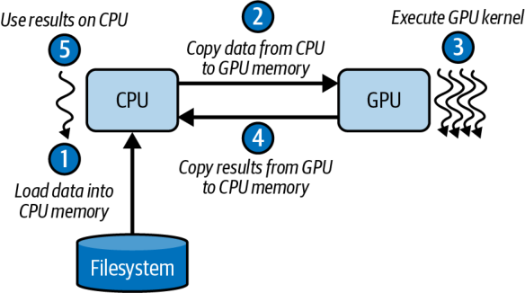


Initially, the host loads data into CPU memory. It then copies the data from the CPU to the GPU memory. After calling the GPU kernel with the data in GPU memory, the CPU copies the results back from GPU memory to CPU memory. Now the results live back on the CPU for further processing.

最初，主机（host）将数据加载到 CPU 内存中。然后它把数据从 CPU 复制到 GPU 内存。在用 GPU 内存中的数据调用 GPU 核函数（kernel）之后，CPU 再把结果从 GPU 内存复制回 CPU 内存。此时结果又回到 CPU 上，供进一步处理。

GPUs rely on massive parallelism to hide data-transfer latency such as the CPU-GPU data transfer described in Figure 6-1. Each GPU comprises many SMs, which are roughly analogous to CPU cores but streamlined for parallelism. Each SM can track up to 64 warps (32‐thread groups) on Blackwell.

GPU 依靠大规模并行来隐藏诸如图 6-1 中描述的 CPU-GPU 数据传输之类的数据传输延迟。每个 GPU 由许多 SM 组成，它们大致类似于 CPU 核心，但为并行做了精简。在 Blackwell 上，每个 SM 最多可以跟踪 64 个 warp（32 线程一组）。

Each GPU includes many SMs—similar to CPU cores but optimized for throughput. On modern GPUs, each SM tracks up to 64 warps (2,048 threads) concurrently. Blackwell GPUs feature 64K 32-bit registers per SM (256 KB total) and a combined 256 KB L1 cache/shared memory per SM. Up to 228 KB (227 KB usable) of that SRAM can be configured as user-managed shared memory per SM. Any single thread block can request up to 227 KB of dynamic shared memory (1 KB is of the 228 KB is reserved by CUDA). These help the SMs support the GPU’s high amount of thread-level parallelism.

每个 GPU 都包含许多 SM——类似于 CPU 核心，但为吞吐做了优化。在现代 GPU 上，每个 SM 最多可并发跟踪 64 个 warp（2,048 个线程）。Blackwell GPU 每个 SM 拥有 64K 个 32 位寄存器（共 256 KB），以及每个 SM 合计 256 KB 的 L1 缓存/共享内存。这块 SRAM 中最多可有 228 KB（227 KB 可用）被配置为每个 SM 由用户管理的共享内存。任何单个线程块最多可以请求 227 KB 的动态共享内存（228 KB 中有 1 KB 由 CUDA 保留）。这些都有助于 SM 支撑 GPU 高度的线程级并行。

Within a Blackwell SM, multiple warp schedulers issue instructions to the available pipelines; four independent warp schedulers allow up to four warps to issue instructions to the available pipelines on every cycle. Furthermore, each scheduler supports dual-issue capable of issuing two independent instructions (e.g., one arithmetic and one memory operation) per warp. Note that the dual-issue must come from the same warp—and not across warps.

在一个 Blackwell SM 内部，多个 warp 调度器（warp scheduler）向可用流水线发射指令；四个独立的 warp 调度器允许每个周期最多有四个 warp 向可用流水线发射指令。此外，每个调度器都支持双发射（dual-issue），能够为每个 warp 发射两条独立指令（例如一条算术运算和一条内存操作）。注意，双发射必须来自同一个 warp——而不能跨 warp。

In the best case, one warp from each scheduler can issue an instruction concurrently each cycle, allowing four warps to execute in parallel per cycle. This further boosts throughput when instruction mixing is utilized, as shown in Figure 6-2.

在最好的情况下，每个调度器在每个周期都能有一个 warp 并发发射一条指令，从而允许每个周期有四个 warp 并行执行。当利用指令混合时，这会进一步提升吞吐，如图 6-2 所示。

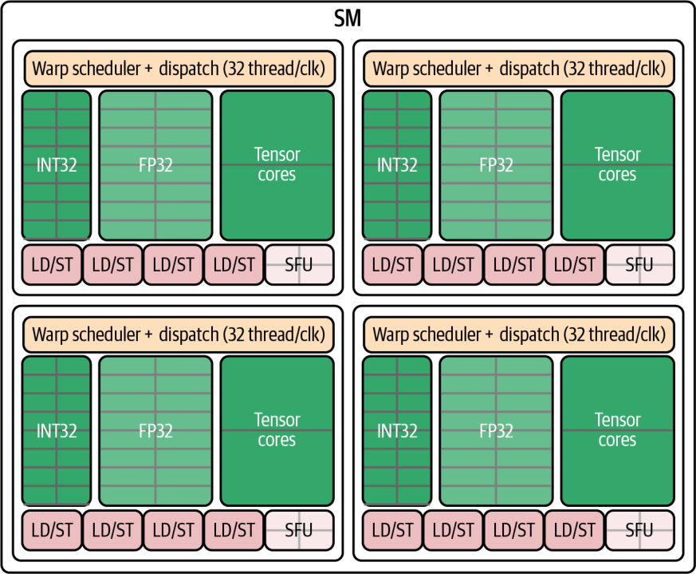


Here, each SM is subdivided into four independent scheduling partitions—each with its own warp scheduler and dispatch logic. You can think of the SM as four “mini-SMs” sharing on-chip resources. This lets the hardware pick ready warps and issue instructions from up to four different warps each clock cycle.

在这里，每个 SM 被细分为四个独立的调度分区——每个分区都有自己的 warp 调度器和分派逻辑。你可以把 SM 想象成共享片上资源的四个“迷你 SM”。这让硬件能够挑选就绪的 warp，并在每个时钟周期从多达四个不同的 warp 发射指令。

Within each of the four “mini-SM” partitions, the scheduler can issue two instructions per cycle from the same warp: one arithmetic instruction (e.g., INT32, FP32, or Tensor Core) and one memory instruction (a load or store). This is why the scheduler is called *dual-issue*. Table 6-1 summarizes these numbers.

在这四个“迷你 SM”分区中的每一个内部，调度器每周期都能从同一个 warp 发射两条指令：一条算术指令（例如 INT32、FP32 或 Tensor Core）和一条内存指令（一次加载或存储）。这正是该调度器被称为*双发射*的原因。表 6-1 汇总了这些数字。

*Table 6-1. Key SM scheduler and instruction-issue limits (per clock cycle)*

*表 6-1. 关键的 SM 调度器与指令发射上限（每个时钟周期）*

| Metric | Value |
| --- | --- |
| Number of schedulers | Four |
| Maximum warps issued | Four (one per scheduler) |
| Maximum math operations | Four (one per scheduler’s arithmetic issue) |
| Maximum memory operations | Four (one per scheduler’s load/store issue) |

| 指标 | 数值 |
| --- | --- |
| 调度器数量 | 四个 |
| 最多发射的 warp 数 | 四个（每个调度器一个） |
| 最多算术运算数 | 四个（每个调度器的算术发射一个） |
| 最多内存操作数 | 四个（每个调度器的加载/存储发射一个） |

> Note: The numeric values in all metrics tables are illustrative to explain the concepts. For actual benchmark results on different GPU architectures, see the GitHub repository.

> 注：所有指标表格中的数值均为示意性质，用于解释概念。关于不同 GPU 架构上的实际基准测试结果，请参见 GitHub 代码仓库。

So in the best case you could dual-issue four math and four memory instructions across four warps every cycle. This would maximize both compute and memory throughput simultaneously. These numbers are a result of the SM’s four-way partitioning—as well as its ability to pick one warp per partition and issue two orthogonal instructions each cycle.

因此在最好的情况下，你可以在每个周期跨四个 warp 双发射四条算术指令和四条内存指令。这将同时最大化计算与内存吞吐。这些数字既源于 SM 的四路分区，也源于它能够为每个分区挑选一个 warp 并在每个周期发射两条正交指令的能力。

The Special Function Unit (SFU) sits alongside the INT32, FP32, and Tensor Core pipelines. They handle transcendental operations (e.g., sine, cosine, reciprocal, square root). However, they are not part of the dual-issue math and memory pair. SFUs use a dedicated SFU pipeline that runs independently of the main INT32/FP32 and load/store (LD/ST) pipelines.

特殊功能单元（Special Function Unit，SFU）与 INT32、FP32 和 Tensor Core 流水线并列存在。它们处理超越函数运算（例如正弦、余弦、倒数、平方根）。不过，它们并不属于双发射的算术与内存指令对。SFU 使用专用的 SFU 流水线，独立于主 INT32/FP32 和加载/存储（load/store，LD/ST）流水线运行。

Because SFUs occupy a separate pipeline and can execute in parallel when needed, the SM can continue issuing math and memory instructions without waiting for the slower functions to complete. This separation increases instruction‐level parallelism and overall throughput even further for mixed‐operation kernels. They keep complex math operations from stalling the core compute and memory pipelines.

由于 SFU 占用独立的流水线，并可在需要时并行执行，SM 能够继续发射算术和内存指令，而无需等待较慢的函数完成。这种分离进一步提升了指令级并行，并为混合运算的核函数带来更高的整体吞吐。它们让复杂的数学运算不至于拖住核心的计算和内存流水线。

Because there are four schedulers—and each can typically issue one warp instruction per cycle—up to four warps can make forward progress each cycle when there is sufficient independent work and issue-pairing. For instance, the memory operations can flow through the SM’s combined 16 load/store (LD/ST) pipelines (four LD/ST pipelines per scheduler). These will read or write data to L1/shared memory, L2 cache, or global memory (covered in an upcoming section).

因为有四个调度器——且每个调度器通常每周期能发射一条 warp 指令——所以当存在足够的独立工作和发射配对时，每个周期最多可有四个 warp 向前推进。例如，内存操作可以流经 SM 合计 16 条加载/存储（LD/ST）流水线（每个调度器四条 LD/ST 流水线）。这些流水线会向 L1/共享内存、L2 缓存或全局内存（在接下来的小节中讨论）读取或写入数据。

> Exact LD/ST pipeline counts and pairings are not guaranteed. Rely on profiling counters to determine whether your kernel is limited by memory issue or compute issue. And consult the NVIDIA documentation for specifics of your architecture. The Blackwell tuning guide is a good place to start.

> 确切的 LD/ST 流水线数量与配对并不保证如此。请依靠性能剖析计数器来判断你的核函数是受限于内存发射还是计算发射。并参阅 NVIDIA 文档以了解你所用架构的具体细节。Blackwell 调优指南是一个不错的起点。

In short, GPUs excel at data-parallel workloads, including large matrix multiplies, convolutions, and other operations where the same instruction applies to many elements. Developers write kernels directly in CUDA C++ or indirectly through high-level frameworks like PyTorch and domain-specific, Python-based GPU languages like OpenAI’s Triton.

简而言之，GPU 擅长数据并行工作负载，包括大型矩阵乘法、卷积以及其他同一条指令作用于许多元素的运算。开发者可以直接用 CUDA C++ 编写核函数，或间接通过 PyTorch 这样的高层框架，以及像 OpenAI Triton 这样基于 Python 的领域专用 GPU 语言来编写。

Before diving into kernel development and memory-access optimizations, let’s review the CUDA thread hierarchy and key terminology that underpins all of these practices.

在深入核函数开发和内存访问优化之前，我们先回顾一下支撑所有这些实践的 CUDA 线程层级和关键术语。

### Threads, Warps, Blocks, and Grids

### 线程、warp、线程块与网格

CUDA structures parallel work into a three-level hierarchy—threads, thread blocks (aka *cooperative thread arrays* [CTAs]), and grids—to balance programmability with massive throughput. At the lowest level, each thread executes your kernel code. You group threads into thread blocks of up to 1,024 threads each on modern GPUs. Thread blocks form a grid when you launch the kernel, as seen in Figure 6-3.

CUDA 将并行工作组织成三级层级——线程、线程块（又称*协作线程阵列*〔cooperative thread array，CTA〕）和网格——以在可编程性与大规模吞吐之间取得平衡。在最底层，每个线程执行你的核函数代码。在现代 GPU 上，你把线程分组为最多各 1,024 个线程的线程块。当你启动核函数时，线程块组成一个网格，如图 6-3 所示。

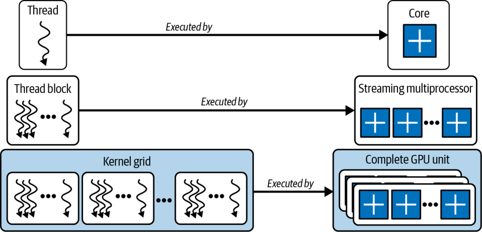


By sizing your grid appropriately, you can scale to millions of threads without changing your kernel logic. CUDA’s runtime (and frameworks like PyTorch) handle scheduling and distribution across all SMs. Figure 6-4 shows another view of the thread hierarchy, including the CPU-based host, which invokes a CUDA kernel running on the GPU device.

通过合理设定网格大小，你可以在不改变核函数逻辑的情况下扩展到数百万个线程。CUDA 的运行时（以及 PyTorch 这样的框架）会处理跨所有 SM 的调度与分发。图 6-4 展示了线程层级的另一个视角，包括基于 CPU 的主机——它调用运行在 GPU 设备上的 CUDA 核函数。

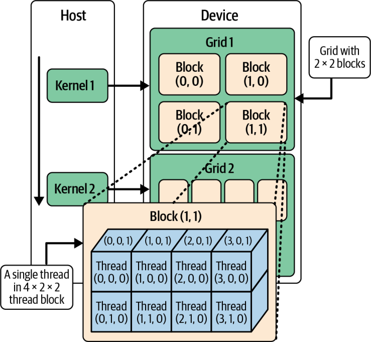


Traditionally, threads from different thread blocks could not work with one another directly. However, modern GPU architectures and CUDA versions support thread block clusters. Threadblock clusters are groups of thread blocks that can communicate with one another across SMs.

传统上，来自不同线程块的线程无法彼此直接协作。然而，现代 GPU 架构和 CUDA 版本支持线程块簇（thread block cluster）。线程块簇是一组能够跨 SM 相互通信的线程块。

Specifically, within a thread block cluster, threads in different thread blocks can access one another’s shared memory and use hardware-supported, cluster-scoped barriers. These allow for much larger compute operations, including matrix multiplies, which are very common in today’s massive LLM workloads. Thread block clusters share a distributed shared-memory (DSMEM) address space between SMs that participate in the thread block cluster, as shown in Figure 6-5.

具体来说，在一个线程块簇内，不同线程块中的线程可以访问彼此的共享内存，并使用硬件支持的、簇作用域的屏障（barrier）。这些能力允许进行更大规模的计算运算，包括矩阵乘法——它在当今庞大的 LLM 工作负载中非常常见。线程块簇在参与该簇的各个 SM 之间共享一个分布式共享内存（distributed shared memory，DSMEM）地址空间，如图 6-5 所示。

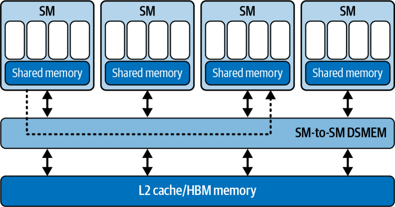


DSMEM is a hardware feature that links the shared-memory banks of all SMs into a thread block cluster over a fast on-chip interconnect. With DSMEM, the SMs share a combined multi-SM distributed shared-memory pool. This unification allows threads in different blocks to read, write, and atomically update one another’s shared buffers at on-chip speeds—and without using global memory bandwidth.

DSMEM 是一项硬件特性，它通过快速的片上互连将一个线程块簇内所有 SM 的共享内存 bank 连接起来。借助 DSMEM，这些 SM 共享一个合并的多 SM 分布式共享内存池。这种统一让不同块中的线程能够以片上速度读取、写入并原子更新彼此的共享缓冲区——而且无需占用全局内存带宽。

> We’ll cover advanced topics like thread block clusters and DSMEM in Chapter 10. These are an extremely important addition to modern GPU processing—and very important for an AI systems performance engineer to understand. For this chapter, our focus remains on intrablock shared-memory optimizations.

> 我们将在第 10 章讨论线程块簇和 DSMEM 等高级主题。它们是现代 GPU 处理中极其重要的新增能力——对于 AI 系统性能工程师而言也非常重要，需要理解。就本章而言，我们的重点仍然放在块内共享内存优化上。

Within each thread block, threads share data using low-latency on-chip shared memory and synchronize with __syncthreads(). Because each barrier incurs overhead, you should minimize synchronization points, as shown in Figure 6-6.

在每个线程块内部，线程使用低延迟的片上共享内存来共享数据，并用 __syncthreads() 进行同步。由于每次屏障都会带来开销，你应尽量减少同步点，如图 6-6 所示。

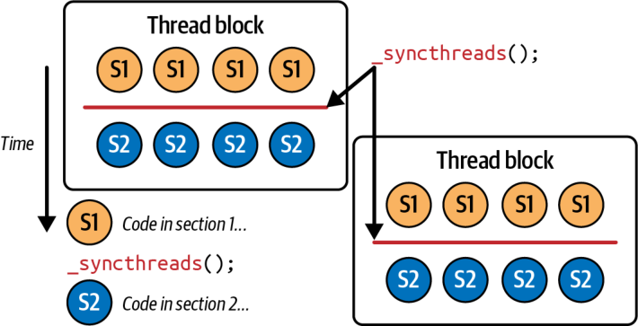


The goal is to minimize synchronization points. However, the GPU hardware will attempt to hide long-latency events such as global-memory loads, cache fills, and pipeline stalls by rapidly switching among warps.

目标是尽量减少同步点。不过，GPU 硬件会通过在多个 warp 之间快速切换，尝试隐藏诸如全局内存加载、缓存填充和流水线停顿等长延迟事件。

Thread blocks are subdivided into warps of 32 threads that execute in lockstep under the SIMT model using a warp scheduler. This is shown in Figure 6-7.

线程块被细分为 32 个线程的 warp，它们在 SIMT 模型下由 warp 调度器管理并以锁步（lockstep）方式执行。如图 6-7 所示。

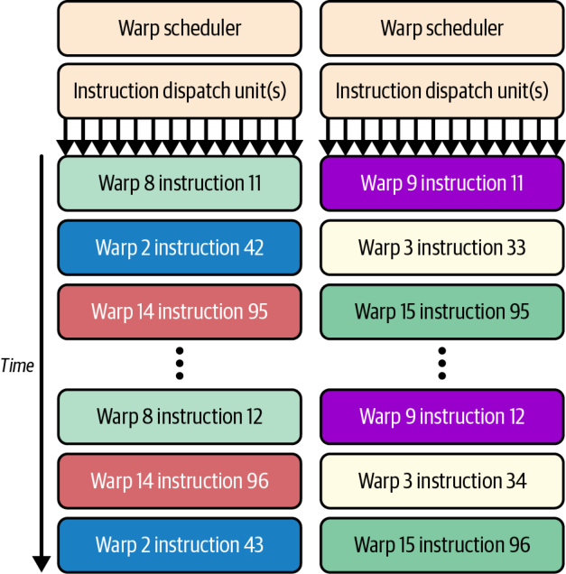


Keeping more warps in flight is known as *high occupancy* on the SM. When your CUDA code allows high occupancy, it means that when one warp stalls, another is ready to run. This keeps the GPU’s compute units busy.

在 SM 上保持更多 warp 处于运行中，被称为*高占用率*。当你的 CUDA 代码能够实现高占用率时，就意味着当一个 warp 停顿时，另一个 warp 已准备好运行。这让 GPU 的计算单元保持忙碌。

However, high occupancy must be balanced against per-thread resource limits, such as registers and shared memory. Spilling registers to slower memory can create new stalls. Profiling occupancy alongside register and shared-memory usage helps you choose a block size that maximizes throughput without triggering resource contention.

然而，高占用率必须与每线程资源上限（如寄存器和共享内存）相权衡。将寄存器溢出（register spilling）到较慢的内存中会造成新的停顿。在剖析占用率的同时也剖析寄存器和共享内存的使用情况，有助于你选择既能最大化吞吐、又不会触发资源争用的块大小。

> We will cover occupancy tuning in Chapter 8, but it’s a key concept to understand in the context of SMs, warps, threads, etc.

> 我们将在第 8 章讨论占用率调优，但在 SM、warp、线程等语境下，它是一个需要理解的关键概念。

Thread blocks execute independently and in no guaranteed order. This allows the GPU scheduler to dispatch them across all SMs and fully exploit hardware parallelism. This grid–block–warp hierarchy guarantees that your CUDA kernels will run unmodified on future GPU architectures with more SMs and threads.

线程块相互独立执行，且没有保证的执行顺序。这让 GPU 调度器能够将它们分派到所有 SM 上，充分利用硬件并行。这种网格—块—warp 层级保证了你的 CUDA 核函数无需修改即可运行在拥有更多 SM 和线程的未来 GPU 架构上。

Throughput also hinges on warp execution efficiency. Threads in a warp must follow the same control-flow path and perform coalesced memory accesses. If some threads diverge such that one branch takes the if path and others take the else path, the warp serializes execution, processing each branch path sequentially. This is called *warp divergence*, and it’s shown in Figure 6-8.

吞吐还取决于 warp 的执行效率。同一个 warp 中的线程必须遵循相同的控制流路径并执行合并访问（coalesced access）的内存访问。如果某些线程发生分歧，使得一个分支走 if 路径而其他线程走 else 路径，那么该 warp 会串行化执行，逐一顺序处理每条分支路径。这被称为*warp 分歧*（warp divergence），如图 6-8 所示。

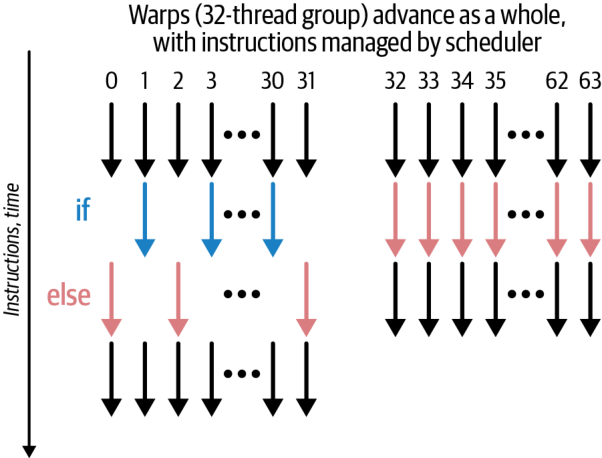


By masking inactive lanes and running extra passes to cover each branch, warp divergence multiplies the overall execution time by the number of branches. We’ll dive deeper into warp divergence in Chapter 8—as well as ways to detect, profile, and mitigate it.

通过屏蔽非活跃的 lane 并运行额外的遍历来覆盖每条分支，warp 分歧会把整体执行时间乘以分支的数量。我们将在第 8 章更深入地探讨 warp 分歧——以及检测、剖析和缓解它的方法。

> Divergence is an issue only for threads within a single warp. Different warps can follow different branches with no performance penalty.

> 分歧只对单个 warp 内部的线程构成问题。不同的 warp 可以走不同的分支，而不会有性能损失。

### Choosing Threads-per-Block and Blocks-per-Grid Sizes

### 选择每块线程数与每网格块数

A critical aspect of GPU performance is choosing a thread block size that aligns with the hardware’s 32-thread warp size. As such, you typically pick thread block sizes that are exact multiples of 32. For example, a 256-thread block (8 warps = 256 ÷ 32) fully occupies each warp, whereas a 33-thread block will require two warp slots and use only 1/32 of the second warp’s lanes. This wastes parallelism opportunities since every warp occupies a scheduler slot whether it’s actively running 32 threads or just 1 thread.

GPU 性能的一个关键方面是选择一个与硬件 32 线程 warp 大小对齐的线程块大小。因此，你通常会挑选恰好是 32 的整数倍的线程块大小。例如，一个 256 线程的块（8 个 warp = 256 ÷ 32）能完全占满每个 warp，而一个 33 线程的块则需要两个 warp 槽，且只用到第二个 warp 中 1/32 的 lane。这会浪费并行机会，因为无论一个 warp 是在活跃运行 32 个线程还是仅 1 个线程，它都会占用一个调度器槽。

Additionally, different GPU generations have different hardware limits, including maximum threads per SM and the number of registers per SM. This naturally limits the size of our blocks if we want to maintain good performance. For instance, too large a block might require too many registers, which will cause *register spilling* and decrease the kernel’s performance.

此外，不同的 GPU 世代有不同的硬件上限，包括每个 SM 的最大线程数和每个 SM 的寄存器数量。如果我们想保持良好性能，这自然会限制块的大小。例如，块太大可能需要太多寄存器，从而导致*寄存器溢出*并降低核函数的性能。

A large block might also require too much shared memory, which is finite in GPU hardware. Specifically, Blackwell provides only 228 KB (227 KB usable) per SM of shared memory addressable by all resident thread blocks running on the SM.

大块也可能需要太多共享内存，而共享内存在 GPU 硬件中是有限的。具体来说，Blackwell 每个 SM 仅提供 228 KB（227 KB 可用）的共享内存，供运行在该 SM 上的所有驻留线程块寻址。

These hardware limits affect how many blocks/warps can be active on an SM at once. This is a measurement of occupancy, as we introduced earlier. Smaller blocks might enable higher occupancy if they allow more concurrent warps to run concurrently on the SM.

这些硬件上限会影响一个 SM 上同时能激活多少个块/warp。这正是我们前面介绍过的占用率的度量。如果较小的块能让更多并发 warp 在 SM 上同时运行，它们可能带来更高的占用率。

It’s important to understand the relative scale and hardware thread limits for your GPU generation, including number of threads, thread blocks, warps, and SMs. Figure 6-9 shows the relative scale of these resources, including their limits.

理解你所用 GPU 世代的相对规模和硬件线程上限很重要，包括线程、线程块、warp 和 SM 的数量。图 6-9 展示了这些资源的相对规模，包括它们的上限。

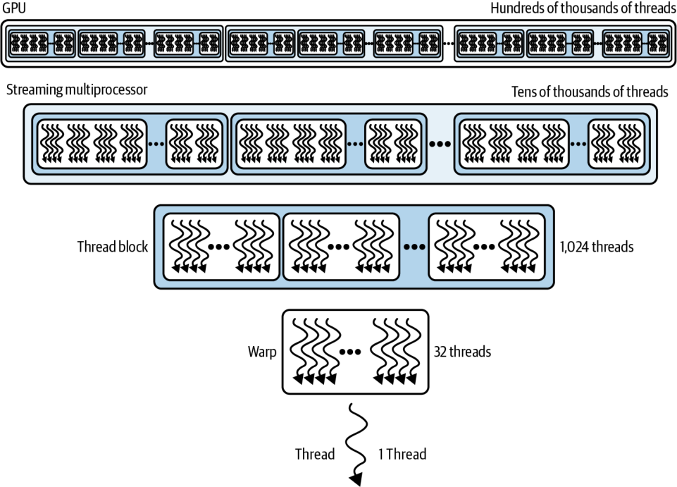


Table 6-2 summarizes these GPU limits for the Blackwell B200 GPU. The rest of the limits are available on NVIDIA’s website. (Other GPU generations will have different limits, so be sure to check the exact specifications for your system.)

表 6-2 汇总了 Blackwell B200 GPU 的这些上限。其余上限可在 NVIDIA 网站上查到。（其他 GPU 世代会有不同的上限，因此务必核对你系统的确切规格。）

*Table 6-2. Thread-level and block-level limits (Blackwell B200)*

*表 6-2. 线程级与块级上限（Blackwell B200）*

| Resource | Hardware limit | Notes |
| --- | --- | --- |
| Warp size | 32 threads | The fundamental SIMT execution unit is 32 threads (a warp). Always use a multiple of 32 to avoid waste. |
| Maximum threads per thread block | 1,024 threads | blockDim.x * blockDim.y * blockDim.z ≤ 1024. |
| Maximum warps per thread block | 32 warps | (1,024 threads ÷ 32 threads-per-warp) = 32 warps max per block. |

| 资源 | 硬件上限 | 说明 |
| --- | --- | --- |
| warp 大小 | 32 线程 | 基本的 SIMT 执行单元是 32 个线程（一个 warp）。始终使用 32 的整数倍以避免浪费。 |
| 每个线程块的最大线程数 | 1,024 线程 | blockDim.x * blockDim.y * blockDim.z ≤ 1024。 |
| 每个线程块的最大 warp 数 | 32 warp | （1,024 线程 ÷ 每个 warp 32 线程）= 每块最多 32 个 warp。 |

We already discussed the warp size limit of 32 threads, which encourages us to choose block dimensions that are multiples of 32 threads to create “full warps” and avoid underutilized warps. Note that each block can have up to 1,024 threads and, correspondingly, a block can contain only 32 warps. These limits affect your occupancy since, once a block is scheduled, each SM can host a limited number of warps and blocks simultaneously.

我们已经讨论过 32 线程的 warp 大小上限，它促使我们选择 32 线程整数倍的块维度，以构成“完整 warp”并避免利用不足的 warp。注意，每个块最多可有 1,024 个线程，相应地，一个块只能包含 32 个 warp。这些上限会影响你的占用率，因为一旦一个块被调度，每个 SM 只能同时容纳有限数量的 warp 和块。

Additionally, there are per-SM limits, or *SM-resident limits* as they are commonly called, for the different GPU generations. These SM-resident Blackwell limits are summarized in Table 6-3.

此外，针对不同的 GPU 世代，还存在每 SM 的上限，或常被称为 *SM 驻留上限*。这些 Blackwell 的 SM 驻留上限汇总在表 6-3 中。

*Table 6-3. SM-resident resource limits (Blackwell B200)*

*表 6-3. SM 驻留资源上限（Blackwell B200）*

| Resource (per SM) | Hardware limit | Notes |
| --- | --- | --- |
| Maximum resident warps per SM | 64 warps | Hardware can keep up to 64 warps in flight (64 × 32 threads = 2,048 threads). Note: This limit has held for many generations and remains true for Blackwell. |
| Maximum resident threads per SM | 2,048 threads | Equals 64 warps × 32 threads/warp. If each block uses 1,024 threads, then at most 2 such blocks (64 warps) can reside on one SM concurrently. Using smaller blocks (e.g., 256 threads) allows more blocks to reside on the SM (up to 8 blocks × 256 = 2,048 threads), which can increase occupancy and help hide latency—though too many tiny blocks can add scheduling overhead. |
| Maximum active blocks per SM | 32 blocks | At most, 32 thread blocks can be simultaneously resident on one SM (if blocks are smaller, more can fit up to this limit). |

| 资源（每 SM） | 硬件上限 | 说明 |
| --- | --- | --- |
| 每 SM 最大驻留 warp 数 | 64 warp | 硬件最多可保持 64 个 warp 在运行中（64 × 32 线程 = 2,048 线程）。注：这一上限已经历多个世代保持不变，在 Blackwell 上依然成立。 |
| 每 SM 最大驻留线程数 | 2,048 线程 | 等于 64 warp × 每 warp 32 线程。如果每个块使用 1,024 个线程，那么一个 SM 上最多可同时驻留 2 个这样的块（64 warp）。使用更小的块（例如 256 线程）可让更多块驻留在 SM 上（最多 8 块 × 256 = 2,048 线程），这能提升占用率并帮助隐藏延迟——不过过多的微小块会增加调度开销。 |
| 每 SM 最大活跃块数 | 32 块 | 一个 SM 上最多可同时驻留 32 个线程块（如果块更小，则在此上限内可容纳更多）。 |

Here, we see that the maximum number of concurrent warps per SM on Blackwell is 64. This hasn’t changed for recent GPU generations, so occupancy considerations carry over. Maximum active blocks on an SM is 32, and, correspondingly, maximum resident threads per SM is 2,048 threads. CUDA grids also have maximum dimensions, as shown in Table 6-4.

在这里，我们看到 Blackwell 上每 SM 的最大并发 warp 数为 64。这在近几代 GPU 中没有变化，因此占用率方面的考量得以延续。一个 SM 上的最大活跃块数为 32，相应地，每 SM 的最大驻留线程数为 2,048 线程。CUDA 网格也有最大维度，如表 6-4 所示。

*Table 6-4. CUDA grid limits*

*表 6-4. CUDA 网格上限*

| Grid dimension | Limit | Notes |
| --- | --- | --- |
| Maximum blocks in X, Y, or Z | X: 2,147,483,647 blocks; Y: 65,535 blocks; Z: 65,535 blocks | A 3D grid can be as large as 2,147,483,647 × 65,535 × 65,535 blocks. |
| Maximum concurrent grids (kernels) | 128 grids | Up to 128 kernels can execute concurrently on one device (i.e., 128 grids resident at once). |

| 网格维度 | 上限 | 说明 |
| --- | --- | --- |
| X、Y 或 Z 方向的最大块数 | X：2,147,483,647 块；Y：65,535 块；Z：65,535 块 | 一个 3D 网格最大可达 2,147,483,647 × 65,535 × 65,535 块。 |
| 最大并发网格（核函数）数 | 128 网格 | 一个设备上最多可并发执行 128 个核函数（即同时驻留 128 个网格）。 |

While it’s good to know the theoretical grid limits, you will typically be bound by the thread/block/per-SM limits shown previously. If you ever need more than 65,535 blocks in one dimension, you can launch a 2D or 3D grid to split your work across multiple kernel launches (multilaunch). We show an example of this in a later section. In practice, it’s rare to hit the grid size limit before hitting other resource limits.

虽然了解理论上的网格上限是好事，但你通常会先受制于前面展示的线程/块/每 SM 上限。如果你确实需要在某一维度上超过 65,535 个块，可以启动一个 2D 或 3D 网格，将工作拆分到多次核函数启动（多次启动，multilaunch）中。我们会在后面的小节中给出这样的示例。实际上，很少会在触及其他资源上限之前先触及网格大小上限。

### CUDA GPU Backward and Forward Compatibility Model

### CUDA GPU 向后与向前兼容模型

One of CUDA’s core strengths is its forward and backward compatibility model. Kernels compiled today will generally run unmodified on future GPU generations—as long as you include PTX in your binary for forward compatibility. If you ship only SASS for a single architecture (e.g., sm_90 for Hopper or sm_100 for Blackwell) without PTX, that binary will not forward-run on newer architectures. Family-specific targets such as sm_100f or compute_100f restrict portability to devices in the same feature family. It’s best to ship a fatbin that includes both generic cubin/PTX and family-specific cubins needed (e.g., optimizations, etc.).

CUDA 的核心优势之一是它的向前与向后兼容模型。只要你在二进制文件中包含 PTX 以实现向前兼容，今天编译的核函数通常无需修改即可运行在未来的 GPU 世代上。如果你只针对单个架构发布 SASS（例如面向 Hopper 的 sm_90 或面向 Blackwell 的 sm_100）而不带 PTX，那么该二进制文件将无法在更新的架构上向前运行。像 sm_100f 或 compute_100f 这样的家族特定目标会将可移植性限制在同一特性家族的设备内。最佳做法是发布一个既包含通用 cubin/PTX、又包含所需家族特定 cubin（例如各种优化等）的 fatbin。

You can verify compatibility by forcing PTX JIT compilation at load time by setting CUDA_FORCE_PTX_JIT=1 to JIT-compile the PTX and cache the result. If your binary lacks PTX, the kernel launch will fail. This forces you to rebuild with PTX support. This compatibility model is fundamental to the large CUDA ecosystem. It lets you target both legacy and cutting-edge hardware from a single codebase.

你可以通过在加载时强制进行 PTX JIT 编译来验证兼容性——设置 CUDA_FORCE_PTX_JIT=1 来即时编译 PTX 并缓存结果。如果你的二进制文件缺少 PTX，核函数启动将会失败。这会迫使你带上 PTX 支持重新构建。这种兼容模型是庞大 CUDA 生态系统的根基。它让你能从单一代码库同时面向旧硬件和最前沿硬件。

> To truly maintain both backward and forward compatibility across current and future GPU generations, you should compile with generic targets—or explicitly include the PTX. When you need specific optimizations from newer hardware features, you can use generation-specific targets. When doing this, be sure to provide fallback paths for other architectures.

> 若要在当前与未来 GPU 世代之间真正保持向后与向前兼容，你应当使用通用目标进行编译——或显式包含 PTX。当你需要来自较新硬件特性的特定优化时，可以使用世代特定的目标。这样做时，务必为其他架构提供回退路径。

## CUDA Programming Refresher

## CUDA 编程复习

In CUDA C++, you define parallel work by writing kernels. These are special functions annotated with __global__ that execute on the GPU device. When you invoke a kernel from the CPU (host) code, you use the <<< >>> “chevron” syntax to specify how many threads should run—and how they’re organized—using two configuration parameters: blocksPerGrid for the number of thread blocks and threadsPerBlock for the number of threads within each block.

在 CUDA C++ 中，你通过编写核函数来定义并行工作。这些是用 __global__ 注解的特殊函数，运行在 GPU 设备上。当你从 CPU（主机）代码调用一个核函数时，你使用 <<< >>>（“chevron”/三尖括号）语法来指定应运行多少个线程——以及它们如何组织——需要两个配置参数：blocksPerGrid 表示线程块的数量，threadsPerBlock 表示每个块内的线程数量。

Here is a simple example that demonstrates the key components of a CUDA kernel and kernel launch. This kernel simply doubles every element in the input array in place so no additional memory is created—just the input array. Behind the scenes, CUDA compiles the __global__ function into GPU device code that can be executed by thousands or millions of lightweight threads in parallel:

下面是一个简单示例，展示了一个 CUDA 核函数及核函数启动的关键组成部分。这个核函数只是把输入数组中的每个元素就地加倍，因此不会创建额外的内存——只有输入数组本身。在幕后，CUDA 会把 __global__ 函数编译成 GPU 设备代码，可由数千或数百万个轻量级线程并行执行：

```
//-------------------------------------------------------
// Kernel: myKernel running on the device (GPU)
//   - input : device pointer to float array of length N
//   - N   : total number of elements in the input
//-------------------------------------------------------

__global__ void myKernel(float* input, int N) {
    // Compute a unique global thread index
    int idx = blockIdx.x * blockDim.x + threadIdx.x;

    // Only process valid elements
    if (idx < N) {
        input[idx] *= 2.0f;
    }
}

// This code runs on the host (CPU)
int main() {
    // 1) Problem size: one million floats
    const int N = 1'000'000;
    float *h_input = nullptr;
    float *d_input = nullptr;

    // 1) Allocate input float array of size N on host
    cudaMallocHost(&h_input, N * sizeof(float));

    // 2) Initialize host data (for example, all ones)
    for (int i = 0; i < N; ++i) {
        h_input[i] = 1.0f;
    }

    // 3) Allocate device memory for input on the device
    cudaMalloc(&d_input, N * sizeof(float));

    // 4) Copy data from the host to the device
    cudaMemcpy(d_input, h_input, N * sizeof(float),
      cudaMemcpyHostToDevice);

    // 5) Choose kernel launch parameters

    // Number of threads per block (multiple of 32)
    const int threadsPerBlock = 256;

    // Number of blocks per grid (3,907 for N = 1000000)
    const int blocksPerGrid = (N + threadsPerBlock - 1) /
      threadsPerBlock;

    // 6) Launch myKernel across blocksPerGrid blocks
    // Each block has threadsPerBlock number of threads
    // Pass a reference to the d_input device array
    myKernel<<<blocksPerGrid, threadsPerBlock>>>(d_input,
      N);
    // 7) Wait for the kernel to finish running on device
    cudaDeviceSynchronize();

    // 8) When finished, copy the results
    //    (stored in d_input) from the device back to
    //     host (stored in h_input)

    cudaMemcpy(h_input, d_input, N * sizeof(float),
               cudaMemcpyDeviceToHost);

    // Cleanup: Free memory on the device and host
    cudaFree(d_input);
    cudaFreeHost(h_input);

    // return 0 for success!
    return 0;
```

```
//-------------------------------------------------------
// Kernel: myKernel running on the device (GPU)
//   - input : device pointer to float array of length N
//   - N   : total number of elements in the input
//-------------------------------------------------------

__global__ void myKernel(float* input, int N) {
    // Compute a unique global thread index
    int idx = blockIdx.x * blockDim.x + threadIdx.x;

    // Only process valid elements
    if (idx < N) {
        input[idx] *= 2.0f;
    }
}

// This code runs on the host (CPU)
int main() {
    // 1) Problem size: one million floats
    const int N = 1'000'000;
    float *h_input = nullptr;
    float *d_input = nullptr;

    // 1) Allocate input float array of size N on host
    cudaMallocHost(&h_input, N * sizeof(float));

    // 2) Initialize host data (for example, all ones)
    for (int i = 0; i < N; ++i) {
        h_input[i] = 1.0f;
    }

    // 3) Allocate device memory for input on the device
    cudaMalloc(&d_input, N * sizeof(float));

    // 4) Copy data from the host to the device
    cudaMemcpy(d_input, h_input, N * sizeof(float),
      cudaMemcpyHostToDevice);

    // 5) Choose kernel launch parameters

    // Number of threads per block (multiple of 32)
    const int threadsPerBlock = 256;

    // Number of blocks per grid (3,907 for N = 1000000)
    const int blocksPerGrid = (N + threadsPerBlock - 1) /
      threadsPerBlock;

    // 6) Launch myKernel across blocksPerGrid blocks
    // Each block has threadsPerBlock number of threads
    // Pass a reference to the d_input device array
    myKernel<<<blocksPerGrid, threadsPerBlock>>>(d_input,
      N);
    // 7) Wait for the kernel to finish running on device
    cudaDeviceSynchronize();

    // 8) When finished, copy the results
    //    (stored in d_input) from the device back to
    //     host (stored in h_input)

    cudaMemcpy(h_input, d_input, N * sizeof(float),
               cudaMemcpyDeviceToHost);

    // Cleanup: Free memory on the device and host
    cudaFree(d_input);
    cudaFreeHost(h_input);

    // return 0 for success!
    return 0;
```

> This code is not fully optimized. We will optimize performance as we continue through the book. But this gives you a simple, complete template to start building your own CUDA kernels.

> 这段代码尚未完全优化。我们会在本书后续过程中不断优化性能。但它给了你一个简单、完整的模板，可用于开始构建你自己的 CUDA 核函数。

Here, we are passing kernel input arguments, d_input and N, which are accessible inside the kernel function for processing. The processing is shared, in parallel, across many threads. This is by design.

在这里，我们传入核函数的输入参数 d_input 和 N，它们在核函数内部可访问以供处理。处理工作会并行地分摊到许多线程上。这是有意为之的设计。

The full data flow is as follows:

完整的数据流如下：

1. Allocate memory on the host (h_input).

2. Copy data from the host (h_input) to device (d_input) using cudaMemcpy with cudaMemcpyHostToDevice.

3. Run the kernel on the device with d_input.

4. Synchronize to ensure the kernel has finished executing on the device.

5. Transfer the results (d_input) from device to host (h_input) using cudaMemcpy with cudaMemcpyDeviceToHost.

6. Clean up memory on the device and host with cudaFree and cudaFreeHost.

1. 在主机上分配内存（h_input）。

2. 使用带 cudaMemcpyHostToDevice 的 cudaMemcpy 将数据从主机（h_input）复制到设备（d_input）。

3. 用 d_input 在设备上运行核函数。

4. 进行同步，以确保核函数已在设备上执行完毕。

5. 使用带 cudaMemcpyDeviceToHost 的 cudaMemcpy 将结果（d_input）从设备传回主机（h_input）。

6. 用 cudaFree 和 cudaFreeHost 清理设备和主机上的内存。

You can pass additional, advanced, CUDA-specific parameters to your kernel at launch time with <<< >>>, including shared-memory size (and many others), but the two core launch parameters, blocksPerGrid and threadsPerBlock, are the foundation of any CUDA kernel invocation. In the next section, we will discuss how to best choose these launch parameter values.

你可以在启动时用 <<< >>> 向核函数传入额外的、高级的、CUDA 特有的参数，包括共享内存大小（以及许多其他参数），但两个核心启动参数 blocksPerGrid 和 threadsPerBlock 是任何 CUDA 核函数调用的基础。在下一节中，我们将讨论如何最好地选择这些启动参数的取值。

And you might be wondering why we have to pass N, the size of the input array. This seems redundant since the kernel should be able to inspect the size of the array. However, this is the core difference between a GPU CUDA kernel function and a typical CPU function: a CUDA kernel function is designed to work inside of a single thread, alongside thousands of other threads, on a partition of the input data. As such, N defines the size of the partition that this particular kernel will process.

你可能会疑惑，为什么我们必须传入输入数组的大小 N。这看起来是多余的，因为核函数应该能够检查数组的大小。然而，这正是 GPU CUDA 核函数与典型 CPU 函数之间的核心区别：CUDA 核函数被设计为运行在单个线程内部，与其他数千个线程一起，处理输入数据的一个分区。因此，N 定义了这个特定核函数将要处理的分区大小。

Combined with the built-in kernel variables blockDim (1 in this case since we’re passing a one-dimensional input array), blockIdx, and threadIdx, the kernel calculates the specific idx into the input array. This unique idx lets the kernel process every element of the input array cleanly and uniquely, in parallel, across many threads running across many different SMs simultaneously.

结合内置的核函数变量 blockDim（在本例中为 1，因为我们传入的是一维输入数组）、blockIdx 和 threadIdx，核函数计算出进入输入数组的具体 idx。这个唯一的 idx 让核函数能够干净且唯一地处理输入数组的每一个元素，并行地跨许多同时运行在许多不同 SM 上的线程进行。

Note the bounds check if (idx < N). This is needed to avoid out-of-range access (bounds check) since N may not be an exact multiple of the block size. For instance, consider a scenario in which the input array is size 63, so N = 63. The warp scheduler will likely assign two warps (32 threads each) to process the 63 elements in the input array.

注意其中的边界检查 if (idx < N)。之所以需要它，是为了避免越界访问（边界检查），因为 N 未必恰好是块大小的整数倍。例如，考虑这样一种情形：输入数组大小为 63，因此 N = 63。warp 调度器很可能会分配两个 warp（每个 32 线程）来处理输入数组中的 63 个元素。

The first warp will run 32 instances of the kernel simultaneously to process elements 0–31 and never exceed N = 63. That’s straightforward. The second warp, running in parallel with the first warp, will expect to process elements 32–64. However, it will stop when it reaches N = 63.

第一个 warp 会同时运行 32 个核函数实例来处理元素 0–31，绝不会超过 N = 63。这很直接。与第一个 warp 并行运行的第二个 warp，本会期望处理元素 32–64。然而，它会在到达 N = 63 时停止。

Without the if (idx < N) bounds check, the second warp will try to process idx = 64, and it will throw an illegal memory access error (e.g., cudaErrorIllegalAddress). The bounds check ensures that every thread either works on a valid input element or exits immediately if its idx is out of range.

如果没有 if (idx < N) 边界检查，第二个 warp 会尝试处理 idx = 64，并抛出非法内存访问错误（例如 cudaErrorIllegalAddress）。边界检查确保每个线程要么处理一个有效的输入元素，要么在其 idx 越界时立即退出。

CUDA kernels execute asynchronously on the device without per‐thread exceptions; instead, any illegal operation (out-of-bounds access, misaligned access, etc.) sets a global fault flag for the entire launch. The host driver only checks that flag when you next call a synchronization or another CUDA API function, so errors surface lazily (e.g., as cudaErrorIllegalAddress or a generic launch failure).

CUDA 核函数在设备上异步执行，且没有每线程的异常机制；相反，任何非法操作（越界访问、未对齐访问等）都会为整个启动设置一个全局故障标志。主机驱动只有在你下一次调用同步或另一个 CUDA API 函数时才检查该标志，因此错误是延迟浮现的（例如以 cudaErrorIllegalAddress 或一个通用的启动失败的形式）。

This design keeps the GPU’s pipelines and interconnects fully occupied but requires you to explicitly synchronize and poll for errors on the host—usually with cudaGetLastError() and cudaDeviceSynchronize() immediately after kernel launches. This way, you catch faults as soon as they occur.

这种设计让 GPU 的流水线和互连保持充分占用，但要求你在主机上显式同步并轮询错误——通常在核函数启动之后立即调用 cudaGetLastError() 和 cudaDeviceSynchronize()。这样，你就能在故障一发生时就将其捕获。

You will see a bounds check in a lot of CUDA kernels. If you don’t see it, you should understand why it’s not there. It’s likely there in some fashion—or the CUDA kernel developer can somehow guarantee the illegal memory access error will never happen.

你会在很多 CUDA 核函数中看到边界检查。如果你没看到它，就应该弄清楚它为什么不在那里。它很可能以某种形式存在——或者 CUDA 核函数开发者能够以某种方式保证非法内存访问错误永远不会发生。

And finally, we get to the actual kernel logic. After computing its unique index idx into the input array, this kernel (running separately on thousands of threads in parallel across many SMs) multiplies the value at index idx in the input array by 2. It then updates the value (in place) in the input array. In this specific kernel, no additional memory is needed except the temporary idx variable of type int.

最后，我们来到实际的核函数逻辑。在计算出进入输入数组的唯一索引 idx 之后，这个核函数（在许多 SM 上并行地运行在数千个线程上，各自独立）将输入数组中索引 idx 处的值乘以 2。然后它就地更新输入数组中的该值。在这个具体的核函数中，除了 int 类型的临时变量 idx 之外，不需要额外的内存。

### Configuring Launch Parameters: Blocks per Grid and Threads per Block

### 配置启动参数：每网格块数与每块线程数

As discussed earlier, using a block size that’s a multiple of the warp size (32) is critical. A threadsPerBlock size of 256 (eight warps) is a common starting point to balance occupancy and resource usage. This will help us avoid partially filled warps during kernel execution, hide latency, and balance SMs and other hardware resources:

如前所述，使用一个是 warp 大小（32）整数倍的块大小至关重要。256（8 个 warp）的 threadsPerBlock 大小是一个常见的起点，用以平衡占用率与资源使用。这会帮助我们在核函数执行期间避免部分填充的 warp、隐藏延迟，并平衡 SM 及其他硬件资源：

*Multiple of 32 threads*

*32 线程的整数倍*

Choosing a block size that is a multiple of 32 threads helps to avoid empty warp slots. Otherwise those underfilled warps occupy scarce scheduler resources— without contributing useful work.

选择一个是 32 线程整数倍的块大小，有助于避免空的 warp 槽。否则，那些填充不满的 warp 会占用稀缺的调度器资源——却不贡献有用的工作。

*Latency hiding*

*延迟隐藏*

Hundreds of threads per SM are needed to hide DRAM and instruction‐latency stalls. If you launch, say, eight blocks of 256 threads on an SM with 2,048 threads of capacity, you can keep the pipeline busy without oversubscribing.

需要每个 SM 有数百个线程来隐藏 DRAM 和指令延迟造成的停顿。如果你在一个容量为 2,048 线程的 SM 上启动，比如说，8 个各 256 线程的块，就能让流水线保持忙碌而不会过度订阅。

*Occupancy*

*占用率*

With 256 threadsPerBlock, for example, you need only eight warps per block. This tends to give good occupancy without running out of registers or shared memory per block.

例如，使用 256 的 threadsPerBlock，你每个块只需要 8 个 warp。这往往能带来良好的占用率，同时不会耗尽每个块的寄存器或共享内存。

> For modern GPUs like Blackwell, consider 256–512 threads per block to maximize occupancy while respecting register and shared-memory limits.

> 对于 Blackwell 这样的现代 GPU，可考虑每块 256–512 个线程，在遵守寄存器和共享内存上限的同时最大化占用率。

*Resource-balanced*

*资源均衡*

256 is small enough that you rarely exceed the 1,024-thread-per-block limit. And it’s large enough that you’re not leaving too many warps idle when threads in other warps stall.

256 足够小，你很少会超过每块 1,024 线程的上限。它又足够大，以至于当其他 warp 中的线程停顿时，你不会让太多 warp 空闲。

Starting with threadsPerBlock=256, you can tune up or down (128, 512, etc.) based on your kernel’s register and shared-memory requirements—as well as occupancy characteristics.

从 threadsPerBlock=256 开始，你可以根据核函数的寄存器和共享内存需求——以及占用率特征——向上或向下调整（128、512 等）。

For blocksPerGrid, you can base this on the number of N input elements and the value of threadsPerBlock. For instance, the blocksPerGrid is commonly set to (N + threadsPerBlock - 1) / threadsPerBlock to round up so that you cover all elements if N is not an exact multiple of threadsPerBlock. This is a common choice that guarantees every input element is covered by a thread. Here is the code that shows the calculation:

对于 blocksPerGrid，你可以基于 N 个输入元素的数量和 threadsPerBlock 的取值来确定它。例如，blocksPerGrid 通常被设为 (N + threadsPerBlock - 1) / threadsPerBlock 来向上取整，这样即使 N 不是 threadsPerBlock 的整数倍，你也能覆盖所有元素。这是一个常见选择，保证每个输入元素都被一个线程覆盖。下面的代码展示了这个计算：

```
//-------------------------------------------------------
// Kernel: myKernel running on the device (GPU)
//   - input : device pointer to float array of length N
//   - N   : total number of elements in the input
//-------------------------------------------------------
__global__ void myKernel(float* input, int N) {
    // Compute a unique global thread index
    int idx = blockIdx.x * blockDim.x + threadIdx.x;

    // Only process valid elements
    if (idx < N) {
        input[idx] *= 2.0f;
    }
}

// This code runs on the host (CPU)
int main() {
    // 1) Problem size: one million floats
    const int N = 1'000'000;

    float* h_input = nullptr;
    cudaMallocHost(&h_input, N * sizeof(float));

    // Initialize host data (for example, all ones)
    for (int i = 0; i < N; ++i) {
        h_input[i] = 1.0f;
    }

    // Allocate device memory for input on the device (d_)
    float* d_input = nullptr;
    cudaMalloc(&d_input, N * sizeof(float));

    // Copy data from the host to the device using cudaMemcpyHostToDevice
    cudaMemcpy(d_input, h_input, N * sizeof(float),
      cudaMemcpyHostToDevice);

    // 2) Tune launch parameters
    const int threadsPerBlock = 256; // multiple of 32
    const int blocksPerGrid = (N + threadsPerBlock - 1) /
      threadsPerBlock; // 3,907, in this case

    // Launch myKernel across blocksPerGrid number of blocks
    // Each block has threadsPerBlock number of threads
    // Pass a reference to the d_input device array
    myKernel<<<blocksPerGrid, threadsPerBlock>>>(d_input, N);
    // Wait for the kernel to finish running on the device
    cudaDeviceSynchronize();

    // When finished, copy results (stored in d_input) from device to host
    // (stored in h_input) using cudaMemcpyDeviceToHost
    cudaMemcpy(h_input, d_input, N * sizeof(float), cudaMemcpyDeviceToHost);

    // Cleanup: Free memory on the device and host
    cudaFree(d_input);
    cudaFreeHost(h_input);

    return 0; // return 0 for success!
```

```
//-------------------------------------------------------
// Kernel: myKernel running on the device (GPU)
//   - input : device pointer to float array of length N
//   - N   : total number of elements in the input
//-------------------------------------------------------
__global__ void myKernel(float* input, int N) {
    // Compute a unique global thread index
    int idx = blockIdx.x * blockDim.x + threadIdx.x;

    // Only process valid elements
    if (idx < N) {
        input[idx] *= 2.0f;
    }
}

// This code runs on the host (CPU)
int main() {
    // 1) Problem size: one million floats
    const int N = 1'000'000;

    float* h_input = nullptr;
    cudaMallocHost(&h_input, N * sizeof(float));

    // Initialize host data (for example, all ones)
    for (int i = 0; i < N; ++i) {
        h_input[i] = 1.0f;
    }

    // Allocate device memory for input on the device (d_)
    float* d_input = nullptr;
    cudaMalloc(&d_input, N * sizeof(float));

    // Copy data from the host to the device using cudaMemcpyHostToDevice
    cudaMemcpy(d_input, h_input, N * sizeof(float),
      cudaMemcpyHostToDevice);

    // 2) Tune launch parameters
    const int threadsPerBlock = 256; // multiple of 32
    const int blocksPerGrid = (N + threadsPerBlock - 1) /
      threadsPerBlock; // 3,907, in this case

    // Launch myKernel across blocksPerGrid number of blocks
    // Each block has threadsPerBlock number of threads
    // Pass a reference to the d_input device array
    myKernel<<<blocksPerGrid, threadsPerBlock>>>(d_input, N);
    // Wait for the kernel to finish running on the device
    cudaDeviceSynchronize();

    // When finished, copy results (stored in d_input) from device to host
    // (stored in h_input) using cudaMemcpyDeviceToHost
    cudaMemcpy(h_input, d_input, N * sizeof(float), cudaMemcpyDeviceToHost);

    // Cleanup: Free memory on the device and host
    cudaFree(d_input);
    cudaFreeHost(h_input);

    return 0; // return 0 for success!
```

This is the same kernel as previously but calculates the blocksPerGrid and threadsPerBlock dynamically based on the size of N. Note the familiar if (idx < N) bounds check. This ensures that any “extra” threads in the final block that fall outside of N will simply do nothing—and not cause an illegal memory address error. Next, let’s explore multidimensional inputs like 2D images and 3D volumes.

这与前面是同一个核函数，但会基于 N 的大小动态计算 blocksPerGrid 和 threadsPerBlock。注意那个熟悉的 if (idx < N) 边界检查。它确保最后一个块中任何落在 N 之外的“多余”线程只会什么都不做——而不会引发非法内存地址错误。接下来，让我们探讨像 2D 图像和 3D 体数据这样的多维输入。

### 2D and 3D Kernel Inputs

### 2D 与 3D 核函数输入

When your input data naturally lives in two dimensions (e.g., images), you can launch a 2D grid of 2D blocks. For example, here’s a kernel that processes a two-dimensional 1,024 × 1,024 matrix using a 16 × 16 dimensional thread block for a total of 256 threads:

当你的输入数据天然存在于二维中（例如图像）时，你可以启动一个由 2D 块组成的 2D 网格。例如，下面是一个核函数，它使用一个 16 × 16 维的线程块（共 256 个线程）来处理一个二维的 1,024 × 1,024 矩阵：

```
// 2d_kernel.cu

#include <cuda_runtime.h>
#include <iostream>

//-------------------------------------------------------
// Kernel: my2DKernel running on the device (GPU)
//   - input  : device pointer to float array of size width×height
//   - width  : number of columns
//   - height : number of rows
//-------------------------------------------------------
__global__ void my2DKernel(float* input, int width, int height) {
    // Compute 2D thread coordinates
    int x = blockIdx.x * blockDim.x + threadIdx.x;
    int y = blockIdx.y * blockDim.y + threadIdx.y;

    // Only process valid pixels
    if (x < width && y < height) {
        int idx = y * width + x;
        input[idx] *= 2.0f;
    }
}

int main() {
    // Image dimensions
    const int width  = 1024;
    const int height = 1024;
    const int N      = width * height;

    // 1) Allocate and initialize host image
    float* h_image = nullptr;
    cudaMallocHost(&h_image, N * sizeof(float));

    for (int i = 0; i < N; ++i) {
        h_image[i] = 1.0f;  // e.g., initialize all pixels to 1.0f
    }

    // 2) Allocate device image and copy data to device
    cudaStream_t s; cudaStreamCreateWithFlags(&s, cudaStreamNonBlocking);
    float* d_image = nullptr;
    cudaMallocAsync(&d_image, N * sizeof(float), s);
    cudaMemcpyAsync(d_image, h_image, N * sizeof(float),
                    cudaMemcpyHostToDevice, s);

    my2DKernel<<<blocksPerGrid2D, threadsPerBlock2D,
                 0, s>>>(d_image, width, height);

    cudaMemcpyAsync(h_image, d_image, N * sizeof(float),
                    cudaMemcpyDeviceToHost, s);
    cudaStreamSynchronize(s);

    cudaFreeAsync(d_image, s);
    cudaStreamDestroy(s);
```

```
// 2d_kernel.cu

#include <cuda_runtime.h>
#include <iostream>

//-------------------------------------------------------
// Kernel: my2DKernel running on the device (GPU)
//   - input  : device pointer to float array of size width×height
//   - width  : number of columns
//   - height : number of rows
//-------------------------------------------------------
__global__ void my2DKernel(float* input, int width, int height) {
    // Compute 2D thread coordinates
    int x = blockIdx.x * blockDim.x + threadIdx.x;
    int y = blockIdx.y * blockDim.y + threadIdx.y;

    // Only process valid pixels
    if (x < width && y < height) {
        int idx = y * width + x;
        input[idx] *= 2.0f;
    }
}

int main() {
    // Image dimensions
    const int width  = 1024;
    const int height = 1024;
    const int N      = width * height;

    // 1) Allocate and initialize host image
    float* h_image = nullptr;
    cudaMallocHost(&h_image, N * sizeof(float));

    for (int i = 0; i < N; ++i) {
        h_image[i] = 1.0f;  // e.g., initialize all pixels to 1.0f
    }

    // 2) Allocate device image and copy data to device
    cudaStream_t s; cudaStreamCreateWithFlags(&s, cudaStreamNonBlocking);
    float* d_image = nullptr;
    cudaMallocAsync(&d_image, N * sizeof(float), s);
    cudaMemcpyAsync(d_image, h_image, N * sizeof(float),
                    cudaMemcpyHostToDevice, s);

    my2DKernel<<<blocksPerGrid2D, threadsPerBlock2D,
                 0, s>>>(d_image, width, height);

    cudaMemcpyAsync(h_image, d_image, N * sizeof(float),
                    cudaMemcpyDeviceToHost, s);
    cudaStreamSynchronize(s);

    cudaFreeAsync(d_image, s);
    cudaStreamDestroy(s);
```

Here, again, is the full kernel (device) and invocation (host) code. This same pattern generalizes to 3D by using dim3(x, y, z) for both blocksPerGrid and threadsPerBlock, letting you map volumetric data directly onto the GPU’s thread hierarchy.

这里再次给出完整的核函数（设备端）与调用（主机端）代码。同样的模式可以直接推广到 3D：只需对 blocksPerGrid 和 threadsPerBlock 都使用 dim3(x, y, z)，即可把体数据直接映射到 GPU 的线程层级上。

> For the most part, this book uses 1D or 2D (tiled) values for blocksPerGrid and threadsPerBlock. In the 1D case, you can define blocksPerGrid and threadsPerBlock as simple constants instead of dim3.

> 本书大多数情况下对 blocksPerGrid 和 threadsPerBlock 使用 1D 或 2D（分块）取值。在 1D 情形下，你可以把 blocksPerGrid 和 threadsPerBlock 定义为简单的常量，而不必使用 dim3。

### Asynchronous Memory Allocation and Memory Pools

### 异步内存分配与内存池

Standard cudaMalloc/cudaFree calls, as shown in the previous examples, are synchronous and relatively expensive. They require a full device synchronization (relatively slow) and involve OS-level calls like mmap/ioctl to manage GPU memory.

如前面示例所示，标准的 cudaMalloc/cudaFree 调用是同步的，且开销相对较大。它们需要一次完整的设备同步（相对较慢），并涉及 mmap/ioctl 等操作系统级调用来管理 GPU 内存。

This OS-level interaction incurs kernel-space context switches and driver overhead, which makes them relatively slow compared to purely device-side operations. As such, it’s recommended to use the asynchronous versions, cudaMallocAsync and cudaFreeAsync, for more efficient memory allocations on the GPU.

这种操作系统级交互会引发内核态上下文切换和驱动开销，因此相较纯设备端操作而言相对较慢。为此，建议使用异步版本 cudaMallocAsync 和 cudaFreeAsync，以在 GPU 上实现更高效的内存分配。

By default, the CUDA runtime maintains a global pool of GPU memory. When you free memory asynchronously, it goes back into the pool for potential reuse in subsequent allocations. cudaMallocAsync and cudaFreeAsync use the CUDA memory pool under the hood.

默认情况下，CUDA 运行时维护一个全局的 GPU 内存池。当你异步释放内存时，它会回到内存池中，供后续分配复用。cudaMallocAsync 和 cudaFreeAsync 在底层就使用了 CUDA 内存池（memory pool）。

A memory pool recycles freed memory buffers and avoids repeated OS calls to allocate new memory. This helps to reduce memory fragmentation over time by reusing previously freed blocks instead of creating new ones for each iteration in a long-running training loop, for instance. Memory pools are enabled by default in many high-performance libraries and runtimes such as PyTorch.

内存池会回收已释放的内存缓冲区，避免为分配新内存而反复进行操作系统调用。例如，在一个长时间运行的训练循环中，它通过复用先前已释放的块（而不是每次迭代都新建），有助于随时间推移减少内存碎片化。许多高性能库和运行时（如 PyTorch）默认启用了内存池。

In fact, PyTorch uses a custom memory caching allocator, configured with PYTORCH_ALLOC_CONF (formerly PYTORCH_CUDA_ALLOC_CONF). The PyTorch memory caching allocator is similar in spirit to CUDA’s memory pool: it reuses GPU memory and avoids the cost of calling the synchronous cudaMalloc operation for every new PyTorch tensor created during each iteration of a long-running training loop, for instance.

事实上，PyTorch 使用一个自定义的内存缓存分配器（caching allocator），通过 PYTORCH_ALLOC_CONF（旧称 PYTORCH_CUDA_ALLOC_CONF）进行配置。PyTorch 的内存缓存分配器在思路上与 CUDA 的内存池类似：它复用 GPU 内存，避免在——例如长时间运行的训练循环的每次迭代中——为每个新创建的 PyTorch 张量都调用同步的 cudaMalloc 操作所带来的开销。

In CUDA applications that perform frequent, fine-grained allocations, it’s far more efficient to use the asynchronous pool-based routines—cudaMallocAsync and cudaFreeAsync—rather than the traditional synchronous cudaMalloc/cudaFree, which incur full-device synchronization and even OS-level calls. To use stream-ordered allocation, create a non-blocking stream:

在需要频繁进行细粒度分配的 CUDA 应用中，使用基于内存池的异步例程——cudaMallocAsync 和 cudaFreeAsync——要比使用传统的同步 cudaMalloc/cudaFree 高效得多，后者会引发整设备同步，甚至操作系统级调用。要使用流序（stream-ordered）分配，先创建一个非阻塞流：

```
cudaStream_t stream1;
cudaStreamCreateWithFlags(&stream1, cudaStreamNonBlocking);
```

```
cudaStream_t stream1;
cudaStreamCreateWithFlags(&stream1, cudaStreamNonBlocking);
```

> Using explicit CUDA streams is a best practice for overlapping transfers, kernels, and memory operations. Think of each stream as an isolated channel that enforces ordering among its own operations. Also, it’s recommended to create nonblocking streams with cudaStreamCreateWithFlags(..., cudaStreamNonBlocking) to avoid legacy default-stream barriers. We’ll explore multistream overlap techniques and best practices in more detail in Chapter 11.

> 使用显式 CUDA 流是重叠传输、核函数与内存操作的最佳实践。可以把每个流看作一个隔离的通道，它在自身的操作之间强制保持顺序。此外，建议用 cudaStreamCreateWithFlags(..., cudaStreamNonBlocking) 创建非阻塞流，以避免遗留的默认流屏障。我们将在第 11 章更详细地探讨多流重叠技术与最佳实践。

Then, whenever you need a buffer of N floats, you allocate and free it on that stream using cudaMallocAsync and cudaFreeAsync, as shown here:

然后，每当你需要一个包含 N 个 float 的缓冲区时，就在该流上使用 cudaMallocAsync 和 cudaFreeAsync 进行分配与释放，如下所示：

```
float* d_buf = nullptr;
cudaMallocAsync(&d_buf, N * sizeof(float), stream1);

// ... launch kernels into stream1 that use d_buf ...
myKernel<<<blocksPerGrid, threadsPerBlock, 0, stream1>>>(d_buf, N);

// Free is deferred until all work in stream1 completes—
cudaFreeAsync(d_buf, stream1);
```

```
float* d_buf = nullptr;
cudaMallocAsync(&d_buf, N * sizeof(float), stream1);

// ... launch kernels into stream1 that use d_buf ...
myKernel<<<blocksPerGrid, threadsPerBlock, 0, stream1>>>(d_buf, N);

// Free is deferred until all work in stream1 completes—
cudaFreeAsync(d_buf, stream1);
```

These APIs allocate from a per-device memory pool but respect the ordering of the stream you pass, so frees are deferred until that stream’s work completes. And because cudaFreeAsync waits for only stream1 to finish, there is no expensive global cudaDeviceSynchronize and no implicit synchronization with other streams. The result is much lower allocation overhead when your code issues thousands—or millions—of allocate/free cycles, reducing fragmentation and smoothing out latency spikes. Overall, this pattern reduces global synchronization and fragmentation relative to traditional cudaMalloc and cudaFree.

这些 API 从每个设备的内存池中分配，但会尊重你传入的流的顺序，因此释放会被推迟，直到该流的工作完成。而且由于 cudaFreeAsync 只等待 stream1 完成，所以既不需要开销高昂的全局 cudaDeviceSynchronize，也不会与其他流发生隐式同步。其结果是：当你的代码发起成千上万——甚至数百万——次分配/释放循环时，分配开销大幅降低，同时减少碎片化并平滑延迟尖峰。总体而言，相较传统的 cudaMalloc 和 cudaFree，这种模式减少了全局同步与碎片化。

You can further tune the behavior of stream-ordered allocations from the device’s memory pool—for example, by setting cudaMemPoolAttrReleaseThreshold to hint how much reserved memory the pool should retain before attempting to release it. You can also use cudaMemPoolTrimTo to proactively return memory. These will help balance total GPU memory footprint against fragmentation.

你还可以进一步调节从设备内存池进行的流序分配的行为——例如，设置 cudaMemPoolAttrReleaseThreshold，提示内存池在尝试释放之前应保留多少预留内存。你也可以使用 cudaMemPoolTrimTo 主动归还内存。这些手段有助于在 GPU 总内存占用与碎片化之间取得平衡。

For simple, one-time buffers, a blocking cudaMalloc and cudaFree may suffice. In more complex, long-running loops where you repeatedly allocate and free memory, however, switching to cudaMallocAsync and cudaFreeAsync on dedicated streams and leveraging their pools will yield more consistent performance and higher throughput.

对于简单的一次性缓冲区，阻塞式的 cudaMalloc 和 cudaFree 或许就够用了。然而在更复杂、长时间运行、反复分配和释放内存的循环中，改用专用流上的 cudaMallocAsync 和 cudaFreeAsync 并利用其内存池，将带来更一致的性能和更高的吞吐量。

Switching to cudaMallocAsync and cudaFreeAsync on dedicated streams and leveraging their pools will yield more consistent performance and higher throughput. You can further tune pool behavior with cudaMemPoolSetAttribute (for example, adjusting cudaMemPoolAttrReleaseThreshold) to *tune release thresholds and strike the right trade-off between a minimal memory footprint and low fragmentation.*

改用专用流上的 cudaMallocAsync 和 cudaFreeAsync 并利用其内存池，将带来更一致的性能和更高的吞吐量。你还可以用 cudaMemPoolSetAttribute 进一步调节内存池行为（例如调整 cudaMemPoolAttrReleaseThreshold），以 *调节释放阈值，在最小内存占用与低碎片化之间取得恰当的权衡。*

### Understanding GPU Memory Hierarchy

### 理解 GPU 内存层级

So far, we’ve been discussing memory allocations broadly at a high level and typically from global memory. These allocations come from a stream’s memory pool—including the default stream 0 memory pool.

到目前为止，我们一直在较高层面上宽泛地讨论内存分配，且通常是从全局内存进行分配。这些分配来自某个流的内存池——包括默认的流 0 内存池。

In reality, however, the GPU provides a multilevel memory hierarchy and helps balance capacity and speed. The hierarchy includes registers, shared memory, caches, global memory, and a specialized TMEM on Blackwell GPUs and beyond. TMEM, discussed in more detail in a bit, is a dedicated ~256 KB per-SM on-chip memory used by Blackwell’s 5th-generation Tensor Core instructions (tcgen05.*). It isn’t directly pointer-addressable from CUDA C++. Instead, data movement is orchestrated by TMA hardware (global memory ↔ SMEM) and tcgen05 Tensor Core data-movement instructions (SMEM ↔ TMEM implicitly using tensor descriptors.

然而实际上，GPU 提供了一个多级内存层级（memory hierarchy），有助于在容量与速度之间取得平衡。该层级包括寄存器、共享内存、缓存、全局内存，以及 Blackwell 及更新 GPU 上专用的 TMEM。TMEM（稍后详述）是一块专用的每 SM 约 256 KB 的片上内存，供 Blackwell 第五代 Tensor Core 指令（tcgen05.*）使用。它无法从 CUDA C++ 中直接以指针寻址。相反，数据搬运由 TMA 硬件（global memory ↔ SMEM）以及 tcgen05 Tensor Core 数据搬运指令（SMEM ↔ TMEM，隐式地使用张量描述符）来编排。

Global memory (HBM or DRAM) is large, off-chip, and relatively slow. Registers are tiny, on-chip, and extremely fast. L1 cache, L2 cache, and shared memory are somewhere in between. The benefit of caching and shared memory is that they hide the relatively long latency of accessing the large off-chip memory stores. A high-level view of the GPU memory hierarchy (including the CPU) is shown in Figure 6-10.

全局内存（HBM 或 DRAM）容量大、位于片外，且相对较慢。寄存器很小、位于片上，且极快。L1 缓存、L2 缓存与共享内存则介于两者之间。缓存和共享内存的好处在于，它们能隐藏访问大容量片外内存存储的相对较长的延迟。GPU 内存层级（含 CPU）的高层视图如图 6-10 所示。

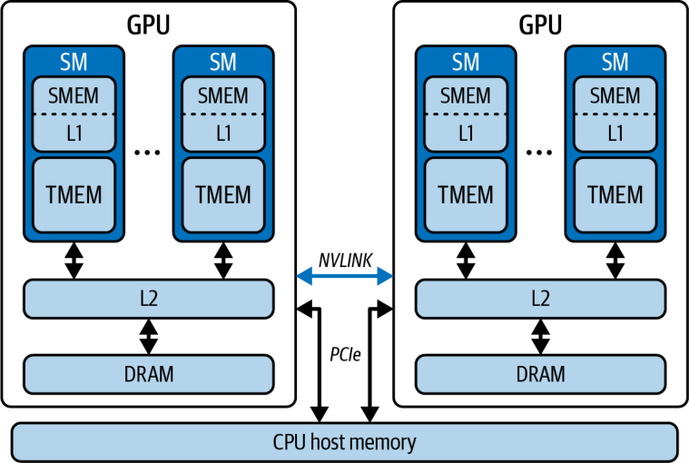


TMEM is a dedicated 256 KB per-SM buffer that transparently communicates with the Tensor Cores at tens of terabytes per second of bandwidth. This reduces the Tensor Core’s reliance on global memory. Figure 6-11 shows TMEM servicing the Tensor Cores—along with SMEM—to compute a C = A × B matrix multiply.

TMEM 是一块专用的每 SM 256 KB 缓冲区，以每秒数十太字节的带宽透明地与 Tensor Core 通信。这减少了 Tensor Core 对全局内存的依赖。图 6-11 展示了 TMEM 与 SMEM 一起为 Tensor Core 提供服务，以计算 C = A × B 矩阵乘法。

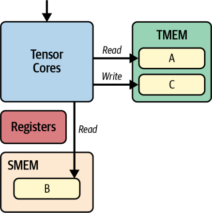


Here, operand B is sourced from SMEM. Operand A is in TMEM (although it may be in SMEM, as well). The accumulator is in TMEM, as well. Tiles flow from global memory to SMEM through L2 cache using TMA (e.g., cuda::memcpy_async).

在这里，操作数 B 来自 SMEM。操作数 A 位于 TMEM（不过它也可能位于 SMEM）。累加器同样位于 TMEM。分块（tile）通过 TMA（例如 cuda::memcpy_async）从全局内存经 L2 缓存流向 SMEM。

Operands move between SMEM and TMEM implicitly through Tensor Core instructions such as unified matrix-multiply-accumulate (UMMA) and tcgen05.mma.

操作数在 SMEM 与 TMEM 之间的移动，则是通过诸如 unified matrix-multiply-accumulate（UMMA）和 tcgen05.mma 之类的 Tensor Core 指令隐式完成的。

Table 6-5 shows the different levels of memory and their characteristics for the Blackwell GPU. A description of each level of the memory hierarchy follows.

表 6-5 展示了 Blackwell GPU 各级内存及其特性。随后对内存层级的每一级进行说明。

*Table 6-5. Blackwell memory hierarchy and characteristics*

*表 6-5. Blackwell 内存层级及其特性*

| Level | Scope | Capacity | Latency | Bandwidth (approx.) |
| --- | --- | --- | --- | --- |
| Registers | Per thread (on SM) | 64 K 32-bit registers per SM (max 255 per thread) | near-register latency (register reads/writes are single-cycle and essentially free) | Tens of TB/s per SM (register-file ports) |
| Shared memory and L1 cache | Per SM | 228 KB (227 KB usable) shared + remainder as L1/data cache | ~20–30 cycles (L1/shared benchmarks) | TB/s per SM (bank-conflict-free) |
| TMEM | Per SM | 256 KB SRAM per SM dedicated to Tensor Cores | ~10 cycles (dedicated SRAM on the SM) | TB/s-scale communication with Tensor Cores |
| Constant memory cache | Per SM | ~8 KB cache for 64 KB __constant__ space | ~1 cycle (warp-broadcast) As fast as a register when cached and all threads in a warp access the same address due to the constant cache and broadcast behavior. Divergent or missed cases serialize or incur higher latency | TB/s-scale (broadcast throughput) |
| L2 cache | GPU-wide (all SMs) | 126 MB total | ~200 cycles | Multi TB/s aggregate |
| Local memory | Per thread (spills to DRAM) | Near-unlimited (backed by global memory) | 100s → 1,000 cycles (DRAM-like) | ~8 TB/s (HBM3e) |
| Global memory (HBM or DRAM) | Device-wide (off-chip DRAM) | Up to 180 GB per Blackwell B200 GPU (up to ~288 GB per Blackwell B300 GPU) | 100s → 1,000 cycles (global-memory latency) | ~8 TB/s total |

| 级别 | 作用范围 | 容量 | 延迟 | 带宽（近似） |
| --- | --- | --- | --- | --- |
| 寄存器 | 每线程（位于 SM 上） | 每 SM 64 K 个 32-bit 寄存器（每线程最多 255 个） | 接近寄存器延迟（寄存器读写为单周期，基本零开销） | 每 SM 数十 TB/s（寄存器堆端口） |
| 共享内存与 L1 缓存 | 每 SM | 228 KB（227 KB usable）共享内存 + 其余作为 L1/数据缓存 | ~20–30 周期（L1/共享内存基准） | 每 SM TB/s 级（无 bank 冲突时） |
| TMEM | 每 SM | 每 SM 256 KB SRAM，专供 Tensor Core | ~10 周期（SM 上的专用 SRAM） | 与 Tensor Core 之间 TB/s 级的通信 |
| 常量内存缓存 | 每 SM | 约 8 KB 缓存，服务于 64 KB 的 __constant__ 空间 | ~1 周期（warp 广播）。命中缓存且一个 warp 内所有线程访问同一地址时，凭借常量缓存与广播行为，速度可快如寄存器。发生分歧或未命中时则会串行化，或产生更高延迟 | TB/s 级（广播吞吐） |
| L2 缓存 | 全 GPU 范围（所有 SM） | 共 126 MB | ~200 周期 | 多 TB/s 总带宽 |
| 本地内存 | 每线程（溢出到 DRAM） | 近乎无限（由全局内存支撑） | 100s → 1,000 周期（类 DRAM） | ~8 TB/s（HBM3e） |
| 全局内存（HBM 或 DRAM） | 全设备范围（片外 DRAM） | 每块 Blackwell B200 GPU 最高 180 GB（每块 Blackwell B300 GPU 最高 ~288 GB） | 100s → 1,000 周期（全局内存延迟） | 总计 ~8 TB/s |

Here, you can see why maximizing data reuse in registers, shared memory, and L1/L2 cache—and minimizing reliance on global memory and local memory (backed by global memory)—is essential for high-throughput GPU kernels. Next is a bit more detail about each of these levels of the hierarchy:

由此你可以看出，为什么最大化在寄存器、共享内存以及 L1/L2 缓存中的数据复用——并最小化对全局内存和本地内存（由全局内存支撑）的依赖——对于高吞吐的 GPU 核函数至关重要。下面对该层级的每一级再作一些说明：

*Registers*

*寄存器*

On Blackwell, every thread begins its journey at the register file, a tiny on-SM SRAM array that holds each thread’s local variables with essentially zero added latency. Each SM houses 64 K 32-bit registers (256 KB total), but the hardware exposes at most 255 registers per thread.

在 Blackwell 上，每个线程的旅程都从寄存器堆（register file）开始，这是一块微小的 SM 上 SRAM 阵列，用于保存每个线程的局部变量，且几乎不增加延迟。每个 SM 拥有 64 K 个 32-bit 寄存器（共 256 KB），但硬件对每个线程最多只暴露 255 个寄存器。

Because reads and writes complete in a single cycle and contend with almost nothing else, register bandwidth can reach tens of terabytes per second per SM. However, if your kernel needs more registers—either through many thread-local variables or compiler temporaries—the overflow spills into local memory, mapped to off-chip DRAM, and incurs hundreds to over a thousand cycles of latency. This local memory is shown in Figure 6-12.

由于读写都在单个周期内完成，且几乎不与其他任何东西争用，寄存器带宽每 SM 可达每秒数十太字节。然而，如果你的核函数需要更多寄存器——无论是因为大量线程局部变量还是编译器临时变量——溢出部分就会溢入本地内存（映射到片外 DRAM），并带来数百乃至上千周期的延迟。这块本地内存如图 6-12 所示。

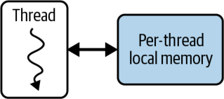


*Shared memory and L1 data cache*

*共享内存与 L1 数据缓存*

One step up is a unified L1/data cache and shared-memory block. This is 256 KB of on-SM SRAM per SM that you can dynamically split between user-managed shared memory (up to 228 KB per block) using cudaFuncSetAttribute() with cudaFuncAttributePreferredSharedMemoryCarveout to select the memory carveout on architectures like Blackwell with unified L1/Texture/Shared Memory. The maximum dynamic shared memory per block is 227 KB (CUDA reserves 1KB per block), and the total allocatable shared memory per SM is also bounded by this limit.

再上一层是统一的 L1/数据缓存与共享内存块。这是每 SM 256 KB 的 SM 上 SRAM，你可以在用户管理的共享内存（每块最多 228 KB）之间动态划分它——在 Blackwell 这类具有统一 L1/纹理/共享内存的架构上，使用 cudaFuncSetAttribute() 配合 cudaFuncAttributePreferredSharedMemoryCarveout 来选择内存划分（carveout）。每块最大动态共享内存为 227 KB（CUDA 为每块保留 1KB），且每 SM 可分配的共享内存总量也受此上限约束。

Accesses here cost roughly 20–30 cycles, but if you design your thread blocks to avoid bank conflicts, you can achieve terabytes-per-second throughput. Thread-block shared memory is shown in Figure 6-13.

这里的访问大约耗费 20–30 周期，但如果你设计线程块时避免了 bank 冲突，就能达到每秒太字节级的吞吐。线程块共享内存如图 6-13 所示。

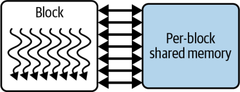


*TMEM*

*TMEM*

TMEM is a dedicated on-chip memory per SM (256 KB on Blackwell) used by Tensor Core–specific operations and instructions including unified matrix-multiply-accumulate and tcgen05, discussed in Chapter 10. It is not a normal pointer addressable space in CUDA C++. Instead, transfers are orchestrated with the Tensor Memory Accelerator (TMA) using descriptors. This frees the developer from having to manually manage data flow with the Tensor Cores. Some arithmetic operands, for instance, reside in shared memory, while the accumulator resides in TMEM. TMA is then responsible for moving the data between global memory, shared memory, and TMEM memory to perform the computations.

TMEM 是每 SM 的一块专用片上内存（Blackwell 上为 256 KB），供 Tensor Core 专属的运算与指令使用，包括 unified matrix-multiply-accumulate 和 tcgen05（详见第 10 章）。它不是 CUDA C++ 中普通的指针可寻址空间。相反，传输由 Tensor Memory Accelerator（TMA）借助描述符来编排。这使开发者无需手动管理与 Tensor Core 之间的数据流。例如，某些算术操作数驻留在共享内存中，而累加器则驻留在 TMEM 中。随后由 TMA 负责在全局内存、共享内存与 TMEM 内存之间搬运数据以完成计算。

*Constant memory cache*

*常量内存缓存*

For tiny, read-only tables, Blackwell provides a per-SM constant memory cache of about 8 KB fronting the 64 KB __constant__ space. When all 32 threads in a warp load the same address, this cache broadcasts the value in a single cycle.

对于微小的只读表，Blackwell 提供了每 SM 约 8 KB 的常量内存缓存，位于 64 KB 的 __constant__ 空间之前。当一个 warp 中全部 32 个线程加载同一地址时，该缓存会在单个周期内广播该值。

Divergent reads serialize across lanes. It’s perfect for sharing small lookup tables for rotary positional encodings, Attention with Linear Biases (ALiBi) slopes, LayerNorm γ/β vectors, and embedding quantization scales. These are shared across every thread without global-memory traffic.

分歧的读取则会跨 lane 串行化。它非常适合共享小型查找表，例如旋转位置编码、带线性偏置的注意力（Attention with Linear Biases，ALiBi）斜率、LayerNorm 的 γ/β 向量以及嵌入量化缩放因子。这些都能在每个线程间共享，而无需产生全局内存流量。

*L2 cache*

*L2 缓存*

Beyond on-chip SRAM sits the L2 cache, a 126 MB GPU-wide buffer that glues all SMs to off-chip HBM3e. With latencies near 200 cycles and aggregate bandwidth in the tens of terabytes per second, L2 absorbs spillover from L1.

在片上 SRAM 之外是 L2 缓存，这是一块 126 MB 的全 GPU 范围缓冲区，把所有 SM 与片外 HBM3e 粘合在一起。延迟接近 200 周期，聚合带宽达每秒数十太字节，L2 吸收来自 L1 的溢出。

With the L2, data is fetched by one thread block and reused by other thread blocks without revisiting DRAM. To maximize L2’s benefits, structure your global loads into 128-byte, coalesced transactions that map cleanly to cache lines. We’ll show how to do this in a bit.

有了 L2，数据可以由一个线程块取回，再由其他线程块复用，而无需再次访问 DRAM。为了最大化 L2 的收益，应把你的全局加载组织成 128 字节的合并访问事务，使其干净地映射到缓存行上。稍后我们会展示具体做法。

> Structure your global loads into 128-byte aligned, coalesced segments that map cleanly to cache lines. This avoids split transactions and maximizes use of the L2 and DRAM bandwidth.

> 把你的全局加载组织成 128 字节对齐、合并的分段，使其干净地映射到缓存行上。这可以避免拆分事务，并最大化利用 L2 与 DRAM 带宽。

*Global memory (HBM or DRAM)*

*全局内存（HBM 或 DRAM）*

The global memory tier, local spill space and HBM, live off-chip. Any spilled registers or oversized automatic arrays reside in local memory, paying full DRAM latency (hundreds to more than 1,000 cycles) despite HBM3e’s ~8 TB/s bandwidth.

全局内存层级——本地溢出空间与 HBM——位于片外。任何溢出的寄存器或超大的自动数组都驻留在本地内存中，尽管 HBM3e 带宽高达 ~8 TB/s，仍要付出完整的 DRAM 延迟（数百乃至一千多周期）。

For Blackwell, the HBM3e tier provides up to 180 GB of device-wide storage at ~8 TB/s total. However, its high latency makes it the slowest link in the chain. Per-device global memory is shown in Figure 6-14.

对于 Blackwell，HBM3e 层级提供最高 180 GB 的全设备范围存储，总带宽 ~8 TB/s。然而其高延迟使它成为整条链路中最慢的一环。每设备的全局内存如图 6-14 所示。

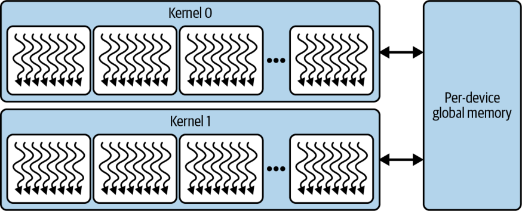


Using tools like Nsight Compute to track spills and cache hit rates, you can keep your kernels operating as close as possible to the on-chip peaks of this memory hierarchy. These tools can help you orchestrate data effectively through registers, shared/L1, constant cache, and L2 cache. Modern GPUs like Blackwell allow kernel developers to exploit the memory hierarchy by using L2 caches and unified L1/shared memory to buffer and coalesce accesses to HBM, as we’ll soon see.

借助 Nsight Compute 之类的工具跟踪溢出与缓存命中率，你可以让核函数尽可能贴近该内存层级的片上峰值运行。这些工具能帮助你有效地在寄存器、shared/L1、常量缓存与 L2 缓存之间编排数据。像 Blackwell 这样的现代 GPU 允许核函数开发者利用内存层级——使用 L2 缓存和统一的 L1/共享内存来缓冲并合并对 HBM 的访问，我们很快就会看到。

> The Blackwell B200 presents as a single GPU built with a unified, global address space. However, it’s made up of two reticle-limited dies connected by a 10 TB/s chip-to-chip interconnect. Each die is connected to four HBM3e stacks for a total of eight HBM3e stacks. From a developer’s perspective, however, HBM memory access is uniform across this combined address space, but it’s worth understanding the low-level details of this architecture.

> Blackwell B200 对外呈现为一块单一 GPU，构建于统一的全局地址空间之上。然而，它由两个光罩受限裸片（reticle-limited die）组成，二者通过 10 TB/s 的芯片间互连连接。每个裸片连接到四个 HBM3e 堆栈，共计八个 HBM3e 堆栈。不过，从开发者的视角看，HBM 内存访问在这一合并地址空间中是一致的，但了解这一架构的底层细节仍然是值得的。

The point of coherency (PoC) for the different levels in the memory hierarchy depends on your needs and the level at which the threads are communicating. It typically happens at the following levels: thread, thread-block (aka *CTA*), thread block cluster (aka *CTA cluster*), device, or system, as shown in Figure 6-15.

内存层级中各级的一致性点（point of coherency，PoC）取决于你的需求，以及线程进行通信所处的层级。它通常发生在以下层级：线程、线程块（又称 *CTA*）、线程块簇（又称 *CTA 簇*）、设备或系统，如图 6-15 所示。

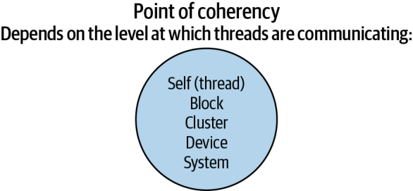


In summary, it’s important to understand the GPU’s memory hierarchy and target each level appropriately. By doing so, you can structure your CUDA kernels to maximize data locality, hide memory-access latency, increase occupancy, and fully leverage Blackwell’s massive parallel compute capabilities, as we’ll explore in a bit. First, let’s discuss NVIDIA’s unified memory, which is important to understand given the unified CPU-GPU superchip designs of Grace Hopper and Grace Blackwell.

总而言之，理解 GPU 的内存层级并恰当地针对每一级进行优化非常重要。这样做，你就能构建 CUDA 核函数以最大化数据局部性、隐藏内存访问延迟、提高占用率，并充分发挥 Blackwell 强大的并行计算能力，稍后我们会加以探讨。首先，让我们讨论 NVIDIA 的统一内存——鉴于 Grace Hopper 与 Grace Blackwell 的 CPU-GPU 统一超级芯片设计，理解它十分重要。

### Unified Memory

### 统一内存

Unified Memory (also known as CUDA Managed Memory) gives you a single, coherent address space that spans both CPU and GPU, so you no longer have to juggle separate host and device buffers or issue explicit cudaMemcpy calls. Under the hood, the CUDA runtime backs every cudaMallocManaged() allocation with pages that can migrate on-demand over whatever interconnect links your CPU and GPU, as shown in Figure 6-16.

统一内存（Unified Memory，又称 CUDA 托管内存（Managed Memory））为你提供一个横跨 CPU 与 GPU 的单一、一致的地址空间，因此你不再需要费心管理分开的主机与设备缓冲区，也不必发起显式的 cudaMemcpy 调用。在底层，CUDA 运行时为每一次 cudaMallocManaged() 分配都以页面作为支撑，这些页面能够在连接你的 CPU 与 GPU 的任何互连上按需迁移，如图 6-16 所示。

While accessing Unified Memory is super developer-friendly, it can cause unwanted on-demand page migrations between the CPU and the GPU. This will introduce hidden latency and execution stalls. For example, if a GPU thread accesses data that currently resides in CPU memory, the GPU will page-fault and wait while that data is transferred over the NVLink-C2C interconnect. Unified Memory performance depends greatly on the underlying hardware.

尽管访问统一内存对开发者极为友好，它却可能引发 CPU 与 GPU 之间不期而至的按需页迁移。这会带来隐藏的延迟与执行停顿。例如，如果一个 GPU 线程访问当前驻留在 CPU 内存中的数据，GPU 就会发生缺页，并在数据经由 NVLink-C2C 互连传输期间等待。统一内存的性能在很大程度上取决于底层硬件。

On traditional PCIe or early NVLink systems, those migrations travel at relatively low bandwidth—often making on-fault transfers slower than a manual cudaMemcpy. But on Grace Hopper and Grace Blackwell Superchips, the NVLink-C2C fabric delivers up to ~900 GB/s between the CPU’s HBM and the GPU’s HBM3e. As such, page-fault–driven migrations come far closer to device-native speed—although they still carry nonzero latency.

在传统 PCIe 或早期 NVLink 系统上，这类迁移以相对较低的带宽进行——常常使缺页触发的传输比手动 cudaMemcpy 还慢。但在 Grace Hopper 与 Grace Blackwell Superchip 上，NVLink-C2C 结构在 CPU 的 HBM 与 GPU 的 HBM3e 之间提供最高 ~900 GB/s 的带宽。因此，缺页驱动的迁移在速度上要接近设备原生水平得多——尽管它们仍带有非零的延迟。

That said, any unexpected page-fault during a kernel launch will stall the GPU while the runtime moves the needed page into place. To avoid those “surprise” stalls, you can prefetch memory in advance with cudaMemPrefetchAsync(), as shown in Figure 6-17.

尽管如此，核函数启动期间任何意外的缺页都会在运行时把所需页面搬到位的过程中使 GPU 停顿。为避免这些“意外”停顿，你可以事先用 cudaMemPrefetchAsync() 预取内存，如图 6-17 所示。

This hints to the driver to move the specified range onto the target GPU (or CPU) before you launch your kernel, turning costly first-touch migrations into overlappable, asynchronous transfers. You can also give memory advice, as shown in this code:

这会提示驱动在你启动核函数之前，把指定范围搬到目标 GPU（或 CPU）上，从而把代价高昂的首次访问（first-touch）迁移转化为可重叠的异步传输。你还可以给出内存建议（memory advice），如下面的代码所示：

```
cudaMemAdvise(ptr, size, cudaMemAdviseSetPreferredLocation, gpuId);
cudaMemAdvise(ptr, size, cudaMemAdviseSetReadMostly, gpuId);
```

```
cudaMemAdvise(ptr, size, cudaMemAdviseSetPreferredLocation, gpuId);
cudaMemAdvise(ptr, size, cudaMemAdviseSetReadMostly, gpuId);
```

Here, you can use PreferredLocation to tell the driver where you’ll mostly use the data, and ReadMostly when it’s largely read-only, as shown in Figure 6-18.

在这里，你可以用 PreferredLocation 告诉驱动你将主要在何处使用数据，用 ReadMostly 表示数据在很大程度上是只读的，如图 6-18 所示。

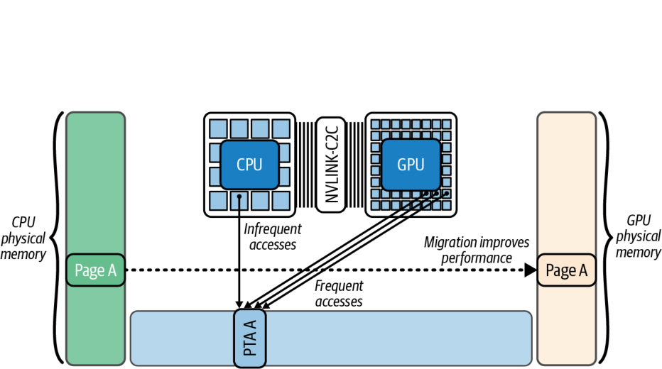


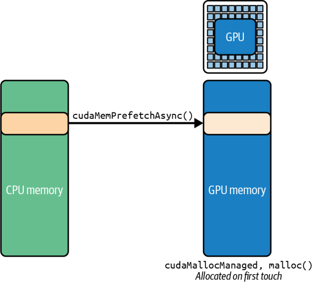


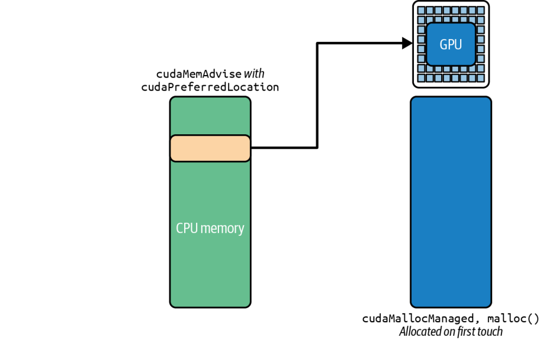


You can also call the following to let a second GPU map those pages without triggering migrations at launch:

你还可以调用下面的代码，让第二块 GPU 映射这些页面，而不会在启动时触发迁移：

```
cudaMemAdvise(ptr, size, cudaMemAdviseSetAccessedBy,
   otherGpuId);
```

```
cudaMemAdvise(ptr, size, cudaMemAdviseSetAccessedBy,
   otherGpuId);
```

By default, any CUDA stream or device kernel can trigger a page fault on a managed allocation. This can cause unexpected migrations and implicit synchronizations. If you know a certain buffer will be used only in one stream/GPU at a time, attaching it to that stream allows migrations to overlap with operations in other streams. Calling the following ties that memory range to the specified stream:

默认情况下，任何 CUDA 流或设备核函数都可能在一次托管分配上触发缺页。这会导致意外的迁移和隐式同步。如果你知道某个缓冲区在同一时间只会在一个流/GPU 上使用，把它附着到那个流，就能让迁移与其他流中的操作相重叠。调用下面的代码可将该内存范围绑定到指定的流：

```
cudaStreamAttachMemAsync(stream, ptr, 0,
    cudaMemAttachSingle);
```

```
cudaStreamAttachMemAsync(stream, ptr, 0,
    cudaMemAttachSingle);
```

In this case, only operations in that stream will fault and migrate its pages. This prevents other streams from accidentally stalling on it. As such, attaching a range to a particular stream defers its migrations so they overlap with only that stream’s work. This avoids cross-stream synchronization.

在这种情况下，只有该流中的操作才会缺页并迁移其页面。这可以防止其他流意外地在它上面停顿。因此，把某个范围附着到特定的流会推迟其迁移，使之只与该流的工作相重叠。这就避免了跨流同步。

> In multi-GPU systems without NVLink-C2C, you can also use cudaMemcpyPeerAsync() or a prefetch to a specific device to pin data in the nearest NUMA-local GPU memory, preventing slow remote accesses.

> 在没有 NVLink-C2C 的多 GPU 系统中，你还可以使用 cudaMemcpyPeerAsync()，或预取到某个特定设备，以把数据固定在最近的 NUMA 本地 GPU 内存中，从而避免缓慢的远程访问。

In short, explicitly prefetching managed memory and providing memory advice can eliminate most of the “surprise” stalls from Unified Memory. Instead of the GPU pausing to fetch data on demand, the data is already where it needs to be when the kernel runs.

简而言之，显式预取托管内存并提供内存建议，能够消除统一内存带来的大多数“意外”停顿。数据在核函数运行时已经就位，而不是让 GPU 暂停以按需取数。

With techniques like proactive prefetching, targeted memory advice, and stream attachment, Unified Memory can deliver performance very close to manual cudaMemcpy while preserving the simplicity of a unified address space.

借助主动预取、有针对性的内存建议以及流附着等技术，统一内存可以在保留统一地址空间之简洁性的同时，交付非常接近手动 cudaMemcpy 的性能。

### Maintaining High Occupancy and GPU Utilization

### 维持高占用率与 GPU 利用率

GPUs sustain performance by running many warps concurrently so that when one warp stalls waiting for data, another warp can run. This ability to rapidly switch between warps allows a GPU to hide memory latency. As we described earlier, the fraction of an SM’s capacity actually occupied by active warps is called *occupancy*.

GPU 通过并发运行大量 warp 来维持性能，这样当一个 warp 因等待数据而停顿时，另一个 warp 就能运行。这种在 warp 之间快速切换的能力使 GPU 得以隐藏内存延迟。正如我们前面所述，一个 SM 的容量中被活跃 warp 实际占据的比例，被称为 *占用率*。

If occupancy is low (just a few active warps), an SM may sit idle while one warp is waiting on memory. This leads to poor SM utilization. On Blackwell, achieving high occupancy is a bit easier given its large register file (64K registers per SM), which can support many warps without spilling.

如果占用率很低（只有寥寥几个活跃 warp），当一个 warp 在等待内存时，SM 可能就会空闲。这会导致 SM 利用率低下。在 Blackwell 上，凭借其庞大的寄存器堆（每 SM 64K 个寄存器），实现高占用率会容易一些，它可以在不溢出的情况下支撑许多 warp。

> As you saw earlier, each thread in a warp can use up to 255 registers. Make sure to use your profiling tools to check achieved occupancy—and adjust your kernel’s block size and register usage accordingly.

> 正如你前面所见，一个 warp 中的每个线程最多可使用 255 个寄存器。务必使用你的剖析工具来检查实际占用率——并据此调整核函数的块大小和寄存器用量。

Conversely, high occupancy (many active warps per SM) will keep the GPU compute units busy since, while one warp waits on memory access, others will swap in to the SM and execute. This masks the long memory access delays. This is often referred to as *hiding latency*.

反过来，高占用率（每 SM 有许多活跃 warp）会让 GPU 计算单元保持繁忙，因为当一个 warp 在等待内存访问时，其他 warp 会切入 SM 并执行。这就掩盖了漫长的内存访问延迟。这通常被称为 *隐藏延迟*。

Let’s show an example that improves occupancy and ultimately GPU utilization, throughput, and overall kernel performance. This is one of the most fundamental rules of CUDA performance optimization: launch enough parallel work to fully occupy the GPU.

让我们展示一个能提升占用率、并最终提升 GPU 利用率、吞吐量与整体核函数性能的示例。这是 CUDA 性能优化最基本的规则之一：启动足够的并行工作以充分占满 GPU。

If your achieved occupancy (the fraction of hardware thread slots in use) is well below the GPU’s limit and performance is poor, the first remedy is to increase parallelism—use more blocks or threads so that occupancy approaches the 80%– 100% range on modern GPUs.

如果你的实际占用率（正在使用的硬件线程槽的比例）远低于 GPU 的上限且性能不佳，首要的补救办法就是增加并行度——使用更多的块或线程，使占用率在现代 GPU 上接近 80%–100% 的区间。

Conversely, if occupancy is already moderate to high but the kernel is bottlenecked by memory throughput, pushing it to 100% may not help. You generally need just enough warps to hide latency, and beyond that the bottleneck might lie elsewhere (e.g., memory bandwidth).

反之，如果占用率已经处于中到高的水平，但核函数受内存吞吐所限，把它推到 100% 可能也无济于事。你通常只需要恰好足够多的 warp 来隐藏延迟，超过之后瓶颈可能就在别处了（例如内存带宽）。

To illustrate the impact of occupancy, consider a very simple operation: adding two vectors of length *N* (computing C = A + B). We’ll examine two kernel implementations: addSequential and addParallel. addSequential uses a single thread (or a single warp) to add all *N* elements in a loop. addParallel uses many threads so that the additions are done concurrently across the array.

为说明占用率的影响，考虑一个非常简单的操作：把两个长度为 *N* 的向量相加（计算 C = A + B）。我们将考察两种核函数实现：addSequential 和 addParallel。addSequential 使用单个线程（或单个 warp）在循环中把全部 *N* 个元素相加。addParallel 使用许多线程，使加法在整个数组上并发完成。

In the sequential version, one GPU thread handles the entire workload serially, as shown here:

在串行版本中，一个 GPU 线程串行地处理整个工作负载，如下所示：

```
#include <cuda_runtime.h>

const int N = 1'000'000;

// Single thread does all N additions
__global__ void addSequential(const float* A,
                              const float* B,
                                    float* C,
                              int N)
{
    if (blockIdx.x == 0 && threadIdx.x == 0) {
        for (int i = 0; i < N; ++i) {
            C[i] = A[i] + B[i];
        }
    }
}

int main()
{
    // Allocate and initialize host
    float* h_A = nullptr;
    float* h_B = nullptr;
    float* h_C = nullptr;
    cudaMallocHost(&h_A, N * sizeof(float));
    cudaMallocHost(&h_B, N * sizeof(float));
    cudaMallocHost(&h_C, N * sizeof(float));

    for (int i = 0; i < N; ++i) {
        h_A[i] = float(i);
        h_B[i] = float(i * 2);
    }

    // Allocate device
    float *d_A, *d_B, *d_C;
    cudaMalloc(&d_A, N * sizeof(float));
    cudaMalloc(&d_B, N * sizeof(float));
    cudaMalloc(&d_C, N * sizeof(float));

    // Copy inputs to device
    cudaMemcpy(d_A, h_A, N * sizeof(float), cudaMemcpyHostToDevice);
    cudaMemcpy(d_B, h_B, N * sizeof(float), cudaMemcpyHostToDevice);

    // Launch: one thread
    // Note: This kernel assumes <<<1,1>>>
    // (one block, one thread).
    // Do not change the launch config when running this example.
    addSequential<<<1,1>>>(d_A, d_B, d_C, N);

    // Ensure completion before exit
    cudaDeviceSynchronize();

    // Copy d_C => h_C (back to host)
    cudaMemcpy(h_C, d_C, N * sizeof(float), cudaMemcpyDeviceToHost);

    // Cleanup
    cudaFree(d_A);
    cudaFree(d_B);
    cudaFree(d_C);
    cudaFreeHost(h_A);
    cudaFreeHost(h_B);
    cudaFreeHost(h_C);

    return 0;
}
```

```
#include <cuda_runtime.h>

const int N = 1'000'000;

// Single thread does all N additions
__global__ void addSequential(const float* A,
                              const float* B,
                                    float* C,
                              int N)
{
    if (blockIdx.x == 0 && threadIdx.x == 0) {
        for (int i = 0; i < N; ++i) {
            C[i] = A[i] + B[i];
        }
    }
}

int main()
{
    // Allocate and initialize host
    float* h_A = nullptr;
    float* h_B = nullptr;
    float* h_C = nullptr;
    cudaMallocHost(&h_A, N * sizeof(float));
    cudaMallocHost(&h_B, N * sizeof(float));
    cudaMallocHost(&h_C, N * sizeof(float));

    for (int i = 0; i < N; ++i) {
        h_A[i] = float(i);
        h_B[i] = float(i * 2);
    }

    // Allocate device
    float *d_A, *d_B, *d_C;
    cudaMalloc(&d_A, N * sizeof(float));
    cudaMalloc(&d_B, N * sizeof(float));
    cudaMalloc(&d_C, N * sizeof(float));

    // Copy inputs to device
    cudaMemcpy(d_A, h_A, N * sizeof(float), cudaMemcpyHostToDevice);
    cudaMemcpy(d_B, h_B, N * sizeof(float), cudaMemcpyHostToDevice);

    // Launch: one thread
    // Note: This kernel assumes <<<1,1>>>
    // (one block, one thread).
    // Do not change the launch config when running this example.
    addSequential<<<1,1>>>(d_A, d_B, d_C, N);

    // Ensure completion before exit
    cudaDeviceSynchronize();

    // Copy d_C => h_C (back to host)
    cudaMemcpy(h_C, d_C, N * sizeof(float), cudaMemcpyDeviceToHost);

    // Cleanup
    cudaFree(d_A);
    cudaFree(d_B);
    cudaFree(d_C);
    cudaFreeHost(h_A);
    cudaFreeHost(h_B);
    cudaFreeHost(h_C);

    return 0;
}
```

In this single-threaded version, the GPU’s vast resources are mostly idle. Only one warp, or even one thread within the warp, is doing work while all others sit idle. The result is very poor occupancy and, ultimately, low performance.

在这个单线程版本中，GPU 庞大的资源大多处于闲置状态。只有一个 warp，甚至只有该 warp 中的一个线程在工作，而其他所有线程都闲着。结果是占用率极低，并最终导致性能低下。

One must be also careful to avoid indirectly executing inefficient GPU code in high-level libraries and frameworks like PyTorch. For instance, the naive PyTorch code that follows mistakenly performs elementwise operations using a Python for-loop that issues *N* separate add operations on the GPU one after another:

还必须小心，避免在 PyTorch 这类高级库和框架中间接执行低效的 GPU 代码。例如，下面这段朴素的 PyTorch 代码错误地用一个 Python for 循环执行逐元素操作，一个接一个地在 GPU 上发起了 *N* 次独立的加法操作：

```
import torch

N = 1_000_000
A = torch.arange(N, dtype=torch.float32, device='cuda')
B = 2 * A
C = torch.empty_like(A)

# Ensure all previous work is done
torch.cuda.synchronize()

# Naive, Sequential GPU operations - DO NOT DO THIS
with torch.inference_mode(): # avoids unnecessary autograd graph construction
    # This launches N tiny GPU operations serially
    for i in range(N):
        C[i] = A[i] + B[i]

torch.cuda.synchronize()
```

```
import torch

N = 1_000_000
A = torch.arange(N, dtype=torch.float32, device='cuda')
B = 2 * A
C = torch.empty_like(A)

# Ensure all previous work is done
torch.cuda.synchronize()

# Naive, Sequential GPU operations - DO NOT DO THIS
with torch.inference_mode(): # avoids unnecessary autograd graph construction
    # This launches N tiny GPU operations serially
    for i in range(N):
        C[i] = A[i] + B[i]

torch.cuda.synchronize()
```

This code effectively uses the GPU like a scalar, nonparallel processor. It achieves very low occupancy similar to the previous native addSequential CUDA C++ code.

这段代码实际上把 GPU 当成了一个标量的、非并行的处理器。它的占用率极低，与前面原生的 addSequential CUDA C++ 代码类似。

Let’s optimize the CUDA kernel and PyTorch code to implement a parallel version of the vector add operation. Figure 6-19 shows how a vectorized add operation works.

让我们优化这段 CUDA 核函数与 PyTorch 代码，实现向量加法操作的并行版本。图 6-19 展示了向量化加法操作的工作方式。

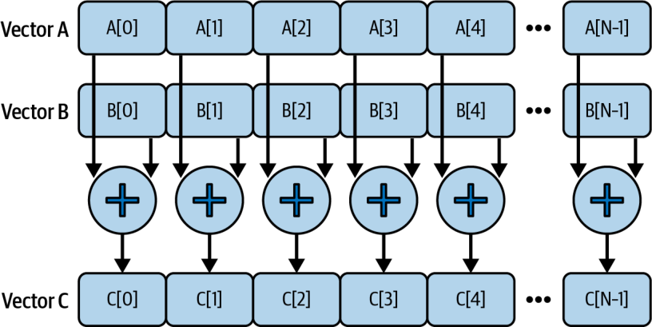


In the following CUDA C++ code, we launch enough threads to cover all elements (<<< (N+255)/256, 256 >>>) so that 256 threads per block process *N* elements in parallel across however many blocks are needed:

在下面的 CUDA C++ 代码中，我们启动足够多的线程以覆盖所有元素（<<< (N+255)/256, 256 >>>），使得每块 256 个线程在所需数量的块上并行处理 *N* 个元素：

```
#include <cuda_runtime.h>

const int N = 1'000'000;

// One thread per element
__global__ void addParallel(const float* __restrict__ A,
                            const float* __restrict__ B,
                                  float* __restrict__ C,
                            int N)
{
    int idx = blockIdx.x * blockDim.x + threadIdx.x;
    if (idx < N) {
        C[idx] = A[idx] + B[idx];
    }

}

int main()
{
  // Allocate and initialize host (pinned for faster DMA)
  float* h_A = nullptr;
  float* h_B = nullptr;
  float* h_C = nullptr;
  cudaMallocHost(&h_A, N * sizeof(float));
  cudaMallocHost(&h_B, N * sizeof(float));
  cudaMallocHost(&h_C, N * sizeof(float));
  for (int i = 0; i < N; ++i) { h_A[i] = float(i); h_B[i] = float(2*i); }

  // Create a non-blocking stream and allocate device buffers
  cudaStream_t s; cudaStreamCreateWithFlags(&s, cudaStreamNonBlocking);
  float *d_A = nullptr, *d_B = nullptr, *d_C = nullptr;
  cudaMallocAsync(&d_A, N * sizeof(float), s);
  cudaMallocAsync(&d_B, N * sizeof(float), s);
  cudaMallocAsync(&d_C, N * sizeof(float), s);

  // Async HtoD copies on the same stream
  cudaMemcpyAsync(d_A, h_A, N*sizeof(float), cudaMemcpyHostToDevice, s);
  cudaMemcpyAsync(d_B, h_B, N*sizeof(float), cudaMemcpyHostToDevice, s);

  // Launch (same stream)
  int threads = 256;
  int blocks  = (N + threads - 1) / threads;
  addParallel<<<blocks, threads, 0, s>>>(d_A, d_B, d_C, N);

  // Async DtoH copy and stream sync
  cudaMemcpyAsync(h_C, d_C, N*sizeof(float), cudaMemcpyDeviceToHost, s);
  cudaStreamSynchronize(s);

  // Cleanup (stream-ordered free)
  cudaFreeAsync(d_A, s); cudaFreeAsync(d_B, s); cudaFreeAsync(d_C, s);
  cudaStreamDestroy(s);
  cudaFreeHost(h_A); cudaFreeHost(h_B); cudaFreeHost(h_C);
  return 0;
}
```

```
#include <cuda_runtime.h>

const int N = 1'000'000;

// One thread per element
__global__ void addParallel(const float* __restrict__ A,
                            const float* __restrict__ B,
                                  float* __restrict__ C,
                            int N)
{
    int idx = blockIdx.x * blockDim.x + threadIdx.x;
    if (idx < N) {
        C[idx] = A[idx] + B[idx];
    }

}

int main()
{
  // Allocate and initialize host (pinned for faster DMA)
  float* h_A = nullptr;
  float* h_B = nullptr;
  float* h_C = nullptr;
  cudaMallocHost(&h_A, N * sizeof(float));
  cudaMallocHost(&h_B, N * sizeof(float));
  cudaMallocHost(&h_C, N * sizeof(float));
  for (int i = 0; i < N; ++i) { h_A[i] = float(i); h_B[i] = float(2*i); }

  // Create a non-blocking stream and allocate device buffers
  cudaStream_t s; cudaStreamCreateWithFlags(&s, cudaStreamNonBlocking);
  float *d_A = nullptr, *d_B = nullptr, *d_C = nullptr;
  cudaMallocAsync(&d_A, N * sizeof(float), s);
  cudaMallocAsync(&d_B, N * sizeof(float), s);
  cudaMallocAsync(&d_C, N * sizeof(float), s);

  // Async HtoD copies on the same stream
  cudaMemcpyAsync(d_A, h_A, N*sizeof(float), cudaMemcpyHostToDevice, s);
  cudaMemcpyAsync(d_B, h_B, N*sizeof(float), cudaMemcpyHostToDevice, s);

  // Launch (same stream)
  int threads = 256;
  int blocks  = (N + threads - 1) / threads;
  addParallel<<<blocks, threads, 0, s>>>(d_A, d_B, d_C, N);

  // Async DtoH copy and stream sync
  cudaMemcpyAsync(h_C, d_C, N*sizeof(float), cudaMemcpyDeviceToHost, s);
  cudaStreamSynchronize(s);

  // Cleanup (stream-ordered free)
  cudaFreeAsync(d_A, s); cudaFreeAsync(d_B, s); cudaFreeAsync(d_C, s);
  cudaStreamDestroy(s);
  cudaFreeHost(h_A); cudaFreeHost(h_B); cudaFreeHost(h_C);
  return 0;
}
```

With a sufficiently large *N*, the difference in GPU utilization is significant. Now let’s optimize the PyTorch code, which launches a single vectorized kernel (A + B) that engages many threads on the GPU concurrently like the previous optimized addParallel CUDA C++ example. Here is the parallel version of the PyTorch code:

当 *N* 足够大时，GPU 利用率的差异非常显著。现在让我们优化这段 PyTorch 代码——它启动一个单一的向量化核函数（A + B），像前面优化过的 addParallel CUDA C++ 示例那样，在 GPU 上并发调动许多线程。下面是 PyTorch 代码的并行版本：

```
# add_parallel.py
import torch

N = 1_000_000
A = torch.arange(N, dtype=torch.float32, device='cuda')
B = 2 * A

torch.cuda.synchronize()

# Proper parallel approach using vectorized operation
# Launches a single GPU kernel that adds all elements in parallel
C = A + B

torch.cuda.synchronize()
```

```
# add_parallel.py
import torch

N = 1_000_000
A = torch.arange(N, dtype=torch.float32, device='cuda')
B = 2 * A

torch.cuda.synchronize()

# Proper parallel approach using vectorized operation
# Launches a single GPU kernel that adds all elements in parallel
C = A + B

torch.cuda.synchronize()
```

> In practice, high-level frameworks like PyTorch will do the right thing when you use vectorized tensor operations. Just be aware that introducing Python-level loops around GPU operations will serialize work and negatively impact performance. Avoid them if possible. Unless you are writing something novel, there is almost always an optimized PyTorch-native implementation available—including code emitted by the PyTorch compiler.

> 在实践中，当你使用向量化的张量操作时，PyTorch 这类高级框架会做出正确的处理。只需注意：在 GPU 操作外围引入 Python 层的循环会使工作串行化，并对性能产生负面影响。如有可能应加以避免。除非你在编写某种新颖的东西，否则几乎总能找到一个经过优化的 PyTorch 原生实现——包括 PyTorch 编译器生成的代码。

To quantify the performance impact of using a parallel versus sequential implementation, we can use Nsight Systems and Nsight Compute to measure the total kernel execution time, GPU utilization, occupancy, and warp execution efficiency metrics for the two approaches. Here are the Nsight Systems (nsys) and Nsight Compute (ncu) commands:

为了量化使用并行实现相较串行实现的性能影响，我们可以用 Nsight Systems 和 Nsight Compute 来测量两种方法的核函数总执行时间、GPU 利用率、占用率以及 warp 执行效率指标。下面是 Nsight Systems（nsys）和 Nsight Compute（ncu）命令：

```
# Sequential add
nsys profile \
  --stats=true \
  -t cuda,nvtx \
  -o sequential_nsys_report \
  ./add_sequential.py

ncu \
 --section SpeedOfLight \
 --metrics
     sm__warps_active.avg.pct_of_peak_sustained_active,gpu__time_duration.avg \
 --target-processes all \
 --print-summary per-gpu \
 -o sequential_ncu_report \
 ./add_sequential.py

# Parallel add
nsys profile \
  --stats=true \
  -t cuda,nvtx \
  -o parallel_nsys_report \
  ./add_parallel.py

ncu \
 --section SpeedOfLight \
 --metrics sm__warps_active.avg.pct_of_peak_sustained_active \
 --target-processes all \
 --print-summary per-gpu \

 -o parallel_ncu_report \
 ./add_parallel.py
```

```
# Sequential add
nsys profile \
  --stats=true \
  -t cuda,nvtx \
  -o sequential_nsys_report \
  ./add_sequential.py

ncu \
 --section SpeedOfLight \
 --metrics
     sm__warps_active.avg.pct_of_peak_sustained_active,gpu__time_duration.avg \
 --target-processes all \
 --print-summary per-gpu \
 -o sequential_ncu_report \
 ./add_sequential.py

# Parallel add
nsys profile \
  --stats=true \
  -t cuda,nvtx \
  -o parallel_nsys_report \
  ./add_parallel.py

ncu \
 --section SpeedOfLight \
 --metrics sm__warps_active.avg.pct_of_peak_sustained_active \
 --target-processes all \
 --print-summary per-gpu \

 -o parallel_ncu_report \
 ./add_parallel.py
```

We use nsys to uncover where the time is spent and whether the GPU is starved or blocked. Then we use ncu to explain why the kernel is performing the way it is—perhaps due to poor occupancy, etc.

我们用 nsys 来揭示时间花在了哪里，以及 GPU 是被“饿着”还是被阻塞。然后用 ncu 来解释核函数为何呈现这样的表现——也许是由于占用率低，等等。

If you run only nsys, you may miss fine-grained kernel inefficiencies. And if run you only ncu, you won’t know if your kernels are being fed data fast enough, for example. Table 6-6 shows the unified results.

如果你只运行 nsys，可能会错过细粒度的核函数低效之处。而如果你只运行 ncu，则无从得知你的核函数是否被足够快地喂入了数据。表 6-6 展示了统一的结果。

*Table 6-6. Comparing a sequential versus parallel CUDA kernel*

*表 6-6. 串行与并行 CUDA 核函数的对比*

| Metric | add_sequential | add_parallel |
| --- | --- | --- |
| Kernel execution time (ms) | 48.21 | 2.17 |
| GPU utilization | 1.5% | 95% |
| Achieved occupancy | 1.3% | 38.7% |
| Warp execution efficiency | 3.1% | 100% |

| 指标 | add_sequential | add_parallel |
| --- | --- | --- |
| 核函数执行时间（ms） | 48.21 | 2.17 |
| GPU 利用率 | 1.5% | 95% |
| 实际占用率 | 1.3% | 38.7% |
| warp 执行效率 | 3.1% | 100% |

> Other profiling tools may label these metrics differently. For example, Nsight Systems reports overall “GPU Utilization,” while Nsight Compute provides a per-kernel “SM Active %” metric—but both reflect how fully the GPU’s SMs were occupied by active warps.

> 其他剖析工具可能对这些指标使用不同的标签。例如，Nsight Systems 报告的是整体的“GPU Utilization”，而 Nsight Compute 提供的是每核函数的“SM Active %”指标——但两者都反映了 GPU 的 SM 被活跃 warp 占据的充分程度。

As expected, moving from a single-thread, single-warp implementation to a fully parallel, multiwarp implementation improves occupancy from 1.3% to ~38.7% on average. This reduces the runtime by about 22× from 48.21 ms down to 2.17 ms.

正如预期，从单线程、单 warp 的实现转向完全并行、多 warp 的实现，将平均占用率从 1.3% 提升到了 ~38.7%。这将运行时间缩短了约 22×，从 48.21 ms 降至 2.17 ms。

In the sequential case, only one warp, and just one thread, is doing work on a single SM. This is why we see a low 1.5% GPU utilization, whereas in the parallel case, many SMs are running multiple active warps. This increases warp execution efficiency from 3.1% to 100% since all 32 threads in a warp are doing useful work during each instruction. This improves GPU utilization from 1.5% to 95%.

在串行的情形下，单个 SM 上只有一个 warp、且仅有一个线程在工作。这正是我们看到 GPU 利用率低至 1.5% 的原因；而在并行的情形下，众多 SM 都在运行多个活跃 warp。这使得 warp 执行效率从 3.1% 提升到 100%，因为在每条指令执行期间，warp 中全部 32 个线程都在做有用的工作。它把 GPU 利用率从 1.5% 提高到了 95%。

This example shows why sufficient parallelism is critical on GPUs. No matter how fast each thread is, you need lots of threads to leverage the GPU’s throughput potential.

这个例子说明了为什么充足的并行度对 GPU 至关重要。无论每个线程有多快，你都需要大量线程才能发挥出 GPU 的吞吐潜力。

Remember that the GPU is a throughput-optimized processor that interacts with CPUs to launch the CUDA kernel—as well as the memory subsystem to load data from caches, shared memory, and global memory. As such, GPU performance greatly benefits from hiding these latencies.

请记住，GPU 是一种面向吞吐优化的处理器，它既要与 CPU 交互以启动 CUDA 核函数，也要与内存子系统交互以从缓存、共享内存和全局内存中加载数据。因此，隐藏这些延迟能极大地提升 GPU 性能。

When written properly, kernels will instruct the GPU to interleave memory loads and computations (e.g., additions) from different warps in parallel. This helps to hide memory latency across the warps.

当核函数编写得当时，它会指示 GPU 把来自不同 warp 的内存加载与计算（例如加法）并行地交错执行。这有助于跨 warp 隐藏内存延迟。

The parallel kernel running within multiple warps, in particular, benefits from warp-level latency hiding. While one warp is waiting for a memory load, another warp can be executing the add computation, while yet another could be fetching the next data, etc. We’ll explore many techniques to hide memory latency in the upcoming chapters.

尤其是在多个 warp 中运行的并行核函数，能从 warp 级延迟隐藏中获益。当一个 warp 正在等待内存加载时，另一个 warp 可以执行加法计算，而再有一个 warp 可以获取下一批数据，如此往复。我们将在后续章节探讨许多隐藏内存延迟的技术。

In the sequential kernel, there are no other warps to run while one is waiting, so the hardware pipelines often sit idle. The timeline is one long series of operations with idle gaps during memory waits. In the parallel version, those gaps are filled by other warps’ work, so the GPU is busy continuously. The comparison is shown in Figure 6-20.

在串行核函数中，当一个 warp 在等待时，并没有其他 warp 可运行，因此硬件流水线常常闲置。其时间线是一长串操作，其间在等待内存时留有空闲间隙。而在并行版本中，这些间隙被其他 warp 的工作填满，于是 GPU 持续保持忙碌。二者的对比如图 6-20 所示。

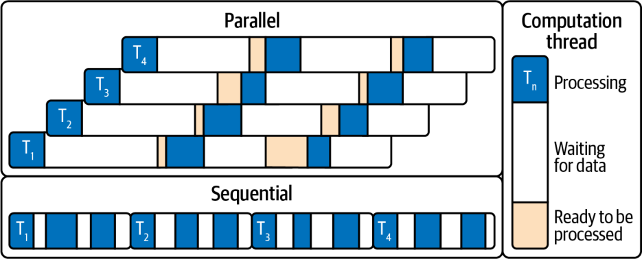


Here, the sequential timeline is one long series of operations with idle gaps during memory waits. In the parallel version, those gaps are filled by other warps’ work, so the GPU is busy continuously.

在这里，串行时间线是一长串操作，其间在等待内存时留有空闲间隙。而在并行版本中，这些间隙被其他 warp 的工作填满，于是 GPU 持续保持忙碌。

The key takeaway is to first ensure enough parallel work to fully occupy the GPU. High occupancy—enough warps to cover latency—maximizes throughput and minimizes idle stalls—in our example, parallelizing boosted GPU utilization to ~95%.

关键的一点是，首先要确保有足够的并行工作来充分占用 GPU。高占用率——即有足够多的 warp 来掩盖延迟——能最大化吞吐并最小化空闲停顿。在我们的例子中，并行化把 GPU 利用率提升到了 ~95%。

Once sufficient threads are launched, the next step is optimizing how efficiently each warp executes, through instruction-level parallelism and other per-thread improvements. But note: even at 100% occupancy, performance can still suffer if the workload is memory bound—that is, limited by slow memory access rather than compute.

一旦启动了足够的线程，下一步就是通过指令级并行以及其他针对每线程的改进，来优化每个 warp 的执行效率。但要注意：即使在 100% 占用率下，如果工作负载是访存受限的——也就是受限于缓慢的内存访问而非计算——性能仍可能受损。

A well-known example of a memory bound workload is the “decode” phase of an LLM. During decode, the LLM needs to move a large amount of data (model weights or parameters) from global HBM memory into the GPU registers and shared memory.

一个广为人知的访存受限工作负载的例子，是 LLM 的“解码”（decode）阶段。在解码期间，LLM 需要把大量数据（模型权重或参数）从全局 HBM 内存搬运到 GPU 寄存器和共享内存中。

Since modern LLMs contain hundreds of billions of parameters (multiplied by, let’s say, 8 bits per parameter, or 1 byte), the models can be many hundreds of gigabytes in size. Moving this much data in and out of the GPU can easily saturate the memory bandwidth.

由于现代 LLM 包含数千亿个参数（再乘以，比如说，每个参数 8 比特即 1 字节），这些模型的体积可达数百 GB。将如此海量的数据搬入搬出 GPU，很容易就会把内存带宽占满。

> GPU FLOPS are outpacing memory bandwidth. For instance, Blackwell’s HBM3e delivers ~8 TB/s, but compute capability and model sizes are growing even faster. As such, optimizing memory movement is absolutely critical to avoid memory‐bound bottlenecks in modern AI workloads.

> GPU 的 FLOPS 正在超越内存带宽的增长。例如，Blackwell 的 HBM3e 提供 ~8 TB/s，但算力和模型规模增长得更快。因此，优化内存搬运对于避免现代 AI 工作负载中的访存受限瓶颈绝对至关重要。

### Tuning Occupancy with Launch Bounds

### 用启动边界调优占用率

In some cases, simply using more threads isn’t enough—especially if each thread uses a lot of resources such as registers and shared memory. We can guide the compiler to optimize for occupancy by using CUDA’s __launch_bounds__ kernel annotation.

在某些情况下，仅仅使用更多线程并不足够——尤其是当每个线程使用了大量资源（如寄存器和共享内存）时。我们可以通过 CUDA 的 __launch_bounds__ 核函数注解，引导编译器针对占用率进行优化。

This annotation lets us specify two parameters for a kernel at compile time: a maximum number of threads per block we will launch and minimum number of thread blocks we want to keep resident on each SM. These hints influence the compiler’s register allocation and inlining decisions. An example is shown here:

这个注解让我们在编译期为核函数指定两个参数：我们将启动的每个线程块的最大线程数，以及我们希望在每个 SM 上保持常驻的最小线程块数。这些提示会影响编译器的寄存器分配和内联决策。示例如下：

```
__global__ __launch_bounds__(256, 16)
void myKernel(...) { /* ... */ }
```

```
__global__ __launch_bounds__(256, 16)
void myKernel(...) { /* ... */ }
```

Here, __launch_bounds__(256, 16) promises that the CUDA kernel will never be launched with more than 256 threads in a block. It also requests that the compiler allocate enough registers and inline functions so that at least 16 blocks of 256 threads, or 4,096 threads (16 blocks × 256 threads per block), can be resident on the SM simultaneously.

在这里，__launch_bounds__(256, 16) 承诺该 CUDA 核函数启动时，每个线程块的线程数绝不会超过 256。它还请求编译器分配足够的寄存器并内联函数，使得至少 16 个每块 256 线程的线程块（即 4,096 个线程，16 blocks × 256 threads per block）能够同时常驻于该 SM 上。

> Remember that we can have only 1,024 threads per block and at most 2,048 resident threads per SM on modern GPUs (e.g., Blackwell).

> 请记住，在现代 GPU（例如 Blackwell）上，每个线程块最多只能有 1,024 个线程，每个 SM 最多只能有 2,048 个常驻线程。

In practice, since current NVIDIA GPUs limit each SM to 2,048 total threads and each block to 1,024 threads, the compiler will reduce your request to the hardware maximum—in this case, 2,048 threads (8 blocks × 256 threads per block) per SM. And it will emit a warning since the 4,096 request (16 blocks × 256 threads per block) exceeds the SM’s capacity.

在实践中，由于当前的 NVIDIA GPU 将每个 SM 限制为总共 2,048 个线程、每个线程块限制为 1,024 个线程，编译器会把你的请求削减到硬件上限——在本例中即每个 SM 2,048 个线程（8 blocks × 256 threads per block）。并且它会发出一条警告，因为 4,096 的请求（16 blocks × 256 threads per block）超出了该 SM 的容量。

> The warning will be something like “ptxas warning: Value of threads per SM…is out of range. .minnctapersm will be ignored.”

> 警告内容类似于 “ptxas warning: Value of threads per SM…is out of range. .minnctapersm will be ignored.”

In practice, using __launch_bounds__ often causes the compiler to cap per-thread register usage (and to sometimes restrict unrolling or inlining) to avoid spilling and to allow higher occupancy. We are essentially trading a bit of per-thread performance and not using every last register or unrolling to the max. This is in exchange for more consistent warp throughput by keeping more warps in flight.

在实践中，使用 __launch_bounds__ 常常会促使编译器限制每线程的寄存器用量（有时还会限制展开或内联），以避免溢出并允许更高的占用率。我们本质上是在牺牲一点每线程性能，不再用尽最后一个寄存器、也不把循环展开到极致。换来的是通过让更多 warp 保持在飞状态，从而获得更稳定的 warp 吞吐。

*Increasing occupancy must be balanced against per-thread resources.* You want to avoid register spilling (which occurs if you force too many threads such that they run out of registers and spill to local memory, causing slow memory accesses).

*提高占用率必须与每线程资源相权衡。* 你要避免寄存器溢出（register spilling）——当你强行塞入过多线程、导致它们耗尽寄存器并溢出到本地内存时，就会发生溢出，从而引发缓慢的内存访问。

You can also determine an optimal launch configuration at runtime using the CUDA Occupancy API. For example, cudaOccupancyMaxPotentialBlockSize() will calculate the block size that produces the highest occupancy for a given kernel, considering its register and shared memory usage. Essentially, cudaOccupancyMaxPotentialBlockSize can autotune your block size for optimal occupancy, as shown here:

你也可以在运行时使用 CUDA 占用率 API 来确定最优的启动配置。例如，cudaOccupancyMaxPotentialBlockSize() 会在考虑给定核函数的寄存器和共享内存用量后，计算出能产生最高占用率的线程块大小。本质上，cudaOccupancyMaxPotentialBlockSize 可以为你自动调优线程块大小以获得最优占用率，如下所示：

```
int minGridSize = 0, bestBlockSize = 0;

// If your kernel uses dynamic shared memory (extern __shared__),
// set this correctly:
size_t dynSmemBytes = /* bytes per block (e.g., tiles * sizeof(T)) */ 0;

cudaOccupancyMaxPotentialBlockSize(
  &minGridSize, &bestBlockSize,
  myKernel,
  dynSmemBytes,      // must match your kernel's dynamic shared memory use
  /* blockSizeLimit = */ 0);

// Compute a grid that covers N, but don't go below the min grid
// that saturates occupancy
int gridSize = std::max(minGridSize, (N + bestBlockSize - 1) / bestBlockSize);

myKernel<<<gridSize, bestBlockSize, dynSmemBytes>>>(...);
```

```
int minGridSize = 0, bestBlockSize = 0;

// If your kernel uses dynamic shared memory (extern __shared__),
// set this correctly:
size_t dynSmemBytes = /* bytes per block (e.g., tiles * sizeof(T)) */ 0;

cudaOccupancyMaxPotentialBlockSize(
  &minGridSize, &bestBlockSize,
  myKernel,
  dynSmemBytes,      // must match your kernel's dynamic shared memory use
  /* blockSizeLimit = */ 0);

// Compute a grid that covers N, but don't go below the min grid
// that saturates occupancy
int gridSize = std::max(minGridSize, (N + bestBlockSize - 1) / bestBlockSize);

myKernel<<<gridSize, bestBlockSize, dynSmemBytes>>>(...);
```

This API computes how many threads per block would likely optimize occupancy given the kernel’s resource usage. We can then use bestBlockSize (and the suggested grid size) for our kernel launch. It’s important to note that minGridSize is the minimum grid size that saturates occupancy for this kernel on this device. It is not necessarily the right grid size to cover an input of length N. Compute gridSize = max(minGridSize, ceil_div(N, bestBlockSize)), and pass the kernel’s actual dynamic shared-memory bytes if it uses extern __shared__.

这个 API 会计算：在给定核函数资源用量的情况下，每个线程块用多少线程可能优化占用率。随后我们就可以在核函数启动时使用 bestBlockSize（以及建议的网格大小）。需要重点指出的是，minGridSize 是在该设备上让该核函数占用率饱和的最小网格大小，它未必就是覆盖长度为 N 的输入所需的正确网格大小。请计算 gridSize = max(minGridSize, ceil_div(N, bestBlockSize))，并且如果核函数使用了 extern __shared__，就传入它实际的动态共享内存字节数。

> Validate Occupancy API suggestions by timing kernels at ±1–2 candidate block sizes. Register pressure and L2 behavior on modern GPUs can actually make a slightly sub-maximal occupancy configuration faster in practice.

> 通过在 ±1–2 个候选线程块大小上对核函数计时，来验证占用率 API 的建议。在现代 GPU 上，寄存器压力和 L2 行为实际上可能让一个略低于最大占用率的配置在实践中反而更快。

When applied, the compiler’s heuristics are usually good, but __launch_bounds__ and occupancy calculators give you explicit control when needed. Use them when you *know* your kernel can trade some per-thread resource usage for more active warps. This helps prevent underoccupying SMs due to heavy threads.

采用之后，编译器的启发式判断通常是不错的，但 __launch_bounds__ 和占用率计算器能在需要时给你显式的控制权。当你*知道*自己的核函数可以用一些每线程资源换取更多活跃 warp 时，就使用它们。这有助于防止因线程过“重”而导致 SM 占用不足。

> The trade-off between registers and occupancy is important. Using fewer registers per thread—or capping them using launch bounds— allows more warps to be resident, which improves latency hiding. However, using too few registers can force the compiler to spill data to local memory, hurting performance. Finding the sweet spot often requires experimentation. Nsight Compute’s “Registers Per Thread” and “Occupancy” metrics can guide you here.

> 寄存器与占用率之间的取舍很重要。每线程使用更少的寄存器——或用启动边界给它们设上限——可以让更多 warp 常驻，从而改善延迟隐藏。然而，寄存器用得太少会迫使编译器把数据溢出到本地内存，损害性能。找到那个最佳平衡点往往需要实验。Nsight Compute 的 “Registers Per Thread” 和 “Occupancy” 指标可以在这里为你提供指引。

## Debugging Functional Correctness with NVIDIA Compute Sanitizer

## 用 NVIDIA Compute Sanitizer 调试功能正确性

Since CUDA applications can spawn thousands of threads per kernel, traditional debugging may fail to catch subtle memory bugs and race conditions. NVIDIA Compute Sanitizer, a functional-correctness suite included with the CUDA Toolkit, addresses these challenges by instrumenting code at runtime to find errors early in development. This reduces debugging interactions—and improves overall code reliability.

由于 CUDA 应用每个核函数可能派生出成千上万个线程，传统的调试方法可能无法捕捉到隐蔽的内存缺陷和竞态条件。NVIDIA Compute Sanitizer 是随 CUDA Toolkit 一同提供的功能正确性套件，它通过在运行时对代码进行插桩，在开发早期就发现错误，从而应对这些挑战。这减少了调试的往复次数，并提升了整体代码可靠性。

Sanitizer is invoked using the compute-sanitizer CLI and supports NVIDIA Tools Extension (NVTX) annotations for finer-grained analysis. NVTX should be used extensively for both correctness and performance analysis. To use the CLI, you can specify options with --option value and include flags like --error-exitcode to fail on errors. You can also apply filters to sanitize only specific kernels, such as using --kernel-name and --kernel-name-exclude. You can enable NVTX with --nvtx yes to help narrow the scope of your analysis and minimize false positives in memory-leak reports, for instance:

Sanitizer 通过 compute-sanitizer 命令行工具调用，并支持 NVIDIA Tools Extension（NVTX）注解以进行更细粒度的分析。NVTX 应当被广泛用于正确性分析和性能分析。使用该命令行工具时，你可以用 --option value 指定选项，并加入诸如 --error-exitcode 的标志以在出错时使程序失败。你还可以施加过滤器，只对特定核函数进行检查，例如使用 --kernel-name 和 --kernel-name-exclude。你可以用 --nvtx yes 启用 NVTX，以帮助收窄分析范围，例如在内存泄漏报告中最小化误报：

```
compute-sanitizer [--tool toolname] [options] <application> [app_args]
```

```
compute-sanitizer [--tool toolname] [options] <application> [app_args]
```

> It’s recommended to integrate Compute Sanitizer into your continuous integration (CI) pipelines with --error-exitcode to catch correctness regressions using kernel filters and NVTX region annotations.

> 建议借助 --error-exitcode，并配合核函数过滤器和 NVTX 区域注解，将 Compute Sanitizer 集成到你的持续集成（continuous integration，CI）流水线中，以捕捉正确性回归。

Compute Sanitizer consists of four primary tools: memcheck, racecheck, initcheck, and synccheck. These help detect out-of-bounds memory accesses, data races, uninitialized memory reads, and synchronization issues in your CUDA code:

Compute Sanitizer 由四个主要工具组成：memcheck、racecheck、initcheck 和 synccheck。它们有助于检测你的 CUDA 代码中的越界内存访问、数据竞争、未初始化内存读取以及同步问题：

*Memcheck*

*Memcheck*

The memcheck tool precisely detects and attributes out-of-bounds or misaligned accesses in global, local, and shared memory; reports GPU hardware exceptions; and can identify device-side memory leaks. It supports additional checks such as --check-device-heap for heap allocations using command-line switches.

memcheck 工具能精确检测并归因于全局、本地和共享内存中的越界或未对齐访问；报告 GPU 硬件异常；还能识别设备侧的内存泄漏。它通过命令行开关支持额外的检查，例如用于堆分配的 --check-device-heap。

*Racecheck*

*Racecheck*

Racecheck reports shared-memory data hazards, including Write-After-Write, Write-After-Read, and Read-After-Write, which can lead to nondeterministic behavior. Racecheck helps developers verify correct thread-to-thread communication within warps and thread blocks.

Racecheck 报告共享内存的数据冒险，包括写后写（Write-After-Write）、读后写（Write-After-Read）和写后读（Read-After-Write），这些都可能导致非确定性行为。Racecheck 帮助开发者验证 warp 和线程块内部线程间通信的正确性。

*Initcheck*

*Initcheck*

Initcheck flags any access to uninitialized device global memory. This can be due to missing host-to-device copies or skipped device-side writes. This tool helps avoid subtle bugs that arise from stale or garbage data.

Initcheck 标记出对未初始化的设备全局内存的任何访问。这可能源于缺失的主机到设备拷贝，或被跳过的设备侧写入。该工具有助于避免由陈旧或垃圾数据引发的隐蔽缺陷。

*Synccheck*

*Synccheck*

Synccheck detects invalid uses of synchronization primitives such as mismatched barriers. It identifies thread-ordering hazards that can cause deadlocks and inconsistent state across threads.

Synccheck 检测同步原语的无效使用，例如不匹配的屏障。它识别出可能导致死锁以及跨线程状态不一致的线程顺序冒险。

In short, NVIDIA Compute Sanitizer provides a set of tools for uncovering and resolving memory, race, initialization, and synchronization bugs in CUDA applications. These tools, when integrated with CI systems, can help developers find correctness issues early. This way, they can ship reliable, high-performance code with confidence.

简而言之，NVIDIA Compute Sanitizer 提供了一套工具，用于发现并解决 CUDA 应用中的内存、竞态、初始化和同步缺陷。当这些工具与 CI 系统集成时，可以帮助开发者及早发现正确性问题。如此一来，他们便能满怀信心地交付可靠、高性能的代码。

## Roofline Model: Compute-Bound or Memory-Bound Workloads

## Roofline 模型：计算受限还是访存受限的工作负载

A roofline model is a useful visualization that charts two hardware-imposed performance ceilings: one horizontal line at the processor’s peak floating-point rate and one diagonal line set by the peak memory bandwidth. Together, these form a “roofline” envelope that reveals whether a given kernel is limited by computation (compute bound) or data movement (memory bound).

Roofline 模型是一种有用的可视化方法，它绘出两条由硬件强加的性能上限：一条是处理器峰值浮点速率对应的水平线，另一条是峰值内存带宽决定的斜线。二者共同构成一个“屋顶线”（roofline）包络，揭示某个给定核函数究竟是受限于计算（计算受限，compute bound）还是受限于数据搬运（访存受限，memory bound）。

Where these lines intersect is called the *ridge point*. This corresponds to the “arithmetic intensity” threshold at which a kernel transitions from being memory bound (left of the ridge) to compute bound (right of the ridge). Arithmetic intensity is measured as the number of FLOPS performed per byte transferred between off-chip global memory and the GPU.

这两条线相交之处被称为*脊点*（ridge point）。它对应于“算术强度”（arithmetic intensity）的阈值，核函数在此阈值处从访存受限（脊点左侧）转变为计算受限（脊点右侧）。算术强度的度量方式是：在片外全局内存与 GPU 之间每传输一个字节所执行的 FLOPS 数。

Let’s consider a simple example to illustrate why arithmetic intensity matters. Suppose a kernel loads two 32-bit floats (8 bytes total), adds them (1 FLOP), and writes back one 32-bit float result (4 bytes). In this case, the algorithm carries out 1 FLOP for 12 bytes of memory traffic, yielding an arithmetic intensity of 0.083 FLOPs/byte (1 FLOP/12 bytes ≈ 0.083 FLOPs per byte).

我们来看一个简单的例子，以说明为什么算术强度很重要。假设一个核函数加载两个 32 位浮点数（共 8 字节），将它们相加（1 FLOP），然后写回一个 32 位浮点结果（4 字节）。在这种情况下，该算法为 12 字节的内存流量执行了 1 FLOP，得出的算术强度为 0.083 FLOPs/byte（1 FLOP/12 bytes ≈ 0.083 FLOPs per byte）。

Compare this to a GPU’s ridge point of 10 FLOPs per byte (10 FLOPs = ~80 TFLOPs ÷ 8 TB/s). This float-add kernel’s ridge point of 0.083 is orders of magnitude to the left (memory-bound side) of the roofline. This is more than 100× below that threshold, so it cannot keep the arithmetic logic units (ALUs) busy. This kernel is in the memory-bound regime, where performance is dominated by memory stalls rather than compute. Figure 6-21 shows a representative of the roofline model for Blackwell, including peak compute performance (horizontal line at ~80 FLOPs/sec) and peak memory bandwidth (diagonal line corresponding to 8 TB/s).

将其与某 GPU 的脊点 10 FLOPs per byte（10 FLOPs = ~80 TFLOPs ÷ 8 TB/s）相比。这个浮点加法核函数的 0.083 脊点位于 Roofline 的最左侧（访存受限一侧），比阈值低了几个数量级。它比该阈值还低 100× 以上，因此无法让算术逻辑单元（ALU）保持忙碌。这个核函数处于访存受限区间，其性能由内存停顿而非计算所主导。图 6-21 展示了一个具有代表性的 Blackwell Roofline 模型，包括峰值算力（位于 ~80 FLOPs/sec 的水平线）和峰值内存带宽（对应 8 TB/s 的斜线）。

Here, we see that the ridge point for the Blackwell GPU is the sustained FLOPs/sec divided by the sustained HBM bandwidth. Here, it’s the intersection point shown at 10 FLOPs/byte. Our example kernel’s arithmetic intensity is to the left along the slanted, memory-bandwidth diagonal at 0.083 FLOPs/byte. As such, this kernel lies on the slanted, memory-bandwidth ceiling of the roofline. This confirms that it is memory bound.

在这里，我们看到 Blackwell GPU 的脊点等于持续 FLOPs/sec 除以持续 HBM 带宽。这里它就是图中标在 10 FLOPs/byte 处的交点。我们示例核函数的算术强度为 0.083 FLOPs/byte，落在那条倾斜的内存带宽斜线的左侧。因此，这个核函数落在 Roofline 那条倾斜的内存带宽上限之上。这证实了它是访存受限的。

To make this kernel less memory bound (and thus more compute bound), you can increase its arithmetic intensity by doing more work per byte of data. This will move the kernel to the right, which pushes performance up toward the compute roofline.

要让这个核函数不那么访存受限（从而更偏向计算受限），你可以通过让每字节数据完成更多工作来提高它的算术强度。这会把该核函数向右移动，从而把性能向上推向计算屋顶线。

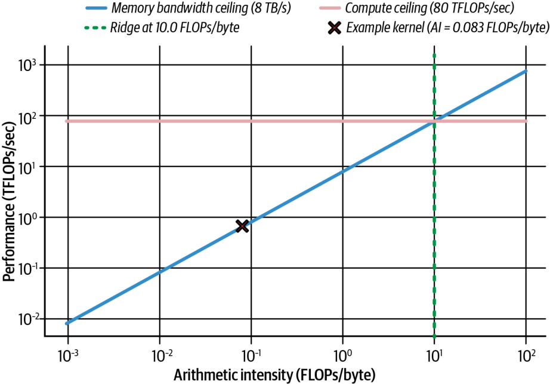


One simple way to make the kernel less memory bound is to use lower-precision data. For instance, if you used 16-bit floats (FP16) instead of 32-bit (FP32), you’d halve the bytes transferred per operation and instantly double the FLOPs/byte intensity.

让核函数不那么访存受限的一个简单办法，是使用更低精度的数据。例如，如果你用 16 位浮点数（FP16）代替 32 位（FP32），你就能把每次运算传输的字节数减半，并立刻把 FLOPs/byte 强度翻倍。

Modern GPUs also support dedicated 8-bit floating point (FP8) Tensor Cores. Blackwell also introduced native support for 4-bit floating point (FP4) Tensor Cores for certain AI workloads. These further reduce the bytes per operation and increase the FLOPs/byte intensity even more.

现代 GPU 还支持专用的 8 位浮点（FP8）Tensor Core。Blackwell 还为某些 AI 工作负载引入了对 4 位浮点（FP4）Tensor Core 的原生支持。这些都进一步减少了每次运算的字节数，把 FLOPs/byte 强度提升得更多。

For example, Blackwell supports FP8 Tensor Cores (1 byte per value), which doubles throughput and halves memory use relative to FP16. It also supports FP4 (half a byte per value) for some workloads like model inference.

例如，Blackwell 支持 FP8 Tensor Core（每个值 1 字节），相较 FP16 使吞吐翻倍、内存占用减半。它还为诸如模型推理之类的部分工作负载支持 FP4（每个值半字节）。

A single 128-byte memory transaction can carry 32 FP32, 64 FP16, 128 FP8, or 256 FP4 values. Blackwell introduces hardware decompression to accelerate compressed model weights. For instance, models can be stored compressed in HBM, even beyond FP4 compression, and the hardware can decompress the weights on the fly. This effectively increases the usable memory bandwidth further when reading those weights.

单次 128 字节的内存事务可以承载 32 个 FP32、64 个 FP16、128 个 FP8 或 256 个 FP4 值。Blackwell 引入了硬件解压来加速压缩后的模型权重。例如，模型可以以压缩形式存储在 HBM 中（甚至压缩到超过 FP4 的程度），而硬件可以在读取时即时解压这些权重。这在读取这些权重时进一步有效提高了可用的内存带宽。

As such, Blackwell has an architecture advantage for memory-bound workloads like transformer-based token generation. Weights are stored in a compressed 4-bit or 2-bit scheme and decompressed by hardware at load time and cast to FP16/FP32 for higher-precision aggregations and computations. This shows how lower precision can reduce the amount of data transferred, increase arithmetic intensity for your kernel, and improve overall memory throughput for your workload.

因此，对于像基于 transformer 的 token 生成这类访存受限的工作负载，Blackwell 具有架构上的优势。权重以压缩的 4 位或 2 位方案存储，在加载时由硬件解压，并转换为 FP16/FP32 以进行更高精度的聚合与计算。这展示了更低精度如何能减少传输的数据量、提高核函数的算术强度，并改善你工作负载的整体内存吞吐。

For memory-bound workloads, the goal is to push the kernel’s operational point to the right on the roofline to increase its arithmetic intensity and move closer to becoming compute bound. By moving closer to the compute-bound regime, your kernel can better exploit the GPU’s full floating-point horsepower.

对于访存受限的工作负载，目标是把核函数的运算点在 Roofline 上向右推，以提高其算术强度，并向计算受限靠拢。通过更接近计算受限区间，你的核函数就能更好地利用 GPU 全部的浮点马力。

> Transformer-based models (e.g., LLMs) can be both compute bound and memory bound in different phases. For example, attention layers (prefill phase) are typically compute bound, while matrix multiplications (decode phase) are often memory bound. We will discuss this more in Chapters 15–18 when we dive deep into inference.

> 基于 transformer 的模型（例如 LLM）在不同阶段既可能是计算受限的，也可能是访存受限的。例如，注意力层（预填充阶段）通常是计算受限的，而矩阵乘法（解码阶段）往往是访存受限的。我们将在第 15–18 章深入探讨推理时对此展开更多讨论。

When a kernel is memory bound, Nsight Compute will report very high DRAM bandwidth utilization alongside low achieved compute metrics such as low ALU utilization. This indicates that warps spend most of their time stalled on memory accesses.

当核函数是访存受限时，Nsight Compute 会报告非常高的 DRAM 带宽利用率，同时报告较低的实际算力指标，例如较低的 ALU 利用率。这表明 warp 把大部分时间都花在了因内存访问而停顿上。

To drill into what’s happening, it’s best to use Nsight Compute for per-kernel counters, including latencies, cache hit rates, and warp issue stalls. In addition, modern versions of Nsight Compute have range replay (with instruction-level source metrics), improved source correlation navigation, and a launch-stack size metric. These features help diagnose dependency stalls, register pressure, and launch configuration effects more quickly.

要深入了解正在发生什么，最好使用 Nsight Compute 来获取每核函数的计数器，包括延迟、缓存命中率和 warp 发射停顿。此外，现代版本的 Nsight Compute 具备范围重放（range replay，带指令级源码指标）、改进的源码关联导航以及启动栈大小指标。这些特性有助于更快地诊断依赖停顿、寄存器压力和启动配置的影响。

You can then use Nsight Systems for a holistic timeline view showing GPU idle gaps, overlap with CPU work, and PCIe/NVLink transfers. Together they give you both the *why* (which stalls and which resources) and the *when* (how those stalls fit into your application’s overall execution.)

随后你可以用 Nsight Systems 获取一个整体的时间线视图，展示 GPU 空闲间隙、与 CPU 工作的重叠，以及 PCIe/NVLink 传输。二者结合能同时给你*为何*（是哪些停顿、哪些资源）和*何时*（这些停顿如何嵌入你应用的整体执行）。

The key is to iteratively profile and identify memory hotspots using metrics from both Nsight Compute and Nsight Systems. You should add NVTX ranges around suspect code, zoom in on timeline behavior, and use the feedback to optimize.

关键在于借助 Nsight Compute 和 Nsight Systems 两者的指标，迭代地进行剖析并识别内存热点。你应当在可疑代码周围添加 NVTX 区域，放大观察时间线行为，并利用反馈进行优化。

For instance, you can use NVTX to label regions as “memory copy” or “kernel execution” and see them in the Nsight Systems timeline. This is incredibly useful to confirm overlapping host-device transfers with compute, as discussed earlier.

例如，你可以用 NVTX 把区域标注为“内存拷贝”或“核函数执行”，并在 Nsight Systems 时间线上查看它们。如前所述，这对于确认主机-设备传输与计算的重叠极其有用。

For instance, to verify the overlap, you can mark the start/end of both the data transfer and kernel calls with NVTX markers. Nsight Systems will show these NVTX ranges on a timeline, making it easy to see overlap. With asynchronous memory copies (cudaMemcpyAsync), the data transfer overlaps with kernel execution on the GPU (see Figure 6-22), comparing a synchronous and asynchronous memory transfer.

例如，为了验证重叠，你可以用 NVTX 标记来标注数据传输和核函数调用两者的起止。Nsight Systems 会在时间线上显示这些 NVTX 区域，让重叠一目了然。借助异步内存拷贝（cudaMemcpyAsync），数据传输会与 GPU 上的核函数执行相重叠（见图 6-22），该图对比了同步和异步的内存传输。

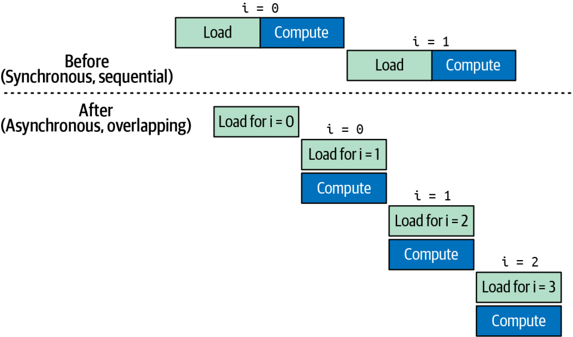


If you expect overlap but see the copies and kernels running sequentially versus parallel, then it’s something like an unwanted default-stream synchronization. Otherwise, a missing pinned-memory buffer is likely preventing true overlap.

如果你期望出现重叠，却看到拷贝和核函数是串行而非并行运行，那么问题多半类似于一次意外的默认流同步。否则，很可能是缺失了固定内存缓冲区，从而阻止了真正的重叠。

> Without using pinned (page-locked) memory, the cudaMemcpyAsync transfer cannot overlap with kernel execution. This is a common performance issue.

> 如果不使用固定（页锁定）内存，cudaMemcpyAsync 传输就无法与核函数执行相重叠。这是一个常见的性能问题。

When you suspect a kernel is starved for data, start by running it under Nsight Compute and Nsight Systems. In Nsight Compute you’ll see the global load efficiency metric drop. This signals that your DRAM requests aren’t being satisfied quickly enough. At the same time, the Nsight Systems timeline will reveal idle stretches between kernel launches as the GPU waits on data transfers.

当你怀疑某个核函数因数据不足而“饥饿”时，先在 Nsight Compute 和 Nsight Systems 下运行它。在 Nsight Compute 中你会看到全局加载效率（global load efficiency）指标下降。这标志着你的 DRAM 请求没有被足够快地满足。与此同时，Nsight Systems 时间线会揭示出核函数启动之间、GPU 等待数据传输时的空闲区段。

Once you’ve applied the memory-hierarchy optimizations from this chapter, those idle gaps will all but disappear, and Nsight Compute will show memory pipe utilization percentage climbing toward its peak. You’ll also see a corresponding jump in end-to-end kernel throughput.

一旦你应用了本章的内存层级优化，那些空闲间隙将几乎全部消失，而 Nsight Compute 会显示内存管线利用率百分比向峰值攀升。你还会看到端到端核函数吞吐相应地跃升。

> Always measure after each change. Profiling tools will confirm if an optimization actually reduces memory stalls or not.

> 每次改动之后都要测量。剖析工具会确认某项优化究竟是否真的减少了内存停顿。

## Key Takeaways

## 关键要点

In this chapter, you learned how to choose launch parameters that optimize occupancy, manage GPU memory asynchronously, and apply roofline analysis to distinguish compute-bound from memory-bound kernels. Here are some key takeaways worth reviewing:

在本章中，你学习了如何选择能优化占用率的启动参数、如何异步管理 GPU 内存，以及如何应用 Roofline 分析来区分计算受限与访存受限的核函数。以下是一些值得回顾的关键要点：

*SIMT execution model*

*SIMT 执行模型*

GPUs execute threads in warps (32 threads) under the single-instruction, multiple thread (SIMT) model, with each warp issuing instructions in lockstep. High occupancy—keeping many warps in flight—hides memory and pipeline latency.

GPU 在单指令多线程（SIMT）模型下以 warp（32 线程）为单位执行线程，每个 warp 以锁步方式发射指令。高占用率——即保持大量 warp 处于在飞状态——能隐藏内存和流水线延迟。

*Thread hierarchy: threads → locks → grids*

*线程层级：线程 → 线程块 → 网格*

Threads are grouped into thread blocks (up to 1,024 threads), and thread blocks form a grid to scale across millions of threads without code changes. Synchronization (__syncthreads() or cooperative groups) enables data reuse in shared memory but incurs overhead, so minimize barriers.

线程被分组为线程块（最多 1,024 个线程），而线程块又组成网格，从而无需修改代码即可扩展到数百万个线程。同步（__syncthreads() 或 cooperative groups）能在共享内存中实现数据复用，但会带来开销，因此要尽量减少屏障。

*Occupancy versus resource limits*

*占用率与资源上限*

Choose block sizes as multiples of 32 to avoid underfilled warps and maximize scheduler utilization. Be mindful of per-SM limits. For Blackwell, the maximum registers per thread is 255, maximum per-SM shared memory is 228 KB, maximum resident warps is 64, and maximum resident thread blocks is 32.

将线程块大小选为 32 的倍数，以避免 warp 填不满并最大化调度器利用率。要留意每 SM 的上限。对于 Blackwell，每线程最大寄存器数为 255，每 SM 最大共享内存为 228 KB，最大常驻 warp 数为 64，最大常驻线程块数为 32。

*CUDA kernel-launch parameters*

*CUDA 核函数启动参数*

Start with threadsPerBlock = 256 (8 warps) for a balance of occupancy and resource use; compute blocksPerGrid = (N + threadsPerBlock – 1) / threadsPerBlock to cover all elements. Tune these values based on profiling feedback (register/register spilling, shared-memory usage, achieved occupancy).

从 threadsPerBlock = 256（8 个 warp）开始，以兼顾占用率与资源使用；计算 blocksPerGrid = (N + threadsPerBlock – 1) / threadsPerBlock 以覆盖所有元素。根据剖析反馈（寄存器/寄存器溢出、共享内存用量、实际占用率）来调优这些数值。

*Asynchronous memory management*

*异步内存管理*

Prefer cudaMallocAsync/cudaFreeAsync on dedicated streams and leverage CUDA memory pools to avoid global synchronizations and OS-level overhead. PyTorch’s caching allocator follows a similar pattern for efficient tensor allocations and avoids costly cudaMalloc() and cudaFree() invocations.

优先在专用流上使用 cudaMallocAsync/cudaFreeAsync，并利用 CUDA 内存池来避免全局同步和操作系统层面的开销。PyTorch 的缓存分配器遵循类似的模式来高效分配张量，并避免代价高昂的 cudaMalloc() 和 cudaFree() 调用。

*GPU memory hierarchy*

*GPU 内存层级*

Registers → L1/shared → L2 → global (HBM3e) → host: each level trades capacity for latency/bandwidth. Maximize data reuse in registers and shared/L1 cache.

Registers → L1/shared → L2 → global (HBM3e) → host：每一层都以容量换取延迟/带宽。要在寄存器以及共享内存/L1 缓存中最大化数据复用。

*Unified Memory considerations*

*统一内存的考量*

CUDA Managed Memory (Unified Memory) simplifies programming but can incur implicit page migrations; use cudaMemPrefetchAsync and memory advice to avoid surprise stalls.

CUDA 托管内存（统一内存）简化了编程，但可能引发隐式的页迁移；使用 cudaMemPrefetchAsync 和内存建议来避免意外的停顿。

*Roofline model analysis*

*Roofline 模型分析*

Arithmetic intensity (FLOPS per byte) determines whether a kernel is memory bound or compute bound. Use lower precision (FP16/FP8/FP4 and hardware decompression) to boost FLOPS/byte ratio and push kernels toward the compute roofline. Profile with Nsight Compute (per-kernel metrics) and Nsight Systems (timeline) to identify and eliminate memory stalls. Using TMEM with Blackwell unified matrix-multiply-accumulate (UMMA) can shift kernels from memory-bound to compute-bound when combined with FP8 and FP4. We’ll cover UMMA in more detail in Chapter 10.

算术强度（每字节的 FLOPS）决定了一个核函数是访存受限还是计算受限。使用更低精度（FP16/FP8/FP4 以及硬件解压）来提升 FLOPS/byte 比值，把核函数推向计算屋顶线。用 Nsight Compute（每核函数指标）和 Nsight Systems（时间线）进行剖析，以识别并消除内存停顿。在 Blackwell 上，将 TMEM 与统一矩阵乘累加（unified matrix-multiply-accumulate，UMMA）结合，再配合 FP8 和 FP4，可以把核函数从访存受限转变为计算受限。我们将在第 10 章更详细地介绍 UMMA。

## Conclusion

## 结语

This chapter has laid the groundwork for high-performance CUDA development by demystifying the GPU’s SIMT model, thread hierarchy, and multilevel memory system. Remember that occupancy, the ratio of active warps to the theoretical GPU maximum, is important for latency hiding.

本章通过揭开 GPU 的 SIMT 模型、线程层级和多级内存系统的神秘面纱，为高性能 CUDA 开发打下了基础。请记住，占用率——即活跃 warp 数与理论 GPU 最大值之比——对于延迟隐藏很重要。

However, maximizing occupancy does not guarantee best performance in every case. GPUs can often achieve very high throughput at moderate or even low occupancy if threads have sufficient instruction-level parallelism (ILP)—or if other resources are the bottleneck.

然而，最大化占用率并不能在每种情况下都保证最佳性能。如果线程具备充足的指令级并行（ILP）——或者如果其他资源才是瓶颈——GPU 往往能在中等甚至较低的占用率下实现非常高的吞吐。

While higher occupancy helps to hide latency, there are scenarios in which reducing the number of active threads will free up registers for other threads. This allows more computations per thread—and ultimately boosts throughput. Always benchmark different occupancy levels to find the optimal setting for your workload and hardware.

虽然更高的占用率有助于隐藏延迟，但在某些场景下，减少活跃线程数反而能为其他线程腾出寄存器。这允许每个线程执行更多计算——并最终提升吞吐。请务必对不同的占用率水平进行基准测试，以便为你的工作负载和硬件找到最优设置。

With these fundamentals and profiling techniques in hand, you’re now ready to dive into targeted optimizations such as avoiding warp divergency, exploiting the GPU memory hierarchy, and asynchronously prefetching memory. We’ll also dive into the TMA, which handles bulk memory transfers and frees up the GPU to focus on useful work and increase computational goodput.

有了这些基础知识和剖析技术，你现在已经准备好深入研究有针对性的优化了，例如避免 warp 分歧、利用 GPU 内存层级，以及异步预取内存。我们还将深入探讨 TMA，它负责处理批量内存传输，从而解放 GPU，让它专注于有用的工作并提高计算有效吞吐（goodput）。
