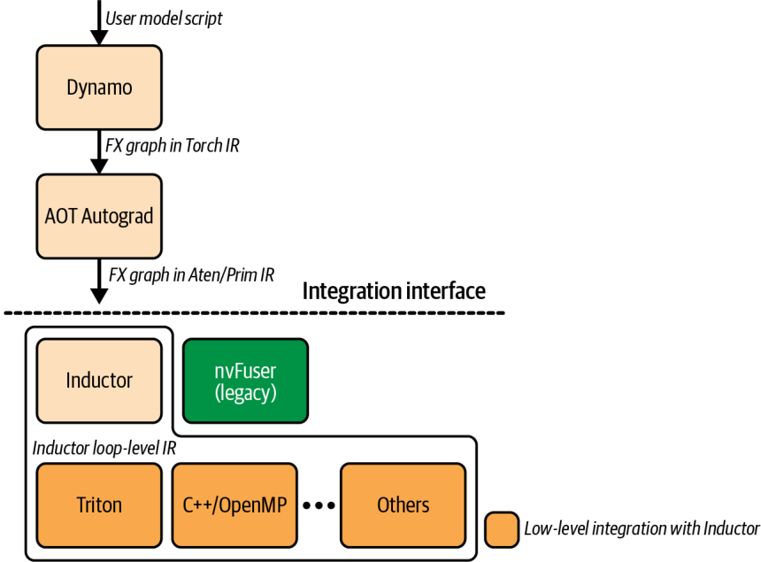
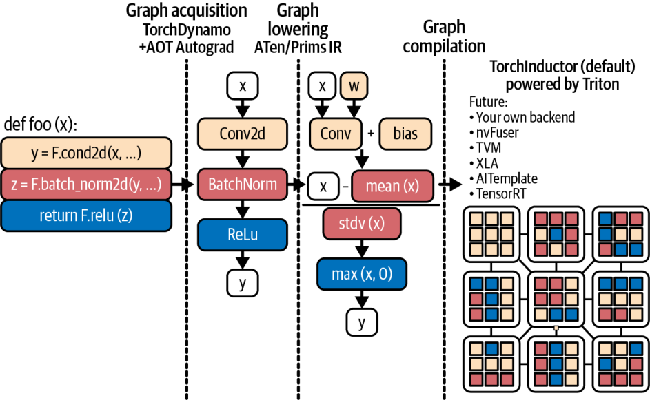
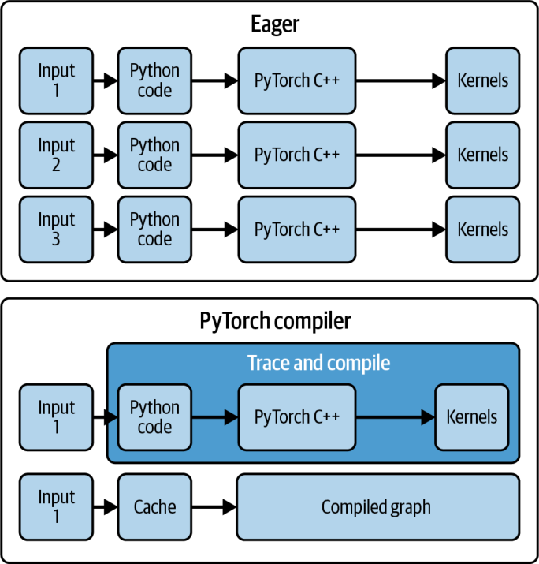
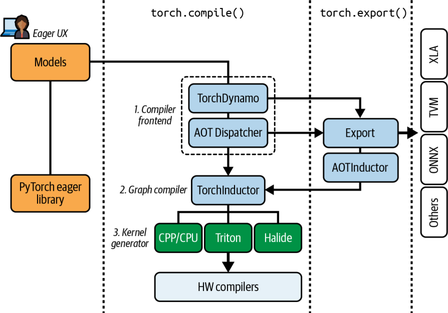
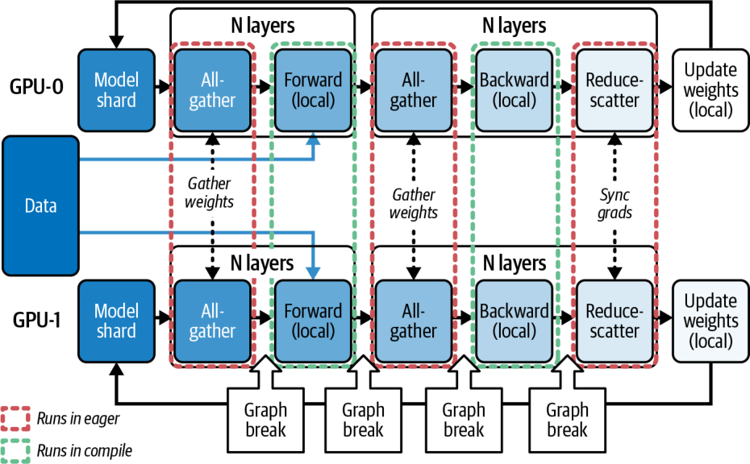
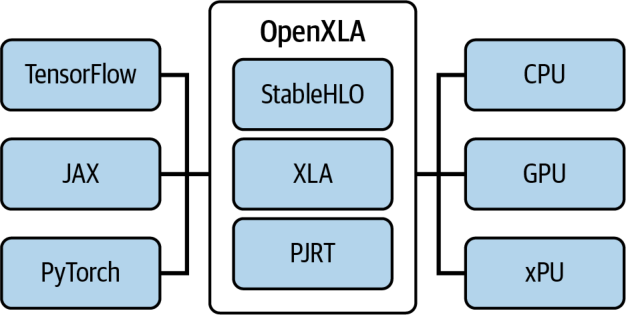

# 第 14 章 PyTorch 编译器、OpenAI Triton 与 XLA 后端

在第 13 章中，我们讨论了优化与调优基于 PyTorch 的训练和推理工作负载的多种方法，并简要介绍了 PyTorch 编译器，以及它如何自动完成核函数融合（kernel fusion）等核函数级技术，从而在几乎不改动代码的情况下提升性能。

本章我们将深入这套动态的 PyTorch 编译栈，涵盖 TorchDynamo、提前自动微分（Ahead-of-Time Autograd，AOT Autograd）、PrimTorch 中间表示（intermediate representation，IR）（又称 *Prims* 或 *Prims IR*）等组件，以及 TorchInductor、加速线性代数（Accelerated Linear Algebra，XLA）、OpenAI 的 Triton 生态等编译器后端（compiler backend）。PyTorch 编译栈如图 14-1 所示。

我们还会介绍用于调试编译流水线的工具，以及在多 GPU、多节点集群上扩展 PyTorch 的库。随后，我们将探究 torch.compile 的底层工作原理，以及如何高效处理动态形状（dynamic shapes）与可变序列长度。

我们还将考察 PyTorch 编译器与 OpenAI Triton 生态的集成。我们的目标是在不牺牲 PyTorch 灵活的即时执行（eager execution）开发体验的前提下，加速并扩展我们的 PyTorch 模型与应用。



## PyTorch 编译器深入剖析

正如第 13 章所述，PyTorch 的 torch.compile 会编译你的 PyTorch 代码（以及模型），带来显著的加速。多数情况下，只需一行代码即可完成，如下所示。我们会在后文逐步讲解各种选项：

```
compiled_model = torch.compile(model,
  mode="max-autotune",
#  ...
)
```

本节拆解 PyTorch 编译流水线的各个步骤，包括 TorchDynamo 的图捕获、AOT Autograd 对前向/反向图的联合优化、PrimTorch IR，以及 TorchInductor 的代码生成（code generation）。这条流水线负责为目标 GPU 硬件生成优化后的核函数，如图 14-2 所示。



### 用于字节码捕获与图提取的 TorchDynamo

TorchDynamo（简称 Dynamo）是 torch.compile 的第一个阶段。它挂接到 Python 的帧求值（frame-evaluation）机制中，在字节码层面拦截模型执行。

Dynamo 挂接到 CPython 的帧求值机制，识别出会产生张量的字节码区域，并为这些区域构建执行图，然后用所选后端执行编译后的图。不受支持的代码则留待以即时执行方式运行。

正是这种拦截与重写机制，使 TorchDynamo 能够把一连串 PyTorch 操作捕获为图表示，以便后续步骤——即接下来几节介绍的 AOT Autograd 与 PrimTorch IR——对其进行优化。

TorchDynamo 利用 CPython 帧求值 API（PEP 523）以最小的开销安全地捕获操作。通常，Python 解释器会逐个执行每个操作；但启用 Dynamo 后，解释器会把执行重定向到 Dynamo，由它先将张量操作聚合成图，再执行。这样便能进行核函数融合之类的全图优化，从而减少每个操作的 Python 及主机端开销。

编译后的图可以把许多操作融合进一个或少数几个核函数，而不必为每个操作都启动一个新的 GPU 核函数并承担逐操作的 Python 开销。这减少了分派开销，并改善了内存访问模式。

在第 13 章中，我们看到 Python 开销与大量小操作会成为模型的瓶颈；也看到 TorchDynamo 通过在可能时把小操作合并成更大的单元来解决这一问题——前提是这一串操作对图友好，且不会引发过多图中断（graph break）。

当 torch.compile 启用 TorchDynamo 后，它会检查每一条 Python 字节码指令。每当遇到 PyTorch 张量操作（如算术运算或神经网络层）时，它并不立即执行，而是把该操作作为一个节点追加到 FX 图（FX graph）中，并将已捕获区域的执行推迟给编译后端。TorchDynamo 会持续这一过程，直到遇到它无法处理的代码。此时便发生一次图中断（稍后详述），不受支持的操作则以常规的、未编译的即时执行模式（eager mode）运行。

TorchDynamo 会尽量把你程序中尽可能大的部分编译进单个图，但当遇到不受支持的结构（如复杂的控制流或非 PyTorch 库调用）而无法继续时，它会回退到 Python 即时执行。这样做是为了保证正确性。

在一段不受支持的操作结束之后，Dynamo 会从该点起把后续操作重新捕获进一个新图。这种编译与非编译混合执行的方式让你兼得两者之长：在需要之处保留 PyTorch 的灵活性，而将其余部分统统编译以换取速度。

> 应尽可能避免图中断，因为它们会打断全图优化，并限制编译器带来的性能收益。

你可以使用 torch.compiler.set_stance("fail_on_recompile") 强制 Dynamo 抛出错误，以捕捉不安全的重新编译（recompilation）。它会记录重新编译的原因，帮助你调试图中断，让你能够充分了解图为何被拆分。代码如下所示：

```
// fail on graph breaks, recompiles
torch.compiler.set_stance("fail_on_recompile")
compiled_model = torch.compile(model,
  mode="max-autotune",
  ...
)
```

这样，你就可以重构导致中断的代码路径——或者用 torch._dynamo.allow_in_graph() 把它们标记为预期中的图边界，后文会讲到。一旦图变得干净，你就可以切回 torch.compiler.set_stance("eager_on_recompile")。请记住，改回该设置后，若随后发生图中断，TorchDynamo 会静默地回退到即时执行模式。

TorchDynamo 捕获的产物称为你代码的 *FX 图*。FX 是一种中间表示（IR），其中每个节点都是对某个 PyTorch aten 算子或内置 Python 函数的调用。例如，考虑一个简单的 Python 函数，如下所示：

```
def f(x, y):
    z = x.sin() + y
    return z.sum()
```

此时，TorchDynamo 会生成一个大致等价于以下伪代码的 FX 图：

```
graph():  # pseudo-code for FX IR
    %x : Tensor = Placeholder[target=x]
    %y : Tensor = Placeholder[target=y]
    %sin : Tensor = torch.sin(%x)
    %add : Tensor = torch.add(%sin, %y)
    %sum : Tensor = torch.sum(%add)
    return %sum
```

这些 FX 图节点对应于 Placeholder 输入以及对 aten::sin、aten::add、aten::sum 等原始 ATen 操作的调用，清晰地表示了计算图结构。一旦构建完成，该 FX 图便交给 AOT Autograd，以进行前向与反向传播的联合追踪。

AOT Autograd 生成的前向与反向合并追踪随后被送往 TorchInductor 或 XLA 等后端编译器，以执行核函数融合并生成优化后的设备代码。TorchDynamo 自身则保持与框架无关，专注于准确、低开销的图捕获，并把所有繁重的优化都交给下游的编译器阶段。

TorchDynamo 会在影响图追踪的 Python 值上插入保护条件（guard）——例如张量形状、dtype，甚至全局变量。这些保护条件确保：如果某个被假定为常量的东西（如张量形状或 dtype）发生变化，编译后的图便会失效，并在必要时重新编译。这样便能稳健地处理动态形状与模型改动——代价是在假设被违反时会产生额外的重新编译。

> 建议在使用 PyTorch 编译器时监控图重新编译的次数。

在默认的 dynamic=None 下，编译器会根据观察到的形状进行特化（specialization）。当遇到动态形状时，它会重新编译一个更具动态性的核函数；如果之后又检测到新的动态来源，还可能再次重新编译。

实际上，这意味着在第一个变化形状的输入上你会看到一次额外编译——而且只有一次额外编译。如果你已经知道哪些输入维度会变化，可以在运行模型之前使用 torch._dynamo.mark_dynamic(tensor, dim)，从而提前避免这次初始编译。

你还可以用 torch.compiler.set_stance() 进一步调整编译器的“立场”（stance），以改变 TorchDynamo 何时以及如何回退到即时执行或重新编译。立场决定了编译器在面对错误或回退时的容忍度或严格程度，让你能更好地在开发者反馈与不间断执行之间权衡。以下是撰写本文时可用的立场：

default 编译器会尽量编译它能编译的部分，遇到不受支持的代码时静默回退到即时执行。这是标准的默认设置，产生正常的编译行为与回退。

fail_on_recompile 一旦遇到图中断或不受支持的操作，编译器就抛出错误。这在开发阶段很有用，便于你捕捉意外的中断或未编译的代码路径。

eager_on_recompile 当需要重新编译时，以即时执行模式运行代码。如果已有编译后的代码被缓存（且对该输入有效），则仍应使用它。

force_eager 使用即时执行模式，并忽略所有 torch.compile 指令。

通过捕获整段操作序列，TorchDynamo 能够执行核函数融合之类的全图优化，从而减少启动开销并尽量减少内存搬运。它还消除了这些被融合操作的 Python 层开销。图 14-3 对比了即时执行与编译两种模式，也包括编译器缓存。

编译器可以把许多操作融合进单个核函数，而不必分别执行每个小操作和每次核函数启动。这减少了 CPU–GPU 同步点，并改善了内存局部性。否则，GPU 会被大量细粒度操作、繁重的同步以及过多的全局内存访问拖成瓶颈。



TorchDynamo 会持续捕获，直到需要一次图中断为止。图中断可能由不受支持的 Python 结构触发（如某些控制流，例如使用 Python bool 而非张量操作的 if 语句），也可能由不受支持的操作触发。发生图中断时，当前图段结束，Dynamo 对无法捕获的代码回退到即时执行模式。之后，一旦回到可追踪的代码，TorchDynamo 就会开始一段新的图追踪。

你可以把逻辑表达为纯 PyTorch 张量操作（包括配合掩码使用的 torch.where()），从而在 PyTorch 中成功实现对编译器图友好的条件判断。下面这个例子用纯张量操作的掩码方式替换了一个对图不友好的 Python if 语句：

```
# Compute a boolean mask from a data-dependent tensor condition
# mask shape (batch_size,1) broadcastable to x’s
mask = x.sum(dim=1, keepdim=True) > 0
# Use torch.where to select element-wise between two tensor expressions
# picks f(x) where mask is True, otherwise g(x)
out = torch.where(mask, f(x), g(x))
```

这样就避免了会引发图中断的 Python if x.sum() > 0: 语句，做法是完全停留在 PyTorch 对图友好的张量操作之内。在这种情况下，TorchDynamo 会捕获整段序列，包括掩码和 torch.where()，而不会中断图。

随着每次新版本发布，PyTorch 都会扩充可在不引发图中断的情况下被捕获的操作范围。例如，torch.cond 这类高级条件原语可以在图中捕获某些 if/else 逻辑。具体来说，两个分支都会被追踪并编译。torch.cond 要求一个布尔标量谓词；两个分支必须返回相同的结构与 dtype；并且形状在运行时必须一致。依赖数据的分支往往会导致图中断。

> 建议通过用 torch.where() 等张量操作重构代码来尽量减少图中断，从而最大化 TorchDynamo 能够捕获的连续区域。

### AOT Autograd 对前向与反向传播的融合

一旦 TorchDynamo 为尽可能多的前向传播捕获了 FX 图，下一个编译器阶段便是 AOT Autograd。AOT Autograd 会以“函数式”模式让 Dynamo 捕获的前向图通过 PyTorch 的自动微分引擎运行，以记录反向操作。静态反向图正是这样产生的（这与依赖 PyTorch 默认自动微分引擎逐个执行反向传播操作形成对比）。

本质上，AOT Autograd 会生成一个联合的前向–反向图，随后便可作为整体进行优化与融合。而且它保证前向与反向结果与即时执行模式一致。

AOT Autograd 的工作方式是让前向图通过自动微分引擎进行追踪，以捕获梯度计算。它实际上会用 torch.autograd.forward_ad（或类似技术）运行前向图，记录反向计算所需的操作。其结果是一个前向与反向合并的图。这个合并图随后可以用公共子表达式消除（common-subexpression elimination）等手段优化，之后再由 TorchInductor 或 XLA 等后端编译。

通过提前规划前向与反向，PyTorch 编译器可以整体地跨越前向与反向传播的边界进行融合。这带来了跨这两个阶段的操作的提前融合。例如，它可以在可能时把前向传播中的一个逐元素操作与反向传播中相应的逐元素梯度计算融合进同一个核函数。

在安全的情况下，编译器还可以通过在前向与反向计算之间复用中间结果来消除开销。对于反向操作可能主导整体运行时间的模型训练工作负载来说，这能大幅提升性能。

若没有 AOT Autograd，PyTorch 就需要用默认的 PyTorch 自动微分引擎单独执行每个反向操作——与前向传播相互独立。有了 AOT Autograd，执行图便得到整体优化。

AOT Autograd 产生的联合图保证计算出相同的结果（这也是为什么当图无法保证正确性时需要图中断的原因）。由于前向与反向的整段操作序列都已知，这个联合图可以被进一步优化。

通过跨前向与反向传播融合操作和内存使用，我们减少了内存访问与核函数启动开销。当你对涉及梯度的操作和工作负载（如模型训练）调用 torch.compile 时，PyTorch 的编译模式会在底层自动使用 AOT Autograd。

简而言之，torch.compile 利用 AOT Autograd 在模型训练期间提前计算梯度。它能无缝处理大多数自动微分操作，并保证结果与即时执行模式一致；它还跨前向与反向传播复用缓冲区，以降低峰值内存占用。虽然这个阶段对最终用户基本不可见，但它是让现代 AI 模型训练工作负载获得大幅加速的关键组件。

### PrimTorch IR（Prims）精简算子集

在把图交给底层代码生成器之前，PyTorch 会执行一次中间表示变换，在部分文档和源码中称为 PrimTorch IR。PrimTorch IR 是一种把图中操作的种类精简为一小组核心“原始”操作的 IR，这也是 *PrimTorch* 这一名称的由来。

作为背景，PyTorch 的完整 API 拥有数千（> 2,000）个操作。PrimTorch IR 把它精简为一组小得多的原始操作，让编译器可以聚焦其上。实际上，PrimTorch IR 定义了约 250 个原始操作，如基本算术、归约、复制、reshape 等。

许多复杂或高级的 PyTorch aten 操作都可以借助 PrimTorch IR 分解（decomposition）为这些原始操作。例如，像 x.add_(y) 这样的“原地”PyTorch 操作会被下降（lowering）为一次函数式 add，再跟一次显式地复制回 x 存储的操作，如下所示：

```
%z    = aten::add(x, y)
%copy = aten::copy_(x, %z)    # writes z’s data into x
```

这里，IR 中包含一个独立的 aten::copy_ 节点，而不是某种特殊的原地变更。这使所有张量更新都变得显式，并通过把变更当作普通的复制操作来简化下游的编译器核函数。

具体而言，通过把原地变更转换为函数式操作外加独立的复制节点，编译器就不必再推理别名或隐藏的副作用。因此，融合过程与内存规划算法可以在纯函数式的数据流上运作，这就允许更激进的核函数融合以及可预测的高性能代码生成。

PrimTorch IR 还有助于消除图中的别名和变更等问题。它会尽可能把操作转换为不执行原地更新的形式，因为这些原地更新会使优化复杂化。PrimTorch IR 这一处理阶段的输出是一个只包含 aten IR 与 PrimTorch IR 操作的 FX 图。随后，该 FX 图便可交由后端进行下降。

通过这种 IR 标准化，PrimTorch IR 为编译器后端提供了一个稳定、简化的目标接口。像 TorchInductor 这样的后端无需实现成千上万个 PyTorch 操作，只需支持那 250 个原始操作即可——其他更高级的操作都由这些原始操作派生而来。这大大降低了复杂度。

而且，由于大多数高级操作（如 2,000 多个 PyTorch 操作）都能被分解为现有的原始操作，即便 PyTorch 为适配新算法、新模型和新技术而不断新增操作，PrimTorch IR 这组原始操作的集合演进得也相对缓慢。

> 稳定的 PrimTorch IR 接口意味着，例如要支持一款新的加速器，开发者只需实现那 250 个原始操作，而不必实现成千上万个 ATen 操作。

小结一下目前为止的流水线：TorchDynamo 捕获一个图，AOT Autograd 加入反向传播并形成一个联合的前向–反向图，然后 PrimTorch IR 把操作规范化为一组更精简、更原始的集合。到这一步，我们就以核心操作的形式获得了整个计算——包括前向与反向传播——的一个相当标准、与设备无关的表示。现在，让我们转向由编译器后端执行的实际代码生成阶段。

### TorchInductor 后端代码生成

torch.compile 栈的最后一个阶段是编译器后端。TorchInductor（简称 Inductor）是 PyTorch 的默认编译器后端。Inductor 接收由 aten 与 PrimTorch IR 操作组成的、经过优化并合并的前向与反向 FX 图，为目标硬件（包括 NVIDIA GPU、AMD GPU、CPU 等）生成高性能代码。

> XLA 是一个面向非 CUDA 硬件的备选后端。它主要通过 OpenXLA 项目用于 Google Cloud TPU，但也可以支持其他采用 XLA IR 的加速器。例如，Meta 自研的推理 ASIC——Meta 训练与推理加速器（Meta Training & Inference Accelerator，MTIA）就使用 XLA。此外，AWS 定制的 Inferentia 与 Trainium 加速器芯片在其开源的 AWS Neuron SDK 中通过 XLA 编译器运行 PyTorch。不过，NVIDIA GPU 通常使用 TorchInductor。

TorchInductor 的工作方式是把图 *下降* 为一种循环级、随运行定义（define-by-run）的 IR，再将其编译为高效代码。在内部，Inductor 把操作表示为对多维数据的循环。它会在可能时自动把 FX 图中的节点分组为融合的循环块，每一组在代码生成时都会成为一个核函数。

Inductor 还支持符号化形状（symbolic shapes），从而允许动态维度。这种 IR 比原生 CUDA 稍高级，因为它把逐元素计算之类的东西表示为对张量索引的循环。该 IR 可供用户检视，有助于调试甚至扩展。

TorchInductor 的 IR 还可用于配合 torch.export() 和 AOTInductor 的提前编译流程。AOTInductor 会编译由 torch.export 产生的产物，用于打包和部署等 AOT 场景，从而可以跨多次运行保存并复用编译后的代码。图 14-4 在 torch.compile() 的语境中突出展示了导出流程。



对于 NVIDIA GPU 后端，TorchInductor 使用 OpenAI 的 Triton JIT 编译器来生成实际的 GPU 核函数。Triton 是一种用 Python 编写的、类似 CUDA 的领域特定语言（domain-specific language，DSL）。Triton 还包含针对其 DSL 的编译器（稍后我们会更多地介绍 Triton）。

TorchInductor 会把它的循环级 IR 翻译成 Triton 代码，然后用 Triton 编译器借助 LLVM 直接把 Triton 代码转换为 NVIDIA PTX。请记住，PTX 是 NVIDIA 为其 GPU 设计的底层指令集架构（instruction set architecture，ISA）。

> 重要的是，Triton 使用 LLVM NVPTX 下降到 NVIDIA PTX，而不会调用 NVCC 来编译核函数。这种方式让 TorchInductor 能够即时生成为你特定模型或算法量身定制的自定义核函数。

循环级 IR 用 Python 实现，因而易于检视和扩展。例如，假设某个图中有一个操作 z = x.permute(1,0) + x[2,:]，Inductor 可能会用下面的 IR 来表示它：

```
def inner_fn(index: List[sympy.Expr]):
    i1, i0 = index  # index variables for dims
    tmp0 = ops.load("x", i1 + i0*size1)         # x[i1, i0]
    tmp1 = ops.load("x", 2*size1 + i0)          # x[2, i0]
    return ops.add(tmp0, tmp1)                 # elementwise add
torchinductor.ir.Pointwise(
    device=torch.device("cuda"), dtype=torch.float32,
    inner_fn=inner_fn, ranges=[size0, size1]
)
```

这里，size0 和 size1 是输入 x 的各个维度，而 inner_fn 描述了如何计算输出的一个元素。Pointwise 节点表示一个在这些范围上的嵌套循环，它逐元素地应用 inner_fn 来产生输出。

这是一种随运行定义风格的 IR。运行这段 IR，实际上就是在执行进行迭代并调用 ops.load 与 ops.add 的 Python。随后，Inductor 会使用 Triton JIT 编译器和 LLVM 生成对应的 NVIDIA PTX 代码。

> 使用 torch.library.wrap_triton 配合 triton_op，可以把一个 Triton 核函数注册为具备自动微分与伪张量（fake-tensor）支持的一等 PyTorch 算子。这意味着你可以编写一个 Triton 核函数，并让 TorchInductor 把它作为你模型图的一部分来优化。

### 使用 TorchInductor 进行自动调优

TorchInductor 内置了一个基于 Triton 自动调优（autotuning）能力构建的自动调优器（我们将在后面的小节中介绍）。这个自动调优器会为每个生成的 GPU 核函数找到最佳的启动配置。自动调优得到的配置会按核函数分别缓存，使得后续运行无需重做调优步骤。

第一次用 TorchInductor 后端编译代码时，它会花费额外时间，使用不同的块大小、分块大小等对各种核函数变体进行基准测试。Inductor 会挑选最快的变体并在之后一直使用它。核函数自动调优会增加初始的编译时延迟，但由此得到的核函数在运行时高度优化。

> 如果你还记得上一章的内容，这种激进的自动调优被称为 max-autotune 编译器模式。这是最耗时的编译器模式——而这正是其底层所发生的事情。

除了核函数融合与自动调优，TorchInductor 还会施加许多底层优化。这些优化包括：用于减少循环中复杂索引运算的索引化简、生成代码内部的公共子表达式消除，以及用于复用缓冲区、减少分配的高效内存规划。

TorchInductor 还使用 CUDA Graphs 在运行时捕获核函数序列，以极小的 CPU 开销实现更快的图重放。默认情况下，Inductor 会尝试把它生成的核函数包进一个 CUDA Graph，以减少每次迭代的启动开销。这对推理尤其有利——或者在运行任何含有大量核函数的代码或模型时也是如此。

> 第 13 章介绍的 reduce-overhead 与 max-autotune 编译器模式会触发对 CUDA Graphs 的使用。然而，CUDA Graphs 要求静态形状，因此在启用动态形状编译时不会使用它们。换句话说，如果用 dynamic=True 启用了动态形状，TorchInductor 就不会使用 CUDA Graphs。此外，当你需要自动调优但不想进行 CUDA Graph 捕获时，可以使用 max-autotune-no-cudagraphs。一般来说，先从默认模式开始，再用 max-autotune 以可观的编译时间为代价，为大型/关键工作负载提供额外加速。对于较小的模型，你可能看不到太多收益。

TorchInductor 的最终产物是为你的工作负载生成的、高度优化的设备专用代码。在许多情况下，Inductor 能达到接近、甚至超过手工调优库的性能。例如，Inductor 可以把一整串逐元素操作（包括激活和逐点变换）融合进单个核函数；它甚至能把某些“矩阵乘法后接逐元素操作（如 bias-add + 激活）”的模式融合进一次启动。这类工作手工完成相对困难——而且需要持续维护。

PyTorch 编译器使用启发式方法和后端，可能会把某些操作（如大型 GEMM（通用矩阵乘法，general matrix multiply））路由到 cuBLAS/cuBLASLt 或 CUTLASS 等高性能库，甚至能为可融合的模式发出 Triton 核函数。实际上，TorchInductor 会选择并缓存表现最佳——或已知对给定形状最优——的那条路径。

对于 transformer 模型，TorchInductor 会把围绕大型 GEMM 的 layernorm 和残差连接逐元素操作融合起来——同时仍用 cuBLAS 来完成实际的 GEMM 计算本身。或者，对于内存访问不规则的模型，Inductor 的自定义 Triton 核函数可以只做必要的工作，从而胜过现有库的核函数——而这类情形并不能从 cuBLAS 或 CUTLASS 这样的通用库中获益。

在现代 GPU 上，PyTorch 编译器可以配合 NVIDIA 的 Transformer Engine（TE）处理某些 transformer 块和层。不过，当你调用 torch.compile 时，PyTorch 并不会自动替换为 NVIDIA TE 核函数。TE 是一个独立的库，你必须通过它的模块或融合算子显式使用。但当你调用 TE API 时，torch.compile 可以围绕它们进行编译和融合。这与生成的 Triton 核函数相辅相成，以提供最高性能。

> 只有当你打算在模型中直接调用 TE 模块（例如 transformer_engine.pytorch.layers）时，才需要安装 NVIDIA Transformer Engine。torch.compile 不会自动把 TE 核函数替换进一个普通的 PyTorch 模型。

本质上，TorchInductor 承担了把代码和模型转化为高性能 GPU 核函数的繁重工作。随着 PyTorch 的每次发布，硬件覆盖范围在扩大，新的优化技术也在不断涌现。例如，PyTorch 提供了 FlexAttention，这是一个新的注意力算子，TorchInductor 可以把它编译成接近 FlashAttention 性能的融合核函数。具体来说，经测量，FlexAttention 的融合核函数在前向和反向传播中都能达到现代 FlashAttention 性能的至多约 85–90%，同时提供更多灵活性，包括块稀疏（block-sparsity）和自定义掩码。要启用这些快速路径，请把下列 torch.backend.cuda 属性设为 True：

```
# Ensure SDPA fast paths are enabled
torch.backends.cuda.enable_flash_sdp(True)
torch.backends.cuda.enable_math_sdp(True)
torch.backends.cuda.enable_mem_efficient_sdp(True)
```

使用 torch.nn.attention.flex_attention 时，请确保你的输入满足快速路径的约束条件。这样，TorchInductor 才能发出融合的 Triton 核函数。

TorchInductor 和 Triton 在现代 GPU 上支持自动化的 warp 专门化（warp specialization）。编译器会在认为有益时有选择地启用它。warp 专门化可以通过 num_consumer_groups 和 num_buffers_warp_spec 等 Triton 元参数进行调优。这些优化会进一步提升 GEMM 吞吐量。Triton 的自动 warp 专门化在包括 Blackwell 在内的现代 GPU 目标上支持 TMA 和张量描述符 API（例如 tcgen05）。

> 建议使用基于描述符的分块加载/存储来映射到 TMA 并降低寄存器压力。相比手写的 tl.load 循环，这种方法更受推荐。

简而言之，许多模型在使用 torch.compile 后运行得明显更快，尽管确切的收益取决于你模型的特性。第一次运行 torch.compile 时，你要付出编译与自动调优的成本，但后续运行会使用缓存的图和核函数，实现闪电般的执行速度。

### 动态形状与可变序列长度

LLM 训练与推理的一大挑战在于序列输入的尺寸可变。在传统的编译器和加速器中，变化的形状往往会导致重新编译，否则就需要把输入填充到一个固定的公共尺寸。本节讨论 torch.compile 中的动态形状追踪如何处理变长序列。

所幸，PyTorch 编译栈的设计能够优雅地处理动态形状。具体来说，它通过使用 SymPy 库以符号方式表示未知维度，使模型能够接受不同的输入尺寸而无需每次都重新编译，这一点我们稍后会讲到。

如果观察到某些维度的大小发生变化，PyTorch 编译器会自动把它们标记为动态。TorchInductor 一开始采用静态假设，之后若检测到形状可变，便会在重新编译时进行泛化。对于第一个新形状，你通常会看到一次额外编译。通过预先设置 dynamic=True 标志，你会强制编译器从一开始就把所有维度都视为动态。不过请记住，设置 dynamic=True 会禁用 CUDA Graphs。更推荐的做法是只用 torch._dynamo.mark_dynamic() 标记代码中已知会变化的维度。

TorchDynamo 和 TorchInductor 会在追踪动态维度时插入类似 sequence_length <= 256（或你指定的任意范围）这样的保护条件，以生成能适配多种尺寸及尺寸范围的代码。例如，如果某个输出尺寸为 x.size(0) + y.size(0)，Inductor 可以把它表示为一个符号表达式，并确保生成的代码对任何满足保护条件的取值都能工作。

当 Dynamo 遇到 sequence_length 的新形状时，它会设置一个新的保护条件（如 sequence_length <= 1024），并在这个新假设下编译核函数——从那时起把该维度当作动态处理。之后，如果出现更长的序列而违反了该保护条件，编译器会重新编译一个能处理更大范围的新版本图。随着时间推移，它会为每个不同的形状范围逐步积累起一份已编译核函数的缓存。

你也可以用 torch._dynamo.mark_dynamic(tensor, dim) 手动在张量上标记预期的动态维度，以提前避免一次重新编译。你还可以使用 torch.compiler.set_stance()，它让你能够调整如何处理重新编译。例如，你可以使用 eager-on-recompile 立场，在若干次重新编译之后回退到即时执行模式。避免重新编译的最佳实践我们稍后讨论。

TorchInductor 会在首次重新编译之后尝试对形状做泛化处理，而不是针对每一个新形状反复特化。例如，它会在生成的核函数内部用 if 语句发出条件代码，从而让同一个核函数能覆盖一段 sequence_lengths 区间而不报错。这样就减少了为每一种尺寸单独编译的必要。

> 某些具有数据相关输出秩（data-dependent output rank）——或极其复杂索引——的操作，仍可能触发形状特化。在这些情况下，编译器会插入更多保护条件；如果这些保护条件频繁失效，你可能会看到伴随 mark_dynamic() 或 set_stance() 出现的频繁重新编译。

作为背景，一种简单但低效地处理变长序列、又无需支持动态形状的做法，是把所有输入序列填充到批次中的最大长度。这样你就能对所有输入使用同一套静态计算。虽然填充简化了实现，但当输入长度差异很大时它非常低效，因为大量算力被浪费在毫无意义的填充 token 上。

如果最大长度远大于所有输入的平均长度，填充会损害 GPU 利用率。然而借助动态形状编译，我们可以让编译器生成只迭代到每个输入实际序列长度的代码。动态形状让你避免为变长输入做过度填充。

我们来看一个典型的基于文本的生成式 AI 场景：随着生成过程推进，序列长度会不断增长。使用动态形状编译能够持续优于即时执行——即便序列长度不断增加。

相反，如果为了使用静态形状而把所有输入都填充到 2 的幂次长度，就会引入大量被浪费的计算，并因张量尺寸更大而增加编译时间。换句话说，使用动态形状能带来更好的编译期性能与运行期性能，且使用更简单，因为你不必手动填充输入。

> 建议按尺寸对输入分桶（bucket），以限制不同形状的数量。这样就能对剩余的变化范围启用动态形状。这种混合方法既避免了过度的重新编译，又减少了填充浪费。

有了动态形状，你可以只编译一次，然后在不同形状的输入上复用同一个已编译模型。只要这些变化落在支持的范围内，一个已编译模型就能处理多种配置。

在内部，TorchInductor 使用 SymPy 库以符号方式表示动态维度。它会把这些符号沿 IR 传播，从而使 z.size(0) = x.size(0) + y.size(0) 这样的表达式能被符号化地处理。Inductor 会把各种条件归约为保护表达式。

如果某个保护条件因维度落在预期范围之外——或某个数据相关条件发生变化——而失效，Inductor 就会触发一次重新编译。本质上，TorchInductor 试图为一段尺寸区间编译出一个通用核函数，而不是只针对单一固定尺寸。

动态形状在近期版本中已显著改进。不过，如果编译器无法对某些操作做符号化处理，这些操作仍可能强制形状特化。在这种情况下，编译器可能插入更多保护条件；若这些条件频繁失效，就会导致频繁重新编译，从而抵消编译带来的收益。

数据相关的控制流仍会触发特化。对变化的序列长度使用动态形状，但不要用于真正数据相关的分支。

值得注意的是，在撰写本书时，CUDA Graph 回放要求静态形状（以及固定的内存地址）。而且对已实例化的图仅支持有限的参数更新。内存地址与核函数启动拓扑必须与捕获时保持兼容。因此，启用动态形状通常会禁用这些区域的图捕获。这会使编译器无法获得 CUDA Graph 带来的性能收益，包括降低核函数启动开销。

> 如果你指定了 reduce-overhead 编译模式却又设置了 dynamic=True，那么 reduce-overhead 提供的 CUDA Graph 优化将不会生效，因为你已声明形状可以变化。启用动态形状会改变保护条件与内存规划，进而禁用图捕获。实践中，只在形状稳定时使用 mode="reduce-overhead" 以获得 CUDA Graph。对于可变序列长度，优先选择 mode="default" 或 mode="max-autotune-no-cudagraphs"，并在 ±10–20% 范围内分桶/填充以限制重新编译。

建议对你的系统做剖析，判断动态形状对你的用例是否值得启用。在某些情况下，填充到固定尺寸、配合 CUDA Graph 使用静态形状，并通过免去为每个唯一长度重新编译来获得更高吞吐，可能是更好的选择。在另一些情况下，动态形状则更优。

你应当剖析不同的方案，找出最适合你的做法。在这样做时，务必监控内存使用。支持动态形状的代码会因需要额外的保护条件和为最大区间生成的通用代码，而带来略高的内存占用。

> 一条经验法则是：如果你的序列长度只有 10%–20% 的波动，那么定长填充很可能对你更有利。

简而言之，支持动态形状意味着你不必为 LLM 模型中常见的变长输入而禁用 torch.compile。通过支持动态形状，PyTorch 编译器能够跨不同输入尺寸执行核函数融合与其他优化。

### 禁用 PyTorch 编译器并回退到即时执行模式

如果你想在不改动代码的情况下完全禁用 torch.compile——这对性能 A/B 测试和隔离问题很有用——可以用 @torch.compiler.disable 装饰器来禁用该函数的编译。若需区域级作用域控制，可以把 torch.compiler.set_stance() 当作上下文管理器使用。这会强制代码以即时执行模式运行。例如，你可能希望对复杂的数据加载或一次性的初始化逻辑禁用编译，让已编译的图专注于计算部分。这对处理那些与追踪（tracing）配合不佳的代码同样有用，我们稍后会讲到。

或者，你也可以像下面这样直接改用 eager 后端：torch.compile(model, backend="eager")。这会让你的代码回退到即时执行模式运行。这样你就能轻松地在已编译模式与即时执行模式之间调试并比较正确性/性能结果。

torch.compiler.disable() 与 torch.compiler.set_stance() 是宝贵的“逃生舱”，可用于某些操作无法与 PyTorch 编译配合工作——或你仅仅出于性能原因不想让它们进入图中的场景。说到性能，接下来我们就来探讨如何利用 PyTorch 编译器日志改进已编译图与代码的性能。

### 性能提示与调试生成的代码

另一个极其有用、值得启用的日志选项是 TORCH_LOGS="perf_hints"。这些日志会向你展示错失的性能优化机会。例如，如果某个模式无法被融合——或某个 CUDA Graph 无法被使用——它会记录一条提示，如“*PerfHint: CUDA Graph not used because input is mutated*”或“*PerfHint: fell back to eager for random op*”等。这些提示会指引你了解可能限制代码或模型性能的因素。

要做更深入的性能调试与调优，你很可能想看到 TorchInductor 生成的确切代码。有几种方式可以检视这些代码。首先，你可以设置 TORCH_LOGS="output_code" 来打印每个已编译图生成的代码。这会显示所生成核函数的原始源代码。如有需要，你甚至可以修改源代码并进一步优化。

你还可以通过设置 TORCH_COMPILE_DEBUG=1 来启用 TorchInductor 的调试模式。当你在启用调试模式下运行程序时，Inductor 会创建一个调试目录（例如 /tmp/torchinductor_<pid>/...），其中包含 FX 图（.fx）、诸如 outputcode.py、*fx_graph_runnable.py* 等 Inductor 产物、IR 转储，以及生成的 Triton 源代码。

在阅读生成的 .triton 代码时，你可能会注意到 Triton 特有的构造——在高级场景下甚至会看到原始 PTX。如果你还检视调试产物中已编译的 PTX，你可能会在 tl.dot 被下降为张量核心（Tensor Core）操作的地方看到 mma.sync 指令。这些日志、工具和产物对性能调优极其有用，因为它们让你精确看到编译器在做什么。理解这些内容有助于你确认编译器确实应用了核函数融合、warp 专门化或双缓冲（double buffering）等优化。如果你发现了低效之处，就可以针对你的具体用例手动编写一个自定义 Triton 核函数。

> 如果你乐于分享，甚至可以把你的自定义核函数贡献回 PyTorch 与 Triton 生态，因为很可能别人也能从你的优化中受益。

### 调试数值正确性与精度

尽管非常罕见，torch.compile 仍有可能产生与即时执行模式在数值上不同的结果。如果你怀疑编译器存在 bug，在向社区反馈并创建 GitHub issue 之前，有几种策略可用于验证并收集数据。

首先，你可以使用 PyTorch 的 minifier 工具来创建可复现的脚本。PyTorch 提供了 TorchDynamo minifier 工具和 TorchInductor minifier 工具，它们会尝试把你的程序缩减到仍能复现该错误的最小版本。如有需要，为 PyTorch 团队创建一个小巧、可复现的脚本会非常有帮助。若真到了这一步，你就把这个文件附在你的 GitHub issue 上。

此外，你可以配置 TorchDynamo 在编译器栈的每一层调试数值精度。为帮助判断数值差异是在哪里引入的，你可以在编译期间设置以下环境变量，将即时执行模式与不同编译阶段进行比较，从而隔离问题究竟出在 TorchDynamo、AOT Autograd 还是 TorchInductor：

```
# Dump the outputs after each compilation stage
TORCHDYNAMO_REPRO_AFTER="aot"
TORCHDYNAMO_REPRO_LEVEL=4
```

这些设置会让 TorchDynamo 在每个阶段之后转储图——并以即时执行模式运行每个图以作对比。这有助于精确定位是哪个阶段引入了错误。

具体来说，设置 TORCHDYNAMO_REPRO_AFTER="aot" 会告诉 TorchDynamo 在 AOT Autograd 阶段之后转储 FX 图，并触发生成复现该错误脚本的逻辑。这与在最初的 Dynamo 捕获之后生成复现脚本形成对比。

使用 TORCHDYNAMO_REPRO_LEVEL=4，TorchDynamo 会以即时执行模式运行每个被转储的图，并将其输出与已编译版本进行比较。一旦检测到任何数值不匹配，它就会中止并保存一个最小复现脚本。

> PyTorch 编译器团队很乐意修复正确性 bug，所以如果你确实发现了真正的错误，请在 GitHub 上报告该问题。务必通过设置 TORCHDYNAMO_REPRO_AFTER="aot" 和 TORCHDYNAMO_REPRO_LEVEL=4 来附上已最小化的可复现产物集。

如果使用随机数（种子）或随机序列，你应确保它们被一致地生成。默认情况下，TorchInductor 可能不会产生与即时执行模式完全相同的随机种子或序列。原因之一是，被融合或被重排的核函数可能不会按即时执行模式那样预期的顺序生成数字。

如有需要，你可以设置 torch._inductor.config.fallback_random=True，强制 TorchInductor 完全像即时执行模式那样生成随机数。这会带来轻微的性能损失，但在使用 PyTorch 编译器时，为保证数值正确性（numerical correctness）它可能是必要的。

数值差异也可能源自浮点精度。例如，如果你使用 PyTorch 自动混合精度（automatic mixed precision，AMP）或 BF16，融合核函数中的运算顺序可能与即时执行未融合的序列相比引入细微的数值差异。

虽然这类差异很少影响收敛，但在某些情况下确实会。如果你怀疑存在与精度相关的不稳定，可以尝试禁用 torch.compile，并以完整 FP32 运行模型以隔离问题。你还可以使用 torch.set_float32_matmul_precision('highest') 来控制 TF32 的使用，以及在完整 FP32 矩阵乘法与最大数值精度之间权衡精度与性能。

同样重要的是要理解，使用混合精度（例如 FP16/BF16）可能带来细小差异。你可以通过设置 torch.use_deterministic_algorithms(True) 来强制确定性行为。这会使 PyTorch 在使用非确定性操作时抛出错误。虽然 torch.compile 在设计上确实减少了一些非确定性来源，但在调试期间启用此标志仍是良好实践。

不过要记住，并非所有操作都有确定性实现。例如，依赖 cuBLAS 的默认 torch.matmul() 操作就没有确定性实现。

具体来说，cuBLAS 实现依赖 split-K 之类的并行优化，这可能以不同顺序归约操作。其结果是浮点结果在多次运行之间无法按位复现。

因此，启用此设置可能导致你的代码失败，除非存在可用的回退替代方案。要对像 torch.matmul() 这类依赖 cuBLAS 的操作强制完全确定性，你需要调用 torch.use_deterministic_algorithms(True) 并将 CUBLAS_WORKSPACE_CONFIG 设置为固定大小，如下所示：

```
# Set this before starting the Python/PyTorch process
export CUBLAS_WORKSPACE_CONFIG=:4096:8   # or :16:8
# Use this with the PyTorch process
torch.use_deterministic_algorithms(True)
```

这里，第一个值（例如 4096 或 16）选择 cuBLAS 工作区缓冲的字节大小，并舍入到某个内部分桶。第二个值（例如 8）选择保留多少个这样的缓冲。按文档所述设置为 :4096:8 或 :16:8 以强制使用确定性算法。

要在 torch.use_deterministic_algorithms(True) 下强制 cuBLAS 使用确定性算法，请按文档将 CUBLAS_WORKSPACE_CONFIG 设置为受支持的值，如 :4096:8 或 :16:8。如果你强制确定性却不设置此项，PyTorch 会在运行时对那些原本会选择非确定性 cuBLAS 算法的操作抛出错误。

> 请始终在你的实际硬件和模型配置上测试确定性，以确认可复现性。

此外，对于关键工作负载，你可以通过设置诸如 torch._inductor.config.triton.cudagraphs=False 之类的标志，临时禁用某些编译器优化，以便更好地隔离差异的成因。这会禁用对 TorchInductor 生成的 Triton 核函数的 CUDA Graph 捕获。

调试 PyTorch 编译器优化需要略有不同的思维方式，因为除了底层生成的代码之外，你还要透过日志和图可视化审视元层面（meta-level）的执行步骤。像 torch._dynamo.explain() 这样的工具能提供代码如何被转换为图、图中断与子图的高层概览，而各种 TORCH_LOGS 选项则让你得以窥见编译器所做的决策——以及它生成的确切代码。

简而言之，借助这些组合起来的工具与调试机制，你可以迭代地消除图中断，并确保你的模型和代码被完整捕获与优化。这份付出是值得的，因为一个编译良好的模型能显著优于其即时执行的对应版本——尤其是对大型 LLM 架构而言，每一点性能提升都会累积起来。

## 解释与最小化图中断

在使用 torch.compile 时，诊断性能与正确性需要专门的工具。在本节中，我们将向你展示如何使用各种工具与最佳实践来调试并精确定位过多的图中断。这些工具包括 torch._dynamo.explain()、用于记录编译器决策的环境变量，以及调试所捕获的图与它们所生成核函数的最佳实践。

### 图中断与 TorchDynamo explain()

当 TorchDynamo 无法继续把一段连续的操作序列捕获进单个图时，就会发生图中断。发生这种情况时，它会对这部分代码回退到即时执行。

图中断是性能的大敌。每一次中断都意味着一个优化过的图被截断——并引入更多 Python 开销。如果你编译了一个模型却只看到不大的加速，很可能是频繁的图中断阻止了大型融合图的形成。理想情况下，我们希望中断越少越好——最好整个模型或整个训练步骤只有一个大图。

涉及集合通信（例如 all-gather、reduce-scatter 等）的复杂图往往需要图中断。图 14-5 展示了 PyTorch FSDP 策略中由集合通信导致的图中断。



PyTorch 提供了 torch._dynamo.explain() 来帮助分析和调试图中断。当你用你的模型和示例输入调用这个调试函数时，它会在 TorchDynamo 内运行该模型，并返回一份报告，说明生成了多少个图、中断发生在何处、以及它们为何发生，如下所示，随后附上详细的图中断分析与解释：

```
import torch._dynamo as dynamo
def toy_example(a, b):
    x = a / (torch.abs(a) + 1)
    print("woo")         # a print statement in the model
    if b.sum() < 0:      # dynamic control flow depending on data
        b = -b
    return x * b
explanation = dynamo.explain(toy_example)(torch.randn(10), torch.randn(10))
print(explanation)
Graph Count: 3
Graph Break Count: 2
Op Count: 5
Break Reasons:
  Break Reason 1:
    Reason: builtin: print [...ConstantVariable] False
    User Stack:
      <frame at toy_example: line 3, in toy_example>
  Break Reason 2:
    Reason: generic_jump TensorVariable()
    User Stack:
      <frame at toy_example: line 5, in toy_example>
Ops per Graph:
  ...
```

这里，这份解释显示 TorchDynamo 将代码分割为三个图段，中间有两次图中断。注意输出中的“User Stack”部分，它指向问题发生的具体代码行。这对于精确定位导致图中断的代码非常有用。

第一次中断由第 3 行附近的 print("woo") 引起。由于 print() 具有向 stdio 写入文本的“副作用”，它无法被捕获。因此，Dynamo 把图拆分为两个图：print() 之前与之后。

第二次图中断由第 5 行附近的数据相关控制流逻辑 if b.sum() < 0: 引起。由于这一特定场景中使用了数据相关的动态控制流逻辑，Dynamo 无法在单个图中处理它——这也是前一节提到的一项限制。

在你没有从 PyTorch 编译器获得预期性能时，对你的模型——配以有代表性的输入——运行 dynamo.explain() 是首先要做的事情之一。它能让你快速概览生成了多少个图——以及为何无法只生成一个大图。

一旦你理解了成因，就可以重构代码，逐个解决图中断。在前面的例子中，你可以移除 print()，或用诸如 if not torch._dynamo.is_compiling() 之类的保护把它包起来，以避免在追踪期间执行，如下所示：

```
import torch
def model(a, b):
    x = a / (torch.abs(a) + 1)
    # avoid during compiling/tracing
    if not torch._dynamo.is_compiling():
        print("do not print during tracing/compiling")
    if b.sum() < 0:
        b = -b
    return x * b
explanation = dynamo.explain(model)(torch.randn(10),
  torch.randn(10))
print(explanation)
```

如前所述，如果你的模型确实需要数据相关的分支，你可以把它们包在 torch.cond() 中。这会把“真”分支和“假”分支都捕获为图子例程，如下所示：

```
import torch
def model_cond(a: torch.Tensor, b: torch.Tensor) -> torch.Tensor:
    # Compute x as before
    x = a / (torch.abs(a) + 1)
    # Retain the compile-time check as a
    #   Python-level guard
    # Avoid side-effects during tracing/compilation
    if not torch._dynamo.is_compiling():
        print("do not print during tracing/compiling")
    # Handle the data-dependent sign flip on b
    b = torch.cond(
        b.sum() < 0,  # predicate (0-dim bool tensor)
        lambda b: -b, # true_fn: flip sign
        lambda b: b,  # false_fn: leave unchanged
        (b,)          # operands tuple
    )
    return x * b
# Generate and print the Dynamo explanation just like before
explanation = dynamo.explain(model_cond)(torch.randn(10), torch.randn(10))
print(explanation)
```

这里，谓词 b.sum() < 0 必须是一个 Python bool 或一个单元素的 torch.bool 张量。true_fn 与 false_fn 是接受相同操作数（此处即 (b,)）并返回形状和 dtype 相同的张量的可调用对象。

这段代码把 Dynamo 的编译期检查（dynamo.is_compiling()）保留为一个 Python if，因为它在运行时并非数据相关，而且我们希望避免在追踪期间产生副作用（例如 print）。

注意，torch.cond() 目前只接受张量谓词，要求两个分支具有相同的输入并返回形状和 dtype 完全一致的单个张量，且不允许原地修改或任意副作用。

相比之下，你可以像前面描述的那样，使用 torch.where() 的纯张量掩码方法。这不会带来上述任何限制，也能避免图中断，因此在你不需要 torch.cond() 的完整表达能力时，它是更简单、更可靠的选择。这段代码如下所示：

```
import torch
import torch._dynamo as dynamo
def model_where(a: torch.Tensor, b: torch.Tensor) -> torch.Tensor:
    # Compute x as before
    x = a / (torch.abs(a) + 1)
    # Preserve compile-time guard to avoid side-effects during tracing
    if not torch._dynamo.is_compiling():
        print("do not print during tracing/compiling")
    # Data-dependent branch expressed using torch.where
    b = torch.where(
        b.sum() < 0,  # predicate: a 0-dim bool tensor
        -b,           # true branch: flip sign
        b             # false branch: unchanged
    )
    return x * b
# Display the Dynamo explanation just as before
explanation = dynamo.explain(model_where)(torch.randn(10), torch.randn(10))
print(explanation)
```

这里，torch.where(condition, input, other) 返回一个张量，在 condition 为 True 处从 input 选取元素、在 condition 为 False 处从 other 选取元素。由于 b.sum() < 0 产生一个 0 维布尔张量，它可以被广播到 b 的所有元素上。这样就用一次向量化的符号翻转，替代了逐元素的 Python if。

> 使用 torch.where() 可以在已编译和已追踪的流水线中避免图中断。这让 TorchDynamo 能够内联优化这些操作。

使用 torch.compiler.set_stance("fail_on_recompile") 也很有帮助，它会在代码无法被干净地捕获为完整图时强制报错并拒绝运行。这在开发期间很有用，因为它让你能在编译期提前捕捉到图中断，而不是悄悄回退到较慢的 PyTorch 即时执行。

> torch.compiler.set_stance("fail_on_recompile") 也适合加入你的 CI 构建，以捕捉开发过程后期引入的任何图中断。在项目的整个生命周期中，拥有健壮且持续的性能回归测试极其重要。

### 最小化图的重新编译

除了图中断之外，你还应监控重新编译的次数。如果 TorchDynamo 的保护条件不断使输入张量形状等失效，它可能会多次编译同一个图。如果某个张量的形状在运行时发生变化，保护条件就会失效并触发一次重新编译。如果你看到的重新编译多于预期，就要排查是哪个保护条件（形状、dtype 等）导致的——并解决该问题。

通常，你会注意到重新编译正在发生，因为迭代会持续很慢——即便在最初的预热/编译迭代之后也是如此。幸运的是，你可以让 PyTorch 用 TORCH_LOGS="graph_breaks,recompiles,guards" 记录每次保护条件求值以及任何触发的重新编译。

如果你观察到频繁的保护条件失效，这往往意味着某个 Python 侧的常量——如随机数种子、时间戳或随循环变化的值——在每次迭代都在变化，从而不断使保护条件失效并触发重新编译。在这种情况下，你需要确保这些值要么被设为静态，要么用前面介绍的动态形状 API（例如 torch._dynamo.mark_dynamic）来处理。这将有助于避免不必要且过度的重新编译。

根据不同情况，有几种常见机制可用于最小化图的重新编译。首先，对于刚才提到的常量场景，你可以把该常量作为张量传入代码块，以防止编译器对其取值设置保护而反复失效。

其次，如前所述，你可以用 torch._dynamo.mark_dynamic(tensor, dim) 标记你已知会变化的动态维度，以先发制人地避免重新编译。另一个选项是使用 torch.compiler.set_stance("eager_on_recompile")，在 *N* 次重新编译之后回退到即时执行模式，从而避免反复重新编译。这实际上为重新编译次数设置了上限。

另一个选项是使用 torch._dynamo.allow_in_graph，显式地把那部分图标记为安全。我们将在下一节更深入地探讨这一技巧。

### 用 allow_in_graph 把函数和代码块标记为安全

当 TorchDynamo 因某个函数或代码块使用了不受支持的操作（例如）而不知如何处理它时，你可以用 torch._dynamo.allow_in_graph——作为 Python 装饰器或上下文管理器——来修饰该函数或包裹该代码，告诉 Dynamo 它没有副作用。这样做之后，Dynamo 会以更宽松的分析与接受策略把该代码纳入追踪。allow_in_graph 会绕过 Dynamo 的一些安全检查。因此，请优先修复图中断的根本原因。

这是一项高级特性，应谨慎使用。你实际上是在承诺该函数是纯函数、对相同的输入张量总是返回相同的输出张量、仅依赖其张量输入、且没有副作用。如果使用不当，你可能会悄无声息地得到错误结果。然而，当使用得当时，如果某个特定函数或代码块本可安全追踪却导致了图中断，它可以成为拯救性能的关键。

一般来说，你应当谨慎地使用 allow_in_graph。它是供高级用户覆盖 Dynamo 保守本性的工具——但只有在你完全确定该函数没有可能影响代码正确性的副作用或隐藏状态时才应使用。

### 处理图中断的技巧

图中断限制了编译器执行大型优化的能力，例如把许多核函数融合成数量更少、更高效的核函数。这会迫使 PyTorch 对图的某些部分回退到较慢的即时执行。

理解什么会触发图中断——以及如何防止它们——至关重要。以下是图中断的一些常见成因，以及如何最小化它们的技巧：

*避免原地操作和意外的修改* TorchDynamo 可以借助一种名为 *functionalization（函数化）* 的机制处理某些修改，它会为追踪把原地操作转换为非原地操作。但某些原地操作仍可能导致图中断。如果你看到关于修改的中断原因，如“mutation on data”或“modifying a global”，请尝试重写该部分以避免原地操作。通常，如果“原地”正是问题所在，你只需把原地的 x.relu_() 重写为非原地的 x = x.relu() 即可避免图中断。

*优先使用 PyTorch 的数据结构、集合类型和张量操作，而非等价的 Python 实现* 在函数内部向一个 Python 张量列表追加元素会让 TorchDynamo 困惑，因为它不太能很好地追踪不断增长的列表。请尝试预分配张量，或使用像 torch.stack() 这样的张量操作，而不是动态构建 Python（非 PyTorch）列表。调用许多 Python 库——包括 I/O 操作、print、logging 以及 math.* 函数——极有可能导致图中断。建议把这些从性能关键的代码路径中移除。

> 始终建议尽可能使用 Python 数据结构、集合类型和张量操作的 PyTorch 等价物。它们针对 PyTorch 编译、GPU 处理以及分布式数据传输做了大量优化，而这些在基于 PyTorch 的 AI 应用与模型中十分常见。

*尽可能避免数据相关的控制流* 如果你有 if tensor.sum() > 0: 这类逻辑，TorchDynamo 无法轻易追踪它，因为该条件在编译期是未知的。它需要根据首次运行选择其中一个分支、对该条件设置保护、并对后续调用强制执行这个保护。由于这样做是不正确的，Dynamo 会创建一次图中断。

PyTorch 支持一个名为 torch.cond() 的高层操作，用于在图中捕获某些动态流。它可以封装 if/else 语句，使两个分支都被编译。不过，它要求条件是一个张量，并且通常最适合诸如依赖参数的开关这类情形，而非任意的 Python 逻辑。

除此之外，大多数数据相关的控制流仍会中断图。请继续在可能时优先使用张量操作（torch.where()、掩码等）。如果 torch.cond() 与重构都不可行，你可能只能接受图中断及其带来的性能影响。

*理解在 PyTorch DDP 下重叠与同步子图的性能特征* PyTorch 的 DDP 通过在同步点（包括 all-reduce 桶）显式中断图来与 TorchDynamo 协同工作。你可能会在 explain 输出中看到与 allreduce 或 torch.distributed 操作相关的中断。这是预期之内的，因为 PyTorch 可能会单独编译每个梯度桶的归约，以便让它能把通信与反向计算相重叠。

如果你想保持计算-通信重叠，就无法在 DDP 通信边界处避免图中断。PyTorch 的编译器与 DDP 会有意在每个 all-reduce 桶处插入中断，从而让梯度同步发生在各子图之间。这让一个桶的通信可以与下一个桶的反向计算相重叠。

虽然这确实会阻止形成单一的整体图，但它保持了性能。TorchDynamo + DDP 的运行性能与即时执行模式的 DDP 相近。在大规模下，它甚至能优于即时执行的 DDP。所以，尽管你无法消除这些通信图中断，它们对于实现正确且高效、并带有恰当重叠的分布式训练是必要的。

*用 PyTorch FSDP 包裹图子模块* PyTorch 通过使用 use_original_params=True 支持在已编译模式下运行 FSDP。一条最佳实践是把子模块（如每个 transformer 块）各自包裹进它们自己的 FSDP 子模块。Dynamo 随后会在每个 FSDP 子模块边界处创建显式的图中断。这让每个分片的通信可以与计算相重叠，类似于前面为 DDP 描述的分桶策略。

编译后的 FSDP 会借助 AOT Autograd 和 Inductor 的内存规划器融合前向与反向传播，并在各模型分片之间复用缓冲区。因此，每块 GPU 上只驻留处于活跃状态的参数切片以及最少量的中间内存缓冲区。与 DDP 或即时执行模式相比，这降低了峰值内存占用。

内存节省来自：避免冗余的梯度存储、复用中间分配，以及在各分片间将通信与计算重叠。这些手段使得更大的模型能够放入每块 GPU。如果你不逐一包装子模块，FSDP 会退回到把所有参数当作一个大桶来处理。这仍然可以工作，但会限制内存收益与重叠潜力。因此，建议将 torch.compile 与按模块的 FSDP 包装器结合使用，以获得最高的速度和内存效率——在大规模训练作业中尤其如此。

> 一旦出现问题，调试可能非常复杂——在更大的集群/配置中会更加复杂。在将 FSDP 与 torch.compile 搭配使用时，务必先在较小的配置上测试。

*在使用自定义及第三方 CUDA C++ 和 Triton 算子时监控性能权衡* 如果你依赖某个 PyTorch 并不了解的自定义或第三方 CUDA 扩展，Dynamo 会产生一次图中断，因为它无法推断该算子的行为——也无法判断它是否安全。如果该算子对性能至关重要，可以考虑用 Triton 以 Python 重写这个自定义算子。

PyTorch 支持 torch.library.triton_op() API，它让你能够把 Triton 核函数（kernel）作为自定义算子无缝集成到 PyTorch 中。这使编译器得以窥探 Triton 代码内部并执行优化。在深入 Triton 之前，我们先快速总结一下如何调试各个编译器阶段、图中断以及编译器性能。

> 如今许多流行的第三方库要么提供了 Triton 实现，要么为其算子提供了 Dynamo/FX 包装器。在自己动手写之前，先查一查这些是否已经存在。

## 调试编译器阶段、图中断与性能

你可以在运行时通过设置各种环境变量（如 TORCH_LOGS、TORCH_COMPILE_DEBUG 和 TORCHDYNAMO_REPRO_*）来记录并调试不同类型的编译器事件。这些事件包括图中断、重新编译、保护条件以及其他编译器决策。设置 TORCH_LOGS 的一个示例如下所示（常用取值见表 14-1）：

```
# "graph_breaks", "dynamo", "aot_graphs", "inductor",
# "graph_outputs", "graph_code", "dynamic", "perf_hints",
# "output_code", "recompiles", "guards", etc.
TORCH_LOGS="graph_breaks" python train.py
```

这会让 PyTorch 在每次发生图中断时打印相关信息。为了总结各种日志选项，你可以将 TORCH_LOGS 设置为下列取值来调试 torch.compile，涵盖各个阶段（TorchDynamo、AOT Autograd 和 TorchInductor）、图、图中断、生成的代码、性能、重新编译与保护条件——以及编译器决策和性能，如表 14-1 所示。

表 14-1. torch.compile 的日志选项

| TORCH_LOGS 取值 | 说明 |
| --- | --- |
| graph_breaks | 记录图中断事件 |
| dynamo | 来自 TorchDynamo 的详细日志 |
| aot_graphs | 来自 AOT Autograd 的详细日志 |
| inductor | 来自 TorchInductor 的详细日志 |
| graph_outputs | 显示编译后的 FX 图 |
| graph_code | 转储 TorchDynamo 生成的每个 FX 图的 Python 代码 |
| dynamic | 追踪关于动态形状的决策，以及维度何时被标记为动态 |
| perf_hints | 显示错失的性能优化机会 |
| output_code | 打印每个编译图生成的代码 |
| recompiles | 记录触发重新编译的原因 |
| guards | 记录保护条件及保护条件的求值 |

如果你怀疑子图的切分方式——以及编译了哪些形状——存在问题，这些设置会很有用。有了这些设置，你无需改动代码就能获得大量内部调试信息。

> 请做好输出非常冗长的准备。例如，当你只想调试图中断时，建议从仅设置 "graph_breaks" 开始。

在底层，设置 TORCH_LOGS 相当于使用 torch._logging.set_logs() API。不过，将 TORCH_LOGS 作为环境变量在外部配置有时更为简便。

另外请记住，你还可以设置 TORCH_COMPILE_DEBUG=1 来启用 TorchInductor 的调试模式。这会记录 FX 图、TorchInductor IR、生成的 Triton 代码，以及一份带可视化的 HTML 报告（前提是已安装 Graphviz）。

你也可以设置 TORCHDYNAMO_REPRO_AFTER 和 TORCHDYNAMO_REPRO_LEVEL，强制 TorchDynamo 在每个阶段之后转储其图。它还会针对未编译的即时执行版本代码进行运行时对比。

此外，还可以使用一个名为 tlparse 的工具来遍历编译日志。追踪日志对于调试编译事件（例如重新编译）以及生成缺陷报告都很有用。

要启用追踪日志，请通过 TORCH_TRACE 环境变量指定 *trace-log* 目录。然后在该 *trace-log* 目录上运行 tlparse，即可生成如下所示的栈帧树状表示：

```
- /workspace/networks/layers/transformer.py:634 in forward
  .../torch/nn/modules/module.py in _wrapped_call_impl
 .../torch/nn/modules/module.py in _call_impl
  - [2/2] [2/3] ../torch/_dynamo/convert_frame.py in __call__
  - /workspace/networks/layers/transformer.py:753 in forward
    - [8/2] [8/3] .../torch/_dynamo/convert_frame.py in __call__
...
```

此外，你可以使用 Perfetto UI 来展示追踪时间线的可视化。而且由于追踪带来的开销极小，甚至可以在生产环境中启用 TORCH_TRACE。

现在，让我们更深入地探讨 TorchInductor 所使用的 OpenAI Triton 语言与编译器。我们将编写一些基础与进阶的 Triton 核函数，然后把它们注册到 PyTorch。

## 用 OpenAI Triton 编写自定义核函数

到目前为止，我们只是简单提及了 OpenAI 开源的 Triton 语言与编译器。现在是深入探讨的时候了，因为 TorchInductor 使用 Triton 作为其后端代码生成的实现——也因为在 OpenAI 这类大公司的支持下，Triton 正日益流行。

如前所述，Inductor 在底层使用 Triton 来生成经过优化的 GPU 核函数。通过检视、理解并定制这些核函数，你可以把性能进一步推高到超出 TorchInductor 所能产出的水平。在 PyTorch 与 NVIDIA GPU 环境中，学习 Triton 对性能优化至关重要。

从高层看，OpenAI Triton 是一种开源、Python 原生的领域特定语言，用于以熟悉的 Python 编写 GPU 核函数。Triton 还包含一个 JIT 编译器，可将 Triton 代码直接转换为 NVIDIA PTX 代码。换言之，Triton 让你能够用 Python 创建高性能的自定义 GPU 算子——而无需手写 CUDA C++。Triton 与 PyTorch 保持紧密集成，使其成为该生态系统中编写自定义 GPU 核函数的首选。

用 Triton 编写 GPU 核函数比用 CUDA C++ 更为熟悉、也更简单。对那些倾向于留在 Python 中、快速迭代、不愿操心复杂 C++ 模板或细致内存管理的研究者而言，尤其如此。在 PyTorch 和 Triton 这类专注 GPU 性能的编译器已经存在的时代，他们根本无需再使用 C++。

> NVIDIA 已经注意到了这一趋势。2025 年，他们发布了以 Python 为中心的 CUDA 库（例如 cuTile、CuTe Python DSL、CUTLASS Python DSL 以及作为 numpy 替代品的 cuPyNumeric）。这些本质上是与 Triton 竞争的库。与 torch.compile 的集成仍在持续演进，而在本文写作之时，TorchInductor 仍以 Triton 作为其主要的 GPU 代码生成路径。

虽然 PyTorch 的 torch.compile 自动化了大量的核函数生成工作，但自定义 Triton 核函数仍能榨出最后一点性能——尤其是对于超出 TorchInductor 当前覆盖范围的算子，如复杂的稀疏模式和新型层类型。有时确实可以击败 TorchInductor 生成代码的性能——如果你具备领域特定的知识，就更是如此。然而，这非常高阶，并且需要持续维护，还可能因支持新硬件而需要重写。

现在，让我们从一段简短的 Triton 编程入门开始。随后我们会深入一些有趣的 Triton 主题，包括访问共享内存（shared memory）、向 PyTorch 注册 Triton 核函数、自动调优核函数启动参数以及剖析。接着我们会进一步覆盖诸如 warp 专门化和软件流水线（software pipelining，例如双缓冲）等进阶的 Triton 主题。

### Triton 编程模型

Triton 采用单程序多数据（single-program, multiple-data，SPMD）模型，而非 CUDA 的 SIMT 模型。这一点很重要，因为 Triton 有意抽象掉了 CUDA 指令和线程的底层细节。

Triton 核函数（又称 *程序*）在更高的层面运作：它把程序的多个实例运行在各自独立的线程块（thread block，又称 *协作线程数组*，即 cooperative thread arrays，CTA）上，并以此作为基本的计算单元。这与 CUDA 核函数形成对比——后者运行在线程块内的单个线程上。

> 社区往往把 Triton *kernel* 和 Triton *program* 混用——通常更偏爱 Triton *kernel*，因此本书大多数情况下使用 Triton *kernel*（核函数）。

你用 Triton 的 Python DSL 编写 Triton 核函数。然后 Triton JIT 编译器把该核函数编译成 GPU 代码，从而运行该核函数的众多并行实例。每个程序实例都映射到一个 CUDA 线程块。

Triton 核函数（又称 *程序*）通过用 @triton.jit 装饰一个 Python 函数来定义。在核函数内部，你使用来自 triton.language 模块（通常别名为 tl）的特殊原语来操作内存指针、执行向量化的加载/存储，并使用 tl.program_id 和块偏移算术来计算每个程序各自的索引。

Triton 的 SPMD 模型意味着你通常处理的是向量化操作，例如把两个 tl.arange 向量相加。Triton 编译器会把向量化的 SPMD 代码映射到 CUDA 块中的各个线程上。它并不保证元素与线程之间是一一对应的映射。

使用 Triton 时，你无需显式管理单个线程或 warp，因为它的编译器会替你完成这些工作。下面是一个简单的 Triton 核函数，它把两个大小相等（本例中为 n_elements）的向量相加：

```
import triton
import triton.language as tl
BLOCK_SIZE = 1024
@triton.jit
def vector_add_kernel(x_ptr,y_ptr,out_ptr,n_elements,BLOCK_SIZE: tl.constexpr):
    pid = tl.program_id(axis=0)              # unique program ID for each block
    block_start = pid * BLOCK_SIZE
    # each program handles BLOCK_SIZE elements
    offsets = block_start + tl.arange(0, BLOCK_SIZE)
    # Create a mask to guard against out-of-bounds
    # (if n is not divisible by BLOCK_SIZE)
    mask = offsets < n_elements
    x = tl.load(x_ptr + offsets, mask=mask)        # masked load
    y = tl.load(y_ptr + offsets, mask=mask)
    result = x + y
    tl.store(out_ptr + offsets, result, mask=mask) # masked store
```

在这里你可以看到，Triton 抽象掉了线程和 warp。注意，BLOCK_SIZE 是一个编译期常量，用于定义每个程序实例处理多少个元素。每个 CUDA 块的线程数由核函数配置通过 num_warps 控制，并不等于 BLOCK_SIZE。

具体来说，在前面的代码中，tl.arange(0, BLOCK_SIZE) 返回一个大小为 BLOCK_SIZE 的索引向量（[0, 1, ..., BLOCK_SIZE-1]）。我们把 pid * BLOCK_SIZE（即 block_start）加到该索引向量上，从而推导出运行在某个线程块上的这个核函数实例进入每个向量的实际索引 x_ptr + offsets 和 y_ptr + offsets。

假设我们启动了足够多的 Triton 核函数实例，以覆盖每个向量中元素的总数 n_elements，那么该核函数就会把两个向量 x_ptr 和 y_ptr 的每一个元素相加，并把结果存入 out_ptr。本质上，Triton 让你能以张量化的方式编写核函数逻辑。

例如在这里，我们一次性对整整一个索引块（offsets）进行操作。Triton 编译器负责把这项工作拆分到实际的 GPU 线程之间，并确保内存访问（tl.load 和 tl.store）在可能时被合并（coalesce）。

要启动该 Triton 核函数的实例，需传入一个 grid 函数，它根据 meta['BLOCK_SIZE'] 计算程序实例的数量：

```
import triton
def grid(meta):
    return (triton.cdiv(n_elements, meta['BLOCK_SIZE']),)
vector_add_kernel[grid](x_ptr, y_ptr, out_ptr, n_elements, BLOCK_SIZE=1024)
```

在这里，代码使用一个掩码（mask）来避免当 n_elements 不是 BLOCK_SIZE 的整数倍时发生越界内存访问。这与前面讲 CUDA 的章节类似——那时我们在核函数中使用 if (idx < N) 来避免越界索引错误。

> 在加载/存储中使用掩码，是一种巧妙而便利的边界条件处理方式，无需显式检查或 if/else 分支。

在底层，Triton 会把这个程序转换为 NVIDIA PTX，使每个程序使用单个 CUDA 线程块。每个程序都映射到一个 CUDA 线程块。tl.arange 在程序内生成逐通道（per-lane）的索引，编译器再把这个向量化的索引空间映射到块中的各个线程上。你也可以以直观的方式管理矩阵运算所需的多维索引。Triton 会自动为你处理算术与内存操作的向量化。

简言之，Triton 让你在获得 Python 的开发效率的同时，享有经过优化的 CUDA C++ 核函数的性能。它还允许你下沉到底层优化，以操控并充分利用整个内存层次结构（例如共享内存分块等），下一节我们会演示这一点。

### 在 Triton 中访问共享内存

高效的 Triton 核函数会利用 L2 缓存和每个 SM 上由软件管理的共享内存。使用共享内存时，每个线程块会把来自矩阵 A 和 B 的一个分块（tile）加载到共享内存中。这与每个线程反复从全局内存加载相同数值形成对比。

随后，核函数会复用这些分块进行多次计算。这样能更好地利用片上内存缓存，并减少在全局 HBM 与寄存器（register）之间往返的数据量。

Triton 并不暴露显式的共享内存分配器。相反，它使用张量描述符（tl.make_tensor_descriptor(...)）以及一条按预期形状与步长构建的异步流水线，把分块暂存在片上共享内存中。这样，你就可以在一个流水线化的 tl.range(..., num_stages=...) 内部通过这些描述符发起加载与存储。该循环会下降为 cp.async、TMA 和屏障。

### 向 PyTorch 注册自定义核函数

写好一个 Triton 核函数后，你可以使用 torch.library.triton_op 把它注册为 PyTorch 中的自定义算子。这让 Triton 核函数对 torch.compile 可见，而不是被当作一个可能回退到即时执行模式的不透明黑盒算子。这样一来，编译器就了解该 Triton 核函数、会在图捕获期间将其纳入，并把它与图的其余部分一起优化。由此便可实现诸如融合之类的额外优化。

注册 Triton 核函数有助于在把自定义 Triton 核函数/程序与 PyTorch 编译器搭配使用时避免图中断。下面是一个从 PyTorch 中注册并调用 Triton 核函数 vector_add_kernel 的示例：

```
import torch
import triton
import triton.language as tl
from torch.library import triton_op, wrap_triton
from torch import Tensor
# Triton compute kernel
@triton.jit
def vector_add_kernel(
    x_ptr, y_ptr, out_ptr, n_elements,
    BLOCK_SIZE: tl.constexpr
):
    pid = tl.program_id(0)
    start = pid * BLOCK_SIZE
    offsets = start + tl.arange(0, BLOCK_SIZE)
    mask = offsets < n_elements
    x = tl.load(x_ptr + offsets, mask=mask)
    y = tl.load(y_ptr + offsets, mask=mask)
    tl.store(out_ptr + offsets, x + y, mask=mask)
# Register as a Triton-backed PyTorch op
@triton_op("my_triton_lib::vector_add", mutates_args=())
def vector_add(x: Tensor, y: Tensor) -> Tensor:
    assert x.device.type == "cuda" and y.device.type == "cuda"
    n = x.numel()
    out = torch.empty_like(x)
    # Compute grid size
    def grid_fn(meta):
        return (triton.cdiv(n, meta["BLOCK_SIZE"]),)
    # Wrap and launch the Triton kernel
    wrap_triton(vector_add_kernel)[grid_fn](x, y, out, n, BLOCK_SIZE=1024)
    return out
# Usage
a = torch.randn(10_000, device="cuda")
b = torch.randn(10_000, device="cuda")
c = torch.ops.my_triton_lib.vector_add(a, b)
```

在这里，triton_op("my_triton_lib::vector_add", mutates_args=()) 向 PyTorch 注册了算子名称和（为空的）变异元数据。接着，wrap_triton(vector_add_kernel) 把原始的 Triton 核函数包装成一个可调用对象，使编译器能够在 torch.compile 图内对其进行内联和优化。随后，编译器会在 torch.compile 图的其余部分中对该核函数进行融合、重排和内联。

注册仅前向的算子很直接。然而，要利用 PyTorch 的自动微分以获得完整的训练支持，你通常需要实现并注册一份自定义的反向计算。否则，你就得用现有的可微原语把它组合出来。

要支持训练，请使用 vector_add.register_autograd(backward, setup_context=setup_context) 注册一个自动微分公式。如果你愿意，也可以把逻辑包装进一个 torch.autograd.Function，并同时注册前向和反向参数。不过，register_autograd 才是获得 torch.compile 可组合性的推荐路径。

> 如果 OpenAI Triton 不支持你所需的某项功能——或者未能提供你所期望的性能——你可以借助像 CUTLASS 这样的库用 CUDA C++ 重写该核函数以获得更高效率。之后，我们会以类似的方式把该 CUDA C++ 扩展注册到 PyTorch，包括为反向传播注册自动微分梯度计算。

### 调优核函数启动参数

对许多核函数而言，Triton 程序通常每块使用 4 个 warp，即 128 个线程。然而，随着现代 GPU 硬件每个 SM 的共享内存和寄存器文件更大，你通常可以把 num_warps 提高到每块 8 或 16 个 warp。例如，你可以在 BLOCK_SIZE >= 2048 时把 num_warps 提高到 8，在 BLOCK_SIZE >= 4096 时提高到 16。

warp 的数量取决于你的核函数能否在不引发过度争用的情况下利用这种并行性。最优设置取决于核函数的算术强度和内存访问模式。

考虑如下方式启动核函数：my_kernel[grid](..., num_warps=8)。在这种情况下，我们为每个 Triton 核函数指定 8 个 warp（256 个线程）。这种配置对计算密集型核函数通常有效。然而，受内存带宽限制，内存受限型核函数可能仍会在约 4 个 warp 处触顶。

对于内存受限型核函数，每个线程块使用更多的 warp 有助于通过并行执行更多操作来隐藏内存延迟。但每个线程块的 warp 过多可能引发争用或缓存抖动。

新一代 GPU 拥有更多的 SM 和更宽的内存总线。这让我们能够把每块的 warp 数从默认的 4 个提高到 8 或 16 个。这有助于提升占用率（occupancy）、掩盖更多内存访问延迟，并使可用的内存与计算达到饱和。

为每个核函数手动探索 BLOCK_SIZE 与 num_warps 的各种组合会很繁琐。因此，通常最好使用 Triton 内置的自动调优器。它会替你基准测试并自动挑选最优的 BLOCK_SIZE、num_warps、分块大小以及其他参数。下一节我们就来探讨自动调优器。

### 自动调优 Triton 核函数

GPU 核函数性能对编译期参数高度敏感，例如分块维度、warp 数量、循环展开阶段，以及对寄存器和共享内存等片上资源的使用。Triton 内置的自动调优器让你能够用 @triton.autotune 装饰一个 triton.jit 核函数，从而自动搜索这些最优设置。你可以传入一组 triton.Config 对象，用以描述 BLOCK_SIZE、num_warps、num_stages、分块大小以及其他核函数元参数的不同候选组合。

在首次调用核函数期间，Triton 会对每一种配置组合进行 JIT 编译并基准测试。请务必在这次初始调用时使用具有代表性的输入负载，因为 Triton 会根据从输入特征（如输入大小/形状）派生出的键，把最快的配置缓存起来，用于该输入。

此后所有具有相同输入特征的调用都会自动复用已缓存的（最快的）配置。这样，你只需为每种输入大小/形状支付一次自动调优的成本——并可在之后的核函数调用中立即受益于最优配置。

如果 Triton 检测到新的输入形状，它会针对新的输入特征再次遍历 triton.Config 对象，执行一次新的自动调优过程。它会再次为该输入选出最佳配置，并将其缓存以供后续核函数调用使用。

为避免次优的调优结果，建议你用贴近生产负载的真实且有代表性的输入来预热自动调优器。这样，Triton 便能用一份紧密反映你生产输入的最优配置来填充缓存。

> 你可以通过向 @triton.autotune(key_fn=...) 提供自定义的 key_fn，把输入元数据（如张量形状）映射到自定义缓存键，从而针对特定的输入形状和负载覆盖最优设置。这是一项高阶技巧，能让你对不同类型输入负载的缓存配置拥有更多控制权。

在选择可能的核函数配置时，值得记住的是：更大的分块和更多的 warp 会以消耗每个线程块更多的寄存器和共享内存为代价，提升算术强度。换言之，提高计算与内存之比会限制占用率，因为资源需求增加，能在每个 SM 上执行的线程块变少。

反过来，使用更小的分块和更少的 warp 会减少每线程的工作量与数据复用，但允许每个 SM 上并发活跃更多的块和 warp。这以更低的算术强度为代价换取更高的占用率。

简言之，最优的权衡取决于你的输入矩阵维度以及 GPU 的具体资源上限。手动调优既耗时又易出错。Triton 的自动调优器会以数据驱动的方式在真实负载上自动处理这种复杂性，确定手动搜索可能错过的最优配置。使用更高的 num_warps（例如 8–16）以及多阶段流水线，往往能在 Blackwell 上使 tcgen05.* 路径达到饱和。建议尽可能多地使用自动调优。

## 进阶 Triton 核函数实现

为巩固这些概念，接下来给出一些自包含的 Triton 核函数示例，涉及 warp 专门化以及数据传输/计算的异步双缓冲。它们展示了如何用 Triton 把高层 Python 代码转化为高度优化的 GPU 核函数。

### 用 Triton 实现 warp 专门化

TorchInductor 可以为其生成的许多 GPU 核函数瞄准 Triton 的 warp 专门化支持。它会尝试把每个线程块的 warp 拆分为“生产者”（内存）和“消费者”（计算）两种角色，做法是发出带 warp_specialize=True 的 tl.range() 循环，类似下面所示的示例：

```
// warp_specialize=True is supported on modern GPUs
// Use it together with num_stages > 1
// to enable producer/consumer warp partitioning
// and overlap
for k in tl.range(0, K_tiles, _warn_unused=False, warp_specialize=True):
    # loop body
    ...
```

内存 warp 会在另一个 warp 计算当前分块的同时预取下一个分块。这会将内存延迟与计算重叠，从而带来更高的吞吐量。warp 专门化与基于描述符的 TMA 拷贝协同工作。你也可以在自己的自定义 Triton 核函数中使用它，方法是向 tl.range() 传入 warp_specialize=True，如代码所示。

你还可以通过 Triton 自动调优配置来驱动 warp 专门化，做法是在 triton.Config 中设置 num_consumer_groups>0（例如 2）和 num_buffers_warp_spec（例如 3），如下面的代码片段所示。这会让生产者和消费者始终保持忙碌。如果提供了这些值，TorchInductor 会在底层使用它们：

```
triton.Config(
    { 'BLOCK_M': 128, 'BLOCK_N': 128, 'BLOCK_K': 64,
      'num_warps': 8, 'num_stages': 2,
      'num_consumer_groups': 2, '
      num_buffers_warp_spec': 3 }
)
```

这种专门化方法对于在 GEMM 中反复迭代一个较大 *K* 维度的长时间运行循环尤其有效。这种专职分工的方式让内存子系统和 ALU 始终保持忙碌，从而最大化硬件利用率。

### 分块与持久化 GEMM 核函数（Triton）

这个 Triton 核函数高效地计算矩阵乘法（C = A * B），因为每次核函数启动都通过内部对 K 维度循环来完成全部工作，而不是为每个 K 分块启动多个核函数。这样，我们只需支付一次启动开销，并且 warp 会一直保持忙碌，直到每个分块都完成。下面的示例在一次启动内对 K 进行分块，但不会在多个输出分块之间复用同一个线程块：

```
@triton.jit
def tiled_gemm_kernel(
    A_ptr, B_ptr, C_ptr,
    M, N, K,
    stride_am, stride_ak,
    stride_bk, stride_bn,
    stride_cm, stride_cn,
    BLOCK_M: tl.constexpr, BLOCK_N: tl.constexpr, BLOCK_K: tl.constexpr,
):
    """
    Tiled GEMM with Triton tensor descriptors + autotuning.

    This is the BASIC PRODUCTION example showing:
    1. Tensor descriptors (maps to TMA on Blackwell)
    2. Autotuning across block sizes
    3. Standard 2D grid decomposition
    """
    pid_m = tl.program_id(0)
    pid_n = tl.program_id(1)
    m0 = pid_m * BLOCK_M
    n0 = pid_n * BLOCK_N
    offs_m = m0 + tl.arange(0, BLOCK_M)
    offs_n = n0 + tl.arange(0, BLOCK_N)
    offs_k = tl.arange(0, BLOCK_K)
    # On Blackwell, descriptor .load/.store map to TMA
    # tl.dot lowers to UMMA (tcgen05) with accumulators in TMEM.
    A_desc = tl.make_tensor_descriptor(
        A_ptr,
        shape=[M, K],
        strides=[stride_am, stride_ak],
        block_shape=[BLOCK_M, BLOCK_K],
    )
    B_desc = tl.make_tensor_descriptor(
        B_ptr,
        shape=[K, N],
        strides=[stride_bk, stride_bn],
        block_shape=[BLOCK_K, BLOCK_N],
    )
    acc = tl.zeros((BLOCK_M, BLOCK_N), dtype=tl.float32)
    K_tiles = (K + BLOCK_K - 1) // BLOCK_K
    if K_tiles == 0:
        c_ptrs = C_ptr + (offs_m[:, None] * stride_cm
                          + offs_n[None, :] * stride_cn)
        c_mask = (offs_m[:, None] < M) & (offs_n[None, :] < N)
        tl.store(c_ptrs, acc, mask=c_mask)
        return
    k0 = 0
    if (m0 + BLOCK_M <= M) and (k0 + BLOCK_K <= K):
        a_cur = A_desc.load([m0, k0])
    else:
        col_ids = k0 + offs_k
        row_offsets = offs_m[:, None] + tl.zeros((BLOCK_M, BLOCK_K),
                                                  dtype=offs_m.dtype)
        col_offsets = col_ids[None, :] + tl.zeros((BLOCK_M, BLOCK_K),
                                                   dtype=col_ids.dtype)
        a_cur = tl.load(
            A_desc,
            offsets=(row_offsets, col_offsets),
            boundary_check=(0, 1),
            padding_option="zero",
        )
    if (n0 + BLOCK_N <= N) and (k0 + BLOCK_K <= K):
        b_cur = B_desc.load([k0, n0])
    else:
        row_ids = k0 + offs_k
        row_offsets = row_ids[:, None] + tl.zeros((BLOCK_K, BLOCK_N),
                                                   dtype=row_ids.dtype)
        col_offsets = offs_n[None, :] + tl.zeros((BLOCK_K, BLOCK_N),
                                                  dtype=offs_n.dtype)
        b_cur = tl.load(
            B_desc,
            offsets=(row_offsets, col_offsets),
            boundary_check=(0, 1),
            padding_option="zero",
        )
    for kt in tl.range(0, K_tiles, num_stages=2):
        k0 = kt * BLOCK_K
        acc += tl.dot(a_cur, b_cur)
        next_k = k0 + BLOCK_K
        if next_k < K:
            if (m0 + BLOCK_M <= M) and (next_k + BLOCK_K <= K):
                a_cur = A_desc.load([m0, next_k])
            else:
                col_ids = next_k + offs_k
                row_offsets = offs_m[:, None] + tl.zeros((BLOCK_M, BLOCK_K),
                                                          dtype=offs_m.dtype)
                col_offsets = col_ids[None, :] + tl.zeros((BLOCK_M, BLOCK_K),
                                                           dtype=col_ids.dtype)
                a_cur = tl.load(
                    A_desc,
                    offsets=(row_offsets, col_offsets),
                    boundary_check=(0, 1),
                    padding_option="zero",
                )
            if (n0 + BLOCK_N <= N) and (next_k + BLOCK_K <= K):
                b_cur = B_desc.load([next_k, n0])
            else:
                row_ids = next_k + offs_k
                row_offsets = row_ids[:, None] + tl.zeros((BLOCK_K, BLOCK_N),
                                                           dtype=row_ids.dtype)
                col_offsets = offs_n[None, :] + tl.zeros((BLOCK_K, BLOCK_N),
                                                          dtype=offs_n.dtype)
                b_cur = tl.load(
                    B_desc,
                    offsets=(row_offsets, col_offsets),
                    boundary_check=(0, 1),
                    padding_option="zero",
                )
    # Store results with masking
    c_ptrs = C_ptr + (offs_m[:, None] * stride_cm + offs_n[None, :] * stride_cn)
    c_mask = (offs_m[:, None] < M) & (offs_n[None, :] < N)
    tl.store(c_ptrs, acc, mask=c_mask)

def persistent_matmul(A: torch.Tensor, B: torch.Tensor) -> torch.Tensor:
    M, K = A.shape
    K2, N = B.shape
    assert K == K2
    C = torch.empty((M, N), device=A.device, dtype=torch.float32)
    MT = triton.cdiv(M, 128)
    NT = triton.cdiv(N, 128)
    grid = lambda META: (min(65536, MT * NT),)  # bound launch overhead
    matmul_kernel_persistent[grid](
        A, B, C, M, N, K,
        A.stride(0), A.stride(1),
        B.stride(0), B.stride(1),
        C.stride(0), C.stride(1),
    )
    return C
```

在这里，核函数在 M×N 分块上启动一个二维网格，并在单次核函数启动内部执行完整的 K 循环。这减少了启动开销，并在 K 较大时能提升利用率，但代价是在单个核函数中占用资源的时间更长。每个程序（线程块）把 A 和 B 的分块加载到共享内存中，并用 tl.dot 计算这些分块的部分点积。Triton 以 FP32 累加结果。而在 Blackwell 上，Triton 会把 tl.dot 下降为 tcgen05 和 UMMA，以调用张量核心。张量核心随后会在专用的 TMEM 中累加结果，而不是在通用寄存器中。

> 在 Triton 中，最好使用张量描述符来表达由共享内存支撑的分块搬运。例如 desc=tl.make_tensor_descriptor(...)。在现代 GPU 上，这些张量描述符调用会映射到基于 TMA 的硬件操作，使用异步、合并的传输。

Triton 会为提升效率而展开/向量化这些循环与计算。此外，当数据类型和分块形状受支持时（例如 FP16/BF16，或用于 FP32 的 TF32），Triton 会把 tl.dot 下降为张量核心指令。下面是一个用于启动该 Triton 核函数的简单 Python 包装器：

```
def tiled_matmul(A: torch.Tensor, B: torch.Tensor) -> torch.Tensor:
    """
    Tiled matrix multiplication using autotuned Triton kernel.

    The kernel will automatically select the best block size configuration
    for the given matrix dimensions (M, N, K).
    """
    M, K = A.shape
    K2, N = B.shape
    assert K == K2, f"Inner dimensions must match: {K} != {K2}"
    C = torch.empty((M, N), device=A.device, dtype=torch.float32)
    # Grid is computed based on max block size from autotuning configs
    # Triton's autotuner will pick the optimal block size at runtime
    MAX_BLOCK_M = 128  # From largest config
    MAX_BLOCK_N = 128
    grid = (triton.cdiv(M, MAX_BLOCK_M), triton.cdiv(N, MAX_BLOCK_N))
    # Launch with autotuning - Triton will select best config
    tiled_gemm_kernel[grid](
        A, B, C, M, N, K,
        A.stride(0), A.stride(1),
        B.stride(0), B.stride(1),
        C.stride(0), C.stride(1),
    )
    return C
```

这里可以看到，通过把整个 K 循环放在单次核函数启动内部完成，我们避免了为每个输出分块都启动多个核函数。在现代 GPU 上，当 K 很大时，这种做法可以提升利用率——代价是在单个核函数中占用资源的时间更长。

你可以把这种分块方式与持久化核函数（persistent kernel）结合起来。这样就能在多个输出分块之间复用同一个线程块。持久化核函数会使用一维网格（1-D grid），并以 tl.num_programs(0) 为步长来推进分块索引，如下面这段代码所示：

```
@triton.jit
def matmul_kernel_persistent(
    A_ptr, B_ptr, C_ptr,
    M, N, K,
    stride_am, stride_ak,
    stride_bk, stride_bn,
    stride_cm, stride_cn,
    # compile-time constants
    BLOCK_M: tl.constexpr, BLOCK_N: tl.constexpr, BLOCK_K: tl.constexpr,
    NUM_STAGES: tl.constexpr,
):
    """
    Persistent thread GEMM with Triton tensor descriptors + autotuning.
    Key Blackwell Optimizations:
      1) Tensor descriptors -> TMA hardware acceleration
      2) Autotuning across multiple block-size configurations
      3) Persistent threads to amortize launch overhead
      4) TMEM accumulation (accumulators live in ~256 KB/SM TMEM on Blackwell)
    This is the PRODUCTION-READY version combining these best practices.
    """
    # 1-D persistent launch: each program processes multiple tiles
    pid   = tl.program_id(0)
    nprog = tl.num_programs(0)
    MT = tl.cdiv(M, BLOCK_M)
    NT = tl.cdiv(N, BLOCK_N)
    TILE_COUNT = MT * NT
    # --- Tensor descriptors (map to TMA on NVIDIA). Descriptor rules:
    #     leading strides must be multiples of 16 BYTES;
    #     last dimension contiguous.
    A_desc = tl.make_tensor_descriptor(
        A_ptr, shape=[M, K], strides=[stride_am, stride_ak],
        block_shape=[BLOCK_M, BLOCK_K],
    )
    B_desc = tl.make_tensor_descriptor(
        B_ptr, shape=[K, N], strides=[stride_bk, stride_bn],
        block_shape=[BLOCK_K, BLOCK_N],
    )
    # Persistent stride over all output tiles handled by this program.
    tile_idx = pid
    while tile_idx < TILE_COUNT:
        pid_m = tile_idx // NT
        pid_n = tile_idx %  NT
        m0 = pid_m * BLOCK_M
        n0 = pid_n * BLOCK_N
        offs_m = m0 + tl.arange(0, BLOCK_M)
        offs_n = n0 + tl.arange(0, BLOCK_N)
        offs_k = tl.arange(0, BLOCK_K)
        # FP32 accumulator (on Blackwell, accumulators live in TMEM,
        # not registers)
        acc = tl.zeros((BLOCK_M, BLOCK_N), dtype=tl.float32)
        # ---- K loop (double-buffered ring-of-two using descriptors -> TMA) ----
        K_tiles = (K + BLOCK_K - 1) // BLOCK_K
        if K_tiles == 0:
            # Masked store of zeros when K == 0
            c_ptrs = C_ptr + (offs_m[:, None] * stride_cm + offs_n[None, :]
                              * stride_cn)
            c_mask = (offs_m[:, None] < M) & (offs_n[None, :] < N)
            tl.store(c_ptrs, acc, mask=c_mask)
            tile_idx += nprog
            continue
        # Prefetch first CURRENT tiles
        k0 = 0
        if (m0 + BLOCK_M <= M) and (k0 + BLOCK_K <= K):
            a_cur = A_desc.load([m0, k0])
        else:
            row_offsets = offs_m[:, None] + tl.zeros((BLOCK_M, BLOCK_K),
                                                      dtype=offs_m.dtype)
            col_offsets = (k0 + offs_k)[None, :] + tl.zeros((BLOCK_M, BLOCK_K),
                                                             dtype=offs_k.dtype)
            a_cur = tl.load(A_desc, offsets=(row_offsets, col_offsets),
                            boundary_check=(0, 1), padding_option="zero")
        if (n0 + BLOCK_N <= N) and (k0 + BLOCK_K <= K):
            b_cur = B_desc.load([k0, n0])
        else:
            row_offsets = (k0 + offs_k)[:, None] + tl.zeros((BLOCK_K, BLOCK_N),
                                                             dtype=offs_k.dtype)
            col_offsets = offs_n[None, :] + tl.zeros((BLOCK_K, BLOCK_N),
                                                      dtype=offs_n.dtype)
            b_cur = tl.load(B_desc, offsets=(row_offsets, col_offsets),
                            boundary_check=(0, 1), padding_option="zero")

        # Pipeline: prefetch-NEXT -> compute-CURRENT -> swap
        for kt in tl.range(0, K_tiles, num_stages=NUM_STAGES,
                           warp_specialize=True):
            next_k = (kt + 1) * BLOCK_K
            if kt + 1 < K_tiles:
                if (m0 + BLOCK_M <= M) and (next_k + BLOCK_K <= K):
                    a_next = A_desc.load([m0, next_k])
                else:
                    row_offsets = offs_m[:, None] + tl.zeros((BLOCK_M, BLOCK_K),
                                                              dtype=offs_m.dtype)
                    col_offsets = (next_k + offs_k)[None, :]
                                   + tl.zeros((BLOCK_M, BLOCK_K),
                                   dtype=offs_k.dtype)
                    a_next = tl.load(A_desc, offsets=(row_offsets, col_offsets),
                                     boundary_check=(0, 1),
                                     padding_option="zero")
                if (n0 + BLOCK_N <= N) and (next_k + BLOCK_K <= K):
                    b_next = B_desc.load([next_k, n0])
                else:
                    row_offsets = (next_k + offs_k)[:, None]
                                   + tl.zeros((BLOCK_K, BLOCK_N),
                                   dtype=offs_k.dtype)
                    col_offsets = offs_n[None, :] + tl.zeros((BLOCK_K, BLOCK_N),
                                                              dtype=offs_n.dtype)
                    b_next = tl.load(B_desc, offsets=(row_offsets, col_offsets),
                                     boundary_check=(0, 1),
                                     padding_option="zero")
            # Compute on CURRENT tiles (UMMA on Blackwell; accumulators in TMEM)
            acc += tl.dot(a_cur, b_cur)
            # Swap in the prefetched NEXT tiles
            if kt + 1 < K_tiles:
                a_cur = a_next
                b_cur = b_next
        # ---- Store C with masking --------------------------------------------
        c_ptrs = C_ptr + (offs_m[:, None] * stride_cm
                          + offs_n[None, :] * stride_cn)
        c_mask = (offs_m[:, None] < M) & (offs_n[None, :] < N)
        tl.store(c_ptrs, acc, mask=c_mask)
        # Advance to the next tile handled by this program (persistent stepping)
        tile_idx += nprog
```

这种持久化方式非常契合现代 GPU，因为它们拥有相对较大的寄存器文件、共享内存和 L2 缓存。这些资源能够容纳更大的分块尺寸（BLOCK_K）。这意味着每次迭代可以展开更多的 K 循环。

像这样的持久化核函数通常会胜过一连串较小的矩阵乘核函数——尤其是当 K 非常大（例如 > 1,024）时。其权衡在于单个 SM 会被占用更长时间。但如果核函数能够充分利用该 SM，这往往是理想的。

在前面的代码中，你可以尝试在现代 GPU 上增大 BLOCK_K，因为它们拥有更大的片上内存，每个分块能够处理更多数据。

不过，超过某个临界点之后，寄存器压力可能会上升，并导致寄存器溢出（register spilling）。因此，务必进行剖析，为你的工作负载和硬件找到恰当的平衡点。

### 使用 Triton 实现软件流水线与双缓冲

这个示例展示了如何用 Triton 实现双缓冲。双缓冲是软件流水线的一种两阶段形式，它在单个循环中把内存加载与计算重叠起来。

在现代 NVIDIA GPU 上，异步的全局内存到共享内存拷贝允许多个处于飞行中的预取阶段同时进行，从而把内存传输与计算重叠。这使得双缓冲（以及三缓冲等）成为一种有价值且重要的性能优化技术。

Triton 通过 Triton 循环迭代器所使用的 num_stages 元参数来实现流水线。该参数会传递给 tl.range() 循环迭代器。当你传入 num_stages>1 时，迭代器会自动对循环进行流水线化，为多达 num_stages 次迭代发出处于飞行中的异步拷贝操作。

这会在这些分阶段的迭代之间把内存加载与计算重叠。该过程会持续进行，直到所有分块都处理完毕。下面是一个在 Triton 中实现基于分块的双缓冲（num_stages=2）的实现：

```
@triton.jit
def pipelined_matmul(
    A_ptr, B_ptr, C_ptr,
    M, N, K,
    stride_am, stride_ak,
    stride_bk, stride_bn,
    stride_cm, stride_cn,
    # compile-time constants:
    BLOCK_M: tl.constexpr, BLOCK_N: tl.constexpr, BLOCK_K: tl.constexpr,
    NUM_STAGES: tl.constexpr,
):
    # Program (CTA) ids for the MxN tiling
    pid_m = tl.program_id(0)
    pid_n = tl.program_id(1)
    m0 = pid_m * BLOCK_M
    n0 = pid_n * BLOCK_N
    offs_m = m0 + tl.arange(0, BLOCK_M)
    offs_n = n0 + tl.arange(0, BLOCK_N)
    offs_k = tl.arange(0, BLOCK_K)
    # ---------------- Descriptor creation (maps to TMA on Blackwell) ----------
    # Requirements for descriptor/TMA on NVIDIA GPUs:
    #  - leading strides are multiples of 16 BYTES
    #  - last dimension contiguous
    #  - block_shape matches the tile you intend to move
    A_desc = tl.make_tensor_descriptor(
        A_ptr,
        shape=[M, K],
        strides=[stride_am, stride_ak],
        block_shape=[BLOCK_M, BLOCK_K],
    )
    B_desc = tl.make_tensor_descriptor(
        B_ptr,
        shape=[K, N],
        strides=[stride_bk, stride_bn],
        block_shape=[BLOCK_K, BLOCK_N],
    )
    # Accumulator in FP32; on Blackwell this resides in TMEM, not registers.
    acc = tl.zeros((BLOCK_M, BLOCK_N), dtype=tl.float32)
    # Number of K tiles
    K_tiles = (K + BLOCK_K - 1) // BLOCK_K
    if K_tiles == 0:
        # Nothing to do, store zeros (masked)
        c_ptrs = C_ptr + (offs_m[:, None]
                          * stride_cm + offs_n[None, :] * stride_cn)
        c_mask = (offs_m[:, None] < M) & (offs_n[None, :] < N)
        tl.store(c_ptrs, acc, mask=c_mask)
        return
    # --------- Prefetch the first "current" tiles (fast path if fully in-bounds)
    k0 = 0
    if (m0 + BLOCK_M <= M) and (k0 + BLOCK_K <= K):
        a_cur = A_desc.load([m0, k0])
    else:
        # Boundary: compute row/col offsets and use boundary-checked load
        row_offsets = offs_m[:, None] + tl.zeros((BLOCK_M, BLOCK_K),
                                                  dtype=offs_m.dtype)
        col_offsets = (k0 + offs_k)[None, :] + tl.zeros((BLOCK_M, BLOCK_K),
                                                         dtype=offs_k.dtype)
        a_cur = tl.load(A_desc, offsets=(row_offsets, col_offsets),
                        boundary_check=(0, 1), padding_option="zero")
    if (n0 + BLOCK_N <= N) and (k0 + BLOCK_K <= K):
        b_cur = B_desc.load([k0, n0])
    else:
        row_offsets = (k0 + offs_k)[:, None] + tl.zeros((BLOCK_K, BLOCK_N),
                                                         dtype=offs_k.dtype)
        col_offsets = offs_n[None, :] + tl.zeros((BLOCK_K, BLOCK_N),
                                                  dtype=offs_n.dtype)
        b_cur = tl.load(B_desc, offsets=(row_offsets, col_offsets),
                        boundary_check=(0, 1), padding_option="zero")
    # ------------- K loop with software pipelining and TMA prefetch -----------
    # Put prefetch as early as possible in loop body; keep separate "current"
    # tile so loads for the next iteration can overlap with the dot-product of
    # current tile. Use warp_specialize to partition producer/consumer warps.
    for kt in tl.range(0, K_tiles, num_stages=NUM_STAGES, warp_specialize=True):
        next_k = (kt + 1) * BLOCK_K
        # Prefetch NEXT tiles early (TMA), if there is a next tile
        if kt + 1 < K_tiles:
            if (m0 + BLOCK_M <= M) and (next_k + BLOCK_K <= K):
                a_next = A_desc.load([m0, next_k])
            else:
                row_offsets = offs_m[:, None] + tl.zeros((BLOCK_M, BLOCK_K),
                                                          dtype=offs_m.dtype)
                col_offsets = (next_k + offs_k)[None, :]
                              + tl.zeros((BLOCK_M, BLOCK_K), dtype=offs_k.dtype)
                a_next = tl.load(A_desc, offsets=(row_offsets, col_offsets),
                                 boundary_check=(0, 1), padding_option="zero")
            if (n0 + BLOCK_N <= N) and (next_k + BLOCK_K <= K):
                b_next = B_desc.load([next_k, n0])
            else:
                row_offsets = (next_k + offs_k)[:, None]
                               + tl.zeros((BLOCK_K, BLOCK_N), dtype=offs_k.dtype)
                col_offsets = offs_n[None, :] + tl.zeros((BLOCK_K, BLOCK_N),
                                                          dtype=offs_n.dtype)
                b_next = tl.load(B_desc, offsets=(row_offsets, col_offsets),
                                 boundary_check=(0, 1), padding_option="zero")
        # Compute on the CURRENT tiles (UMMA; accumulators in TMEM on Blackwell)
        acc += tl.dot(a_cur, b_cur)
        # Swap in prefetched NEXT tiles
        if kt + 1 < K_tiles:
            a_cur = a_next
            b_cur = b_next
    # ------------------------------- Store C ----------------------------------
    c_ptrs = C_ptr + (offs_m[:, None] * stride_cm + offs_n[None, :] * stride_cn)
    c_mask = (offs_m[:, None] < M) & (offs_n[None, :] < N)
    tl.store(c_ptrs, acc, mask=c_mask)
```

Triton 的编译器会识别 num_stages，利用 Triton 张量描述符（tensor descriptor）借助 TMA 和 TMEM 生成异步加载/存储，并自动管理同步。使用 TMA 张量描述符和 TMEM 可以降低寄存器压力，并简化对多维传输的表达。前面的循环执行的是「预取下一个 → 计算当前 → 交换」。这在 num_stages>1 时保持了重叠，并避免了因过早覆盖当前分块而导致重叠悄然失效。具体来说，当一个分块正被加载进共享内存时，上一个分块的计算正在进行。

你还可以使用 warp 专门化，Triton 会借此划分生产者 warp 与消费者 warp，从而把全局内存到共享内存的拷贝与计算重叠起来。当启发式规则选择使用它时，这一功能会自动启用。

保持流水线的重叠不被破坏很重要。当你设置 num_stages > 1 时，要确保当前正在计算的分块在整个循环迭代期间保持存活。在消费它的运算完成之前，你不应覆盖或丢弃对它的引用。

考虑一个两阶段的环形缓冲区（ring buffer）：你在计算当前缓冲区的同时，异步获取下一个缓冲区。随后你交换当前缓冲区与下一个缓冲区。在这种情形下，你需要先等待并消费「当前」缓冲区，然后才能释放它。与此同时，你需要用提交/等待（commit/wait）来守护「下一个」缓冲区（分块），直到发生交换。

如果当前分块无法跨迭代存活（例如你覆盖了它的缓冲区，或让其引用失效），编译器就可以自由地把「下一次」迭代的拷贝重排、下沉或提升到「当前」使用之前。这会让你的加载/计算重叠悄然消失。

而如果你自己管理共享内存块指针/TMA，务必使用显式握手：把异步拷贝入队 → tl.commit() →（稍后）tl.wait() → 消费该分块 → 推进指针。如果你在读取分块之前才调用 tl.wait()，并且只在消费之后才释放/交换，你就能保持真正的重叠。

> 在现代 GPU 上，Triton 用张量内存加速器（Tensor Memory Accelerator，TMA）来支撑描述符的加载与存储。当你对循环进行流水线化（num_stages > 1）时，要尽早预取下一个分块，并为当前分块保留一个单独的变量。在消费它的操作完成之前，不要覆盖或丢弃「当前」引用。否则，编译器可能合法地把下一次迭代的拷贝重排到当前使用之前，你的重叠就会崩溃。最简单的模式是「预取下一个 → 计算当前 → 交换」。

简而言之，软件流水线能改善内存带宽利用率并隐藏延迟。而如果内存带宽不是瓶颈，你可以把 num_stages 增大到 3（例如三缓冲），从而预取两个处于飞行中的分块，以进一步提升性能，代价是为额外的缓冲区占用更多共享内存。然而，在共享内存预算更紧张的硬件上——或者对于计算密集型核函数——额外的阶段可能带来收益递减、更低的占用率以及更差的整体性能。

### 使用 Triton Proton 剖析器进行剖析

要深入剖析 Triton 核函数的性能，请使用 Triton 的 Proton 剖析器。这是一个独立的剖析软件包，与 Triton 集成，并发出可在 Nsight Systems 时间线中看到的 NVTX 区间。这些 NVTX 区间会对代码区域进行插桩、收集计时并跟踪关键指标。随后这些 NVTX 标记会出现在 Nsight Systems 的时间线中。利用这些 NVTX 区间，你可以从 Proton 的汇总结果跳转到 Nsight Compute，进行更聚焦的核函数级分析。

在实践中，你使用 with proton.scope("name", metadata) 这个 Python 上下文管理器来包裹 Triton 代码的关键区段。在运行工作负载之前，你用 proton.start("matmul", hook="triton") 激活剖析器。

Proton 中的 metadata 是任意由用户提供的注解或指标字典，例如总 FLOPS、内存字节数、线程块索引、warp 级索引，或记录的槽位数量。这些会与计时数据一起被记录下来，以支持更丰富的性能分析。

执行结束后，你完成收尾并取回剖析数据。输出可以打印为一张分层的计时表格。下面是一段 Proton 剖析结果的摘录，它比较了用于相乘 8,192 × 8,192 矩阵的不同 matmul 核函数：

```
168.314 ms    16331.291  ROOT
├─ 174.920 ms   3928.623  cublas [M=8192,N=8192,K=512]
├─ 165.349 ms   4156.033  matmul_kernel [M=8192,N=8192,K=512]
├─ 159.352 ms   4312.421  matmul_kernel_persistent [M=8192,N=8192,K=512]
└─ 174.671 ms   3934.214  torch [M=8192,N=8192,K=512]
```

> 在前面的剖析输出中，标签 K 表示归约维度，即矩阵乘法共享的内部尺寸（例如一个 M × K 矩阵乘以一个 K × N 矩阵）。它代表点积的长度，而点积同时驱动着计算成本与内存流量。

在这份剖析报告中，我们看到 Triton 持久化核函数胜过了 cuBLAS，159.352 ms 对 174.920 ms。Proton 使得量化这类差异变得容易。它还会计算派生指标，例如有效 TFLOPS 和内存带宽。如果你提供了额外的 metadata（例如总 FLOPS 计数），Proton 会告诉你是否正接近你所用精度（例如 BF16/FP16、FP8、FP4 等）的理论硬件 TFLOPS 上限。对于许多矩阵形状和精度，PyTorch 中的 cuBLASLt 或 CUTLASS 路径都会追平甚至超过自定义 Triton 核函数。

NVIDIA 的 Nsight Systems 和 Nsight Compute 工具同样支持 Triton 核函数。例如，Nsight Systems 会显示核函数启动的名称，以及由 PyTorch 或 Proton 发出的任何 NVTX 区间。这些可用于把 Proton 作用域与 Nsight 时间线关联起来。这样，你就可以用 Proton 的输出在 Nsight Systems 中定位有意思的核函数，然后深入到 Nsight Compute 中进行底层分析。你会用 Nsight Compute 来分析寄存器使用、实际占用率等。将这些工具配合使用，能提供更完整的系统性能分析。

## PyTorch XLA 后端

虽然 TorchInductor 是 PyTorch 面向 GPU 和 CPU 的默认后端，但 PyTorch XLA 是一个独立的后端编译选项，面向 Google Cloud TPU 及其他加速器。PyTorch XLA 通过把 PyTorch 运算映射为 XLA 的图 IR，并使用目标硬件的运行时来执行它们，从而让 PyTorch 模型能够在这些加速器上运行，如图 14-6 所示。



要激活 XLA 后端，你可以使用 torch.compile(..., backend="openxla")，它会激活基于 OpenXLA 的 PyTorch XLA。这个后端字符串由 PyTorch XLA 项目支持，会启用基于 OpenXLA 的编译。与 TorchDynamo 和 TorchInductor 类似，XLA 会捕获计算图。不过，它会提前编译整个程序，因为 XLA 的设计目标是生成静态图。

XLA 针对静态形状或有界的动态形状进行了优化。因此，使用 XLA 时，对动态形状的支持会更受限一些。新形状会触发整个程序的重新编译，这对延迟敏感的推理来说代价高昂。不过，OpenXLA 会按形状签名缓存可执行文件，这可以改善性能。

> 你可能需要对输入进行填充，或使用固定大小的分桶。这是因为 XLA 会针对新形状重新编译，而不是以符号化方式处理它们。

XLA 编译器会为每个唯一的输入形状和签名缓存对应的已编译图。因此，与 TorchInductor 类似，经过几个预热步骤之后性能会有所提升。主要的区别在于，XLA 不会在运行过程中增量编译。图是提前静态构建的。如果遇到新的形状，就会触发一次全新的整图编译，这非常昂贵，并会影响像推理这类延迟敏感的工作负载。

简而言之，如果你运行在 TorchInductor 后端目前尚不支持的硬件设备上，只要该设备支持 XLA，你就有可能使用 XLA 后端。许多相同的原则依然适用，例如尽量减少图中断。你也可以在 XLA 上使用一些分布式策略，例如数据并行和模型并行。虽然 XLA 在 NVIDIA GPU 上并不常用，但对于非 NVIDIA 硬件（例如使用 OpenXLA 的 Google TPU，或其他支持 XLA IR 的加速器）而言，它是一个强大的后端。XLA 得益于本章讨论过的许多类似编译技术。

## 关键要点

本章我们覆盖了相当多的内容，并且超级深入地剖析了 PyTorch 编译器栈以及 OpenAI 的 Triton 语言与编译器。以下是一些关键要点：

*善用* torch.compile *实现轻松加速* 根据你的需求选择编译模式（例如用 "default" 换取更快的启动，用 "max-autotune" 换取最高性能）。始终执行几次预热迭代，以越过初次编译。对于运行时间很短的作业或小模型，编译开销可能超过所获得的加速，因此只有当你有足够多的工作量来摊薄这一次性成本时才使用它。

*尽早设置性能标志* 下面这些标志用于启用快速的 FP32 矩阵乘以及包括 Flash Attention 在内的 SDPA 变体。始终为你的模型验证精度，并保持启用这些标志以获得最佳性能：

```
import torch
 # maps to TF32/BF16 fast paths
torch.set_float32_matmul_precision("high")
torch.backends.cuda.matmul.allow_tf32 = True
# affects convs
torch.backends.cudnn.allow_tf32 = True
torch.backends.cuda.enable_flash_sdp(True)
torch.backends.cuda.enable_mem_efficient_sdp(True)
```

*尽量减少图中断* 使用 torch._dynamo.explain 或 TORCH_LOGS="graph_breaks" 检查图中断。移除或重构会引发中断的代码（例如打印、依赖数据的 Python 控制流、不受支持的算子），以最大化可被编译的连续区域。更少、更大的图通常意味着更好的性能。如有需要，可使用新的 torch.cond API 来处理条件逻辑，或把非关键的 Python 侧处理移出模型的 forward 函数。目标是给编译器呈现一条长而纯粹的、张量进、张量出的代码路径。

*谨慎使用动态形状* 虽然并非必需，但预先设置 torch.compile(dynamic=True) 会强制编译器把所有维度都视为动态。这样，一个已编译的模型就能处理很宽范围的输入形状——从而减少对填充的需求。编译器本来会动态地做这件事，但设置 dynamic=True 会强制它提前完成。你也可以用 mark_dynamic() 只把特定维度标记为动态，而不是标记所有维度。这样，你就把这种灵活性局限在真正需要的地方。这对于可变序列长度非常有用，但务必衡量其中的权衡。启用动态形状支持可能会禁用 CUDA Graphs 并插入额外的保护条件。如果你的形状变化不太大，混合方法可能效果最好。具体来说，你可以按大小对输入进行分桶——从而限制不同形状的数量，然后对剩余的可变性启用动态形状。这种混合方法既避免了过度的重新编译，又减少了填充带来的浪费。

*剖析重新编译的保护条件* 如果你看到多次编译，使用 TORCH_LOGS="graph_breaks,guards,recompiles" 来查明是哪个保护条件被触发。常见的元凶是 Python 随机值、变化的张量秩，或不同的设备/dtype。把这些方面变成静态，或在合适的情况下用 allow_in_graph 把它们标记为安全。

*尽量避免重新编译* 在一个调优良好的训练循环中，初始的几次迭代之后你应当看到零次重新编译。如果确实看到持续的重新编译，请立即排查，因为这通常意味着某些东西在每次迭代时都在变化。这包括带有递增计数器的调试打印语句等。使用 set_stance() API 和保护条件日志来捕捉这些问题。同时确保你不会无意中混用设备——在某次迭代发送一个 CPU 张量，在下一次迭代又发送一个 GPU 张量。这会触发一次重新编译。

*调优并监控内存使用* 编译模式可能会为更大的融合核函数和保护条件缓冲区使用更多内存。请监控 GPU 内存。如果遇到内存问题，可以考虑在 Triton 核函数中使用更小的 BLOCK_SIZE，或禁用某些融合。也要确保及时释放任何大的中间结果，因为在编译图的生命周期中它们可能停留得更久。如果你在编译期间看到内存不足错误，可能需要拆分模型，或使用更低的 max_autotune 设置。PyTorch 支持对大图进行自动检查点以减轻内存压力，但这并非万无一失。你也可以尝试分别编译子模块（例如每一层或每个块），而不是一次性编译整个模型，以此限制核函数生成期间的内存使用。

*明智地将 PyTorch 编译器与分布式训练结合* 使用 DDP 或 FSDP 时，要注意在通信点处存在有意为之的图中断。它们是预期之内的，并会通过把通信与计算重叠来加以优化。把子模块包裹进 FSDP，以获得分片级的编译和内存节省。留意 dynamo.explain 中任何与 all-reduce 相关的警告。PyTorch 的设计力图把图中断带来的性能下降降到最低。当把 FSDP 与 torch.compile 一起使用时，你可能会在梯度预归约和后归约步骤处看到图中断。这些是预期之内并会被妥善处理的。请专注于每个被编译分片内部的主要前向和反向传播。

*使用* TORCH_LOGS="perf_hints" *捕捉错失的优化* 举例来说，它会告诉你 CUDA Graphs 是否因为输入被改写而未被使用——或者某个运算是否回退到了即时执行模式。这些提示可以引导你发现潜在的改进，办法是告诉你避免某些模式或等待未来的支持。提示往往会直接建议解决办法。例如，「input is mutated」提示意味着你应该避免在编译之前对输入执行原地操作。

*先用小输入调试* 在开发自定义核函数或测试编译模式时，使用较小的张量尺寸来快速捕捉正确性问题。一旦它能正常工作，再扩大规模。使用 PyTorch 的 torch._dynamo.config.verbose，甚至 TORCH_LOGS="output_code"，来检查小规模用例所生成的代码。请注意，在极小输入上测得的性能可能无法反映真实尺寸下的行为。但对于调试正确性以及查看生成了哪些核函数，这是一种有用的技术。

*只为真正的瓶颈编写自定义核函数* 在着手开发 Triton 核函数之前，先分别在编译和不编译的情况下剖析你的模型，以识别热点。通常，TorchInductor 已经融合了很多东西。把精力集中在 Inductor 力有不逮的地方——也许是某个自定义算子或一种非典型的融合。不要过早地优化一切。用编译器处理大部分——其余的手工调优。举例来说，如果 TorchInductor 未能融合某个对性能至关重要的特定运算序列（比如一个多步的自定义激活），这或许就足以证明单独编写一个 Triton 核函数的合理性。只要权衡好维护成本即可，因为每个自定义核函数都是代码，当你更换硬件时——或者当 PyTorch 最终加入原生支持时——你可能都需要更新这段代码。通常，如果某个模式能让许多其他用户受益，那么为 TorchInductor 提交一个 issue 或功能请求来支持它是值得的。

*遵循 Triton 最佳实践* 编写 Triton 代码时，确保内存访问是合并的，避免共享内存中的存储体冲突（bank conflict）（必要时进行填充），在边界处对 tl.load() 和 tl.store() 加掩码，选择与 warp 大小对齐的块和分块尺寸（32 线程的倍数），选择能装进 L1/共享内存划分区的分块尺寸，并用 @triton.autotune([... triton.Config(num_warps=..., num_stages=...) ...], key=[...]) 来调优 num_warps 和 num_stages 设置。如果性能至关重要，使用 Triton 的自动调优器来找到最佳配置。从 num_warps ∈ {4,8} 和 num_stages ∈ {2,3,4} 开始尝试。记得查阅 Triton 的文档和示例，因为许多常见模式（例如 FlashAttention）社区已经实现并优化过了。至少，这些现成的示例是你自己实现的良好起点。

*缓存提示需谨慎* 某些形式的 PTX 加载（例如 DeepSeek 风格的非一致 + L1 不分配 + 256B L2 预取）是未有文档记载的，在某些硬件上甚至可能是未定义的。这可能会在不同驱动版本和硬件代际之间失效。优先使用 Triton 的 eviction_policy=（例如 evict_last）和 cache_modifier= 旋钮来提升可移植性。在迁移到不同的 CUDA 驱动和 GPU 代际时，记得进行剖析。避免引入相互冲突的缓存提示，因为这类问题极难调试。

*关注 PyTorch 新版本* PyTorch 正在快速演进其编译器。每个版本都会带来更广的算子支持、更好的性能以及更少的图中断。升级往往能带来免费的加速或修复问题。Triton 同理。保持更新可以确保你从最新的成果中受益。对于快速演进的 GPU 硬件而言，这一点尤为重要。

## 结语

随着复杂度上升、PyTorch 生态持续扩张，你必须拥抱性能剖析和迭代式优化。你应该把 Nsight Systems、Nsight Compute、PyTorch 剖析器或 Triton 剖析器配合使用，以验证你是否获得了预期的 GPU 利用率和性能。如果没有，就调整你的性能策略。

同时，记得在迭代过程中保持全局视角。当一个瓶颈被消除后，下一个就会浮现。迭代式的性能调优可能会把你从 GPU 核函数占用率带到 CPU 开销，再带到调优输入流水线。编译器帮你解决了这道难题中很大的一部分，但你很可能还需要优化数据加载、I/O 和算法选择，才能达到最优性能。