# 第 15 章 多节点推理、并行、解码与路由优化

大模型（LLM）的参数规模仍在持续攀升。尤其是 MoE（专家混合，mixture of experts）大模型的出现，将许多专精子网络（“专家”）与内置的专家门控机制结合在一起，使模型参数量迈入了千亿甚至数万亿级别。虽然对于给定输入只有其中一小部分参数处于激活状态，但要在如此庞大的模型上运行推理，仍然需要把工作负载分布到多块 GPU 上。

本章聚焦于使用现代 NVIDIA GPU 为这些超大 LLM 执行高效、高性能多节点推理（multinode）所用的高级优化技术。我们将讨论如何架构分布式推理系统，在最小化延迟（latency）的同时最大化吞吐量（throughput）——同时借力硬件与算法两方面的创新。

我们首先讨论分离式 prefill 与 decode（disaggregated prefill and decode，PD、disagg PD）架构，它把推理工作负载拆分为可以各自独立调优的不同阶段。接着，我们探讨以推理为核心的几种并行策略——数据、张量、流水线、专家与上下文——以及如何组合运用它们，把大模型服务部署到众多 GPU 上。

随后我们介绍投机解码（speculative decoding）方法，包括 Medusa、EAGLE 以及“起草-验证”（draft-and-verify）等技术。这些技术允许在推理过程中一次性生成并评估多个 token，而不是像传统自回归（autoregressive）LLM 那样一次只生成单个 token，从而帮助克服顺序解码的瓶颈。我们还会讨论用于强制输出格式（例如自定义 JSON 模式）的受约束解码（constrained decoding），以及用于提升 MoE 模型专家门控与负载均衡效率的动态路由（dynamic routing）策略。

## 分离式 Prefill 与 Decode 架构

如前所述，现代 LLM 的推理流程包含两个不同的阶段：prefill（预填充）与 decode（解码）。我们可以实现*分离式 prefill 与* *decode* 来把这两个阶段拆分开。这样一来，我们就能独立地扩展 prefill 与 decode 集群——甚至可以放在不同的硬件平台上——并显著提升大规模 LLM 服务的性能，本章后文将详述这一点。

> 跨厂商或跨架构部署要求两侧的 KV 缓存（KV cache）布局与数据类型（dtype）保持一致。在实践中，生产系统应当把 prefill 与 decode 部署在兼容的 GPU 家族上。这样它们使用相同的数值格式，便于实现 KV 缓存传输与数据复用。

在 prefill 阶段，模型在一次前向传播中处理整个输入提示词（prompt）——通常是数千、数万甚至数百万个 token——以计算出 LLM 的初始隐藏状态（hidden state）。随后它会为输入提示词中的所有 token 填充注意力键值（KV）缓存。图 15-1 展示了分离式 prefill 与 decode 如何共享 KV 缓存，并将 KV 传输与计算相互重叠。

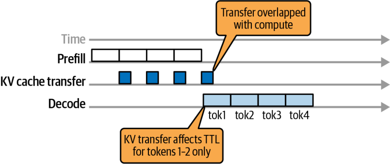

在 decode 阶段，模型执行自回归生成，逐个预测序列中的每一个新 token。它通过消费此前已生成的所有 token 的缓存注意力 KV 表示来完成这一过程。

> 投机解码通过在单个批次中预生成多个 token 来加速 decode 过程。与此同时，它并行地验证这些 token 是否正确。这降低了标准逐 token 自回归解码的顺序性。稍后我们会讲到投机解码。

### Prefill-Decode 干扰

传统上，LLM 推理系统会把这两个阶段共置（colocate）在同一批节点上，并简单地把所有计算批处理（batch）在一起。然而，这种朴素做法会导致通常所说的 *prefill-decode 干扰*。例如，一个长提示词的 prefill 可能会占用 GPU，从而延误其他请求对时延敏感的 decode 工作——反之亦然。

把 prefill 与 decode 共置在同一批节点上，会迫使这两个特性迥异的阶段共用单一的调度与资源分配策略。prefill 由大规模并行计算构成；相比之下，decode 需要大量小而顺序的计算。结果是，系统要么必须让某一阶段的性能优先于另一阶段，要么就得过度配置硬件以同时满足两者的需求。

采用*分离式 prefill 与 decode* 架构后，prefill 与 decode 阶段被分配到不同的 GPU 池，从而消除了两种工作负载之间的直接干扰。DistServe 系统通过分离 prefill 与 decode，据报告在同时满足 TTFT 与 TPOT 约束的前提下，有效吞吐量（goodput）请求量最高提升到 7.4×（延迟 SLO 最高收紧至 12.6×）。

### 独立扩展 Prefill 与工作节点

如果能够消除跨阶段干扰，我们就能减少资源的“死时间”——即 decode 任务因排在长 prefill 计算之后而停滞的时间，反之亦然。这样，GPU 就能把更多时间用于更有用的工作，而更少地处于空闲状态。这在给定延迟目标下提升了利用率与有效吞吐量。

我们可以通过让一组节点专门处理 prefill、另一组节点专门处理 decode，来分别扩展 prefill 与 decode。两个集群仅在把编码后的提示词状态（即注意力 KV 缓存）从 prefill 工作节点（worker node）传输给 decode 工作节点时才进行通信，如图 15-2 所示。

在图中，你可以看到独立的 GPU 工作节点分别处理 prefill 阶段（处理输入提示词）与 decode 阶段（迭代地生成输出 token）。prefill 阶段的输出包含该提示词的 KV 缓存，它被传输给 decode 工作节点以生成后续 token。

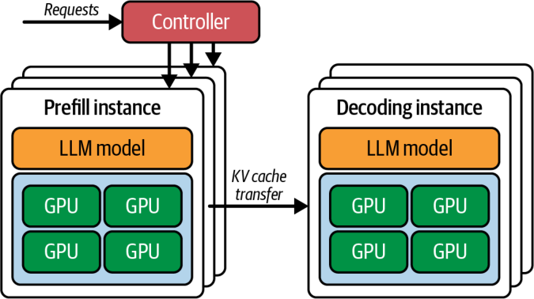

通过专用的独立 GPU 池，系统让 prefill 与 decode 两条流水线并行地保持繁忙。在实践中，分离已被证明能够在严格的延迟约束下显著提升吞吐量。一些研究表明有望获得可观的收益，但结果范围不一：一旦 prefill 与 decode 阶段被分开，收益从适度改善到有效吞吐量数倍提升均有出现。结果在很大程度上取决于工作负载与网络架构（fabric）。

这种分离使得每个阶段都能针对吞吐量或延迟被独立优化和扩展。prefill 可以在 prefill GPU 上被激进地批处理，以在不拖累 decode 性能（例如增加 decode 延迟）的前提下最大化吞吐量。此外，有了独立的集群，我们就能为每个阶段单独调优并行设置、实例数量与调度策略。

### 对延迟（TTFT）与吞吐量（TPOT）的影响

decode GPU 可以以较低的批大小运行——或采用专门的调度——以最小化流式生成的*每输出 token 时延*（time per output token，TPOT）。例如，你可以使用一个优先处理紧急 decode 任务的调度器，以避免排队延迟。

这种分离之所以奏效，是因为每个阶段有着不同的性能预期。prefill 阶段的*首 token 时延*（time to first token，TTFT）以低延迟为优化目标，而 decode 阶段则优先追求低每输出 token 时延与稳定的流式延迟。端到端吞吐量在很大程度上由并发度与调度决定。在传统方案中，人们不得不在 TTFT 与逐 token 的 TPOT 延迟之间做折中。分离则允许两个 SLO 目标同时得到满足。

> 在 KV 传输与 all-to-all 阶段，监控 NVLink 与 NIC 的利用率。目标是使用独立的流（stream）与事件（event）来重叠通信与计算。

KV 交接带来的额外延迟极小，因为其通信使用高带宽互连（interconnect）来进行多 GPU 与多节点传输。这些互连包括 NVLink、NVSwitch、InfiniBand，以及通过 GPUDirect RDMA 的以太网（Ethernet 上的 RoCE）。例如，配备 ConnectX-8 SuperNIC（800 GbE 级）的多节点集群，借助 GPUDirect RDMA 每端口可提供高达 800 Gb/s 的带宽。相比经由主机中转的通信路径，这大大缩短了 KV 传输时间。此外，建议为每块 GPU 部署 1 张 NIC，以优化 prefill-decode 分离并提升 MoE 的 all-to-all 性能。

### KV 缓存数据传输与 NIXL

分离式系统使用一个连接器（connector）或调度器，在提示词处理完成后，把提示词的中间结果（最终隐藏状态与 KV 缓存）从 prefill 工作节点传输给 decode 工作节点。这一交接会带来一些通信开销，但如果集群的互连是高带宽的（例如 NVLink 或 InfiniBand），相比消除资源争用所带来的收益，这一开销是很小的。

在实践中，NVIDIA 的 NIXL 库会根据拓扑与策略自动选择 NVLink/NVSwitch、RDMA 或主机中转路径，从而最小化传输开销。例如，第 4 章介绍过的 NVIDIA NIXL 库会自动选择当前可用的最快路径来传输 KV 缓存。NIXL 与多种框架和推理引擎集成，包括 Dynamo 和 vLLM。NIXL 与 vLLM 的集成如图 15-3 所示。

具体而言，LMCache 与 NIXL 作为受支持的路径，被集成进了 vLLM 的分离式 prefilling。NVIDIA Dynamo 与 TensorRT-LLM 也使用 NIXL，通过点对点 GPU 互连与 RDMA 来传输 KV 缓存数据。

在节点内，NIXL 通过 NVLink 与 NVSwitch 执行设备到设备（device-to-device）的传输，无需主机中转。跨节点时，NIXL 通过 InfiniBand 或 RoCEv2 使用 GPUDirect RDMA，以避免主机拷贝。即便对于数 GB 级的载荷，这些路径也能让 KV 缓存交接保持低延迟。

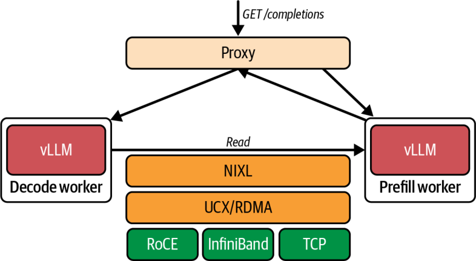

prefill 与 decode 工作节点的放置应当顺应网络架构。同节点放置可让 KV 传输经由 CUDA peer access 走 NVLink 与 NVSwitch，而跨节点放置则应使用经 InfiniBand 或 RoCEv2 的 GPUDirect RDMA。NVIDIA Dynamo 与 NIXL 集成，在节点间的 GPU、CPU 内存与存储之间搬运 KV 缓存；vLLM 则通过 LMCache 与 NIXL 集成，实现分离式 prefilling。

> 当网络架构或虚拟化层阻碍了直接的 peer access 时，NIXL 可以回退到主机中转路径，但这并非最优。请务必在你的部署环境中验证端到端的 KV 传输时间。

### 使用 Kubernetes 部署分离式 Prefill 与 Decode

在高级部署中，像 Kubernetes 这样的集群编排系统可以根据负载与输入特征，动态地调整 GPU 池的分配——或分别对各池进行扩缩容。例如，如果大量用户带着超长提示词与相对较短的输出到来（例如长文档摘要类用例），Kubernetes 可以临时调整分配，让 prefill 池使用更多 GPU，这会减少分配给 decode 阶段的 GPU 数量。

反之，如果大量用户请求超长输出（例如长推理链、“逐步思考”等），则可以把更多 GPU 转移到 decode 池。在这两种情况下，都可以为每种工作节点类型扩容出新的实例。

图 15-4 展示了一个基于 Kubernetes 的分布式 vLLM 集群，它使用开源项目 llm-d，将 prefill 与 decode 工作节点分开。vLLM 通过运行两个实例并借助 LMCache 与 NIXL 交接 KV 来实现分离式 prefilling，而 llm-d 在此基础上以 Kubernetes 原生编排进行了扩展，实现了分离式服务与 KV 感知路由。该图展示了一个名为 *变体自动扩缩器*（variant autoscaler）的组件，它负责更新池中 prefill 与 decode 工作节点的副本数量。

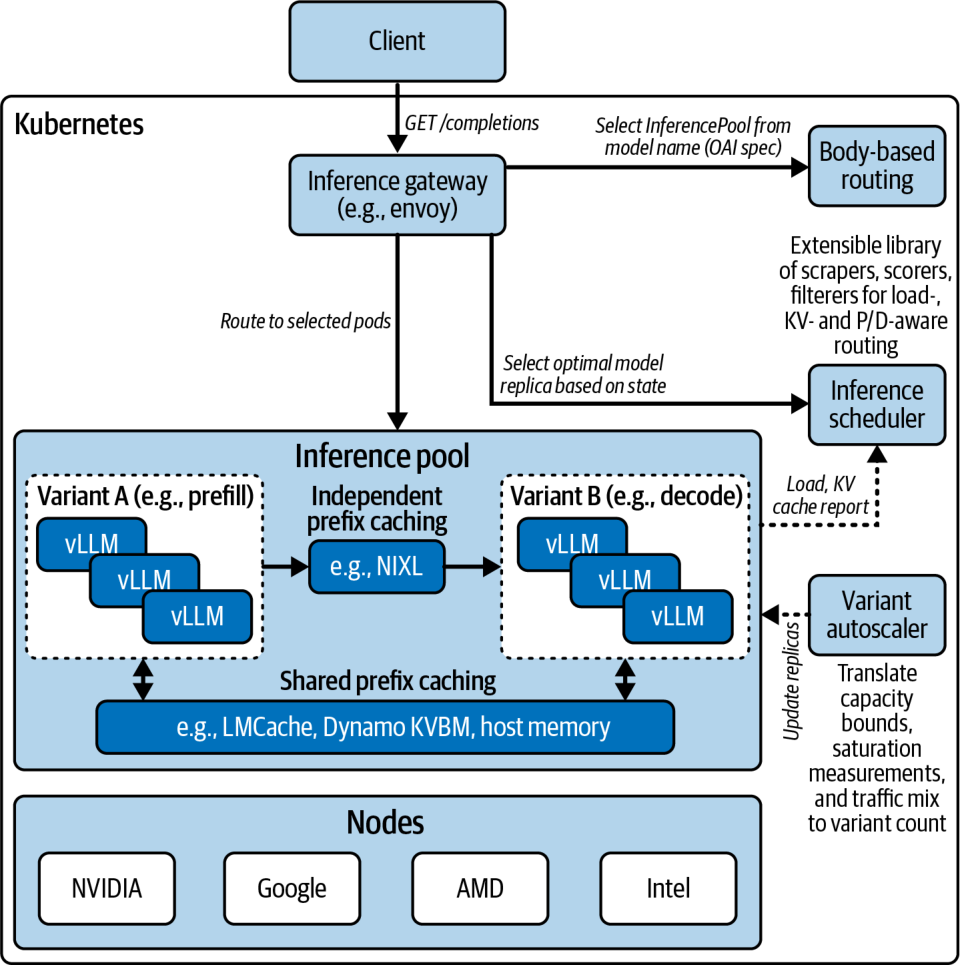

> 在现代推理部署中，所有节点都可以同时具备 prefill 与 decode 两种功能，因为它们共享相同的运行时与代码库（例如 vLLM、SGLang、NVIDIA Dynamo 等）。至于给它们分配具体角色——prefill 还是 decode——则由集群编排器决定：既可以在启动时静态指定，也可以在工作节点的整个生命周期中动态调整。

总体而言，分离式 prefill/decode 架构为高吞吐、低延迟的 LLM 服务奠定了基础。不过它确实引入了复杂性，因为中间数据必须被传输和管理——对于一个长提示词的 KV 缓存来说，其量级可达数 GB。而且调度也更为复杂，但在超大规模下，高效利用硬件所带来的收益是十分显著的。

> 第 17 章与第 18 章将更深入地探讨分离式 PD 的更多技术，包括高级调度、路由与部署优化。

## 服务超大 MoE 模型的并行策略

由于 GPU 内存有限，要高效地服务超大 MoE 模型，需要多种形式的并行。我们将拆解几种关键的并行策略，包括张量、流水线、专家、数据与上下文并行。我们还会讨论如何组合它们，把一个 LLM 分布到众多 GPU 上。表 15-1 从宏观上概括了这些策略、它们的典型用途，并就每种策略与推理的关系给出更详细的说明。

表 15-1. LLM 推理的并行策略

| 并行策略 | 划分依据 | 适用场景 | 优点 | 缺点 |
| --- | --- | --- | --- | --- |
| 张量并行 | 层内划分（将神经网络权重矩阵跨 GPU 拆分） | 单个模型过大，或需要跨多块 GPU 加速层内的繁重计算 | 在计算受限的层上接近线性加速；通过将 all-reduce 通信与计算重叠来降低开销 | 每一层都有频繁通信（all-reduce）；需要高带宽互连（NVLink/NVSwitch）；因高延迟而在跨节点及慢速网络上效率较低（建议将张量并行组保持在单个节点内） |
| 流水线并行 | 不同层放在不同 GPU 上（模型按层序切分） | 单块 GPU 装不下的极深模型；跨层的内存扩展 | 允许分布模型状态；使用微批处理（microbatching）并发处理来自不同用户/请求的多个 token；对于长序列可并行处理多层（提升大批量或长输入的吞吐量） | 增加流水线填充/清空延迟（气泡）——对逐个 token 的 decode 无益；实现更复杂，且激活内存占用更高（必须在流水线各阶段之间存储中间激活） |
| 专家并行 | 不同 MoE 放在不同 GPU 上（每 token 稀疏激活） | 具有大量专家的超大 MoE 模型；需要将模型参数跨 GPU 分片 | 支持几乎无限的模型规模——总参数量随 GPU 数量而扩展；每块 GPU 只计算一部分 token（稀疏计算）；高参数量提升模型容量/质量 | 每个 MoE 层都有很高的运行时通信开销（all-to-all）；若门控不均则可能出现负载不均衡；每块 GPU 上每个专家必须有足够的工作量（token）才能摊薄通信成本 |
| 数据并行 | 在多块 GPU 上复制整个模型，各自服务不同请求 | 在模型部署固定后横向扩展吞吐量（更多并发请求）；面向大量用户的多实例服务 | 吞吐量接近线性扩展；实现简单（无需模型划分） | 对单个查询的延迟（即每查询延迟）无改善；成倍增加内存占用（每个副本使用完整内存）；若有状态（例如缓存）则必须处理一致性，或采用无状态的模型调用 |
| 上下文并行 | 在每一层将输入序列的 token 跨 GPU 划分 | 超长序列（例如 100k+ tokens），以降低提示词延迟与每块 GPU 的内存 | 对长上下文 prefill 实现接近线性的加速；通过拆分 KV 缓存，支持处理超出单块 GPU 内存的上下文 | 需要自定义注意力算法来处理跨分区的注意力；每一层都为边界 token 增加通信；由于额外的通信开销，仅对极长上下文（100k+ tokens）有益 |

> 对于 Blackwell NVL72 上的节点内 TP，优先将 TP 组保持在单个 NVSwitch 域内；仅在拓扑允许时才跨机架扩展，以避免额外的跳数（hop）。

这些并行策略定义了模型权重与数据如何在 GPU 之间拆分。图 15-5 展示了不同并行策略下它们是如何被拆分的——以及若干常见的策略组合。

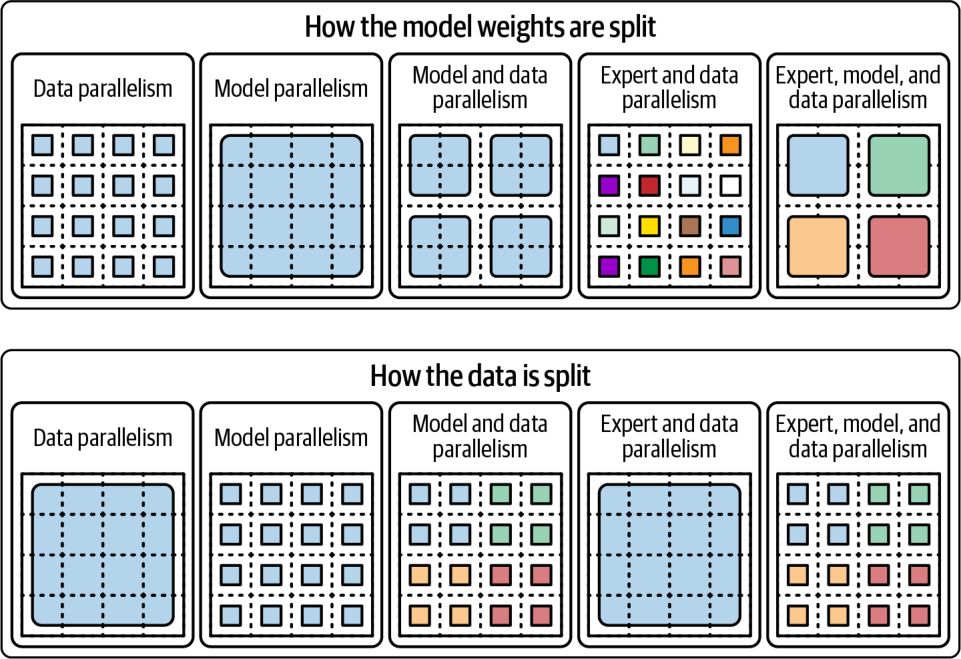

### 张量并行

*张量并行*（tensor parallelism，TP）将神经网络每一层内部的计算拆分到多块 GPU 上。例如，transformer 层中的一个大型矩阵乘法可以按列或按行划分——并在两块或更多 GPU 上并行计算。随后这些 GPU 通过执行一次 all-reduce 来交换结果，从而汇聚各自的部分输出。

当模型的层（称为*隐藏层*，hidden layer）太大以致无法装入单块 GPU 的内存时，或者当我们希望通过让多块 GPU 并行处理同一层来加速某个模型实例时，通常会使用 TP。它让所有 GPU 在每一层的计算上保持步调一致（lockstep），因此需要极高的 GPU 间带宽才能高效运行。

理想情况下，TP 应运行在通过高带宽 NVLink 与 NVSwitch 互连的 GPU 上。在使用第五代 NVLink（GPU 到 GPU 双向聚合带宽高达 1.8 TB/s，并具备先进网络拓扑）的多 GPU Blackwell 系统上，TP 能够在 8–16 块 GPU 的节点内高效扩展——在 NVL72 机架的情况下甚至可达 72 块 GPU。请记住，在 GB200/GB300 NVL72 机架内，NVLink Switch 在 72 GPU 域内提供约 130 TB/s 的聚合 GPU 带宽。这是相当可观的机架内带宽。

只要诸如激活值 all-reduce 之类的集合通信相对于计算足够快，TP 就能为模型中计算受限的部分带来接近线性的加速。在推理中，张量并行主要应用于注意力投影与前馈多层感知机（MLP）网络的大型矩阵乘法。

由于单个 token 的激活值相对较小，这些 all-reduce 通信在 NVLink 上的代价并不太高。因此，TP 是在不近似模型权重的前提下、把巨型稠密模型拆分到多块 GPU 上的常用策略。

我们主要在单个 MoE 专家或 transformer 层太大以致无法装入单块 GPU 时使用 TP。不过，当我们希望通过在多块 GPU 上并行化每一层的计算来降低延迟时，也会使用它。

然而，必须注意的是，超过某个规模后 TP 的效率会下降——尤其是在跨节点或跨机架、运行于 InfiniBand 或 Ethernet 之上时。在实践中，最好将 TP 用于节点内通信——或用于同一 NVLink 域内的节点之间。

像 NVIDIA GB200/GB300 NVL72 这样的现代多 GPU 机架，允许在更大规模上使用 TP 而不至于耗尽互连带宽。NVLink Switch 将 NVLink 域跨机架扩展到每个 NVL72 的 72 块 GPU。NVLink Switch System 能够把一个 all-to-all、全连接的 NVLink 架构扩展到最多 8 个机架、即 576 块 GPU（576 GPU = 8 机架 * 72 GPU/机架）。这使得大规模并行策略不仅能在单个 NVL72 内部使用，还能跨多个机架使用。例如，在 8 机架拓扑中，你可以利用跨 8 机架的 576 块 GPU 扩展到 576 路张量并行（576 GPU = 8 机架 × 72 GPU/机架）。

> 尽管可以将 TP 跨机架扩展，但建议在选择 TP 组规模时考虑拓扑感知，并尽可能保持在单个 NVLink/NVSwitch 岛屿之内。这将避免不必要的机架间交换机延迟，并有助于提升整体系统效率。

### 流水线并行

*流水线并行*（pipeline parallelism，PP）按*层*（layer-wise）将模型划分到不同的 GPU 上。例如，在一个基于 transformer 的 60 层模型中，GPU 0 可能持有第 1–20 层，GPU 1 持有第 21–40 层，GPU 2 持有第 41–60 层。

在处理一段 token 序列时，数据依次流经各 GPU：GPU 0 计算第 1–20 层，然后把它的中间激活传给 GPU 1 计算第 21–40 层，以此类推。这使得深到无法装入单个加速器的模型得以被分布。

在推理中，PP 可以通过将模型划分到多个批次之间来提升吞吐量——类似于流水装配线。在处理长输入 token 序列的 *prefill* 阶段，PP 通过以错峰方式把序列的不同部分流式送入各层，从而实现高 GPU 利用率。

相比之下，在一次生成一个 token 的 *decode* 阶段，纯 PP 带来的收益较小，因为每个新 token 仍必须顺序地穿过各个流水线阶段。这会产生流水线气泡（pipeline bubble），即空闲期：对每一个 token，靠前的阶段都要等待靠后的阶段完成。

为减少流水线气泡，各种实现会使用微批处理，它允许流水线并发处理来自不同请求的多个 token。尽管如此，流水线并行主要还是通过让超大模型把层拆分到多块 GPU 上来帮助内存扩展。它同样有助于吞吐量——尤其是在处理大批量或长输入时。

由于流水线各阶段之间的传输开销，PP 往往会增加单个条目的端到端延迟。因此，PP 通常出于模型容量而非延迟方面的考虑而被选用。这是因为它能把模型装入内存。当没有任何单块 GPU 能容纳整个模型时，轻微的延迟代价是可以接受的。

此外，PP 常与 TP 等其他并行策略组合使用，以在内存与速度之间取得平衡。在服务大型 MoE 模型时，可以跨 2–4 块 GPU 使用流水线并行来拆分很深的层堆栈——同时依靠 TP 来处理宽的层内计算。

> PP 跨层拆分模型，而 TP 在层内拆分模型。TP 主要用于层或专家宽到超出单块 GPU 的模型，而 PP 主要用于深到无法装入单块 GPU 的模型。请注意，TP 与 PP 可以组合使用，稍后我们会看到这一点。

### 专家并行

*专家并行*（expert parallelism，EP）专用于 MoE 架构。在一个 MoE 层中，存在许多专家网络（即前馈子层）。对于每个输入 token，只有一个或少数几个专家被激活。这天然地适合把不同的专家分布到不同的 GPU 上。

例如，如果一个 MoE 层有 16 个专家，而我们有 4 块 GPU，则每块 GPU 可以承载 4 个专家。在推理时，当一个 token 到达该 MoE 层，其内部的门控网络会为该 token 选出（比如）排名前二的两个专家。该 token 的数据随后被发送到拥有这两个专家的相应 GPU 进行处理。接着，结果被合并回来以生成下一个 token，如图 15-6 所示。

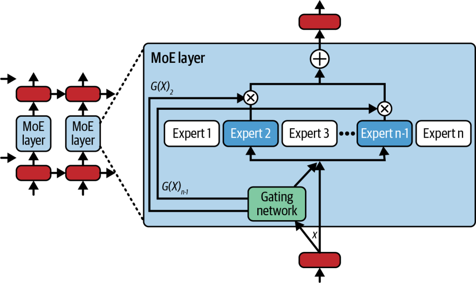

实现这一点需要一种 all-to-all 通信模式，使得 token（严格来说是它们的激活向量）在 GPU 之间被动态打乱，从而让每个 token 落到其被分配专家所在的 GPU 上。在每个专家为其分配到的 token 计算出输出之后，会再执行一次 all-to-all，把各 token 的输出按原始顺序返回。

这种动态路由在每个 MoE 层都引入了一个通信密集的步骤。如果不加以精心优化，它可能成为性能瓶颈——尤其是随着专家/GPU 数量的增加。好处在于，专家并行使得模型总容量能够随 GPU 数量近乎线性地扩展。

设想一个拥有 100 个专家、分布在 100 块 GPU 上的 MoE。如果每个 token 只激活两个专家，那么每 token 的计算量就与一个较小的稠密模型相当。因此，正是专家并行使得某些超大 MoE 模型得以被服务，因为模型权重被分片到众多 GPU 上——每块 GPU 在任一层只处理一小部分 token。

> 在大规模下，且当 MoE 模型中的专家集合被恰当地均衡时，所有专家很可能会同时处于激活状态。因此，尽管单个 token 只激活少数几个专家，但把所有终端用户的所有 token 汇总起来看，所有专家都会处于激活状态，同时消费并争用全部 GPU 资源。

高效的专家并行推理需要精心的负载均衡（load balancing）——以及高带宽互连，例如用于机架内通信的 NVLink/NVSwitch 和用于节点间通信的 InfiniBand/RDMA。现代 MoE 推理框架使用像 NCCL 这样的快速集合通信库。把每块 GPU 上的多个专家分组，通常有助于减少通信步骤。

现代 MoE 推理常使用 top-2 门控，即每个 token 被分配给两个专家。为减少通信，你可以把经常配对的专家分到同一块 GPU 或同一计算节点上。例如，如果 token 使用两个专家，把这两个经常配对的专家放在同一块 GPU 或同一节点上，就意味着许多 token 的分配会停留在单块 GPU 或单个节点内，从而把通信流量本地化并减少开销。

另一种技术是使用 top-1 门控，即每个 token 只去往一个专家。相比前面描述的会使专家输出数量翻倍的 top-2 门控，这会降低通信量。虽然 top-1 门控更快，但它可能导致模型质量下降与负载不均。

> Google 的 GLaM 引入了负载均衡损失（以及门控噪声），以在 MoE 模型训练期间实现均衡的专家使用。在此基础上，研究者正在探索真正自适应的、推理时的门控：当某个专家过载时，利用实时负载指标重新路由 token。这些做法在不降低质量的前提下提升了利用率。然而，在大多数生产服务环境中，配以适度容量因子的 top-2 门控——外加偶尔基于负载的专家交换或复制——仍是同时兼顾质量与性能的最常见折中技术。

许多 MoE LLM 至少使用 top-2 门控，以获得更好的质量、良好的速度与均衡的负载。此外，战略性地放置专家——甚至使用备份专家副本——以避免某些专家过载，是很重要的。

当专家变得过载、或者说变“热”时，如果门控网络不成比例地把 token 路由给它们，它们就会成为吞吐量瓶颈。所谓的*掉队者效应*（straggler effect）要求所有专家计算全部完成后才能继续推进。因此，一个接收到比其他专家更多工作的过载专家，会使推理流水线停滞。这会让一些专家及其 GPU 空闲，等待其他专家追赶上来。

为防止这种情况，高性能 MoE 服务系统会暴露一个容量因子（capacity factor）参数，通常设为平均 token 负载的 1.2–1.5×，用于限制每个专家每批次最多能处理多少 token。超出该上限的 token 会被路由到次优的溢出（overflow）专家——或排队等待第二轮处理。这与训练期间用来促使 MoE 均匀地把 token 分配给各专家的任何负载均衡损失或门控噪声相互补充。

一些功能完备的推理服务器还能在必要时把热点专家复制到多块 GPU 上以分摊负载。这以额外的 GPU 内存为代价。稍后我们会看到一个负载不均衡的例子。

推理时溢出（容量因子）、训练时惩罚（负载均衡损失与门控噪声）以及热点专家副本三者的组合，应能在达到容量上限时平滑 token-专家的负载分布——从而最大化整体 MoE 推理吞吐量。

### 数据并行

在推理中，*数据并行*（data parallelism，DP）是指把整个模型复制到多块 GPU 上，并将不同的传入请求——或一个请求批次的分片——分配给每块 GPU。与训练中通过梯度平均保持模型同步的数据并行不同，推理中的数据并行在每个副本上运行独立的前向传播。这是横向扩展吞吐量最简单的方式。

例如，采用 DP 时，如果一块 GPU 每秒能处理 10 个请求，那么使用 8 块 GPU、8 个副本，理想情况下可提供每秒 80 个请求的吞吐量——前提是这些请求彼此独立。在实践中，将数据并行用于推理需要启动多个模型服务引擎，并在它们之间对请求做负载均衡。

使用 DP 时，每块 GPU（或每组 GPU）从头到尾处理一部分查询。其优点是吞吐量线性扩展，且推理期间没有 GPU 间通信，因为每个副本都是隔离运行的。然而，其缺点也十分显著。

DP 会成倍增加内存需求，因为每个副本都需要一份完整的模型权重与缓存副本。因此，用 8 个副本服务一个模型，相比把该模型托管在单块 GPU 上，会使用 8× 的 GPU 内存——以及大约 8× 的硬件成本。

在实践中，数据并行常与请求批处理以及每块 GPU 上的多流（multistream）执行相结合，以最大化利用率。理想情况下，每个副本应当是无状态的——或者使用同步缓存以避免一致性问题。

需要注意的是，DP 并不会降低任何单个请求的延迟。不过，由于有更多可用副本来处理请求，它确实能提升吞吐量——前提是内存与计算资源可用且相对没有争用。

> 由于 GPU 内存相对稀缺且昂贵，通常只有当你的吞吐量需求非常高时——或者当你能把 DP 与 TP、PP 等其他并行方法组合起来时——DP 才值得用于推理。

对于推理，由于 DP 有额外的内存与成本需求，它常与 TP、PP 等其他并行方法组合使用。例如，如果一个模型因内存限制必须铺开到 8 块 GPU 上，就应当把 DP 与 TP、PP 或 EP 组合起来——甚至把它们全部一起使用——以构成四维（4D）并行（再加上上下文并行（CP），你就用上了 5D 并行！）。

具体而言，你可以用 DP 结合 TP，通过两个各含 8 块 GPU 的 DP 组来部署两个大型的 8-GPU 模型副本。这将使吞吐量翻倍，并用 TP 在层内把每个大型模型副本分片到 8 块 GPU 上。

在一个大规模推理集群中，你可以专门划出大量 GPU 与节点来服务大模型的多个副本，以应对高请求量。当吞吐量需求需要扩展到超出单个模型实例所能提供的水平时，DP 尤为有用。在实践中，生产系统常运行大模型的许多 DP 副本以满足流量需求。

> 现代推理服务器把每个副本都视为负载均衡器背后的一个独立模型实例。这要求对请求做精细的路由，但相比其他复杂的模型分片方法，它相对简单直接。

### 上下文（序列）并行

*上下文并行*（context parallelism，CP）更像是一种专门化的策略，它把单条 token 序列切分到多块 GPU 上。这一技术对数万乃至数百万 token 量级的超长上下文输入很有帮助——否则这些输入要么太慢、太耗内存，要么根本无法装进单块 GPU。

CP 的思路是把序列切成若干块，让不同的 GPU 在每一层并行处理序列的不同部分。GPU 之间只在序列块的边界处交换必要的信息。

CP 通过把 KV 缓存切分到多块 GPU 上，来处理超出单块 GPU 内存的上下文。它还能让提示处理延迟大致随所用 GPU 数量成比例下降。因此，CP 可以对超长上下文的 prefill 运行实现接近线性的加速——用多块 GPU 并行完成长上下文的 prefill。

CP 的挑战在于，transformer 具有全局自注意力：每个 token 都要关注它之前的所有 token。天真地切分序列，会需要在 GPU 之间进行大量信息交换，以便跨切分边界计算注意力。

CP 方法采用环形并行（ring parallelism）和分块注意力（blocked attention）等巧妙方案，来降低自注意力二次方级的通信时间复杂度——并把每块 GPU 限制为主要关注它自己那部分上下文，外加少量块边界数据。

实际上，每块 GPU 在每一层都处理输入序列中的一部分位置。它们以流水线方式——通常排成一个环——来回传递中间结果。CP 类似于流水线并行，只不过是沿序列长度维度而非层维度进行。

上下文并行在处理超长输入的 prefill 时表现出色：它把一份文档切成若干段，把这些段分配到多块 GPU 上，并发处理每一段。每当 GPU 数量翻倍，提示处理时间大约减半——只在边界处的跨段注意力上带来一点点开销。

简而言之，虽然 CP 无法加速逐 token 串行的 decode 阶段，但它能缩短超长提示的 TTFT。做法是把注意力 KV 缓存分布到多个设备上，让每块 GPU 只存储自己那一段的缓存。CP 还能让你处理超出单块 GPU 内存容量的上下文。

> 上下文并行需要一种能跨切分通信的注意力实现。这会增加每层额外的通信。因此，对于短提示，CP 往往带来过大的开销。但对于超长输入和严格的 TTFT 目标，CP 可以降低 prefill 延迟和每块 GPU 的内存占用。请针对你的最大上下文同时测量 prefill 速度与准确性。

### 混合并行

在实践中，服务超大 MoE 大模型要综合使用前面介绍的各种并行策略。如今的大模型如此庞大而复杂，任何单一的并行方法都不够用。图 15-7 展示了一种使用四块 GPU 的混合并行配置。

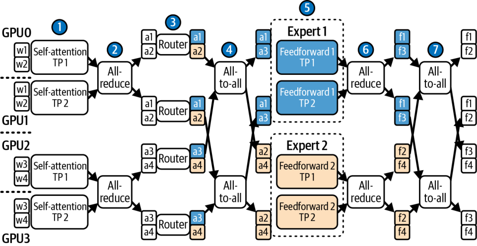

这里，我们使用了四个流水线阶段（每块 GPU 一个）和两路张量并行。token 通过专家并行被路由到两个专家上。这被称为 *4 × 2 EP 混合并行策略*。

我们再把规模做得更大，构建 GPU 的逻辑分组。例如，考虑一个 64 块 GPU 的集群。我们可以把这些 GPU 分成 16 组，每组 4 块 GPU。假设 MoE 有 60 层、64 个专家，我们可以用 4 路流水线并行，每个阶段 15 层。这切分的是模型的深度。然后，在每个阶段（15 层）内部，我们可以用 2 路 TP 来切分每层内部沉重的矩阵乘法。这切分的是模型的宽度。

对于 MoE 层，你可以用 EP，配合 top-2 门控，把每组 16 个专家铺开。这样最多会把 token 发送到组内两块 GPU。最后，数据并行可以部署两份这样的 64 块 GPU 副本，让系统吞吐量翻倍。

这只是一种配置。在实践中，你需要对不同的并行策略组合进行实验。你的性能剖析工具会帮你找到合适的平衡点。具体来说，你可以用 Nsight Systems 做端到端追踪，用 Nsight Compute 获取特定内核的 GPU 指标。

> 记住，在每次改动前后，都要核对互连流量、Tensor Core 利用率以及其他性能增强机制。

指导原则是：把 TP 用到收益递减的临界点为止——通常在一个节点内，或在像 NVL72 机箱这样紧耦合的单元内。然后，尽量少用流水线并行——只用到刚好能把模型装进内存的程度。接着，你要最大化 EP，把 MoE 参数分散到各个专家和各块 GPU 上。最后，随着你扩展到越来越多的终端用户和并发推理请求，再增加数据并行副本来提升吞吐量（如果预期会有超长输入，可以选择性地在其上叠加 CP）。

我们还希望让并行方式与硬件拓扑相匹配。例如，如果使用 NVL72 系统，全部 72 块 GPU 都通过 NVLink 和 NVSwitch 全互连。这种情况下，你可以在这 72 块 GPU 的 NVLink 域内组建 TP 和 EP 分组。不过，接近整个域规模的 TP 分组，往往会因 all-reduce 延迟而出现收益递减。因此，许多生产系统会让 TP 分组保持较小并具备拓扑感知——即便是在 NVL72 内部也是如此。

相比之下，一个由两个 8 卡节点通过 InfiniBand 连接的较小集群，只有在每个节点内部才有完整的 NVLink 连接——跨节点流量要走 InfiniBand 网络。在这类环境中，最好把 TP 保持在每个 8 卡节点本地——并尽量避免节点间并行，以规避节点间通信更高的延迟和更低的带宽。

在接下来的几节里，我们会讨论一些更高层的优化，它们可以与这些并行策略结合，在多节点集群上实现更快的推理。正如我们将看到的，一个设计良好的服务系统会把许多这类高层与底层技术结合起来。

## 投机解码与并行 token 生成技术

大模型推理的根本性能挑战之一，是 decode 的串行本质。请记住，在 prefill 阶段处理完初始提示之后，模型通常一次只生成一个 token。每个 token 的计算都依赖于前一个 token 的结果，因此很难并行化——它本质上是一个串行过程，会引入延迟瓶颈——即便用上最新、最快的 GPU 也是如此。在现代 GPU 硬件上，对超大模型而言，串行生成数百个 token 可能耗时数秒量级。

在本节中，我们讨论若干加速 decode 阶段的技术。其中一些技术是在每个推理步生成多个 token，另一些则从根本上减少串行推理步的数量。

投机解码传统上是把一个小而快的“草稿”（draft）模型与一个更大的“目标”（target）模型配对：前者一次成批地提出若干 token，后者随后验证每个候选。这以第二次推理为代价换取并行生成，从而实现更高的多 token 吞吐。然而，运行两个独立的模型会增加部署复杂度，而且当验证过程成为瓶颈时，仍可能拖慢推理。

Medusa 对此做了简化：它把多个轻量级的解码头直接附加到单个大模型上。在每一步，这些头使用一种基于树的注意力机制，在一次前向传播中并发生成并验证若干 token 候选。

Medusa 的这种统一设计避免了跨模型的 token 传输，在不牺牲 token 生成质量的前提下取得了大幅加速。通过把“起草与验证”合并进单模型的一次传播，Medusa 相较传统的双模型投机解码技术是一大改进。下面我们来更仔细地看看其中一些技术。

### 双模型、基于草稿的投机解码与 EAGLE

投机解码是一种技术：它在小模型上多做一些工作，以节省昂贵大模型上的时间。其思路是让一个轻量级的“草稿”大模型与主大模型并肩运行。草稿模型更快，会在当前上下文之外投机性地生成一批 *k* 个 token。

这个大模型被称为*目标*模型，随后它会通过在一个发往 GPU 的批次中，对整段 *k* 个 token 的序列预测下一个 token 的概率，来验证草稿 token。通过一次性处理全部 *k* 个 token，目标模型提高了算术强度——每传输一字节数据就执行更多的计算。这样就能高效而快速地验证草稿序列的 token。

如果目标模型的输出与草稿模型提出的 *k* 个 token 一致，那么我们就在大模型生成单个 token 的同样时间内，有效地生成了 *k* 个 token。如果在草稿模型生成的这 *k* 个 token 序列中，大模型的验证在任一 token 处与草稿模型的预测发生分歧，那么该点之后的投机 token 就会被丢弃。每一步至少会保留一个已生成的 token，因为验证过程总会接受来自草稿模型或目标模型的第一个 token。

一旦用上目标模型修正后的 token 并继续解码，就可以从该点开始一轮新的投机解码循环。图 15-8 展示了一个小的草稿模型向前预测多个 token，随后目标（大）模型逐个验证这些 token。

随着时间推移，投机解码减少了大模型所需的逐个串行调用的总次数。理论上，它提供 k× 的理论加速，其中 *k* 是草稿模型生成的 token 数。而在实践中，由于存在开销和偶尔的投机 token 拒绝，收益更接近 2× 的加速。

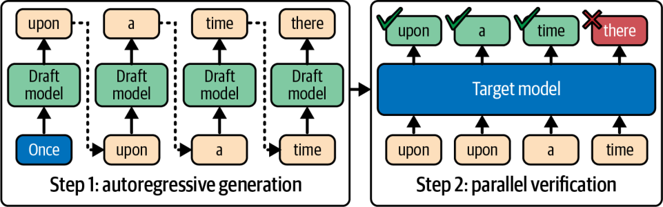

草稿模型的选择必须对大模型的分布有相当高的保真度。这意味着草稿模型的预测应当与大模型的可能输出有高度重叠。如果草稿模型频繁猜错，投机解码收益甚微，还会浪费算力。如果它经常预测出更大的目标模型不会给出的 token，许多投机 token 就会被拒绝。这会浪费计算时间。

草稿模型还必须比大模型快得多——通常要快 4× 或更多——投机解码才能带来实际的性能提升。一种常见策略是使用主模型的蒸馏版本——或一个在相同数据上微调过、使其输出关联度良好的更小模型。

> 草稿模型必须使用与大模型相同的分词器和词表。这一点有时会被忽视，而它会导致糟糕的结果。

草稿模型使用相同的提示——也许再配上更高的温度——来生成 token，以提高命中大模型某个概率延续的机会。与此同时，目标模型向前跳跃，在单个批次中处理全部草稿 token。

在标准的投机解码接受过程下，目标模型的输出分布得以保留。因此，当采样设置对齐时，最终的样本与大模型的分布一致。如果草稿发生分歧，目标模型的验证会拒绝那些 token，从而维持正确性。唯一的区别在于：当小模型对这些投机 token 猜对时，最多可以省去 *k* 次目标模型调用。

投机解码可以用多种方式实现。大多数现代大模型推理引擎，如 vLLM、SGLang 和 TensorRT-LLM，都内置了协调草稿模型与目标模型生成的支持。经验上，1.5–2.5× 左右的加速很常见，而通过精细的批处理和草稿模型设计，还可能获得更高的收益。

> 在 PyTorch 中，torch.nn.functional.scaled_dot_product_attention 这个操作会根据设备代次、张量形状、掩码和数据类型，自动选择最优后端（FlashAttention 或某个 cuDNN 内核）。你可以用 torch.nn.attention.sdpa_kernel() 并指定明确的 SDPABackend 类型来固定某个后端。例如在对大模型解码做基准测试时，确认所用的融合后端确实处于激活状态就很重要。

举例来说，“面向更高大模型效率的外推算法”（Extrapolation Algorithm for Greater LLM Efficiency，EAGLE）重新思考了投机解码：它在特征层面而非 token 层面运作。EAGLE 用一步外推大模型自身的中间表示，来预测下一个 token 的特征。这消解了不确定性，并取得更高的接受率。

EAGLE 报告称，在有利环境下，对 4-token 草稿相较原始解码可获得约 3.5× 的加速，同时保留大模型的输出分布。EAGLE 在有利环境下逼近了其草稿深度的理论极限。它表明，凭借创新技术，投机解码可以进一步缩短解码时间——同时保持输出质量。

EAGLE-2 通过引入一棵上下文感知的动态*草稿树*（draft tree）扩展了 EAGLE。在某些评测中，EAGLE 相较原始解码达到了最高 3.5× 的加速；而 EAGLE-2 的方案报告称，视任务和模型不同，比 EAGLE 快约 20%–40%。有了 EAGLE-2，草稿模型会生成一组分支的 token 序列，从而在验证步进一步提升并行度。如图 15-9 所示。

EAGLE-3 在早先版本 EAGLE-1 和 EAGLE-2 的基础上继续改进：它倾向于直接预测 token，并融合多层特征。EAGLE-3 报告称在某些任务上相较 EAGLE-2 有最高 1.4× 的提升——相较未优化的基线变体则有最高 6.5× 的加速。在 EAGLE-1 和 EAGLE-2 中，草稿模型预测的是内部特征向量，然后再解码为 token。这些较早的 EAGLE 方法，本质上是靠猜测内部特征——再把它们映射到 token。

EAGLE-3 跳过了特征层面的预测步骤，更直接地预测草稿 token。不过，它仍然使用内部特征，但把这些特征融合进多层表示（低层、中层、高层）来引导草稿预测。这与仅使用顶层形成对比。这让 EAGLE-3 更精简、约束更少——从而具备更好的可扩展性。

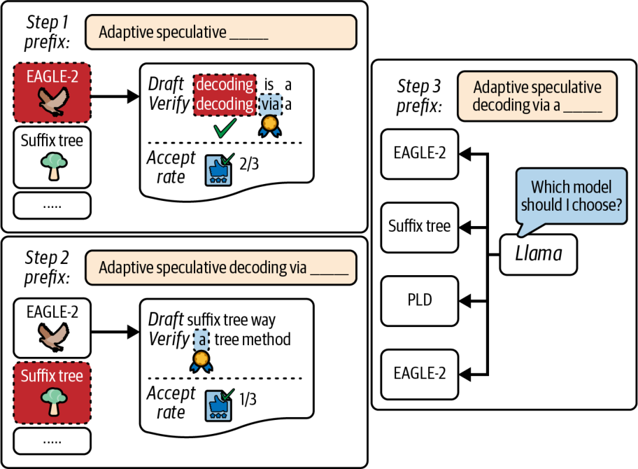

另一种技术是*动态深度解码*（dynamic depth decoding），它可以自适应地跳过那些对输出质量影响最小的层。其他能减少计算量的技术包括：每隔 *N* 层跳过一个 transformer 层、对草稿模型使用更低精度（如 FP8 和 NVFP4），以及在草稿阶段临时使用更小的隐藏维度。

> 一些研究原型提供了在解码期间跳过网络部分或降低精度的模式，以准确性换速度。截至撰写本文时，这些模式在生产模型中尚未普遍可用，因此在启用任何此类模式之前，务必在你的目标任务上验证质量与速度。

未来的大模型可能会内置一种优化过的“快速生成”模式。例如，一个模型可能有备选的轻量层，或有一套降低精度解码的配置。这种内置的优化将允许模型跳过部分计算。

### 单模型自投机解码

投机解码的另一种思路是彻底不使用外部草稿模型，而是让更大的目标模型通过选择性地跳过一些计算，来同时起草并验证它自己的输出。其中一种方法就是自投机解码（self-speculative decoding），也称为“起草-验证”方案。

在自投机解码中，大目标模型用一次快速的近似传播来生成 *k* 个 token。例如，它可以对每个新 token 只运行一半的层——并且可能以降低的精度运行。它会每隔一层跳过一层。这样产生的草稿输出，很像那个更小的草稿模型会产生的输出。而且当接受率和草稿深度有利时，它能逼近类似的加速。这样产生的草稿输出很像那个更小的草稿模型会产生的输出——并且同样能取得约 2× 的加速。

然后，在自投机解码的第二阶段，目标模型执行一次完整的前向传播，一次性验证这 *k* 个 token。如果它们全部匹配，我们就为这些 token 省去了执行一半层的开销。如果不匹配，我们就直接退回到传统的投机方式：接受到不匹配处为止的 token，然后正常继续。

由于在自投机解码中是同一个模型既起草又验证，就无需在运行时训练、维护或加载一个独立的模型到内存中。挑战在于，找到一种好办法来减少草稿阶段所需的计算量（丢层、降精度等），同时又不过多损害准确性。

一种相关技术是*一致性解码*（consistent decoding），你要训练一个大模型来同时生成并验证多个 token。这种单模型方法在不需要独立草稿模型的情况下产生约 3× 的加速。这体现出一种趋势：把投机解码烘焙进模型自身的权重里。

这些方法代表着非常活跃的研究领域。它们尤其令人兴奋、前景广阔，因为它们让模型利用自身固有的内部冗余来自我加速。而且由于这些优化局限在模型本地，推理引擎的实现可以得到简化。

### 用 Medusa 的多头做多 token 解码

投机解码归根结底仍是用草稿模型逐个生成 token——只是因为草稿模型更小才更快。然而，Medusa 框架采取了更激进的做法。它直接修改模型架构本身，在每个解码步并行预测多个新 token。

不同于仍逐个生成 token（尽管更快）的双模型投机解码，Medusa 的架构真正做到了从单个模型每次迭代生成多个 token。因此，在已发表的实验中，横跨 Medusa-1 和 Medusa-2，Medusa 的多头方案报告了约 2.2–3.6× 的加速。

不过，Medusa 需要定制的模型训练，因为它对基于 transformer 的大模型做了修改，添加了若干在特定层分叉出去的额外解码头——名字 *Medusa*（美杜莎）正由此而来。这让模型可以同时提出若干个下一个 token。

由不同 Medusa 头生成的多个 token 候选被组织成树状结构。例如，Medusa 可以在一次传播中生成一棵深度为 2 的二叉树，产出多达 4 个 token。随后，它可以并行验证这一串多个 token，如图 15-10 所示。

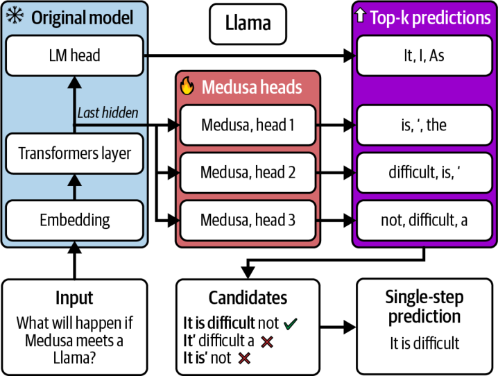

在内部，Medusa 使用一种专门的、基于树的注意力模式，来提升并行 token 预测之间的一致性。模型学会同时扩展并验证多 token 序列。有了 Medusa，大模型本质上学会了向前“预想”几个 token——并一次性把它们全部输出。

在推理时，Medusa 可以把串行解码迭代的次数按并行预测的倍数缩减。例如，如果 Medusa 一次传播预测 4 个 token，对于深度为 2 的二叉树输出，它可以把所需的前向传播次数减少最多 4×。

然而在实践中，Medusa 通常只能取得约 2–3× 的加速，因为偶尔会出现某个预测分支验证失败、需要部分重做时的回溯开销。这与投机解码验证与拒绝的开销类似。举例来说，如果一个 Medusa 大模型每次迭代生成 4 个 token，那么 100 个 token 的回复只需模型迭代 25 次，而不是 100 次。

Medusa 需要修改并重新训练模型来添加这些额外的头。此外，由于多了头的参数，Medusa 模型的体积会略大一些。这会略微增加开发复杂度和训练成本。不过，一旦训练完成，Medusa 模型可以显著缩短推理时间。

如果针对你的用例进行了训练，一个启用 Medusa 的大模型可以提供出色的低延迟性能。然而，这一技术要求修改并微调模型架构以添加额外的头。

### 交错来自多个请求的解码步

另一种并行解码技术，是把跨多个终端用户的多个并发请求的解码步交错起来。这种并行更像是推理引擎的一种能力，而非某种算法技巧或模型架构改动。但它有助于让 GPU 保持忙碌——办法是在 token 层面、跨终端用户请求进行批处理。

像 vLLM 这样的框架，以请求路由、连续批处理（continuous batching）和 token 调度的形式实现了这一点。其思路是通过填补串行步之间的空隙来让 GPU 保持忙碌。具体来说，如果某块 GPU 因为某个序列在等待 I/O 或数据依赖而停顿，调度器可以在此期间在同一块 GPU 上运行另一个序列的下一个 token 预测。

> 把推理引擎先进的路由、批处理和调度能力与 CUDA 流结合起来。然后用 Nsight Systems 验证 token 步的内核确实与 NIC/NVLink 传输重叠，而不是在单个流上串行化。这样你就能在应用、系统和硬件层面实现大规模并行。

需要指出的是，交错解码步并不会加速单个序列的延迟。事实上，由于额外的上下文切换，它甚至可能给每个 token 增加一丁点开销。然而，当并发服务众多用户时，它能大幅提升整体吞吐量和 GPU 利用率。在重负载下，这会降低终端用户请求的平均延迟。

### 组合解码技术并评估复杂度

值得注意的是，这些解码优化可以组合使用。例如，你可以把投机解码与一个启用 Medusa 的目标模型结合起来，让大的目标模型一次性验证由小模型预测出的多个 token。

这些技术也伴随着额外复杂度的代价。你要么得维护一个额外的模型，要么得改动主模型，要么得管理更繁复的控制逻辑。在生产中，你应当权衡这种复杂度与性能收益。对于交互式应用，哪怕只把响应时间缩短几毫秒也值得为之付出复杂度——尤其是在大规模场景下。

简而言之，投机解码（无论用不用草稿模型）以及 Medusa 式多 token 预测这类先进解码技术，可以缩短传统上一次只生成一个 token 的现代自回归大模型的整体推理时间。通过一次生成更多 token、提高整体算术强度，并把解码步推向计算受限区间，你就能充分利用 GPU 极强的计算能力。

> 解码优化的格局在持续演进，复杂度也在不断增长；但趋势很明确：让大模型解码更并行、更高效。

## 受约束解码的性能影响

大模型解码过程中一个独立但重要的方面，是在特定约束下生成文本。例如，模型可以强制输出匹配某种预定义格式（JSON）、使用特定语法，或出于安全考虑禁止某些序列。因此，受约束解码——常被称为*结构化输出*（structured outputs）——在生产用例中往往是必需的。

以 OpenAI 的函数调用 API 为例，它依赖良好结构化的输出格式来决定调用哪个函数——以及这些函数的输入与输出。这些约束被设计为匹配函数的 API 签名，在应用层面根本没有商量的余地。

受约束解码改变了模型的 token 选择过程，使得在每一步只允许有效的 token。这可能简单到只是提供一份允许的 token 列表——也可能复杂到嵌入一套形式语法，并用一个状态机来过滤掉无效的 token。

受约束解码的缺点在于，强制执行这些约束需要额外的延迟——通常每个 token 几毫秒。这是因为模型可能需要反复回溯、在被剪枝的词表中穿行，最终才生成一个有效的 token。回溯发生在大模型的生成循环内部。因此，如果模型自身缺乏细粒度的遥测，受约束解码的调试、剖析和调优会很困难。

另一个性能考量是缓存效率。在每个解码步对完整的概率分布做剪枝，可能冲垮缓存，进一步降低吞吐量。当允许的 token 集被严重限制时，这一点尤其明显。

为缓解这些开销，许多框架会编译一套 JSON 语法，并为每个状态预先计算好有效的 token。这让推理引擎可以在运行时掩蔽掉无效的 softmax 输出。这种做法减少了回溯、改善了缓存，并提高了接受率。

对于适中的约束（如简单的 JSON 模式），使用已编译语法、并把掩码计算与 GPU 执行重叠起来的现代引擎，可以在大规模下把开销压到个位数低百分比区间；但复杂的语法或小批次仍可能带来两位数的开销。请始终在你确切的模式下测量 TTFT 和每秒 token 数。

这些技术已在流行的库和推理引擎中实现，包括 Hugging Face Transformers、NVIDIA NeMo 和 vLLM。例如，NVIDIA 的 TensorRT-LLM 和 Hugging Face Transformers 都允许用户自定义词表掩码来强制约束，且速度损失可忽略不计。具体来说，TensorRT-LLM 通过 XGrammar 后端暴露了带 JSON 模式和上下文无关文法（context-free grammar，CFG）支持的引导式解码。而 vLLM 和 Transformers 则提供了结构化输出 API。

> 使用 TensorRT-LLM 的引导式解码时，XGrammar 在 GPU 上提供 JSON 模式和 CFG 支持。XGrammar 会编译约束，避免了大量的 Python 侧 token 掩码开销。不过要注意，某些配置可能回退到较慢的后端，导致首次请求出现过度停顿。因此，让语法保持紧凑很重要，以保住缓存局部性和 token 掩码带宽。

另一种流行策略是把受约束解码下推到内核本身。这种情况下，它会在最后的 softmax 步注入 token 掩码，以取得类似的性能收益。

在实现得当时，受约束解码往往可以跑得和无约束解码一样快——尤其是当约束规则集不太大也不太严苛时。如果解码约束过于严苛，解码实际上就变成了在一个很小的 token 空间里做搜索。这会导致更多回溯和更慢的 token 生成。

> 在可能的情况下，避免使用过大或过于严苛的约束，如语法、格式和词表。一个选项是让大模型正常解码，之后再对输出做后处理或过滤。然而，这并不总是高性能或可行的选项。请对不同选项做剖析，为你的用例选出最优方案。

## 面向 MoE 推理的动态路由策略

要高效地服务 MoE 模型，需要用专家并行把专家精细地划分到各块 GPU 上。此外，你还需要一种智能且动态的机制，即门控网络（gating network），在运行时把 token 动态路由到这些专家。

在 MoE 推理期间，每个 token 的前向传播都必须由门控网络路由到一个或多个专家 GPU。系统需要以均衡的方式处理这种通信，以让 GPU 保持忙碌——并避免过载的 GPU，即热点。下面我们来看看如何在高规模的多节点推理环境中解决这些问题。

### 专家通信优化

在跨专家进行 token 激活的 all-to-all 交换期间，MoE 会在各块 GPU 之间打乱并重排一批 token。每块 GPU 只接收它所托管的那些专家需要的 token，如图 15-11 所示。这一过程会在 MoE 的每一层发生，是一项代价高昂的操作——如果处理不当，它可能会主导整个推理时间。

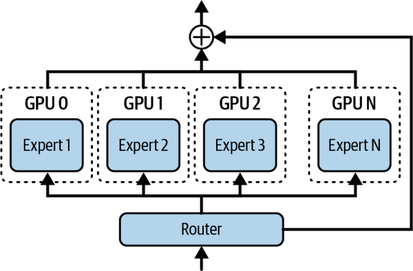

一种降低通信开销的策略，是为我们的 GPU 集群采用分层路由策略：先用 NVSwitch/NVLink（快）在同一节点内的各块 GPU 之间路由 token，只对剩下那些需要非本地专家的 token 才跨节点路由。这种两阶段的 all-to-all 可以减少节点间流量的体量。

此外，你可以通过把通信与计算相互重叠来使用异步通信。高性能的 MoE 推理服务器采用双缓冲通信：在一批 token 被来回发送的同时，上一批 token 的专家计算并行地进行。这种流水线化隐藏了大部分通信延迟。

> 当节点间网络保持充分利用、而节点内的打乱在后台运行时，是有可能实现接近最优的 all-to-all 完成时间的。请务必同时测量节点间 NIC 与节点内 NVLink 两条路径上的链路利用率。

一种天真的专家路由实现，如果使用单个全局 all-to-all 屏障，会让 GPU 卡在同步开销上等待。如果并非所有链路都被最优地利用，这会浪费带宽。

诸如*蝶形调度*（butterfly schedule，又称*移位 all-to-all 调度*，shifted all-to-all schedule）之类的技术，可以把通信拆分成分阶段的多轮。这样一来，每条 NVLink/NIC 都在忙于部分交换——而不是挤在一次大同步里。这种错开的方式改善了链路利用率，减少了空闲时间。

all-to-all 交换可以使用内置的 ncclAllToAll 集合通信，或使用成组的 send/receive 调用。当交换被分块并流水线化，或跨节点采用蝶形之类的分层调度时，吞吐量往往会提升。请验证并选择与你的拓扑相匹配的算法。

> 让第一阶段的 all-to-all 保持在机架内（NVLink），只把残余的 token 溢出到机架间。剖析链路利用率，以确认 NIC 处于饱和状态、同时 NVLink 打乱在后台运行。此外，当节点间链路成为瓶颈时，建议把 MoE 的 all-to-all 通信与专家计算做双缓冲。你可以使用分块/流水线化的交换以及蝶形/移位调度，来避免全局屏障造成的减速，并胜过扁平（非分层）全局集合通信。

另一种降低通信流量的方案称为*专家共置*（expert collocation）。其思路是把某些专家共置在同一块 GPU 或同一节点上，从而避免不必要的通信。设想有两个专家——专家 5 和专家 7——它们经常被 token 路由器为同一个 token 同时激活。把专家 5 和专家 7 放在同一块 GPU 上，就能省去一次额外的 all-to-all 跳转。剖析工具与门控频率分析有助于为你的工作负载识别出这类配对。

还有一种方案是压缩专家之间的通信，包括专家交换的激活值。例如，你可以在执行 all-to-all 通信之前，先用 NVIDIA Transformer Engine 在 Tensor Core 上把数据转换为 FP8 或 NVFP4。这会降低 NIC 负载，从而把压缩计算的开销摊薄掉。这样做以极小的数值精度损失换取 GPU 之间更快的激活值传输。相对于网络与内存传输成本，转换以及打包/解包的开销通常很小。

简而言之，优化 MoE 通信需要分析硬件与网络拓扑，以优化专家在 GPU 上的放置。对于你的部署而言，为集群互连配置高效的 all-to-all 通信非常重要。例如，在 NVL72 机架中使用 NVLink Switch 网状拓扑，可在单个域内的最多 72 块 GPU 之间获得满带宽通信。粗糙的 all-to-all 选择可能主导整层耗时，并导致极低的 SM 效率。应尽量优先处理专家流量并做重叠，并且在做出不同的互连与通信算法选择时，务必进行剖析与验证。

> 对于 MoE，应把集群配置为针对 all-to-all 通信做优化。这意味着为你的拓扑选择合适的 NCCL all-to-all 算法或分组收发（grouped send and receive）实现，然后确认节点间路径已启用 GPUDirect RDMA。此外，确保你的 InfiniBand 链路已正确绑定，使多条物理链路（端口）配置为单个逻辑通道。它们的带宽应被合并——并且故障切换应无缝进行。换句话说，确保你的网络拓扑针对 MoE 做过调优。这既包括栈中的硬件层，也包括软件层。

### 负载均衡、容量因子与专家复制

建议让每个专家和每块 GPU 获得均等份额的工作，以避免“热点”。否则，如果 MoE 的门控网络把不成比例的 token 数量导向某个特定专家，那些 GPU 就会过载。这会增加延迟，并降低系统整体吞吐量。

设想某块专家 GPU 成为热点，利用率飙升到 99%，而其他专家 GPU 平均利用率约为 60%。如果处理不当，这会成为整个训练或推理集群的瓶颈。

在模型训练期间，可以通过添加一个负载均衡损失项来应对热点，该损失项会在门控过度使用某些专家、而对另一些专家使用不足时对其施加惩罚。其结果是，训练出的 MoE 模型倾向于把 token 相当均匀地分布到各个专家上。

然而在推理时，特定的输入提示词或主题仍可能因集中于一小部分“热点”专家而造成不均衡。避免推理热点的一种策略是使用会触发溢出机制的*容量因子*。

通过指定容量因子，可以把模型配置为每个专家在给定时刻最多只能处理一定数量的 token（例如 32 个 token）。如果某个专家收到的 token 超过该容量，多出的 token 既可以被转发到路由分数次高的后备专家，也可以被序列化并在第二遍中处理。图 15-12 对比了容量因子为 1.0 与 1.5 的情形。

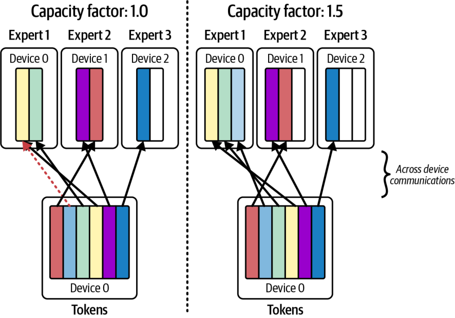

在实践中，容量因子取 1.2（20% 的溢出余量）并配合 top-2 门控较为常见。这意味着每个专家最多承担其平均负载的 120%。超出之后，它会把多余的 token 发送给下一个专家。这能有效地把系统中各专家之间的负载抹平。

避免热点的另一种策略是专家复制（expert replication）。如果某个专家持续成为热点，系统可以把该专家克隆到另一块 GPU 上。这样，门控函数就可以把一部分 token 发送给运行在另一块 GPU 上的专家副本。

这些副本是一种纯应用层优化，由推理引擎实现。模型本身并不知道副本的存在。由于副本被注册为拥有各自索引的独立专家——而且往往位于不同的 GPU 上——引擎便可以根据原始专家及其克隆体的相对路由分数，在两者之间路由 token。

> 复制专家会增加每个被复制专家的内存占用——以及成本。但由于往往只有少数几个专家会过载，只复制少量热点专家是一种有针对性的修复手段——它不会因为复制整个模型及其全部专家而使成本翻倍。

此外，如果模型有更新，复制需要小心处理以保持各副本同步。让所有副本专家保持完全一致（例如权重相同）非常重要，因为门控路由器只知道单个专家，而实际上并不知道副本的存在。

> 通常，副本从与原始模型相同的检查点（checkpoint）加载——而不会被独立更新。这可以防止原始专家与其副本之间产生分歧。

### 自适应专家路由与实时监控

传统的 MoE 专家门控在训练之后就固定不变，而自适应专家路由（adaptive expert routing）则不同：它可以在推理期间实时调整门控的决策，以响应当前状况和专家负载。例如，如果系统检测到某块专家 GPU 落后了，它可以指示门控函数把一部分 token 转移到另一个专家上。另一个专家的路由分数可能略低，但因为它有可用容量，所以会接到这些请求。

你应当对每个专家的利用率与响应延迟指标实施持续监控。现代 MoE 系统会与遥测框架集成，使每个专家把利用率指标上报到 Prometheus/Grafana。这样，系统就能动态地即时调整容量因子或门控算法。

大多数 LLM 专家门控函数只考虑在训练时确定的路由分数。然而，真正自适应的系统需要由推理引擎来处理，并在推理时动态执行。

要实现自适应路由，推理引擎需要用自定义逻辑包裹模型的前向传播。例如，它可以拦截门控的 softmax，并根据当前的负载指标把一部分 token 重新分配给不同的专家。

推理引擎依赖诸如每 GPU 利用率和每专家 token 计数之类的实时指标来持续测量专家负载。如果系统看到某个专家的 GPU 处于 99% 利用率、而其他专家的 GPU 处于 60%，系统就可以通过把一部分 token 路由到它的专家副本——或路由到另一个专家偏好分数略低的专家——来暂时降低其负载。

图 15-13 展示了一种采用偏置门控分数（biased gating score）方法的自适应 MoE 路由策略。虽然这一方法最初用于训练场景，但推理场景可以采用一种更简单的方式。在这种情况下，它会使用一种改良的专家偏置算法，在主专家负载沉重时把 token 转移到备用专家上。

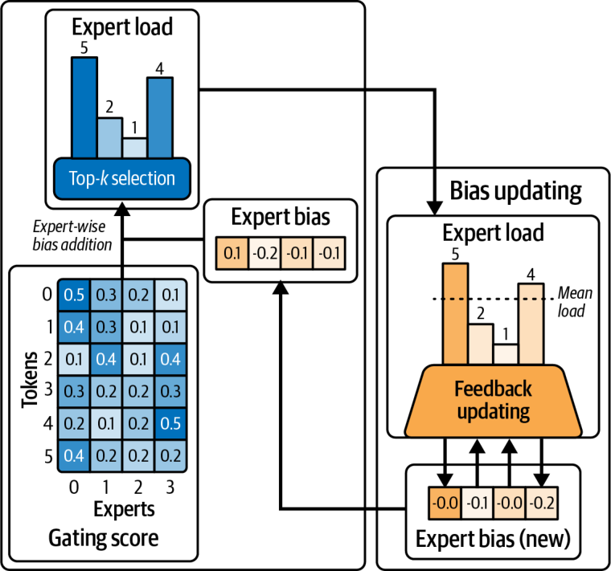

这种方法可以减少不必要的通信，并把负载更均匀地平衡开来。不过，它确实会带来一些额外成本，表现为额外的监控、决策、复杂度、配置管理和日志记录。这些收益未必总能盖过成本。每种场景和工作负载都各不相同，但这绝对值得探索。

当使用 Nsight Systems 等工具进行剖析时，你会希望监控各专家 GPU 的 all-to-all 通信的时间线轨迹。例如，如果某块 GPU 在时间线中的片段明显更长，那么它很可能正在处理更多的 token。

你的推理系统可以利用这些洞见来调整专家门控概率，并动态地把专家重新分配到不同的 GPU 上。它还可以派生额外的专家副本实例，等等。这有助于通过调整专家门控算法、修改专家放置或创建/移除专家副本来重新平衡负载。

> 在推理时动态派生新的专家副本并不简单。这种方法需要预先预留的容量，或为这些专家提供快速的模型加载。这是一种高级优化技术。”

把某些专家在各 GPU 上以不同方式分组，可以带来更均匀的 token 路由，并因更好的并行性而提升整体吞吐量。这是因为 GPU 可以更同步地完成每一层的工作。如果检测到持续的不均衡，现代 MoE 调度器可以通过调整容量因子即时派发额外的专家副本。这能缓解由门控不均衡引起的热点。

> 记得记录系统所做的任何动态更改。此外，建议为某个专家利用率超过阈值（例如 80% 利用率）的情形设置告警。

动态路由策略瞄准两个核心目标：降低路由开销，以及在各专家 GPU 之间均匀分配工作。实现低开销取决于利用高带宽互连、把数据传输与计算重叠，以及通过共置和智能调度来最小化冗余的数据搬移。

负载均衡可以通过简单的 top-1 或 top-2 门控、或更高级的容量感知门控来实现。也可以通过动态复制和专家重分配来实现。组合使用这些技术很常见，以最大限度的计算和最小的通信延迟让 GPU 保持繁忙。

只要路由开销被最小化且负载得到均衡，自适应 MoE 推理系统就能在你增加专家数量时实现近乎线性的吞吐量扩展。例如，把 GPU 数量翻倍几乎就能让你的推理吞吐量翻倍。

简而言之，这些自适应专家路由与负载均衡优化，可以与前文介绍的并行和解码技术集成在一起。这样，你就能为超大规模下的高性能调优你的 MoE 推理系统。持续的剖析与自适应算法能让你的 GPU 忙于计算，避免因通信延迟而空转。

> 先进的推理引擎可以动态绕过某些专家计算、关闭利用不足的专家，或利用缓存对某些 token 跳过专家。这能进一步降低延迟。这些技术建立在本章所述概念之上。

## 关键要点

向数十亿终端用户提供超大 LLM 服务，需要在推理流水线的每个阶段进行优化。以下是本章的一些关键要点：

*分离以同时优化延迟与吞吐* 把提示词 prefill 与 decode 两个阶段拆分到独立的 GPU 池上，可以消除相互干扰。这让你能够同时实现低首 token 时延和高每秒 token 数，而不必以牺牲一者来换取另一者。这是大规模 LLM 服务的一项基础性技术。

*为超大模型使用混合并行* 对于数万亿参数的模型，任何单一的并行策略都不够用。应按需组合张量、流水线、专家和数据并行。例如，跨 GPU 分片各层（TP/PP）以把模型装入内存，对 MoE 层使用专家并行以扩展模型容量，并添加数据并行副本以满足吞吐需求。最优组合取决于硬件。务必针对你的工作负载对配置进行剖析和调优。

*缓解顺序解码瓶颈* 先进的解码方法可以极大地加速生成。当接受率针对任务调优后，配合快速草稿模型的双模型投机解码通常能带来约 2–3× 的加速。EAGLE-2 报告在某些任务上可达最高 3.5× 加速（比 EAGLE-1 多 20%–40%），同时保持目标分布。Medusa 的实现在针对目标工作负载训练和验证后，报告相较非投机解码可达最高 3.6× 加速。这些技术在提升 token 级并行性和算术强度的同时，在标准验证下保持大模型的输出分布。总的来说，其结果是在不重新训练主模型输出的前提下获得更快的响应。这表明投机解码是一种保质技术。

*用约束维持输出质量与格式* 在生产环境中，你常常需要让 LLM 遵循严格的格式或避免某些 token。受约束解码技术让你能在生成过程中强制执行规则——比如 JSON 模式和禁用词。它们会给每个 token 带来一些开销，但借助编译后的语法和优化的掩码路径，受约束解码在大规模下往往能运行在正常解码的低个位数百分比开销以内，尽管复杂语法或小批量可能带来更高的开销。务必测试你的约束所带来的性能影响。如有可能，避免使用极其严格的规则。它们会因导致过多回溯而拖慢生成。

*均衡 MoE 工作负载以实现有效扩展* 专家混合模型在模型规模相对于 GPU/专家数量上提供了几乎线性的扩展——但前提是你要高效地处理路由。使用高带宽互连和分层的 all-to-all 通信来减少网络瓶颈。通过施加容量上限和 top-2 门控来确保每个专家获得相近的工作量，以避免掉队专家。对任何持续过热的专家进行复制，以分摊其负载。一个调优良好的 MoE 推理系统，可以在你增加 GPU 时接近线性的吞吐量扩展。

*利用软硬件协同设计* 现代 GPU 硬件正是为支持这些并行与分布式推理方法而构建的。使用能充分发挥硬件与拓扑优势的软件，包括 vLLM、SGLang 和 NVIDIA Dynamo 等推理引擎。它们能以最小的开销编排多 GPU 和多节点推理。让节点内通信保持在 NVSwitch 上、仅在必要时才使用 InfiniBand，并把通信与计算重叠，从而使你的策略与硬件的强项对齐。这种对齐是实现最佳延迟和成本效率的关键。

*理解复杂度与投资回报率（ROI）之间的权衡* 每一项优化都会增加系统复杂度。投机解码和自适应 MoE 路由等技术可以显著提升性能，但它们需要额外的模型或错综复杂的逻辑。务必权衡代价。对于交互式应用，2–3× 的延迟提升通常是值得的。对于更简单的用例，一种直截了当的方法可能就够用了。从最大的瓶颈入手，比如消除 prefill/decode 干扰。然后在需要时逐步增加复杂度。通过监控和剖析来确定哪些优化能带来最佳的投资回报率。

## 结论

通过把分离式 prefill/decode 流水线、多 token 投机解码、动态专家路由和自适应编排结合在一起，就有可能以最小的资源争用和超低延迟实时地为 LLM 提供服务。

vLLM、SGLang 和 NVIDIA Dynamo 等现代推理服务平台采纳了其中许多优化。它们能高效地分配集群资源、跨节点协调 KV 缓存、实现投机解码和受约束解码、调度 prefill/decode 任务，等等。

关键在于一个端到端、可适配的架构，它把算法创新与高性能硬件能力相匹配。在接下来的几章中，我们将更深入地探讨模型推理性能优化，包括动态、自适应和多节点的服务策略。

我们将涵盖从应用层前缀缓存、延迟感知的请求路由、基于强化学习（reinforcement learning，RL）的集群调优，到系统层的自适应内存分配、精度切换和拥塞感知的资源调度等全部内容。