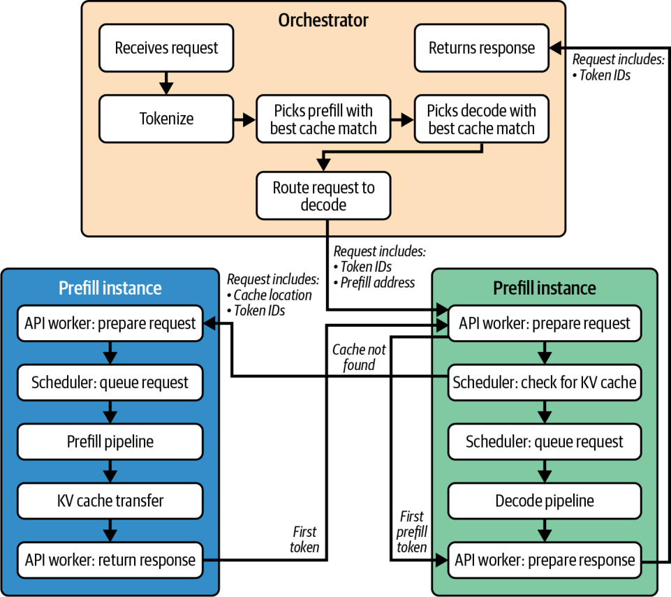
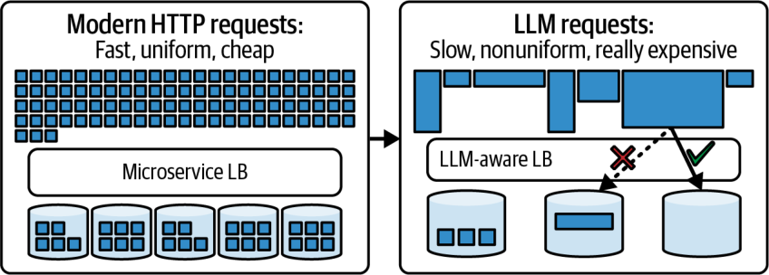
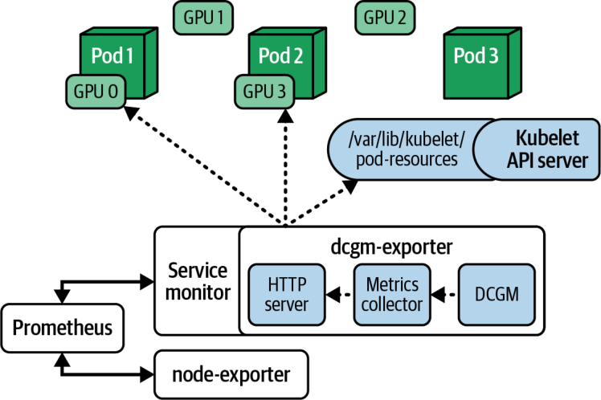
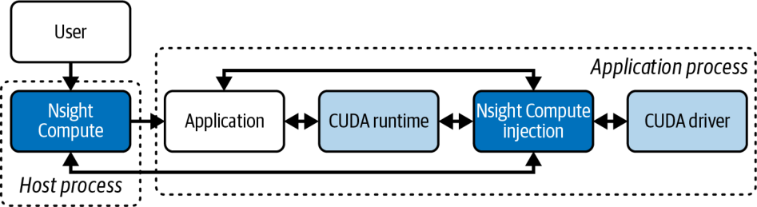
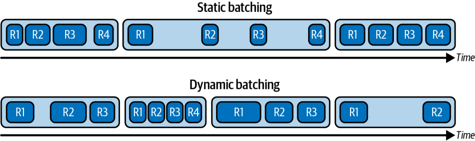
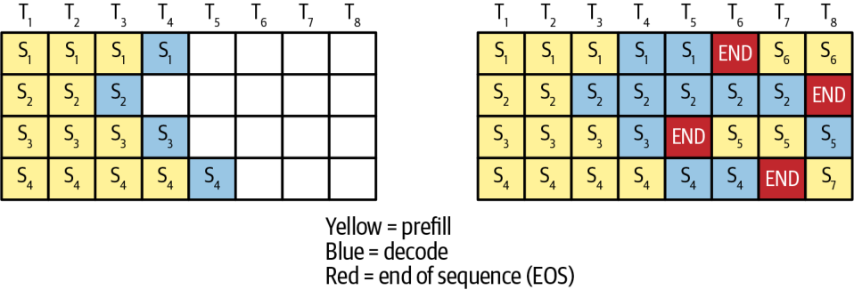
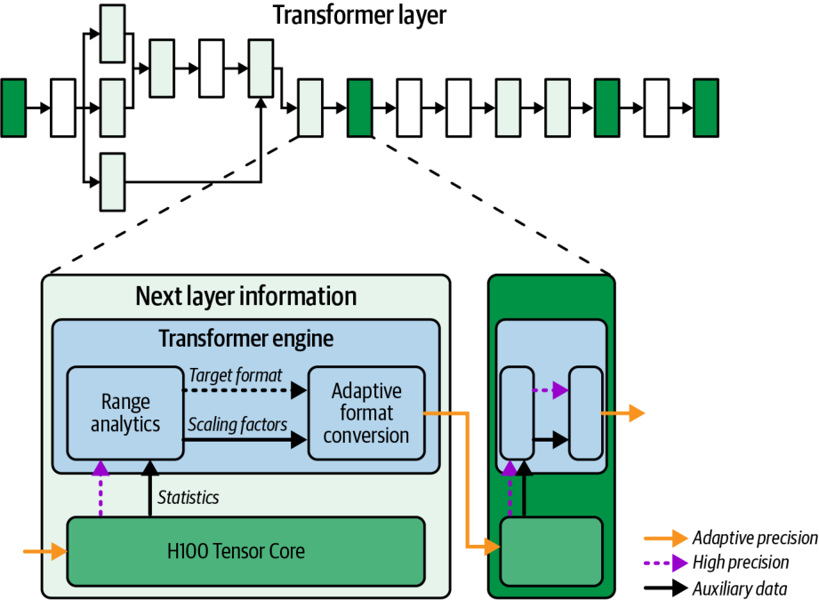
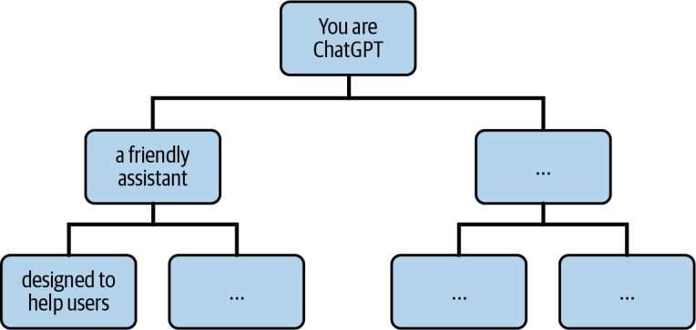
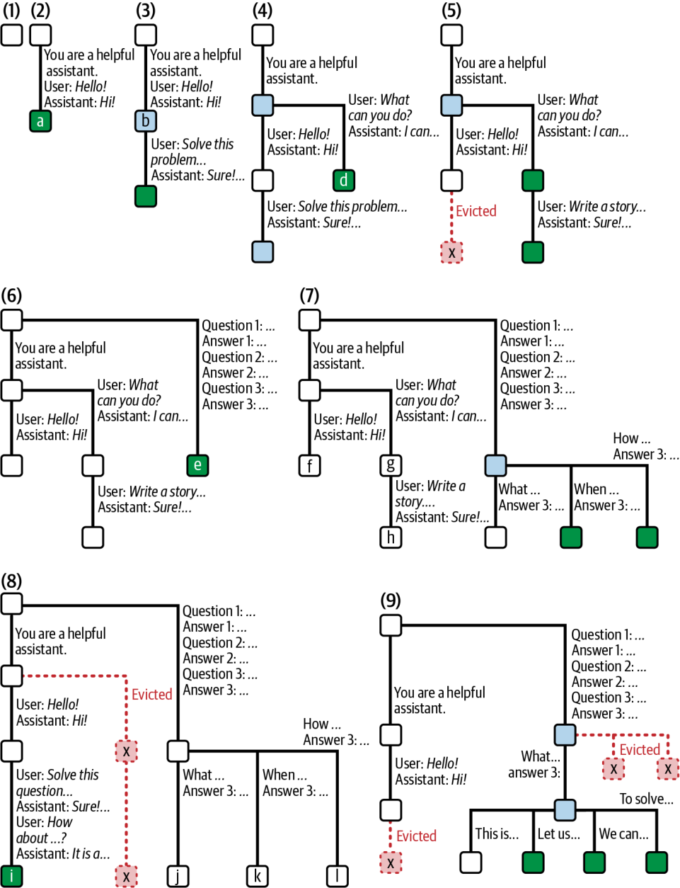
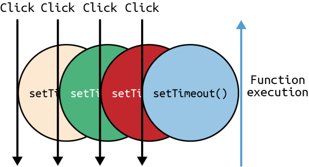

# 第 16 章. 大规模推理的剖析、调试与调优

运营大型 LLM 推理集群，需要监控与调试工具来确保一切按预期运行。当性能偏离目标时，它们还能帮你快速定位瓶颈。

在本章中，我们将演示如何使用各类工具来监控和调试这些复杂系统，例如用 NVIDIA Nsight Systems 做剖析，用 Prometheus/Grafana 做集群级遥测。我们还会展示如何采集并解读关键指标，如 GPU 利用率、内存压力、尾延迟（tail latency）分位数、缓存命中率、逐 token 计时等等。这些指标可以指导我们对推理引擎做性能优化。

接着，我们讨论运营层面的性能调优，包括在大型集群中优化 GPU 利用率、降低推理延迟、提升吞吐量的经生产验证的方法。这涵盖了计算与通信重叠、请求调度与批处理，以及高效使用 NVLink、NVSwitch、InfiniBand 等高速互连的技术。

我们还会对比面向推理的实时量化（quantization）技术，包括用 Generalized Post-Training Quantization（GPTQ）和 Activation-Aware Weight Quantization（AWQ）等实现将模型压缩到 8 位与 4 位精度的方法。在此过程中，我们会讨论仅权重量化（weight-only quantization）与同时量化权重和激活之间的权衡。我们提供在服务流水线中应用量化以降低内存占用、提升吞吐量的实用指南——同时保持模型精度不下降。

最后，我们探讨与底层性能调优互补的应用级优化（application-level optimization），包括提示压缩（prompt compression）、前缀缓存（prefix caching）、去重、查询路由（例如回退模型），以及部分输出流式返回等策略。

## 推理性能的剖析、调试与调优

现代 LLM 推理引擎有大量相互关联的环节——尤其是在 prefill 与 decode 分离（disaggregated）的情况下。一个典型请求的生命周期涉及许多组件，如图 16-1 所示。



面对如此复杂度，推理性能调优的工作流高度迭代。它需要细致的调优与持续的验证。

首先，你应当观察指标，识别当前的瓶颈，例如某块 GPU 未被充分利用，或延迟高于预期。接着，提出改进假设，例如“增大批大小”或“为操作 X 增加通信与计算的重叠”。然后，实现修复方案并验证该假设。

之后，理想情况下你应当在预发布（staging）环境中，用具有代表性的负载配合剖析工具测试该修复，验证改动的行为符合预期。例如，你可以确认某个操作确实呈现出恰当的内存与计算重叠。

最后，你应将修复部署到生产环境，并监控 Grafana 与日志，验证该修复确实在真实负载上提升了吞吐量与延迟。当新的瓶颈出现时，重复这个工作流。

这套“观察—假设—调优”的循环应当持续进行。现代部署往往会将这些步骤自动化。例如，你可以用定期的负载测试——以及随后对关键指标的异常检测——来触发一次调优工作流。

> 在向生产环境部署优化（包括更新后的推理运行时和模型变体）时，建议执行金丝雀（canary）发布。通过先把优化部署到运行在少量服务器上的一小部分流量，你可以在向所有终端用户全量部署之前先验证优化效果。这种增量式方法通过尽早发现意外副作用，帮助缩小其“爆炸半径”，避免影响所有用户。

设想这样一个场景：由于过多的分词或推理数据预处理，主机侧 CPU 利用率飙升到 100%。这会限制推理引擎能处理的并发流数量。一种修复办法是用 GPU 加速的分词库，或用 CUDA、OpenAI 的 Triton 语言编写的自定义 GPU 核函数，把预处理迁移到 GPU 上。

在部署新的库或核函数后，你应当对比部署前后的 CPU 利用率。如果看到 CPU 利用率下降、整体吞吐量上升，那么系统就不再受基于 CPU 的输入预处理所瓶颈约束了。

你还应关注各类缓存的命中率，包括前缀缓存、提示嵌入缓存和 KV 缓存（KV cache）。你应当有“缓存命中”对比“缓存未命中”的指标。高缓存命中率意味着系统在有效复用数据。反之，如果你看到很高的缓存未命中率，那多半需要调整缓存大小、逐出（eviction）策略或缓存策略，以最大化缓存命中。

vLLM 的 LMCache 组件允许调整 GPU 与 CPU 的缓存比例。如果因 GPU 内存受限导致未命中率偏高，你可以启用它的分页缓存卸载能力，让 CPU 来分担。务必确保你的缓存逐出策略（Least Recently Used [LRU]、Least Frequently Used [LFU] 等）与访问模式相匹配。

另一个场景是使用 KV 缓存，在批处理请求之间复用相同输入序列前缀的数据，从而避免为该前缀重新计算 KV。这时，你需要度量请求共享前缀的频率。这会触发一次*前缀**合并*（prefix merge）事件，并递增 vLLM 中的前缀缓存命中指标，包括 vllm:gpu_prefix_cache_queries 和 vllm:gpu_prefix_cache_hits。例如，借助它们你就能用“命中数 ÷ 查询数”算出命中率。

度量前缀合并率有助于你将其与实际缓存命中率相关联，从而衡量缓存层的真实收益。这样，你就能调整批处理与调度策略以最大化共享前缀——并预测不同负载下端到端的吞吐量与延迟改善。

你可以在推理引擎上运行合成生成的数据，测试包含大量重复前缀的提示。理想情况下，你会看到因前缀合并而带来的 prefill 计算量下降。

vLLM 和 SGLang 等现代 LLM 推理引擎原生暴露前缀合并指标。但如果前缀合并不是你的推理引擎导出的一等指标，你应当自行埋点一个“前缀去重 token 数”的自定义计数器（counter）来监控其有效性。

> 如果你发现前缀合并的表现不如预期，应当检查前缀匹配逻辑是否失效。调试时先从检查分词器差异入手。这是绝大多数前缀匹配问题的可能根因。

除了性能之外，监控还有助于容量规划。通过跟踪利用率和延迟随负载上升的表现，你可以推断系统在何时会触及某个特定上限，例如 p95（第 95 百分位）延迟开始呈指数上升。这种情况下，动态批大小可能正在增大到收益递减的临界点。

> 如果你采用分层缓存策略，包括基于 NVMe 的 KV 缓存扩展，务必监控该设备的 I/O 延迟。高 I/O 延迟会显著降低缓存性能。

当单 GPU 的并发达到上限、进一步增大批大小不再提升吞吐量时，你可以考虑横向扩展（scale out）：增加更多 GPU、部署额外的模型副本，或增加专家数量，把工作分摊到更多计算单元上。

在横向扩展之前，你还应考虑模型压缩——或切换到更低精度（FP8/FP4）——以获得每块 GPU 更高的有效吞吐量。不过，一旦硬件饱和（例如 SM 达到 100%、内存带宽接近峰值利用），增加更多 GPU 或使用张量/流水线并行很可能就是提升吞吐量的唯一路径了。

而且要记住，始终权衡新硬件的成本与效率收益。有时候，升级到内存更大、FLOPS 更高的更新款 GPU，会比横向扩展一批老旧 GPU 更具成本效益。

增加专家数量可以抬高你的吞吐量上限——但前提是你同时改进专家路由与调度，以应对额外的全对全（all-to-all）通信。否则，粗放的扩展可能只是把瓶颈转移到网络上。接下来，我们讨论监控，以及如何验证优化努力是否真正见效。

### 监控系统指标与计数器

传统微服务（microservice）调用的执行时间相对统一且可预测，而 LLM 请求则不然：它们不统一，延迟可能天差地别。这一差异如图 16-2 所示。



对于生产中的持续监控，常见做法是用 Prometheus 从每个 GPU 计算节点采集指标——并用 Grafana 仪表盘将其可视化。需要跟踪的关键 GPU 指标包括 GPU 利用率（SM 处于繁忙状态的时间占比）、GPU 内存用量、拷贝引擎利用率、PCIe 与 NVLink 吞吐量，以及 GPU 温度和功耗（例如降频）。注：L1、L2 活动、占用率（occupancy）和指令吞吐等底层计数器，可用 Nsight Compute 或 CUPTI 采集，而非 DCGM 与 Prometheus。

> 在监控内存碎片时，cudaMemPool 指标和异步分配器统计信息很有帮助。应将它们整合进你的监控体系，因为这会极大方便在生产中调试系统性能问题。

监控互连利用率同样重要，包括 NVLink、NVSwitch 带宽和网卡（NIC）吞吐。这样，你就能在多 GPU 和多节点集群配置中捕捉到通信瓶颈。

NVIDIA 的 Data Center GPU Manager（DCGM）暴露了许多 GPU 指标，Prometheus 可以抓取并采集它们。例如，DCGM 提供 DCGM_FI_DEV_GPU_UTIL 表示 SM 利用率百分比，DCGM_FI_DEV_MEM_COPY_UTIL 表示内存拷贝引擎利用率，DCGM_FI_DEV_FB_USED 表示已用的帧缓冲内存等等。

DCGM 暴露 NVLink 错误计数器，并可在部分平台和驱动版本上暴露吞吐计数器。对于持续的链路利用率，还应使用 nvidia-smi nvlink 和 Nsight 工具。你应当把这些指标整合进仪表盘，并设置告警，以便识别网络何时被跨 GPU 和跨节点的通信流量占满。DCGM 会跟踪 Xid 计数器以及严重的 GPU 错误。

> 尽管 DCGM 暴露了 NVLink 计数器，但截至本文撰写时，dcgm-exporter 默认并不在所有平台上暴露每条链路的带宽。因此，如果你需要链路级吞吐，可能需要直接查询 DCGM 或扩展该 exporter。

同样建议采集高层应用指标，如每秒查询/请求数、平均延迟以及 p95/p99 延迟、活跃上下文数量，以及以 token/秒计的吞吐量。KV 缓存利用率与大小（整体的以及每个节点的）相关指标也极其重要，需要监控。

你可以设置 Prometheus node exporter 从每个节点采集所有这些指标，把数据汇集到一处，甚至为关键阈值设置告警。随后，Grafana 就能将这些指标绘制成实时仪表盘，与团队共享。例如，图 16-3 展示了如何从 Kubernetes 集群中的每块 GPU 采集指标，导出到 Prometheus，再用 Grafana 可视化。

这样，当你部署一项新的优化（比如增大批处理）时，Grafana 会立即显示每块 GPU 的利用率是否上升。你还可以监控以确保 p95/p99 延迟保持在目标范围内。

计数器同样极其有用——尤其对于动态自适应系统。例如，如果你的推理引擎会根据当前状况动态调整批大小，你可能会想递增一个“批大小变更”计数器。



另一种选择是把变更记录到日志文件里，但这样一来，就需要用 Apache Spark 之类的工具对日志文件做缓慢的、基于文本的搜索/聚合来离线分析。之后，你还得手动把日志分析结果与 Prometheus 指标相关联。

只要为感兴趣的应用级事件（包括错误）递增一个简单的计数器，数据就会被推送到 Prometheus，并可在 Grafana 仪表盘中与所有其他指标一起实时查看。此外，考虑对关键事件使用结构化日志与分布式追踪。

现代应用性能管理（application performance management，APM）工具——以及 OpenTelemetry——可以摄取这些日志/追踪，并将它们与指标相关联。这样就能提供跨整个系统的一致的事件时间线视图。洞察这条时间线，有助于加快调试性能问题的速度。

如果你持续监控这些指标，就能获知下一步该调优什么。例如，如果 GPU 利用率低于预期，你可以检查 GPU 内存是否已被占满。如果尚未充分利用，你可以尝试增大批大小或最大并发请求数。不过，务必留意延迟服务级目标（service-level objective，SLO）。你可不希望突破这些目标。

> 现代推理服务器会为动态批处理暴露一个“最大延迟”设置。调整它以满足你的 SLO。调大它会增大批大小（提升吞吐量）。但调得过大又会损害 p99 延迟。请结合你的延迟目标持续调整。

反之，如果 GPU 内存接近上限，推理引擎可能开始把不活跃的 KV 缓存数据换出到主机 CPU 内存或 NVMe 存储。这会降低 GPU 利用率，因为 GPU 需要等待来自慢速 CPU 内存或磁盘的额外数据传输。

> 如果你看到 GPU 内存拷贝引擎利用率出现尖峰——或者出现与低 SM 利用率同步的异常 NVLink 利用率——那么你的推理引擎很可能正在把 KV 缓存数据换入换出 GPU 内存。这会因过多的数据传输延迟而使系统受阻。

如果确实在发生换页，你可以调整推理引擎的分页参数以减少抖动（thrashing），应用 FP8 或 FP4 量化，为缓存增大 GPU 内存分配，并可能改变换页策略。这应当能把拷贝利用率降下来、把计算利用率提上去——正是你想看到的结果。

Grafana 同样可用于延迟跟踪。你可以绘制端到端请求延迟的分布——通常还会同时度量 prefill 延迟和逐 token 延迟。如果 p99 延迟在某些时刻出现尖峰，你应当把它与 GPU 指标和其他日志相关联。

例如，p99 延迟尖峰可能与 GPU 利用率下降的时段相关。也许这个延迟尖峰与一次触发了更大动态批大小的流量激增相关。这会导致该时段内延迟升高。为了验证，你可以在 Grafana 仪表盘的延迟图上叠加 RPS（每秒请求数），看看这两张图是否相关。

如果这个尖峰正如我们假设的那样，是由批大小的动态增大所致，那么务必确认它没有突破你的服务级协议（service-level agreement，SLA）。如果突破了，你可以尝试减小最大请求批队列延迟，或降低最大批大小，以给延迟设一个上限。

诊断问题时，日志同样极其宝贵。你应当在代码中埋点，记录关键事件，例如批何时形成、通信何时开始/结束等。最好使用 DEBUG 级别，以便按需启用/禁用——从而不影响请求-响应延迟。

当你启用调试日志时，会看到一条文本格式的逐步时间线。在一次调试会话中，你很可能会把日志时间线与 Prometheus/Grafana 指标结合起来一起用。例如，你可以看到全对全通信耗时超过 5 ms 的频率有多高。

把基于日志的时间线与指标结合起来，你就能发现离群点，比如某些网络问题可能拖慢了全对全通信交换中的某一次迭代。如果这种情况持续发生，你可以调高专家容量因子（capacity factor），让任何超额的 token 自动溢出到备用专家副本上——理想情况下，该副本托管在网络路径更稳定的 GPU 上。这会均衡负载并把延迟降到最低。

> 实践中，把容量因子设为 1.2–1.5 是常见做法，因为这允许在主专家过载时，把额外 20%–50% 的 token 重新分配出去。这能显著平滑 MoE 推理中的尾延迟。当某个专家所在 GPU 的互连状况变差、略有停顿时，与其把请求排队堵在它后面，不如溢出到第二个专家。如果你的网络出于某种原因持续出现问题，这样做会降低系统对离群点的敏感度。

### 用 Nsight Systems 与 Nsight Compute 做剖析

在开发和调优推理代码时，你可以用 Nsight Systems 捕获跨 CPU 与 GPU 的工作负载追踪。Nsight Systems 提供时间线视图，以微秒级分辨率展示 CPU 线程、GPU 核函数、CUDA 事件、NCCL 通信等等。

通过用 NVTX 注解为代码埋点，我们可以在时间线上清晰地标注出“Prefill 阶段”“Decode 步骤”或“全对全通信”等区域。下面的代码展示了如何使用 NVTX v3 C API 的显式 push 与 pop 区间，在示例 prefill 与 decode 步骤周围加上 NVTX 区间标记：

```
// Example C++ snippet with NVTX annotations using the C API.
#include <nvtx3/nvToolsExt.h>   // or <nvToolsExt.h>
#include "my_model.hpp"         // Your model’s C++ interface
#include <vector>
// Small helpers to keep callsites tidy.
#define NVTX_PUSH(name, argb)                                           \
  do {                                                                  \
    nvtxEventAttributes_t a{};                                          \
    a.version = NVTX_VERSION;                                           \
    a.size = NVTX_EVENT_ATTRIB_STRUCT_SIZE;                             \
    a.colorType = NVTX_COLOR_ARGB;                                      \
    a.color = (unsigned int)(argb);                                     \
    a.messageType = NVTX_MESSAGE_TYPE_ASCII;                            \
    a.message.ascii = (name);                                           \
    nvtxRangePushEx(&a);                                                \
  } while (0)
#define NVTX_POP() do { nvtxRangePop(); } while (0)
struct Token { int id; };
void run_inference(
    const std::vector<Token>& prompt_tokens,
    Model& model,
    int num_generate_steps) {
  // Prefill
  NVTX_PUSH("Prefill", 0xFF4F86F7);
  model.encode(prompt_tokens);
  NVTX_POP();
  // Decode one token at a time
  for (int t = 0; t < num_generate_steps; ++t) {
    NVTX_PUSH("Decode", 0xFFFF8C00);
    Token next_token = model.decode_next();
    // ... (sampling / streaming to client)
    NVTX_POP();
  }
}
```

在这里，我们用 nvtxRangePushEx/nvtxRangePop 显式标注区域。我们在 model.encode(...) 之前紧接着 push 一个 "Prefill" 区间，并在其后立即 pop。在 decode 循环内，我们在每次迭代开头 push "Decode"，并在 model.decode_next() 之后 pop。小巧的 NVTX_PUSH/NVTX_POP 辅助宏还会附上颜色（十六进制值）和文本。这有助于减少时间线可视化中的错配——同时保持调用点简洁。显式的 push/pop 配对在代码中清晰可见，便于审查。

带颜色的区块注解会出现在 Nsight Systems 的 GPU 活动时间线上，标注为 "Prefill" 和 "Decode"。这让你很容易看出每个阶段耗时多久——以及这些阶段如何与通信操作重叠。这有助于识别诸如 GPU 空闲间隙和意外同步之类的问题。

> 注：请注意，我们直接使用 NVTX C API（nvToolsExt），而非 PyTorch 的 record_function()。这让我们能在纯 C++ 运行时中标注热点路径，并在工作从 Python 或其他语言发起时保持标记一致。

通过把范围收紧到 model.encode(prompt_tokens) 周围所需的最小区域，剖析标记就恰好覆盖 prefill 工作，而不涉及其他代码。这提升了追踪的清晰度和性能诊断效果。

在多个 CUDA 流上入队工作时（例如用专门的“传输”流做 H2D/D2H 拷贝、用“计算”流跑核函数），你应当使用按流划分的区间。为此，你可以用各不相同的 NVTX 区间把每条流的主机端代码包裹起来。

例如，你可以用 nvtxNameCudaStreamA(transfer_stream, "transfer_stream") 和 nvtxNameCudaStreamA(compute_stream, "compute_stream") 为流命名。然后，你会在内存拷贝/传输周围使用 nvtxRangePushA("transfer_stream")

和 nvtxRangePop()，在核函数启动周围使用 nvtxRangePushA("compute_stream") 和 nvtxRangePop()。

使用 NVTX 命名的流，会让重叠（或缺乏重叠）在 Nsight Systems 时间线上一目了然。下面这段代码演示了这些如何组合到一起：

```
// One-time after creating the streams
nvtxNameCudaStreamA(transfer_stream, "transfer_stream");
nvtxNameCudaStreamA(compute_stream,  "compute_stream");
// Around H2D/D2H copies (transfer stream)
nvtxRangePushA("transfer_stream");
cudaMemcpyAsync(h_logits, d_logits, bytes, cudaMemcpyDeviceToHost,
                transfer_stream);
nvtxRangePop();
// Around kernel enqueues (compute stream)
nvtxRangePushA("compute_stream");
my_kernel<<<grid, block, 0, compute_stream>>>(...);
nvtxRangePop();
```

在这里，我们为流命名，并用按流划分的区间把入队点包裹起来，让 Nsight 时间线保持可读。需要注意的一点是，NVTX 区间标注的是主机线程时间线。GPU 通道则按流展示核函数/内存拷贝。为流命名有助于在分析时把主机区间与正确的 GPU 通道对应起来。

Nsight Compute 让我们能剖析单个核函数，以精确定位低效之处。我们可以使用 Nsight Compute 基于区段（section）的剖析功能，聚焦于核函数的特定部分，例如内存事务。

另一个鲜为人知却极其有用的工具，是 Nsight Compute 的 CUDA Program Counter（PC）Sampling 功能。它对程序计数器进行采样并识别热点，而无需完整、重量级的埋点，如图 16-4 所示。



具体来说，我们可以用它来剖析在线运行的推理服务器，精确定位到底是哪些核函数指令耗时最多。而且我们能以低开销的方式做到这一点。既然我们已经讲完了用 Nsight Systems 与 Nsight Compute 做剖析，接下来就讨论一些常见的推理排障方案（troubleshooting recipe）。

> 在对在线服务做生产环境排查时，优先使用程序计数器采样，以最小开销定位热点。只有当采样结果指向某个具体核函数或阶段时，才切换到完整追踪。

### 推理排障方案

在生产环境中，持续运行重量级剖析器并不现实。因此，你需要依赖轻量的、基于指标的监控，如 GPU SM 利用率、KV 缓存告警、尾延迟分位数、缓存命中率和 OOM 告警，来检测异常并指导有针对性的修复。当某个指标越过特定阈值时，你可以针对其根因提出假设，例如批大小过小、KV 缓存不足、路由热点、分片不均衡、内存超额分配等。

然后你施加修复，例如调整批大小、提高内存利用率上限（如果可行）、调整路由器阈值，或启用 CPU 卸载。修复推送后，你应当验证其影响，并确认指标已回落到阈值以下。表 16-1 列出了一些常见生产问题的关键指标、症状、可能原因和推荐处置。

表 16-1. 常见排障症状、原因与推荐处置

| 指标/症状 | 可能原因 | 推荐处置 |
| --- | --- | --- |
| SM utilization < 50% | 批过小或缺少融合核函数 | 增大批大小，启用融合核函数（FlashAttention 或 PyTorch 中经 cuDNN 融合的 scaled_dot_product_attention (SDPA) 后端），或添加自定义融合核函数（例如用 Triton）；然后用 nsys --trace=cuda 剖析。 |
| KV 缓存抢占（preemption）告警 | KV 缓存空间不足（vLLM） | 提高 GPU 内存利用率阈值，减小批处理 token 的最大数量，考虑用 PagedAttention 做动态 KV 分配。 |
| 高尾延迟（p95 > 200 ms） | decode 节点热点或队头阻塞（head-of-line blocking） | 检查路由器日志中的路由模式。调整预取阈值。启用推测解码（speculative decoding）路径。 |
| 负载下缓存命中率 < 60% | 分片放置不均衡或缺少前缀缓存 | 校验前缀缓存连接器配置（例如用于 vLLM 的 LMCache 的 NIXL，以及 NVIDIA Dynamo 的 NIXL 连接器），并按需增大前缀缓存 TTL 或副本数。 |
| 多租户 GPU 上意外 OOM | GPU 内存超额分配 | 降低每实例 GPU 内存利用率，启用 CPU/NVMe 卸载，把进程绑定到 CPU 插槽以减少跨插槽流量。 |
| 不规则的性能离群点 | 时钟不一致或热降频 | 确保所有时钟同步，并监控热与功耗降频。 |

> 注：所有指标表格中的数值均为示意，用于阐释概念。不同 GPU 架构上的实际基准结果，请参见 GitHub 仓库。

你也可能会在日志文件里发现一些此类信息。AWS 等云厂商支持对日志文件使用正则表达式（regular expression，RegEx）过滤器，从日志行中提取数值并直接导出为指标。例如，AWS CloudWatch 就支持这一实用功能。下一个代码块中给出了一些便于监控的示例日志行。

下面是一段 vLLM 日志示例，表明由于 KV 缓存空间不足而发生了 KV 缓存抢占。因此触发了一次 KV 重算，这会占用更多 GPU 计算资源并增加延迟：

```
WARNING 2025-05-03 14:22:07 scheduler.py:1057 Sequence group 0 is preempted by
PreemptionMode.RECOMPUTE because not enough KV cache space.
total_cumulative_preemption_cnt=1
```

接下来是一段 NVIDIA Dynamo 路由日志示例。这里，第一行显示本地 decode 工作节点上 90% 的前缀缓存命中，因而 prefill 得以在本地继续运行。下一行显示了一次本地缓存未命中。路由器随后把 prefill 分派到远端的 GPU-node-03 工作节点：

```
[Router] 2025-05-03T14:23:11Z INFO KVRouter: prefix-cache hit (90%) for
model=DeepSeek-R1; routing to local vLLM worker
[Router] 2025-05-03T14:23:12Z INFO KVRouter: cache miss; dispatching remote
prefill to GPU-node-03
```

### 全栈推理优化

高性能 LLM 推理要求在技术栈的每一层做协调一致的优化。这涵盖从模型架构、核函数实现，到运行时引擎、系统编排和部署基础设施的方方面面。

模型级技术，如剪枝（pruning）、蒸馏（distillation）、稀疏性、MoE 路由、高效注意力（例如 FlashAttention）和量化感知训练（quantization-aware training，QAT），可以降低计算与内存需求。在核函数级，融合操作、自定义注意力引擎（例如 FlashInfer）、Tensor Core 利用、分块平铺（block tiling）和异步内存传输，都有助于最大化 GPU 吞吐量。

运行时策略，如动态批处理（dynamic batching）、分页 KV 缓存、CUDA Graphs，以及计算与通信重叠，能在变化的负载下让 GPU 保持饱和。系统编排层可以使用 prefill/decode 分离、智能路由、多租户隔离和自动扩缩（配合热备），来平衡延迟并提升成本效率。

> 许多生产系统使用基于 Kubernetes 的编排，分别运行 prefill 与 decode 两套部署。它们使用入口控制器（ingress controller）根据负载或用户优先级路由请求。并且它们会准备好热备 GPU pod，以便在流量激增时随时拉起。

最后，你应当探索各类部署模式，如地理分布式边缘服务、智能 API 网关批处理、面向模型变体的 CI/CD，以及实时剖析。这将在生产中提供顶级的可靠性与适应性。表 16-2 描述了技术栈各层的一些常见优化方法。

表 16-2. 技术栈各层的常见优化方法

| 技术栈层 | 关键技术 |
| --- | --- |
| 模型 | 剪枝与知识蒸馏（knowledge distillation），在精度损失最小的前提下缩小模型体积；稀疏性（MoE）以跳过部分计算；高效注意力（FlashAttention）以降低内存占用和中间缓冲；在 FP16/BF16 或 INT4/FP8 下做量化感知训练以增强低精度下的鲁棒性 |
| 核函数 | 融合算子核函数（例如 Linear + GELU + LayerNorm）以减少启动开销和内存流量；自定义注意力核函数（FlashInfer）用于块稀疏 KV 和 JIT 编译的核函数；Tensor Core 及专用指令（cp.async、TMA）用于矩阵运算 |
| 运行时 | 带延迟控制的动态批处理，如 vLLM、SGLang 和 NVIDIA Dynamo 中实现的那样（例如连续批处理，continuous batching），以合并请求；分页 KV 缓存管理，用于灵活分配内存并合并批（vLLM 的 PagedAttention）；CUDA Graphs 和缓冲池化（buffer pooling）以减少每次推理的开销；使用多条 CUDA 流（一条流做数据传输、另一条做计算）来重叠计算与通信。使用基于事件的同步——且仅在需要时使用。 |
| 系统编排 | prefill–decode 分离以消除队头阻塞；智能路由与缓存亲和性以均衡负载和缓存命中；多租户隔离与按用户配额以防止“吵闹邻居”；带热备实例的自动扩缩以掩盖模型加载时间，并接受略微增加的成本，以换取流量激增期间显著更优的延迟 |
| 部署与基础设施 | 地理分布式与边缘部署以降低网络往返时延（RTT）；带请求级批处理、可跨服务器池合批的智能 API 网关；用于以金丝雀模式滚动发布新的量化或核函数优化模型变体的 CI/CD 流水线；高带宽互连（NVLink/NVSwitch 和 InfiniBand），以及 GPU 与 CPU 之间的 NUMA 亲和性以实现最优内存访问 |
| QoS 与扩缩 | 感知 SLA 的动态批处理与尾延迟控制；用 MIG 或流优先级做 GPU 隔离以强制保障 QoS；面向 TTFT、TPOT、利用率和内存带宽利用率的实时剖析仪表盘；根据负载特征动态切换并行方式（TP、PP、DP） |

在做优化时，考虑跨层协同效应很重要。例如，量化（模型层）降低了内存占用，从而无需触发 OOM 错误就能使用更大的批大小（运行时层），这反过来又让编排组件能在每个 GPU 周期合并更多请求。

你还应当以剖析为驱动。持续的剖析应当指导下一步优化哪一层。例如，在完成融合与量化之后，如果 CPU 成了预处理和后处理的瓶颈，就投入更快的分词器，或把部分任务卸载到 GPU。

应用优化时，总有权衡需要考量。逐层 CPU 卸载和高级解码方法等技术会增加复杂度。例如，推测解码会额外引入一个草稿模型，而 Medusa 会额外引入多头并行解码。这些通常保留给极端情形，如超长上下文或延迟波动无常的场景。更轻量的方法，包括稀疏性、批处理和分离，才在生产中贡献了绝大部分收益。

建议采用全栈优化（full-stack optimization）方法，把模型架构、核函数设计、运行时行为、系统编排和部署策略对齐协调。这意味着让你的软件栈保持更新，包括 CUDA、cuDNN、NCCL 等。较新的版本往往包含最新的优化和缺陷修复。

全栈方法降低了技术栈每一层成为瓶颈的可能性。这样，团队就能系统性地消除瓶颈、实现持续的低延迟，并为大规模 LLM 推理最大化硬件利用率。

### 调试正确性问题

监控还有助于捕捉由 bug 引发的异常。例如，如果内存使用量随时间持续攀升，可能是 CUDA 核函数中存在内存泄漏。建议在测试期间使用 Compute Sanitizer（compute-sanitizer）来捕捉设备内存错误、竞态条件和越界访问。示例如下：

```
compute-sanitizer --tool memcheck your_binary
```

如果某个 GPU 的利用率明显低于其他 GPU，它可能因为静默的 NCCL 故障或未捕获的错误而退出了 NCCL 通信组。你可以在日志中查找 WARN NCCL_COMM_FAILURE 来检查 NCCL 错误码。它会提供非常详尽的错误日志。

> 通过设置环境变量 NCCL_DEBUG=WARN 来启用 NCCL 调试。这有助于暴露那些原本会被静默处理的错误。但要注意，NCCL 日志非常冗长！

使用 NCCL 测试套件来调试 all-reduce 和 all-to-all 的性能与正确性问题。你还可以用 ncclCommGetAsyncError 配合 ncclCommAbort 来检测和处理异步通信错误。此外，可考虑启用 NCCL 的 IB GID 追踪，并利用 NVSwitch 系统遥测在互连层面检测问题。

你应该在 Prometheus 的告警管理器（alert manager）中设置告警，以检测异常模式，例如“GPU 利用率 < 10% 且持续至少 60 秒”“内存使用量超过 W% 阈值”“NVLink 错误率 > X”“PCIe 重放超过 Y 阈值”“温度超过 Z 度”等。

在实践中，你可以配置 Prometheus Alertmanager 规则，如表 16-3 所示。这样你就能主动排查问题。

表 16-3. 面向 GPU 系统的一组常见 Prometheus 告警示例

| 指标 | 条件 | 严重级别 | 备注 |
| --- | --- | --- | --- |
| GPU 利用率 | < 10% 且持续 > 60 s | 空闲 | 利用不足 |
| GPU 利用率 | > 90% | 瓶颈 | 可能已饱和 |
| 内存使用率 | > 80% | 警告 | 接近 OOM |
| 内存使用率 | > 95% | 严重 | 内存溢出错误的高风险 |
| 温度 | > 85 °C | 警告 | 接近热降频 |
| 温度 | > 95 °C | 严重 | 有关机或硬件损坏风险 |
| NVLink 重放/恢复错误 | ≥ 1 | 严重 | 表明链路重试或恢复 |
| NVLink CRC 错误 | > 100 errors/sec | 严重 | 链路上的 CRC 失败率高 |
| PCIe 重放错误 | ≥ 1 | 严重 | PCIe 总线上的数据包重试 |
| 不可纠正的 ECC 错误 | ≥ 1 | 严重 | 需要重置的数据损坏 |

你还应该设置硬件错误计数器和告警。例如，如果报告了 ECC 错误或 NVLink 重试，应立即告警，因为它们会迅速拖垮性能或导致掉线（drop-out）。当某个 GPU 或其互连静默断开时就会发生掉线。例如，某条 NVLink 可能掉线，或者 GPU 在发生致命错误后“从总线上掉落（drop off the bus）”。

> 使用 DCGM 获取每条链路的 NVLink 吞吐量及总量，包括 DCGM_FI_DEV_NVLINK_TX_BANDWIDTH_L*、DCGM_FI_DEV_NVLINK_RX_BANDWIDTH_L* 和 *_TOTAL。必要时可退回使用 nvidia-smi nvlink、Nsight Systems/Compute 或 NVSwitch 计数器。

设想一个 NCCL 故障场景。你可能会收到告警，显示某个节点的 GPU 利用率接近 0%，而其他节点为 90%。你可以先检查节点日志、找出是哪个节点在产生 NCCL 错误，从而开始排查问题。

这种主动的监控与告警能让你更快地发现这类问题、定位故障节点，并着手将其恢复正常。在这种情况下，你可能需要重新初始化 NCCL 通信器，或对节点执行一次完整重启（只要确保节点在重启后重新加入 NCCL 组即可）。

通过为 NCCL 错误递增一个“NCCL Error”计数器，你可以更快地发现这些问题。此外，你的推理服务器可以记录 NCCL 错误日志，这些日志会被 Fluentd 或 AWS CloudWatch 自动抓取并转换为计数器。

然后你可以在 Grafana 中把错误计数器图表叠加到各节点的 GPU 利用率图表之上。这样就能把 NCCL 错误与 GPU 利用率的下降关联起来，从而更快地识别并修复故障节点。

> 应用级计数器在生产环境中极为有用——尤其是与系统指标结合使用时。

而且，在用能证明吞吐量提升、延迟降低、利用率改善等的实际指标验证之前，不应认为优化已经成功。鉴于现代 AI 推理系统的复杂性，采用严谨的、以测量为驱动的系统性能调优方法至关重要。

简而言之，你应该把应用级计数器、由 Fluentd 或 AWS CloudWatch 自动抓取的日志计数器，以及底层系统指标结合起来。这种全栈遥测提供了运维——以及优化——一个在生产负载下以峰值性能运行的多节点 LLM 推理系统所需的可见性。你应该把指标、计数器和日志当作系统行为的真实依据（ground truth）。

> 我们的直觉和第六感常常会把我们引向错误的调试方向。但指标不会说谎。请提前为代码做好埋点——并在出问题时相信指标。

## 动态批处理、调度与路由

即使模型已经在集群中被最优地切分与并行化，在多节点推理集群部署中仍有更多应用级优化的机会。在本节中，我们聚焦于通过动态批处理请求以及使用优化的调度与路由策略，来最大化 GPU 利用率、最小化延迟并提升吞吐量的技术。

### 动态批处理

推理服务系统中最强大的性能技术之一就是批处理（batching）。通过把多个到来的输入合并为一个批（batch）交给模型一起处理，批处理把核函数启动、内存加载等固定开销摊薄到多个输入上，从而提升吞吐量。不过，这是以单个请求的延迟为代价的。某些单个请求可能需要等待一段时间（例如 2 ms）才能加入一个批并被处理。

动态批处理是请求批处理的一种特化形式，它在运行时即时地把到来的推理请求组装成大小可变的批。可以将它配置为把请求缓冲一段时间，或缓冲到达到给定批大小为止。所有现代 LLM 推理引擎都支持动态批处理，包括 vLLM、SGLang 和 NVIDIA Dynamo。

动态批处理与*静态批处理（static batching）*形成对比：静态批处理锁定一个固定的批大小（或把所有序列填充到最长的那一条），然后等待该批中的每个请求都完成后才返回结果。这会给早到的请求带来无上界的排队延迟，并让 GPU 周期浪费在填充上。

使用动态批处理时，系统会累积到来的请求，一旦达到目标批大小或经过一个短暂的超时（例如 2 ms），就把“已经到达的请求”派发出去。这把最大延迟限定在你所指定的超时值以内。

凭借即时确定批大小的能力，动态批处理让你把核函数启动开销摊薄到多个序列上，同时避免静态批处理的最坏情况延迟。这在负载可变的情况下既改善了 GPU 利用率，又带来了可预测的延迟。图 16-5 展示了静态批处理与动态批处理之间的区别。



动态批处理让系统根据实际的请求到达模式和延迟目标（例如最大延迟）自动增大或缩小批大小。关键在于以一种既能提升整体吞吐量、又能把延迟维持在可接受范围内的方式来智能地批处理。现代推理引擎实现了微批处理（microbatching），它只累积请求几毫秒，就把批派发给 GPU。通常使用 2–10 ms 的延迟，但应针对延迟 SLO 进行调优。

例如，你可以配置 2 ms 的批延迟，用来决定服务器在派发一个批之前等待更多请求的时长。如果在该时间间隔内到达了三个请求，批处理器会立即把它们分组并发送给 GPU。在 2 ms 定时器到期之后再到达的请求，会被收进下一个批。这种由超时驱动的触发机制把每个请求的排队延迟限定住（绝不超过 2 ms），同时通过把多个序列分到一组来提升吞吐量。

这些微批减少了额外增加的延迟，并让 GPU 一次处理多个请求，而不是一次一个。大型 LLM 模型在小批大小时受内存带宽约束（memory-bandwidth-bound），因此增大批大小会提升算术强度（arithmetic intensity）以及整体硬件利用率。

在实践中，LLM 服务系统会选择一个折中的批大小，既能获得良好的吞吐量，又不会引入太多延迟。在高负载下，动态批处理可以同时改善吞吐量和延迟，因为它避免了 GPU 在请求之间闲置。事实上，如果请求的到达率很高，批处理可以缩短整体的队列等待时间，因为在相同的时间内处理了更多的工作。对于高负载流量模式，这有利于端到端延迟和尾延迟。

在低 RPS 时，动态批处理会因为等待其他请求加入批而增加一点小延迟。这会在低 RPS 时略微增加延迟。然而，在中到高 RPS 时，这点延迟会被摊薄，相比逐个处理所有请求时会出现的排队延迟，它变得可以忽略不计。因此，批处理会降低整体延迟，包括尾延迟。

> 你应该使用 Grafana 等工具，将延迟百分位相对负载作图来验证这一改进。使用批处理时，你通常会看到整体 p50 延迟随着吞吐量的提升而保持平稳——甚至下降。这种情况会持续到某个拐点为止。请记下这个拐点，并保持在该值以下。

针对延迟 SLO 来配置批处理很重要。例如，如果你承诺对某个特定长度的请求提供 2 秒的 p99 延迟，那你就不能让某个请求在批队列中等待而被延迟 500 ms。默认情况下，你的动态批延迟一开始应设置得远低于 p99 延迟要求（在 1–2 ms 量级），以避免过度的批延迟。

使用自适应批延迟时，批延迟值可以在低 RPS 时动态降到接近 0 ms，并在峰值负载时按需升高到 5–10 ms。vLLM 等系统采用这种自适应方法，以在不同的流量模式下都保持对 SLO 的遵守。

批处理主要在高流量场景中获益。如果流量很低，系统只会逐个处理单个请求，延迟会非常低。然而在高负载下，系统可以采取激进的批处理来实现高吞吐量，并且由于避免了队列堆积、把延迟摊薄到许多请求上，会提供更好的整体延迟。

### 连续批处理

连续批处理，也称为*运行中批处理（in-flight batching）*或*迭代级调度（iteration-level scheduling）*，通过在每次 token 生成迭代时回填批来维持高 GPU 利用率，而不是等待完整的序列全部完成。它逐出已完成的请求，并完全根据 GPU 的就绪情况立即拉入新请求。对于聊天助手等低延迟用例，这项技术尤为重要。

与动态批处理这类由超时驱动的方法相比，由事件驱动的连续批处理策略消除了空闲的计算槽位以及这些其他方法的填充开销。由于从不依赖固定的“最大延迟”定时器，连续批处理允许新请求在生成过程中加入一个正在进行的批——并且不会因最长序列而阻塞，如图 16-6 所示。



在这里，连续批处理把推理计算流水线中被浪费的槽位降到最少。它消除了因每个批都要等待最长响应完成而造成的空闲时间。连续批处理不会等待一个批中的所有序列都完成（由于输出长度可变，这样做效率低下并导致 GPU 利用不足），而是在每次迭代时用新序列替换已完成的序列。这种方法让新请求可以立即填满 GPU 槽位，从而带来更高的吞吐量、更低的延迟和更高效的 GPU 利用率。

在大模型上，把 4–8 个请求组成一个批，其吞吐量往往能达到 1–2 个请求批的两到三倍。这是因为 GPU 的计算单元和内存流水线得到了更充分的利用。而每个请求增加的延迟只在几毫秒量级——这使得该策略非常适合低延迟用例。表 16-4 总结了到目前为止讨论过的不同批处理策略，包括一种朴素的静态批处理策略。

表 16-4. 静态、动态与连续批处理的对比

| 方面 | 静态批处理 | 动态批处理 | 连续批处理 |
| --- | --- | --- | --- |
| 触发条件 | 固定批大小或序列长度 | 批大小目标或超时 | token 生成完成事件 |
| 延迟上界 | 无上界；需等待整个批完成 | 由 max_batch_delay_ms 限定 | 极小；在批处理过程中逐出并回填 |
| 填充开销 | 开销高：填充到最长序列 | 开销中等：在每个批内填充 | 低：回填空位而无需等待填充 |
| GPU 空闲缓解 | 差：尤其在负载大小可变时 | 较好：但若定时器在小批上触发，仍可能导致 GPU 空闲 | 极佳：在每次迭代都让 GPU 保持饱和 |
| 实现 | 简单 | 中等：需要定时器与队列管理 | 复杂：需要逐 token 协调与状态跟踪 |

### 连续调度

请求调度的另一个维度涉及并发的模型执行。vLLM 社区称之为*连续调度（continuous scheduling）*。其思路是：如果模型很小，或者批大小受限于延迟目标，那么单个模型实例可能无法完全占满 GPU。

连续调度对待 GPU 的方式，就像操作系统调度器对待 CPU 一样。它在各自独立的 CUDA 流上启动互不相关的小核函数。这让硬件 warp 调度器无需显式上下文切换，就能在多个任务之间交错执行 warp。

例如，如果我们的推理引擎没有完全占满 GPU，它可以在同一个 GPU 上并发运行多个模型推理流。这样，当一个实例在等待数据传输或某个非 GPU 操作时，另一个实例就可以执行。

具体来说，在 decode 阶段，一次生成一个 token 往往会让 GPU 利用不足——尤其是在单条文本序列上执行时。这是因为该工作负载相对较小，而且相对于计算量而言需要大量的内存搬运。

为了解决这种低效，推理引擎可以把来自不同用户请求的多个 decode 任务交错执行。例如，如果有 10 个用户同时在解码不同的序列，你不能简单地把它们批成一个大的矩阵乘法。这是因为每条序列的长度可能各不相同。若不引入大量填充，这会妨碍 GPU 执行高效的矩阵运算。

相反，连续调度器可以在各自独立的 CUDA 流上，快速接连地为每条序列的下一个 token 启动 10 个小的 decode 核函数。通过利用 GPU 细粒度的 warp 调度器，这实现了跨序列的真正并发。于是，这些核函数在多个 SM 上交错执行。这以近似轮询（round-robin）的处理模式避免了空闲周期。

通过把每个 decode 任务排入各自的流，GPU 可以在多条序列之间重叠内存传输与计算。这降低了每个 token 的延迟，并提升了整体吞吐量。

GPU 在 warp 层面在这些核函数之间切换。当某个 decode 核函数因 CPU 上低效的控制流或网络 I/O 等待而停顿时，其他活跃的核函数可以立即继续。这让 GPU 保持充分利用。

连续调度通过维护一个就绪可运行的 token 任务队列，即使在 token 级粒度上也能实现高利用率。最终效果类似于批处理。GPU 始终在进行 token 生成，但并不需要把它们合并成一个巨大的矩阵乘法。它只是意味着我们不让 GPU 在各次 token 计算之间闲置。这种 token 级粒度的调度对于在数百万用户之间最大化吞吐量至关重要。

在固定的时间间隔，或每当 GPU 空出来时，连续调度器会把所有待处理的下一个 token 请求汇集成一个大小可配置的批，然后作为单次 GPU 调用把该批派发出去。这有助于在吞吐量与延迟之间取得平衡。

> 如果你要设计一个自定义调度器，可以考虑这种混合方法：为 token 调度使用一个短定时器和一个最大批大小。

像 vLLM 和 SGLang 这样的前沿系统，把动态批处理与连续调度融合在一起。它们的自定义连续调度器围绕“挤出”GPU 时间中的“气泡（bubble）”这一思路来构建。

vLLM 的 PagedAttention 就是这种混合方法的一个具体例子。PagedAttention 把注意力的键值（KV）缓存拆分成切片（即页），并在活跃序列之间动态地把针对各页的计算分组。它通过把大的 prefill GEMM 与快速的小 decode 核函数交错执行，在重负载下维持接近 100% 的 GPU 利用率。

vLLM 高效地使用块级的 KV 缓存结构来分别跟踪每个请求的状态。这种细粒度的记账通过实时地持续打包并复用工作负载，提供了快速的流式响应和最优的硬件利用率。

另一个例子是 SGLang 的 RadixAttention，它使用基于树的 KV 缓存分组。它实现了类似的接近 100% 的 GPU 利用率，并为未使用的缓存页引入了惰性逐出（lazy eviction）。稍后我们会更详细地介绍 vLLM 的 PagedAttention 和 SGLang 的 RadixAttention。这两种方法都是开源的，因此你可以直接在代码中查看它们的调度实现。

### 无停顿调度（分块 prefill）

当提示极长时，你可以把它们切分成块，并把 prefill 与 decode 工作交错进行。这被称为*无停顿调度（stall-free scheduling）*或*分块 prefill（chunked prefill）*。

设想一个 20K token 的提示。通过把该提示切分成 5K token 的块，你减少了每次迭代的最大停顿，并把每次迭代的工作量限定为固定数量的 token。这提供了可预测的每次迭代延迟。不同分块大小下分块 prefill 的开销如表 16-5 所示。

表 16-5. 对一个 20 K token 提示使用不同分块大小的分块 prefill 的开销

| 分块大小 | 分块数量 | 每块注意力运算量 | MLP token 总数 |
| --- | --- | --- | --- |
| 20K | 1 | 20K × (20K + 1) ÷ 2 = 200M | 1 × 20K = 20K |
| 10K | 2 | 50M + 150M = 200M | 2 × 10K = 20K |
| 5K | 4 | 12.5M + 37.5M + 62.5M + 87.5M = 200M | 4 × 5K = 20K |

在这里，由于 KV 缓存，每个块的注意力开销会随着完整上下文的增长而增长。每个新块都要针对来自先前各块的所有先前 token，为它自己的 token 计算注意力。

在自注意力（self-attention）中，长度为 *N* 的序列的 QK 点积数量是三角形的，约为 N(N + 1) ÷ 2。这是每层每个头的 Q × K 点积运算数量。该开销关于 *N* 呈二次增长（O(N2)）。因此当 N = 20,000 时，这约为 2 亿次运算。分块并不会减少这个总量。分块只改变工作何时对解码器可用。分块 prefill 的好处在于平滑延迟和改善重叠，而不是减少注意力点积运算的总数。

> Prefill 自注意力每层每个头执行 N(N + 1) ÷ 2 次 Q × K 点积。该开销关于 *N* 是二次的，即 O(N2)。注意，分块和流水线化的 prefill 只改变重叠和延迟；它们并不改变注意力工作的总量。减少注意力总开销的唯一途径是减少有效上下文，或使用局部或稀疏注意力。例如，使用固定的注意力窗口 *W*，你可以把开销降到 O(NW)。

简而言之，分块 prefill 技术以紧密交错的方式来调度提示的 prefill 处理与 token 生成。它把大批 prefill 计算的高效率与流式 decode 的响应性统一起来。在许多工作负载上，这可以在维持高吞吐量的同时降低尾延迟。

### 延迟感知调度与动态路由

延迟感知调度（latency-aware scheduling）可以分析到来的请求、创建动态批，并对这些批进行路由以最小化延迟。设想有六个提示同时到达一个双 GPU 的推理系统。这些提示的长度依次为 6K、2K、6K、2K、2K 和 2K。让我们把一个朴素的先进先出（first-in-first-out，FIFO）调度器与一个延迟感知调度器进行对比。

首先，FIFO 调度器根据到达顺序创建两个批。批 1 是 [6K, 2K, 6K]，发送给 GPU 1。批 2 是 [2K, 2K, 2K]，发送给 GPU 2。结果汇总在表 16-6 中。

表 16-6. 对长度依次为 [6K, 2K, 6K, 2K, 2K, 2K] 的入站提示序列，FIFO 与延迟感知调度的对比

| GPU | 提示批 | 自注意力 QK 运算 T(N) = N(N + 1) ÷ 2 | token 数 N |
| --- | --- | --- | --- |
| GPU 1 | 6K, 2K, 6K | T(6K) + T(2K) + T(6K) = 18,003,000 + 2,001,000 + 18,003,000 = 38,007,000 | 14K |
| GPU 2 | 2K, 2K, 2K | 3 × T(2K) = 3 × 2,001,000 = 6,003,000 | 6K |

在这里可以看到，FIFO 策略把前三个提示 [6K, 2K, 6K] 发送给 GPU 1，进行约 38,007,000 次自注意力 Q × K 点积和 14,000 个 token 的 MLP，而 GPU 2 则进行约 6,003,000 次自注意力 Q × K 计算和 6,000 个 token 的 MLP。关键路径（critical path）由 GPU 1 决定，约为 38,007,000 次自注意力 Q × K 点积。

相比之下，延迟感知调度器会分析这六个请求的预期延迟，并把它们重新编排成两个 [2K, 2K, 6K] 的批。在这种策略下，每个 GPU 的自注意力开销为 22,005,000 次点积，外加 10,000 个 token 的 MLP，如表 16-7 所示。

表 16-7. 对依次为 [6K, 2K, 6K, 2K, 2K, 2K] 长度的提示进行延迟感知调度

| GPU | 提示批 | 自注意力 QK 运算 T(N) = N(N + 1) ÷ 2 | token 数 N |
| --- | --- | --- | --- |
| GPU 1 | 2K, 2K, 6K | T(2K) + T(2K) + T(6K) = 2,001,000 + 2,001,000 + 18,003,000 = 22,005,000 | 10K |
| GPU 2 | 2K, 2K, 6K | T(2K) + T(2K) + T(6K) = 2,001,000 + 2,001,000 + 18,003,000 = 22,005,000 | 10K |

这把关键路径上的自注意力从 38,007,000 减少到 22,005,000，降低了约 42%。因此，延迟感知调度器可以显著降低 TTFT。由于延迟感知调度器了解提示长度、自注意力中三角形的 N(N + 1) ÷ 2 开销以及 MLP 中的 O(N) 开销，它可以平衡计算权重并最小化整体延迟。例如，在这个例子中，延迟感知调度器把 2K token 的请求提前。这让这些较轻的请求更早完成 prefill 并开始 decode，而无需等待较重的 6K token prefill 完成。

> 这些计数假设使用了一个变长的融合注意力核函数，它只在有效 token 上计算——例如 FlashAttention，或使用 cuDNN 后端的 PyTorch scaled dot product attention（SDPA）。如果你的核函数会填充到一个批中的最大序列长度，那么注意力算术开销将接近批大小乘以该批中最长序列的 T 个 token。在这种情况下，FIFO 与延迟感知策略之间的差异会缩小。

简而言之，如果批内的到达顺序在全局上并不理想，朴素的 FIFO 调度器可能会让其中一个 GPU 过载。延迟感知调度器可以分析到来的请求，并把它们重新编排成更均衡的批，以最小化延迟。

> 一些推理服务框架已经引入强化学习来在线调整调度策略。它在这里描述的延迟感知策略基础之上，通过针对不断变化的流量模式自动调优来加以扩展。

## 系统级优化

系统级优化（systems-level optimization）技术包括：让通信与计算重叠、最大化 GPU 利用率、管理功耗与热问题、处理错误以及优化内存访问。总体而言，我们要确保 GPU 硬件在几乎 100% 的时间里都在做有用功，即有效吞吐量（goodput）。我们还会讨论吞吐量与延迟之间的权衡，以及如何找到适合生产 SLO 的平衡点。

### 通信与计算重叠

正如我们在本书中反复看到的，对于分布在众多 GPU 上的大模型，让通信与计算重叠对推理性能至关重要。像 GB200/GB300 NVL72 这样的系统具有极高的带宽（机架内 GPU 到 GPU 的 NVLink 聚合带宽高达约 130 TB/s），这意味着重叠的效果更加明显，因为数据传输足够快，计算不太可能被“饿着”。然而，即便有了 NVL72，使用多个 CUDA 流和非阻塞集合通信（nonblocking collectives）仍然至关重要。这将让你能够进行通信与计算的重叠，以隐藏延迟，并让全部 72 个 GPU 都保持忙碌——即使在如此高的速度下也是如此。

> 在实践中，你会想要启用 NCCL 的 GPUDirect RDMA 支持，并使用 NCCL 的分组调用来重叠多个小的 all-reduce 操作。此外，可以考虑使用 SHARP（在配备合适交换机的 InfiniBand 上可用）把归约操作卸载到网络交换结构上。这项优化可以在某些交换结构和拓扑上提升吞吐量。在一些测试中，它对大型 all-to-all 通信展现出大约 10%–20% 的吞吐量提升。

设想一个推理步骤需要在 GPU 之间传输数据（例如 MoE 的 all-to-all），甚至只是把提示数据从 CPU 发送到 GPU、再把响应从 GPU 发送回 CPU 以返回给最终用户。在所有这些场景中，我们都希望尽可能在 GPU 做其他工作的同时异步地执行这些传输。

一个基本的例子是使用各自独立的 CUDA 流来重叠计算与数据传输。例如，在一个专用的传输流上（配合固定的主机内存）启动 cudaMemcpyAsync，同时让计算核函数在默认流上运行。

> 记住，对于通过 PCIe 或网卡进行的传输，要使用页锁定的主机缓冲区。这样，CUDA 驱动就可以直接进行 DMA 并与计算重叠。

然后，只有在需要数据时你才用一个 CUDA 事件进行同步。这可以避免 GPU 因 I/O 而闲置。这样，数据传输就会使用非阻塞的 CUDA 调用（例如固定内存）和 CUDA 流，从而使 GPU 不会因等待这些操作而停顿。在具备全双工 NVLink 带宽的现代 GPU 上，这种重叠可以在很大程度上隐藏通信延迟。不过，你应该在你的具体工作负载上通过剖析来验证这一点。

在这种情况下，数据传输可以包括把新的提示嵌入从 CPU 发送到 GPU，或把最后一个 token 的 logits 从 GPU 搬到 CPU。例如，就在 GPU 为一批新 token 计算完 logits 之后，我们可以启动一次把这些 logits 异步拷贝到 CPU 的操作，用于后处理（例如采样），或作为流式响应发送回客户端，然后立即为另一批仍在 GPU 上的 token 启动下一个计算核函数。

在多节点场景中，像 all-to-all 这样的集合通信可以通过把工作划分成块来实现重叠。一些 MoE 运行时使用的一种技术是：把这一批 token 分成两半，在第一半的 token 正被专家处理时，就可以开始发送第二半的 token。

等到专家处理完第一半时，第二半的数据已经到达目标 GPU，于是它们无需等待就能继续。这需要相对于计算核函数对 NCCL 调用进行精心调度。

例如，你可以使用 CUDA 事件来实现这种重叠，用它来标示半个批何时完成。此时，你可以为那部分数据启动 NCCL all-to-all，同时让下一部分完成计算。你可以使用 CUDA Graphs 来捕获这些异步模式并减少启动开销。其结果是 GPU 利用率得到提升，因为 GPU 花在等待通信而闲置上的时间更少了。

另一个可以重叠的领域是 CPU 与 GPU 之间。例如，当 GPU 忙于生成下一个 token 时，CPU 可以并发地准备下一个输入，或对先前已生成的 token 进行结果处理。一个高度优化的推理引擎会把任何 CPU 端的预处理（例如输入文本的分词）与来自其他请求的 GPU 计算并行重叠。例如，引擎可以在与当前批的 GPU 计算重叠的同时，准备下一个批。

这听起来理所当然，但它需要一种多线程架构：一个线程处理网络和排队，另一个线程启动 GPU 操作，再有一个线程可能处理响应的后处理，等等。Python 或 C++ 的推理循环绝不应该因为等待一个本可以并发完成的操作，而阻止 GPU 开始新的工作。

在流水线并行场景中，系统应该把（流水线各阶段之间的）通信与每个阶段内部的计算重叠。例如，GPU 0 在完成它负责的 token t 的那部分之后，可以在开始为另一条序列处理 token t+1 的同时，开始把激活发送给 GPU 1。

现代互连和框架允许计算核函数与数据传输重叠，只要它们使用不同的资源即可。你应该在推理流水线中使用多个 CUDA 流，使每个流水线阶段都有一个独立的流。这样，激活的发送/接收就可以与正在为不同微批（microbatch）执行计算的其他流并行进行。其效果是流水线气泡减少了。

在网络方面，像 NVIDIA GPUDirect RDMA 这样的技术，允许 InfiniBand 网卡等网络适配器直接读写 GPU 内存，而无需涉及 CPU，也无需经过主机内存中转。通过利用 GPUDirect 进行 KV 缓存或专家激活的跨节点传输，推理引擎降低了延迟和 CPU 开销。

GPUDirect RDMA 消除了经过主机内存的中转，并允许网卡的 DMA 引擎直接访问 GPU 内存。CPU 负责提交工作请求，但数据路径绕过了 CPU。这把 CPU 核心解放出来用于其他任务。

来看一个实用示例：在跨两个 NVL72 机架的 MoE 层中，使用 InfiniBand 进行全对全通信。如果同步执行——先完成全对全通信、再进行计算——由于没有重叠，GPU 利用率会保持在较低水平。但如果把一批批全对全通信与计算重叠起来，就能显著提升 GPU 利用率。

在 MoE 层中重叠全对全通信，做法是把 token 批一分为二，在前一半的专家仍在计算时就开始后一半的交换。这样通过让通信与计算交错进行，把通信延迟隐藏了起来。

本质上，每块 GPU 会先用它已经拿到的 token 计算本地专家的输出，同时从另一个节点接收剩余的 token。等它算完第一批时，第二批已经到达，可以立即开始计算。

这类优化相当底层，需要在 NCCL 组与 CUDA 流之间做 CUDA 事件同步，但它带来的吞吐提升和更平滑的延迟是值得的。实践中，你先把 NCCL 全对全通信作为一个 NCCL 组的一部分发起，但不等待其完成；然后立即启动下一个计算核函数；并务必用 CUDA 事件检查通信是否完成。

对于流式输出，我们也可以把 I/O 与计算重叠。例如，一旦生成了几个 token，就通过 socket 发送给终端用户，而此时模型已经在生成下一批 token。这样就把网络延迟（例如把响应发回终端用户）隐藏在计算（例如生成后续 token）之后。于是终端用户看到的是稳定、无停顿的输出流。

这种向客户端进行非阻塞流式传输的模式，被所有现代 LLM 推理引擎所采用。它们用单独的线程，通过 SSE/WebSockets 向客户端发送 token 更新。

> 如果你自己实现流式输出，务必使用线程安全的队列或锁，把生成的 token 交接给网络线程。你不会希望在这个交接过程中引入同步问题——这类问题往往极难定位和调试。

如果不做重叠，我们就会生成少量 token，然后在把这些 token 发回终端用户时让 GPU 闲置。相反，我们的网络发送由一个异步线程处理，它从响应缓冲区取出输出并流式回传给用户。这样主推理线程（例如 CUDA 流）就能立即继续生成更多 token。这实际上把 token 生成（计算）与输出传输（I/O）流水线化了。

简而言之，重叠通信与计算需要以流水线的方式思考，并尽可能使用异步操作。现代 GPU 与网络硬件提供了实现这一点的原语，包括 CUDA 流、非阻塞集合通信和 RDMA。诸如 cuda::memcpy_async（配合来自 CUDA pipeline 头文件的 cuda::barrier 使用）这样的 CUDA 设备侧原语，有助于在核函数内部把从全局内存到共享内存的搬运与计算重叠起来。（注：主机到设备、设备到主机的传输仍然需要显式的 CUDA 流和固定（pinned）主机内存，才能与计算重叠。）高效的 LLM 推理系统会充分利用这些特性。

简而言之，只要有可能，就始终让通信与计算重叠。否则，扩展到大量 GPU——即便用上 NVLink/NVSwitch——也达不到硬件的峰值性能。这些优化对终端用户来说基本是不可见的，因为模型输出没有任何变化。然而，要从推理集群中榨出每一分性能、并让用户不断回到你的应用，它们至关重要。

### 最大化 GPU 利用率，以及吞吐与延迟的权衡

性能调优的终极目标，是让 GPU 尽可能忙于做有用的工作（例如矩阵乘法），同时把空闲和未充分利用的 GPU 资源降到最低。前面介绍的许多技术——包括批处理、并行和重叠——都是为了实现接近 100% 的 GPU 利用率。

GPU 利用率百分比——具体来说是有用利用率，即有效吞吐量——是需要持续监控的重要性能指标。虽然你希望把有用利用率推到 100%，但必须确保没有违反 SLO（例如延迟）。到了某个点之后，你可能会遇到收益递减。

设想一台推理服务器，采用朴素实现时 GPU 利用率为 60%。深入排查后你发现，decode 阶段是瓶颈，因为它在等待单个线程顺序处理所有序列。我们引入使用多个流的并发 decode。如前所述，通过让各次 decode 交错进行，我们把 GPU 利用率提升到 95%，吞吐翻倍。这证实并发 decode 确实起了作用。

我们可以通过把更多请求塞进一个超大批来逼近 100%，但这会拖慢单个查询。测试不同批大小、绘制一条吞吐-延迟曲线通常很有帮助。在这张图上，往往有一个明显的“拐点”，越过它之后，吞吐的提升就要以过高的延迟为代价。

要在吞吐-延迟曲线上找到最佳平衡点，先尽可能开启完全并发和重叠，以确认硬件能够保持忙碌。然后逐步增大批大小，直到达到最大资源利用率。此时测量单查询延迟，并适度回调（例如从 16 降到 8），刚好满足你的响应时间目标即可。

建议同时监控 p95、p99 尾延迟以及 p50 中位延迟。这是因为，微小的抖动和不均匀的批填充会产生长尾离群值，在 p95/p99 上尤为明显。在服务大量请求的大型集群中，即便是 0.1% 的离群值也会频繁出现。因此，就衡量用户体验而言，p99——甚至 p99.9——可能比 p50 更重要。此外，长尾延迟往往迫使你为满足激进的 SLO 而过度预置资源。因此，降低尾延迟能带来直接的成本收益。

> 一条不错的经验法则是：把批大小上限设置得略低于能带来峰值吞吐的那个值。团队通常以最大峰值吞吐的 90% 为目标，称为*余量缓冲*（headroom buffer）。这是因为满速运行会导致不可预测的延迟尖峰。例如，如果把批大小增加到 16 个请求后，开始给少数请求带来少量额外延迟，你就应该把批上限降到 8。这样能提供更一致的延迟，而吞吐只会略微下降。

有些推理系统能够基于这些指标动态实时调整批大小。我们会在第 17–19 章介绍这项技术以及更多自适应推理策略。

要记住一点：让 GPU 持续跑在 100%，可能因触及功耗和热限制而引发降频（throttling）。有时，用高效核函数跑在 90%，反而胜过在降频状态下跑 100%。接下来，我们讨论 GPU 的功耗与热约束——这是基于 CPU 的应用开发者和系统工程师常常不会考虑的特性。

### 功耗与热约束

另一个需要考虑的维度是功耗与热约束。如果散热不足，让 GPU 持续跑在 100% 会引发热降频。现代 GPU 系统采用液冷，以减少热降频并维持性能。如果你运行的是较老的风冷系统，就要当心降频（downclock）。

当 GPU 利用率很高时，你可以用 nvidia-smi 或 DCGM 监控降频。具体来说，DCGM 通过 DCGM_FI_DEV_CLOCK_THROTTLE_REASONS 暴露 XID 降频原因。而当某块 GPU 被功耗降频时，nvidia-smi 会显示“Pwr Throttle”标志。

你还可能触及板卡的功耗上限——尤其是在使用加速时钟（boost clock）时。现代 GPU 在 boost 状态下功耗显著更高，因此你应该监控 GPU 是否因触及功耗上限而降频。一旦发生，你会得到不理想的 GPU 性能。请始终监控 DCGM 的 DCGM_FI_DEV_POWER_USAGE 指标，并在其超出正常范围时告警。

> 如果你的 GPU 持续触及功耗上限，可以考虑启用 Dynamic Boost 模式——或稍微降频——以避免会导致延迟尖峰的热降频。

要在软件层面绕开这些约束，你可以通过增加极小的批间延迟来略微降低利用率；也可以限制并发度。现代 GPU 还支持时钟封顶。因此，与其增加延迟，你也可以用 nvidia-smi -lgc 之类的命令把 GPU 时钟略微封顶，以防触及热限制。这只会略微降低吞吐，却能带来更一致的性能。

从硬件角度看，你可以尝试改善散热；如果散热已经足够，则可以提高功耗上限。要提高功耗上限，使用 nvidia-smi -pl 或调整你的 GPU boost 设置。

这些都在提醒我们：把真实系统推到极限，可能引发意料之外的副作用，严重影响性能。建议在推理引擎中加入一个“boost-off”开关：当系统检测到因功耗或热约束导致降频、进而造成性能下降时，就实时应用上述软件绕行方案。这会让系统在略微欠载、温度更低的状态下运行，直到完全恢复稳定性和性能。

### 错误处理（error handling）

虽然错误处理通常不被视为性能话题，但高效地处理错误很重要。一个已被充分利用的推理系统，应对过量错误尖峰的余量更少——尤其因为错误处理很可能并不是你系统中最优化的代码路径。

在失败场景中，快速失败（fail fast）是关键：如果一个请求注定要出错，最好立即返回错误，而不是以缓慢的失败浪费 GPU 时间。务必在推理调用周围实现恰当的异常处理和超时，以捕获挂起或崩溃。

此外，建议实现背压（backpressure）。也就是说，如果错误激增，你可以开始拒绝新请求——或减小批大小——给系统一些恢复的余量。

在大规模场景下，建议预留一些余量，增加若干大多处于空闲的额外副本。它们可以充当缓冲，应对错误尖峰或其他意外情况。虽然自动扩缩（autoscaling）很可能是你为降低成本首先想到的方案，但要记住，自动扩缩需要时间来预置新资源。

空闲容量虽然要花钱，但流失客户或违反 SLA 的代价往往更高。建议在稳态期间至少预留 10%–15% 的缓冲容量。对于不能承受宕机的更关键服务，建议预置 100% 的缓冲容量——即一整套集群副本。

能够按需立即承接额外负载的预热空闲节点，是无可替代的。流失终端用户的代价，很可能高于让少数副本保持空闲待命、随时应对额外意外负载的代价。

### 内存

优化资源利用同样延伸到内存。GPU 内存和内存带宽只是渐进式增长，而模型规模和上下文长度却在指数级增长。因此，内存仍是需要优化的宝贵资源——在可预见的未来也将一直如此宝贵。

因此，你要高效利用 GPU 内存和内存带宽。内存通常被模型权重和 KV 缓存占满。推理期间，最好始终把模型权重保留在 GPU HBM 中。如果你在 CPU DRAM 或 NVMe 存储之间换入换出内存，就会引入额外的缺页（page fault）和传输延迟。

即便是 Grace Blackwell、Vera Rubin 这样的现代 CPU-GPU 超级芯片，这种额外的传输延迟依然存在。因此，高性能 LLM 推理引擎会显式管理内存，而不是依赖按需分页。

压缩是减少推理系统内存占用的一种有效技术，尤其针对 KV 缓存——它由 prefill 阶段为进入系统的每个查询生成。

由于 KV 缓存的大小随查询数量和输入规模而增长，你应当考虑 KV 缓存压缩与量化。KV 缓存压缩/量化意味着：在模型能够容忍精度损失的前提下，以降低的精度存储键和值。此外，虽然不算理想，但对于很少使用的 KV 缓存数据，KV 缓存卸载也是一种选择。

### KV 缓存卸载与内存池分配（memory pool allocation）

通过把很少使用的 KV 缓存条目卸载（换出，paging out）到 CPU 内存或磁盘，推理引擎为更活跃的数据腾出空间。这与处理虚拟内存类似。

例如，vLLM 的 PagedAttention 使用一个受管理的内存池来管理 KV 缓存，并把数据卸载到 CPU 内存和 NVMe 存储。类似地，SGLang 的 RadixAttention 使用树状结构的缓存，可以惰性逐出最少使用的前缀。NVIDIA Dynamo 也有类似的 KV 缓存卸载与内存管理机制。

而如果没有一个好的 KV 缓存分配器，当长度不一的请求流经系统时，你可能出现过度的内存碎片（例如 ~20%–30%）。这会限制你在遇到 OOM 错误之前能处理的请求数量。记住要使用具有较大池容量的分配器，正如前面某章讨论过的那样。

采用恰当的内存分页策略，可以把碎片率降到可容忍的百分之几。这意味着你能把更多上下文塞进 GPU，在不让系统崩溃的前提下保持高利用率。

有了恰当的 KV 缓存内存管理，现代推理引擎能够在不耗尽 GPU 内存的情况下服务多得多的并发用户。它们的做法是自行管理 KV 缓存内存池，并把数据卸载到 CPU 和 NVMe 存储。因此，它们以极少的碎片实现接近满额的内存利用率。

其代价是：如果这些上下文再次变为活跃、需要被换入，会产生少量额外的数据传输延迟。不过，与请求的总延迟相比，这点开销通常很小。

内存利用率与计算利用率密切相关。如果内存管理不善，你就会浪费内存，也无法用更多并发任务充分利用 GPU。通过尽可能把相关数据保留在 GPU 上，系统能够服务海量的并发请求。

糟糕的内存管理会在峰值负载下导致反复的 OOM 崩溃。这会把 GPU 从资源池中移除，并引发级联的延迟问题。用恰当的内存管理来避免 OOM，这样才能最大化利用率并维持集群稳定。

简而言之，高效的内存管理能够提升有效吞吐、减少内存碎片、避免意外的 OOM 错误，并允许更多并发的在途（in-flight）请求——在高吞吐场景中尤为如此。

## 面向实时推理的量化方法

提升推理性能最有效的方法之一，就是降低精度。这会立即减少内存占用和内存带宽占用，并提高计算速度。

量化用更少的比特来表示模型的权重——有时还包括激活值。现代 NVIDIA GPU 原生支持低精度运算，其降精度 Tensor Core 可处理 FP16、FP8、FP4 等格式。

在本节中，我们讨论专门面向推理的量化技术。这既包括 GPTQ、AWQ、SpQR 等仅权重量化方法以及其他结构化稀疏感知方法，也包括针对权重和激活量化（activation quantization）的全面降精度。具体而言，GPTQ 和 AWQ 在实践中已被证明非常有效。

对许多大模型而言，用 GPTQ 做 4-bit 仅权重量化可以保留 FP16 模型 99%+ 的准确率，同时带来 ~2× 的推理加速和 ~4× 更小的模型体积。AWQ 在 3–4-bit 量化上进一步提升了准确率。这些技术已集成到许多 AI 框架中，包括 Hugging Face Transformers、PyTorch、vLLM 等，它们支持直接加载 GPTQ 和 AWQ 量化后的模型。接下来，我们讨论使用降精度格式在准确率与性能上的权衡，以及如何把量化有效且安全地集成进服务工作流。

### 从 FP16 降到 FP8 与 FP4

最初，LLM 推理通过从 FP32 转向 TF32、FP16 或 BF16 等降精度格式获得了重大收益。例如，NVIDIA Tensor Core 使用 FP16 时的吞吐是 FP32 的 2×。其做法是把半精度乘加运算融合进专用的 Tensor Core 硬件流水线，从而在没有明显准确率损失的情况下把数学性能翻倍。

FP8 把精度进一步降到 8 位浮点。与 FP16/BF16 相比，这把内存占用减少了一半。而且它再次把 Tensor Core 的数学吞吐翻倍，因为相比 16 位运算，GPU 每个周期能执行两倍数量的 8 位乘加。

虽然在 PyTorch 中只需用 torch.set_float32_matmul_precision("high") 启用 TF32 运算就能获得中等程度的加速，但你会想充分利用 NVIDIA 的 Transformer Engine（TE）所提供的 8 位和 4 位精度支持。TE 以库的形式提供 FP8 和 FP4 核函数，让现有代码只需极少改动即可使用这些降精度格式。

NVIDIA 的 TE 会在这些降精度下自动管理逐张量（per-tensor）的缩放因子（scaling factor）。在推理时，你的推理服务器可以用 FP16 加载模型，但使用 FP8 矩阵乘法。

TE 对每个张量施加缩放以维持数值稳定性，其缩放因子通常有两种选择方式：一种是在训练期间用代表性数据进行的固定、提前的校准（calibration）步骤，称为*静态校准*（static calibration）；另一种是动态计算、跟踪张量最大绝对值的值，称为*基于 amax 的动态缩放*（amax-based dynamic scaling）。图 16-7 展示了 TE 在精度转换中使用范围分析（range analysis）、缩放因子和目标格式的过程。



若要更高的压缩率，FP4 格式在减少模型权重的存储和传输方面比 FP8 更胜一筹。把缩放元数据和打包计入后，其有效压缩率相比 FP8 通常约为 1.8×，相比 FP16 约为 3.5×。然而，由于 FP4 的动态范围非常有限，要在 FP4 下实现可靠推理，需要逐通道（per-channel）缩放——或其他校准方式，例如 GPU 的 TE 所支持的 NVIDIA 逐块 *microscaling*。这些技术通过把准确率损失降到最低，使 FP4 得以用于大型网络。

### 仅权重量化（GPTQ、AWQ）

在现代 LLM 服务栈中，仅权重量化通常用 GPTQ 或 AWQ 之类的方法把权重压缩为 4 位整数，同时把激活值保留在更高精度（如 FP8、FP16 或 INT8）。相比 FP16，这把权重的内存占用减少约四倍，并把权重带宽减半甚至更多；在经过恰当校准时，通常只有极小的准确率损失。

NVIDIA 的 FP4 实现（官方称为 *NVFP4*，但本文简称 *FP4*）在硬件中采用逐块 microscaling。NVIDIA TE 在块粒度上为 NVFP4 microscaling 提供硬件支持。

> 根据核函数的不同，选用逐张量或逐通道缩放。建议为激活值探索逐张量缩放、为权重探索逐通道缩放。例如，使用 FP8 E4M3 做 KV 缓存量化时，常用逐张量缩放。

逐块 microscaling 意味着：它不是对整个张量使用单一缩放因子，而是为张量内每个固定大小的块（通常为 32 个元素）维护一个独立的缩放因子。相比单一缩放的量化，这些独立缩放因子会自适应局部数值分布，从而保留数值范围并减少量化误差。

> 始终使用能反映你推理工作负载的校准数据来做量化。仅在训练数据子集上做的一次性校准，可能无法捕捉运行时的使用模式。

实践中，GPTQ（训练后量化，post-training quantization，PTQ）和 AWQ 常用于 LLM 的 4 位权重——通常准确率损失可以忽略。来自 Hugging Face 等的开源工具可以自动应用这些技术。

MoE 的专家结构让权重量化更具吸引力，因为用降精度权重可以在内存中容纳更多专家。这样，我们在 CPU 内存与显存之间换入换出的专家就更少。此外，如有需要，我们还能使用更大的模型、更多活跃专家以及更多专家副本。

像 GPTQ 这样的训练后量化（PTQ）工具，运用一种近似的二阶算法，逐层把权重量化到 3–4 位，只需几个 GPU 小时，几乎没有准确率下降。更新的 GPTQ 变体通过非对称校准和并行计算进一步改进了该算法。这既减少了量化误差，又把高效的低比特支持扩展到了更大的模型。

AWQ 会识别出一小部分“显著”（salient）权重通道。显著通道会产生较大的激活幅度，对模型输出的影响格外大。

在把所有权重转换为 4 位精度（例如 INT4）之前，AWQ 会用逐通道专属的缩放来保留这些通道。NVIDIA 的 TE 知道如何在这些被保留的通道上使用逐通道专属的缩放因子，以维持模型保真度。

> 大多数 AI 框架（如 PyTorch）和推理引擎（如 vLLM 和 TensorRT-LLM）都原生支持加载经 GPTQ 量化和 AWQ 量化的模型检查点。

### 激活量化

在量化权重的同时量化激活值，可以通过对 GEMM 的输入——乃至累加器——使用更低精度的值来提升性能。这会减少基于注意力的 KV 缓存以及 MLP 层中间激活值的内存流量。

然而，激活值的分布会随输入的不同而大幅变化。因此，在没有恰当微调或校准的情况下，激活量化有时颇具挑战。一种折中方案是带校准的 INT8 激活。它来自 NVIDIA 的 INT8 模式：该模式使用逐张量校准，并在 TensorRT 中根据由代表性校准数据生成的激活直方图来选择缩放因子。

SmoothQuant 是一种面向 8 位激活量化、无需训练/校准的 PTQ 方法，它用一个简单的行/列缩放算法，把一部分量化误差从激活值转移到权重上。这让我们只需极少的微调就能对权重和激活都使用 INT8——从而实现完整的 INT8 推理，且准确率损失很低（例如 < 1%）。

> 已有研究表明，在对权重应用 GPTQ/AWQ 之前先用 SmoothQuant 做激活量化，能在低精度下更好地保持准确率。

### 训练后量化流程

前面介绍的量化技术都是在训练后应用的——与之相对的是量化感知训练（QAT），后者在模型训练（也称*模型预训练*）期间进行。典型流程是：先用 FP16/FP32 训练或微调模型，然后在代表性数据集上运行 GPTQ 或 AWQ 等训练后校准脚本来确定量化参数；接着把量化后的模型权重加载进推理引擎进行服务。

如有需要，你也可以运行一个小的微调任务来恢复损失的准确率；不过使用 GPTQ 和 AWQ 技术时通常并不需要。如果你需要完整的 QAT，只需在模型计算图中加入“伪量化”（fake quant）操作跑几个训练轮次，在评估时模拟低精度运算即可。这有助于你估计该精度下预期的准确率。

> 实践中，针对 LLM 的量化感知微调计算代价高昂，并不总是可行。不过，可以使用较小的校准数据集（例如 1,000 条提示），配合百分位裁剪（percentile clipping）或 LMS（损失感知量化，loss-aware quantization）等技术，在不完全重训练的情况下微调量化缩放因子。

值得注意的是，你应格外小心地在压缩与模型鲁棒性之间做权衡。量化可能放大某些误差。例如，如果一个模型对某项事实知识本就勉强达到阈值，量化可能会把它推向出错。

务必在下游任务上验证，因为 PTQ 所做的假设可能会忽略细微的分布偏移。因此，在使用降精度量化模型时，你应对响应进行充分的 A/B 测试，确保评估中在质量或安全性上没有回退。如果发现回退，你应把模型保留在更高精度——或尝试以量化形式做一次轻量微调来恢复性能。

### 结合权重量化与激活量化

把激活量化到 4 位仍然颇具挑战。把低精度的权重量化与更高精度的激活量化结合起来，往往能在节省内存、计算效率与准确率之间取得最佳权衡。因此，许多生产系统采用 4 位仅权重量化（例如 GPTQ/AWQ）结合 8 位激活量化。

具体来说，在一种 W4A8（8 位激活）变体中，运行时先解包 INT4 权重，用学习到的或校准得到的缩放因子反量化为 FP8，再在 FP8 Tensor Core 上执行矩阵乘法。这条混合路径由 TensorRT-LLM 等推理引擎提供，在恰当校准时可达到近乎无损的准确率。它既保留了激活值的完整动态范围，又相比 FP16 把权重存储减少了 4×。

相比之下，传统的 INT4 加 INT8 的 W4A8 方案，把 4 位整数（INT4）权重与 8 位整数（INT8）激活配对，并在 INT8 Tensor Core 上运行计算。该方法依赖基于直方图的校准，把激活范围无损地映射到 INT8。

尽管借助现代整数 Tensor Core 流水线，INT4/INT8 核函数能提供略高的原始吞吐，但它们需要仔细的激活校准，且动态范围不如 FP8。

INT4 加 FP8 的混合方案兼具两者之长。在这种混合方案中，4 位整数权重被解包并重新解释为 FP8 输入，然后在 FP8 Tensor Core 上执行计算。这种 INT4 加 FP8 的混合 W4A8 变体，在现代 GPU 上带来近乎无损的准确率、巨大的内存带宽削减以及出色的吞吐。

对于现代 GPU，生产中常见两条截然不同的低精度路径。第一，NVFP4 工作流使用带 microscaling 的 FP4 块，由 Transformer Engine 或 TensorRT 管理。第二，W4A8 工作流使用 INT4 权重搭配 FP8 或 INT8 激活，并在 TensorRT-LLM 中用融合反量化来执行。请根据你的模型校准和准确率目标来选择路径。

总而言之，量化是降低推理成本的最佳手段之一。把模型体积削减 2× 或更多，就相当于把每块 GPU 的吞吐翻倍。前面提到的技术——包括 GPTQ、AWQ 和 SmoothQuant——能帮你在极小的准确率损失（例如通常 < 1% 的下降）下实现这些收益。

> 建议你从 8 位权重开始，然后评估 4 位仅权重量化以获得额外收益。只有当你需要极致优化、并且能投入时间做校准时，才进一步转向 W4A8。

下一步是消除任何转换开销。通过把量化-反量化（quantize/dequantize）操作直接融合进计算核函数，你就能保住量化带来的收益。

### 把量化-反量化步骤融合进执行图

现代推理引擎使用 TE 来执行权重打包，并提供高效的混合精度数学运算，而无需使用 INT8 那样的显式校准开销。这些推理引擎通常实现 CUDA/Triton 核函数，在需要时手动把“量化-反量化”步骤融合进执行图。

每当独立的量化/反量化核函数会引入过多额外的启动、从而抵消降精度数学在延迟和带宽上的收益时，就应把这些量化-反量化步骤融合进图中。这对于缺乏原生融合 INT8 支持的推理后端尤其有用。

把量化-反量化融合进主计算核函数，对高吞吐推理流水线尤其有价值：它能移除由转换造成的瓶颈，从而恢复性能。接下来，我们探讨现代 AI 推理服务引擎所支持的各种应用级优化。

## 应用级优化

在核心的模型和系统优化之外，还有若干更高层的技术能够显著提升 LLM 服务的性能和用户体验。这些方法作用于应用层或推理服务层，改进提示的构造与缓存方式、对话历史的保存方式、请求路由到不同模型的方式等等。

这些优化不涉及修改模型权重或部署新硬件。它们是应用层上算法与系统层面的改进。由于代价极低，它们几乎可以“免费”带来效率和可用性上的显著提升。

在本节中，我们讨论其中几种优化，包括提示压缩、前缀缓存与去重、回退模型路由以及流式输出。这些策略通过减小输入规模、避免冗余计算、优雅地处理不同类型的请求，以及改善终端用户的感知延迟来提升性能。

### 提示压缩

用户经常向 LLM 发送很长的提示或对话历史。然而，并非所有这些上下文都是产出合格回答所必需的。提示压缩指的是一组在不丢失相关信息的前提下缩短或简化输入提示的技术。

有些系统提示或系统注入的指令相当冗长（“你是 ChatGPT，一个旨在帮助用户的友好助手……”）。庞大的系统提示会在输入上下文中占用大量空间——而且是每个请求都如此。

提示压缩减少了模型需要完成的工作量。它直接转化为成本节省，因为更短的输入意味着更少的 GPU 计算。

> 请记住，基于 transformer 的 LLM 模型中的注意力机制的时间复杂度为 O(n²)，其中 *n* 是以 token 数量衡量的输入大小。

提示压缩的一种简单形式是移除冗余或无关的文本。设想一个用户提示，其中包含一大段与回答其查询无关的文本。这可能是一篇复制粘贴进来的文章，而问题只与其中一段相关。在这种情况下，上游组件可以先总结或抽取相关部分，再把它喂给 LLM。

提示压缩的另一种形式是对话摘要或截断。例如，对于很长的聊天历史，对话早期的部分可能不再相关。系统可以智能地裁剪对话，把较早的部分总结成精简的形式。

> 像 ChatGPT 这样的许多生产级聊天机器人会自动进行提示压缩，以保持在其上下文长度限制之内，并加快整体处理速度。对于长时间运行的对话，这是必备能力。

要做到这一点，你可以运行一个小型 LLM——或一个传统的基于规则的系统——把对话中最早的部分总结成一段简短的摘要。常见的策略大致是这样：当对话超过最大上下文长度的 75% 时，就把最早的 25% 消息进行总结。随后，这段摘要会被前置到对话中较新的部分之前，成为后续使用的新提示。

在实现提示压缩时，务必确保没有丢失任何关键事实。一种方法是让模型压缩提示（例如生成一段摘要），然后针对压缩后的提示向模型提问，以此验证压缩结果。这样，你的算法就能检查关键信息是否在压缩版本的提示中得以保留。

这可以避免在超长对话中产生过高的延迟，并让模型专注于对话中最近的部分。通过截断较早的轮次，你减小了有效提示长度 *N*，从而把 prefill 自注意力的工作量从 N(N + 1) ÷ 2（大致为 O(N2)）降低为更短窗口下更小的三角形代价。因此，尽管代价随窗口大小接近二次增长，但更小的 *N* 对于超长对话而言会带来显著差异。

好的摘要能通过滤除无关细节来改善回答。然而，糟糕的摘要可能会遗漏用户真正关心的重要输入内容。当系统有把握时——或当对话明显跑题时——进行摘要最为合适。

### 提示清洗

另一种技术是提示清洗（prompt cleansing）。它用于改善输入的格式与分词（tokenization）。它有助于减少发送给模型的不必要空白或标记。分词器会处理每一个字符，包括空格和换行符；我们发送的无用 token 越少越好。

虽然像 OpenAI 的 tiktoken 这样的分词器处理空白非常高效，但包含大量 markdown 和 HTML 的大型提示仍可能使 token 数量膨胀。一些简单的预处理——例如移除 HTML 标签、把花式引号转换为纯文本——可以避免奇怪的分词结果，并减少 token 数量。

例如，我们可以不发送那些不影响输入含义的空行和重复标点，从而有望减少推理引擎的计算量。这一次可能只省下寥寥几个 token，但在成千上万次请求中累积起来就相当可观——尤其是对于很长的输入提示。

在某些情况下，我们可以用引用来代替完整内容，从而压缩提示。例如，如果用户的提示中包含一段我们系统此前见过的长文本——也许是因为他们引用了一份我们之前存储过的文档——我们就可以用类似"file0"这样的引用来替换它。

随后，可以对模型进行微调，让它去检索该引用对应的实际内容——或者我们也可以用一套检索系统来处理。这已经进入检索增强生成（retrieval-augmented generation，RAG）的范畴，本文不再深入展开，但关键在于：如果存在替代方案，我们并不总是需要把原始内容喂给模型。

> 一些推理引擎支持在每个会话中只设置一次系统提示（system prompt），而不必每次都发送。相比为每个请求重新压缩系统提示，这是更好的方案。

我们将在下一节讨论如何用前缀缓存来提升大型系统提示的效率。但就目前而言，先用提示压缩来创建一套更短、功能上等价的指令。例如，可以训练模型使用特殊 token 或元数据来表示一个很长的系统提示。这样，它就不必总是处理冗长的自然语言版本。

设想一个 200-token 的系统提示，里面满是基于文本的规则，而它可以被 10 个特殊 token 所替换——这些特殊 token 会触发用 200 token 自然语言表达的同一批基于文本的规则。这要求模型经过训练，能够解析元数据、推导出规则并遵循它们。

目前有关于"config" token 的持续研究：这类 token 告诉模型为某个给定的 config token 加载一套预先配置好的指令。可以把它理解为给某个提示前缀（例如系统提示）分配一个唯一 ID。举例来说，常见做法是对模型进行微调，让它识别像 <POLICY_A> 这样的 token，作为一段长达 500 词的策略的替身。

> Hugging Face Transformers 库实现了流行的 CTRL 方法。如果你想开始用 config token 做提示裁剪，这是一个很好的起点。

用特殊 token 和元数据来替换长系统提示，更多是训练层面的考量。但如果它能减小提示规模、降低 prefill 开销，就能带来巨大的推理提速。在大规模场景下，这直接意味着每次查询所需的计算更少——以及更多的成本节省。

### 前缀缓存

对 LLM 的多个请求，其输入中往往共享一个共同的*前缀*，因为许多查询可能以相同的系统提示开头。与其每次都为相同的前缀重新计算模型输出，你可以只计算一次，然后在后续请求中复用同一份 KV 缓存。

这项技术被称为*前缀缓存*，有时也叫前缀记忆化（prefix memoization）。在前缀缓存中，Transformer 的状态（包括注意力层中的键和值）会被存储下来，并在再次出现具有相同前缀的请求时复用。

> 通过复用缓存的前缀计算来处理重复部分，前缀缓存可以把原本 O(N × L) 的总工作量（N 个长度为 L 的请求）降为 O(N + L)。

vLLM 实现了前缀缓存（enable_prefix_caching=True）以避免重复计算。它首先判断传入提示的前 *N* 个 token 是否与缓存中已有的某个前缀匹配——该前缀可能来自之前的某个请求，或来自同一会话中较早的部分。如果匹配，vLLM 就会避免对这 *N* 个 token 做昂贵的注意力重算——而只是把数据从缓存的 KV 复制到新的上下文中。请确保你启用了前缀缓存——并分配了足够的内存。

像 vLLM 这样的推理引擎可以自动把传入查询归入微批，以实现高 GPU 利用率、在众多请求间摊薄开销，并借助连续批处理等手段把延迟维持在较低水平。请注意：如果你没有直接使用 vLLM 这类推理引擎，也要在自己的技术栈中设法利用前缀共享。

前缀缓存可以加速带有重复前缀的工作负载。设想这样一个场景：我们想针对一份长文档提出 10 个各自独立的问题。每个提示都会先包含该文档，然后跟上一个问题，例如"[Long document text] Question 1: …"、"[Long document text] Question 2: …"等等。

这份文档文本在全部 10 个提示中都是相同的。通常，模型需要为每个问题都重新处理整份文档的 KV 条目。这会导致 10× 的冗余工作，因为模型要把这份长文档重新编码 10 次。有了前缀缓存，它只编码一次，而后续每个问题只需为更小的问题后缀付出计算代价。

具体来说，有了前缀缓存，第一次查询会为文档部分计算 Transformer 状态；而对于后续查询，由于文档内容匹配 KV 缓存中已有的一个前缀，模型可以直接跳到处理"Question 1: …"、"Question 2: …"这些部分。

有了前缀缓存，你的推理引擎可以获得接近线性的加速。例如，如果你针对同一份文档提出 10 个各自独立的问题，那么在使用前缀缓存时，它们的处理速度大约会比不使用时快 10×，因为长文档的注意力只计算一次，而不是分开计算 10 次。

前缀缓存的另一个应用是聊天会话，因为在"多轮"聊天会话中，对话历史对每一个新的"轮次"来说都是一个共同前缀。当终端用户发送一条新消息时，先前的消息就构成了一个不断增长的前缀。

经过优化的推理系统会保留上一轮的 KV 缓存，只为新的用户消息计算 KV。如果你在轮次之间不重置对话，像 ChatGPT 这样的大多数聊天模型正是这么做的。

> 前缀缓存的收益在交互式场景中最为明显——尤其是当用户在同一上下文/会话中快速追问时。在这种情况下，由于前缀（对话历史）已被缓存，第二个回答会比第一个来得快得多。

除了在其 ChatGPT 消费者产品中支持状态外，OpenAI 在其 API 中同样支持有状态的对话——这在幕后使用了某种形式的前缀缓存，以及许多其他优化。对于无状态的 API 调用，如果客户端传入对话历史，前缀缓存也能达到类似效果。在这种情况下，服务器可以从前缀缓存中取回预先计算好的隐藏状态——直到上一轮为止。然后它会从那里开始，接着处理新的用户消息。

要自己实现这一点，你可以对对话历史做哈希。这会为你提供一个一致的键，用于在缓存中查找。不过，你必须谨慎地管理内存，因为为许多对话存储完整的 KV 缓存会非常快地耗尽 GPU 内存。vLLM 的分页机制会有所帮助：它把不活跃的缓存分页到 CPU 内存——或磁盘——并在缓存命中时把它们分页回 GPU 内存。

你还可以在多个请求之间——甚至在单个请求内部——对提示的部分内容做去重。这里的去重指的是把相同的子提示合并起来，只计算一次它们的 Transformer 状态。例如，如果两个用户在几乎同一时刻发送了完全相同的提示前缀，系统就可以把这两个提示合并，只处理一次。

如果输入中含有重复序列，这种情况也可能发生在单个请求内部。这在训练中更常见，训练会使用记忆化解码（memoized decoding）之类的技术来对重复文本去重。在推理中，同一个请求里出现很长的重复输入序列的情况很少见，但也并非不可能。

> 如果你的工作负载中有许多针对相同前缀的重复查询，你应该为缓存分配更多内存以最大化命中率。反之，如果前缀很少被复用，你应该使用更小的缓存——甚至完全禁用前缀缓存。请始终在生产环境中测量前缀命中率，并据此调优。

前缀缓存通常实现为一棵 token 序列的*字典树（trie）*（读作"try"）。字典树也常被称为*前缀树（prefix tree）*，它是一种基于树的数据结构，其中每条边代表单个 token，每个节点则编码了从根到该处的 token 序列。

在 token 序列字典树中，每一个观察到的提示前缀都被存储为它自己的一条 token 路径。这使得共享前缀的查找非常快速。当新请求到来时，推理引擎从根开始——逐个 token 地——遍历字典树，直到无法再匹配下一个 token 为止。匹配到的 token 序列会停在那个完成了最长缓存前缀的节点上，如图 16-8 所示，其示例系统提示为"You are ChatGPT, a friendly assistant designed to help users…"。



此时，系统复用共享的 KV 缓存数据（克隆指针），并恢复解码，但只针对序列中剩余的 token。这避免了对已缓存前缀的冗余自注意力计算，因为该前缀的注意力分数此前已经算过。

SGLang 的 RadixAttention 在整段 token 序列上使用一棵压缩字典树，即基数树（radix tree）。这类前缀缓存把 token 序列折叠为树中的单条边，以节省空间。树中的每个节点都指向一个 KV 缓存张量，该张量以一块连续的 GPU 页存储，保存着该前缀的 KV 缓存。

RadixTree 数据结构空间高效，能提供快速的前缀搜索、高效的插入，以及 LRU（最近最少使用，least recently used）风格的逐出。下面这段伪代码展示了在 token 生成过程中，如何使用基数树进行 KV 缓存查找：

```
# Simplified RadixAttention KV cache example
# radix_attention_example.py
radix: RadixTree = RadixTree()  # holds edge labels + node.cache pointers
def generate_with_radix(prompt_tokens: List[int]):
    # 1) Find longest cached prefix
    node, prefix_len = radix.longest_prefix(prompt_tokens)
    # shallow-clone the KV cache for that prefix
    model_state = ModelState.from_cache(node.cache)  # refcount bump
    # 2) Process remaining prompt suffix
    for token in prompt_tokens[prefix_len:]:
        model_state = model.forward(token, state=model_state)
    # 3) As we go, insert or split edges in the radix tree
        matched = prompt_tokens[:prefix_len + 1]
        # insert returns the node for this full prefix
        node = radix.insert(matched, cache=model_state.kv_cache)
        prefix_len += 1
    # 4) Now generate new tokens autoregressively
    output_tokens = []
    while not model_state.is_finished():
        token, model_state = model.generate_next(model_state)
        output_tokens.append(token)
        # cache each generated prefix as well
        matched = prompt_tokens + output_tokens
        node = radix.insert(matched, cache=model_state.kv_cache)
    return output_tokens
```

当生成开始时，引擎调用 radix.longest_prefix(prompt_tokens)，沿基数树向下走过多 token 的边，直到到达匹配该提示最长缓存前缀的最深节点。随后，它使用 ModelState.from_cache(node.cache) 对该节点的 KV 缓存页做一次轻量克隆。这为 model_state 提供了初值，而无需为已缓存前缀重新计算任何自注意力。

接下来，它只处理提示中未见过的后缀——逐个 token——并即时更新基数树。对每个新 token，它调用 radix.insert(...)，按需拆分边或创建新边。然后，它在每个新节点处存储中间的 model_state.kv_cache。

一旦整个提示被消费完毕，循环便切换到自回归解码（autoregressive decoding）阶段，用 model.generate_next(model_state) 生成新的 token。类似地，这会把每个生成的前缀插入基数树。这种方法把冗余计算降到最低，以空间高效的方式存储 KV 页，并执行快速的前缀查找——同时全程支持增量式的缓存更新。

SGLang 的 KV 缓存设计能自动捕捉所有常见的复用模式，包括多轮聊天、少样本（few-shot）示例和分支逻辑。与此同时，它确保共享前缀会以大块、合并后的内存块被取出，以实现高效的 GPU 访问。

知道何时让缓存失效始终是一个难题。如果缓存内存需要挪作他用，你可能需要逐出一些前缀。缓存系统支持不同的策略，例如"最近最少使用"（LRU），即最久未被使用的前缀最先被逐出。举例来说，当 GPU 内存紧张时，SGLang 的 RadixAttention 会惰性地逐出最久未使用的基数树叶子节点，如图 16-9 所示。

这是一棵前缀缓存树结构——以及 LRU 逐出策略——由 SGLang 用于处理多个传入请求。本示例基于 LMSys 发布的一篇很棒的 SGLang 博客文章。



这里有两个聊天会话，以及跨这些会话的多个查询。每个节点的标签是一段 token 序列（例如子串）。绿色节点表示树中的新节点。蓝色节点是当前正在被访问的已缓存节点。红色节点则已被逐出。下面是各步骤的拆解：

1. 最初的空基数树是空的。

2. 服务器处理传入的提示"Hello!"，并用 LLM 生成的"Hi!"作出回应。在这个简单的回应中，许多 token 作为单条边被加入树中。这条边连接到一个绿色的新节点。具体来说，系统提示"You are a helpful assistant"、用户消息"Hello!"、以及 LLM 回应"Hi!"被合并到了一起。

3. 服务器收到一个新提示。这是多轮对话的第一轮。服务器成功地在树中查到了该提示前缀，并复用其 KV 缓存数据。一个新的轮次作为一个绿色新节点被加入树中。

4. 一个新的聊天会话开始，第 3 步中的节点 *b* 被拆分为两个独立的节点。这让这两个聊天会话得以共享系统提示。

5. 第 4 步中的第二个聊天会话继续进行。然而，由于内存有限，第 4 步中的节点 *c* 必须被逐出，它以红色显示。一个新的轮次被追加在第 4 步中的节点 *d* 之后。

6. 服务器收到一个新提示（查询）。处理完成后，服务器把该提示插入树中。由于这个新提示与已有的提示/节点没有任何共享前缀，这需要对根节点进行拆分。

7. 服务器收到一个包含更多提示（查询）的批。这些提示与第 6 步的提示共享前缀。因此，系统拆分了第 6 步中的节点 *e*，并共享该前缀。

8. 服务器收到来自第 3 步对话（第一个聊天会话）的一条新消息。在这种情况下，它逐出了第 5 步中第二个聊天会话的所有节点（例如节点 *g* 和 *h*）。这是因为它们在那一刻是最久未被使用的。

9. 服务器收到一条消息，要求为第 8 步中节点 *j* 的查询提供更多答案。由于内存限制，系统需要逐出第 8 步中的节点 *i*、*k* 和 *l*。

这个示例演示了前缀如何在多个请求之间共享。此外，它还展示了 LRU 缓存逐出策略在前缀缓存场景下是如何工作的。接下来，让我们转向使用级联式的模型部署模式，以更好地利用 GPU 资源。

### 模型级联与分层模型部署

并非所有查询都需要动用最大、最先进模型的能力（和成本）。有些用户请求足够简单，用一个小得多、更快、也更便宜的模型就能回答。选择合适的模型这一做法，被称为*模型级联（model cascading）*或*回退模型路由（fallback model routing）*。

要实现模型级联，你可以采用分层模型部署（tiered model deployment）。这是一种维护多个不同规模、不同能力模型的方法。对每个传入请求，我们会根据查询复杂度、所需精度或当前系统负载，动态地选择使用哪个模型。

设想一个问答（question-answer，QA）推理部署，其中既有一个 7000 亿参数的大型最先进模型，又有一个 700 亿参数的较小模型——后者因所需 GPU 资源更少，托管起来更快、也更便宜。如果用户问了一个非常直接、事实性的问题（由分类器或启发式规则判定），那么这个 700 亿参数的模型也许就能处理得很好。

对于直接的问题，你可以把查询路由到较小的模型，它会在 50 ms 内响应，而 7000 亿参数的模型则需要 500 ms。如果小模型的回答因置信度过低（由响应中返回的 logits 判定）而被认为不令人满意，系统可以把该问题路由到更大的模型。

这种两阶段方法可以降低整体的平均延迟和计算用量——尽管个别请求如果因为对小模型初始回答缺乏信心而被同时路由到两个模型，可能会经历更长的延迟。人们普遍认为，许多商业 AI 服务（例如 ChatGPT）都采用这种做法：把较简单的查询路由到更小、更快的模型，以降低成本和延迟。

在实践中，比如说把 60% 的查询路由到一个小 10× 的模型，就能显著削减你的推理计算成本——如果设计和调优得当，整体成本有望降低 5×。这是因为昂贵的模型只在需要时才会被启用。

> 维护多个模型和一套路由系统是一种工程开销，因为你不仅要监控一个模型的性能，还要监控第二个模型、两个模型之间的相互作用，以及路由系统本身。只有当你的流量规模和成本结构让这样做物有所值时，才去追求它。

实现模型级联需要一个查询分类器或启发式机制来辅助模型路由决策。而这是一个相对难以正确解决的问题，因为这套机制往往需要持续适配、全面的启发式规则以及不断的路由器调优。因此，许多组织仍然依赖基于启发式和规则的路由器，并利用离线分析来更新决策标准。

一种思路是把它看作一个推测性问题，类似于前面描述过的推测解码。你可以先让较小的模型以草稿模式运行，让它连同置信度分数一起生成答案。如果置信度高，就直接返回该响应。如果不高，就调用更大的模型。

务必确保：当需要大模型时，小模型带来的额外延迟不会让用户等太久。在实践中，当你怀疑问题较难时，可以让小模型和大模型并行运行。这样就把小模型的延迟与大模型重叠了起来。这看似浪费且有违直觉，但对某些延迟敏感的用例而言，以额外计算为代价来把延迟维持在较低水平，是有益的。

另一种思路是提前为常见的用户查询训练一个专门的分类器。例如，你可以对复杂度进行分类，并追问："这个问题是否需要大模型广博的知识或推理能力？"如果不需要，就使用小模型。

需要注意的是，随着用户查询随时间演变，这个分类器本身也需要定期重新训练。此外，它引入了又一个可能退化和失效的组件——因此需要被监控。请确保这个模型轻量、快速且健壮——否则它会成为你推理系统中一个新的瓶颈。

起初常用一个简单的启发式规则。例如，如果用户的查询既短又偏事实性，比如"What's the weather today?"或"Who is president of X?"，你就可以直接使用较小的模型。而对于更长的提示（例如 > 50 token），或包含 *explain*、*analyze*、*elaborate* 之类词语的更具创造性的查询，你可以直接把它发送给大 LLM，绕过较小的模型。

你应该记录并标注每个请求，标明它由哪个模型处理（例如"small"对"large"）——以及它是否发生了回退。这让你能够按模型来分解延迟、准确率和回退次数。

这些标注数据还让你能够监控调度器的决策。通过统计小模型回答被拒绝的次数，你可以识别出某些模式，从而促成对小模型的重新训练，或对路由器启发式规则的改进。

反过来，如果小模型很好地处理了许多查询，你可以利用这一信息来提高它的置信度阈值。这会增加小模型的使用比例、降低响应延迟，并改善终端用户体验。

你也可以基于容量来路由。如果大模型集群处于满负荷，与其让请求排队从而增加延迟，我们不如把不那么关键的请求临时路由到较小的模型——它也许没那么好，但仍能快速给出某种答案。这是一种重负载下的优雅降级（graceful degradation）。用户或许会察觉到质量下降，但这总比超时或漫长等待要好。

许多 AI 服务会有意这么做。例如，在高峰负载期间，免费层用户可能会被悄悄路由到较小的模型，以便把较大的模型腾出来给付费的高级层用户。当资源受限时，这是一个现实的权衡。

> 我们将在第 17–19 章介绍更高级的动态与自适应推理服务器能力。这些特性在很大程度上取决于当前的系统负载，包括可用 GPU 内存、内存带宽利用率、KV 缓存利用率等。

模型级联的另一种形式基于内容本身。例如，如果用户问了某些 LLM 出于安全考虑而拒绝回答的问题，一些推理系统会回退到一个专门为处理不安全提示而微调的特殊模型——甚至回退到一套检索系统。

这更多关乎内容策略而非性能，但对你的模型路由逻辑而言，它仍是一个重要考量。而且回退模型往往小得多，因此这实际上最终成了一次性能上的胜利——它能快速处理不安全的请求，并把主模型腾出来处理安全的查询。

从部署角度看，多模型的搭建需要谨慎地做扩缩容，因为每个模型都需要足够的实例来处理属于它的那部分流量。有时某个模型可能成为瓶颈——例如，当大量简单查询涌入、小 LLM 已被打满而大模型却处于闲置状态时。

你可以进行自动扩缩容，在一天中的某些时段运行更多或更少的小模型实例——甚至可以借助容器编排，按需把 GPU 从大模型池动态调配到小模型池。

### 流式响应

为提升推理系统的"感知"性能，你应该在输出 token 生成的同时就以流式响应（streaming responses）的方式把它们发送出去。这远比强迫终端用户等到整段补全全部完成后才看到响应要好得多。这样，用户就能在信息到达时便开始阅读和处理。即使总时间相同，这也能让有效的交互体验快得多。

人类的阅读速度大约在每分钟 200 到 300 词之间，换算下来约为每秒 4–7 个 token——阅读较快的人则可达每秒 13 个 token。把流式响应维持在这个节奏是最理想的。鉴于每一项性能决策归根结底都是权衡，这是一个在做优化选择、规划容量等工作时需要考量的重要指标。

> 重要的是，要对照这一人类阅读速率来监控你系统的 token 吞吐量。例如，如果你发现系统由于模型延迟只能以每秒 2 个 token 的速度进行流式输出，那就是需要进一步优化的信号。

大多数现代推理引擎都支持流式输出，包括 vLLM、SGLang 和 NVIDIA Dynamo。当你启用流式输出时，服务器会使用 WebSockets、服务器发送事件（Server-Sent Events，SSE）、HTTP 流式协议等把 token 刷新给客户端。而且它应该在 token 一生成时就立即这么做，以满足前面提到的每秒 4–13 个 token 的人类阅读指标。

模型实际上是一次生成一个 token——除非使用推测解码或多 token 解码技术，例如分别对应的 EAGLE 或 Medusa。因此，系统需要把这些生成的 token 归为每批 2–5 个 token，刷新数据流，并把成批的 token 发回给终端用户。

重要的是，在刷新之前不要在一批里累积过多的 token，否则你就违背了流式输出的初衷。另一方面，每个数据包只发一个 token 又可能因开销而低效。框架通常会在每个换行符或句末 token 处进行刷新。

举例来说，如果一个答案有 100 个 token，完整生成需要 5 秒，那么在使用流式输出、每批 5 个 token 的情况下，第一批 token 会在 0.25 秒后到达（5 token ÷ 每秒 20 token = 0.25 秒）。随后是稳定的一批批 token 流，直到响应完成。这样，用户只需 0.25 秒就能开始阅读。

如果不使用流式输出，用户就得盯着空白屏幕 5 秒，然后突然一下子看到整个答案，这并不理想。这可能引发暴躁点击（rage clicking）以及其他形式的用户挫败感。

从性能角度看，流式输出会带来轻微的开销，因为发送的是若干额外的小网络数据包，而不是一条大消息。但相比模型的计算时间——以及相比它所带来的更好的终端用户体验——这点开销通常可以忽略不计。使用 HTTP/2 和持久连接有助于降低开销，它把 token 作为一条连续的流发送，无需反复重新建立连接。

> 要留意 Nagle 算法和延迟确认（delayed acknowledgment）。二者的相互作用可能增加数十毫秒的延迟，在某些技术栈上，最坏情况下甚至可达约 200 ms。请使用 TCP_NODELAY，并在可用时使用快速确认（quick-ack）或调低延迟确认定时器，以最小化 token 刷新延迟。这些做法有助于降低 token 发送延迟，而这对实时流式输出至关重要。其代价是更多的小数据包填满了管道——带宽效率有所下降。但在为超低延迟做调优时，请把这一点牢记于心。

妥善管理流控（flow control）很重要：这样，如果客户端因为网络问题等原因消费数据流较慢，你也不希望阻塞模型的生成。理想情况下，即便客户端在消费数据流上落后了，推理引擎也会继续生成完整的响应。

系统应该使用单独的线程和 CUDA 流把数据发回给终端用户。这样，主 token 生成循环就不会因发送响应过程中的问题而被打断。

推理引擎维护一个有界缓冲区来管理流控，并防止内存无界增长——后者在客户端停滞或断开连接时可能发生。妥善处理这类边界情形很重要，因为它们在生产场景中相当常见。在实践中，你可以允许最多累积 50–100 个 token。

超过某个限度后，推理引擎可以暂停生成，或者干脆完全关闭连接。这样，如果某个客户端在生成过程中掉线——或仅仅因为连接缓慢而跟不上——引擎就能停止产出 token，并释放这些资源去处理其他请求。

选择缓冲区上限需要在内存使用和用户体验之间取得平衡。对于较短的响应，这很少成为问题；但对于很大的响应——尤其是消费者端连接较慢时——这就相当常见了。

改善流控的另一个技巧是使用 token 池化（token pooling）。如果模型生成 token 的速度快于流式传输所需的速度，系统可以有意加入延迟，让生成速率变得平滑。举例来说，如果模型因为某段回答很简单，在 0.5 秒内一下子迸出 20 个 token，把它们一次性全部发送会先显示一大块内容，然后又停顿等待下一段。

你可能更希望应用的 UI 呈现更平稳的打字机效果。这种情况下，可以在每次发送 token 之间引入一个人为的流延迟，比如 50 ms。这对实际延迟影响不大，却能避免 token 突发抖动，从而改善用户体验。

你可以把 token 池化的延迟做成可配置的，以适配不同类型用户（例如付费用户、免费用户等）的不同体验。付费用户可以更快地流式输出，免费用户则会被稍加限流。这有助于在资源有限的情况下管理负载。

流式响应还让终端用户能够开始评估中间结果，并在响应完成之前就采取行动。举例来说，如果用户看到答案的开头部分，意识到它的走向不是自己想要的，就可以用 Stop 或 Interrupt 按钮停止生成。

这既节省了不必要的算力，也改善了用户体验，因为终端用户无需等一个糟糕的回答生成完毕才能给出反馈。你应当监控——或至少度量——提前停止（early stop）的情况。

过多的显式停止可能意味着模型的相关性出了问题。如果你发现很多用户都在某个位置停止，这可能说明模型经常在该长度之后跑偏，或过于啰嗦。这可以提示你：模型需要额外的微调来让它更简洁。或者，你也可以调整生成并发送给终端用户的最大 token 数。

也有可能这些提前停止是由一个沮丧的“暴躁点击”型用户造成的，他们频繁改变主意。无论哪种情况，最好都允许用户中断 token 生成过程。这能让推理集群回收资源去处理其他请求。

简而言之，流式传输是响应式 LLM 服务的必备能力。它不会提升原始吞吐量——如果有影响，反而会增加一点开销——但它能提升系统在用户感知层面的速度。流式响应的实现必须谨慎，以免干扰生成。应当用不同的线程和 CUDA 流来负责把响应发回终端用户，这样主 token 生成循环就不会因终端用户不稳定的网络连接而停顿。

> 建议你在测试环境中持续剖析开启与关闭流式传输时的端到端延迟。确保 token 的发送在时间上均匀分布，并且没有引入锁竞争或 I/O 等待之类的显著瓶颈。像 Locust 这样的工具对 Python 很友好，可以模拟客户端。这让你能够大规模地测试低延迟的流式工作负载。

### 去抖与请求合并

许多生产系统还实现了称为 *去抖*（debouncing）和 *请求合并*（request coalescing）的用户体验特性。通过在响应前去抖，也就是先暂停一下，系统可以识别出用户是否在短时间内接连发送了多个请求——要么是不小心，要么是暴躁点击所致，如图 16-10 所示。



这种情况下，系统既可以把多个查询合并成一个查询，也可以只保留最新的查询而丢弃其余的。这类应用级护栏有助于减少后端上过度、重复、无谓的负载。

举例来说，如果用户双击了 Submit，或在一秒内发送了两个非常相似的查询，系统就可以丢弃重复的那个。暴躁点击者在沮丧时会不耐烦地反复重新提交——往往正是因为应用的响应时间太差。

具有讽刺意味的是，去抖和请求合并反而可能制造更多延迟，让“暴躁”用户群更加恼火，导致他们点击得更频繁！这种情况下，如果在请求处理途中让 UI 禁用输入，会很有帮助。这可以在 UI 层面防止双击。但在服务端也设置相应的防护同样很有必要。

> 现代推理负载均衡器支持设置去抖间隔。使用一个适度的间隔（例如 2–5 ms），在批处理效率与额外延迟之间找到一个好的权衡点。下次你在 ChatGPT 里提交内容时，留意一下那个去抖延迟。既然你现在知道了它的存在，是不是觉得有点烦人？！

### token 输出上限与超时

由于响应的 token 数量直接影响延迟，你可以实现输出长度上限或超时。这类应用层约束可以防止失控生成——即模型不断生成，远超合理的 token 数量。

token 输出上限与超时有助于维持一致的延迟。它们还能防止恶意或意外的提示引发极长的生成，从而占用 GPU 资源。许多公开 API 正是出于这个原因设置了严格的输出上限。这既是一种滥用防护机制，也是一道性能防线。

同样，务必设置服务端超时。举例来说，如果一次生成超过 30 秒，就返回部分结果或一句致歉。用户宁愿快速失败，也不愿面对一个挂起的响应。

> 另外也要监控模型是否倾向于啰嗦。施加一个适度的 token 上限，比如聊天回答设为 4,096 个 token，实际上可以通过让模型保持在正轨、避免冗长回答来提升质量。

根据用户需求来选择这些上限与超时很重要。这些上限让延迟保持可预测，同时也为最坏情况下的算力开销设了上限。这有助于容量规划等工作。

总而言之，输入优化（例如压缩与清洗）、缓存、智能路由与用户体验优化（例如流式数据）相结合，可以减少工作负载、缩小推理集群规模、节省成本并提升用户满意度。这些应用级策略与前几节的底层优化互为补充——共同构成了改善 LLM 服务性能的整体性方法。

## 关键要点

本章的这些技术表明，高效的 LLM 服务是一项整体性的工程工作，它把现代 GPU 硬件、新颖的软件优化与全面的监控结合在一起。剖析工具找出瓶颈，系统化的调试技术修复问题。以下是本章的一些关键要点：

*全面剖析* 在整个推理栈上进行端到端剖析。通过用剖析器测量每个阶段的延迟与资源占用，工程师可以精确定位变慢与低效之处。这种数据驱动的方法可以指导有针对性的优化，从而消除瓶颈。

*监控与可观测性* 为已部署的推理服务实现健壮的监控。实时跟踪延迟分位数、吞吐量、GPU 利用率与内存占用等关键指标，以便尽早发现性能回退或资源饱和。使用日志与追踪来洞察每个请求的处理过程，并在大规模工作负载中识别热点或异常。

*调试与迭代调优* 通过采用系统化的调试工作流，你可以快速解决性能与正确性问题——即便跨越数万个节点也不例外。这样一来，当出现意外的尖峰（例如吞吐量下降或延迟上升）时，你就能轻松地从高层症状一路下钻到底层问题。

*用指标验证优化* GPU 调试器、内存泄漏检测器与性能相关的单元测试等工具，有助于验证量化、核函数融合等优化不会引入静默的性能与正确性错误。这种“调优—测试”的迭代循环，对于在每次将新优化投入生产时都保持高性能与高可靠性至关重要。

*效率与成本优化* 聚焦于让推理更具成本效益的改进。每一项提升吞吐量与利用率的优化，都会直接改善每次查询的成本。通过剖析并精细打磨系统，团队可以用更少的 GPU 服务更多的请求。这带来基础设施成本与能效上的显著节省。

## 结语

剖析、调试与全栈系统调优，对于大规模维持高效、可靠且经济的 LLM 推理至关重要。随着模型规模朝着数万亿参数增长，生产集群的规模也正朝着每次部署数十万乃至上百万个 GPU 扩展。在这样的规模下，软硬件的持续协同设计仍然不可或缺。仅靠硬件来提升性能已经不够了——尤其是在功耗正在成为限制因素的当下。软件与硬件都需要协同设计并持续一起调优——而且要贯穿栈的每一层。

经过优化的推理基础设施能为终端用户提供快速的响应时间、可预测且稳定的系统行为，以及低廉的运营成本。唯有如此，你才能交付出能够服务全球最大、最强模型的推理系统。

在接下来的几章中，我们将深入理解并优化现代 LLM 推理系统中计算、内存与网络最密集的环节：计算（prefill）KV 缓存、把它共享给集群中的所有 worker，以及用它来生成（decode）新的 token。