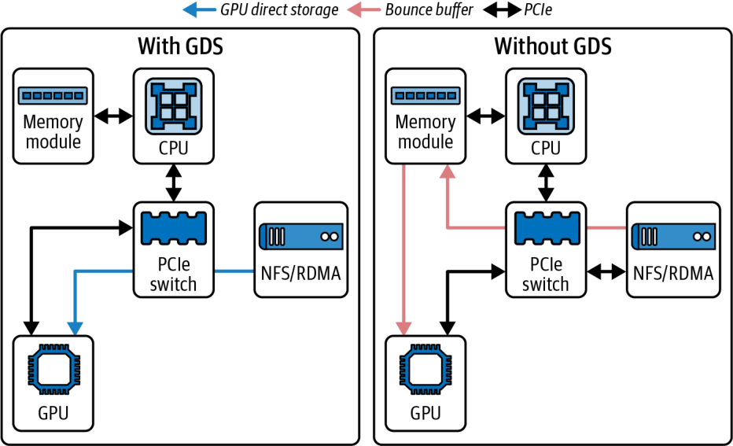
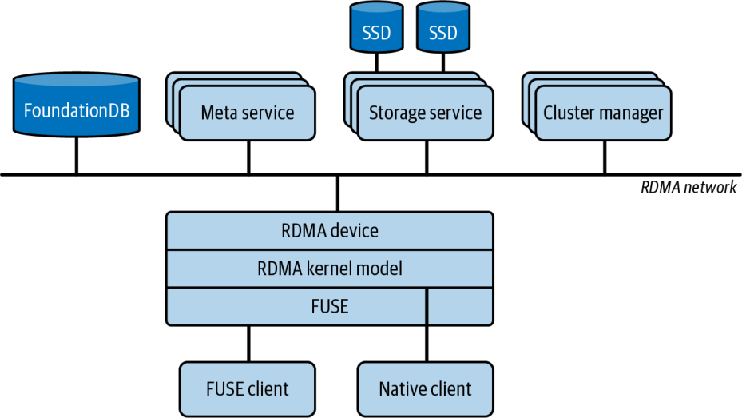

# 第 5 章　基于 GPU 的存储 I/O 优化

对 AI 工作负载而言，向 GPU 供给数据与计算本身同等重要。设想这样一个场景：一个 100 万亿参数的模型正在数千块 GPU 上训练。这样的模型可能要处理数十亿条训练样本，包括 token、图像、音频、视频等。

这意味着必须从存储中读取海量数据，并尽可能快地送入 GPU。如果存储流水线（pipeline）过慢，GPU 就会“挨饿”而闲置。尽管我们已经讨论过种种精巧的通信优化，这种情况仍会导致利用率低下。

本章讨论存储与输入流水线的优化。具体而言，本章将展示如何从磁盘或远程存储高效读取数据、如何对其进行预处理，以及如何让其 I/O 与 GPU 计算相互重叠。

## 快速存储与数据局部性

大型模型训练任务通常需要读取超大数据集。对大语言模型来说，拥有数十亿乃至数万亿条训练样本是很常见的。对语言模型而言，这意味着 TB 量级的文本数据；对视觉模型而言，则是 PB 量级的图像。

在超大规模（ultrascale）下，你的存储系统必须持续提供庞大的吞吐量，才能跟上可能连续运行数月之久的成千上万乃至数百万块 GPU。将 NVMe SSD 就近部署在机架内——或采用带机架本地交换拓扑的 NVMe over Fabrics（NVMe-oF）——可以最大限度地减少网络跳数，并提升性能一致性。

如果你的数据存放在网络附加存储（如 NFS 服务器）或云对象存储（例如 Amazon S3）中，你就需要确保所有计算节点的聚合读带宽足够。设想这样一个场景：根据模型和批大小（batch size），每块 GPU 需要 200 MB/s 的训练数据才能保持忙碌。如果总共有 8 块 GPU，那么大约需要 1.6 GB/s 的聚合带宽。而像 Blackwell、Rubin 这样的现代高端 GPU，要让它们保持饱和还需要更高的带宽。

以一个搭载 72 块 Blackwell GPU、并在同一 NVLink 域内互连的 NVIDIA Grace Blackwell GB200/GB300 NVL72 机架为例。如果每块 GPU 需要 200 MB/s 的训练数据才能保持忙碌，那么要让全部 72 块 GPU 都保持忙碌，可能需要 14–20 GB/s 的聚合存储吞吐量。对于这类超大规模工作负载，你的存储方案必须相应地扩展。

> 如果你的工作负载流式传输的是体量更大的媒体或多模态（multimodal）样本，请用你实测的每样本字节数（bytes-per-sample）和每秒样本数（samples-per-second）来校准。在这种情况下，聚合需求可能高得多。

一种解决方案是使用更快的本地存储，例如同一机架内的 NVMe SSD——或采用 NVMe-oF 网络拓扑。另一种解决方案是使用像 Lustre 或通用并行文件系统（General Parallel File System，GPFS）这样的并行文件系统，把数据缓存到本地 SSD 上。假设存储系统能跟得上，那么配置多个数据加载线程以让管道保持饱和就很重要。当心 Python GIL！

只要有可能，就把数据放在物理上尽可能靠近计算节点的位置。“靠近”可以指位于同一物理节点上，例如本地的 NVMe SSD 盘；也可以至少是位于同一机架内，通过诸如 NVMe over Fabric（NVME-oF）之类的高速互连或高级存储加速器相连。

对于分布式多节点模型训练，一种常见做法是把数据集分片（sharding）到各节点上，使每个节点主要从自己的本地磁盘读取一部分数据。例如，如果你有 100 TB 数据和 10 个节点，你可以预先把 10 TB 拆分到每个节点的本地存储上。然后每个节点的数据加载器只从自己本地的 10 TB 中读取。这样可以避免因重复读取而使网络饱和——尤其是在数据集大小无法轻松装入 RAM 的情况下。

像 PyTorch 的 DistributedSampler 这样的框架会协调各工作进程（worker），使每个进程在每个轮次（epoch）都拿到一份独一无二的数据切片。这与把数据分片到多个集群节点上的目标高度契合。

## 顺序读 vs 随机读模式

GPU 在处理数据时极其快，但为了效率，它们更希望数据以大块连续的形式被读取。同样，对于大块的顺序读，存储所测得的吞吐量远高于小块的随机读。因此，在准备数据集或存储布局时，请尽量安排为顺序访问。

举例来说，用图像进行训练时，应避免存储数百万个独立的图像文件，因为这会导致磁盘各处出现大量随机寻道。相反，可以考虑把它们存放在少数几个大型二进制文件（例如 Arrow、TFRecord 或 Parquet）、数据库文件、WebDataset tar 文件或类似形式中。在这些情况下，每个文件都包含许多首尾相接的样本，这是理想的。

> 在如今更快的 GPU 面前，把小文件合并成大分片显得更为重要，因为过多的小块随机读会更快地成为瓶颈。而且，尽管大多数现代并行文件系统和对象存储都能处理一定程度的小块随机读，最好还是显式地验证一下性能。

从较大的文件中读取一块数据，自然会在一次读取中获取许多样本。如果使用像 Amazon S3 这样的对象存储，正是出于这个原因，人们通常会提前把较小的对象合并成较大的对象。

此外，调优读取块大小也很重要，因为以 1 MB 为块读取会比以 4 KB 为块读取获得更好的吞吐量，这得益于更低的每次读取开销。许多数据加载器库允许调整缓冲区大小和预取（prefetch）块大小。例如，Python 的 open() 会利用操作系统的预读（read-ahead）缓冲区来加速顺序扫描，但随机读并不会从更大的缓冲区或带缓冲的 I/O 库中获益太多。

相反，你应当把读取批量合并成更大的连续块，或使用高层数据集 API（例如 TFRecordDataset，或 PyTorch 的 IterableDataset 与带可配置预取大小的 DataLoader）。而且，尽管其中许多框架和库在内部已针对大块顺序读做了优化，调优它们的缓冲区和预取参数仍然很重要。

如果你的访问模式仍然必须是随机的，那就通过线程调用 pread()，或使用 Linux 的异步 I/O 接口（如 io_uring），并行地发起多次读取。借助预注册缓冲区和轮询等特性，io_uring 允许以极低的内核开销提交成批的 I/O 请求。它可以通过降低每次系统调用的开销，进一步提升随机读吞吐量。这有助于隐藏延迟并实现高 IOPS。

应当使用针对大规模并发 I/O 优化过的文件系统。在 Linux NVMe 服务器上，XFS 很常见。你应当以 noatime 选项挂载它，以消除每次读取时代价高昂的访问时间更新。对于像 Amazon EFS 这样的网络存储服务，请确保你的 EFS 文件系统处于 Max I/O 性能模式，以获得最高的聚合吞吐量。如果你需要稳定的带宽，可以从默认的 Bursting 吞吐模式切换到 Provisioned 吞吐模式。这些设置能确保你的 I/O 层跟得上庞大的并行 AI 工作负载。

## 为吞吐量调优 NVMe 与文件系统

现代 Linux 使用一种多队列块 I/O 调度器 blk-mq，它把 I/O 分散到各个 CPU 核心上。对于快速的 NVMe SSD，你可能需要调优队列深度和提交队列的数量。通常默认值就够用，但如果你确知你的工作负载是高度顺序化的，那么可以使用 “none” I/O 调度器。

传统的完全公平队列（completely fair queueing，CFQ）调度器已经过时。现代内核默认为 NVMe 使用 none 或 mq-deadline 多队列调度器。这个设置可以通过 /sys/block/<device>/queue/scheduler 查看。“none” 调度器是低延迟工作负载的标准选择。在某些存储设备上，你可能会遇到预算公平队列（budget fair queueing，BFQ）调度器。

> 对于高性能 NVMe，仍然建议使用 none 或 mq-deadline 多队列调度器，以最大化吞吐量。你可以通过 /sys/block/nvme*/queue/scheduler 来验证并设置调度器。它几乎总是开箱即用地配置正确，但花一点时间快速检查一下仍然值得。

另一个调优方面是预读。当内核检测到顺序读时，会自动预读额外的数据。你可以在 /sys/block/<device>/queue/read_ahead_kb 中查看预读设置。例如，默认值很可能被设为 128 KB。如果你在流式读取大文件，可以把它调大到几 MB。这将通过降低系统调用开销并对读取进行流水线化来提升你的吞吐量。这可以通过在设备上使用 blockdev --setra 来完成。

如果使用 NVMe SSD 盘，请确保把它们接入系统上可用的最快接口。并确保你有足够的通道（例如 PCIe），使它们不会成为瓶颈。有时，可以把多块 SSD 用 RAID 0 做条带化，以充分利用这些设备并最大化吞吐量——尤其是在单块盘无法让你的 GPU 饱和的情况下。

Linux 页缓存（page cache）会自动把最近从磁盘读取的数据缓存到 RAM 中。对于大型数据集，你可能会超出可用 RAM 并使缓存发生抖动。但对于中等大小的数据集，热缓存可以极大地加速训练。

如果你的数据（或其中很大一部分）能够装入 RAM（例如，包括 Grace Blackwell Superchip 上的 CPU + GPU 统一内存（unified memory）），你就应当考虑在启动时把它完整地预加载到内存中。这实际上为 GPU 创建了一个超快的内存内缓存，可以极大地减少训练期间的磁盘 I/O。然而，对于 PB 量级的海量数据集，这通常不可行。在这些情况下，用优化过的 I/O 来流式读取数据才是正确的做法。

务必在数据加载中使用多个工作进程（例如 PyTorch 的 DataLoader(num_workers=N)）。这些独立的 CPU 线程/进程会并行地获取并预处理数据，以供给你训练任务中的众多 GPU。找到合适的工作进程数量要靠实测。

我们将在第 13 章和第 14 章深入探讨 PyTorch 的性能调优，但这里值得指出的是，你应当启用 pin_memory=True 并使用 non_blocking=True，以启用主机到设备（host-to-device）拷贝的重叠。而通过设置 persistent_workers=True，你可以避免跨轮次重新生成工作进程的开销。此外，按工作负载调优 prefetch_factor 也很有用。当 num_workers 大于 0 时，prefetch_factor 的默认值为 2。

工作进程太少，GPU 就会闲置；工作进程太多，它们的线程就会开始争抢可用的 CPU 核心和 I/O 带宽。请监控 CPU 使用率和磁盘吞吐量。理想情况下，你希望磁盘吞吐量接近 100% 利用，同时 CPU 上还留有一些余量。

> 对于核心数非常高的 CPU，例如 GB200/GB300 Superchip 中使用的 72 核 NVIDIA Grace CPU，你往往可以使用更多的数据加载器工作进程。只是要留意由过度 I/O 争用引起的收益递减。

## 使用 NVIDIA GDS

GDS 是一项让 GPU 能够直接从存储设备、或通过网络存储栈读取数据，而无需在 CPU 内存中额外创建拷贝的功能。通常，当 GPU 想从 NVMe SSD 读取数据时，数据会先从 SSD 送到 CPU 内存。然后由一次 CUDA 调用把数据从 CPU 内存拷贝到 GPU 内存。

> GDS 与 GPUDirect RDMA 互为补充，因为 GDS 加速的是存储到 GPU（storage-to-GPU）的 DMA，而 GPUDirect RDMA 加速的是网络到 GPU（network-to-GPU）的 DMA。两者都不消除 CPU 的编排职责，但都移除了主机内存中转缓冲区（bounce buffer）。

有了 GDS，GPU 可以向 SSD 或 NIC（network interface card，网卡）发起一次直接内存访问（direct memory access，DMA），把数据搬入自己的 HBM 内存。这就绕过了经由 CPU 路径的那次额外拷贝。GDS 支持本地 NVMe 设备，以及使用 NVMe-oF 的远程存储。

在实践中，GDS 创建了一条直接的 DMA 路径，绕过存储与 GPU 内存之间的主机内存中转缓冲区。这拓宽了 GDS 的适用范围，使其可用于集群文件系统乃至某些对象存储系统。（注意：CPU 仍然负责配置和编排这次 I/O。）

启用 GDS 需要一块现代 NVIDIA GPU 和一套支持直接内存访问的存储栈——以及正确的 NVIDIA 驱动和 CUDA 工具包。通常使用的是本地 NVMe SSD 或 RAID 卷。GDS 的支持取决于文件系统和具备 RDMA 能力的存储栈。截至本书撰写时，受支持的栈包括：在带 O_DIRECT 的 XFS/EXT4 上的本地 NVMe 与 NVMe-oF、NFS over RDMA，以及若干并行文件系统，如 BeeGFS、WekaFS、VAST、IBM Storage Scale，以及其他与 nvidia-fs 集成的方案。

应用程序需要使用正确的 API。你可以使用 CUDA 的 cuFile 库通过 GDS 来读取文件。cuFile 支持诸如自动缓冲区对齐、以及与常见文件系统集成等特性。

从实际角度看，如果你已配置好 GDS，并且你的读取路径使用了 cuFileRead，数据就可以从磁盘直接流向 GPU 内存。这会降低 CPU 利用率（让 CPU 得以去做其他预处理），并且可以提升吞吐量，尤其是在 CPU 成为瓶颈的时候。cuFileRead 直接与 Linux 文件系统集成。你也可以使用 cuFile 的异步 API，例如 cuFileReadAsync 和 cuFileWriteAsync，把存储 I/O 集成到 CUDA 流（stream）上（在第 11 章讨论），以实现重叠和流水线化。

> 尽可能使用 O_DIRECT 以启用直接 DMA 并绕过操作系统页缓存。在现代 GDS 版本中，cuFile 也可以在非 O_DIRECT 的文件描述符上工作，但未对齐可能会带来额外拷贝或降低性能。

许多存储厂商，如 WekaIO、DDN、VAST、Cloudian 等，都已发布支持 GDS 的方案或插件，使其系统能够通过 RDMA 直接把数据送入 GPU 内存。这种生态系统的支持意味着 GDS 可以被企业级网络附加存储（network-attached storage，NAS）和并行文件系统开箱即用地使用。

来自 VAST Data 的报告显示，在某些 AI 工作负载上使用 GDS 可将读吞吐量提升 20%。在他们的案例中，在单块 A100 GPU 上使用 GDS，为顺序读带来了 20% 更高的读吞吐量，在适用时这显著地更接近每块 NIC 100 Gb/s 的链路容量。图 5-1 展示了有 GDS 与无 GDS 的架构。



在左侧，我们看到传统的分级（staged）DMA，它经由主机内存进行拷贝。右侧则是使用 GDS 的直接 GPU 拉取，它绕过了主机内存拷贝并降低了 CPU 利用率。VAST 的一份报告测得，在 NVIDIA Ampere A100 GPU 上读吞吐量提升 20%，而在 Hopper H100 GPU 上提升 30% 以上——这得益于其更高的 NIC 带宽和更重的 CPU 负担。

> 请在你自己的工作负载和网络结构（fabric）上验证，因为提升幅度会随 IO 大小、队列深度、NIC 代际、文件系统实现等因素而变化。

不过，GDS 可能需要调优，并非所有工作负载都能看到巨大提升。如果你的 CPU 本来就能轻松应对数据传输，GDS 或许不会让吞吐量有太大变化。然而，它会降低 CPU 使用率，从而腾出 CPU 去执行数据处理和其他任务。另一方面，如果 CPU 正被大量 memcpy 操作压得饱和，那么 GDS 会带来很大帮助。

使用 GDS 时，必须确保正确地应用了 O_DIRECT 语义和对齐。在存储到 GPU 的数据路径中不使用主机固定内存（pinned memory）。cuFile 会注册 GPU 设备缓冲区，而 nvidia-fs 内核驱动会直接在存储设备或 RDMA NIC 与 GPU 内存之间编排 DMA。它直接与 POSIX 文件描述符集成，因此你可以对常规文件使用 cuFile——包括支持 RDMA 的网络文件系统。

设想有一个仅 1 MB 的微小训练批（batch），并且希望每秒向 GPU 供给 1000 个这样的批。这大约是 1000 MB/s。用 CPU 来完成这次拷贝，轻易就会耗掉几个核心。有了 GDS，GPU 会直接从磁盘拉取这 1000 MB/s，从而腾出 CPU。在更高的速率下——或在数千块 GPU 的规模下——这一点会变得更加明显。

由于训练工作负载压倒性地以读为主，大多数 GDS 性能收益都是在从存储读取数据时评估的。然而，拥有快速的检查点（checkpoint）写入同样重要。对于 RDMA 加速的写入，文件系统必须支持面向 GDS 的 RDMA 写入。

WekaFS 是一家著名的、面向超大规模 AI 训练工作负载的存储供应商。他们提供的并行文件系统随附了支持 GDS 的插件，可通过 RDMA 服务读、写两类工作负载。

## 用 cuda-checkpoint 保存 GPU 状态检查点

在 Linux 上，你可以使用 NVIDIA 的 cuda-checkpoint 工具，配合一款 CPU 进程检查点工具——如用户空间检查点/恢复（Checkpoint/Restore in Userspace，CRIU）——来保存 GPU 状态检查点。cuda-checkpoint 会挂起某个运行中进程内部的 CUDA，等待已提交的工作完成，把设备内存拷贝到由驱动管理的主机分配空间中，并释放 GPU 资源。这样，一个 CPU 侧的检查点工具就可以对该进程做快照。

挂起路径会锁定 CUDA 驱动的入口点，排空尚未完成的工作，把设备内存拷贝到主机，并释放 GPU 资源。在估算挂起时间时，要考虑正在使用的设备内存量——以及挂起期间可用的主机链路带宽。

由于驱动会在挂起阶段把设备内存拷贝到主机分配空间中，有效的挂起时间受内存镜像大小和你的平台互连所限。你应当在锁定和检查点调用前后用 Nsight Systems 标记进行性能剖析（profiling），以验证挂起阶段实际花费的时间。

当你想让进程恢复时，驱动会重新获取 GPU，把设备内存映射回它们原来的地址，恢复诸如流和上下文之类的 CUDA 对象，然后解锁驱动和进程，以允许 CUDA 调用继续进行。

具体而言，CUDA 驱动 API 暴露了 cuCheckpointProcessLock、cuCheckpointProcessCheckpoint、cuCheckpointProcessRestore 和 cuCheckpointProcessUnlock。恢复要求启用持久化模式（或调用 cuInit），并且它可以重映射到同一芯片类型的不同物理 GPU 上。

需要注意的是，这条路径与框架层面的模型检查点（例如 PyTorch 检查点）是正交的。CUDA 检查点对于长时间运行的训练和推理任务的容错、抢占和迁移很有用。

与使用 GDS 的数据摄取不同，检查点路径并不会直接从 GPU 内存 DMA 到存储。相反，设备内存镜像会先在挂起期间由驱动搬入主机内存。CRIU 随后把该进程内存持久化为检查点镜像。请把它用作对框架的 state-dict 或分片检查点文件的补充，而非替代。

## 用 gdsio 测量 GDS

NVIDIA 提供了一款名为 gdsio 的工具，默认安装在 /usr/local/cuda/gds/tools 下，用于基准测试磁盘与 GPU 之间的 GDS 吞吐量。这非常有用。

使用 GDS 时，看到 10%–20% 甚至更高量级的吞吐量提升并不罕见——尤其是在 CPU 受限的场景下。让我们来看一个例子，用 NVIDIA 的 gdsio 工具，比较一次纯 CPU 中转的读取（“之前”）与一次直接的 GDS 读取（“之后”）。下面是 CLI 命令以及吞吐量/延迟结果：

```
# Before (Storage → CPU Memory only)

# CPU path, host memory, async copies (-x 2)
$ /usr/local/cuda/gds/tools/gdsio \
    -f /mnt/data/large_file \
    -d 0 -w 4 -s 10G -i 1M -I 0 -x 2

Total Throughput: 8.0 GB/s
Average Latency: 1.25 ms
```

这里展示的第一次调用使用 CPU 路径，配合固定主机内存和异步拷贝（-x 2），以读取模式（-I 0）运行，用来采集一个基线。下面的第二次调用则在相同配置下启用 GDS 路径（-x 0），同样以读取模式（-I 0）运行。在比较不同路径时，务必一致地使用传输选择器。对于 gdsio，-x 2 测量的是 CPU 中转的传输，而 -x 0 测量的是 GDS 路径：

```
# After (Storage → GPU Memory using GPUDirect Storage)
#   - same config, GDS path (-x 0) 
$ /usr/local/cuda/gds/tools/gdsio \
    -f /mnt/data/large_file \
    -d 0 -w 4 -s 10G -i 1M -I 0 -x 0

Total Throughput: 9.6 GB/s
Average Latency: 1.00 ms
```

我们可以看到，使用 GDS 创建一条从磁盘直达 GPU 内存的数据路径，把吞吐量提升了 20%，同时平均 I/O 延迟相应下降，如表 5-1 所示。它在做到这一点的同时，还腾出了此前用于经由主机缓冲区搬运数据的 CPU 周期。这个简单的基准测试展示了如何在你的系统中验证 GDS 的收益。

*表 5-1. 使用 GDS 之前与之后的吞吐量和延迟对比*

| 路径 | 吞吐量 | 延迟 |
| --- | --- | --- |
| Storage → CPU（无 GDS） | 8.0 GB/s | 1.25 ms |
| Storage → GPU（有 GDS） | 9.6 GB/s (+20%) | 1.00 ms (–20%) |

在这个例子中，使用 GDS（Storage → GPU）把读吞吐量从 8.0 GB/s 提升到 9.6 GB/s，并把延迟从 1.25 ms 降到 1.00 ms。这相当于吞吐量（更高）和延迟（更低）都改善了约 20%。

## DeepSeek 的 Fire-Flyer 文件系统

DeepSeek 从零开始打造了一款自定义的开源文件系统，名为 Fire-Flyer File System（3FS）。它源于他们的一个观察：AI 工作负载会执行海量的随机读。

这些随机读使得传统的读数据缓存对 LLM 训练和推理工作负载失效——甚至适得其反。通过取消缓存并采用直接文件 I/O，3FS 确保每个请求都直达 NVMe SSD 设备，并避免了浪费性的缓存管理。这种做法类似于优先考虑直接存储访问的现代 HPC 文件系统。因此，3FS 在读取期间最大限度地减少了内核页缓存的介入和主机内存拷贝。

> 3FS 呼应了专门为 AI 协同设计（codesign）存储的趋势。这与 NVIDIA 的 GDS 类似——GDS 旨在与高性能并行文件系统协同工作，以达到类似的直达 GPU 的吞吐量。

3FS 由四个关键组件构成：集群管理器（cluster manager）、元数据服务（metadata service）、存储服务（storage service）和客户端（client）。它们通过像 InfiniBand 或 RoCE 这样具备 RDMA 能力的网络结构互连，以最大限度地减少 CPU 介入和主机侧拷贝。这些组件及其连接如图 5-2 所示。



3FS 是一款基于 Linux 的文件系统，这使其能够兼容现有应用，同时利用 RDMA 读取来实现 GPU 可直接访问的数据传输。元数据被分片并跨多个节点复制，以获得横向扩展（scale-out）的性能。数据路径完全绕过操作系统页缓存，以维持最优吞吐量。

> 如果一个文件系统是在用户空间中用 FUSE 实现的，它将无法提供 GDS 路径，因为 GDS 需要带 O_DIRECT 语义的内核级文件系统集成。只有启用了 GDS 的内核客户端，或经过专门集成的并行文件系统，才能提供直达 GPU 内存的传输。

为了把数据直接送入 GPU 流水线，DeepSeek 在 3FS 中集成了基于 RDMA 的传输。如果你需要一条真正的 GDS 路径，请使用启用了 GDS 的内核文件系统客户端，例如 NVMe、NVMe-oF、BeeGFS、WekaFS、IBM Storage Scale 或 VAST。这样便能以极低的开销，实现直达 GPU 设备内存的异步、零拷贝（zero-copy）数据搬运。

3FS 通过让数据预取和传输能够与 GPU 内核并发运行，补充了本章中让 I/O 与计算相互重叠的各项技术。3FS 实际上把（第 4 章讨论的）级联流水线/波（wave）的概念延伸到了存储层。

DeepSeek 已公开报告 3FS 在大型集群上可达到每秒数 TB 的聚合读吞吐量，在他们的环境中结果高达 7.3 TB/s。在另一个基准测试中，一个大型 3FS 集群在一套由 68 个节点、每节点 10 × 16 TB NVMe SSD 和双 100 Gb/s 组成的 AI-HPC 集群上，达到了约 6.6 TB/s 量级的聚合读吞吐量。它在做到这一点的同时，还并发地以额外 1.4 TB/s 服务后台工作负载。这份报告中的 3FS 吞吐量 6.6 TB/s，远超 Ceph 在相似硬件上约 1.1 TB/s 的水平。

3FS 通过跨节点协调 I/O 来达到这一性能。这种水平的持续带宽有助于防止数据暂存（staging）阶段成为瓶颈——并有助于在训练和推理两类工作负载上都保持 GPU 的高利用率。

DeepSeek 通过打造自己针对随机读优化的文件系统、并将其与 RDMA 优先的数据路径集成，展示了端到端、全栈的性能工程——包括存储设计——对于发挥大规模 AI 系统的全部性能潜力是何等不可或缺。

3FS 展示了重新思考存储层如何能够消除最后残余的 I/O 瓶颈。构建自己的文件系统是一项高级技术，需要大量的前期投入和持续维护。更有可能的是，你会从一个现有的分布式文件系统或对象存储起步。接下来我们就讨论这些。

## 分布式、并行文件系统与对象存储

在多节点上训练时，一种常见的搭建方式是使用像 NFS 服务器这样的共享文件系统，或像 Lustre、GPFS、Ceph 等这样的并行文件系统。有了这些系统，所有节点都能访问同一份数据集。这些文件系统虽然方便，但若配置不当，也可能成为瓶颈。

单个 NFS 服务器虽然搭建简单，但一旦许多节点同时读取，它就很容易成为吞吐量瓶颈。如果你必须使用 NFS，请确保服务器拥有多块高速 NIC。你还应当考虑使用多个 NFS 服务器来拆分数据集，让每个服务器处理一部分数据分区。

对于多 GPU 集群，你只应在诸如几个节点这样的适度规模下考虑 NFS。对于更大的训练集群，单个 NFS 服务器——即便是高端实现——也很可能成为瓶颈。这就是为什么现代 AI 训练集群更青睐并行文件系统和像 Amazon FSx for Lustre 这样的云存储缓存。

> 对于像 Amazon FSx for Lustre 这样的云存储缓存，重要的是验证性能提升，并论证该缓存所带来额外成本的合理性。如果你没有看到预期的性能，请直接与云服务商合作，以验证你的架构并确认你的配置设置。

NFS 还有一些调优参数，如 rsize/wsize（读/写请求大小）。建议使用最大值（例如 1 MB）来提升吞吐量。请确保底层 NFS 存储足够快，采用 NVMe SSD——并可能配置成 RAID 0。另外别忘了检查 NFS 客户端的挂载选项，它们同样应当被调优。

例如，你可以用 rsize=1048576,wsize=1048576,noatime,async 来挂载 NFS 客户端，以使用 1 MiB 块并消除访问时间更新（noatime）。你还可以添加 actimeo=60,lookupcache=pos，把文件属性和目录项缓存 60 秒。这些简单的调整可以大幅降低每请求开销，并提升大型共享数据集上的并行读吞吐量。

像 Amazon S3 这样的对象存储并不是典型的文件系统，但它在 AI 工作负载中非常常见。如果做法过于朴素，训练期间访问对象存储可能会很慢。解决方案通常是把数据暂存（staging）到本地 NVMe SSD 存储上——或在对象存储之上使用一个缓存层（例如在 S3 之上的 Amazon FSx for Lustre）。像 s5cmd 和 aws s3 cp 这样的工具让你可以在训练开始前先把数据下载下来。

> 请确保使用高度并行、经过优化的数据传输工具，例如 AWS S3 C++ SDK 和像 s5cmd 这样的多线程实用工具，以获得最佳性能。

你也可以使用一个流式库，它通过范围请求（range request）从 Amazon S3 读取对象并执行缓存。如果直接从 Amazon S3 读取，请使用尽可能大的请求——并使用多线程的范围 Get 操作。

像 Lustre 和 GPFS 这样的并行文件系统专为高并发和高吞吐量而设计。以 Lustre 的搭建为例，它有多个对象存储目标（Object Storage Target，OST）负责提供数据。通过把文件跨多个 OST 做条带化，你可以成倍地提升吞吐量。如果你有这样一个并行文件系统，请确保你的大型数据文件被跨许多 OST 做了条带化。

跨多台服务器条带化文件意味着文件的各个块分布在不同的服务器上。这就允许并行读取。举例来说，你可以把你的 Arrow、TFRecord 或 Parquet 文件跨 4 个 OST 做条带化。如果每个 OST 提供 500 MB/s，你就可以达到 2 GB/s 的理论峰值读吞吐量。

## 数据的调优、复制与压缩

要调优这些文件系统，请务必查阅文档。例如，在 Lustre 上使用 lfs setstripe，可以为一个大型数据集设置跨 4 个或 8 个 OST 的条带化，以聚合 OST 的带宽。

在训练期间监控文件系统的 I/O，可以使用像 Lustre 的 lmt 这样的工具——或供应商专有的监控工具。你要留意的是存储集群中是否有单个节点变“热”。如果有，你就需要弄清楚原因。其最可能的成因是分片问题，即多得多的读/写落到了较少数量的节点上。

要完全消除网络读取，在某些情况下，你可以选择把数据集复制到计算集群中的每一个节点上。这以每个节点上有足够的存储为前提。这诚然是一种蛮力做法，但它相对常见且非常有效，能够彻底消除网络读取。你会立刻看到性能上的收益——代价是额外的存储。

另一种提升性能的选择是把数据以压缩形式存储在文件系统或对象存储上——并即时（on the fly）解压。例子包括图像（JPEG）和压缩文本（Arrow 和 Parquet）。这可以节省 I/O 带宽，代价是一些额外的 CPU 或 GPU 周期。然而，如果 I/O 是瓶颈，而 CPU 和 GPU 正闲置，那么这是一个合理的权衡。

许多数据流水线已经在这样做了，所以你只需验证一下压缩比，并确保你在流水线的每一个步骤都在使用它。关键是找到一个平衡点，使得解压这一步不会成为瓶颈。

像 nvJPEG 这样的库可以在 GPU 上解码图像。现代 GPU 还新增了片上解压引擎（Decompression Engine），支持 LZ4、Snappy、Deflate 等格式，以加速将数据搬运并解包到 GPU 显存。如果你把压缩后的批数据存放在磁盘上，Blackwell GPU 可以借助解压引擎在流水线内直接完成解压。这样就把 SM（streaming multiprocessor，流式多处理器）解放出来，去运行计算内核这类更有价值的任务。对于 I/O 受限的工作负载，你应优先选用这些压缩格式。

这是把算术运算从 CPU 卸载到 GPU 的又一种方式——例如，在训练期间还可能把数据解码与梯度计算重叠起来。而且，由于 CPU 到 GPU 之间存在高带宽的 NVLink-C2C 互连（双向带宽高达 900 GB/s），你可以避免让 CPU 辅助的各阶段成为瓶颈。

善用这些巧妙的软硬件 GPU 卸载特性，可以进一步把工作负载移出 CPU，并让输入数据流水线保持均衡。关键仍然在于确保解压时间不会取代 I/O 而成为新的瓶颈，否则这些额外的压缩计算很可能就得不偿失了。

## 监控存储 I/O

与任何性能工程任务一样，测量是关键。与监控网络通信类似，用好你手头所有可用的工具来监控存储流水线的通信同样重要。

这些工具包括 Linux 的 iostat、iotop、nvme-cli、perf 和 eBPF。此外，你还可以使用厂商专用的实用工具和仪表盘来监控队列、延迟、预读（read-ahead）效果以及缓存命中率。这些工具有助于展示本地 NVMe 设备的使用情况，并判断在从 NAS 或对象存储读取数据时是否已经把网络链路打满。

也可以考虑使用 Nsight Systems 这类工具来追踪 I/O 等待时间，并可视化其与 GPU 内核的重叠情况。使用 Nsight Systems 的 --trace=gds 选项，它会在时间线上捕获 cuFile API 的活动与追踪信息。你还可以通过 /etc/cufile.json 启用 GDS 的 cuFile 静态追踪点（tracepoint），从而在 Nsight Systems 中看到 cuFile 事件。NVMe 点对点 DMA 路径的内核态计数器不会在 Nsight Systems 中暴露，且并非所有 GDS 软件栈都支持。

另一个工具是 NVIDIA 的 Data Center GPU Manager（DCGM），它会报告有用的 GPU I/O 统计信息。这些 GPU 专用工具与主机操作系统工具相互补充，能更完整地呈现 GPU 因 I/O 而挨饿（starvation）的全貌。

在 PyTorch 中，调用 next(data_iterator) 测量的是 GPU 为等待下一个批次而空闲的总时间。这段时间包含任何后台预取以及 host → device 拷贝——而不仅仅是 Python 数据加载逻辑本身。

如果你想单独隔离出纯粹的数据加载开销，可以临时设置 num_workers=0，这样就没有预取了。然后你就只对迭代器的取数动作计时。你可以单独用一个计时器（或使用 CUDA 事件）来包裹你的 .to("cuda") 或固定内存暂存操作，以捕获 host → device 拷贝的开销。

由于你的瓶颈可能出在 Python 流水线中，也可能出在拷入 GPU 显存的 memcpy 上，你可以通过下面的做法把二者区分开，并将各自的耗时与整体的“GPU 空闲”时间进行比较：

**DataLoader 开销 vs Python 开销**

用 num_workers=0 进行性能剖析（profiling），看看 Python 循环及其变换本身耗时多少。这样就排除了任何后台线程调度的影响。

**host → device 拷贝开销**

只测量设备传输时间：在 Nsight Systems 中查看“Copy”通道（lane），量化把数据暂存进 GPU 缓冲区实际上会让 GPU 停顿多久。你也可以用 torch.cuda.Event 包裹你的 .to("cuda") 调用。

通过将这两项耗时与整体的“GPU 空闲”时间进行比较，你就能知道该去加速 Python 流水线（例如增加 worker、简化变换），还是该去优化 H2D 传输路径（例如使用固定内存、提升互连带宽，或改用 GDS）。

通过监控存储流水线，你可能会发现，比如说，你的 GPU 有 30% 的时间都花在等待数据上。这种情况下，GPU 的整体吞吐量受限于 I/O，因此你会想实施本文提到的一些策略来减少 I/O 停顿、提升计算吞吐。经过调优后，比如说，你的 GPU 也许只有 5% 的时间在等待数据了。你还会看到整体的每秒训练步数（training steps per second）成比例地增长——在本例中提升了 6 倍。

存储与 I/O 优化往往在于消除那些累加起来影响很大的小低效；比如这里 5 ms 的延迟、那里一个小了 10 MB 的缓冲区。但在大规模场景下，修复这些低效会带来巨大差异。归根结底，其要点与前几节相似：让流水线保持满载。在这里，不只是计算流水线，还包括数据流水线。从磁盘到 GPU 显存的每一个环节都应被监控、剖析、分析并改进，以确保数据尽可能连续不断地流入那些 GPU。

## 调优数据流水线

除了原始的存储 I/O 之外，运行在 CPU（或 GPU）上的预处理与数据加载流水线也是整体 AI 工作负载性能的关键一环。一个调优良好的数据流水线能确保 GPU 永远不会因为等待新数据而空闲。此外，让恰当分量的 CPU 工作并行进行、以喂饱 GPU 这头“巨兽”，同样重要。

现代深度学习框架提供了高层 API 来加载和预处理数据。这些 API 可以——而且应该——针对性能进行调优。我们将讨论一些通用策略，以及 NVIDIA 用于高级数据流水线管理的工具，如 DALI 和 NeMo。

### 高效的数据加载与预处理

训练中典型的数据加载过程包括：从存储读取数据，对数据进行解码或反序列化（例如解析 JSON、解码 JPEG），应用一些变换（例如对文本分词、对图像裁剪），以及把数据整理（collate）成批。这些步骤可能是 CPU 密集型的，但如果计算量很大，也可以卸载到 GPU 上。为了保持高吞吐，你可以采用下面介绍的若干技术：

**使用多个工作进程/线程**

如前所述，PyTorch DataLoader 等框架允许你指定 num_workers。每个 worker 并行运行以获取并预处理数据。通常这些是相互独立的进程，以规避 Python GIL（全局解释器锁，Global Interpreter Lock）问题。主进程通过一个队列异步地从这些工作进程获取批次。

**避免 Python 瓶颈**

如果你的数据加载逻辑写在 Python 里，就要警惕繁重的 Python 层处理。如果你看到有纯 Python 代码在循环里逐行对文本分词，这就是一个危险信号。这种情况下，应尽可能改为向量化操作。或者使用 C++/C 绑定来提升性能。针对这类常见任务，已有许多现成的库，包括 Hugging Face 的 Tokenizers 库和 TorchText。它们虽然提供 Python 绑定，但底层是用高速的 Rust/C++ 编写的，追求速度。到这一步，Python 只不过是架在 C/C++ 代码之上、方便易用的接口而已。

**重叠 CPU-GPU**

其思路是让数据准备与 GPU 处理相互重叠。在理想情形下，当 GPU 正在处理批次 N 时，CPU 已经加载并预处理好了批次 N+1，并把它放进固定内存备用。当 GPU 处理完批次 N 时，它只需通过 DMA 拷贝批次 N+1，就能立即开始计算。与此同时，CPU 继续去处理批次 N+2。这种流水线化对性能至关重要。大多数框架在使用多个 worker 时默认就会这么做，但你应当监控以确保它确实在发生。否则，你可能会看到 GPU 在每次迭代开始时因等待更多数据而空闲。

**通过整理张量以批为单位执行操作**

如有可能，你会希望加载器以批（batch）而非单个样本为单位执行操作。例如，你希望用向量化操作一次性对一整批张量施加变换。你可以通过一个自定义的 collate_fn() 来整理该批数据来实现这一点——或者也许直接在训练循环中于 GPU 上完成。这远比对每一行输入数据分别执行这些操作要好。然而，有些变换必须逐样本执行，因此有时你需要先理解工作负载，才能高效地成批与整理。

**在数据加载中使用内存固定**

在 PyTorch DataLoader 中启用 pin_memory=True 会让 host → GPU（H2D）传输更快，并在源数据被固定时允许真正异步的 .to(..., non_blocking=True) 拷贝。由于数据被锁定在 RAM 中、随时可供直接传输，来自固定内存的 DMA 就避免了额外的拷贝和缺页（page fault）。在向 GPU 传输数据时，这几乎总是有益的。请务必设置一个较高的 ulimit -l（或在容器中设置 --ulimit memlock），以避免大块固定缓冲区的分配失败。

**预取批次**

有些框架允许你指定一个预取队列的长度，也就是它应提前加载多少个批次。默认情况下，PyTorch 的 DataLoader 使用一个保守的取值，比如 prefetch_factor=2。此时，PyTorch 为每个 worker 预取两个批次。在底层，它会保持最多 num_workers * prefetch_factor 个批次排队待用。因此，在阻塞之前，每个 worker 都会加载两个批次的数据。如果你的工作负载存在突发式 I/O——或者你偶尔看到 worker 让 GPU 挨饿——你可以把 prefetch_factor 增大到 4 或 8，例如。下面是一段 PyTorch 代码片段，演示 PyTorch DataLoader 同时使用 pin_memory 和 prefetch_factor=4：

```
import torch
from torch.utils.data import Dataset, DataLoader

# Create a Dataset and DataLoader that prefetches 4 batches
# per worker into pinned CPU memory.
class Synthetic(Dataset):
    def __init__(self, n, shape): self.n, self.shape = n, shape
    def __len__(self): return self.n
    def __getitem__(self, i):
        # Cheap CPU-side work; replace with real parse/decode
        return torch.ones(self.shape,  dtype=torch.float32)

B, C, H, W = 32, 3, 224, 224
dataset = Synthetic(n=100_000, shape=(B, C, H, W))

loader = DataLoader(
    dataset,
    batch_size=B,
    num_workers=8,
    pin_memory=True,
    persistent_workers=True,
    prefetch_factor=4,
  )

copy_stream = torch.cuda.Stream()
compute_stream = torch.cuda.current_stream()

for batch in loader:
    with torch.cuda.stream(copy_stream):
        batch_gpu = batch.to(device, non_blocking=True)
    # ensure pending H2D completes before compute uses it
    with torch.cuda.stream(compute_stream):
        torch.cuda.current_stream().wait_stream(copy_stream)
        outputs = model(batch_gpu)
```

在这个例子里，8 个工作进程各自把大小为 4 的批次预加载进固定内存。因为主机内存已被固定，异步的 .to(device, non_blocking=True) 传输就能使用 DMA 进行高速数据拷贝。

于是，当 GPU 处理当前批次（批次 N）时，DataLoader 已经在并行地准备并传输下一个批次（批次 N+1）。这种重叠至关重要。如果没有固定内存，系统就需要在每次传输时临时固定内存，这会引入不必要的延迟。本质上，固定内存确保数据从 CPU 到 GPU 的传输更快，并与 GPU 计算并发进行，从而最大化整体吞吐。

另一个选项是启用 persistent_workers=True，让 worker 保持存活，并在多个 epoch（轮次）之间持续填充队列。当你在同一个数据集上多次循环时——尤其是当这些迭代（也就是 epoch）非常短时——这最为有效。当 worker 启动因导入模块、打开文件等而带来显著开销时，持久化 worker 也会有帮助。有了持久化 worker，你就避免了在每个 epoch 边界处创建和销毁进程的开销。你的 worker 保持存活，因此能以最小的开销立即开始为下一个 epoch 预取数据。

一个常见的陷阱是在流水线中引入了隐藏的瓶颈。加入调试日志或代价高昂的 CPU 变换，都相对容易造成这种情况。这些延迟可能只在负载下才显现出来。为了捕捉它们，首先要孤立地剖析 DataLoader：在禁用所有下游 GPU 工作的情况下，测量它产出 100 个批次需要多长时间。一旦测得这个基线，就把它与你的目标迭代时间、以及正常训练期间测得的 GPU 总空闲时间进行比较。

如果单是 DataLoader 就太慢，就优化你的 Python 流水线：移除逐元素的日志记录、简化变换，或增加更多 worker。如果孤立测得的加载器速度与真实运行时的加载器速度之间差距很大，那你很可能受限于 host → device 传输或内核启动（kernel-launch）开销。

> 如果你为了孤立剖析 DataLoader 而禁用了 GPU 内核，你同时也减少了 CPU 侧的内核启动开销。因此，你测得的“纯粹”数据加载吞吐往往会低于你在真实训练运行中看到的值。这仍然是一项有用的技术；只是要把这一点记在心里。

### 随 GPU 数量扩展而扩展 worker

当你增加更多 GPU 时，也应扩展你的数据流水线，否则就会让这些设备挨饿。在实践中，这意味着增加 DataLoader 的 worker 数量或 I/O 带宽，以便能喂饱每一块 GPU。这是提高总批大小所必需的，这样每次迭代才能在你数量更多的设备之间搬运更多样本。

只扩展计算而不扩展数据摄取流水线的资源，只会把瓶颈进一步推向数据加载流水线。在多节点、数据并行的配置中，每个 rank 读取一个不同的分片。合在一起，聚合的数据加载工作负载随集群规模而扩展。

> 务必测量 CPU 利用率，因为随着 GPU 训练加速，数据输入流水线将成为瓶颈。

为了维持所需的吞吐，你将需要如前所述的并行、高带宽、分布式的存储后端，以支撑跨集群众多节点的超大规模（ultrascale）数据分片。回想我们前面关于按节点对数据集分片的讨论。具体来说，当你增加更多节点时，要确保每个节点的本地存储都能承担它那一份数据集。

### 使用 NVIDIA DALI 进行多模态数据处理

对于复杂或繁重的数据预处理，NVIDIA 提供了他们的 Data Loading Library（DALI）。DALI 通过把处理搬到 GPU 上、或使用以 C++ 编写的优化 CPU 代码来加速数据处理。它对图像和视频数据尤其有用，因为解码与增强能从 GPU 加速中获益。

例如，DALI 可以在 GPU 上解码 JPEG 图像，并施加随机裁剪、缩放、归一化等增强，全部在 GPU 上完成。这通常比在 CPU 上更快——前提是 GPU 有空闲的算力周期。这就把处理从 CPU 卸载出去，并减少了所需的 CPU worker 数量。

DALI 流水线以声明式方式定义，是由算子（operator）组成的一张静态图。你继承 nvidia.dali.pipeline.Pipeline，并在 define_graph() 中声明你的数据源以及 CPU/GPU 算子。之后，DALI 会使用其自有的线程池和队列，在内部处理执行、预取和线程调度。

如果你的工作负载是输入受限的（例如模型训练），集成 DALI 可能会显著提升吞吐。然而，你必须把它集成进训练循环本身，这会增加一些复杂度，并有一定的学习曲线。

对于分类、目标检测、分割等许多常见工作负载，NVIDIA DALI 提供了预构建的流水线，可在 GPU 上解码图像和视频。这充分利用了 GPU 的媒体加速硬件。

设想一条数据流水线：它读取图像和视频，执行增强，并训练一个目标检测模型。你可能会观察到 CPU 使用率达到 800%，也就是 8 个核心都在 100% 满载运行。但 GPU 仍然偶尔会停顿。

通过使用 DALI，你可能把 CPU 利用率降到 200%，也就是只用两个核心去执行文件读取，而由 GPU 来做真正的图像和视频解码。而且 GPU 可以在计算的同时并发地执行这些读取。

在实践中，真正的加速幅度完全取决于你把 DALI 放在流程中的哪个位置。如果你只是用 DALI 来解压 JPEG，然后立即把原始像素交回给 CPU 去做增强和整理，那你就会引入额外的“主机—设备—主机”往返拷贝，这可能抵消掉使用 DALI 带来的性能收益。

> 使用 DALI 更好的做法，也许是识别出对 GPU 友好的预处理操作，并把它们直接融合进你基于 GPU 的预处理计算图中。大多数预处理都可以借助现有的基于 CUDA 的库来完成，如 TorchVision 和 TensorRT——或者使用自定义 CUDA 内核。这样，你就避免了在 CPU 与 GPU 之间来回过度搬运数据。这可能比在流水线中使用 DALI 带来更高的端到端性能，因此值得一探。

一如既往，要在贴近现实的条件下对端到端系统做基准测试。比较纯 CPU 流水线、启用 DALI 的流水线，以及完全融合的 GPU 计算图实现，以确定哪一种能为你的模型和数据集带来 CPU 节省与 GPU 利用率之间的最佳平衡。

### 使用 NVIDIA NeMo Curator 构建高质量 LLM 数据集

NVIDIA NeMo 是一套用于开发和训练语言模型的工具包。在 NeMo 工具包之内，是 NeMo 那一整套库和框架，其中包括开源的 NeMo Curator 框架。

Curator 帮助为 LLM 训练准备大型多模态数据集。在处理来自不同来源、多达数 TB 的数据时，它很有帮助。Curator 支持诸如清洗、分词、打乱（shuffle）等数据处理步骤。

NeMo Curator 可以把数据集预处理分布到多块 GPU 或多个节点上。这利用多个加速器来更快地准备数据——在拼装数 TB 级的训练数据集时，这是一个重要考量。

此外，Curator 可以把数据压缩并打包成少量的大文件——或者把数据转换成二进制格式，以便机器更容易消费。它还能创建新的合成训练数据集，来补充相对有限、且正变得越来越稀缺的人类数据集。

有了 Curator 在训练过程之前、离线地完成繁重的预处理，在线的训练数据流水线就变得简单许多，因为它只是读取已准备好的数据，也许再做一些轻量的、“最后一公里”的打乱而已。

NeMo Curator 还能通过对数据去重、并移除有问题的内容来强制施加数据质量过滤。这对于 LLM 训练质量和性能都很重要。事先拥有一个结构良好、经过预处理和清洗的数据集，意味着训练流水线能获得结构良好、大小均匀（例如填充到固定长度）的数据的稳定供给，无需在运行时临时对文本分词，也能避免棘手的字符串处理。

如果你能用上 NeMo Curator 这类工具，明智之举是善加利用，让你的训练作业主要是 GPU 的前向和反向传播——而不是在处理文本、读取数百万个随机大小的小文件。对于基于 NeMo 的训练，预处理后的数据集通常存储为可内存映射的 .bin 数据文件，并配有 .idx 索引文件。NeMo Curator 的 DocumentDataset 随后读写分片的 JSONL 或 Parquet。当你构建带索引的数据集时，会处理下游到 .bin/.idx 的转换。

> 你或许可以考虑把数据以 N 种不同方式打乱后各存一份、共 N 份，以避免在 N 个训练 epoch 中付出运行时打乱的开销。显而易见的取舍是磁盘空间和内存，但这是一个值得考虑的取舍。

总的来说，请在训练之前先准备好你的数据。你几乎永远不应该用原始文本来训练。离线预处理数据也许要花些时间，但长远来看是值得的，它换来更快的训练运行、更迅速的迭代，以及更可预测的扩展。

这里描述的所有技术，都是为了绝不让数据加载流水线害得你昂贵的 GPU 集群闲坐着。如果数据流水线无法足够快地供给输入，性能再高的 GPU 也毫无用处。因此，需要在所有层面——包括存储、网络、CPU 和 GPU——采取一种整体的、全栈式的优化方法。

> NeMo 的数据加载仍然运行在 CPU 上。要绕过 CPU I/O，你需要把它与 GDS 之类的工具集成起来。

在许多情况下，优化数据流水线带来的改进，比任何算法层面的微调都要大。一条调优糟糕的输入流水线可能浪费掉你 50% 的 GPU 时间，而算法优化也许只能带来百分之几的提升。

## 持续性能剖析与调优工作流

性能工程是一个迭代过程。为确保你的分布式训练或推理应用在你扩展或修改它时仍保持高效，你应当采用一套持续性能剖析与调优的工作流。这意味着定期收集性能数据、识别瓶颈、应用优化，然后再次测量。

随着时间推移，硬件和软件的更新会改变最优设置，因此你需要持续地剖析与调优。为了走在前面，注重性能的工程团队常常维护性能仪表盘，以追踪诸如样本数/秒（samples/sec）随时间变化的指标。

考虑设置自动化的夜间运行，来剖析你的训练和推理工作负载。这样，你就能捕捉到性能回退或改进，并把它们追溯到具体的代码改动。

我们来看一个典型的工作流，以及一组可以广泛应用于所有性能剖析与调试场景的最佳实践——而不仅仅局限于本章描述的主题：

**建立基线**

从单块 GPU 或一个最小化配置开始，测量性能，例如以样本数/秒衡量的训练吞吐，或以毫秒衡量的推理延迟（但愿如此！）。然后扩展到单节点上的多块 GPU，再扩展到多个节点——每一次都用整体吞吐这类高层指标来分析性能是如何扩展的。理想情况下，对于一个简单的数据并行工作负载，N 块 GPU 应带来 N 倍的吞吐。如果你看到远低于这个数值，那就说明你的系统承受了过多开销。下一步是量化这个瓶颈。例如，8 块 GPU 只带来 5 倍的吞吐提升，说明这个系统的效率只有 62.5%。这并不理想。

**剖析多 GPU 运行以定位瓶颈**

为诊断瓶颈的确切成因，我们要深入下去，对整个多 GPU 作业使用 Nsight Systems（nsys）这类系统级剖析工具，以获得时间花在何处的总体概览。第一步是查看 GPU 利用率时间线。GPU 是否频繁停顿？如果是，它们在等什么？也要检查 CPU 时间线。主进程是否落后于其他工作进程？是否存在每个线程都在等待的同步点？例如，如果 GPU 在模型训练中的梯度 all-reduce 期间空闲，你就知道通信是瓶颈。如果它们在每次迭代开始时空闲，那也许数据加载或某个特定内核才是瓶颈。

**必要时放大到特定内核**

如果你判定某个 GPU 操作（网络或计算）运行得比预期慢，你可以对那个内核使用 Nsight Compute（ncu）深入下去，检查其效率。例如，在我们前面的讨论中，我们查看了一个 NCCL 内核，发现当通信走 PCIe 而非 NVLink 时，SM 利用率只有 60%，且内存停顿计数器很高。在把通信优化为使用 NVLink 之后，SM 利用率升到了 90% 的 SM 繁忙率——测得的内存停顿也更少。这种深入剖析可以确认一个内核究竟是网络带宽受限、访存带宽受限，还是计算受限。它必属其一。

**找出成因**

一旦你发现了瓶颈，就把它映射到一组假设的成因上，并逐一验证（或证伪）它们。例如，如果瓶颈是网络受限，也许你没有使用 RDMA、或者你的消息尺寸太小、或者你需要更好的重叠，等等。如果 GPU 空闲等待其他 GPU，你可能遇到了掉队者（straggler）情形，即某块 GPU 由于数据不均衡而比其他 GPU 做了更多工作。如果你的工作负载是 CPU 受限，也许数据加载器配置不正确，或者存在某个更适合放到 GPU 上的 CPU 聚合操作，等等。如果瓶颈在 GPU 上是访存受限，也许某些内核在寄存器与 HBM 显存之间传输了过多数据，那你可以试着减小批大小或引入内核融合，等等。

**应用修复或优化**

在跑完你的各种假设、找到真正的成因之后，现在就该采取行动了。对于网络与通信瓶颈的修复，要确保启用了 GPUDirect RDMA；如果你有多块 NIC（network interface card，网卡）却仍受网络带宽限制，就增大 NCCL_NSOCKS_PERTHREAD；并考虑使用诸如梯度压缩之类的技术来压缩数据（我们会在后面的章节介绍）。如果你在跨 NUMA 节点，可以尝试一种分层的方法，或者配置 NCCL 拓扑以让每个 NUMA 节点使用更少的 GPU，等等。

对于节点内拓扑问题，如果你的 GPU 分散在多个 PCIe 交换机上，尽可能尝试把作业绑定到单个 NUMA 节点的 GPU 上，以避免慢速互连——或者使用更具拓扑感知能力的算法。对于 CPU 和数据方面的问题，检查数据加载器是否太慢。这种情况下，增加更多工作进程/线程，或者例如用 DALI 把部分预处理移到 GPU 上。又或者提前做更多离线预处理。如果某块 GPU 更慢，也许是在做额外的校验或日志记录，那就试着减少这部分工作，或用异步操作把它移出关键路径。

如果同步是个问题，就移除你代码中那些可能在无意间把执行串行化的、不必要的 torch.cuda.synchronize() 调用或屏障（barrier）（第 13 章会有更多讨论）。如果环境需要调优，也许在需要时设置 NCCL_IGNORE_CPU_AFFINITY=1。或者把 CPU 线程绑定到不同的拓扑配置上，等等。只需相对少量的努力，有时仅凭几处小改动，就能把非常糟糕的资源利用率变成最大化的利用率（当然说起来容易做起来难，但保持乐观总是好的！）：

**每次改动后都重新测量**

与任何调试工作一样，重要的是一次只改动一两处东西——然后测量。否则，你将无从知道是哪处改动起了作用。当你在当前配置上实现了良好的扩展时，记下那些好的指标值，并在扩展过程中力求维持这些好的取值。

**保持软件更新，但始终要验证**

NCCL 或 CUDA 的新版本往往带来能提升性能的改进。例如，更新的 NCCL 可能会自动做某种分层处理，或使用某种通信/计算重叠机制。又或者一次 PyTorch 更新能降低 DDP 开销，或引入一个更高效的分布式优化器。然而，每次更新都可能因改变最优设置而带来不稳定。请再次运行你的剖析工作流，确保你维持住了上一个已知良好系统配置的那些好指标值。

**善用现代硬件特性**

假设你突然拿到了拥有更多统一内存（unified memory）、更大访存带宽和更快互连的最新硬件。第一步是理解这些新改进，并加以善用。你现在可以使用更大的输入数据批大小，并把更大的模型装进内存。只是务必要缓慢地加大力度，并监控资源利用率。如果你扩展得太激进，就会把这些崭新且更强的资源打满——然后不得不把整个剖析与调优工作流从头再来一遍！

**在生产环境中自动化监控**

如果你经常运行大型的训练和推理工作负载，在生产环境中始终保持一套一致的监控设置总是有好处的，以便持续地剖析 GPU 利用率、网络吞吐和内存吞吐随时间的变化。这样，如果某个作业或推理请求由于环境问题、内核更新或数据流水线回退而运行得比预期慢，你就能迅速发现。Kubernetes 和其他作业调度器都能与监控工具很好地集成。例如，可以设置告警：当利用率降到某个阈值以下时触发。

**记录并传授**

性能调优往往涉及团队中的隐性知识，比如哪些环境变量被覆盖了、哪些库版本有 bug，等等。请把这些发现直接记录在代码或配置文件里，这样其他人（或未来的你）每次打开这些文件时都会被提醒。例如，注明“在这套集群配置中，我们发现设置 NCCL_SOCKET_NTHREADS=2 把多节点吞吐提升了 10%”。但愿这已成为一种标准做法。

通过持续遵循这套工作流，你实质上创建了一个反馈回路：运行 → 测量 → 调优 → 运行 → 测量 → 调优 →……这个反馈回路确保，当你扩展到更多 GPU、迁移到更好的模型时，你能持续维持系统的性能与效率。维持良好性能，要比在性能经过一段时间退化之后再把它找回来容易得多。要让如此众多的活动部件都保持在最高水准运转，这是一场持久战。

总而言之，要像对待一项需要不断测试和验证的功能那样来对待性能。正如你为代码正确性编写测试一样，你也应该为性能装配测试。例如，把 GPU 数量翻倍是否会让吞吐大致翻倍？如果没有，就用剖析器深入进去，启动这套剖析与调优工作流。推荐把 Nsight Systems 用于高层系统视图、Nsight Compute 用于底层 GPU 内核剖析，以及 NCCL 和 PyTorch 的日志记录结合起来使用。合在一起，它们能给你一套全面的工具箱，在问题出现时精准定位。

在这个过程结束时，你将拥有一套精细调优的 AI 系统。而每当你更新代码或硬件时，就再迭代一次。在 AI 这样动态、快速演进的环境中，性能调优永远没有尽头。但当你知道该找什么时，它会变得越来越轻松。这正是你阅读本书的原因所在！

## 诊断通信受限 vs 计算受限的工作负载

要弄清在（比如说）一个模型训练工作负载中，究竟是计算还是通信才是限制因素，你可以改变计算与通信的比例，看看这如何影响在 NIC 上测得的、以 GB/s 衡量的实际网络吞吐。考虑剖析一个训练作业的反向传播。它目前显示，你的梯度 all-reduce 在一块 100 GB/s 的 NIC 上只用到了 60 GB/s。

要判断在这种场景下究竟是网络拥塞、还是 GPU 太慢，你可以固定通信量，并通过增大/减小批大小（batch size）来增加/减少计算量。这样做非常合适，因为增大批大小并不会改变反向传播中梯度 all-reduce 所传输的数据量。原因在于：梯度的数量随模型参数量而变化——而与批大小无关。

在通信量固定的前提下，将批大小减半，观察它对实测网络吞吐量的影响。如果吞吐量仍保持在 60 GB/s，说明 GPU 本可以做更多工作，但网络不允许它们做更多——因此网络是限制因素。

然而，如果实测网络利用率从 60 GB/s 下降到比如 40 GB/s，那就是 GPU 在“饿着”网络：它们没能足够快地完成计算，无法让 NIC 保持繁忙。在这种情况下，网络处于空闲状态，等待 GPU 传来更多数据。因此计算才是限制因素，而非网络。

你还可以通过反向实验、把批大小翻倍来进一步验证这一假设。同样，all-reduce 梯度通信量保持不变。所以，如果通信才是真正的瓶颈，你会看到随着批大小与计算负载增加，NIC 依旧稳定在 60 GB/s。但如果计算才是瓶颈，那么 all-reduce 通信在整个迭代时间中所占的比例将相对于不断增长的计算时间而缩小。

在这两个实验中，同时观察 NIC 上的绝对 GB/s 值，以及通信相对于计算所占的相对时间，就能精确定位到底该调优哪个子系统。更具体地说，你可以在增大/减小批大小的过程中，绘制 GB/s 与通信占比的关系曲线。这会精确地显示 roofline 的位置，并判断该工作负载是通信受限（网络）还是计算受限（GPU SMs）。

> 使用 Nsight Systems 获取端到端的时间线。如果你看到 GPU 处于空闲、正在等待数据——表现为计算内核之间出现与 NCCL wait 对应的长间隙——那么你很可能是通信受限。如果 GPU 很忙却达不到预期的 FLOPS，那你很可能是访存受限或计算受限。Nsight Compute 和 PyTorch profiler 可以帮助判断内核的访存效率与计算效率。

## 关键要点

分布式 AI 的峰值性能来自对整个技术栈的协同优化——从 GPU 内核、网络传输，到 CPU 线程和存储。其中任何一个环节的短板都可能成为整个系统的瓶颈。以下是调优存储层时需要牢记的关键经验：

**在扩展算力的同时，也要扩展输入数据流水线**

扩展 GPU 时，不要忽视存储与数据加载。要确保你的存储系统能提供足够的带宽——并且你确实充分利用了这些带宽。让数据加载器的并行度随 GPU 数量的增加而同步提升。否则，你会到达一个临界点：继续增加 GPU 也不再带来任何加速，因为你的输入流水线跟不上了。

**为任务选择合适的工具**

NCCL 专为可扩展的集合通信（all-reduce 等）设计，常用于模型训练。NIXL 面向模型推理中常见的高吞吐点对点传输与流式传输。当负载以 token 流式传输为主时，使用 NIXL；相反，对于大批量集合通信与对称内存（symmetric-memory）模式，则优先选择 NCCL/NVSHMEM。GPUDirect RDMA 和 GDS 分别为网络与存储 I/O 消除了主机内存中转缓冲区，而 CPU 仍负责调度和控制传输。在多 GPU 训练中，始终使用 DistributedDataParallel 而非 DataParallel。这些专门打造的库和框架之所以存在——并且经过大量调优——就是为了榨干硬件的性能。善用它们，而不要重复造轮子。

**做端到端的性能剖析**

瓶颈所在并不总是显而易见。使用 Nsight Systems、Nsight Compute 和 PyTorch profiler 这类剖析器，看看时间都花在了哪里。GPU 无非是计算受限、通信受限或 I/O 受限这三种情况之一。遵循我们前面讨论过的剖析示例，可以帮助你追溯到问题的根源。例如，你可以验证 NCCL 内核是否与计算恰当地交织在一起，并在 Nsight Systems 中检查 GPU 的空闲时间。

## 结论

高性能的分布式存储系统是调优大型、复杂 AI 系统的基础组件。通过集成 NVMe SSD 和 GDS 等先进存储技术，你可以提升数据加载流水线的性能、缩短训练时间，并加快实验与迭代的速度。

通过离线预处理数据流水线、高效数据缓存、异步通信等手段来应对存储与 I/O 方面的挑战，现代 AI 部署即便在模型复杂度和数据集规模不断攀升的情况下，也能持续保持高吞吐量。

对从业者而言，要点在于：你无需从零发明定制的 I/O 方案。NVIDIA 和开源社区已经提供了经过高度调优、专门打造的库和工具，让你可以专注于模型、数据和应用逻辑，而不是底层的“管道铺设”工作。

对性能工程师而言，教训在于：快速的数据搬运与原始算力同等关键。世界上最快的 GPU，如果总是在等待存储传来的数据，那它带来的收益也微乎其微。

GDS 和先进的输入流水线等技术，是保持数据顺畅流动、让 GPU 始终有活可干的全栈方法的一部分。通过利用这些技术并持续进行性能剖析与调优，你可以推动分布式 AI 系统在大规模下更接近其理论峰值极限。

在接下来的几章中，我们将在这一基础之上，深入探讨 CUDA 与 PyTorch 的优化策略，以及一些高级系统调优主题。当我们继续让通信/计算重叠、利用尽可能最快的链路、并逼近硬件的理论最高性能时，这里学到的原则将在技术栈的每一层持续适用。最终，这一切都将带来更快的洞察获取速度、更好的资源利用率以及成本节约。
